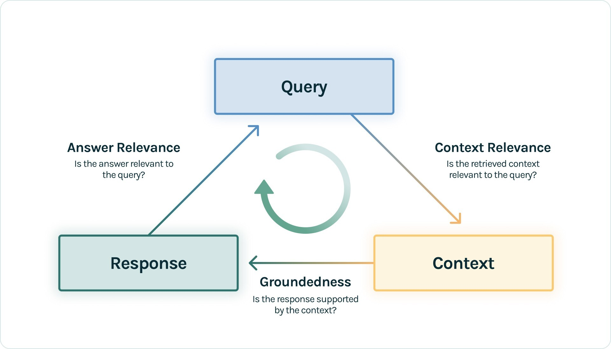
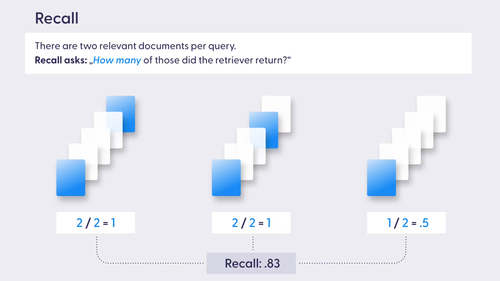
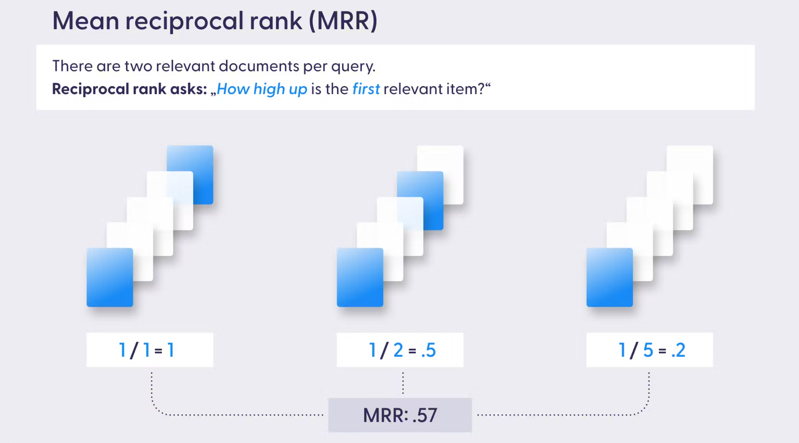
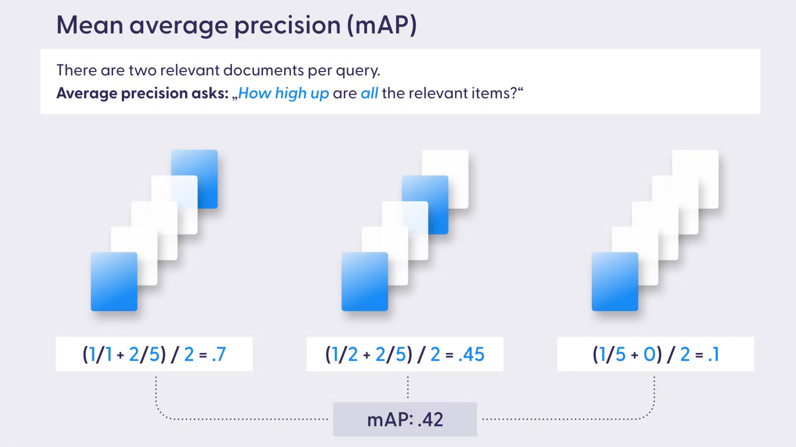
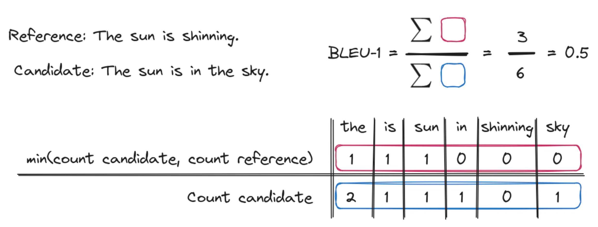

本文从 RAG 的检索与增强生成两个阶段和 RAG TRIAD 出发，介绍了一套完整 RAG 系统评测的指标体系。通过熟悉这些指标概念，借助合适的评估框架和工具，可以快速进行 RAG 系统监控和定量评估，从而显著提升 RAG 系统的性能，为用户提供更准确、更可靠的服务。

## RAG 评估分析

[RAG](https://blog.csdn.net/ChaoMing_H/article/details/140858701) 从模型外部获取知识来增强 LLM 生成内容的准确性和可靠性。那么应该如何对 RAG 系统带来的增强效果与影响程度呢？

RAG 系统的核心就是检索（Retrieval）与增强生产（Augmentation & Generation）。在检索阶段，RAG 找到一组与用户查询或任务（Query）最相关的知识；在增强生成阶段，RAG 将检索到的知识作为上下文（Context）与 Query 结合输入到 LLM，最终生成响应结果（Answer）。总的来说，谈论对 RAG 系统性能的评估，就是对这两个阶段的 Query、Context、Answer 这三个对象（TruLens 将之归纳为 RAG 三元组，简称 `RAG TRIAD`）的质量评估。

RAG TRIAD 准确描述了 RAG 系统中三个核心维度及三者之间的关系，同时也提供了一个全面的评估视角。RAG TRAID 将 Query 到 Context 的转换性能归为上下文相关性（Context Relevance），将 Context 到 Response 的转换性能归为事实一致性（Faithfulness），将 Response 到 Query 的相关性能归为答案相关性（Answer Relevance）。

- `上下文相关性`（`Context Relevance`）：评估的是检索的质量，通过检索到的内容是否与用户查询或任务足够相关来衡量。
- `事实一致性`（`Faithfulness`）：评估的是增强生成的质量，通过生成内容是否准确无误，是否真实地基于检索到的内容来衡量。
- `答案相关性`（`Answer Relevance`）：评估的是增强生成的质量，通过生成内容是否对用户查询提供了有用的信息来衡量。

## 上下文相关性

上下文相关性描述的是检索的性能，主要关注于检索到的知识片段与用户查询的相关性。上下文相关性的评估指标有精确度、召回率、平均倒数排名（MRR）、平均准确率（MAP）等。

### 精确度（Accuracy）

精确度衡量的是检索到的相关的知识片段数量与检索到的总知识片段数量之比。例如检索到了 10 个知识片段，其中 7 个是相关的，则精确度为 0.7。高精确度意味着系统返回的知识大多数是用户所需的。

$$
    \text{精确度} = \frac{\text{检索到的相关的知识片段数量}}{\text{检索到的知识片段总数量}}
$$

当无关知识可能带来负面影响，比如在医学信息检索系统中，无关信息可能导致错误的输出，这时的精确度尤为重要。

### 召回率（Recall）

召回率衡量的是检索到的相关的知识片段数量与知识库中相关知识片段总数量之比。高召回率意味着知识库中相关的知识片段大多数都被检索到了。

$$
    \text{召回率} = \frac{\text{检索到的相关的知识片段数量}}{\text{知识库中相关知识片段总数量}}
$$

当不完整的知识可能带来负面影响，比如在法律信息检索系统中，未能检索到完整信息可能导致输掉一场官司，这时的召回率至关重要。

### 精确度 vs. 召回率

所上所说，在无关知识可能引入负面影响时，保持系统的精确度很重要，在知识不完整可能导致负面影响时，召回率很重要。精确度和召回率可能是无法两者同时达到最优的，因此需要根据实际应用场景来决定应该优先考虑哪个指标。也可以通过二者的调和平均数（`F1 分数`）来把握其中的平衡。

$$
    F1 \text{分数} = \frac{ 2 \times \text{精确度} \times \text{召回率} }{\text{精确度} + \text{召回率}}
$$

### 平均倒数排名（MRR）

[MRR](https://www.deepset.ai/blog/rag-evaluation-retrieval) 考虑的是第一个相关文档的排名位置，它衡量的是系统多快能够检索到第一个相关文档。

$$
    MRR = \frac{1}{Q} \sum_{q=1}^{Q}\frac{1}{rank_q}
$$

其中 Q 是检索的次数，$rank_q$ 是每次检索中第一相关知识所处的排名。

当只有最相关的知识片段是主要关注对象，比如客服支持问答系统，客户需要第一时间得到最正确的答案，此时的 MRR 是很重要的。

### 平均准确率（MAP）

MAP 综合考虑了检索的精确度和检索内容的顺序，通过检索到的相关知识的加权得分（排名的倒数）的平均值来衡量。

$$
    MAP = \frac{1}{Q} \sum_{q=1}^{Q} AveragePrecision(q)
$$

其中 Q 是检索的次数，AveragePrecision(q) 是每次检索中相关知识的加权得分（权重为相关度排名 \* 只是顺序的倒数）。

当系统对知识片段的顺序敏感，且需要检索多个知识片段，比如推荐系统向用户推荐相关产品，产品相关度越高，相关度高的产品排名越靠前，用户点击查看产品达到可能性就越大，此时 MAP 将非常有用。

## 事实一致性

事实一致性描述的是增强生成的性能，关注的是生成的结果是否准确，以及是否能够有效地根据检索到的内容生成响应。

- `人工评估`：由专家人工对生产结果的事实一致性进行评估，如人工检查每个响应与知识源，验证是否正确引用了检索到的内容。
- `自动事实检查`：使用自动化工具将生成的结果与已验证事实的数据进行比较，识别其中的不准结果，自动验证结果的有效性。
- `一致性检查`：评估不同问题或任务中是否可以始终生成相同的事实信息，避免模型自相矛盾，确保生成结果的可靠性。

## 答案相关性

答案相关性衡量的是生成结果对用户的查询提供了多少有用的信息。

### 基于向量评估

使用单词的向量表示来衡量生成结果与参考结果之间的语义相似性。例如对生成结果和参考结果的向量向量进行余弦相似度比较，得到生成结果在含义上而非精确匹配的相似度评估。

### 双语评估替代（BLEU）

[BLEU](https://www.elastic.co/search-labs/blog/evaluating-rag-metrics#intrinsic-metrics) 衡量的是生成结果与参考结果的近似度，通过生成结果和参考结果的重叠程度来评估，如 n-gram（n 连字序列）的重叠度。

### 基于召回的概括评估（ROUGE）

[ROUGE（Recall-Oriented Understudy for Gisting Evaluation）](<https://en.wikipedia.org/wiki/ROUGE_(metric)>) 衡量的是生成结果和参考结果之间的 n-gram、词序列和词对的重叠，同时考虑了召回率和精确度。

### 具有明确顺序的翻译评估（METEOR）

[METEOR（Metric for Evaluation of Translation with Explicit Ordering）](https://en.wikipedia.org/wiki/METEOR) 衡量的是生成结果与参考结果之间的相似性，考虑了同义词、词干和词序。

## 结语

[RAG 系统的优化](https://blog.csdn.net/ChaoMing_H/article/details/140883158)离不开对上述指标的不断评估和调整。采用合适的评估框架和工具，如 Llama-Index、Ragas、Continuous Eval、TruLens-Eval 等，结合有效的优化技巧，快速进行 RAG 系统监控和定量评估，可以显著提升 RAG 系统的性能，为用户提供更准确、更可靠的服务。

随着技术的不断进步，我们期待 RAG 系统在未来能够实现更加智能化和个性化的服务。
