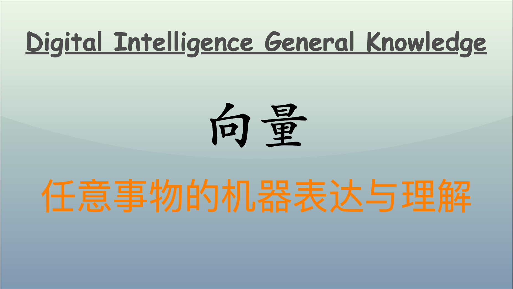

在现代人工智能和深度学习领域，向量发挥着关键作用。它们不仅是一种数学工具，更是将各种信息转化为机器能够理解的形式的桥梁。本文将深入探讨向量的基本概念、在各个领域的应用，以及如何通过向量实现高效的最近邻搜索。



## 向量的基本概念

### 向量的定义

向量被定义为一组有序的数字，通常表示为一维数组。这些数字可以代表任意事物的特征或属性。例如，在情感分析中，我们可以用向量表示文本特征；在图像处理中，向量可以表示颜色或纹理信息；在推荐系统中，用户的偏好通常也用向量表示。这些多维特性使得向量在机器学习中具有广泛的应用。

### 向量的数学特性

- **维度和大小**：向量的维度是其包含的元素数量。例如，三维向量可以表示为 $[x, y, z]$，而二维向量则表示为 $[x, y]$。
- **标量乘法和加法**：向量支持基本的线性运算。对于任意向量 $\mathbf{a}$ 和标量 $c$，标量乘法定义为 $\mathbf{b} = c \cdot \mathbf{a}$。加法则为 $\mathbf{c} = \mathbf{a} + \mathbf{b}$。

### 向量编码

我们可以用向量对一些简单数据进行编码。例如，假设我们有三个用户及其观看电影的评分数据：

| 用户   | 电影 A | 电影 B | 电影 C |
| ------ | ------ | ------ | ------ |
| 用户 1 | 5      | 3      | 4      |
| 用户 2 | 2      | 4      | 3      |
| 用户 3 | 3      | 2      | 5      |

将其转化为向量，可表示为：

- 用户 1：$\mathbf{u_1} = [5, 3, 4]$
- 用户 2：$\mathbf{u_2} = [2, 4, 3]$
- 用户 3：$\mathbf{u_3} = [3, 2, 5]$

这种编码方式使得计算相似度和推荐变得更加简单和直观。

### 简单向量运算

```python
import numpy as np

# 定义用户评分向量
user1 = np.array([5, 3, 4])
user2 = np.array([2, 4, 3])

# 向量加法
sum_vector = user1 + user2

# 标量乘法
scaled_vector = 2 * user1

print("用户1与用户2的评分和:", sum_vector)
print("用户1评分的标量乘法结果:", scaled_vector)
```

### 示例：电影推荐系统

在一个实际的电影推荐系统中，我们可以使用用户对影片的评分数据来生成用户的向量表示，并使用这些向量来计算用户之间的相似度。例如，利用余弦相似度计算用户的相似性，推荐新的电影给用户。代码的实现可以如下：

```python
from sklearn.metrics.pairwise import cosine_similarity

# 用户评分矩阵
ratings = np.array([
    [5, 3, 4],
    [2, 4, 3],
    [3, 2, 5]
])

# 计算用户之间的余弦相似度
similarity_matrix = cosine_similarity(ratings)

print("用户之间的相似度矩阵:\n", similarity_matrix)
```

## 向量的用法

### 向量与机器学习

向量在许多领域中都有重要应用，包括机器学习、数据分析和信息检索。在机器学习中，向量能够有效表示数据特征，从而用于模型的训练和预测。在推荐系统中，通过计算向量之间的距离，可以得到用户和产品之间的相似性；在自然语言处理方面，词向量（如 Word2Vec 或 GloVe）可以将文本信息转换为机器可处理的数值形式。

### 回归模型

我们可以使用线性回归来预测某种销量数据。假设我们有不同产品的特征（如价格、评分）的向量表示。

| 产品 | 价格 | 评分 | 销量 |
| ---- | ---- | ---- | ---- |
| A    | 10   | 4.5  | 200  |
| B    | 20   | 4.0  | 150  |
| C    | 15   | 3.5  | 100  |

我们将特征数据编码为向量，并使用线性模型进行训练。

### 线性回归

```python
from sklearn.linear_model import LinearRegression

# 定义特征和目标变量
X = np.array([[10, 4.5],
              [20, 4.0],
              [15, 3.5]])
y = np.array([200, 150, 100])

# 线性回归模型
model = LinearRegression()
model.fit(X, y)

# 预测新的销量
new_product = np.array([[18, 4.2]])
predicted_sales = model.predict(new_product)

print("预测的销量:", predicted_sales)
```

### 示例：产品销量预测

在商业中，我们通常需要预测新产品的销量。可以依赖于历史数据构建模型，使用特征向量进行预测。例如，在电商平台，对新上市产品进行特征提取，通过已有的数据进行销量预估。

```python
# 历史销量数据
sales_data = np.array([
    [10, 4.5, 200],
    [20, 4.0, 150],
    [15, 3.5, 100]
])

# 提取特征和标签
X = sales_data[:, :-1]
y = sales_data[:, -1]

# 训练模型
model.fit(X, y)

# 预测新产品
new_product = np.array([[18, 4.2]])
predicted_sales = model.predict(new_product)

print("新产品的销量预测:", predicted_sales)
```

## 向量与最近邻搜索

在多维空间中，快速的最近邻搜索对于许多应用至关重要，比如图像检索、文本推荐和语音识别。传统的暴力搜索方法在处理大规模数据时往往效率低下，因此引入了高效最近邻搜索算法是非常重要的。

### 最近邻搜索

向量的结构特性使得我们可以设计高效的算法，利用这些算法来执行最近邻搜索。常用的几种方法包括 KD 树、Ball 树、以及基础的暴力搜索。

### KD 树实现

我们可以使用 KD 树来提高搜索的速度和效率。KD 树通过将数据划分为二叉树结构，使得搜索过程的时间复杂度降低为对数级别。

```python
from sklearn.neighbors import KDTree

# 定义一个简单的数据集
data = np.array([[1, 2], [3, 4], [5, 6], [7, 8], [9, 10]])

# 构建KD树
kdtree = KDTree(data)

# 查找最近的一个邻居
dist, ind = kdtree.query([[5, 5]], k=1)

print("最近邻的索引:", ind)
print("距离:", dist)
```

### 示例：图像检索

在图像检索中，使用向量表示图像特征是常见的做法。可以将每幅图像编码为一个向量，然后通过构建 KD 树来进行快速的相似图像搜索。利用先前的向量数据，可以高效检索出与用户输入的图像最相似的相关图像。

```python
# 假设我们有多个图像的特征向量
image_features = np.array([
    [0.1, 0.2],
    [0.9, 0.8],
    [0.4, 0.5],
    [0.9, 0.1]
])

# 构建KD树
image_tree = KDTree(image_features)

# 查找与查询图像的特征最相似的图像
query_image = np.array([[0.5, 0.6]])
dist, ind = image_tree.query(query_image, k=2)

print("最相似图像的索引:", ind)
print("距离:", dist)
```

## 向量与自然语言处理（NLP）

### 自然语言处理与词向量

在自然语言处理领域，向量被用来将文本信息转化为机器可理解的数字表示。通过将文本转换为向量，机器能够进行情感分析、文本分类、命名实体识别等多种任务。词向量（Word Embeddings）是用于表示单词的标准方法之一，它在一定的上下文中捕捉了单词的语义关系。

词向量通过使相似意义的词在向量空间中相互接近来实现语义建模。常见的词向量生成方法包括 Word2Vec 和 GloVe。Word2Vec 主要使用两种模型：Skip-Gram 和 CBOW（Continuous Bag of Words）。Skip-Gram 模型试图预测一个词的上下文，而 CBOW 则试图通过上下文预测目标词。

### 模拟数据推演

假设我们有以下句子：“猫 喜欢 鱼” 和 “狗 喜欢 骨头”。我们可以通过训练 Word2Vec 模型生成词向量，来表示这些词。

**数据准备**

- 给定初始数据：

```
句子1: 猫 喜欢 鱼
句子2: 狗 喜欢 骨头
```

- 建立词典，并为每个词分配唯一的索引：

| 单词 | 索引 |
| ---- | ---- |
| 猫   | 0    |
| 喜欢 | 1    |
| 鱼   | 2    |
| 狗   | 3    |
| 骨头 | 4    |

**使用 Word2Vec 生成词向量**

```python
from gensim.models import Word2Vec

# 准备数据，句子分词
sentences = [["猫", "喜欢", "鱼"], ["狗", "喜欢", "骨头"]]

# 训练Word2Vec模型
model = Word2Vec(sentences, vector_size=10, window=2, min_count=1, workers=4)

# 获取“猫”的词向量
cat_vector = model.wv["猫"]
print("猫的词向量:", cat_vector)
```

### 示例：情感分析

在情感分析任务中，我们可以通过将每个句子的单词转化为词向量，并对它们进行求和或平均，从而为整个句子生成一个特征向量。这一特征向量可以用作分类模型的输入，帮助机器判断句子的情感倾向。

```python
import numpy as np

# 定义句子
sentence1 = ["猫", "喜欢", "鱼"]
sentence2 = ["狗", "不喜欢", "骨头"]

def get_sentence_vector(sentence, model):
    # 用Word2Vec模型生成句子的词向量
    word_vectors = []
    for word in sentence:
        if word in model.wv:
            word_vectors.append(model.wv[word])
    if word_vectors:
        return np.mean(word_vectors, axis=0)
    else:
        return np.zeros(model.vector_size)

# 计算句子的向量
vec1 = get_sentence_vector(sentence1, model)
vec2 = get_sentence_vector(sentence2, model)

# 输出句子向量
print("句子1的向量:", vec1)
print("句子2的向量:", vec2)
```

## 向量与计算机视觉

### 计算机视觉与图像特征

在计算机视觉中，向量用于表示图像的特征。这些特征可以通过卷积神经网络（CNN）提取出来，并用于分类、检测、分割以及图像检索等任务。通过将图像转换为向量，我们可以利用机器学习算法进行高效处理。

通过 CNN 提取图像特征的过程通常包含多个卷积层和池化层，最终产生一个高维向量表示图像的各种特征。这些特征可以捕捉到图像的形状、颜色和纹理等信息。

### 模拟数据推演

假设我们有一组图像并希望提取它们的特征。对于每幅图像，经过 CNN 处理后，我们获得一个 128 维的向量表示。

**模拟图像特征生成**

- 假设我们有三幅图像，它们经过卷积网络提取特征后，分别被表示为：

```
图像1: [0.1, 0.2, ..., 0.3]  # 128维向量
图像2: [0.4, 0.1, ..., 0.5]
图像3: [0.2, 0.6, ..., 0.8]
```

**图像特征向量提取**

```python
import numpy as np

# 模拟生成的图像特征向量
image_features = np.array([
    np.random.rand(128),
    np.random.rand(128),
    np.random.rand(128)
])

print("图像特征向量:\n", image_features)
```

### 示例：图像检索

在图像检索中，我们可以使用特征向量来查找相似图像。查询时，将输入图像的特征向量与数据库中所有图像的特征向量进行比较，返回最接近的图像。

```python
from sklearn.neighbors import NearestNeighbors

# 构建图像特征向量数据库
nbrs = NearestNeighbors(n_neighbors=1, algorithm='ball_tree').fit(image_features)

# 生成一个查询图像的特征向量
query_image = np.random.rand(128)

# 找到最相似的图像
distances, indices = nbrs.kneighbors([query_image])

print("最相似图像的索引:", indices)
print("与查询图像的距离:", distances)
```

## 向量与推荐系统

### 推荐系统

推荐系统利用用户和物品之间的向量表示来计算相似性和生成推荐。通过将用户或物品的信息转化为向量，我们可以使用各种算法（如协同过滤、矩阵分解等）来为用户推荐相关内容。

在推荐系统中，用户和物品可通过如评分矩阵的方式表示为向量。矩阵的每一行代表用户的评分，每一列代表物品。例如，用户对电影的评分可以被视为向量。

### 模拟数据推演

假设我们有以下用户评分数据：

| 用户   | 电影 A | 电影 B | 电影 C |
| ------ | ------ | ------ | ------ |
| 用户 1 | 5      | 3      | 0      |
| 用户 2 | 4      | 0      | 2      |
| 用户 3 | 0      | 1      | 5      |

我们可以将其转化为一个用户-物品矩阵。

**协同过滤实现**

```python
import pandas as pd
from sklearn.metrics.pairwise import cosine_similarity

# 构建用户-物品评分矩阵
data = {
    '用户1': [5, 3, 0],
    '用户2': [4, 0, 2],
    '用户3': [0, 1, 5]
}

ratings = pd.DataFrame(data, index=['电影A', '电影B', '电影C']).T

# 计算用户之间的余弦相似度
similarity = cosine_similarity(ratings.fillna(0))

print("用户之间的相似度矩阵:\n", similarity)
```

### 示例：推荐算法

假设我们应用基于用户的协同过滤算法，基于相似度向用户推荐电影。如果用户 1 和用户 2 相似，则可以推荐用户 2 喜欢的电影给用户 1。

```python
def recommend_movies(user_index, ratings_df, similarity_matrix):
    similar_users = similarity_matrix[user_index]
    similar_users_indices = similar_users.argsort()[::-1]

    # 找出相似用户对未观看电影的评分
    recommendations = {}
    for similar_user in similar_users_indices:
        if similar_user != user_index:
            user_ratings = ratings_df.iloc[similar_user]
            for item, rating in user_ratings.items():
                if ratings_df.iloc[user_index][item] == 0:  # 只考虑未观看的
                    recommendations[item] = recommendations.get(item, 0) + rating * similar_users[similar_user]

    recommended_movies = sorted(recommendations.items(), key=lambda x: x[1], reverse=True)
    return recommended_movies

# 基于用户1的推荐
recommended = recommend_movies(0, ratings, similarity)
print("推荐的电影:", recommended)
```

## 向量与音频处理

### 音频处理

在音频处理领域，向量用于表示音频信号的特征。这些特征可以通过信号处理和机器学习技术进行提取，用于音频分类、情感识别、音乐推荐等任务。通过将音频信号转换为向量，机器能够更好地理解和处理声音数据。

音频信号的特征提取通常使用短时傅里叶变换（STFT）、梅尔频率倒谱系数（MFCC）等方法。这些特征表示音频信号在频域或时间域的特性，使得不同音频之间的比较变得可行。

### 模拟数据推演

假设我们有几个音频样本，我们希望提取它们的特征。在这里，我们可以模拟生成一些 MFCC 特征作为音频表示。

**数据准备与特征生成**

- 模拟音频样本的 MFCC 特征：

```
音频1: [0.1, 0.2, 0.5, 0.3, 0.2]
音频2: [0.3, 0.4, 0.6, 0.1, 0.3]
音频3: [0.2, 0.1, 0.4, 0.5, 0.4]
```

**模拟 MFCC 特征提取**

```python
import numpy as np

# 模拟音频特征，例如MFCC
audio_features = np.array([
    [0.1, 0.2, 0.5, 0.3, 0.2],
    [0.3, 0.4, 0.6, 0.1, 0.3],
    [0.2, 0.1, 0.4, 0.5, 0.4]
])

print("音频特征向量:\n", audio_features)
```

### 示例：音频情感分类

在音频情感分类任务中，我们可以将每个音频文件提取出的 MFCC 特征作为输入，从模型中预测音频的情感倾向（如快乐、悲伤等）。通过训练模型，我们可以为新的音频样本进行情感分类。

```python
from sklearn.model_selection import train_test_split
from sklearn.svm import SVC
from sklearn.metrics import accuracy_score

# 模拟标签（如情感）
labels = ['happy', 'sad', 'happy']

# 划分训练集和测试集
X_train, X_test, y_train, y_test = train_test_split(audio_features, labels, test_size=0.33, random_state=42)

# 训练SVM模型
model = SVC(kernel='linear')
model.fit(X_train, y_train)

# 进行预测
predictions = model.predict(X_test)
print("预测的情感标签:", predictions)

# 评估模型
accuracy = accuracy_score(y_test, predictions)
print("模型准确率:", accuracy)
```

## 向量与机器人导航

### 机器人导航与状态表示

在机器人导航与控制中，向量用于表示位置、速度、加速度等多种状态信息。通过将这些状态表示为向量，机器人可以实现对环境的感知、路径规划和动态障碍物避让。

考虑一个具有多个传感器的移动机器人，其位置可以用三维向量表示 $(x, y, z)$。机器人在移动过程中，速度和加速度也可以通过类似的向量表示。这些状态向量可用于控制算法，以确保机器人在指定路径上移动。

### 模拟数据推演

假设我们的机器人初始位置为 $(0, 0, 0)$，它以一定的速度移动，我们可以模拟生成机器人的路径。

**数据准备**

- 初始状态与移动数据：

```
初始位置: (0, 0, 0)
速度: (1, 1, 0)  # 每个时间单位移动1个单位
时间: 5
```

**模拟机器人位置更新**

```python
# 初始位置与速度
initial_position = np.array([0, 0, 0])
velocity = np.array([1, 1, 0])
time_steps = 5

# 更新位置
positions = [initial_position]

for t in range(1, time_steps + 1):
    new_position = initial_position + velocity * t
    positions.append(new_position)

positions = np.array(positions)
print("机器人的位置序列:\n", positions)
```

### 示例：动态路径规划

在动态路径规划中，机器人需要在未知环境中处理障碍物，通过向量表示当前状态信息和环境状态来调整其路径。我们可以使用 A\*搜索算法实现这一点。

```python
import matplotlib.pyplot as plt
import numpy as np

# 设定环境和障碍物
grid_size = 10
obstacles = [(3, 3), (3, 4), (3, 5), (3, 6)]
start = (0, 0)
goal = (9, 9)

# 显示环境
def plot_environment(obstacles, start, goal):
    plt.figure(figsize=(6, 6))
    plt.xlim(-1, grid_size)
    plt.ylim(-1, grid_size)

    # 绘制障碍物
    for obs in obstacles:
        plt.plot(obs[0], obs[1], 'ro')

    plt.plot(start[0], start[1], 'go')  # 起始点
    plt.plot(goal[0], goal[1], 'bo')    # 目标点
    plt.grid()
    plt.show()

plot_environment(obstacles, start, goal)

# 在这个简单的例子中，实施完整的A*算法将更为复杂，这里只绘制了环境布局
```

## 向量与社交网络分析

### 社交网络分析与图模型

在社交网络分析中，向量用于表示用户、节点及其关系。我们可以通过将用户的特征和他们之间的关系表示为向量，进行社交网络中的各类任务，如社交推荐、社区识别和影响力分析。

社交网络可以被表示为图，其中节点表示用户，边表示关系。我们可以通过邻接矩阵或特征向量来表示这个图。在某些情况下，可以使用图卷积网络来捕捉节点间的关系。

### 模拟数据推演

假设我们有社交网络中用户与好友关系的数据，我们可以将其转化为向量表示。

**数据准备**

- 用户-好友关系示例：

```
用户1: 朋友 -> 用户2, 用户3
用户2: 朋友 -> 用户1, 用户4
用户3: 朋友 -> 用户1
用户4: 朋友 -> 用户2
```

**构建社交网络向量表示**

```python
import numpy as np

# 用户关系矩阵
relationships = np.array([[0, 1, 1, 0],
                           [1, 0, 0, 1],
                           [1, 0, 0, 0],
                           [0, 1, 0, 0]])

print("用户关系矩阵:\n", relationships)
```

### 示例：社交推荐系统

在社交推荐系统中，我们可以利用社交网络中的用户关系，基于喜欢或浏览过的内容为用户推荐新内容。通过计算向量之间的相似性，我们可以推测一个用户可能感兴趣的内容。

```python
from sklearn.metrics.pairwise import cosine_similarity

# 模拟的用户兴趣向量（如点击率）
user_interests = np.array([
    [1, 0, 1],  # 用户1的兴趣向量
    [0, 1, 1],  # 用户2的兴趣向量
    [1, 1, 0],  # 用户3的兴趣向量
    [0, 0, 1]   # 用户4的兴趣向量
])

# 计算用户之间的余弦相似度
interest_similarity = cosine_similarity(user_interests)

print("用户兴趣相似度矩阵:\n", interest_similarity)
```

## 结语

向量作为一种灵活而强大的数学表示方式，无论是在特征表示、模型训练还是高效检索中，向量都扮演着不可或缺的角色。向量不仅是信息的载体，更是智能化发展的重要推动力。向量在多个领域中的广泛应用凸显了它作为机器学习和人工智能中重要工具的价值。从自然语言处理到计算机视觉，从推荐系统到信息检索，从音频处理到社交网络分析，向量展示了其强大的表达与理解能力。随着向量技术和相关算法的不断发展，向量将愈发重要，成为推动智能化革新的核心力量。

---

**PS：感谢每一位志同道合者的阅读，欢迎关注、点赞、评论！**
