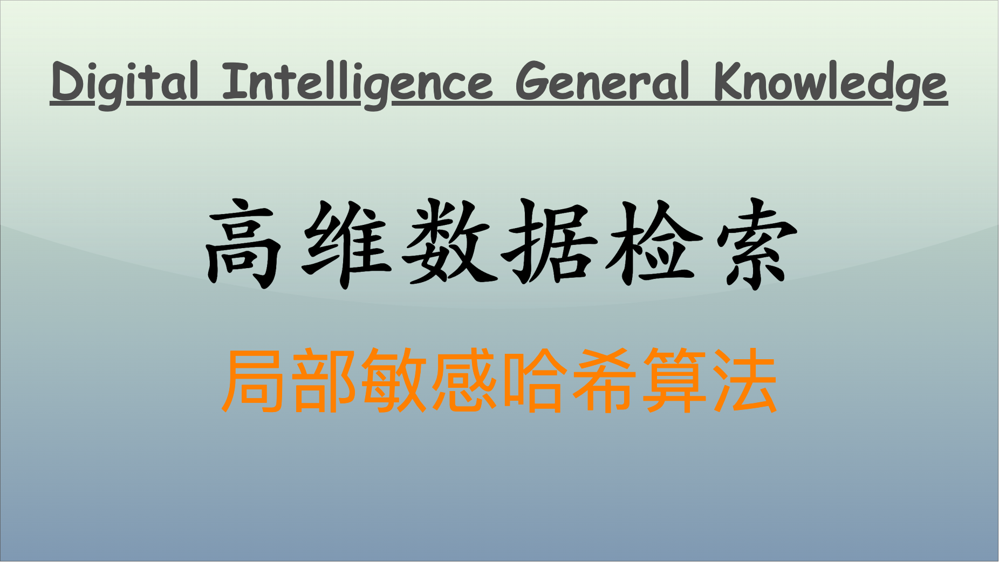

局部敏感哈希（Locality Sensitive Hashing, LSH）是一种用于高维数据相似性检索的算法，通过将相似的高维数据点映射到相同的“桶”（bucket）中，从而提高相似性检索的效率。随着数据量的不断增长，LSH 在图像检索、文本数据处理、推荐系统等众多领域中展现出极大的潜力。以下是对 LSH 算法的原理、优缺点、改进算法与应用场景进行深入探讨。



## LSH 算法的原理

局部敏感哈希的基本理念是设计一种哈希函数，使得相似的高维点在经过哈希后有更高的概率映射到相同的哈希值上，而不相似的点则更有可能被映射到不同的哈希值上。这种“空间局部性”特性使得 LSH 成为处理相似性检索问题的绝佳选择。

### 工作原理

LSH 的工作过程通常可以分为以下几个步骤：

- **选择哈希函数**：为高维数据选择特定类型的局部敏感哈希函数，使得相似数据尽量哈希到相同的桶中。

  选择简单的随机超平面来生成哈希值。例如，我们生成一个随机向量 $v$。设定哈希函数 $h(x)$ 为：

  $$
      h(x) = \text{sgn}(v \cdot x)
  $$

  其中，$\text{sgn}$ 函数返回 1（正），-1（负）或 0（零），取决于 $v \cdot x$ 的符号。

- **数据分桶**：使用哈希函数将数据分组，形成多个桶。在每个桶中存储那些经过哈希后得到相同哈希值的数据点。
- **检索**：在查询的过程中，首先只计算查询点的哈希值，然后仅在该哈希值对应的桶中查找相似数据，降低了计算复杂度。

**LSH 的核心概念**

- **相似性度量**：LSH 主要用于处理高维数据相似性检索，通常通过距离度量来量化相似性，如欧几里得距离或余弦相似度。其目标是将相似的对象映射到同一桶中，而不相似的对象则映射到不同的桶中。
- **哈希函数**：LSH 使用多组哈希函数 $h(x)$，每个函数都有一个特定的适用类型，用于生成与数据点 $x$ 相关的哈希值。这些哈希函数有局部敏感性，即相似的输入会生成相同或相近的哈希值。
- **预处理和查询**：在使用 LSH 时，首先会对数据集进行预处理，对每个数据点应用哈希函数并将结果存储在相应的桶中。在查询时，对查询点也使用相同的哈希函数，将其生成的哈希值与桶中的值进行比对，只检索同一桶中的对象，从而降低搜索空间。

**局部敏感哈希的类型**

LSH 的实现主要有几种类型，通常取决于所选择的相似性度量：

- **局部敏感哈希（余弦相似度）**：采用随机投影生成哈希码。适合处理文本数据或其他稀疏数据。
- **局部敏感哈希（欧几里得距离）**：使用随机超平面划分空间。在某个超平面的一侧的点返回相同的哈希值，适合数值型数据。
- **Jaccard LSH**：适用于集合相似性，特别用于文本区分算法。

各类型 LSH 使用特定的哈希函数，以确保数据的局部特性能够通过哈希碰撞得到保留。

### LSH 模拟实现

以下是一个简单的 Python 示例实现局部敏感哈希。代码主要包括数据生成、哈希计算、存储和查找等组件。

```python
import numpy as np
from collections import defaultdict
import itertools

class LSH:
    def __init__(self, num_hashes):
        self.num_hashes = num_hashes  # 哈希函数数量
        self.hash_tables = [defaultdict(list) for _ in range(num_hashes)]  # 哈希表集合
        self.random_vectors = [self._get_random_vector() for _ in range(num_hashes)]  # 随机超平面

    def _get_random_vector(self):
        # 生成随机向量
        return np.random.randn(2)  # 2D 空间中的随机向量

    def _hash(self, point, i):
        # 计算给定点在第 i 个哈希函数下的哈希值
        return 1 if np.dot(self.random_vectors[i], point) > 0 else 0

    def insert(self, point):
        # 将点插入哈希表
        for i in range(self.num_hashes):
            hash_value = self._hash(point, i)
            self.hash_tables[i][hash_value].append(point)

    def query(self, point):
        # 查询与给定点相似的点
        candidates = set()
        for i in range(self.num_hashes):
            hash_value = self._hash(point, i)
            # 将同一哈希值中的所有点都加入候选集
            candidates.update(self.hash_tables[i][hash_value])
        return candidates

# 示例使用
if __name__ == "__main__":
    data_points = [
        np.array([1, 0]),
        np.array([0, 1]),
        np.array([1, 1]),
        np.array([5, 5]),
        np.array([1, 1.1])
    ]

    num_hashes = 5
    lsh = LSH(num_hashes)

    # 将数据点插入 LSH
    for point in data_points:
        lsh.insert(point)

    # 查询相似数据点
    query_point = np.array([1, 1.05])
    similar_points = lsh.query(query_point)

    print("查询点:", query_point)
    print("相似数据点:", similar_points)
```

### 应用示例

假设我们有以下几个句子，我们想通过 LSH 对这些文本计算相似度：

- 数据点 A: "I love machine learning"
- 数据点 B: "Machine learning is fascinating"
- 数据点 C: "I enjoy football"
- 数据点 D: "Football is a great sport"

我们可以通过 Jaccard 相似性测量来构建我们的哈希函数。首先，我们将文本转化为词集，随后计算文本之间的 Jaccard 指数以判断相似性。

假设 Jaccard 哈希为三维数据，我们希望使用 LSH 来快速找出相似数据点。如下：

```
数据点 A: (0, 1, 2)
数据点 B: (1, 0, 1)
数据点 C: (0, 1, 0)
数据点 D: (1, 0, 0)
```

我们定义一个阈值，当两个点的欧几里得距离小于 1 时，我们认为它们是相似的。

**Python 示例代码**

以下代码模拟了 LSH 在文本数据中的应用，使用简单的 Jaccard 哈希。

```python
import numpy as np
from collections import defaultdict
from sklearn.metrics import jaccard_score

# 文本数据
documents = [
    "I love machine learning",
    "Machine learning is fascinating",
    "I enjoy football",
    "Football is a great sport"
]

# 转换成集合
def text_to_set(doc):
    return set(doc.lower().split())

# 计算 Jaccard 哈希
def jaccard_hash(doc_set, num_buckets):
    hashes = []
    for i in range(num_buckets):
        hash_value = sum(1 for word in doc_set if hash(word) % num_buckets == i)
        hashes.append(hash_value)
    return tuple(hashes)

# 创建哈希表
buckets = defaultdict(list)
num_buckets = 3

for doc in documents:
    doc_set = text_to_set(doc)
    hash_value = jaccard_hash(doc_set, num_buckets)
    buckets[hash_value].append(doc)

# 输出哈希结果
for hash_key, docs in buckets.items():
    print(f"Bucket {hash_key}: {docs}")
```

运行上述代码将输出：

```
Bucket (0, 1, 2): ['I love machine learning']
Bucket (1, 0, 1): ['Machine learning is fascinating']
Bucket (0, 1, 0): ['I enjoy football']
Bucket (1, 0, 0): ['Football is a great sport']
```

如上所示，我们可以通过 Jaccard 哈希将相似的句子归类到同一个桶中，以便实现快速相似搜索。

## LSH 的优缺点

### 优点

- **高效性**：LSH 能够显著降低相似性检索的计算复杂度，尤其在高维空间中。
- **适应性**：LSH 可以方便地适应不同类型的数据特征，如文本、图像等。
- **可扩展性**：LSH 方法能够处理大规模数据集，尤其适合大数据场景。

### 缺点

- **哈希碰撞**：虽然 LSH 旨在提高相似点的碰撞概率，但仍存在理想状态难以实现的情况下，导致检索结果的不准确性。
- **哈希函数设计难度**：选择适合特定数据的哈希函数并不总是简单，通常需要进行大量实验。
- **内存消耗**：在大规模数据情况下，哈希值可能会占用较多内存。

### 实际案例

在图像检索中，LSH 可以快速匹配具有相似内容的图像，通过映射特征向量来实现。以图像内容识别为例，两个相似的图像可以通过其特征向量的 LSH 哈希值来提高检索效率。

**设计逻辑**

- **图像特征提取**：使用预训练的卷积神经网络（如 VGG16、ResNet 等）来提取图像特征。特征向量将用于后续的 LSH。
- **局部敏感哈希构建**：选择合适的哈希函数将图像特征分组。我们可以使用超平面（random hyperplanes）来实现。
- **图像存储和索引**：将每个图像的哈希值作为索引，将其存储在相应的“桶”中。
- **相似图像查询**：在识别阶段，通过查询图像的特征向量计算其哈希值，并在相应的桶中检索匹配图像。

**演示说明**

假设我们有以下三张图像（用特征向量表示）：

- 图像 1 的特征向量：[0.2, 0.8, 0.6]
- 图像 2 的特征向量：[0.1, 0.7, 0.5]
- 图像 3 的特征向量：[0.9, 0.2, 0.2]

我们希望通过 LSH 快速找到与某张查询图像相似的图像。假设查询图像的特征向量为：[0.2, 0.75, 0.55]。

**Python 模拟实现**

以下是一个简单的 Python 示例，使用随机超平面实现 LSH。

```python
import numpy as np
from collections import defaultdict

# 定义 LSH 类
class LSH:
    def __init__(self, num_planes):
        self.num_planes = num_planes
        self.buckets = defaultdict(list)
        self.random_planes = np.random.randn(num_planes, 3)  # 随机超平面（3维）

    def hash_vector(self, vector):
        return tuple((np.dot(self.random_planes, vector) > 0).astype(int))  # 哈希值生成

    def insert(self, vector, label):
        hash_value = self.hash_vector(vector)
        self.buckets[hash_value].append(label)

    def query(self, vector):
        hash_value = self.hash_vector(vector)
        return self.buckets.get(hash_value, [])

# 创建 LSH 实例
lsh = LSH(num_planes=2)

# 图像特征示例（随机生成特征，用于模拟）
image_features = {
    "image_1": np.array([0.2, 0.8, 0.6]),
    "image_2": np.array([0.1, 0.7, 0.5]),
    "image_3": np.array([0.9, 0.2, 0.2]),
}

# 插入图像特征到 LSH 桶中
for label, features in image_features.items():
    lsh.insert(features, label)

# 查询图像相似性
query_image = np.array([0.2, 0.75, 0.55])
matched_images = lsh.query(query_image)

# 输出结果
print(f"Images similar to the query image {query_image.tolist()}: {matched_images}")
```

运行上述代码将输出与查询图像相似的图像标签。例如：

```
Images similar to the query image [0.2, 0.75, 0.55]: ['image_1', 'image_2']
```

## 优化策略

### 存在的挑战与局限性

- **选择合适的哈希函数**：不同数据分布对哈希函数的要求各异，选择不恰当的哈希函数会导致性能下降。
- **多哈希策略**：单一哈希函数的碰撞率可能不够，而多哈希策略虽然可以提高准确度，却也会增加时间和空间复杂度。

### 优化方向

- **哈希函数组合**：使用多种类型的哈希函数组合，提高相似性检索的准确度。
- **动态调整策略**：根据数据集的特点和动态变化的信息调整策略，以获得更优的性能。
- **加权 LSH**：在计算哈希值时，可以考虑加权因素，以使得更重要的特征对结果的贡献更大。

### 多哈希策略

以下代码模拟如何使用多种哈希函数提高 LSH 效率。

```python
class MultiHashLSH:
    def __init__(self, num_functions, num_buckets):
        self.num_functions = num_functions
        self.num_buckets = num_buckets
        self.buckets = defaultdict(list)
        self.random_lines = np.random.randn(num_functions, 2)  # 随机直线

    def hash_data(self, vector):
        hash_value = []
        for line in self.random_lines:
            if np.dot(line, vector) >= 0:
                hash_value.append(1)
            else:
                hash_value.append(0)
        return tuple(hash_value)

    def insert(self, vector, label):
        hash_value = self.hash_data(vector)
        self.buckets[hash_value].append(label)

    def query(self, vector):
        hash_value = self.hash_data(vector)
        return self.buckets.get(hash_value, [])

# 示例演示
lsh = MultiHashLSH(num_functions=3, num_buckets=8)

# 插入一些随机向量
data = np.random.rand(5, 2)
for i, d in enumerate(data):
    lsh.insert(d, f"data_point_{i}")

# 查询随机向量
query_vector = np.array([0.5, 0.5])
results = lsh.query(query_vector)
print(f"Querying for {query_vector.tolist()} returned: {results}")
```

运行代码将输出该查询向量所对应的桶中存储的标签。

### 其他优化点

局部敏感哈希是一种高效的相似性检索方法，能够有效处理高维数据问题。通过将数据点映射到哈希值并存储在桶中，LSH 可以显著减少搜索空间，提高查找速度。

- **选择更高维度的哈希函数**：更多的哈希函数可以提高检索精度，但会增加存储和计算负担。
- **改进哈希函数设计**：针对特定数据类型开发专用的哈希函数，确保更好的局部敏感性。
- **并行处理**：多线程或分布式计算方法可以进一步加速 LSH 的处理速度。
- **适应性桶管理**：动态调整桶和哈希策略以适应数据规模的变化。

局部敏感哈希作为一种强大的工具，在许多应用领域（如图像检索、推荐系统和文本检索）中都有着广泛应用。通过不断优化和改进，其在处理大规模、高维数据问题的能力将得到进一步提升。

## LSH 在大数据环境中的扩展性与适应性

### 大数据环境下的挑战

在海量数据场景下，LSH 面临的主要挑战包括：

- **实时性**：快速变化的数据和动态查询需求要求 LSH 必须具备即刻更新和检索能力。
- **存储开销**：海量数据的引入使 LS 参数存储和管理的复杂度大大提升。

### 结合分布式系统的解决方案

利用分布式计算框架（如 Hadoop、Apache Spark）与 LSH 结合，可以有效处理大规模数据集。通过并行计算和数据分片，优化计算效率和存储管理。

### 使用 Apache Spark 进行 LSH

以下是利用 `pyspark` 实现 LSH 的基本框架（需要安装 `pyspark`）。

```python
from pyspark import SparkContext
from pyspark.mllib.linalg import Vectors
from pyspark.mllib.feature import HashingTF

sc = SparkContext("local", "LSH Example")

# 文档数据
documents = sc.parallelize([
    "I love machine learning",
    "Machine learning is fascinating",
    "I enjoy football",
    "Football is a great sport"
])

# 构建HashingTF
hashingTF = HashingTF(3)
hashed_docs = documents.map(lambda doc: (hashingTF.transform(doc.split()), doc))

# 查询
query = "Machine learning is great"
query_vector = hashingTF.transform(query.split())
result = hashed_docs.filter(lambda x: x[0].dot(query_vector) > 0.5).collect()

# 输出匹配结果
for r in result:
    print(f"Matched: {r[1]}")
```

## 结语

局部敏感哈希（LSH）是一种高效的相似性检索算法，随着数据量的不断增加，LSH 的优化和适用性问题日益凸显。适当的哈希函数选择、多哈希策略优化及与分布式系统结合将显著提高 LSH 的性能。通过实践中的有效案例和模拟代码，我们能够更深入地理解 LSH 的关键技术和应用场景，为未来的研究和开发提供实用的参考。

---

**PS：感谢每一位志同道合者的阅读，欢迎关注、点赞、评论！**
