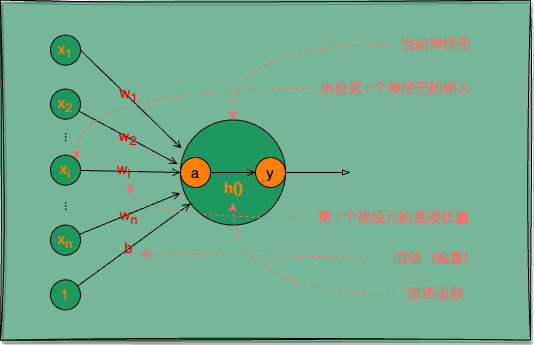
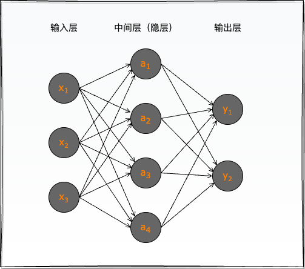

人工神经网络（ANN）是深度学习领域的核心概念，而深度学习几乎已经是现代人工智能（AI）的代名词，其对 AI 的发展起到了重要的推动作用。我们将围绕 ANN 的基本概念与原理、发展历史和近来趋势、应用领域等进行由浅入深的探讨，慢慢全面而细致地沉浸到这个重要主题的探索与剖析中去。

## 机器学习与深度学习

### 机器学习

“路边的水果摊上，青绿的西瓜根蒂蜷缩，敲起来声音浑浊，显然是皮薄肉厚瓤舔的好瓜。”

这里因为我们吃过、看过足够多的西瓜（E），对于这个瓜好不好（T），基于色泽青绿、根蒂蜷缩、敲声浊响这几个特征，我们可以很准确的（P）判断这是一个正熟的好瓜。

将以上人类与生俱来的“学习”能力通过计算手段赋予计算机，就成了机器学习。

什么是机器学习？

卡内基梅隆大学机器学习系创始人、美国国家工程院院士 Tom M. Mitchell 给出了工程化的概念：

一个计算机程序利用经验（E）来学习任务（T），性能是（P），如果针对任务（T）的性能（P）随着经验（E）不断增长，则称为机器学习。

### 神经网络（深度学习）

深度学习是机器学习方法的一种，但在当下爆火的人工智能领域，机器学习方法基本可以分为深度学习与其他（传统统计学习）。

神经网络模型模拟了生物神经系统对真实世界物体作出的交互反应，是对大脑工作机制的简单理想化。

人类大脑的神经系统由千亿级的神经元组成，每个神经元与其他神经元相连。当神经元“兴奋”时，就会向相连的神经元发送化学物质（神经递质），从而改变神经元内的电位。如果某神经元的电位超过了一个“阈值”，它就会被激活而“兴奋”起来，并向其他神经元发送神经递质。

将生物神经元抽象成简单的模型，就是一直沿用至今的 `M-P 神经元`（由 McCulloch 和 Pitts 提出，因此以两人名字首字母命名）。

<p class="caption">图 1：M-P 神经元，神经网络中最常用的功能神经元</p>

> **神经元**：基本单位，接受输入信号并进行处理。

M-P 神经元接收来自 n 个其他神经元的`输入信号` x，将输入信号按不同`权重` w 相加，再加上一个`偏置` b（类似生物神经元的电位阈值），得到一个`总输入值` a，最后将 a 通过`激活函数` h() 处理后`输出` y。

> **激活函数**：用于决定是否激活神经元的函数，常用的有 sigmoid、tanh 和 ReLU 函数。

其中权重 w 与偏置 b 统称为神经网络的`权重参数`。

用数学式表示 M-P 神经元的计算：

$$
    y = h(\sum_{i=1}^{n}w_ix_i + b)             \tag{1}
$$

有了神经元的概念，我们将多个相同结构的神经元通过并行互联组成具有适应性的网络，也就成了`神经网络`。

<p class="caption">图 2：两层神经网络</p>

人工神经网络是模仿人类神经系统的信息处理模型，由大量的“神经元”通过连接形成的网络结构。这些神经元通常分为输入层、隐藏层和输出层。上图所示就是一个两层（隐藏和输出层的总层数）神经网络。

> **层次结构**：包含至少一个输入层、一个或多个隐藏层和一个输出层。

输入层神经元仅接收外界输入，不包含功能神经元；中间层（隐层）与输出层的功能神经元对信号进行加工，输出层神经元输出最终结果。

常见的神经网络是如图 2 所示的层级结构，每层神经元与下一层神经元全互连，神经元之间不存在同层连接，也不存在跨层连接，网络拓扑结构上不存在环或回路，这种网络被称为`多层前馈神经网络`（`multi-layer feedforward neural networks`）。

图 2 所示神经网络通常被称为“`两层网络`”，或“`单隐层网络`”。`输入层`神经元接收外界信号输入，`隐层`（`隐藏层`，也称`中间层`）与`输出层`神经元对信号进行加工，最终结果由输出层神经元输出。只有隐层与输出层包含`功能神经元`，输入层仅接受输入，不做函数处理。

**深度学习模型**

`深度学习模型`是指加深层的神经网络，虽然没有透彻的理论研究证明加深层是有益的，但从实验结果看，加深层是一种尝试优化效果的重要手段。

即使抛开最终模型效果不论，加深层还有助于减小模型参数量，减小学习数据规模等收益；同时也是分层次的分解需要学习的问题，分层次的传递信息的一种手段。即加深层可以使学习更高效。

### 学习与推理

假设有一个任务需要用图示 1 的神经网络来实现，该任务的输入是 $(x_1,x_2,x_3)$，输出是 $(y_1,y_2)$。我们首先需要从训练数据学习处理该任务的计算逻辑，然后才可以使用学得的模型进行任务处理，也即推理。

`神经网络的学习`，就是通过某种学习算法，在该两层神经网络上，根据已知的输入输出数据对，即训练数据，持续调整神经网络的权重参数，直至找到最适合处理该任务的权重参数。

`神经网络的推理`，就是在明确该网络所有权重参数的情况下，给该网络一个新的输入 $(x_1,x_2,x_3)$，网络上的功能神经元会按如式 1 计算出各自节点的值，最终得到一个输出 $(y_1,y_2)$。

### 过程概要

ANN 的工作原理包括两个主要过程：`前向传播`和`反向传播`。

**前向传播**：在输入层接收数据，经过隐藏层的权重和激活函数的处理，最终输出结果。

$$
    a^{(l)} = f(W^{(l)} a^{(l-1)} + b^{(l)})
$$

其中，$a^{(l)}$是第 l 层的输出，$W^{(l)}$是权重矩阵，$b^{(l)}$是偏置，f 是`激活函数`。

**反向传播**：通过`梯度下降法`优化模型，计算每个参数的梯度，并更新权重。重要的公式为：

$$
    W^{(l)} = W^{(l)} - \eta \frac{\partial L}{\partial W^{(l)}}
$$

其中，$\eta$ 是`学习率`，L 是`损失函数`。

此处仅提供一个概要的印象，神经网络模型的学习与推理过程我们将在后续篇章中详细探讨。

**前向传播演示**

利用 Python 及相关库（如 NumPy 和 Matplotlib），我们可以简单实现一个基础的 ANN 模型的计算过程。下面通过手动编写一个简单的`多层感知器`（`MLP`）用于演示如何对输入对象进行推理（前向传播过程）的。

```python
import numpy as np

# 激活函数
def sigmoid(x):
    return 1 / (1 + np.exp(-x))

# 前向传播
def forward(X, W1, b1, W2, b2):
    hidden_layer = sigmoid(np.dot(X, W1) + b1)
    output_layer = sigmoid(np.dot(hidden_layer, W2) + b2)
    return output_layer

# 初始化权重和偏置
np.random.seed(42)
W1 = np.random.rand(2, 2)
b1 = np.random.rand(2)
W2 = np.random.rand(2, 1)
b2 = np.random.rand(1)

# 输入数据
X_data = np.array([[0, 0], [0, 1], [1, 0], [1, 1]])

# 运行前向传播
output = forward(X_data, W1, b1, W2, b2)
print(output)

# [[0.7501134 ]
#  [0.7740691 ]
#  [0.78391515]
#  [0.79889097]]
```

### 前置技能

掌握了如下技能，后文的深度学习相关理论与实践都将轻而易举：

- Python 基础：基本语法、Numpy 库、Matplotlib 库。
- 数学基础：矩阵运算、数值微分。

## 神经网络趣人趣事

### 发展历程

若说 `ML`（`Machine Learning`，`机器学习`） 是 `AI`（`Artificial Intelligence`，`人工智能`） 发展到一定阶段的必然产物，那么 `DL`（`Deep Learning`，`深度学习`） 就是 ML 圈中命途多舛，苦熬多年终于熬出头的“新贵”，加上引号的原因不言而喻，因为它早就是 ML 权重的老面孔了。

人工神经网络的发展可以追溯到 **1940 年代** M-P 神经元模型的出现。但直到 **1958 年** Frank Rosenblatt 提出的感知器模型，神经网络才开始引起人们的关注。然而，感知器模型的局限性很快显现出来，**1969 年**，MIT 计算机科学研究的奠基人 Marvin Minsky 指出，神经网络模型难以解决非线性问题，这导致神经网络的研究进入了冰河期。

**1974 年**随着反向传播算法（BP 算法）的提出，神经网络再次引起研究者的关注。这一时期，David Rumelhart 和 Geoffrey Hinton 等人强调了多层网络的重要性。

在流派众多的 AI 界，神经网络曾经很不被看好，一些顶会和大咖甚至毫不客气的反对和排斥神经网络，以至于出现了譬如“关联记忆”，“并行分布式处理”，“深度学习”等晦涩的替代术语。

直至 2012 年，Ilya Sutskever 等在 ImageNet 比赛中以大优势夺冠，DL 才开始成为 AI 界显学。

再到 2020 年，大语言模型的开山鼻祖 GPT-3 携 1750 亿参数量（人类大脑有大约 1000 亿个神经元，这个数量级是否也说明了什么自然现象？）横空出世；2022 年 12 月 ChatGPT 上线，以 5 天破百万用户、2 个月破一亿月活用户（TikTok 用了 9 个月）的势头，迅速成为史上增长最快的消费级应用，至此深度学习颇有“一统江湖”的意味。

### 趣人趣事

图灵奖得主 Edsger W. Dijkstra 曾说：计算机科学不仅仅是关于计算机，就像天文学不仅仅是关于望远镜。

我们掌握一种工具，所需掌握的并不仅仅工具本身，而是应该更加关注于发挥工具的作用之后，带来的是什么价值，以及如何让价值更大化。

那么该如何让计算机的价值更大化？有一个很不错的答案：机器代替人工！

随着 Amdahl 定律代替摩尔定律成为计算机性能发展的新源动力，人类利用计算机处理任务的上限得以爆炸式增长。在过去的二十年中，利用计算机收集、存储、传输、处理数据的能力取得了飞速提升，而伴随着这些海量的数据处理任务而来的，是我们亟需一种智能且有效的数据处理算法，即人工智能（AI）。

AI 若按阶段来划分，大致可分为推理期、知识期、学习期。

`推理期`（二十世纪五十到七十年代）主要通过编写“通用问题求解”程序，赋予机器逻辑推理能力，实际并无智能。

到了`知识期`（二十世纪七十年代中期开始），人们开始构建大量专家系统，由人将知识总结并传授给机器。

然而知识工程的人工部分存在很大瓶颈，为了解决这一瓶颈，AI 进入`学习期`（二十世纪八十年代），机器开始自己学习知识。至此，机器学习（ML）正式进入 AI 的主舞台。

这是一个通过 ML 来认识和改造世界的时代！

### 前沿趋势

时下人工智能领域最火的话题无疑是 LLM（大语言模型），其模型架构也不脱人工神经网络的藩篱。GPT-3 的出现让人们看到了 AI 的无限可能。然后是 GPT-3.5 与随之而来的 GPT-4，它们每一次迭代都是一次行业的重新定义。GPT 的火爆已经将原本高不可攀的 AI 技术带到了所有普通人的面前。

## 应用领域

人工神经网络在多个领域中得到了广泛应用，我们随意列举几个：

- **图像识别**：使用 CNN 进行图像分类、标记、搜索等。
- **自然语言处理**：利用 RNN 处理序列数据，如文本生成与翻译、聊天对话等。
- **金融预测**：应用 ANN 进行股市预测和信用评分等。
- **医疗诊断**：基于 ANN 的诊断工具用于分析医学图像和预测疾病等。

### 图像识别演示

卷积神经网络（CNN）在图像识别方面表现卓越，例如在 ImageNet 比赛中，AlexNet 模型的成功显著提升了图像分类的准确性。

下面我们使用 Keras 展示简单的 CNN 模型构造：

```python
from keras.models import Sequential
from keras.layers import Conv2D, MaxPooling2D, Flatten, Dense

# 构建模型
# 创建一个顺序模型实例。
model = Sequential()

# 添加卷积层
# `Conv2D(32, (3, 3), ...)`：添加一个卷积层，使用 32 个过滤器，每个过滤器的大小为 3x3。
# `activation='relu'`：使用 ReLU 激活函数，使非线性特性增强。
# `input_shape=(64, 64, 3)`：输入图像的形状为 64x64 像素，3 个通道（RGB 图像）。
model.add(Conv2D(32, (3, 3), activation='relu', input_shape=(64, 64, 3)))

# 添加池化层
# `MaxPooling2D(pool_size=(2, 2))`：添加一个 2x2 的池化层，用于减小特征图的尺寸，从而减少计算量和降低过拟合风险。
model.add(MaxPooling2D(pool_size=(2, 2)))

# 展平层
# `Flatten()`：将卷积和池化层的输出展平成一维数组，为全连接层做好准
model.add(Flatten())

# 添加全连接层
# `Dense(units=128, activation='relu')`：添加一个全连接层，包含 128 个神经元，使用 ReLU 激活函数。
model.add(Dense(units=128, activation='relu'))

# 添加输出层
# `Dense(units=10, activation='softmax')`：添加一个输出层，包含 10 个神经元（适用于处理 10 个类别），使用 Softmax 激活函数将输出转换为概率分布。
model.add(Dense(units=10, activation='softmax'))

# 编译模型

# `optimizer='adam'`：使用 Adam 优化器，自动调整学习率，适合大多数情况。
# `loss='categorical_crossentropy'`：使用分类交叉熵损失函数，适用于多类别分类任务。
# `metrics=['accuracy']`：设置评估指标为准确率，以便在训练和测试时监测模型表现。
model.compile(optimizer='adam', loss='categorical_crossentropy', metrics=['accuracy'])
```

- `Sequential`：用于按顺序构建模型的 Keras 类。
- `Conv2D`：卷积层，用于提取图像特征。
- `MaxPooling2D`：池化层，用于降低特征图的尺寸，减少计算量。
- `Flatten`：将多维输入展平为一维数组，便于连接到全连接层。
- `Dense`：全连接层，用于完成分类等任务。

### 其他应用引介

**自然语言处理**

递归神经网络（RNN）在处理文本数据时展现出巨大的能力。LSTM（长短期记忆）网络是一种单向 RNN，能够有效捕获长距离依赖关系。

用于情感分析的 RNN 模型，训练数据集包含标记为正面或负面的评论，通过 LSTM 可以准确分类情感。

**金融预测**

ANN 被广泛应用于金融市场的时间序列预测，通过历史数据分析股票走势。例如，使用 RNN 进行未来股价的预测。

考虑数据的多样性对模型表现的影响，以及结合外部变量提升模型的准确性。

**医疗诊断**

使用 ANN 进行医学影像分析，如对心电图、MRI 影像的异常检测。ANN 可以节省时间，并提高准确率。

ANN 在临床应用中支持医生决策，但同时也需关注伦理问题，确保准确性与隐私安全。

## DL vs. ML

以上文手写数字识别这个任务为例，我们要通过计算机软件实现这一任务基本有三种方式：

1. `人工编码方式`：通过人工分析数字图像，总结规律，并编写对应规则的逻辑代码（困难一些的逻辑可能无法通过代码实现），实现简单的图像数字分类。
2. `ML 方式`：通过人工分析数字图像，提取特征量，并设计对应的机器学习算法（SVM、KNN 等），通过样例数据训练模型，最终实现机器识别手写数字。
3. `DL 方式`：设计可以处理从手写数字图像到输出数值的神经网络，通过样例数据训练该模型，最终实现识别手写数字。

通过上述 3 中实现方式的比较，可以看出：

第 1 种方式需要通过硬编码实现，困难一些的规则很难编写，且很难提高识别的精度。

第 2 种方式则需要人工提取有用的特征，并设计与之适配的机器学习算法，这是一个`门槛较高`的工作，之后还需要经过有效的模型训练，才可能得到比较好的学习器。

第 3 种方式基本不需要人工提取特征，神经网络模型的设计也没有太多复杂逻辑的约束，神经网络本身就是一个`黑箱且通用`的过程，应用者不需弄懂很多烧脑的数据推理过程，经过有效的模型训练，往往就能得到很好识别效果。

以往 ML 技术在应用中要取得好性能，对使用者的要求很高；而 DL 技术涉及的模型复杂度非常高，一个好的 DL 模型可以适配的场景相当广泛，以至于只要下功夫调参，性能往往就很好。DL 虽然缺乏严格的理论基础，但**它显著降低了 ML 应用者的门槛，为 ML 技术走向工程实践带来了便利**。

**回顾 DL 的发展史，每一次神经网络热潮背后，都是一次算力的大爆炸式增长。算力的大幅提升给了 DL 提升参数量的可能，而 DL 算法巨量的参数提升就像量变产生质变，让机器真正有了参数智能的可能。**

## 结语

人工神经网络是一项强大的技术，其在多个领域中展示了广泛的应用潜力和深远的影响，可以说机器学习只有两种方法：人工神经网络（深度学习）和其他，即使如今火爆全球的 LLM、TTS 模型、图像与视频生成大模型（Sona、RunWay 等）、Embedding 模型等，通通不脱人工神经网络藩篱。通过对 ANN 基本概念的深入理解与探索，我们可以更全面地认识并利好用这些“未来”技术，推动和更好的融入各行业的应用与发展。

---

**PS：感谢每一位志同道合者的阅读，欢迎关注、点赞、评论！**
