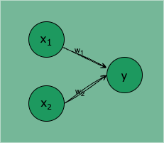
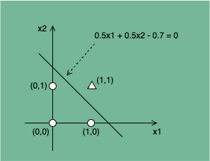
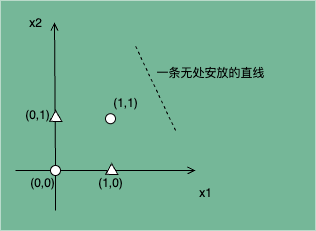
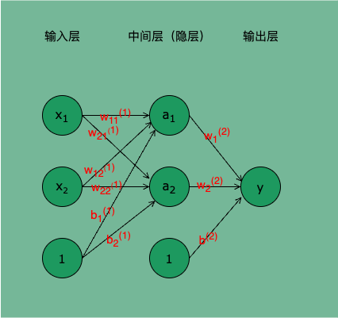

## 引言

了解计算机组成原理的我们都知道，计算机处理的所有复杂任务和计算，实际都可以通过简单的与非门叠加实现。而从上文中，我们知道了神经网络是可以通过叠加层的方式来叠加各类计算逻辑的。

那么只要我们能够通过简单网络实现基础的`与或非`逻辑运算，是否就可以通过叠加层的方式，将神经网络的表达能力扩展到可以表达计算机的所有复杂运算呢？

答案是肯定的！我们从`感知机`说起。

## 基本概念

`感知机`（准确的说是单层感知机）是由两层神经元组成的最简单的神经网络模型，输入层接收外界输入信号，输出层是 M-P 神经元。

图 1：两个输入的感知机，每个圆圈表示一个神经元

$x_1、x_2$ 是输入信号，y 是输出信号，$w_1、w_2$ 是权重。感知机的信号只有 1/0 两种取值，0 表示不传递信号，1 表示传递信号。

> **输入层**：接收特征向量，每个输入特征对应一个感知机的输入。
> **权重**：每个输入特征都有一个相应的权重（weight），表示该特征对输出的影响。
> **偏置**：为了使模型更加灵活，感知机还包含一个偏置（bias）项，帮助调整分类边界。

输入信号被送往神经元时，会被分别乘以固定的权重 $(w_1x_1、w_2x_2)$，神经元会计算传入信号的总和，只有当这个总和超过某个阈值 $\theta$，才会输出 1，也就是这个神经元被激活。

感知机计算逻辑的可以表示为数学式 1：

$$
    y =
    \begin{cases}
        0 & (w_1x_1 + w_2x_2 \leq \theta) \\
        1 & (w_1x_1 + w_2x_2 > \theta)          \tag{1}
    \end{cases}
$$

用偏置项 b 表示阈值 $\theta$，其中 b=-$\theta$，感知机的计算逻辑可以表示为式 2：

$$
    y =
    \begin{cases}
        0 & (w_1x_1 + w_2x_2 + b \leq 0) \\
        1 & (w_1x_1 + w_2x_2 + b > 0)           \tag{2}
    \end{cases}
$$

更一般的，我们将式 2 拆分为激活函数的表示方式：

$$
    h(x) = \begin{cases}
        0 & (x \leq 0) \\
        1 & (x > 0)
    \end{cases}                                \tag{3}
$$

$$
    a = w_1x_1 + w_2x_2 + b                     \tag{4}
$$

$$
    y = h(a) = h(w_1x_1 + w_2x_2 + b)           \tag{5}
$$

式 4 中输入信号的总和会被式 3 定义的激活函数 h(x) 转换为最终输出。

## 工作原理

> **加权求和**：感知机计算输入特征的加权和：

$$
  z = \sum_{i=1}^{n} w_i x_i + b
$$

其中 $w_i$ 是权重，$x_i$ 是输入特征，$b$ 是偏置。

> **激活函数**：然后将加权和通过激活函数进行处理。常用的激活函数是阶跃函数（Step Function），其输出为 0 或 1，表示分类结果。

### 学习过程

- **训练**：感知机使用一种称为感知机学习算法的迭代方法进行训练。算法通过调整权重和偏置来最小化预测错误。
- **更新规则**：基于损失（预测与真实标签之间的差异），使用以下公式更新权重：

$$
  w_i = w_i + \eta (y - \hat{y}) x_i
$$

其中 $\eta$ 是学习率，$y$ 是真实标签，$\hat{y}$ 是预测值。

## 前世今生

感知机（Perceptron）是人工神经网络的基础模型之一，也是最简单的神经网络形式。它是一种线性分类器，能够将输入数据分成两个类别。它模拟了生物神经元的工作原理，接受来自多种输入信号，并根据加权和来做出决策。

- **1950 年代**：

  - 感知机的概念由心理学家弗兰克·罗森布拉特（Frank Rosenblatt）在 1958 年提出。他希望通过建立一个能够模拟人脑功能的机器来实现模式识别。
  - 首个感知机模型是一种线性分类器，能够简单地将输入特征分为两类。

- **1960 年代**：

  - 感知机引起了广泛的研究和兴趣，但其能力受到限制。韦宁斯基（Marvin Minsky）和肖克特（Seymour Papert）在 1969 年发表的《感知机》书中指出，感知机只能解决线性可分的问题，无法处理更复杂的非线性问题（如异或问题）。
  - 这一论断导致了对人工神经网络的研究的暂时冷却，许多研究者转向其他机器学习方法。

- **1980 年代**：

  - 研究者们开始认识到多层感知机（MLP）的潜力。多层感知机通过引入一个或多个隐藏层，结合非线性激活函数，使得模型能够学习复杂的模式。
  - **反向传播算法**的提出（由 Geoffrey Hinton 等人）大幅提升了多层感知机的训练效率，使得网络能够通过梯度下降方法有效地优化权重。

- **1990 年代**：

  - 尽管神经网络在某些领域取得了成功，但由于计算资源有限和数据规模小，研究兴趣再次趋于平淡，其他方法如支持向量机（SVM）和决策树成为主流。

- **21 世纪初**：

  - 随着计算能力的提升、数据集的丰富以及深度学习算法的进步（如卷积神经网络和递归神经网络的兴起），神经网络开始再次流行。
  - **ImageNet 竞赛**与深度学习的成功引发了广泛关注，感知机及多层感知机的理论基础被重新审视。

- 现代应用

  - **深度学习**代表了感知机的进化，现今的神经网络能够通过多层结构捕捉复杂的特征，成功应用于图像识别、自然语言处理、语音识别等多个领域。
  - 感知机作为神经网络的基础构件，仍在工程实践中发挥着重要作用，是理解和构建现代深度学习模型的基础。

## 演示：逻辑运算

我们已经了解了感知机的计算逻辑，下面来尝试使用感知机实现几个计算机处理器的最基本逻辑运算：与、或、非、异或。

**感知机实现逻辑`与`、`与非`、`或`**

`与门`（`AND Gate`）、`与非门`（`NAND Gate`）、`或门`（`OR Gate`）的真值表如下：

| $x_1$ | $x_2$ | AND Gate | NAND Gate | OR Gate |
| :---: | :---: | :------: | :-------: | :-----: |
|   0   |   0   |    0     |     1     |    0    |
|   1   |   0   |    0     |     1     |    1    |
|   0   |   1   |    0     |     1     |    1    |
|   1   |   1   |    1     |     0     |    1    |

以 `AND Gate` 为例，使用感知机实现 AND Gate 实际就是在式 2.1.2.5 中找到一组 $(w_1, w_2, b)$ 参数，使得 $(x_1, x_2)$ 为 (0, 0)、(0, 1)、(1, 0) 时输出 0，$(x_1, x_2)$ 为 (1, 1) 时输出 1。

若用 $x_1$ 表示横轴，$x_2$ 表示纵轴，○ 表示 y=0，△ 表示 y=1。要找到合适的 $(w_1, w_2, b)$ 参数，就相当于找到一条直线，用这条直线可以将 ○ 和 △ 完全分隔开。如图 2.1.2.2 所示，$0.5x_1 + 0.5x_2 - 0.7 = 0$ 这条直线就能很好的满足条件。

图 2：AND Gate 问题的线性可分

将 $(w_1, w_2, b)$ = (0.5, 0.5, -0.7) 代入式 2.1.2.5，可得式 2.1.2.6：

$$
    y = h(0.5x_1 + 0.5x_2 - 0.7)               \tag{2.1.2.6}
$$

如式 2.1.2.6 所示，令感知机的权重参数 $(w_1, w_2, b)$ = (0.5, 0.5, -0.7) ，就能让 AND Gate 的 4 组 $(x_1, x_2)$ 输入对应的输出 y 全部正确。代码实现与测试参见 [Notebook](https://github.com/AfterShip/all-staff-writing-plan.deep-learning-basic/blob/master/runtime/Deep%20Learning.ipynb) 1.1.1 - 1。

$$
    y = h(-0.5x_1 - 0.5x_2 + 0.7)              \tag{2.1.2.7}
$$

同理，如式 2.1.2.7 所示，令 $(w_1, w_2, b)$ = (-0.5, -0.5, 0.7)，可以使 `NAND Gate` 的 4 组 $(x_1, x_2)$ 输入对应的输出 y 全部正确。代码实现与测试参见 [Notebook](https://github.com/AfterShip/all-staff-writing-plan.deep-learning-basic/blob/master/runtime/Deep%20Learning.ipynb) 1.1.1 - 2。

$$
    y = h(0.5x_1 + 0.5x_2 - 0.2)               \tag{2.1.2.8}
$$

如式 2.1.2.8 所示，令 $(w_1, w_2, b)$ = (0.5, 0.5, -0.2)，可以使 `OR Gate` 的 4 组 $(x_1, x_2)$ 输入对应的输出 y 全部正确。代码实现与测试参见 [Notebook](https://github.com/AfterShip/all-staff-writing-plan.deep-learning-basic/blob/master/runtime/Deep%20Learning.ipynb) 1.1.1 - 3。

**多层感知机实现逻辑`异或`**

为了初步验证上文所说“将神经网络的表达能力扩展到可以表达计算机的所有复杂运算是可行的”，我们尝试用叠加层的感知机实现一个相对复杂的异或逻辑运算。

逻辑`异或（XOR Gate）`的真值表如下：

| $x_1$ | $x_2$ |  y  |
| :---: | :---: | :-: |
|   0   |   0   |  0  |
|   1   |   0   |  1  |
|   0   |   1   |  1  |
|   1   |   1   |  0  |

若我们要用单层感知机实现一个 `XOR Gate`，相当于需要在图 2.1.2.3 所示的坐标轴找到一条直线，完全分隔 ○ 和 △，这是无论如何也无法实现的。

图 3：XOR Gate 问题的线性不可分

这是单层感知机的局限性，它只能表示可以通过一条直线分割的空间，比如 AND Gate、NAND Gate、OR Gate，而稍微复杂的 XOR Gate 就无法通过单层感知机表示。

我们进一步分析，发现 `XOR` 可以通过 `AND Gate`、`NAND Gate`、`OR Gate` 求得，比如：

$$
    XOR(x_1, x_2) = AND(NAND(x_1, x_2), OR(x_1, x_2))       \tag{2.1.2.9}
$$

也就是说，单层感知机无法表示的逻辑异或，我们可以通过叠加多个单层感知机来表示。我们可以用前文所述的神经网络来表示 `XOR Gate` 的运算逻辑，其网络结构如图 2.1.2.4 所示：

图 4：可进行 XOR Gate 运算的神经网络

输入层的两个神经元接收输入信号 $(x_1,x_2)$，并通过 NAND 和 OR 两种加权计算分别将结果输出给隐层的两个神经元 $(a_1,a_2)$。

将前文 NAND Gate 感知机的权重参数代入该网络，可得 $a_1$：

$$
    a_1 = NAND(x_1, x_2) \\
        = h(x_1w_{11}^{(1)} + x_2w_{12}^{(1)} + b_1^{(1)}) \\
        = h(-0.5x_1 - 0.5x_2 + 0.7)                \tag{2.1.2.10}
$$

将前文 OR Gate 感知机的权重参数代入该网络，可得 $a_2$：

$$
    a_2 = OR(x_1, x_2) \\
        = h(x_1w_{21}^{(1)} + x_2w_{22}^{(1)} + b_2^{(1)}) \\
        = h(0.5x_1 + 0.5x_2 - 0.2)                \tag{2.1.2.11}
$$

隐层的两个神经元将接收到的信号通过 AND 加权计算将结果输出给输出层的神经元 y，输出层将结果输出。

将前文 AND Gate 感知机的权重参数代入该网络，可得 y：

$$
    y = AND(a_1, a_2) \\
        = h(x_1w_{2}^{(1)} + x_2w_{2}^{(2)} + b^{(2)}) \\
        = h(0.5a_1 + 0.5a_2 - 0.7)                \tag{2.1.2.12}
$$

这就是 XOR Gate 感知机的结构及其整个推理过程。XOR Gate 的代码实现与测试参见 [Notebook](https://github.com/AfterShip/all-staff-writing-plan.deep-learning-basic/blob/master/runtime/Deep%20Learning.ipynb) 1.1.1 - 4。

## 结语

感知机经历了从起初的热潮到冷却，再到现代深度学习复兴的过程。其简单而有效的结构与思想成为了现代人工智能的基石，推动了神经网络在各个领域的广泛应用与发展。

感知机是神经网络的重要奠基石，是理解更高级模型的关键。尽管受限于线性可分性，但其概念与学习算法为现代深度学习的发展提供了基础。

感知机的基本结构与学习算法为现代复杂神经网络的设计奠定了理论基础。虽然孤立的感知机模型能力有限，但其灵活性和可扩展性促成了更复杂结构（如卷积神经网络、递归神经网络等）的发展。

感知机的思想指引研究者探索新的激活函数、优化算法及网络架构，从而推动深度学习领域的不断创新。
