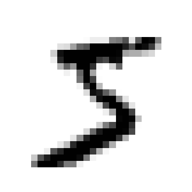
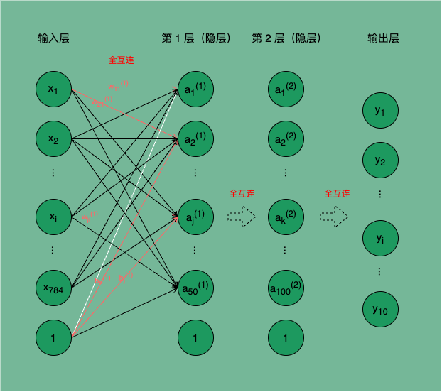

<p class="caption">神经网络</p>

### 2.1.3. 深度学习

通过上文 XOR Gate 的示例，我们知道叠加层可以增强感知机的表达能力。神奇的是，实际上通过简单的 NAND Gate 叠加就可以实现计算机这样复杂的系统。理论上只要知道怎么设置多层感知机的层次结构、层次间的运算权重，我们可以通过感知机表示任意计算机可以编码完成的逻辑。

但不幸的是，如何找到合适的层次结构与运算权重是一个相当复杂的过程，如果完全由人工来设置，这将几乎是不可能完成的工作，**这也是神经网络第一次遇冷的原因**。

**神经网络（准确的说是神经网络的学习）是一种 ML 算法，它的目的是自动学会端到端任务的处理逻辑。**这里说的端到端便是指任务的最初输入端到最终输出端。

我们把计算机上运行的任意任务看作端到端的任务，正常实现这样的任务，需要以显示编程的方式实现输入端到输出端的固定处理逻辑。当处理逻辑发生改变，对应的编程实现也需要随之改变。

若以神经网络来实现这一任务，以任务的处理逻辑为神经网络的学习目标，通过神经网络的学习（即在某个适当的网络层次结构上自适应找到一组正确的权重参数）就能自动实现该任务从输入端到输出端的处理逻辑。这一过程就是**神经网络模型的学习过程**。

神经网络的学习过程需要根据训练数据（任务的输入数据与输出数据）不停调整神经元之间的权重参数（连接权和阈值，统称权重参数，神经网络学到的东西都在权重参数中），直至达到一个“理想状态”。

这种通过学习获得的处理逻辑，往往能够覆盖一些人工编码覆盖不到的逻辑，甚至处理一些同类但模型未曾见过的案例，也即有了泛化能力。

即使端到端任务的处理逻辑发生改变，某种程度上，也只需通过新的训练数据学得新的处理逻辑，就能适应新的任务。不再需要通过人工改变编码的方式来适配无休止变化的新规则。

常见的神经网络是如图 2.1.1.2 所示的层级结构，每层神经元与下一层神经元全互连，神经元之间不存在同层连接，也不存在跨层连接，网络拓扑结构上不存在环或回路，这种网络被称为`多层前馈神经网络`（`multi-layer feedforward neural networks`）。

图 2.1.1.2 所示神经网络通常被称为“`两层网络`”，或“`单隐层网络`”。`输入层`神经元接收外界信号输入，`隐层`（`隐藏层`，也称`中间层`）与`输出层`神经元对信号进行加工，最终结果由输出层神经元输出。只有隐层与输出层包含`功能神经元`，输入层仅接受输入，不做函数处理。

**深度学习模型**

`深度学习模型`是指加深层的神经网络，虽然没有透彻的理论研究证明加深层是有益的，但从实验结果看，加深层是一种尝试优化效果的重要手段。

即使抛开最终模型效果不论，加深层还有助于减小模型参数量，减小学习数据规模等收益；同时也是分层次的分解需要学习的问题，分层次的传递信息的一种手段。即加深层可以使学习更高效。

## 2.2. 神经网络的推理

从上文我们已经了解了神经网络模型的基本概念，接下来我们以`手写数字识别`任务为例，尝试使用`神经网络的推理`能力来处理该问题，从而更一般地演示和梳理神经网络的推理过程。

神经网络的推理，就是利用已经学习好的神经网络模型，计算新的输入样例的对应输出。也即在已知网络层次结构、已知网络权重参数的固定神经网络计算公式上，进行固定函数的计算的过程。

### 2.2.1. 项目准备

手写数字识别任务是一项计算机视觉任务，其目的是使用训练数据（这里采用的是 `MNIST 数据集`）建立数字图像识别模型，从而识别任意图像中的数字。

这项任务的主要挑战在于训练模型能够准确地识别手写数字的特征和模式，在输入的图像中找出对应的数字。通过训练模型，它可以学习到不同数字之间的差异，并根据输入图像中的像素值进行预测和分类，从而实现手写数字的自动识别。

这项任务在许多领域有广泛的应用，如 ORC（Optical Character Recognition，光学字符识别）、智能表单处理、邮政编码识别等。

#### 1. 数据准备

MNIST 数据集是一组由美国高中生和人口调查局员工手写的 70000 个数字图片，每张图片都用其代表的数字标记。因广泛被应用于机器学习入门，被称作机器学习领域的 “Hello World!”。因其适应性，也常被用于测试新分类算法的效果。

下载与加载 MNIST 数据的 Python 代码实现参见 [Notebook](https://github.com/AfterShip/all-staff-writing-plan.deep-learning-basic/blob/master/runtime/Deep%20Learning.ipynb) 1.2.3。

我们简单认识一下 MNIST 数据。

```python
(x_train, t_train), (x_test, t_test) = load_mnist(flatten=True, normalize=False)
image = x_train[0]
label = t_train[0]

print('训练集输入数据的形状：', x_train.shape)    # (60000, 784)
print('训练集输出标签的形状：', t_train.shape)    # (60000,)
print('测试集输入数据的形状：', x_test.shape)     # (10000, 784)
print('测试集输出标签的形状：', t_test.shape)     # (10000,)
print('训练集第一个数字是：', label)              # 5
print('训练集第一个输入数据的形状:', image.shape)  # (784,)
```

执行上面的代码，可以得到如下输出：

```text
训练集输入数据的形状： (60000, 784)
训练集输出标签的形状： (60000,)
测试集输入数据的形状： (10000, 784)
测试集输出标签的形状： (10000,)
训练集第一个数字是： 5
训练集第一个输入数据的形状： (784,)
```

MNIST 数据集将数据分为`训练集输入数据` x_train，`训练集输出标签` t_train，`测试集输入数据` x_test，`测试集输出标签` t_test。

其中 x_train 包含 60000 个图片数据，每个图片数据包含 784 个数值表示的 28 $\times$ 28 的位图值，t_train 则是这 60000 个图片数据对应代表的数字。x_test 包含 10000 个与 x_train 相同结构的图片数据，t_test 是这 10000 个图片数据对应代表的数字。

用 Matplotlib 可以轻易将训练集的第一个输入数据转化为位图打印出来（代码实现参见 [Notebook](https://github.com/AfterShip/all-staff-writing-plan.deep-learning-basic/blob/master/runtime/Deep%20Learning.ipynb) 1.2.3 - 3），效果下图 2.2.1.2，它确实是一个手写数字 5。



<!-- 图 2 手写数字 5，MNIST 数据集中第一个输入数据的位图展示 -->

#### 2. 模型介绍

本小节介绍的是神经网络模型的使用过程，即神经网络的推理，因此先跳过神经网络的学习过程（先掌握如何使用模型，再去了解如何制作该模型）。

这里我们假设已有一个学好的手写数字图像识别神经网络模型，如图 2.2.1.1，现在我们的目的就是使用该模型识别 MNIST 数据集中的任意图片中的数字。



<!-- 图 2.2.1.1 手写数字图像识别的神经网络 -->

图 2.2.1.1 所示是一个`三层神经网络`，输入层有 784 个神经元，第 1、2 层隐层分别有 50 和 100 个功能神经元对输入信号进行处理，输出层有 10 个神经元，输出层的 10 个输出分别对应输入图片被该网络推理判定为数字 0 ~ 9 的概率。

我们统一一下神经网络中权重、偏置、输入层神经元、隐藏层神经元等的符号表示：

- $x_{i}$ 表示输入层的第 i 个神经元的输入；假设输入层有 n 个神经元，$X$ 表示 n 个 x 组成的形状为 (n,) 的矩阵。
- $w_{ij}^{(k)}$ 表示第 k-1 层网络的第 j 个神经元到第 k 层网络的第 i 个神经元之间的计算权重；假设第 k-1 层有 n 个神经元，第 k 层有 m 个神经元，$W^{(k)}$ 表示第 k-1 层到第 k 层间 n $\times$ m 个 w 组成的形状为 (n, m) 的矩阵。
- $b_{i}^{(k)}$ 表示第 k-1 层到第 k 层第 i 个神经元的偏置，每一层（输入层除外）的每个神经元只有一个偏置，每层的偏置个数取决于下一层神经元的个数；假设第 k 层有 m 个神经元，$B^{(k)}$ 表示第 k 层 m 个 b 组成的形状为 (m,) 的矩阵。
- $a_{i}^{(k)}$ 表示第 k 层网络的第 i 个神经元接收的加权和经过激活函数转换后的值；假设第 k 层有 m 个神经元，$A^{(k)}$ 表示第 k 层 m 个 a 组成的形状为 (m,) 的矩阵。
- $y_{i}$ 表示输出层的第 i 个神经元；假设输出层有 n 个神经元，$Y$ 表示 n 个 y 组成的形状为 (n,) 的矩阵。

例如图 2.2.1.1 所示，$w_{21}^{(1)}$ 表示第 0 层网络的第 1 个神经元 $x_1$ 到第 1 层网络的第 2 个神经元 $a_2^{(1)}$ 之间的权重；$b_2^{(1)}$ 表示第 1 层网络的第 2 个神经元的偏置。

### 2.2.2. 推理过程

神经网络的推理实际就是信息从输入层到输出层的传递和计算的过程，又叫`前向传播`。

在前向传播过程中，输入数据通过网络的各个连接和激活函数进行计算和转换，每个神经元接收到上一层神经元传递的信息，并根据自身的权重和激活函数进行计算，然后将计算结果传递给下一层神经元。通过多个层次的计算和传递，神经网络能够对输入数据进行复杂的处理，并产生网络所需的相应的预测或分类结果。

#### 1. 前向传播

如图 2.2.1.1 所示，套用前文介绍的 M-P 神经元结构中的计算公式，我们用 $\sigma()$ 统一表示激活函数，`第 1 层第 1 个神经元`的计算数学式为：

$$
    a_1^{(1)} = \sigma(x_1 w_{11}^{(1)} + x_2 w_{12}^{(1)} + ... + x_{784} w_{1,784}^{(1)} + b_1^{(1)}) \\
                = \sigma(\sum_{i=1}^{784}x_iw_{1,i} + b_{1}^{(1)})      \tag{2.2.2.1}
$$

更一般的，`第 1 层`神经元的计算用矩阵乘法表示为：

$$
    A^{(1)} = \sigma(X \cdot W^{(1)} + B^{(1)})     \tag{2.2.2.2}
$$

如图 2.2.1.1 示例所示，$X, W^{(1)}, B^{(1)}, A^{(1)}$ 矩阵的具体元素分别为：

$$
    X = \begin{pmatrix} x_1 & x_2 & ... & x_{784} \end{pmatrix}
                                                    \tag{2.2.2.3}
$$

$$
    W^{(1)} = \begin{pmatrix}
        w_{11}^{(1)} & w_{21}^{(1)} & ... & w_{50,1}^{(1)} \\
        w_{12}^{(1)} & w_{22}^{(1)} & ... & w_{50,2}^{(1)} \\
        ... \\
        w_{1,784}^{(1)} & w_{2,784}^{(1)} & ... & w_{50,784}^{(1)} \\
        \end{pmatrix}                               \tag{2.2.2.4}
$$

$$
    B^{(1)} = \begin{pmatrix}b_1^{(1)} & b_2^{(1)} & ... & b_3^{(1)} \end{pmatrix}
                                                    \tag{2.2.2.5}
$$

$$
    A^{(1)} = \begin{pmatrix}a_1^{(1)} & a_2^{(1)} & ... & a_3^{(1)} \end{pmatrix}
                                                    \tag{2.2.2.6}
$$

同理可得`第 2 层神经元`的计算用矩阵乘法表示为：

$$
    A^{(2)} = \sigma(A^{(1)} \cdot W^{(2)} + B^{(2)})   \tag{2.2.2.7}
$$

`输出层`的计算用矩阵乘法表示为：

$$
    Y = \sigma(A^{(2)} \cdot W^{(3)} + B^{(3)})   \tag{2.2.2.8}
$$

#### 2. 权重参数

先跳过神经网络的学习过程，假设我们已经学得该网络中所有的权重 W、偏置 B，这些参数都保存在 sample_weight.pkl 的文件中。

现在只需将这些参数加载到神经网络模型 network，即可通过该模型对 MNIST 中的手写数字进行推理。

我们将 sample_weight.pkl 加载到内存中，并查看这些参数：

```python
def init_network():
    filepath = os.path.join(dataset_dir, "sample_weight.pkl")
    with open(filepath, 'rb') as f:
        network = pickle.load(f)
    return network

# 查看模型权重参数
network = init_network()
W1, W2, W3 = network['W1'], network['W2'], network['W3']
b1, b2, b3 = network['b1'], network['b2'], network['b3']
print('W1 shape:', W1.shape)
print('W2 shape:', W2.shape)
print('W3 shape:', W3.shape)
print('b1 shape:', b1.shape)
print('b2 shape:', b2.shape)
print('b3 shape:', b3.shape)
```

可以看到加载的权重参数形状与上文前向传播中介绍的相符。

```python
W1 shape: (784, 50)
W2 shape: (50, 100)
W3 shape: (100, 10)
b1 shape: (50,)
b2 shape: (100,)
b3 shape: (10,)
```

#### 3. 推理与评估

使用该 network 对 MNIST 中的手写数字图像进行推理，代码参加 [Notebook](https://github.com/AfterShip/all-staff-writing-plan.deep-learning-basic/blob/master/runtime/Deep%20Learning.ipynb) 1.2.3 - 5。

```python
def get_data():
    """这里只进行推理测试，不进行学习，因此只取测试集，暂时丢弃训练集"""
    (x_train, t_train), (x_test, t_test) = \
        load_mnist(normalize=True, flatten=True, one_hot_label=False)
    return x_test, t_test

def predict(network, x):
    """推理方法

    Args:
        network: dict，包含了所有 W、B 等权重参数的“神经网络模型”；
        x: nparray，输入数据，此处是图片的像素数组表示；
    Returns:
        y: nparray，推理结果，此处是图片分别为 0 ~ 9 的概率；
    """
    W1, W2, W3 = network['W1'], network['W2'], network['W3']    # 第 1 层、第 2 层、输出层分别的权重
    b1, b2, b3 = network['b1'], network['b2'], network['b3']    # 第 1 层、第 2 层、输出层分别的偏置
    a1 = np.dot(x, W1) + b1                                     # 第 1 层加权和
    z1 = sigmoid(a1)                                            # 第 1 层加权和经过 sigmoid 激活函数转换的结果
    a2 = np.dot(z1, W2) + b2                                    # 第 2 层加权和
    z2 = sigmoid(a2)                                            # 第 2 层加权和经过 sigmoid 激活函数转换的结果
    a3 = np.dot(z2, W3) + b3                                    # 输出层加权和
    y = softmax(a3)                                             # 输出层加权和经过 softmax 激活函数转换的结果
    return y

# 进行推理测试
x, t = get_data()
print('Total number of samples:', len(x))
network = init_network()
accuracy_cnt = 0
for i in range(len(x)):
    y = predict(network, x[i])
    # 获取概率最高的元素的索引
    p = np.argmax(y)
    if p == t[i]:
        accuracy_cnt += 1

print("Accuracy:", str(float(accuracy_cnt) / len(x)))
```

结果输出如下：

```python
Total number of samples: 10000
Accuracy: 0.9352
```

从输出可以看出，我们对测试集 x_test 中 10000 张图片进行了推理，结果与 t_test 中标记的图片实际代表数字相符的概率是 93.52%，可见这个神经网络对 MNIST 数据集的手写数字识别是有较高精度的。
