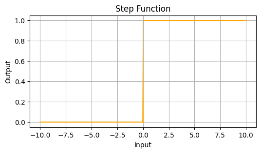
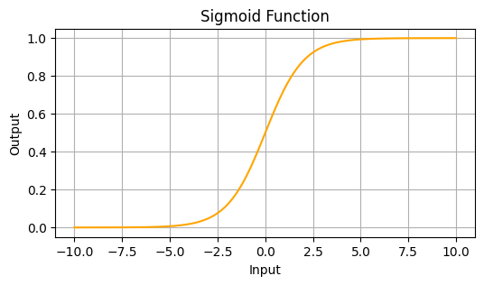
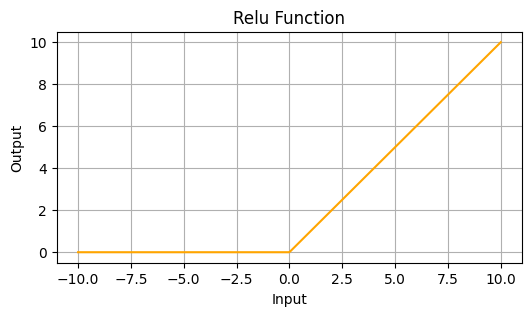
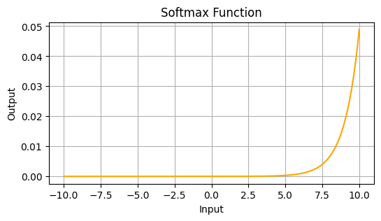
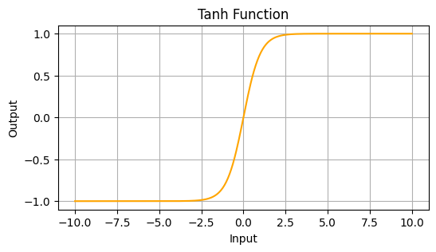
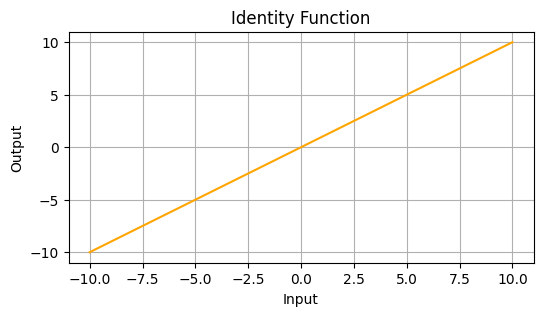

## 引言

在前文对 M-P 神经元结构的介绍以及「深度学习｜模型推理：端到端任务处理」的推理过程演示中，我们反复提到了`激活函数` $\sigma()$ 的概念，它决定了神经元的输出，在神经网络中起着至关重要的作用。激活函数的选择直接影响模型的性能和学习能力。

激活函数是一种用于引入非线性特性的数学函数，用于将加权和转换为更复杂的输出，使神经网络能够学习复杂的模式。通过引入非线性特性，可以解决非线性问题（否则神经网络的输出只是输入的线性组合，无法处理复杂的非线性问题），同时增强网络的表达能力，让其可以处理更复杂的问题。

> 激活函数对**梯度的传播**也很重要，一些激活函数（如 `ReLU`）具有`稀疏激活`性质，可以避免`梯度消失问题`，有利于更好的传播误差和加快`收敛`速度等作用。这些好的性质我们都将在后文对深度学习的进一步探讨中呈现给大家。

## 常见的激活函数

激活函数的选择往往根据求解问题的性质决定，一般回归问题可以使用`恒等函数`，二分类问题可以使用 `sigmoid` 函数，多分类问题可以使用 `softmax` 函数。

前文的手写数字识别任务中，输出层与隐层所用的激活函数 $\sigma$() 就有所不同。隐层使用了 `ReLU` 函数，输出层使用了 `softmax` 函数，我们将这些激活函数一一展开介绍。

**依赖模块**

> 我们会演示实现激活函数的`单个数据`运算的版本和`批量数据`运算的版本，其中批量计算将采用对矩阵运算有底层（甚至硬件层面）优化的 `numpy` 模块来实现；同时我们会使用 matplotlib 模块绘制各个激活函数的图形。
>
> **此处表示全局引入 numpy 与 matplotlib 这两个模块，后文将不再提及。**
>
> ```python
> import numpy as np
> import matplotlib.pyplot as plt
> ```

**激活函数图形绘制**

> 我们将统一使用如下的 `draw` 函数来绘制激活函数的图形：
>
> ```python
> def draw(X, activation_func, title, color='orange'):
>     """
>     绘制激活函数图形
>     :param X: 输入数据
>     :param activation_func: 激活函数
>     :param title: 图形标题
>     :param color: 图形颜色
>     """
>
>     # 创建一个新的图形，figsize 参数指定图形的大小为 6 x 3
>     plt.figure(figsize=(6, 3))
>
>     Y = activation_func(X)
>     plt.plot(X, Y, label=title, color=color)
>     plt.title(title)
>     plt.grid()
>     plt.xlabel('Input')
>     plt.ylabel('Output')
> ```

**绘图数据准备**

创建一批激活函数的输入数据 X，我们可以用它们进行激活函数的功能验证，同时将 X 的元素与对应的输出 Y 的元素构成的点描绘到坐标轴上，即可绘制出激活函数的图形。

```python
# 创建一个从 -10 到 10 的线性空间，共 400 个数据点
X = np.linspace(-10, 10, 400)
```

### 阶跃函数

`阶跃函数`以阈值为界，输入超过阈值则切换输出。如式 1 所示就是阶跃函数，它以 0 为界，小于 0 时输出 0，超过 0 时输出 1。

$$
    \sigma(x) = \begin{cases}
        0 & (x \leq 0) \\
        1 & (x > 0)
    \end{cases}                                \tag{1}
$$

式 1 的 Python 代码实现如下：

```python
def step_single(x):
    """阶跃函数（单个数据计算）"""
    return 1 if x > 0 else 0

def step(x):
    """阶跃函数（批量数据计算）"""
    return np.array(x > 0, dtype=np.int32)
```

绘制式 1 的图像：

```python
draw(X, step, 'Step Function')
```

<p class="caption">图 1：式 1 所示的阶跃函数</p>

可以看到，阶跃函数是一条由 0 突变到 1 的曲线，其输出值只有 0 和 1 两种情况，这种函数在神经网络中的应用受到了限制，因为它不是连续的，也不可导。

感知机使用了阶跃函数作为激活函数，因此感知机的神经元之间流动的只能是 0 或 1 的二元信号。

### **Sigmoid**

`Sigmoid` 函数是一种可以将输入信号转换为 0 到 1 之间的平滑输出信号的函数，其图形是一条如图 2 所示的平滑曲线，其数学式表示为式 2:

$$
    \sigma(x) = \frac{1}{1 + e^{-x}}             \tag{2}
$$

Sigmoid 函数的 Python 代码实现如下：

```python
def sigmoid_single(x):
    """Sigmoid 函数（单个数据计算）"""
    return 1 / (1 + math.exp(-x))

def sigmoid(x):
    """Sigmoid 函数（批量数据计算）"""
    return 1 / (1 + np.exp(-x))
```

绘制 Sigmoid 函数的图像：

```python
draw(X, sigmoid, 'Sigmoid Function')
```

<p class="caption">图 2：Sigmoid 函数</p>

Sigmoid 函数是一种常用的激活函数，它将输入信号转换为 (0, 1) 之间的输出，易于理解和解释。神经网络的隐层常使用 Sigmoid 函数作为激活函数，这使得神经元之间流动的是连续的实数值信号，这对神经网络的 BP 算法学习具有重要意义。

但 Sigmoid 函数也常常是导致梯度消失（vanishing gradient）问题的主因，可能影响深层网络的训练。

阶跃函数与 Sigmoid 函数的共同点是，当输入信号较小时（不重要的信号），输出接近 0，输入变大时（重要的信号），输出接近于 1，输出信号都介于 0 至 1 之间。

阶跃函数与 Sigmoid 函数都是非线性函数，这也是激活函数的基本要求，若使用线性函数做激活函数，将无法发挥多层神经网络的优势。比如三层神经网络使用线性函数作为激活函数，其运算可近似用 $y = c \times c \times c \times x$ 来表示，那与用 $y = a \times x$ 表示的单层网络是等效的。个中究竟，我们将在后续细说。

### **ReLU**

`ReLU`（`Rectified Linear Unit`，线性整流函数），在输入大于 0 时，直接输出该值，输入小于等于 0 时直接输出 0。ReLU 激活函数主要用于避免神经网络学习过程中的梯度消失与梯度爆炸，其定义为式 3：

$$
    \sigma(x) = \begin{cases}
        x & (x > 0) \\
        0 & (x \leq 0)
    \end{cases}                            \tag{3}
$$

或简化为：

$$
  \sigma(x) = \max(0, x)
$$

ReLU 函数的 Python 代码实现如下：

```python
def relu_single(x):
    """ReLU 函数（单个数据计算）"""
    return max(0, x)

def relu(x):
    """ReLU 函数（批量数据计算）"""
    return np.maximum(0, x)
```

绘制 ReLU 函数的图像：

```python
draw(X, relu, 'Relu Function')
```

<p class="caption">图 3：ReLU 函数</p>

ReLU 函数在正区间中输出是线性的，负区间输出为 0，计算简单，收敛速度快，被广泛使用。不过 ReLU 函数可能导致“死亡 ReLU”问题，即一些神经元在训练过程中始终输出 0。

### **Leaky ReLU**

Leaky ReLU 是对 ReLU 的改进，当输入小于 0 时，输出一个很小的值 $\alpha x$，其中 $\alpha$ 是一个小的常数（例如 0.01）。Leaky ReLU 函数的定义为式 4：

$$
    \sigma(x) = \begin{cases}
        x & (x > 0) \\
        \alpha x & (x \leq 0)
    \end{cases}                            \tag{4}
$$

其中 $\alpha$ 是一个小的常数（例如 0.01）。

Leaky ReLU 函数的 Python 代码实现如下：

```python
def leaky_relu_single(x, alpha=0.01):
    """Leaky ReLU 函数（单个数据计算）"""
    return x if x > 0 else alpha * x

# 4. Leaky ReLU
def leaky_relu(x, alpha=0.01):
    """Leaky ReLU 函数（批量数据计算）"""
    return np.where(x > 0, x, alpha * x)
```

绘制 Leaky ReLU 函数的图像：

```python
draw(X, leaky_relu, 'Leaky ReLU Function')
```

<p class="caption">图 4：Leaky ReLU 函数</p>

Leaky ReLU 解决了 ReLU 的“死亡”问题，在负区间提供了一个小的线性输出。

### **Softmax**

`Softmax`（归一化指数函数）将 n 个元素转换成和为 1，取值在 0.0 到 1.0 之间的概率分布表示，用于计算这 n 个元素中，第 k 个元素的概率。其定义为式 5：

$$
    \sigma(x_i) = \frac{e^{x_i}}{\sum_{j} e^{x_j}}       \tag{5}
$$

Softmax 函数的 Python 代码实现如下：

```python
def softmax_single(x):
    """Softmax 函数（单个数据计算）"""
    e_x = np.exp(x - np.max(x))  # 减去最大值以提高数值稳定性
    return e_x / e_x.sum()

def softmax(x):
    """Softmax 函数（批量数据计算）"""
    e_x = np.exp(x - np.max(x))  # 减去最大值以提高数值稳定性
    return e_x / e_x.sum(axis=0)
```

绘制 Softmax 函数的图像：

```python
draw(X, softmax, 'Softmax Function')
```

<p class="caption">图 5：Softmax 函数</p>

Softmax 输出值在 (0, 1) 之间，且所有输出的和为 1，可用于将输入转换为概率分布。

Softmax 函数多用于多分类任务的神经网络学习阶段的输出层激活函数，一般输出时只取 Softmax 的值最大（最大概率）的项。推理阶段则可以省略 Softmax 的计算。

### **Tanh**

`Tanh`（双曲正切函数）将输入信号转换为 -1 到 1 之间的输出信号，其数学式表示为式 6：

$$
    \sigma(x) = \tanh(x) = \frac{e^{x} - e^{-x}}{e^{x} + e^{-x}}       \tag{6}
$$

Tanh 函数的 Python 代码实现如下：

```python
def tanh_single(x):
    """Tanh 函数（单个数据计算）"""
    return (math.exp(x) - math.exp(-x)) / (math.exp(x) + math.exp(-x))

def tanh(x):
    """Tanh 函数（批量数据计算）"""
    return np.tanh(x)
```

绘制 Tanh 函数的图像：

```python
draw(X, tanh, 'Tanh Function')
```

<p class="caption">图 6：Tanh 函数</p>

Tanh 函数输出范围在 (-1, 1) 之间，通常比 Sigmoid 函数更好。但仍然可能受到梯度消失的问题，不过影响要小一些。

### 恒等函数

恒等函数将输入按原样输出，常用于回归问题。

```python
def identity(x):
    """恒等函数"""
    return x
```

绘制恒等函数的图像：

```python
draw(X, identity, 'Identity Function')
```

<p class="caption">图 7：恒等函数</p>

## 对比分析

| 激活函数       | 输出范围         | 计算复杂度 | 梯度问题                      | 可训练性 | 适用场景                                                                                                   | 网络结构                                                   |
| -------------- | ---------------- | ---------- | ----------------------------- | -------- | ---------------------------------------------------------------------------------------------------------- | ---------------------------------------------------------- |
| **Sigmoid**    | (0, 1)           | 低         | 梯度消失 (vanishing gradient) | 有限     | 常用于二分类问题的输出层，例如二元分类神经网络。由于输出值在 (0, 1) 之间，可以解释为概率。                 | 早期的多层感知器（MLP），逻辑回归模型。                    |
| **Tanh**       | (-1, 1)          | 低         | 梯度消失 (vanishing gradient) | 有限     | 通常在隐藏层使用，可以有效地将信息归一化到 (-1, 1) 之间，适合有负号的信号处理。                            | 长短期记忆网络（LSTM）、循环神经网络（RNN）。              |
| **ReLU**       | [0, ∞)           | 低         | 死亡 ReLU 问题                | 高       | 现代卷积神经网络和深度网络中广泛使用，能够加速收敛并减小梯度消失问题。                                     | 卷积神经网络（CNN）、深度前馈神经网络（DNN）。             |
| **Leaky ReLU** | [$\alpha{x}$, ∞) | 低         | 减少死亡 ReLU 问题            | 高       | 解决 ReLU 的“死亡神经元”问题，提供一个小的、非零的输出在输入小于零时。                                     | 深层卷积神经网络、对抗神经网络（GAN）。                    |
| **Softmax**    | (0, 1)且和为 1   | 中         | -                             | 高       | 用于多分类问题的输出层，将输出转化为概率分布，适合于需要进行多类分类的场景。                               | 多层感知器（MLP）、卷积神经网络（CNN）针对多类别分类任务。 |
| **Identity**   | (-∞, ∞)          | 低         | -                             | -        | 通常用于线性回归和某些深度学习模型的最后一层，特别是在输出是数值的场景中。                                 | 线性回归、某些回归任务的神经网络。                         |
| **Step**       | {0, 1}           | 低         | -                             | -        | 适用于需要分类的模型，尤其是二分类问题。由于是非连续函数，常用于阈值决策任务，但在现代深度学习中不太常用。 | 简单的逻辑门网络、某些早期的感知器模型。                   |

### 梯度问题

- **Sigmoid** 在输入值较大或较小时（远离 0），导数非常小，导致梯度消失（vanishing gradient problem）。这对深度网络的学习非常不利，尤其是在隐藏层。
- **Tanh** 虽然在 (-1, 1) 范围内输出信息，但在输入远离 0 时也会出现梯度消失的问题。相比 Sigmoid，Tanh 在中间区域的梯度更大，但仍然存在同样的风险。
- **ReLU** 在正区间（x > 0），梯度为 1，效果良好；但在负区间（x ≤ 0），梯度为 0，可能导致“死亡神经元”现象，即无法更新权重。这使得部分神经元在训练中失去作用。
- **Leaky ReLU** 在负区间，Leaky ReLU 提供一个小的非零梯度（例如，0.01），因此解决了 ReLU 的死亡神经元问题，同时也有效缓解了梯度消失的问题。
- **Softmax** Softmax 函数的输出与输入的线性组合有关，因此在多分类任务中可以提供良好的梯度，但在类别非常不平衡的情况下，可能导致学习不稳定或慢收敛。
- **Identity** 没有梯度消失的问题，因为其导数为常数（1）。然而，模型可能无法捕捉复杂的非线性关系。
- **Step** 在大多数情况下，其导数为 0，因此会导致梯度消失。没有梯度信息传递，使得网络无法学习。

### 可训练性

- **Sigmoid**：在一定范围内可训练性较好，但在饱和区域（靠近 0 或 1）时，梯度变得非常小，导致学习速度减慢，甚至停止学习，影响模型的性能。
- **Tanh**：相较于 Sigmoid，Tanh 的可训练性更好，因为它的输出范围在 (-1, 1) 内，梯度在 0 附近时更大。然而，在输入值远离 0 时，仍然会有梯度消失的问题。
- **ReLU**：可训练性优秀，在正区间有良好的梯度传递能力，但在负区间的“死亡神经元”问题可能导致部分神经元不再更新，从而影响整体学习效果。
- **Leaky ReLU**：提高了可训练性，因为在负区间仍有小的非零梯度，可以减少“死亡神经元”的发生，使得神经网络更容易学习。
- **Softmax**：在多分类任务中表现良好，能够有效传递梯度，但其主要用于输出层，实际的可训练性依赖于前面的层的选择和激活函数。
- **Identity**：可训练性较好，因其梯度始终为 1，能够有效传递误差。但由于只能表示线性关系，无法捕捉复杂的非线性特征。
- **Step**：可训练性差，因其导数在绝大多数情况下为 0，几乎没有梯度信息可供反向传播，从而使得网络无法有效学习。

激活函数的选择在一定程度上影响神经网络的可训练性。合适的激活函数能够加速收敛，提升模型性能，因此在设计网络时需要慎重考虑。

## 结语

激活函数是神经网络的核心组件之一，其对于模型的性能是至关重要的。不同的激活函数在输出范围、计算复杂度、梯度表现和适用场景等方面存在显著差异。选择合适的激活函数应根据具体任务的需求、网络结构与数据特性进行考量。随着深度学习的发展，激活函数的类型、性质及其设计原则也在不断演进。了解各种激活函数的特性，有助于设计更有效的神经网络结构。

以提高模型的训练效果和泛化能力为目的，结合科学研究和实证经验，不断探索新的激活函数，力求提高模型性能，例如 Swish、Mish 等新兴激活函数。

---

**PS：感谢每一位志同道合者的阅读，欢迎关注、点赞、评论！**
