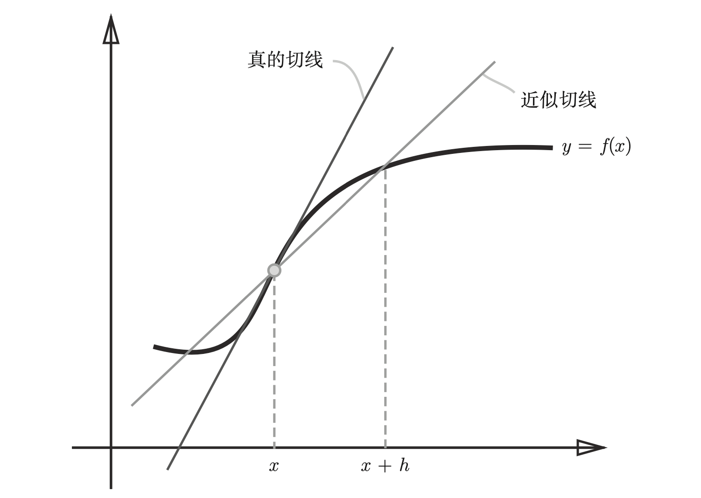
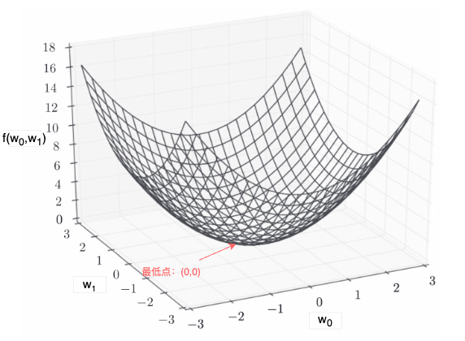

## 引言

在前文「深度学习｜模型推理：端到端任务处理」中，我们利用已经学好的神经网络进行了手写数字的识别，而这仅仅只是对模型的**使用**，那么怎么从零开始，自己制作（**学习**，或者**训练**）一个神经网络模型？换一个方式提问：我们要怎么得到一个神经网络的权重参数，使得这个神经网络能够正确地识别手写数字呢？

一般神经网络存在大量的权重参数（GPT-3 存在千亿级别的参数量），完全由人工来决定这些参数是不可能完成的事情，我们需要一种学习算法自动帮我们找到参数最优解。

`神经网络的训练` 就是从数据样例中自动学得神经网络的权重参数最优解的过程。结合前文推理过程来讲，就是从已知输入是 X 输出是 Y 的样例数据（训练集）中，学得最优的权重 W 与偏置 B。有了权重参数 W 和 B，在使用神经网络进行推理时，我们即使输入网络没有“见过”的数据 X'，也可以得到“相对正确”的 Y'，而这里“正确的程度”则取决于参数 W 和 B 的优化程度。

## 推理误差

要找到权重参数的最优解，我们首先需要确定如何来衡量这些参数在当前状态的优劣好坏。我们需要一个统一的可以表示当前权重参数优化状态的指标，以该指标为基准，对权重参数进行优化迭代，当这个指标的值达到最优时，我们就知道权重参数已经是最优了。

在神经网络中，我们通常会将**推理结果**与**实际结果**之间的误差作为衡量模型权重参数的好坏指标。

**也就是说，神经网络的训练，就是找寻可以使`推理误差`达到最小的权重参数。**

在数学上计算误差一般会想到 `均方误差`、`交叉熵` 等方法，这里我们以均方误差衡量推理误差为例，展开拆解神经网络的训练过程。

### 均方误差（Mean Squared Error, MSE）

`均方误差`（`Mean Squared Error`），顾名思义，表示预测值与实际值之差的平方的平均值。在神经网络中则可以体现为输出层所有神经元的值与实际结果的差的平方的总和（因为输出层神经元个数固定，系数固定情况下，总和与平均值代表的含义相同），如式 1。

$$
    E = \frac{1}{2} \sum_{k}(y_k - t_k)^2           \tag{1}
$$

其中 $y_k$ 表示神经网络的第 k 个神经元的输出，$t_k$ 表示对应的实际结果，也称`监督数据`。取 $\frac{1}{2}$ 是为了方便后续神经网络的计算。

我们依旧以前文的手写数字识别任务为例。

神经网络会输出一组表示概率分布的 10 个 y 值，分别代表了推理结果为 0 ~ 9 的概率。例如：`[0.1, 0.05, 0.6, 0.0, 0.05, 0.1, 0.0, 0.1, 0.0, 0.0]` ，代表推理结果认为样例是 0 的概率为 0.1，1 的概率为 0.05，2 的概率为 0.6，以此类推；推理结果认为该样例最可能是数字 2（索引位 2 上的概率值 0.6 是 10 个概率值中最高的）。

实际结果 t 则是 one-hot 表示的 10 个数字，如：`[0, 0, 1, 0, 0, 0, 0, 0, 0, 0]`，第 2 个元素是 1，代表实际结果该样例确实是数字 2。

> `one-hot` 表示的实际数值 t 是一个长为 k，只有一个元素是 1，其他全是 0 的数组。
>
> 实际数值 t 是确定的，因此数值 2 对应索引位的概率值直接是 1，其他全是 0。

则推理结果 y 相对实际结果 t 的`均方误差`为：

$$
    E = \frac{1}{2} \sum_{k}(y_k - t_k)^2 \\
    = \frac{1}{2}[(0.1 - 0)^2 + (0.05 - 0)^2 + (0.6 - 1)^2 + ... + (0.0 - 0)^2] \\
    = \frac{1}{2}[0.01 + 0.0025 + 0.16 + ... + 0.0] \\
    = 0.195
$$

> 更一般的，我们可以将对单次推理的误差计算推广到对一批（n 个）推理的误差计算。求一批包含 n 个样例的训练集的输出 y 的误差，可以用式 2 表示：
>
> $$
>     E = \frac{1}{2N} \sum_{n} \sum_{k}(y_{nk} - t_{nk})^2   \tag{2}
> $$

如此，我们确定了衡量神经网络推理误差大小的方式，并依此计算出了当前推理结果的具体误差大小。那么如何通过这个误差来调整优化神经网络的权重参数呢？

我们希望的效果是，在以“某种方式”调整权重参数时，我们是知道推理误差是在减小的。要达到这样的效果，首先我们需要找到误差与权重参数之间的运算关系，依此关系，也就能通过使推理误差最小化以得到最佳权重参数。

> 在神经网络中通常将衡量`推理误差`的计算方式称之为**损失函数**（loss function），损失函数是表示神经网络性能“恶劣程度”的指标，即当前神经网络对监督数据有多么不拟合，多么不一致。`均方误差`仅是损失函数中最常见的一种，还有一些其他的损失函数我们将在后续篇章中统一详解。

## 梯度下降

有了损失函数，我们也就明确了当前权重参数的优化程度，那么如何才能寻找使损失值最小的权重参数呢？

从前文的「深度学习｜模型推理：端到端任务处理」中，我们知道 y 的值是由输入 x 和权重参数 (w, b) 决定的，即:

$$
    y = f(x, w, b)      \tag{3}
$$

我们可以将损失函数 E 表示为 y 和 t 的函数，即：

$$
    E = L(y, t)         \tag{4}
$$

我们希望找到使 E 最小的 (w, b)，首先确认 E 与 (w, b) 的关系：

$$
    E = L(f(x, w, b), t)         \tag{5}
$$

**其中 (x, t) 是训练集中的一对输入输出样例，f 是神经网络的推理函数，L 是损失函数。这些都是已知的，接下来的问题是如何通过这些已知信息，找到使 E 最小的 (w, b)？**

我们知道在微分的概念中，函数的导数可以表示函数的变化趋势，即函数的导数值为正，说明函数值在增大，导数值为负，说明函数值在减小，导数值为 0，说明函数值不变。因此，我们可以通过求损失函数关于权重参数的导数，来找到使损失函数最小（极小）的权重参数。

### 导数

导数是微积分中的一个重要概念，用于描述函数的局部变化率。它揭示了一个函数在某一点上的瞬时变化情况。

<p class="caption">图 1：导数的定义（数值微分）</p>

对于一个在某一点 $x$ 上具有定义的函数 $f(x)$，导数 $f'(x)$ 被定义为：

$$
    f'(x) = \frac{\partial{f(x)}}{\partial{x}} = \lim_{h \to 0} \frac{f(x + h) - f(x)}{h}
$$

这里：

- $h$ 是一个非常小的增量，是自变量 $x$ 的变化量。
- $f(x + h) - f(x)$ 是函数值的变化量。
- 导数 $f'(x)$ 表示 $x$ 处的切线斜率，即函数在该点的变化瞬间 f(x) 的变化率。

如果导数为正（即 $f'(x) > 0$），函数在该点是递增的；如果导数为负（即 $f'(x) < 0$），函数在该点是递减的。

利用导数的这一性质，可以找到函数的局部最大值和最小值（通过求导并解方程 $f'(x) = 0$）。

**同理通过调整自变量 $x$（导数为正则减小自变量 $x$，反之则增大自变量 $x$）使得因变量 $y$ 逐渐减小至极小值（局部最小值）。**

### 偏导数

神经网络的权重参数实际有很多个，求函数关于多个变量的导数，我们称为求`偏导数`。在求函数关于某个变量的偏导数时，需要先通过确定的值定住其他变量。

以式 6 所示函数为例，求 $f(w_0, w_1)$ 在 $(w_0, w_1)$ = (3, 4) 处关于 $w_0$ 的偏导数：

$$
    f(w_0, w_1) = w_0^2 + w_1^2             \tag{6}
$$

首先，我们定住 $w_1$ 参数，代入 $w_1$ = 4 可得式 7：

$$
    f_t(w_0) = w_0^2 + 4^2 = w_0^2 + 16       \tag{7}
$$

求式 6 在 $(w_0, w_1)$ = (3, 4) 处关于 $w_0$ 的偏导数，就相当于求式 7 在 $w_0$ = 3 处关于 $w_0$ 的导数：

$$
    \frac{\partial{f}}{\partial{w_0}} = \frac{\partial{f_t}}{\partial{w_0}}     \\
            = \lim_{h \to 0} \frac{f_t(w_0 + h) - f_t(w_0)}{h}        \tag{8}
$$

以上数值微分的表达式是为了助于推演梯度下降发的含义，我们可以直接使用导数的`解析解`得到式 8 的结果：

$$
    \frac{\partial{f}}{\partial{w_0}} = \frac{\partial{f_t}}{\partial{w_0}} = 2w_0 = 2 \times 3 = 6        \tag{9}
$$

### 梯度

函数关于所有变量的偏导数组成的向量（即一维数组）我们称之为`梯度`。如式 6 的梯度：$\begin{pmatrix} \frac{\partial{f}}{\partial{w_0}}, \frac{\partial{f}}{\partial{w_1}} \end{pmatrix}$。

### 梯度下降法

假若我们对损失函数求关于所有权重参数的偏导数（梯度），就相当于知道了所有权重参数变化瞬间对损失函数造成的变化量，即改变该权重参数时，损失函数的变化趋势。

- 若偏导数值为负，说明该权重参数的微小增加将使损失函数变小，此时加大该权重参数的值将使损失减小。
- 若偏导数值为正，说明该权重参数的微小增加将使损失函数变大，此时减小该权重参数的值将使损失减小。
- 当偏导数值为 0，说明该权重参数的微小增加将不会改变损失函数，此时损失函数已是极小值（最优解）。

以式 6 为例，已知 $f(w_0, w_1)$ 在 $(w_0, w_1)$ 处的梯度为：$\begin{pmatrix} \frac{\partial{f}}{\partial{w_0}}, \frac{\partial{f}}{\partial{w_1}} \end{pmatrix}$，要使得 $f(w_0, w_1)$ 变得更小，我们可以这样调整 $w_0, w_1$：

$$
    w_0 = w_0 - \eta \frac{\partial{f}}{\partial{w_0}}
$$

$$
    w_1 = w_1 - \eta \frac{\partial{f}}{\partial{w_1}}
$$

$\eta$ 表示参数的的更新量，在神经网络中被称为**学习率**（learning rate）。

> 学习率一般设置在 0.01 或 0.001，太大或太小都可能导致参数无法抵达一个好的位置，神经网络在训练过程中还可以一边训练，一边调整学习率，并确认训练是否可以正确进行。

> 像`学习率`这样和神经网络的权重参数性质不一样的，往往需要人工设置而非由训练自动获得的参数，被称为**超参数**，超参数往往需要尝试多个值，直到找出一种可以使训练顺利进行的选项。

通过反复进行求梯度并更新权重参数，直至梯度下降至一个阈值，我们就可以得到一组合格的权重参数。

这种通过计算损失函数关于权重参数的梯度，“并沿着梯度向下”寻找可以使损失函数下降到极小值（即权重参数最优状态）的方法，我们称之为`梯度下降法`（`gradient descent method`）。

**梯度函数**

我们可以通过数值微分求导法实现函数关于 1 组参数的梯度：

```python
import numpy as np

def numerical_gradient_1d(f, x):
    """梯度函数
    用数值微分求导法，求 f 关于 1 组参数的 1 个梯度。

    Args:
        f: 损失函数
        x: 参数（1 组参数，1 维数组）
    Returns:
        grad: 1 组梯度（1 维数组）
    """
    h = 1e-4                    # 0.0001
    grad = np.zeros_like(x)     # 生成和 x 形状相同的数组，用于存放梯度（所有变量的偏导数）

    for idx in range(x.size):   # 挨个遍历所有变量
        xi = x[idx]             # 取第 idx 个变量
        x[idx] = float(xi) + h
        fxh1 = f(x)             # 求第 idx 个变量增大 h 所得计算结果

        x[idx] = xi - h
        fxh2 = f(x)             # 求第 idx 个变量减小 h 所得计算结果

        grad[idx] = (fxh1 - fxh2) / (2*h)  # 求第 idx 个变量的偏导数
        x[idx] = xi             # 还原第 idx 个变量的值
    return grad
```

现假设 $(w_0, w_1)$ 是某个神经网络的权重参数，且 $f(w_0, w_1) = w_0^2 + w_1^2$ 正好为该网络的损失函数：

```python
def loss_function(w):
    """损失函数
    Args:
        w0: 参数 w0
        w1: 参数 w1
    Returns:
        损失值
    """
    return w[0]**2 + w[1]**2
```

$f(w_0, w_1)$ 的图形如图 2 所示：

<p class="caption">图 2：f(w0,w1) 的最小损失</p>

训练该网络其实就是通过梯度下降法迭代求得可使损失函数值最小的 $(w_0，w_1)$，具体过程如下：

```python
def gradient_descent(initial_w, learning_rate=0.1, num_iterations=100):
    """梯度下降法
    Args:
        initial_w: 初始参数
        learning_rate: 学习率
        num_iterations: 迭代次数
    """
    w = initial_w

    for i in range(num_iterations):
        grad = numerical_gradient_1d(loss_function, w)      # 计算梯度
        w -= learning_rate * grad                           # 更新参数

        # 打印当前损失值
        if i % 10 == 0:                                   # 每 10 次打印一次
            print(f"Iteration {i}: w = {w}, loss = {loss_function(w)}")

    return w

# 随机初始化 w0 = -3.0, w1 = 4.0
init_w = np.array([-3.0, 4.0])
final_w = gradient_descent(init_w)

print(f"Final parameters: {final_w}")
```

最终输出：

```python
Iteration 0: w = [-2.4  3.2], loss = 15.99999999999875
Iteration 10: w = [-0.25769804  0.34359738], loss = 0.18446744073649915
Iteration 20: w = [-0.02767012  0.03689349], loss = 0.0021267647932494446
Iteration 30: w = [-0.00297106  0.00396141], loss = 2.4519928653780434e-05
Iteration 40: w = [-0.00031901  0.00042535], loss = 2.8269553036369085e-07
Iteration 50: w = [-3.42539446e-05  4.56719262e-05], loss = 3.2592575621253703e-09
Iteration 60: w = [-3.67798930e-06  4.90398573e-06], loss = 3.7576681324268233e-11
Iteration 70: w = [-3.94921094e-07  5.26561458e-07], loss = 4.3322963970507253e-13
Iteration 80: w = [-4.24043296e-08  5.65391061e-08], loss = 4.994797680490399e-15
Iteration 90: w = [-4.55313022e-09  6.07084029e-09], loss = 5.758609657000494e-17
Final parameters: [-6.11110793e-10  8.14814391e-10]
```

我们最终得到 $f(w_0, w_1) = w_0^2 + w_1^2$ 的最优解（使函数值趋于最小的解）是 $(w_0, w_1)$ = (-6.11110793e-10, 8.14814391e-10)，即趋近于 (0, 0) 的地方，参照图 2，$f(w_0,w_1)$ 的最低点 (0,0)，这符合我们的预期。

> 在进行神经网络的训练时，不能将识别精度（正确数在总样本中的占比）作为指标。因为如果以识别精度为指标，参数的导数在绝大多数地方都会变为 0，识别精度是不连续的、突变的，导数可能多为 0。

## 结语

试想你现在正好在一个山坡上，你的目的是找到下山的路，按照梯度下降法（数值微分解法），你可以先尝试着往某个方向踏出微小的一步，然后回退回来，若这一步下降了，则你可以往前走一步，若这一步上升了，则你可以往后退一步，如此反复，直至找到山坡的最低点。

梯度下降法是神经网络训练的核心算法，通过梯度下降法，我们可以找到使损失函数最小的权重参数，从而使神经网络的推理结果更加准确。梯度下降法是一个迭代的过程，需要不断调整参数，直至损失函数收敛。在实际应用中，我们还会使用一些优化算法（如 `Adam`、`RMSprop` 等）来加速梯度下降的过程，具体的优化算法我们将在后续篇章中详细介绍。

---

**PS：感谢每一位志同道合者的阅读，欢迎关注、点赞、评论！**
