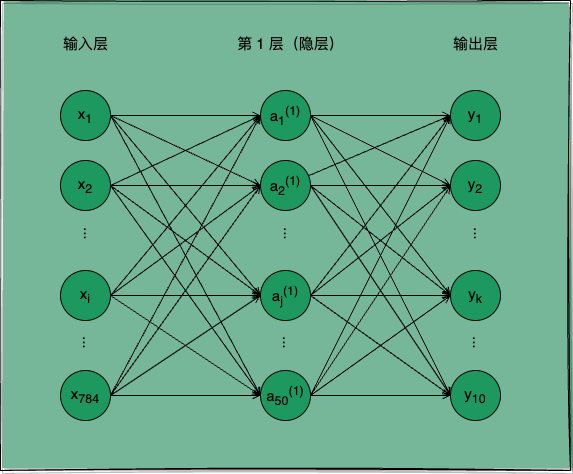
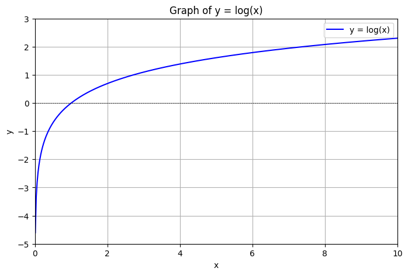
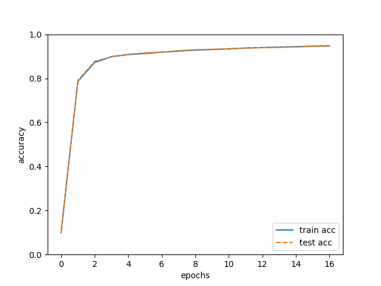

## 引言

从前文「深度学习｜梯度下降法：误差最小化的权重参数」，我们知道了神经网络的学习就是“找寻使损失函数的值尽可能小的权重参数”的过程，又掌握了找寻的方法（梯度下降法）。凭借这些信息，我们可以以纯手写 Python 代码的方式，实现一个简单的神经网络 SimpleNet，使用这个 SimpleNet 来演示神经网络的整个训练过程，并验证它的推理效果。

## SimpleNet 网络结构

我们依旧以`手写数字识别`为任务目标，实现一个可用于该任务的形如图 1 所示的 `SimpleNet`，亲身体验一下神经网络`学会`识别这些图片所代表数字的**数学过程**。

<p class="caption">图 1：用于处理手写数字识别任务的 SimpleNet 神经网络</p>

如图 1 所示，SimpleNet 是一个两层神经网络，它的输入层有 784 个神经元，分别代表 28 $\times$ 28 个像素值，第 1 层隐层有 50 个功能神经元，输出层有 10 个神经元，分别代表预测结果为 0 ~ 9 的概率。

从前文对神经网络的介绍中我们知道，要实现一个神经网络的基本功能，除了要确定`神经网络的结构`，我们还需要确定它每一层所使用的`激活函数`，以及在进行`梯度下降法`优化`权重参数`时所使用的`损失函数`以及`梯度函数`。

### 激活函数

SimpleNet 的第 1 层隐层我们使用 Sigmoid 函数作为激活函数，Sigmoid 函数是一个 S 型函数，它将输入值映射到 0 到 1 之间，有助于神经网络的非线性表达。输出层我们使用 Softmax 函数作为激活函数，Softmax 函数将输入值映射成 0 到 1 之间的概率值，它输出值归一化，使得输出值之和为 1，用于此类多分类任务正好合适：

```python
import numpy as np

def sigmoid(x):
    """S 型函数"""
    return 1 / (1 + np.exp(-x))

def softmax(x):
    """归一化指数函数"""
    if x.ndim == 2:
        x = x.T
        x = x - np.max(x, axis=0)
        y = np.exp(x) / np.sum(np.exp(x), axis=0)
        return y.T

    x = x - np.max(x)  # 溢出对策
    return np.exp(x) / np.sum(np.exp(x))
```

关于激活函数的更多详细介绍可以参见前文「深度学习｜激活函数：网络表达增强」。

### 损失函数

SimpleNet 的损失函数我们可以选择使用`交叉熵误差`（`cross entropy error`），交叉熵误差可用于评估类别的概率分布，常用于此类多分类任务。

交叉熵误差计算的是对应正确解神经元的输出的自然对数，用式 1 表示：

$$
    E = - \sum_{k}t_k\log{y_k}                        \tag{1}
$$

其中 $y_k$ 表示神经网络输出层的第 k 个神经元的输出值，$t_k$ 表示监督数据的 `one-hot` 表示。

因为 $t_k$ 中只有正确解索引位的值为 1，其他均为 0，式 1 实际只计算了对应正确解神经元输出的自然对数。

因此交叉熵误差的图形可以等价于自然对数函数图形：

<p class="caption">图 2：y = log(x) 的图形</p>

以 `y = [0.1, 0.05, 0.6, 0.0, 0.05, 0.1, 0.0, 0.1, 0.0, 0.0]`，`t = [0, 0, 1, 0, 0, 0, 0, 0, 0, 0]` 为例，推理结果 y 相对实际结果 t 的`交叉熵误差`为：

$$
    E = -\log{y_2} \\
        = -\log{0.6} \\
        = 0.51。
$$

> 更一般的，我们可以将单个 (y, t) 数据样例的交叉熵误差计算推广到求一批包含 n 个样例的训练集的交叉熵误差计算（用于 mini-batch 的梯度计算），用式 2 表示：
>
> $$
>     E = -\frac{1}{n} \sum_{i=1}^{n} \sum_{k} t_{ik} \log{y_{ik}}  \tag{2}
> $$

如下是交叉熵误差函数的 Python 实现：

```python
def cross_entropy_error(y, t):
    """交叉熵误差函数"""
    if y.ndim == 1:
        t = t.reshape(1, t.size)
        y = y.reshape(1, y.size)

    # 监督数据是 one-hot-vector 的情况下，转换为正确解标签的索引
    if t.size == y.size:
        t = t.argmax(axis=1)

    batch_size = y.shape[0]
    return -np.sum(np.log(y[np.arange(batch_size), t] + 1e-7)) / batch_size
```

### 梯度计算

前文「深度学习｜梯度下降法：误差最小化的权重参数」中我们介绍了对一组参数 x 求函数 f 梯度的方法：

```python
import numpy as np

def _numerical_gradient_1d(f, x):
    """梯度函数
    用数值微分求导法，求 f 关于 1 组参数的 1 个梯度。

    Args:
        f: 损失函数
        x: 参数（1 组参数，1 维数组）
    Returns:
        grad: 1 组梯度（1 维数组）
    """
    h = 1e-4                    # 0.0001
    grad = np.zeros_like(x)     # 生成和 x 形状相同的数组，用于存放梯度（所有变量的偏导数）

    for idx in range(x.size):   # 挨个遍历所有变量
        xi = x[idx]             # 取第 idx 个变量
        x[idx] = float(xi) + h
        fxh1 = f(x)             # 求第 idx 个变量增大 h 所得计算结果

        x[idx] = xi - h
        fxh2 = f(x)             # 求第 idx 个变量减小 h 所得计算结果

        grad[idx] = (fxh1 - fxh2) / (2*h)  # 求第 idx 个变量的偏导数
        x[idx] = xi             # 还原第 idx 个变量的值
    return grad
```

在此基础上我们可以推广到对多组参数 X 求函数 f 梯度的方法：

```python
def numerical_gradient_2d(f, X):
    """梯度函数（批量）
    用数值微分求导法，求 f 关于 n 组参数的 n 个梯度。

    Args:
        f: 损失函数
        X: 参数（n 组参数，2 维数组）
    Returns:
        grad: n 组梯度（2 维数组）
    """
    if X.ndim == 1:
        return _numerical_gradient_1d(f, X)
    else:
        grad = np.zeros_like(X)

        for idx, x in enumerate(X):
            grad[idx] = _numerical_gradient_1d(f, x)

        return grad
```

numerical_gradient_2d 实现了对多组参数 X 同时求函数 f 梯度，这将可以直接应用于下文关于模型训练的 mini-batch 梯度计算当中。

## SimpleNet 类

有了激活函数、损失函数、梯度计算函数，我们就可以实现简单的神经网络 SimpleNet 类了。

### 权重参数

首先 SimpleNet 类包含了神经网络的权重参数 W 与偏置参数 B，我们在 SimpleNet 类的 `__init__` 方法定义和保存这些权重参数：

```python
class SimpleNet(object):
    """一个简单的演示神经网络 SimpleNet，用于演示神经网络对手写数字图像识别任务的自动学习和推理过程。

    Attributes:
        params: 存放 SimpleNet 网络权重参数与偏置参数
            W1: 第 1 层网络的权重参数
            b1: 第 1 层网络的偏置参数
            W2: 第 2 层网络的权重参数
            b2: 第 2 层网络的偏置参数
    """

    def __init__(self, input_size, hidden_size, output_size, weight_init_std=0.01):
        """SimpleNet 的初始化函数

        Args:
            input_size:      输入层（第 0 层）神经元个数（神经网络入参个数）
            hidden_size:     隐藏层（第 1 层）神经元个数
            output_size:     输出层（第 2 层）神经元个数（神经网络出参个数）
            weight_init_std: 用于初始化权重参数的高斯分布的标准差
        """
        # 初始化权重
        self.params = {}
        self.params['W1'] = weight_init_std * \
            np.random.randn(input_size, hidden_size)    # 用高斯分布进行 W1 参数的随机初始化
        self.params['b1'] = np.zeros(hidden_size)       # 用 0 进行 b1 参数的初始化
        self.params['W2'] = weight_init_std * \
            np.random.randn(hidden_size, output_size)   # 用高斯分布进行 W2 参数的随机初始化
        self.params['b2'] = np.zeros(output_size)       # 用 0 进行 b2 参数的初始化
```

### 模型推理

参见前文「深度学习｜模型推理：端到端任务处理」，我们可以根据输入 x 和 SimpleNet 的权重参数（W、B）计算出推理结果 y：

```python
import numpy as np

import sigmoid, softmax

class SimpleNet(object):
    # ...

    def predict(self, x):
        """推理函数
            识别数字图像代表的数值。

        Args:
            x: 图像像素值数组（图像数据）
        Returns:
            y: 推理结果，图像代表的数值
        """
        W1, W2 = self.params['W1'], self.params['W2']
        b1, b2 = self.params['b1'], self.params['b2']

        s1 = np.dot(x, W1) + b1
        a1 = sigmoid(s1)
        s2 = np.dot(a1, W2) + b2
        y = softmax(s2)

        return y
```

### 损失计算

结合监督数据 t 与 SimpleNet 的推理函数 predict 得到的推理结果 y，我们可以使用上文的`交叉熵函数`实现损失函数：

```python
import cross_entropy_error

class SimpleNet(object):
    # ...

    def loss(self, x, t):
        """损失函数（交叉熵误差）

        Args:
            x: 输入数据，即图像数据
            t: 监督数据，即正确解标签
        Returns:
            loss: 推理的损失值
        """
        y = self.predict(x)

        return cross_entropy_error(y, t)
```

### 梯度计算

有了损失函数，我们可以直接使用上文的梯度计算函数来计算网络损失关于当前权重参数的梯度：

```python
import numerical_gradient_2d

class SimpleNet(object):
    # ...

    def numerical_gradient(self, x, t):
        """梯度函数（数值微分求导法）

        Args:
            x: 输入数据，即图像数据
            t: 监督数据，即正确解标签
        Returns:
            grads: 误差函数关于当前权重参数的梯度
        """
        def loss_W(W):
            """损失值关于权重参数的函数
            """
            return self.loss(x, t)

        grads = {}
        grads['W1'] = numerical_gradient_2d(loss_W, self.params['W1'])
        grads['b1'] = numerical_gradient_2d(loss_W, self.params['b1'])
        grads['W2'] = numerical_gradient_2d(loss_W, self.params['W2'])
        grads['b2'] = numerical_gradient_2d(loss_W, self.params['b2'])

        return grads
```

如此，我们已经完成了整个简单神经网络 SimpleNet 的封装，接下来我们可以使用 SimpleNet 来训练一个手写数字识别模型，并验证它识别的准确度。

### SimpleNet 概览

SimpleNet 可以完整演示神经网络的训练与推理的过程，它包含一个存放权重参数的 params 属性，以及若干用于训练和推理的方法。我们可以看到 SimpleNet 的概要信息：

| 变量   | 说明                                                                                                                                                                                                                        |
| ------ | --------------------------------------------------------------------------------------------------------------------------------------------------------------------------------------------------------------------------- |
| params | 存放 SimpleNet 网络权重参数与偏置参数： <br/>&nbsp;&nbsp;W1: 第 1 层网络的权重参数； <br/>&nbsp;&nbsp;b1: 第 1 层网络的偏置参数； <br/>&nbsp;&nbsp;W2: 第 2 层网络的权重参数； <br/>&nbsp;&nbsp;b2: 第 2 层网络的偏置参数。 |

| 方法                                                                                   | 说明                                                                                                                                                                                                                                                                                                                              |
| -------------------------------------------------------------------------------------- | --------------------------------------------------------------------------------------------------------------------------------------------------------------------------------------------------------------------------------------------------------------------------------------------------------------------------------- |
| `__init__`(self, input_size, <br/>hidden_size, output_size, <br/>weight_init_std=0.01) | SimpleNet 的初始化函数。 <br/>Args: <br/>&nbsp;&nbsp;input_size: 输入层（第 0 层）神经元个数（神经网络入参个数） <br/>&nbsp;&nbsp;hidden_size: 隐藏层（第 1 层）神经元个数 <br/>&nbsp;&nbsp;output_size: 输出层（第 2 层）神经元个数（神经网络出参个数） <br/>&nbsp;&nbsp;weight_init_std: 用于初始化权重参数的高斯分布的标准差。 |
| predict(self, x)                                                                       | 推理函数，识别数字图像代表的数值。                                                                                                                                                                                                                                                                                                |
| loss(self, x, t)                                                                       | 损失函数（交叉熵误差）                                                                                                                                                                                                                                                                                                            |
| numerical_gradient(self, x, t)                                                         | 梯度函数（数值微分法）                                                                                                                                                                                                                                                                                                            |

## 模型训练

结合前文我们对推理误差（损失函数）与梯度下降法的理解，神经网络的训练过程可以大致归纳成如下 3 个步骤：

1. 从训练集随机选取一批数据 mini-batch，求网络在 mini-batch 数据上损失函数关于当前权重参数的梯度；
2. 将权重参数沿着梯度方向进行微小更新，即使用前文所述梯度下降法对权重参数进行优化迭代；
3. 重复步骤 1、2，直到损失函数达到某个阈值，即得到了“最优”权重参数。

> 此处使用随机的 mini-batch 数据进行梯度下降法对权重参数进行迭代，这种学习算法被称为**随机梯度下降**（`stochastic gradient descent`，`SGD 算法`）。

我们先创建一个 SimpleNet 神经网络，该网络有 784 个输入神经元，分别代表 28 $\times$ 28 个像素值；50 个隐层神经元；10 个输出神经元，分别代表预测结果为 0 ~ 9 的概率。

```python
network = SimpleNet(input_size=784, hidden_size=50, output_size=10)
```

### 数据准备

在正式训练 `network` 之前，我们需要准备好用于学习手写数字识别的训练集（图片数据和标签数据），并将数据集分割为`训练数据`（`训练集`）和`测试数据`（`测试集`），训练集用于训练模型，测试集用于评估已学得模型的**泛化能力**。如此是为了在评估模型泛化能力时所使用的样例始终是模型没有“见过”的，这样才能比较真实的评估出模型处理新样例的能力，即泛化能力。

我们直接使用 Scikit-learn 提供的 MNIST 数据集，关于 MNIST 数据集的介绍可参见前文「深度学习｜模型推理：端到端任务处理」。

```python
from sklearn.datasets import fetch_openml

mnist = fetch_openml('mnist_784', version=1)
# "data" 是图像数据，"target" 是标签数据
X, y = mnist["data"], mnist["target"]
# 此处直接取前 60000 个样例为训练集，后 10000 个样例为测试集
x_train, x_test, t_train, t_test = X[:60000], X[60000:], y[:60000], y[60000:]
```

如此，我们可以使用 x_train、t_train 进行模型训练，使用 x_test、t_test 进行模型泛化能力的评估。

### 训练过程

1. 随机选取 mini-batch 数据，求梯度

我们从训练数据集中随机选取 100 张图片作为一个 mini-batch：

```python
def mini_batch(x, t, batch_size=100):
    """从 (x, t) 随机选取 mini-batch 数据

    Args:
        x: 数据集
        t: 标签集
        batch_size: mini-batch 大小
    Returns:
        x_batch: mini-batch 数据
        t_batch: mini-batch 标签
    """

    train_size = x.shape[0]
    batch_mask = np.random.choice(train_size, batch_size)

    x_batch = x.iloc[batch_mask]
    # 将批量标签值转换为 array[int] 表示，用于计算交叉熵误差时提取正确推理值
    t_batch = t.iloc[batch_mask].to_numpy().astype(int)

    return x_batch, t_batch

# mini batch input, mini batch label
x_batch, t_batch = mini_batch(x_train, t_train, 100)
```

使用 SimpleNet 对该 mini-batch 求损失函数关于网络当前权重参数的梯度：

```python
# 计算梯度：此处为了演示数学过程，我们使用的是简单的数值微分法；
# 后文将使用深度学习框架中真实使用的 BP 算法，BP 算法可以实现更高效的梯度计算。
grad = network.numerical_gradient(x_batch, t_batch)
```

2. 根据梯度更新权重参数

有了梯度，我们就可以使用梯度下降法更新权重参数了。

```python
# 依次更新权重参数：W1, b1, W2, b2
for key in ('W1', 'b1', 'W2', 'b2'):
    # 将相应参数沿梯度方向进行微小更新
    network.params[key] -= learning_rate * grad[key]
```

3. 进行多次重复学习

我们直接重复第 1、2 步 10000 次，记录下每 600 次（一轮）学习时，网络的损失值、网络在训练集和测试集上的识别精度。

```python
iters_num = 10000           # 设定迭代次数：让 SimpleNet 对训练集进行 10000 次学习，每次学习随机选取 100 个样例
batch_size = 100            # 设定 mini-batch 的大小：每次从训练集中随机选取 100 个样例进行学习
learning_rate = 0.1         # 设定学习率：每次学习时更新权重参数的步长为 0.1

train_loss_list = []        # 记录训练过程中的损失值
train_acc_list = []         # 记录每轮学习后，神经网络在训练集上的识别精度
test_acc_list = []          # 记录每轮学习后，神经网络在测试集上的识别精度

# 每轮学习的迭代次数 = 训练集长度 / 每批长度
iter_per_epoch = max(train_size / batch_size, 1)

for i in range(iters_num):
    # 执行步骤 1
    x_batch, t_batch = mini_batch(x_train, t_train, batch_size)
    grad = network.numerical_gradient(x_batch, t_batch)

    # 执行步骤 2
    for key in ('W1', 'b1', 'W2', 'b2'):
        network.params[key] -= learning_rate * grad[key]

    # 记录训练过程中的损失值
    loss = network.loss(x_batch, t_batch)
    train_loss_list.append(loss)

    # 每轮（600 次）学习记录一次训练数据和测试数据的识别精度
    if i % iter_per_epoch == 0:
        train_acc = network.accuracy(x_train, t_train)
        test_acc = network.accuracy(x_test, t_test)
        train_acc_list.append(train_acc)
        test_acc_list.append(test_acc)
        print(f"train acc, test acc | {str(train_acc)}, {str(test_acc)}")
```

> 训练轮次，理论上 600 次随机 mini-batch 的选取会完成一次全训练集的覆盖，一次全训练集的覆盖被称为一轮学习。

> 此外，我们可以给 SimpleNet 添加一个计算识别精度的方法：
>
> ```python
> import numpy as np
>
> class SimpleNet(object):
>     # ...
>
>     def accuracy(self, x, t):
>         """精准度函数
>         求推理正确的百分比。
>
>         Args:
>             x: 输入数据，即图像数据
>             t: 监督数据，即正确解标签
>         Returns:
>             accuracy: 推理的精准度
>         """
>         y = self.predict(x)
>         y = np.argmax(y, axis=1)
>
>         accuracy = np.sum(y == t) / float(x.shape[0])
>         return accuracy
> ```
>
> SimpleNet 的 accuracy 方法可用于跟踪训练过程中模型的识别精度变化，以便验证 SimpleNet 的训练是否有效。

以下是训练过程中输出的训练集和测试集的识别精度：

```python
train acc, test acc | 0.09863333333333334, 0.0958
train acc, test acc | 0.7862666666666667, 0.7905
train acc, test acc | 0.8725333333333334, 0.8775
train acc, test acc | 0.8982833333333333, 0.8986
train acc, test acc | 0.9079833333333334, 0.9094
train acc, test acc | 0.9131333333333334, 0.9163
train acc, test acc | 0.9188833333333334, 0.9193
train acc, test acc | 0.92375, 0.9259
train acc, test acc | 0.9282, 0.9301
train acc, test acc | 0.9308166666666666, 0.9322
train acc, test acc | 0.9338666666666666, 0.9346
train acc, test acc | 0.93785, 0.9372
train acc, test acc | 0.93975, 0.9396
train acc, test acc | 0.9421666666666667, 0.9405
train acc, test acc | 0.94385, 0.9422
train acc, test acc | 0.9462166666666667, 0.9451
train acc, test acc | 0.9479333333333333, 0.9462
```

我们可以给出训练过程中训练集和测试集的识别精度随训练轮次变化的图形，如图 3：

<p class="caption">图 3：训练数据和测试数据的识别精度随学习轮次的变化图形</p>

从结果可以看出，随着学习的进行，训练集和测试集的识别精度很快从不足 10% 提高到了 94% 以上，这说明神经网络在训练过程中，不仅能够识别训练集的图片，还能够识别未曾“见过”的测试集的图片，即神经网络具有一定的泛化能力。

> 模型若将一些个例的特征（一般是独属于训练集的）当做普遍特征进行训练，即对训练集中的特例过度拟合，此时可能出现测试机精度明显不如训练集精度的情况，这种状态被称为`过拟合`（`over fitting`），避免过拟合是机器学习领域的一个重要课题，我们将会在后续篇章中展开详述。

## 结语

本文我们通过手写 Python 代码实现了一个简单的神经网络 SimpleNet，并使用 MNIST 数据集演示了 SimpleNet 的完整训练过程，最终我们对模型训练过程中训练集和测试机的识别精度做了跟踪验证，从结果可以看出，随着学习的进行，训练集和测试集的识别精度都很快从不足 10% 提高到了 94% 以上，SimpleNet 对测试集中未曾“见过”的图片也具备了准确的识别能力，这验证了 SimpleNet 的泛化能力。

---

**PS：感谢每一位志同道合者的阅读，欢迎关注、点赞、评论！**
