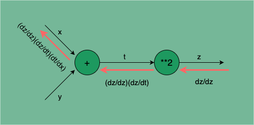
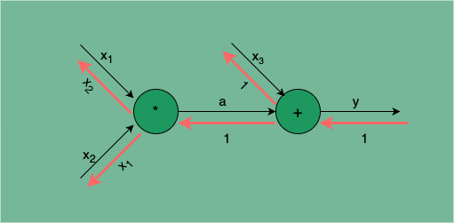

## 引言

我们知道训练神经网络模型的核心是以损失函数为基准来调整优化网络参数，使得网络的输出尽可能接近真实标签。在神经网络中，优化网络参数需要计算每个权重参数的梯度，而不同的网络结构，计算梯度的方式和复杂度往往大不相同，有没有一种算法，即可以有效计算所有类型的网络结构的梯度，又可以保证计算的高效性？答案就是我们今天要讲的`误差逆传播`算法。

## 链式法则

要理解误差逆传播算法，需要先了解微分中`链式法则`的概念。链式法则是微分中的基本法则，可用于求解复合函数的导数。

如果某个函数由复合函数表示，则该复合函数的导数可以用构成该复合函数的各个函数的导数的乘积表示。

以式 1 所示的复合函数为例：

$$
    z = t^2 \\
    t = x + y                       \tag{1}
$$

通过链式法则求解 $\frac{\partial{z}}{\partial{x}}$：

$$
    \frac{\partial{z}}{\partial{x}} = \frac{\partial{z}}{\partial{t}} \frac{\partial{t}}{\partial{x}} = 2t \times 1 = 2(x + y)
$$

可见一个复杂函数的求导问题可以分解为组成该复杂函数的局部函数的求导问题，我们完全可以将复杂函数的导数等价的表示为其所有局部函数的导数的乘积。

在神经网络中，误差逆传播算法就是利用链式法则来计算网络中每个参数的梯度。

## 误差逆传播

在前文「深度学习｜模型训练：手写 SimpleNet」中，我们演示了使用`数值微分`方式求梯度的过程，数值微分的方式求梯度简单、易于理解与实现，但它的问题是计算效率很低。在 SimpleNet 的示例中，我们使用数值微分法训练所需时间长达 27.7 小时，几乎是不可用的状态。

那么有没有更高效的替代方式呢？终于轮到神经网络的主角算法`误差逆传播`出场了！

参考上文求复合函数（式 1）关于 x 的导数 $\frac{\partial{z}}{\partial{x}}$ 的求解过程，给定 x 与 y，按照函数式求解 z 的正向计算的过程，就好比神经网络的`前向传播`（`Forward Propagation`），而沿着函数正向计算的链路，从最末端逆向计算每个局部函数的导数，最终相乘从而得到该复杂函数的导数，就好比神经网络的`逆传播`（`Backward Propagation`）。

**前向传播（Forward Propagation）**：将输入数据通过网络进行运算，得到网络的**输出**、输出与目标值之间的**误差**。
**逆传播（Backward Propagation）**：从输出层开始，将**误差**逆传播到隐藏层，直到输入层。逆传播过程可以计算每个权重的梯度，即误差相对于每个权重的偏导数。

**误差逆传播**（`error BackPropagation`，简称 `BP`）就是基于数学推导的`解析性`（相对于数值微分的`数值性`）梯度计算方法（`符号微分`，`Symbolic Differentiation`），按照数学中求导的**链式法则**，局部导数会按**正向传播**的反方向传递。

以求解 $\frac{\partial{z}}{\partial{x}}$ 为例，我们可以用如下图 1 中红色箭头所指过程表示该求导过程：

<p class="caption">图 1：局部导数沿着函数正向计算的链路逆向传播</p>

图 1 所示从左到右是复合函数的正向传播过程，表示的是 $t = x + y$，$z = t^2$ 的正向计算过程。

从右往左是复合函数的逆传播过程，通过逆传播求函数关于 x 的导数 $\frac{\partial{z}}{\partial{x}}$，只需要沿着正向计算的链路逆向计算每个局部函数的导数，例如从输出 `z` 到 `z` 本身的导数是 $\frac{\partial{z}}{\partial{z}}$，从 `z` 到 `t` 的导数是 $\frac{\partial{z}}{\partial{t}}$，从 `t` 到 `x` 的导数是 $\frac{\partial{t}}{\partial{x}}$，最终将每个环节的导数相乘即是该复合函数的导数 $\frac{\partial{z}}{\partial{z}} \frac{\partial{z}}{\partial{t}} \frac{\partial{t}}{\partial{x}}$（其中 $\frac{\partial{z}}{\partial{z}}$ 可忽略）。这就是 BP 算法的基本思想。

不难发现，神经网络中的前向传播都是由一些简单的加法、乘法等常用的运算复合而成，而神经网络的逆传播就是求解网络整个`“复合函数”`关于网络各层中`权重参数`的`梯度`。

我们在了解了 BP 算法的基本思路后，不难得出这些梯度的求解方式：沿着网络的正向运算过程，反向从输出层开始，往前计算每层运算的局部梯度，然后将求解目标参数梯度的完整链路上的所有`局部梯度`相乘，得到的就是目标参数的梯度。

接下来我们可以找到在逆传播过程中，使用 BP 算法求解加法、乘法等常用运算的梯度的规律。应用这些规律，我们可以在神经网络的逆传播运算过程中高效地计算梯度。

### 加法的逆传播

以 $z = x + y$ 为例，其梯度 ($\frac{\partial{z}}{\partial{x}}$，$\frac{\partial{z}}{\partial{y}}$) 永远为 (1, 1)。

**因此加法运算在逆传播时，总是将下游梯度乘以 1，即原封不动传递给上游。**

我们可以使用 `AddLayer` 类实现加法运算的前向传播与逆传播：

```python
class AddLayer:
    """
    加法运算的前向传播与逆传播
    """

    def __init__(self):
        self.x = None
        self.y = None

    def forward(self, x, y):
        """
        前向传播

        Args:
            x: 输入 x
            y: 输入 y

        Returns:
            out: 输出
        """

        out = x + y

        return out

    def backward(self, dout):
        """
        逆传播

        Args:
            dout: 上游梯度

        Returns:
            dx: x 的梯度
            dy: y 的梯度
        """

        dx = dout * 1
        dy = dout * 1

        return dx, dy
```

> 这里采用了`标准层`封装的方式来实现`加法运算`，将加法运算封装成了一个可以被任意结构的神经网络直接复用的`小组件`，其他如`乘法运算`、`激活函数`、`损失函数`等我们都将采用这样的实现方式。采用这样的封装方式，我们就可以在组装我们想要的网络时随意选择我们想要的组件（基本运算单元）。在实际的生产级机器学习框架（如 Scikit-learn、TensorFlow、PyTorch 等）中，这些底层运算封装也正是采用了这样的方式实现。

### 乘法的逆传播

以 $z = xy$ 为例，其梯度 ($\frac{\partial{z}}{\partial{x}}$，$\frac{\partial{z}}{\partial{y}}$) = (y, x)。

**因此乘法运算的逆传播时，总是将下游梯度乘以上游相乘参数的值（翻转值）。比如 x 与 y 相乘，求关于 x 的偏导数时，y 是 x 的翻转值；求关于 y 的偏导数时，x 是 y 的翻转值。**

同上，我们用 `MulLayer` 类实现乘法运算的前向传播与逆传播：

```python
class MulLayer:
    """
    乘法运算的前向传播与逆传播
    """

    def __init__(self):
        self.x = None
        self.y = None

    def forward(self, x, y):
        """
        前向传播

        Args:
            x: 输入 x
            y: 输入 y

        Returns:
            out: 输出
        """

        self.x = x
        self.y = y
        out = x * y

        return out

    def backward(self, dout):
        """
        逆传播

        Args:
            dout: 上游梯度

        Returns:
            dx: x 的梯度
            dy: y 的梯度
        """

        dx = dout * self.y
        dy = dout * self.x

        return dx, dy
```

### 逆传播求梯度

以 $y = x_1x_2 + x_3$ 为例，求 $(x_1, x_2, x_3)$= (100, 2, 300) 处的梯度。

<p class="caption">图 2：逆传播求梯度的计算链路，红色箭头表示逆传播的计算方向</p>

式 $y = x_1x_2 + x_3$ 的计算链路如图 2，我们可以直接通过上文的 MulLayer 和 AddLayer 进行前向传播求 y，以及逆传播求关于 $(x_1, x_2, x_3)$ 的梯度。

```python
x1, x2, x3 = 100, 2, 300
mul_layer = MulLayer()
add_layer = AddLayer()

# forward
a = mul_layer.forward(x1, x2)
y = add_layer.forward(a, x3)
print(y)                # 500

# backward
da, dx3 = add_layer.backward(1)
dx1, dx2 = mul_layer.backward(da)
print(dx1, dx2, dx3)    # (x2, x1, 1) = (2, 100, 1)
```

运行结果与图 2 中所示 $(x_2, x_1, 1)$（输入 $x_1, x_2, x_3$ 各自的反向红色箭头是它们各自的梯度）一致，可见逆传播求梯度的结果是符合预期的。

> 以上逆传播求梯度过程可以直接应用在神经网络中对数组和矩阵的运算上：
>
> ```python
> x1, x2, x3 = np.array([100, 101, 102]), np.array([2, 3, 4]), np.array([300, 301, 302])
> mul_layer = MulLayer()
> add_layer = AddLayer()
>
> # forward
> a = mul_layer.forward(x1, x2)
> y = add_layer.forward(a, x3)
> print(y)                # [500 604 710]
>
> # backward
> da, dx3 = add_layer.backward(1)
> dx1, dx2 = mul_layer.backward(da)
> print(dx1, dx2, dx3)    # (x2, x1, 1) = [2 3 4] [100 101 102] 1
> ```

## SoftmaxWithLoss 层

我们知道神经网络模型的训练过程就是根据损失函数关于权重参数的梯度优化权重参数的过程，其中求解损失函数关于权重参数的梯度是运算的核心。而损失函数往往是神经网络正向传播中的最后一个环节（训练过程的最后一个过程是损失函数，推理过程则一般不需要计算损失），根据 BP 算法的思路，在逆传播过程中，求解损失函数的`“局部梯度”`就成了求解权重参数梯度的第一步。

由于在多分类任务中，神经网络模型经常使用 Softmax 函数来对最终输出做归一化处理，我们在封装损失函数时，通常会将 Softmax 函数与损失函数结合在一起，这样的结构我们称之为`SoftmaxWithLoss`层。

下面我们以`交叉熵误差`为例，通过实现一个 `SoftmaxWithLoss` 层来演示 BP 算法及其`“局部梯度”`的求解过程。

### 交叉熵误差

我们以多分类任务的交叉熵误差为例，其计算公式为：

$$
    L(y, t) = -\sum_{i} t_i \log(y_i)
$$

其中：

- $y$ 是模型的输出，通常是经过 softmax 函数处理得到的预测概率分布。
- $t$ 是真实标签，通常是 one-hot 编码表示的实际结果。

使用 Python 代码实现的交叉熵误差函数：

```python
import numpy as np

def cross_entropy_error(y, t):
    """
    交叉熵误差函数

    Args:
        y: 神经网络的输出
        t: 监督数据

    Returns:
        float: 交叉熵误差
    """

    # 监督数据是 one-hot-vector 的情况下，转换为正确解标签的索引
    if t.size == y.size:
        t = t.argmax(axis=1)

    batch_size = y.shape[0]
    return -np.sum(np.log(y[np.arange(batch_size), t] + 1e-7)) / batch_size
```

### 逆传播求梯度

交叉熵误差关于输出 $y$ 的导数为：

$$
    \frac{\partial L}{\partial y_i} = -\frac{t_i}{y_i}
$$

对于所有 $i$，这可以以向量的形式表示为：

$$
    \frac{\partial L}{\partial y} = -\frac{t}{y}
$$

### 误差逆传播

假设神经网络的最后一层输出是经过 softmax 函数的 $y$，我们可以定义 softmax 函数如下：

$$
    y_j = \frac{e^{z_j}}{\sum_{k} e^{z_k}}
$$

其中 $z$ 是神经网络最后一层的未归一化的输出。

在误差逆传播中，我们需要根据损失函数 $L$ 的输出偏导数来更新权重。

#### 1. 计算关于 z 的梯度

使用链式法则，可以从 $L$ 到 $z$ 计算梯度：

$$
    \frac{\partial L}{\partial z_j} = \frac{\partial L}{\partial y_j} \cdot \frac{\partial y_j}{\partial z_j}
$$

#### 2. 计算 $\frac{\partial y_j}{\partial z_j}$

使用 softmax 的导数，我们可以得到：

$$
    \frac{\partial y_j}{\partial z_k} = y_j (\delta_{jk} - y_k)
$$

其中 $\delta_{jk}$ 是克罗内克（Kronecker）delta，等于 1 当 $j=k$，否则等于 0。

#### 3. 最终梯度

最终的通式为：

$$
    \frac{\partial L}{\partial z_j} = y_j - t_j
$$

这意味着，你可以直接得到关于 $z$ 的梯度：

$$
    \frac{\partial L}{\partial z} = y - t
$$

### 实现示例

以下是计算交叉熵误差及其梯度的示例代码：

```python
import numpy as np

def softmax(z):
    exp_z = np.exp(z - np.max(z))  # 为了避免溢出
    return exp_z / np.sum(exp_z, axis=1, keepdims=True)

def cross_entropy_loss(y, t):
    return -np.sum(t * np.log(y + 1e-10))  # 防止log(0)

# 示例数据
z = np.array([[1.0, 2.0, 0.5], [0.0, 1.0, 1.0]])  # 未归一化输出
t = np.array([[1, 0, 0], [0, 1, 0]])  # one-hot 编码标签

# 计算 softmax
y = softmax(z)

# 计算损失
loss = cross_entropy_loss(y, t)

# 计算梯度
grad = y - t

print("Softmax Result:\n", y)
print("Cross Entropy Loss:", loss)
print("Gradient:\n", grad)
```

将以上逆传播求梯度的过程套用在神经网络损失函数关于权重参数的梯度求解上，我们就实现一个高效的神经网络学习算法，这就是 BP 算法。

BP 算法实质是 LMS（Least Mean Square）算法的推广。LMS 试图使网络的输出均方误差最小化，用于神经元激活函数可微的感知机学习，LMS 推广到由非线性可微神经元组成的多层前馈网络，就是 BP 算法。

BP 算法是迄今最成功的神经网络学习算法，通常神经网络（不限于前馈神经网络）都使用 BP 算法进行训练。“BP 网络”特指使用 BP 算法训练的多层前馈神经网络。

### 总结

这个过程展示了如何使用交叉熵误差进行误差逆传播梯度计算。关键是利用链式法则和 softmax 函数的导数，最终得出损失相对输出和未归一化输出的梯度。这些梯度可以用于更新神经网络的权重。
