## 引言

我们知道，神经网络的能够学习处理任务的核心是计算损失的梯度，而误差逆传播算法是求梯度的一种通用且高效的办法。使用误差逆传播算法求解神经网络的梯度，其实就是求网络中使用的各种基本运算的局部导数的过程。这期我们将回顾各类基本运算的求导公式，然后演示如何将这些公式运用在误差逆传播算法求解网络梯度。

> **依赖模块统一导入**
>
> 此处我们统一导入本文所需的所有依赖模块，下文中不再重复演示。
>
> ```python
> import numpy as np
> import matplotlib.pyplot as plt
> ```
>
> **作图准备**
>
> 此处我们准备一个可以绘制下文所有函数图形的 `draw` 方法，并准备作图用的数据，方便后续演示。
>
> ```python
> def draw(X, func, func_derivative, title, x_point=1, color='orange', **kwargs):
>     """
>     绘制函数、切线、导数函数的图形
>     :param X: 输入数据
>     :param func: 函数
>     :param func_derivative: 函数导数
>     :param title: 图形标题
>     :param x_point: 切线点的 x 轴坐标
>     :param color: 图形颜色
>     :param kwargs: 函数的参数
>     """
>
>     # 创建子图，figsize 参数指定图形的大小为 12 x 5
>     fig, axs = plt.subplots(1, 2, figsize=(12, 4.5))
>
>     # 绘制函数图形
>     axs[0].plot(X, func(**kwargs)(X), label=title, color=color)
>     axs[0].set_title(title)
>     axs[0].set_xlabel('Input')
>     axs[0].set_ylabel('Output')
>
>     # 绘制在 x_point 处的切线
>     func_x_point = func(**kwargs)(x_point)
>     func_prime = func_derivative(**kwargs)(x_point)
>     tangent_line_func = func_x_point + func_prime * (x - x_point)
>     axs[0].plot(x, tangent_line_func,
>                 label=f"Tangent to {title} at x={x_point}", linestyle=':', color='red')
>     axs[0].scatter([x_point], [func_x_point], color='red')
>
>     # legend 函数用于显示图例
>     axs[0].legend()
>     # grid 函数用于显示网格
>     axs[0].grid(True)
>
>     # 绘制导数函数图形
>     axs[1].plot(X, func_derivative(**kwargs)(X), label=f"Derivative of {title}", color=color)
>     axs[1].set_title(f"Derivative of {title}")
>     axs[1].set_xlabel('Input')
>     axs[1].set_ylabel('Output')
>     axs[1].legend()
>     axs[1].grid(True)
>
>     # tight_layout 函数用于调整子图之间的间距
>     plt.tight_layout()
>     plt.show()
> ```
>
> **数据准备**
>
> ```python
> # x 从 -2 到 2，等间隔的 400 个点，用于绘制函数图形
> x = np.linspace(-2, 2, 400)
> ```

## 基础函数的求导

### 常数函数

常数函数是指函数的值在定义域内保持为常数 $c$，即：

$$
    f(x) = c
$$

常数函数的导数为零：

$$
    \frac{d}{dx}[c] = 0
$$

使用 Python 实现常数函数及其导数：

```python
def constant_function(c):
    return lambda x: np.full_like(x, c)


def constant_derivative(c):
    return lambda x: np.zeros_like(x)
```

查看常数函数及其导数的图形：

```python
# 绘制常数 c=1 时，常数函数的图形、常数函数在 x=1.0 处的切线、常数函数的导数图形
draw(x, constant_function, constant_derivative, "Constant Function(c=1)", x_point=1.0, color='blue', c=1)
```

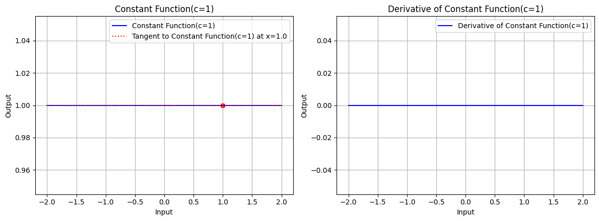<p class="caption">图 1：常数 c=1 时，常数函数的图形、常数函数在 x=1.0 处的切线、常数函数的导数图形</p>

常数函数的图形是一条截距为 $c$ 的水平直线，其导数为零，导数函数的图形是一条全为零的水平直线。

### 幂函数

幂函数是指函数的定义域为实数，求关于 $x$ 的 $n$ 次幂的函数，其中 $n$ 是整数，即：

$$
    f(x) = x^n
$$

幂函数 $f(x) = x^n$ 的导数为：

$$
    \frac{d}{dx}[x^n] = nx^{n-1}
$$

使用 Python 实现幂函数及其导数：

```python
def power_function(n):
    return lambda x: np.power(x, n)


def power_derivative(n):
    return lambda x: n * np.power(x, n - 1)
```

查看幂函数及其导数的图形：

```python
# 绘制指数 n=2 时，幂函数的图形、幂函数在 x=1.0 处的切线、幂函数的导数图形
draw(x, power_function, power_derivative, "Power Function(n=2)", x_point=1.0, color='blue', n=2)
```

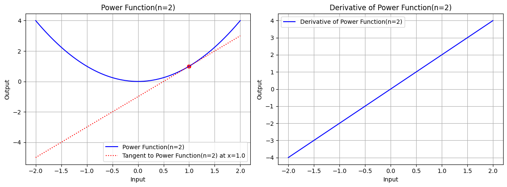<p class="caption">图 2.1：指数 n=2 时，幂函数的图形、幂函数在 x=1.0 处的切线、幂函数的导数图形</p>

```python
# 绘制指数 n=3 时，幂函数的图形、幂函数在 x=1.0 处的切线、幂函数的导数图形
draw(x, power_function, power_derivative, "Power Function(n=3)", x_point=1.0, color='blue', n=3)
```

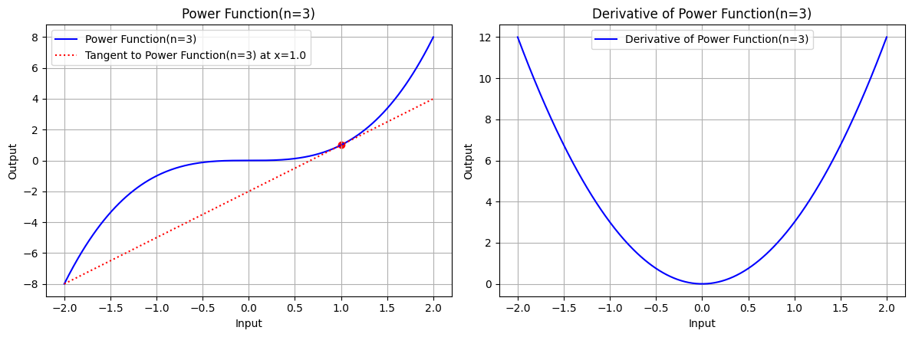<p class="caption">图 2.2：指数 n=3 时，幂函数的图形、幂函数在 x=1.0 处的切线、幂函数的导数图形</p>

幂函数的图形是一条经过原点的曲线，其导数为 $nx^{n-1}$，导数函数的图形是一条经过原点的曲线。

### 指数函数

指数函数是指函数的定义域为实数，求实数 $a$ 的 $x$ 次幂的函数，即：

$$
    f(x) = a^x
$$

指数函数的导数为：

$$
    \frac{d}{dx}[a^x] = a^x \ln(a)
$$

当 $a=e$ 时，这个函数被称为自然指数函数：

$$
    f(x) = e^x
$$

自然指数函数的导数为：

$$
    \frac{d}{dx}[e^x] = e^x
$$

使用 Python 实现指数函数及其导数：

```python
def exp_function(a):
    return lambda x: np.exp(x) if a == np.e else np.power(a, x)


def exp_derivative(a):
    return lambda x: np.exp(x) if a == np.e else np.power(a, x) * np.log(a)
```

查看指数函数及其导数的图形：

```python
# 绘制底数 a=e 时，指数函数的图形、指数函数在 x=1.0 处的切线、指数函数的导数图形
draw(x, exp_function, exp_derivative, "Exp Function(a=e)", x_point=1.0, color='blue', a=np.e)
```

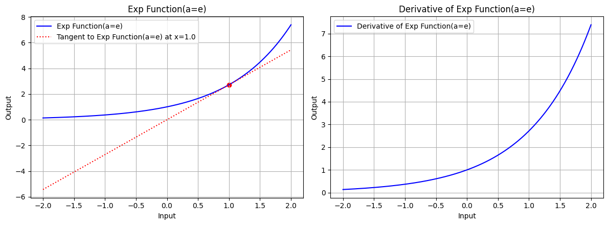<p class="caption">图 3.1：底数 a=e 时，指数函数的图形、指数函数在 x=1.0 处的切线、指数函数的导数图形</p>

```python
draw(x, exp_function, exp_derivative, "Exp Function(a=10)", x_point=1.0, color='blue', a=10)
```

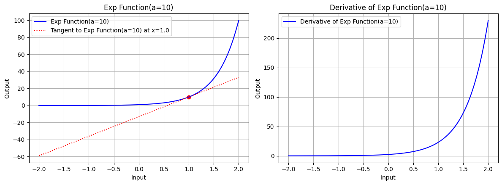<p class="caption">图 3.2：底数 a=10 时，指数函数的图形、指数函数在 x=1.0 处的切线、指数函数的导数图形</p>

### 对数函数

对数函数是指函数的定义域为正实数，求底数为 $a$ 的实数 $x$ 的对数的函数，即：

$$
    f(x) = \log_a(x)
$$

对数函数的导数为：

$$
    \frac{d}{dx}[\log_a(x)] = \frac{1}{x \ln(a)}
$$

当底数 $a=e$ 时，我们称这样的对数函数为自然对数函数：

$$
    f(x) = \ln(x)
$$

自然对数函数的导数为：

$$
    \frac{d}{dx}[\ln(x)] = \frac{1}{x}
$$

常用对数 $\log_{10}(x)$ 的导数：

$$
    \frac{d}{dx}[\log_{10}(x)] = \frac{1}{x \ln(10)}
$$

使用 Python 实现对数函数及其导数：

```python
def log_function(base):
    return lambda x: np.log(x) / np.log(base)


def log_derivative(base):
    return lambda x: 1 / (x * np.log(base))
```

查看对数函数及其导数的图形：

```python
x_log = np.linspace(0.01, 3, 400)
draw(x_log, log_function, log_derivative, "Log Function(base=e)", x_point=1.0, color='blue', base=np.e)
```

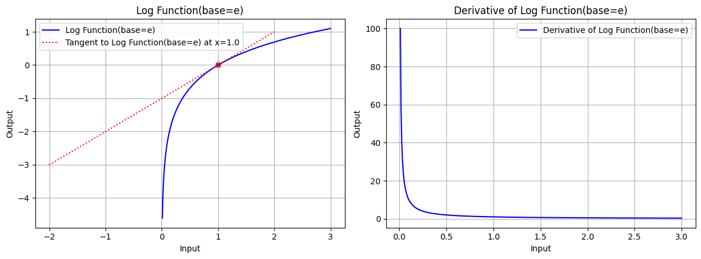<p class="caption">图 4.1：底数 base=e 时，对数函数的图形、对数函数在 x=1.0 处的切线、对数函数的导数图形</p>

```python
draw(x_log, log_function, log_derivative, "Log Function(base=10)", x_point=1.0, color='blue', base=10)
```

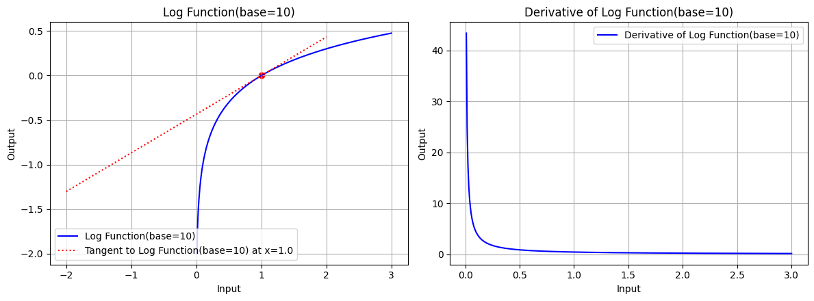<p class="caption">图 4.2：底数 base=10 时，对数函数的图形、对数函数在 x=1.0 处的切线、对数函数的导数图形</p>

### 三角函数

三角函数是指函数的定义域为实数，求三角形的角度的函数，常见的三角函数包括正弦函数 $\sin(x)$、余弦函数 $\cos(x)$ 和正切函数 $\tan(x)$。

正弦函数 $\sin(x)$ 的导数：

$$
    \frac{d}{dx}[\sin(x)] = \cos(x)
$$

余弦函数 $\cos(x)$ 的导数：

$$
    \frac{d}{dx}[\cos(x)] = -\sin(x)
$$

正切函数 $\tan(x)$ 的导数：

$$
    \frac{d}{dx}[\tan(x)] = \sec^2(x)
$$

使用 Python 实现三角函数及其导数：

```python
def sin_function():
    return lambda x: np.sin(x)


def sin_derivative():
    return lambda x: np.cos(x)


def cos_function():
    return lambda x: np.cos(x)


def cos_derivative():
    return lambda x: -np.sin(x)


def tan_function():
    return lambda x: np.tan(x)


def tan_derivative():
    return lambda x: 1 / np.cos(x)**2
```

查看三角函数及其导数的图形：

```python
x_tri = np.linspace(-5, 5, 400)
draw(x_tri, sin_function, sin_derivative, "Sin Function", x_point=1.0, color='blue')
```

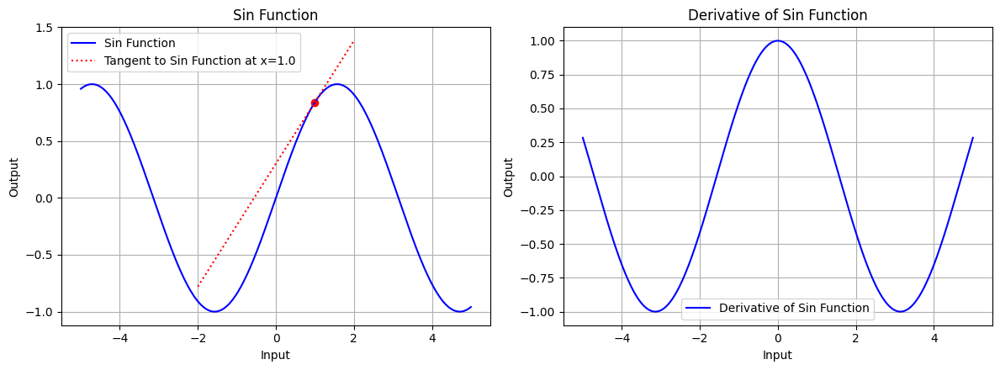<p class="caption">图 5.1：正弦函数的图形、正弦函数在 x=1.0 处的切线、正弦函数的导数图形</p>

```python
draw(x_tri, cos_function, cos_derivative, "Cos Function", x_point=1.0, color='blue')
```

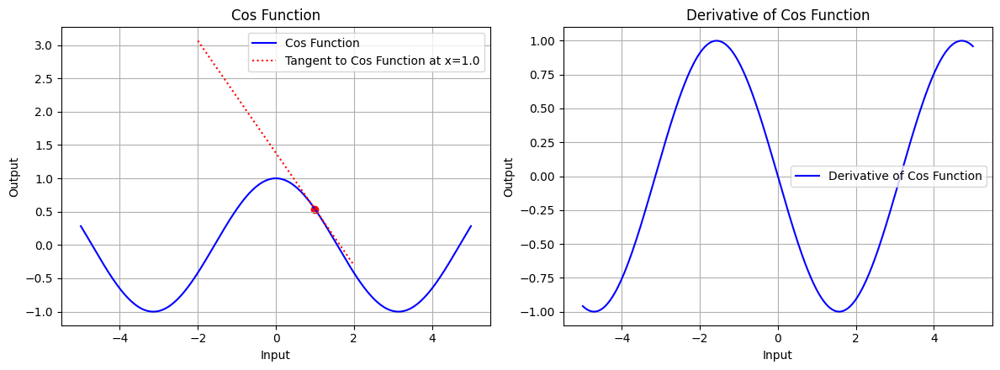<p class="caption">图 5.2：余弦函数的图形、余弦函数在 x=1.0 处的切线、余弦函数的导数图形</p>

```python
x_tri = np.linspace(-1.5, 1.5, 100)
draw(x_tri, tan_function, tan_derivative, "Tan Function", x_point=1.0, color='blue')
```

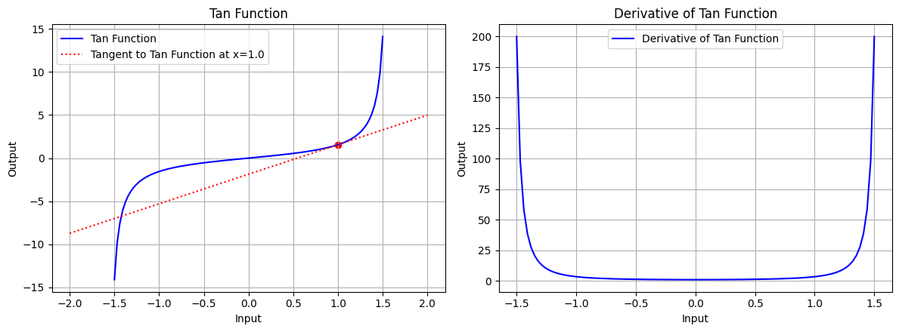<p class="caption">图 5.3：正切函数的图形、正切函数在 x=1.0 处的切线、正切函数的导数图形</p>

### 反三角函数

反三角函数是指函数的定义域为实数，求三角函数的反函数，常见的反三角函数包括反正弦函数 $\arcsin(x)$、反余弦函数 $\arccos(x)$ 和反正切函数 $\arctan(x)$。

反正弦函数 $\arcsin(x)$ 的导数：

$$
    \frac{d}{dx}[\arcsin(x)] = \frac{1}{\sqrt{1-x^2}}
$$

反余弦函数 $\arccos(x)$ 的导数：

$$
    \frac{d}{dx}[\arccos(x)] = -\frac{1}{\sqrt{1-x^2}}
$$

反正切函数 $\arctan(x)$ 的导数：

$$
    \frac{d}{dx}[\arctan(x)] = \frac{1}{1+x^2}
$$

使用 Python 实现反三角函数及其导数：

```python
def arcsin_function():
    return lambda x: np.arcsin(x)


def arcsin_derivative():
    return lambda x: 1 / np.sqrt(1 - x**2)


def arccos_function():
    return lambda x: np.arccos(x)


def arccos_derivative():
    return lambda x: -1 / np.sqrt(1 - x**2)


def arctan_function():
    return lambda x: np.arctan(x)


def arctan_derivative():
    return lambda x: 1 / (1 + x**2)
```

查看反三角函数及其导数的图形：

```python
x_atri = np.linspace(-0.999, 0.999, 100)
draw(x_atri, arcsin_function, arcsin_derivative, "ArcSin Function", x_point=0.25, color='blue')
```

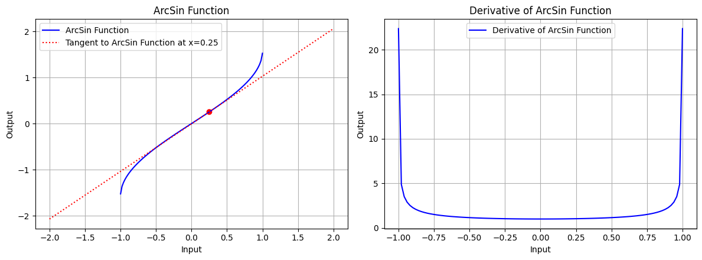<p class="caption">图 6.1：反正弦函数的图形、反正弦函数在 x=0.25 处的切线、反正弦函数的导数图形</p>

```python
draw(x_atri, arccos_function, arccos_derivative, "ArcCos Function", x_point=0.25, color='blue')
```

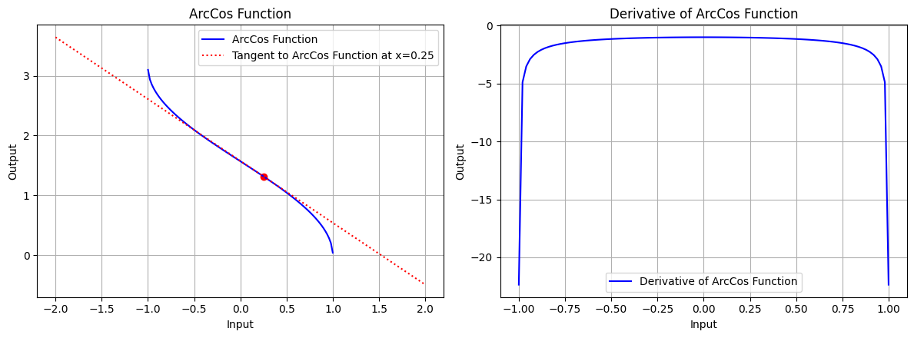<p class="caption">图 6.2：反余弦函数的图形、反余弦函数在 x=0.25 处的切线、反余弦函数的导数图形</p>

```python
x_atri = np.linspace(-5, 5, 100)
draw(x_atri, arctan_function, arctan_derivative, "ArcTan Function", x_point=0.25, color='blue')
```

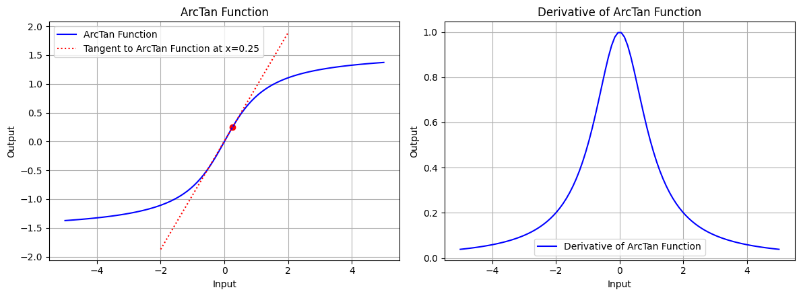<p class="caption">图 6.3：反正切函数的图形、反正切函数在 x=0.25 处的切线、正切弦函数的导数图形</p>

### 双曲函数

双曲函数是指函数的定义域为实数，求双曲线的性质的函数，常见的双曲函数包括双曲正弦函数 $\sinh(x)$、双曲余弦函数 $\cosh(x)$ 和双曲正切函数 $\tanh(x)$。

> 双曲函数是在数学中类似于常见三角函数的一类函数，用于描述双曲线的几何性质。双曲函数按照与三角函数相似的方式，但专注于双曲线的性质，描述许多自然现象。双曲函数在物理和工程中有广泛应用，如描述悬链线问题等。它们与指数函数有密切的关系，同时也满足许多类似于三角函数的恒等式。

双曲正弦函数 $\sinh(x)$ 的导数：

$$
    \frac{d}{dx}[\sinh(x)] = \cosh(x)
$$

双曲余弦函数 $\cosh(x)$ 的导数：

$$
    \frac{d}{dx}[\cosh(x)] = \sinh(x)
$$

双曲正切函数 $\tanh(x)$ 的导数：

$$
    \frac{d}{dx}[\tanh(x)] = \text{sech}^2(x)
$$

使用 Python 实现双曲函数及其导数：

```python
def sinh_function():
    return lambda x: np.sinh(x)


def sinh_derivative():
    return lambda x: np.cosh(x)


def cosh_function():
    return lambda x: np.cosh(x)


def cosh_derivative():
    return lambda x: np.sinh(x)


def tanh_function():
    return lambda x: np.tanh(x)


def tanh_derivative():
    return lambda x: 1 / np.cosh(x)**2
```

查看双曲函数及其导数的图形：

```python
x_trih = np.linspace(-5, 5, 100)
draw(x_atri, sinh_function, sinh_derivative, "SinH Function", x_point=0.25, color='blue')
```

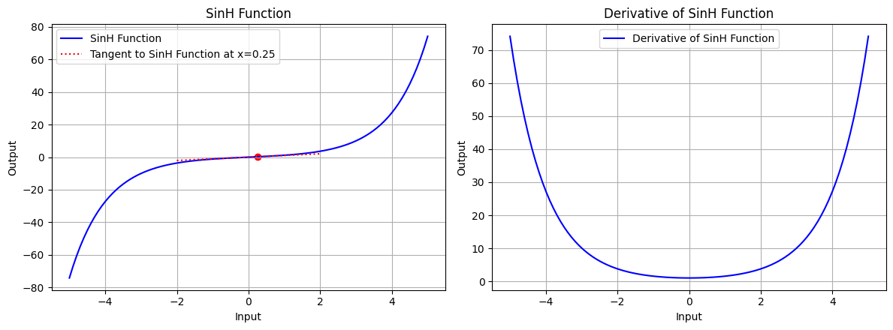<p class="caption">图 7.1：双曲正弦函数的图形、双曲正弦函数在 x=0.25 处的切线、双曲正弦函数的导数图形</p>

```python
draw(x_atri, cosh_function, cosh_derivative, "CosH Function", x_point=0.25, color='blue')
```

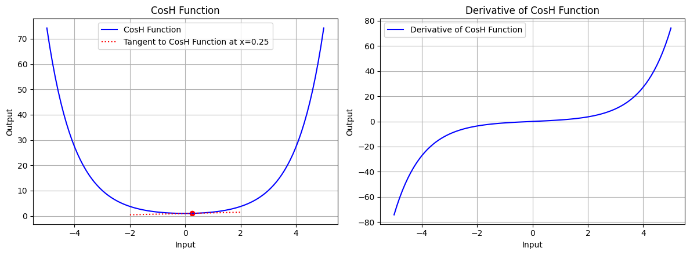<p class="caption">图 7.2：双曲余弦函数的图形、双曲余弦函数在 x=0.25 处的切线、双曲余弦函数的导数图形</p>

```python
draw(x_atri, tanh_function, tanh_derivative, "TanH Function", x_point=0.25, color='blue')
```

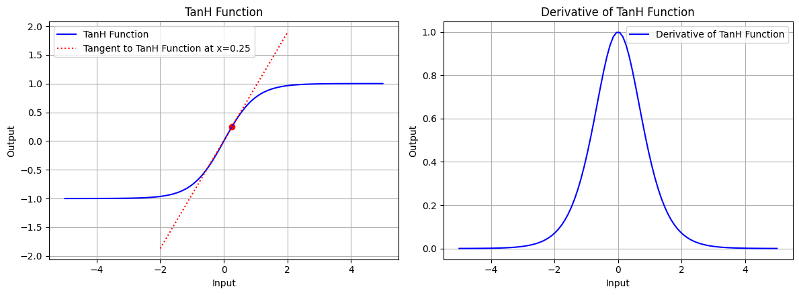<p class="caption">图 7.3：双曲正切函数的图形、双曲正切函数在 x=0.25 处的切线、双曲正切函数的导数图形</p>

## 复合函数的梯度逆传播

### 链式法则

链式法则描述的是复合函数的导数计算规则，对于复合函数 $f(g(x))$，其导数为：

$$
    \frac{d}{dx}[f(g(x))] = f'(g(x)) \cdot g'(x)
$$

链式法则是微积分中的一个重要概念，用于计算复合函数的导数。在神经网络中，链式法则被广泛应用于计算损失函数对网络参数的梯度。

### 函数相加

将两个函数相加得到一个新的函数，即：

$$
    f(x) = g(x) + h(x)
$$

函数相加所得函数的导数为：

$$
    f'(x) = \frac{d}{dx}[g(x) + h(x)] = g'(x) + h'(x)
$$

若自变量不唯一，如：

$$
    f(x, y) = g(x) + h(y)
$$

此时，函数相加所得函数关于自变量的**偏导数**分别为：

$$
    \frac{\partial}{\partial x}[f(x, y)] = \frac{\partial g(x)}{\partial x} + \frac{\partial h(y)}{\partial x} = \frac{\partial g(x)}{\partial x} + 0 = g'(x)
$$

$$
    \frac{\partial}{\partial y}[f(x, y)] = \frac{\partial g(x)}{\partial y} + \frac{\partial h(y)}{\partial y} = 0 + \frac{\partial h(y)}{\partial y} = h'(y)
$$

$f = g + h$ 的计算传播图如下：

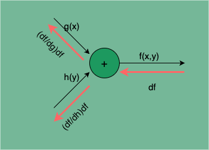<p class="caption">图 8：函数相加的计算传播图</p>

$g(x)$ 处的梯度为：

$$
    \frac{df}{dg} \times df = \frac{\frac{df}{dx}}{\frac{dg}{dx}} \times df = \frac{\frac{dg}{dx} + \frac{dh}{dx}}{\frac{dg}{dx}} \times df = \frac{\frac{dg}{dx} + 0}{\frac{dg}{dx}} \times df = df
$$

$h(y)$ 处的梯度为：

$$
    \frac{df}{dh} \times df = \frac{\frac{df}{dy}}{\frac{dh}{dy}} \times df = \frac{\frac{dg}{dy} + \frac{dh}{dy}}{\frac{dh}{dy}} \times df = \frac{0 + \frac{dh}{dy}}{\frac{dh}{dy}} \times df = df
$$

**由此可见，函数相加的梯度逆传播是直接将下游梯度 `df` 传递给上游，不会发生梯度的变化。**

### 函数相乘

将两个函数相乘得到一个新的函数，即：

$$
    f(x) = g(x) \cdot h(x)
$$

函数相乘所得函数的导数为：

$$
    \frac{d}{dx}[f(x)g(x)] = f'(x)g(x) + f(x)g'(x)
$$

若自变量不唯一，如：

$$
    f(x, y) = g(x) \cdot h(y)
$$

此时，函数相乘所得函数关于自变量的**偏导数**分别为：

$$
    \frac{\partial}{\partial x}[f(x, y)] = \frac{\partial g(x)}{\partial x} \cdot h(y) + g(x) \cdot \frac{\partial h(y)}{\partial x} = \frac{\partial g(x)}{\partial x} \cdot h(y) + g(x) \cdot 0 = g'(x) \cdot h(y)
$$

$$
    \frac{\partial}{\partial y}[f(x, y)] = \frac{\partial g(x)}{\partial y} \cdot h(y) + g(x) \cdot \frac{\partial h(y)}{\partial y} = 0 \cdot h(y) + g(x) \cdot h'(y) = g(x) \cdot h'(y)
$$

$f = g \cdot h$ 的计算传播图如下：

<p class="caption">图 9：函数相乘的计算传播图</p>

$g(x)$ 处的梯度为：

$$
    \begin{split}
        \frac{df}{dg} \times df = \frac{\frac{df}{dx}}{\frac{dg}{dx}} \times df \\
        = \frac{\frac{dg}{dx} \cdot h(y) + g(x) \cdot \frac{dh}{dx}}{\frac{dg}{dx}} \times df \\
        = \frac{\frac{dg}{dx} \cdot h(y) + 0}{\frac{dg}{dx}} \times df \\
        = h(y) \cdot df
    \end{split}
$$

$h(y)$ 处的梯度为：

$$
    \begin{split}
        \frac{df}{dh} \times df = \frac{\frac{df}{dy}}{\frac{dh}{dy}} \times df \\
        = \frac{\frac{dg}{dy} \cdot h(y) + g(x) \cdot \frac{dh}{dy}}{\frac{dh}{dy}} \times df \\
        = \frac{0 \cdot h(y) + g(x) \cdot \frac{dh}{dy}}{\frac{dh}{dy}} \times df \\
        = g(x) \cdot df
    \end{split}
$$

**由此可见，函数相乘的梯度逆传播，两个函数 `g(x)`、`h(y)` 的梯度分是将下游梯度 `df` 乘以相乘函数 `h(y)`、`g(x)`。**

### 函数相除

将两个函数相除得到一个新的函数，即：

$$
    f(x) = \frac{g(x)}{h(x)}
$$

函数相除所得函数的导数为：

$$
    \frac{d}{dx}\left[\frac{g(x)}{h(x)}\right] = \frac{g'(x)h(x) - g(x)h'(x)}{[h(x)]^2}
$$

若自变量不唯一，如：

$$
    f(x, y) = \frac{g(x)}{h(y)}
$$

此时，函数相除所得函数关于自变量的**偏导数**分别为：

$$
    \begin{split}
        \frac{\partial}{\partial x}\left[\frac{g(x)}{h(y)}\right] = \frac{\frac{\partial g(x)}{\partial x} \cdot h(y) - g(x) \cdot \frac{\partial h(y)}{\partial x}}{[h(y)]^2} \\
        = \frac{g'(x) \cdot h(y) - g(x) \cdot 0}{[h(y)]^2} \\
        = \frac{g'(x) \cdot h(y)}{[h(y)]^2}
    \end{split}
$$

$$
    \begin{split}
        \frac{\partial}{\partial y}\left[\frac{g(x)}{h(y)}\right] = \frac{\frac{\partial g(x)}{\partial y} \cdot h(y) - g(x) \cdot \frac{\partial h(y)}{\partial y}}{[h(y)]^2} \\
        = \frac{0 \cdot h(y) - g(x) \cdot h'(y)}{[h(y)]^2} \\
        = -\frac{g(x) \cdot h'(y)}{[h(y)]^2}
    \end{split}
$$

$f = \frac{g}{h}$ 的计算传播图如下：

<p class="caption">图 10：函数相除的计算传播图</p>

$g(x)$ 处的梯度为：

$$
    \begin{split}
        \frac{df}{dg} \times df = \frac{\frac{df}{dx}}{\frac{dg}{dx}} \times df \\
        = \frac{\frac{g'(x) \cdot h(y)}{\left[h(y)\right]^2}}{g'(x)} \times df \\
        = \frac{h(y)}{[h(y)]^2} \times df \\
        = \frac{df}{h(y)}
    \end{split}
$$

$h(y)$ 处的梯度为：

$$
    \begin{split}
        \frac{df}{dh} \times df = \frac{\frac{df}{dy}}{\frac{dh}{dy}} \times df \\
        = \frac{\frac{g(x) \cdot h'(y)}{[h(y)]^2}}{h'(y)} \times df \\
        = \frac{g(x)}{[h(y)]^2} \cdot df
    \end{split}
$$

**由此可见，函数相除的梯度逆传播中，被除数 `g(x)` 的梯度是将下游梯度 `df` 除以除数 `h(y)`，除数 `h(y)` 的梯度是将下游梯度 `df` 乘以被除数 `g(x)` 再除以除数的平方 $[h(y)]^2$。**

## 结语

神经网络学习的核心是计算损失函数的梯度，即求损失函数关于网络参数的偏导数。而网络的计算可以理解成一系列基本运算的复合，因此我们可以通过了解这些基本运算的导数求解方式，以及结合链式法则归纳出这些基本运算的复合形式的求导规律，来完成网络的梯度的高效计算。这就是误差逆传播算法的基本原理。

误差逆传播算法是训练人工神经网络最基本的方法，它通过计算每个神经元的梯度，优化网络的权重以使得输出误差最小化。误差逆传播算法是神经网络的学习核心，是它使得人工神经网络成为一种可行的机器学习模型，可以说没有误差逆传播算法就没有今天人工神经网络的流行。

---

**PS：感谢每一位志同道合者的阅读，欢迎关注、点赞、评论！**
