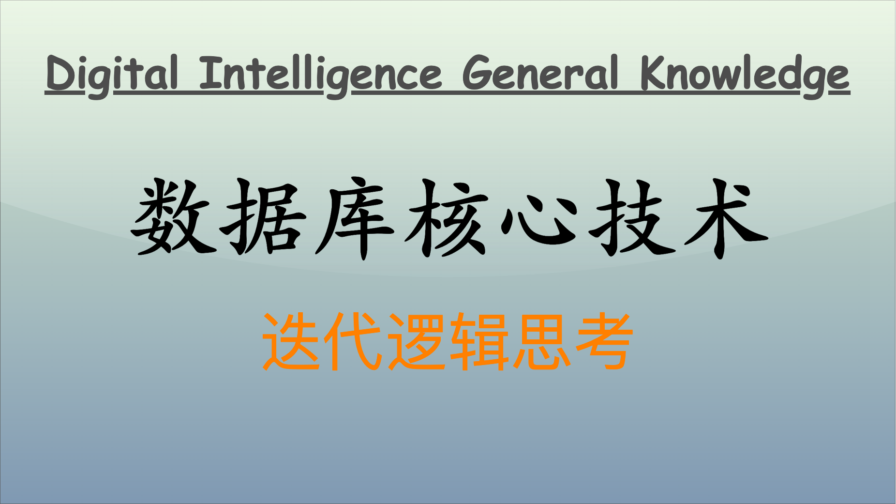

## 数据库演进史

从历史技术演进与技术驱动因素的角度来看，数据库技术可以划分为几个重要阶段，每个阶段都有其核心技术、优缺点以及演进逻辑。

### 第一阶段：早期文件系统

- **核心技术**：采用扁平文件或层次文件系统来组织和存储数据。
- **例子**：IBM 的磁带和磁盘文件系统、早期的操作系统文件存储机制。
- **优点**：实现简单，适用于简单的数据存储需求。
- **缺点**：
  - 数据冗余和不一致性问题严重。
  - 缺乏高级查询功能和事务处理支持。
  - 难以维护和扩展。
- **演进逻辑**：随着数据规模的增加和管理复杂性的提升，早期文件系统逐渐无法满足需求，推动了更高效的数据管理技术的诞生。

### 第二阶段：关系数据库（RDBMS）

1970 年，Edgar F. Codd 提出关系模型，奠定了关系数据库的基础。

- **核心技术**：
  - 基于表的关系模型，使用 SQL（结构化查询语言）进行数据管理和查询。
  - 事务管理（ACID 特性：原子性、一致性、隔离性和持久性）。
  - 索引和查询优化技术。如 **B 树和 B+ 树的引入**，B 树在数据库中的应用解决了存储和检索大数据集时的高效性问题。后来，B+ 树通过将数据仅存储在叶节点，更适合范围查询，广泛应用于关系数据库管理系统。
  - 各种范式的规范化设计。
- **例子**：
  - **IBM DB2**：IBM 的关系数据库，尤其在企业级市场中很流行。
  - **Oracle Database**：Oracle 公司提供的数据库管理系统。
  - **Microsoft SQL Server**：微软的关系数据库管理系统。
  - **MySQL**：一个开源的关系数据库管理系统，广泛用于各种应用。
  - **PostgreSQL**：一个功能强大的开源关系数据库管理系统。
- **优点**：
  - 数据一致性强，便于维护和管理。
  - 查询和数据操纵语言（SQL）简洁而强大。
  - 良好的数据独立性，能够适应变化的需求。
- **缺点**：
  - 扩展性有限，水平扩展困难。
  - 表间关系复杂时性能可能下降。
- **演进逻辑**：数据量和并发访问的增加，以及对更复杂查询需求的推动，促使 RDBMS 进一步发展和优化。

### 第三阶段：面向对象数据库（OODBMS）

- **核心技术**：将面向对象编程的概念引入数据库系统中，支持对象存储、继承和多态性。
- **例子**：
  - **ObjectStore**：一个面向对象数据库管理系统。
  - **Versant Object Database**：用于高性能的面向对象数据库管理系统。
  - **GemStone/S**：一个 Smalltalk 的持久性对象系统。
  - **db4o**：一个开源的嵌入式对象数据库。
- **优点**：
  - 更自然的对象建模，适合复杂应用（如 CAD/CAM 系统）。
  - 提供直接访问数据的能力，减少了数据映射的开销。
- **缺点**：
  - 与现有的关系数据库系统不兼容，迁移成本高。
  - 复杂性高，性能优化较困难。
  - 市场普及较低，工具和社区支持相对较少。
- **演进逻辑**：针对特定领域和应用程序的需求，面向对象数据库应运而生，但由于泛用性不足，未能替代关系数据库。

### 第四阶段：分布式数据库和 NoSQL 数据库

- **核心技术**：
  - CAP 定理（一致性、可用性和分区容忍性）的理论指导。
  - 各种模型：键值存储、列族存储、文档存储和图数据库。
  - 分布式存储和计算（如 Hadoop 和 MapReduce）。
- **例子**：
  - **分布式数据库**：
    - **Google Bigtable**：谷歌的分布式存储系统，支持大量数据存储和快速检索。
    - **Amazon DynamoDB**：亚马逊提供的完全托管的 NoSQL 数据库服务。
    - **Apache Cassandra**：一个分布式 NoSQL 数据库，适用于高扩展性和高可用性需求。
    - **CockroachDB**：一个开源的分布式 SQL 数据库。
  - **NoSQL 数据库**：
    - **MongoDB**：一个文档型 NoSQL 数据库。
    - **Redis**：一个开源的内存数据结构存储，可用作数据库、缓存和消息中间件。
    - **Couchbase**：一个完全托管的 NoSQL 云数据库。
    - **Neo4j**：一个图形数据库。
- **优点**：
  - 高并发、低延迟和高可扩展性，适应大规模数据处理需求。
  - 灵活的数据模型，适应不同的应用场景。
  - 水平扩展容易。
- **缺点**：
  - 一致性保障较弱，通常在一致性和可用性之间做权衡。
  - 不具备传统关系数据库的强事务支持和复杂查询能力。
  - 运维和调优复杂度较高。
- **演进逻辑**：大数据和互联网应用的兴起，推动了 NoSQL 数据库的发展，以满足海量数据的快速读写和扩展需求。

### 第五阶段：NewSQL 数据库

- **核心技术**：
  - 结合关系数据库的特性（如 SQL 支持和 ACID 事务），同样实现高可扩展性和高性能。
  - 使用分布式架构和新型存储引擎（如分布式哈希表和日志结构存储）来提升扩展性。
- **例子**：
  - **Google Spanner**：谷歌的分布式 NewSQL 数据库。
  - **CockroachDB**：虽然也在分布式数据库中列出，但因为其支持 ACID 事务也被认为是 NewSQL 系统。
  - **VoltDB**：一个高吞吐量的 NewSQL 数据库。
  - **NuoDB**：一个分布式数据库，支持 NewSQL 的特性。
- **优点**：
  - 保持了传统关系数据库的强一致性和 ACID 特性。
  - 提供高水平的可扩展性和性能，适应互联网和企业级应用需求。
- **缺点**：
  - 技术实现较为复杂，运维要求高。
  - 市场成熟度和采纳率相对较低，技术生态尚在完善。
- **演进逻辑**：为了弥补 RDBMS 和 NoSQL 之间的差距，NewSQL 数据库致力于提供具有扩展性、性能和一致性的新型数据库解决方案。

## 当前迭代方向

当下的数据处理需求日益复杂，并多样化，应用场景和发展趋势驱动着数据库技术的不断创新和演进。

### 云原生数据库

- **应用方面**：广泛应用于需要灵活扩展和高可用性的互联网企业和云计算环境。
- **应用实例**：Amazon Aurora、Google Cloud Spanner、Azure SQL Database。
- **核心技术**：
  - 分布式存储和计算架构。
  - 自动扩展和高可用性设计。
  - 无服务器（serverless）架构，按需使用并动态分配资源。
  - 内置的灾难恢复和容错机制。
- **优点**：
  - **弹性扩展**：能够根据负载动态调整资源，适应流量高峰和低谷。
  - **高可用性**：内置的灾备和容错机制，容忍单点故障。
  - **成本效益**：按需付费，降低了初始投资和运维成本。
- **缺点**：
  - **延迟问题**：在高度分布式架构中，一致性协议和网络传输增加了访问延迟。
  - **安全与隐私**：数据存储在云端，面临数据泄露和合规风险。
  - **供应商锁定**：从一个云平台迁移到另一个云平台的代价较高。
- **演进逻辑**：随着着数字化转型和云计算的普及，云原生数据库凭借其高弹性和易用性逐渐成为主流选择。未来将进一步增强安全性、降低延迟，并实现跨云平台的无缝迁移。

### 多模数据库

- **应用方面**：适用于需要处理多种数据类型和复杂业务逻辑的应用，如电商、社交网络和内容管理系统。
- **应用实例**：ArangoDB、OrientDB、Azure Cosmos DB。
- **核心技术**：
  - 支持多种数据模型（如关系模型、文档模型、图模型等）在同一数据库引擎中存储和查询。
  - 提供统一的接口和查询语言（如 SQL++）。
- **优点**：
  - **灵活性高**：单一数据库引擎同时支持多种数据模型，简化架构设计。
  - **一站式数据管理**：减少数据孤岛和多库间的数据同步和转换。
  - **适应性强**：能够更好地满足多样化的业务需求。
- **缺点**：
  - **性能可能折中**：面向通用性的设计在特定场景下性能不如专用数据库。
  - **复杂性较高**：维护和优化难度增加。
  - **工具和生态支持不足**：相对于专用数据库，市场成熟度稍低。
- **演进逻辑**：随着业务需求的复杂化和数据类型的多样化，多模数据库成为满足多样化需求的有效方案。未来可能通过更好的优化策略和工具支持提高性能和易用性。

### NewSQL 数据库

- **应用方面**：主要用于需要同时具有传统关系型数据库的事务一致性和 NoSQL 数据库的高扩展性的大规模数据处理系统。
- **应用实例**：CockroachDB、Google Spanner、VoltDB。
- **核心技术**：
  - 结合分布式系统的高可扩展性与传统关系数据库的 ACID 事务支持。
  - 使用分布式哈希表（DHT）和分布式一致性协议（如 Paxos, Raft）等技术。
- **优点**：
  - **强一致性和高性能**：结合了分布式系统的可扩展性和关系型数据库的 ACID 特性。
  - **适应高并发写入**：能够处理高速增长的数据和高频交易场景。
- **缺点**：
  - **实现复杂**：分布式事务和一致性协议增加了系统的复杂性。
  - **运维难度大**：需要专门的运维和优化经验。
  - **初期成本高**：部署和维护成本较高。
- **演进逻辑**：面对大数据和高并发的挑战，NewSQL 数据库通过分布式架构和事务支持提供了新的解决方案。未来可能进一步降低成本和复杂性，增强易用性和自动化运维。

### 内存数据库和持久性内存数据库

- **应用方面**：广泛应用于需要极低延迟和高吞吐量的场景，如金融交易、实时分析和物联网。
- **应用实例**：Redis、Memcached、Aerospike。
- **核心技术**：
  - 以内存作为主要存储介质，实现高性能的数据读写操作。
  - 使用持久性内存（如 Intel Optane），结合内存速度和持久存储特性。
- **优点**：
  - **超高性能**：内存访问速度远超过磁盘，适合实时和高频访问。
  - **低延迟**：快速响应，适应高要求的实时应用。
- **缺点**：
  - **成本较高**：内存价格高昂，不适合大规模数据存储。
  - **数据持久性问题**：纯内存数据库常面临断电等状况下数据丢失风险，持久性内存有所缓解此问题，但仍面临成本和技术难题。
- **演进逻辑**：随着对实时数据处理和低延迟需求的增加，内存数据库逐渐成为主流选择。未来将通过持久性内存等技术提升数据持久性，降低内存使用成本。内存数据库正在广泛应用于金融交易、物联网和大数据分析等领域。

### 数据库即服务（DBaaS）

- **应用方面**：适用于希望减少运维负担的企业和开发者，广泛应用于各类互联网和移动应用。
- **应用实例**：Amazon RDS、Google Cloud SQL、Azure Database for PostgreSQL。
- **核心技术**：
  - 提供托管的数据库服务，包含管理、监控、备份和恢复等功能。
  - 自动化运维和安全管理。
- **优点**：
  - **简化运维**：提供便捷的数据库管理和运维功能，减少手动操作。
  - **快速部署**：快速设置和启动，缩短开发周期。
  - **自动化管理**：自动备份、监控和恢复，提升运维效率。
- **缺点**：
  - **性能与定制化受限**：可能无法完全针对特定业务需求进行优化。
  - **安全与监管问题**：数据托管在云端，面临安全和合规挑战。
  - **供应商依赖**：锁定效应较强，迁移代价较高。
- **演进逻辑**：为了降低运维成本和提高开发效率，很多企业逐步采纳 DBaaS，以专注于核心业务。未来趋势将向更高的安全性、灵活的配置和更广泛的数据库支持方向发展。

### 智能数据库

- **应用方面**：适用于需要自我优化和预测性维护的复杂数据库系统，如电商、金融和制造业。
- **应用实例**：Autonomous Database（Oracle）、Azure SQL Database Intelligent Insights。
- **核心技术**：
  - 利用机器学习和人工智能技术进行自动化调优、预测性分析和异常检测。
  - 自动化查询优化和性能调优。
- **优点**：
  - **自动化调优**：利用人工智能和机器学习技术进行自动化优化，降低运维成本。
  - **预测性分析**：提前预测故障和性能瓶颈，提升系统可靠性。
  - **自适应能力**：能够动态调整配置以满足不同负载和需求。
- **缺点**：
  - **技术复杂**：实现难度高，依赖大量训练数据和复杂算法。
  - **监控和解释困难**：自动化系统的行为复杂，难以调试和解释。
  - **成本较高**：初始投入大，适用于大中型企业。
- **演进逻辑**：为了进一步提高数据管理和优化效率，智能数据库技术逐渐流行，通过 AI 和机器学习实现更高层次的自动化和智能化管理。未来将进一步提升智能化水平，降低操作复杂性。

## 未来技术趋势

未来技术发展趋势将继续推动数据库技术的不断创新和演进。

### 分布式事务与一致性协议

- **未来趋势**：
  - **智能分布式事务管理**：利用人工智能与机器学习优化分布式事务和一致性协议。
  - **增强 CAP 定理权衡**：开发新型一致性协议在一致性、可用性和分区容忍性之间实现更好的平衡。
  - **无服务器架构中的事务管理**：在无服务器环境下增强事务支持和一致性。
- **优点**：
  - **可扩展性强**：分布式架构可以更好地应对大规模数据和高并发请求。
  - **故障容忍**：增强的容错性和高可用性。
- **缺点**：
  - **实现复杂**：分布式环境下的管理和协调复杂度高。
  - **潜在性能瓶颈**：一致性协议可能引入延迟，影响性能。
- **演进逻辑**：伴随着大规模数据处理需求的增长，分布式事务和一致性协议将不断优化，以在追求高性能的同时保障数据一致性和系统可靠性。

### 混合多云和多区域数据库

- **未来趋势**：
  - **多云部署**：支持在多个云服务提供商之间无缝迁移和协同运行，使用户能够避免供应商锁定。
  - **多区域一致性**：加强跨地域的数据一致性和延迟优化。
- **优点**：
  - **弹性高**：跨云和跨区域部署提供了更大的灵活性和弹性。
  - **高可用性**：跨多个云和区域可以进一步提高故障容忍度和灾难恢复能力。
- **缺点**：
  - **管理复杂**：跨云和跨区域部署需要复杂的协调和管理。
  - **潜在的性能问题**：数据同步和一致性维护可能引入额外的延迟。
- **演进逻辑**：随着企业多云战略的推行和全球化业务的发展，混合多云和跨区域数据库将成为重要趋势，推动数据库技术朝着更高的灵活性和可用性方向发展。

### 服务网格和边缘计算的数据库支持

- **未来趋势**：
  - **边缘计算数据库**：在靠近数据源的边缘位置部署数据库，减少数据传输延迟。
  - **服务网格集成**：数据库与服务网格紧密集成，实现更好的微服务间通信和数据管理。
- **优点**：
  - **低延迟**：边缘计算数据库可以显著减少数据传输的延迟。
  - **高性能**：服务网格集成提供了更高效的微服务间通信和数据管理。
- **缺点**：
  - **复杂性增加**：部署和管理边缘计算数据库和服务网格集成的系统复杂度较高。
  - **安全与一致性挑战**：边缘环境的安全性和数据一致性保障较难。
- **演进逻辑**：随着边缘计算和微服务架构的广泛应用，未来数据库技术将逐步适应这些新兴计算模式，提高系统性能和效率。

### 自动化数据库运维与智能运维

- **未来趋势**：
  - **自动化优化**：利用 AI 和 ML 技术自动进行数据库性能调优、查询优化和资源管理。
  - **预测性维护**：通过监控和分析历史数据，预测潜在故障并自动采取预防措施。
  - **自适应调度**：根据工作负载动态调整资源分配，确保高效运行。
- **优点**：
  - **降低运维成本**：自动化和智能化运维减少了人工干预和操作错误。
  - **提高系统可靠性**：通过预测性维护和自适应调度，提升系统的可靠性和稳定性。
- **缺点**：
  - **实现复杂**：高水平的自动化和智能化需要复杂的技术实现和大量的数据支持。
  - **可解释性问题**：自动化系统的调优决策有时难以解释，增加了调试难度。
- **演进逻辑**：为了提升运维效率和系统可靠性，未来数据库将越来越多地依赖于自动化和智能化技术，通过持续学习与自适应优化实现高效管理。

### 增强的数据安全与隐私保护

- **未来趋势**：
  - **数据隐私计算**：开发支持数据隐私保护的计算技术，如同态加密和安全多方计算。
  - **分布式账本与区块链**：在分布式数据库中引入区块链技术，增强数据安全和不可篡改性。
- **优点**：
  - **增强的安全性**：更有效地保护数据隐私和防止数据泄露。
  - **透明的审计**：分布式账本和区块链技术提供更透明和可信的审计能力。
- **缺点**：
  - **性能开销**：隐私计算技术如同态加密通常会增加计算开销，影响性能。
  - **实现难度高**：复杂的安全和隐私保护技术需要高水平的技术实现和部署。
- **演进逻辑**：随着数据安全和隐私问题日益受到重视，数据库技术将更多地引入先进的隐私保护和安全计算技术，提升对敏感数据的保护能力。

### 数据虚拟化与融合分析

- **未来趋势**：
  - **数据虚拟化**：将不同数据源整合为一个虚拟数据层，提供统一的访问接口。
  - **融合分析**：集成实时数据分析和批处理能力，实现更快速的决策支持。
- **优点**：
  - **数据整合便捷**：无需搬迁数据，即可实现跨不同数据源的集成和查询。
  - **灵活的数据访问**：应用程序可以通过虚拟化层简化对不同数据源的访问。
- **缺点**：
  - **性能瓶颈**：虚拟化层可能引入额外的性能开销，影响访问速度。
  - **复杂性高**：需要对异构数据源进行有效管理，确保一致性和安全性。
- **演进逻辑**：未来数据处理环境将更加复杂，数据虚拟化和融合分析技术能够简化数据管理和整合，提升数据利用效率和灵活性。

### 总结

未来数据库技术的发展将以智能化、融合存储、增强分布式和云能力、安全性和隐私保护为主要方向，具体包括以下几个方面：

- **分布式和多云环境**：增强分布式数据库的一致性和事务支持，支持多云部署和跨云互操作，提升资源利用率，确保业务连续性和灵活性。
- **边缘计算和服务网格**：提升边缘计算数据库的性能和服务网格的集成能力，以应对边缘数据处理和微服务架构的需求。
- **智能化数据库系统**：利用机器学习和人工智能技术，动态优化查询、索引和数据库参数设置，提高系统整体性能。通过自动化和智能化技术提升数据库运维效率和系统可靠性。
- **数据安全与隐私保护**：采用零知识证明、同态加密等技术，实现数据的全生命周期安全保护，确保数据隐私，确保数据安全和合规。
- **融合存储与 HTAP**：结合 OLTP 和 OLAP 的优势，支持实时交易处理和数据分析的一体化系统，满足多样化的业务需求。
- **内存与新型存储技术**：利用高速内存和新型存储器件（如 3D XPoint），大幅提升数据访问速度，优化内存数据库的性能。
- **全球一致性与 Serverless 架构**：通过先进的分布式一致性协议和 Serverless 架构，实现高可用、弹性扩展的分布式数据库系统，降低运维成本。
- **数据虚拟化和融合分析**：简化数据整合和访问，支持实时和批处理的融合分析能力。

这些趋势将在应用需求、技术创新和市场驱动的共同作用下，不断推动数据库技术的演进，满足未来更为复杂和多样化的数据处理要求。

## 结语

通过对数据库的历史演进、当前技术趋势和未来发展方向等的全面探讨，有助于我们理解数据库技术的演进逻辑，更好地指引数据库开发和应用。在数智化大浪潮之下，数据库作为数据管理和处理的核心技术，将继续发挥重要作用，为企业与开发者提供高效、安全和可靠的数据服务。

---

**PS：感谢每一位志同道合者的阅读，欢迎关注、点赞、评论！**
