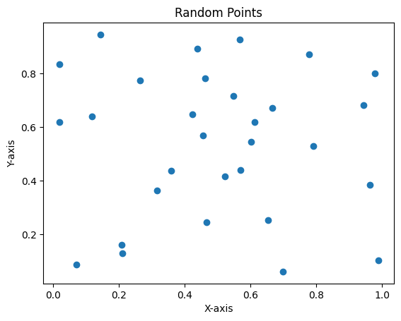
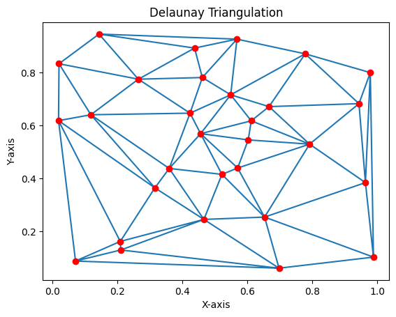

## 引言

在当前数据驱动的时代，信息量不断激增，各行各业都面临着来自数据管理与检索的重大挑战。传统的搜索方法常常在效率与准确性方面存在瓶颈，无法适应大规模数据集的快速增长与需求。HNSW（Hierarchical Navigable Small World）算法，作为一种新兴的近似最近邻搜索技术，因其高效的图结构与查询策略，逐渐得到关注。本文将深入探讨 HNSW 的技术细节，并根据其在大数据环境、深度学习结合及实时系统应用上的前景，进行详细分析。


## HNSW 算法原理

### 小世界网络理论

HNSW 的基础是小世界网络（Small World Network）理论，这种理论提出，网络中的任意两个节点之间都可通过少量中间节点快速相连。这种特性使得 HNSW 在处理庞大的数据集时能够实现快速查询。在小世界网络中，节点的“度”（即每个节点的连接数）通常遵循一个稀疏分布，这使得层级结构更加经济有效。

### 图的分层结构

HNSW 采用了多层次图的结构，具体如下：

- **节点层级**：每个节点拥有一个与之对应的随机层级（Level），决定其在图中的分布。通常情况下，节点的层数遵循几何分布，选择高层的概率相对更低。
- **邻居选择**：在进行节点插入时，HNSW 会选择一定数量的近邻，并以此形成节点之间的连接关系。这种连接关系通过在相应层级的图中不断更新来维持。

### 德劳内三角剖分法

德劳内三角剖分（Delaunay Triangulation）是一种几何算法，它在给定的一组点中生成一组三角形，使得每个三角形的内角尽量为大，即避免生成过于尖的三角形。这种性质使得德劳内三角剖分在许多计算几何和数值分析的应用中非常重要。

德劳内三角剖分的一个重要特性是，任意三角形的外接圆内不包含其他点。这个特性使得德劳内三角剖分在空间划分、插值等领域广泛应用。

在 HNSW（Hierarchical Navigable Small World）算法构建邻接图时，德劳内三角剖分可以帮助快速得到空间中点之间的连接，从而提高近邻搜索的效率。具体来说，通过德劳内三角剖分生成的边可以作为图中的相邻节点，允许更有效的图遍历。

**演示数据**

我们使用一组随机生成的点展示如何使用德劳内三角剖分构造三角形并应用到 HNSW 算法的建图中。

首先，生成一组随机点，并进行可视化。

```python
import numpy as np
import matplotlib.pyplot as plt

# 随机生成30个二维点
np.random.seed(0)
points = np.random.rand(30, 2)

# 可视化点
plt.scatter(points[:, 0], points[:, 1])
plt.title('Random Points')
plt.xlabel('X-axis')
plt.ylabel('Y-axis')
plt.show()
```



**德劳内三角剖分**

我们可以使用`scipy.spatial`模块来计算德劳内三角剖分，并可视化结果。

```python
from scipy.spatial import Delaunay

# 计算德劳内三角剖分
tri = Delaunay(points)

# 绘制三角剖分结果
plt.triplot(points[:, 0], points[:, 1], tri.simplices)
plt.scatter(points[:, 0], points[:, 1], color='red')
plt.title('Delaunay Triangulation')
plt.xlabel('X-axis')
plt.ylabel('Y-axis')
plt.show()
```



**HNSW 算法中建图过程**

在 HNSW 算法中，构建图的过程可以借助德劳内三角剖分来提高效率。具体步骤如下：

- **建立邻接图**：使用德劳内三角剖分生成的边来作为邻接图的边。
- **添加节点连接**：通过剖分形成的三角形为每个点连接邻近的点。

下面提供一个简单的 HNSW 图构建代码示例。为了简单起见，此代码不包括完整的 HNSW 实现，而是展示如何使用德劳内三角剖分连接点的基本过程。

```python
class HNSWGraph:
    def __init__(self):
        self.graph = {}

    def add_edge(self, p1, p2):
        if p1 not in self.graph:
            self.graph[p1] = []
        if p2 not in self.graph:
            self.graph[p2] = []
        self.graph[p1].append(p2)
        self.graph[p2].append(p1)

# 创建HNSW图并添加边
hnsw_graph = HNSWGraph()

for simplex in tri.simplices:
    p1, p2, p3 = points[simplex]
    hnsw_graph.add_edge(tuple(p1), tuple(p2))
    hnsw_graph.add_edge(tuple(p2), tuple(p3))
    hnsw_graph.add_edge(tuple(p1), tuple(p3))

# 打印图的邻接表
print(hnsw_graph.graph)
```

德劳内三角剖分法不仅是一种有效的几何建模工具，它在构建 HNSW 算法图时也发挥着关键作用。通过将点连接到其邻近的点，德劳内三角剖分为高效的近邻搜索提供了有力支持。这种图结构的搭建提升了搜索的效率，展示了几何算法在现代计算中的重要性。

### 搜索策略

HNSW 的搜索过程主要包括以下几个步骤：

- **顶层进入**：搜索从图的最高层开始。首先找到与查询数据点最近的节点，然后再逐层向下探讨，利用当前层中节点的相对位置和邻接关系来缩小搜索范围。
- **逐层下降**：在每一层中，通过优先访问与查询点距离更近的节点，迅速找到近似邻居，最终得到最优的近似结果。

这种方法的效率通常为 O(log(N))，其中 N 是图中节点的总数。这种低时间复杂度使得 HNSW 在面临大规模数据集时依然表现出色。

## HNSW 模拟实现

### 系统架构设计

将 HNSW 应用于实际系统中，需要关注以下几点设计：

- **数据流处理**：设计高效的数据输入接口以及数据预处理环节。
- **索引构建**：实现 HNSW 图结构的自动构建与更新。
- **用户接口**：提供直观的查询接口，便于前端用户使用。

### 模拟编码

下面是 HNSW 的基本实现代码，展现其核心数据结构和功能。

```python
import random
import numpy as np

class Node:
    def __init__(self, point, level):
        self.point = point  # 节点的特征向量
        self.level = level  # 节点所处的层级
        self.connections = []  # 与该节点连接的邻居

class HNSW:
    def __init__(self, M=16, ef_construction=200):
        self.M = M  # 每个节点的最大连接数
        self.layers = []  # 存储每层节点
        self.max_level = 0  # 最高层级

    def random_level(self):
        level = 0
        while random.random() < 0.5:  # 每次生成一个随机数以决定层级
            level += 1
        return level

    def insert(self, point):
        level = self.random_level()  # 随机生成节点的层级
        new_node = Node(point, level)  # 创建新节点

        # 将新节点插入到合适的层次
        for i in range(level + 1):
            if i >= len(self.layers):
                self.layers.append([])  # 新建层
            self._add_node_to_layer(new_node, self.layers[i], i)  # 添加节点到层

        if level > self.max_level:
            self.max_level = level  # 更新最大层级

    def _add_node_to_layer(self, new_node, layer, level):
        neighbors = self._search_neighbors(new_node.point, layer, level)  # 查找邻居
        new_node.connections.extend(neighbors)  # 新节点连接邻居
        layer.append(new_node)  # 添加到当前层

        for neighbor in neighbors:
            neighbor.connections.append(new_node)  # 更新邻居的连接信息

    def _search_neighbors(self, point, layer, level):
        distances = [(np.linalg.norm(point - n.point), n) for n in layer]  # 计算距离
        distances.sort()  # 根据距离排序
        return [n for _, n in distances[:self.M]]  # 返回最近的M个邻居

    def search(self, query_point, k=10):
        # 进行最近邻搜索
        layer = self.layers[self.max_level]  # 从最高层开始
        nearest = self._search_neighbors(query_point, layer, self.max_level)  # 找到第一个最近邻

        for level in range(self.max_level, -1, -1):  # 从最高层向下搜索
            layer = self.layers[level]
            nearest = self._search_neighbors(query_point, layer, level)  # 在当前层寻找最近邻

        return nearest[:k]  # 返回K个最近邻
```

### 使用示例

```python
hnsw = HNSW(M=16, ef_construction=200)

# 插入随机数据点
for _ in range(1000):
    point = np.random.rand(128)  # 示例数据为128维特征向量
    hnsw.insert(point)

# 执行搜索
query_point = np.random.rand(128)  # 新查询点
nearest_neighbors = hnsw.search(query_point, k=5)  # 找到5个最近邻
```

### 代码说明

1. **Node 类**：每个节点包含一个特征向量 (`point`)、层级 (`level`) 和与其他节点的连接 (`connections`)。

2. **HNSW 类**：封装了插入和搜索的逻辑。通过指定参数`M`来设定每个节点的最大连接数。

3. **随机层级生成**：`random_level()`方法根据随机数生成一个节点的层级。

4. **插入节点**：`insert()`方法会随机生成层级并将节点插入到对应层。

5. **搜索邻居**：`_search_neighbors()`根据输入点计算距离并找到最近的邻居节点，并返回连接。

6. **搜索最近邻**：`search()`方法从最高层开始搜索，逐层向下查找并返回最近邻。

此示例展示了 HNSW 的基本构造与功能。实际系统中可以根据具体需求进行更深入的优化，例如缓存查询结果、改进动态更新性能、并行化处理等。在面对大规模数据时，HNSW 展示了其高效且可扩展的特性，非常适用于实时近似最近邻搜索任务。

## HNSW 与信息检索

### 大数据环境中的挑战

在大数据环境中，数据量快速增长，传统的信息检索算法已难以满足快速与准确的需求。为了解决这些挑战，需探索新颖的高效检索机制。

### HNSW 的优势

HNSW 通过小世界图结构，不仅支持快速搜索，更能解决实时处理的需求。它使得用户能够在邻近查询中显著减少查询时间，尤其在社交网络分析、推荐系统和图像检索等领域。

**社交网络分析**

在社交网络中，节点间的关系以图的形式存在。HNSW 可以快速识别社交网络中相似用户，实现即时的好友推荐。例如，当一位用户在平台上表现出兴趣时，系统能够迅速找到相似用户并进行推荐。

**推荐系统**

HNSW 在个性化推荐中也具有优越性。当用户浏览时，系统可以实时计算用户与商品的相似性，为用户推荐相关商品。这种方法有效提升了用户体验，也极大提高了转化率。

**图像搜索**

在图像检索中，HNSW 算法优化了高维特征索引。通过结合深度学习生成的特征向量，HNSW 能够在数百万图像中快速找到最相似的图像。例如，在使用卷积神经网络（CNN）提取图像特征后，HNSW 可以用于高效的反向图像搜索，帮助用户找到所需的图像内容。

## HNSW 与深度学习

### 深度学习的兴起

随着深度学习的发展，特征提取与数据表示的能力得到了极大提升。HNSW 算法通过与深度学习相结合，能够为高维特征提供快速且准确的搜索机制。

### 特征提取与应用

深度学习模型如 CNN、RNN 等生成的特征向量，可以通过 HNSW 进行高效搜索。在图像检索中，通过 HNSW 处理的图像特征查询速度显著加快。

**CNN 与 HNSW**

卷积神经网络用于图像特征提取已成为主流做法。将提取的特征向量应用于 HNSW 后，可以实现快速的相似性搜索。例如，在商业应用中，HNSW 能够快速区分产品图像，提升购物体验。

**RNN 与 HNSW**

在处理序列数据时，递归神经网络（RNN）成效显著。HNSW 可以应用于时间序列数据挖掘，帮助推荐系统即时预测用户行为。在生成的序列特征上，HNSW 的快速搜索能够实现有效的在线学习。

### 整体性能评估

结合 HNSW 后，深度学习模型的查询速度和准确性均显著提升。通过在实际应用中的评测，HNSW 不断优化自身以适应不断变化的数据特性，提升模型的实用性。

## HNSW 在实时系统中的应用

### 实时系统的挑战

尽管 HNSW 在多个领域表现良好，实时系统中的动态数据处理仍然是一个挑战。节点的增添与删除会引起性能波动。

### 优化策略

为克服 HNSW 在实时系统中的不足，可采取以下几种优化策略：

**动态更新结构**

引入动态 HNSW 算法，支持高效处理节点的增加或删除。动态 HNSW 通过对结构的及时更新，保证查询效率不受影响。

**并行计算**

通过并行处理技术，可以减少查询时间。多线程处理可以同时查询和更新数据，有效应对动态数据集的挑战。

**改进搜索策略**

改进 HNSW 的搜索策略，能够在节点更新时即时反映最近邻信息，避免过时的查询结果。例如，结合概率排序机制，能够更快地识别到活跃节点。

### 现有研究成果

一些研究成果如基于动态图的 HNSW 变种，已成功应用于在线学习系统和流媒体数据处理，为算法的优化提供了良好的示范。

## HNSW 在智慧城市中的应用

### 智慧城市与物联网背景

随着智慧城市的建设和物联网（IoT）的快速发展，海量数据的实时处理与分析成为亟待解决的问题。在这个背景下，HNSW 算法能够支持快速的数据检索与决策。

### HNSW 的应用优势

HNSW 能够为智慧城市中的传感器数据、视频监控数据及网络流量分析等场景提供高效支持。例如，在城市交通管理中，HNSW 可实时分析来自传感器的流量数据，为交通规划提供支持。通过近似邻居的搜索，管理者可以快速识别交通异常并进行干预。

**交通监控**

在交通监控系统中，通过 HNSW 快速处理来自各个摄像头的监控视频数据，可以有效识别交通流量、拥堵状况以及交通事故。这种实时响应能力可以帮助管理者及时调整交通信号灯或采取其他措施。

**环境监测**

智慧城市还需要关注环境监测。利用 HNSW 算法处理来自各个传感器的数据，可以迅速检测到空气污染、噪音等指标的变化，及时发布警报，为市民提供适时的信息。

**智能家居**

在智能家居环境下，各种智能设备生成大量数据，HNSW 可以用于设备间的相互推荐和控制。例如，可以根据用户的使用习惯，智能推荐相关设备或服务，提升用户体验。

### 设计实践

在智慧城市或者物联网实践中，HNSW 的具体设计可能包括以下方面：

- **数据预处理**：对传感器数据进行清洗与转化，将其转换为 HNSW 可以接受的特征向量。
- **实时数据流构建**：利用适应性强的存储结构，确保 HNSW 可以随时插入新的数据。
- **用户接口与数据可视化**：为管理员提供友好的图形界面和数据可视化工具，方便实时监控。

### 模拟编码

以智能交通监控为例，下面的代码简单展现了如何利用 HNSW 进行实时交通数据分析：

```python
import numpy as np

class TrafficNode:
    def __init__(self, data, level):
        self.data = data  # 传感器数据
        self.level = level
        self.connections = []

class TrafficHNSW:
    def __init__(self, M=16, ef_construction=200):
        self.M = M
        self.layers = []
        self.max_level = 0

    def random_level(self):
        level = 0
        while np.random.rand() < 0.5:
            level += 1
        return level

    def insert(self, data):
        level = self.random_level()
        new_node = TrafficNode(data, level)

        for i in range(level + 1):
            if i >= len(self.layers):
                self.layers.append([])
            self._add_node_to_layer(new_node, self.layers[i], i)

        if level > self.max_level:
            self.max_level = level

    def _add_node_to_layer(self, new_node, layer, level):
        neighbors = self._search_neighbors(new_node.data, layer, level)
        new_node.connections.extend(neighbors)
        layer.append(new_node)

        for neighbor in neighbors:
            neighbor.connections.append(new_node)

    def _search_neighbors(self, data, layer, level):
        distances = [(np.linalg.norm(data - n.data), n) for n in layer]
        distances.sort()
        return [n for _, n in distances[:self.M]]

    def search(self, query_data, k=5):
        layer = self.layers[self.max_level]
        nearest = self._search_neighbors(query_data, layer, self.max_level)

        for level in range(self.max_level, -1, -1):
            layer = self.layers[level]
            nearest = self._search_neighbors(query_data, layer, level)

        return nearest[:k]

# 示例使用
traffic_hnsw = TrafficHNSW(M=16)
for _ in range(1000):
    data = np.random.rand(128)  # 模拟传感器生成的数据
    traffic_hnsw.insert(data)

query_data = np.random.rand(128)
nearest_data = traffic_hnsw.search(query_data, k=5)
```

## HNSW 在医疗健康中的应用

### 医疗健康背景

随着健康监测设备的普及，以及电子病历（EMR）等医疗数据的增长，医疗健康领域急需有效的数据检索工具。HNSW 能够有效地处理高维健康数据，以及来自患者的生理信号。

在医疗健康中，HNSW 可以帮助医生快速找到相似病例，为个性化医疗和疾病预测提供支持。例如，在疾病预防中，医生可以通过快速识别相似历史病例，降低误诊风险。

**个性化医疗**

通过分析患者的历史数据，结合 HNSW 能够快速为患者推荐相应的治疗方案或药物，提升医疗效率与患者满意度。

**疾病预测**

HNSW 在疾病预测中也发挥重要作用。通过分析遗传数据、生活习惯及生理参数，HNSW 可以帮助医生发现潜在的健康风险，提高预防能力。

### 设计实践

在医疗健康领域实施 HNSW 时，需考虑以下设计要点：

- **数据融合**：将来自不同来源（如传感器、病历、基因组等）的数据进行融合，创建综合特征向量。
- **隐私保护**：在处理医疗数据时，确保患者隐私的安全性。
- **临床决策支持**：通过驾驶复杂模型，帮助医生做出即时决策。

### 模拟编码

下面的代码展示如何利用 HNSW 对患者数据进行分析：

```python
class PatientNode:
    def __init__(self, data, level):
        self.data = data  # 患者健康数据特征
        self.level = level
        self.connections = []

class HealthHNSW:
    def __init__(self, M=16):
        self.M = M
        self.layers = []
        self.max_level = 0

    # random_level 不变...

    def insert(self, data):
        level = self.random_level()
        new_node = PatientNode(data, level)

        for i in range(level + 1):
            if i >= len(self.layers):
                self.layers.append([])
            self._add_node_to_layer(new_node, self.layers[i], i)

        if level > self.max_level:
            self.max_level = level

    def _search_neighbors(self, data, layer, level):
        distances = [(np.linalg.norm(data - n.data), n) for n in layer]
        distances.sort()
        return [n for _, n in distances[:self.M]]

# 示例使用
health_hnsw = HealthHNSW(M=16)
for _ in range(500):
    health_data = np.random.rand(64)  # 模拟患者健康数据
    health_hnsw.insert(health_data)

query_patient = np.random.rand(64)
nearest_patients = health_hnsw.search(query_patient, k=5)
```

## HNSW 在金融领域的应用

### 金融背景

在金融领域，数据的快速分析与实时处理对决策支持具有极强的影响。HNSW 能有效处理来自不同数据源的信息，为投融资决策提供支持。

HNSW 在金融监测和风险分析中具备特别的优势，能够快速识别市场的变化、趋势和风险点。

**反欺诈系统**

在反欺诈监测中，可以利用 HNSW 快速识别出用户行为的异常模式，提升对潜在欺诈活动的响应速度，从而降低损失风险。

**投资决策**

在投资组合推荐中，通过 HNSW 分析多个资产之间的关系，可以快速识别资产的相关性，帮助投资者做出更明智的决策。

### 设计实践

- **数据整合**：有效整合来自交易、市场监测等数据源的信息，构建综合特征向量。
- **实时监测**：通过高效的在线更新机制，确保数据实时反映市场变化。
- **风险评估工具**：为决策者提供直观的界面和图表，支持实时风险评估。

### 模拟编码

以下代码展示了如何在金融领域内利用 HNSW 进行快速交易监测：

```python
class FinancialNode:
    def __init__(self, data, level):
        self.data = data  # 交易数据特征
        self.level = level
        self.connections = []

class FinancialHNSW:
    def __init__(self, M=16):
        self.M = M
        self.layers = []
        self.max_level = 0

    # random_level 不变...

    def insert(self, data):
        level = self.random_level()
        new_node = FinancialNode(data, level)

        for i in range(level + 1):
            if i >= len(self.layers):
                self.layers.append([])
            self._add_node_to_layer(new_node, self.layers[i], i)

        if level > self.max_level:
            self.max_level = level

# 示例使用
financial_hnsw = FinancialHNSW(M=16)
for _ in range(1000):
    transaction_data = np.random.rand(128)  # 模拟交易数据
    financial_hnsw.insert(transaction_data)

query_transaction = np.random.rand(128)
nearest_transactions = financial_hnsw.search(query_transaction, k=5)
```

## 结语

HNSW 算法以其独特的高效特性，在信息检索、大数据处理、与深度学习结合等多个领域展现出广泛的应用潜力和灵活性。随着技术的快速发展，HNSW 不仅在对抗传统搜索系统的瓶颈方面取得了重大的突破，同时在实时动态检索中正渐渐发挥出更为重要的作用。未来的研究可以进一步集中在 HNSW 在动态数据环境中的优化与创新应用，以期在信息检索领域实现更多的创新与突破。

---

**PS：感谢每一位志同道合者的阅读，欢迎关注、点赞、评论！**
