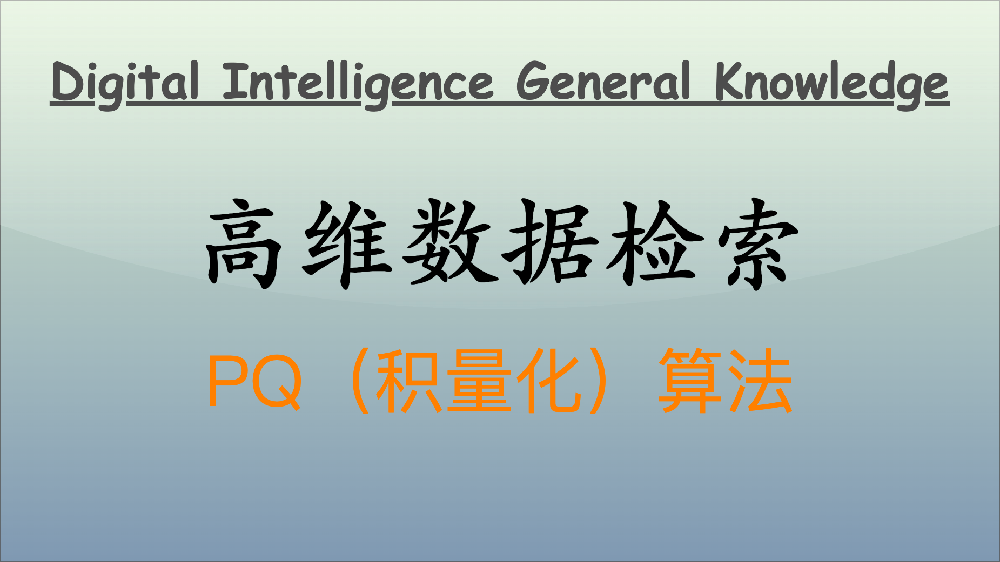

在大 AI 时代，高维数据的处理与检索一直是一项重要的技术需求。面对高维数据的海量增加，传统的数据处理方法往往无法应对存储和计算开销的挑战。PQ（积量化）算法以其高效性受到广泛关注，旨在通过量化技术对数据进行压缩，并提高近似搜索的效率。本文将深入探讨 PQ 算法的基本原理，包括量化与码本的构建、维度灾难与内存开销的分析，以及积量化的创新与应用。



## PQ 算法

### PQ 算法概述

PQ 算法的核心思想是对高维向量进行量化处理。具体而言，PQ 算法首先将高维向量划分为多个低维子向量（称为子空间），并对各个子向量进行量化。在这一过程中，每个子向量可以被视为与其对应的质心相近的代表，其实质是在信息量损失可接受的范围内，实现高效压缩。

### 量化过程

量化过程的关键在于如何选择质心并构建码本。一般使用 K-means 聚类算法来确定质心。每个子空间中的向量都归类到其最近的质心，并将该质心的索引作为代表。例如，假设我们有以下四个向量：

- $[0.1, 0.5]$
- $[0.2, 0.6]$
- $[0.9, 0.8]$
- $[0.95, 0.9]$

使用 K-means 聚类算法将其聚成两类：

- 类 1：$[0.1, 0.5]$, $[0.2, 0.6]$
- 类 2：$[0.9, 0.8]$, $[0.95, 0.9]$

其质心为：

- 质心 1：$[0.15, 0.55]$
- 质心 2：$[0.925, 0.85]$

每个向量用其质心的索引表示：

- 向量 1 和 2 使用索引 0（质心 1）
- 向量 3 和 4 使用索引 1（质心 2）

### 码本构建

码本就是保存所有质心的集合。它允许通过索引快速查找相应的质心。在我们的例子中，码本为：

- 索引 0：$[0.15, 0.55]$
- 索引 1：$[0.925, 0.85]$

### 模拟数据推演

以下是一个简单的 Python 代码示例，展示 PQ 算法的量化过程：

```python
import numpy as np
from sklearn.cluster import KMeans

# 示例数据
data = np.array([[0.1, 0.5], [0.2, 0.6], [0.9, 0.8], [0.95, 0.9]])

# K-means聚类
kmeans = KMeans(n_clusters=2)
kmeans.fit(data)

# 打印质心和标签
print("质心：", kmeans.cluster_centers_)
print("标签：", kmeans.labels_)
```

## 维度灾难与内存开销

### 维度灾难问题

“维度灾难”指的是随着数据维度的增加，数据的分布变得极为稀疏，若需保障质心足以代表聚类的数据点，质心的数量（聚类数）将急剧膨胀，这将导致计算效率和有效性大幅下降。在进行聚类与质心替换时，维度灾难会对计算的精确度，聚类的质量造成负面影响，计算与存储成本也会陡增。在这种情况下，PQ 算法通过将高维向量分解为低维子向量来对抗这一问题。

### 过程推演

假设我们有一组 1 维、2 维、128 维的向量数据，我们逐步增加维度，观察数据的稀疏性变化及其对质心替换的影响。

考虑一组简单的 1 维数据：

```python
data_1d = np.array([[1], [2], [3], [4], [5], [6], [7], [8], [9], [10], [11], [12], [13], [14], [15]])
```

在 1 维空间中，很容易构建有效的质心。比如质心为 $\frac{1 + 2 + 3 + 4 + 5}{5} = 3$、$\frac{6 + 7 + 8 + 9 + 10}{5} = 8$、$\frac{11 + 12 + 13 + 14 + 15}{5} = 13$

假设我们使用 K-means 聚类，让同类的数据点向质心替换，聚类质心数为 3 个，且能很好的表达聚类数据点。

在 2 维情况下，我们扩展数据：

```python
data_2d = np.array([[1, 1], [4, 2], [7, 3], [10, 4], [13, 5],
                    [2, 6], [5, 7], [8, 8], [11, 9], [14, 10],
                    [3, 11], [6, 12], [9, 13], [12, 14], [15, 15]])
```

在这个 2D 平面上，模样可以想象为一个 15x15 的格子。通过 K-means，可以将其聚类成 5 个集并计算质心，如：

- 质心 1 = $(4, 2)$
- 质心 2 = $(5, 7)$
- 质心 3 = $(6, 12)$
- 质心 4 = $(\frac{34}{3}, 6)$
- 质心 5 = $(\frac{41}{3}, 13)$

每个点仍然能够清楚地找出其最近的质心，但同样是 15 个数据点，却需要使用 5 个质心代表。

当我们将数据的维度提升到更高的级别（如 128 维或更高），点的分布变得非常稀疏。考虑 128 维情况：

```python
# 随机模拟数据
data_high_dim = np.random.rand(1000, 128)
```

采用 K-means（n_clusters=256），处理过程中很可能得到的质心如：

```python
# 计算质心
kmeans = KMeans(n_clusters=256)
kmeans.fit(data_high_dim)
centroids = kmeans.cluster_centers_
```

在高维空间中，数据点如同分散于一个越来越庞大的空间，这使得：

- 数据点之间的距离变得更加分散，质心的代表性下降，因而影响聚类的有效性。
- 越高的维度使得需要的质心数量**指数增长**，若质心数量不够，聚类质量则下降。
- 质心未能很好代表所属的真实数据分布，导致有效信息丢失。

128 维的向量可能需要 2 的 64 次方个聚类中心，这是一个大到不可接受的数字，因为这将导致用来记录质心编码和向量值的码本变得非常非常的巨大。而为了保存这巨大码本所消耗的内存，已经超越乃至远远超越了量化本身所节省下来的内存，得不偿失，如此而已。

### 内存开销分析

- 原始向量大小：在高维数据场景中，内存开销往往成为主要瓶颈。假如向量的维度是 128，每个维度值是一个 32 位的浮点形数，那么向量占用的内存大小就是 512 字节。如果库中一共有 1000 万的向量，那么总共占用内存就是大约 4.77 GB。
- 质心替换与使用码本：将原始向量用质心替换，将质心编码用单个编码值表示，质心编码使用码本构建索引，这样除了码本存储了质心向量的值，数据点都用一个编码值表示，进一步节省了内存开销。
- PQ：假设每个 128 维向量量化之后是 8 个子空间的编码值，而每个编码值的范围是 0-255 之间，所以只需要一个字节就可以存放得下。8 个编码值，一共需要 8 个字节，因此 1000 万个向量最终所占的内存总量是大约 76MB，而我们最开始计算的没有经过 PQ 处理的是 4.77 GB，节省大约 98% 的内容开销。

### 模拟数据推演

以下 Python 示例展示了高维数据量化的内存节约：

```python
import numpy as np

# 模拟数据
num_vectors = 10_000_000
dimensions = 128
data = np.random.rand(num_vectors, dimensions).astype(np.float32)

# 原始内存占用
original_memory = data.nbytes  # bytes
print(f"原始内存占用: {original_memory / 1024**3:.2f} GB")

# PQ量化
sub_vectors = np.array_split(data, 8, axis=1)  # 分成8个16维子向量

# 模拟量化
quantized_data = np.array([np.round(sub_vector * 255).astype(np.uint8) for sub_vector in sub_vectors]).T
quantized_memory = quantized_data.nbytes  # bytes
print(f"量化后内存占用: {quantized_memory / 1024**2:.2f} MB")
```

## PQ 算法的创新

### PQ 的创新

PQ 算法的创新之处在于其将高维向量分解为多个低维子向量进行独立量化，从而有效解决了维度灾难问题。每个子向量的量化质量都是独立的，这意味着能够灵活控制量化的粒度。

**单个子结构的内存开销**

通过 PQ 算法，每个子向量的量化实际上是对原始数据的压缩。假设每个子向量只需要 256 个质心，最终的整体内存需求得以降低。

### 模拟数据推演

以下代码演示了 PQ 的完整量化及搜索过程：

```python
import numpy as np
from sklearn.cluster import KMeans

# 原始数据
data = np.random.rand(10000, 128)

# 将128维向量分为8个16维的子向量
sub_vectors = np.array_split(data, 8, axis=1)

# 为每个子向量应用K-means
codebooks = []
for sub in sub_vectors:
    kmeans = KMeans(n_clusters=256)
    kmeans.fit(sub)
    codebooks.append(kmeans.cluster_centers_)

# 量化过程
quantized_vectors = []
for sub, codebook in zip(sub_vectors, codebooks):
    quantized = np.argmin(np.linalg.norm(sub[:, np.newaxis] - codebook, axis=2), axis=1)
    quantized_vectors.append(quantized)

# 合并量化结果
final_quantized = np.concatenate(quantized_vectors, axis=1)
print(final_quantized)
```

## PQ 算法的挑战与应用

### 大数据环境中的挑战

在大数据时代，海量数据带来了巨大的存储需求和计算压力。虽然 PQ 算法在高维向量的压缩和检索方面具有优势，但在面对极大规模的数据集时，仍然面临以下挑战：

- **动态数据处理**：随着数据的不断涌入，如何实时更新码本和质心成为一个重要的问题。
- **负载均衡**：在分布式环境中，如何均衡负载，提高资源利用率也很关键。
- **特征选择与相关性**：如何选择更加有效的特征进行量化，避免冗余特征引起的内存浪费。

### PQ 算法的扩展与改进

为了解决这些挑战，可以采用一些扩展和改进的策略：

- **增量式学习**：在新数据到达时，可以使用增量式 K-means 更新质心，从而避免每次都重新计算所有质心。
- **分布式计算**：利用大数据框架（如 Spark）来并行化数据的量化过程，以提高速度和效率。
- **特征选择算法**：通过基于重要性或相关性的特征选择算法，过滤掉对模型贡献度不大的特征，提升效能。

### 模拟数据推演

以下是一个模拟数据推演，展示如何使用增量学习来更新 PQ 的码本和质心：

```python
import numpy as np
from sklearn.cluster import MiniBatchKMeans

# 模拟初始数据
initial_data = np.random.rand(10000, 128)

# 首次执行K-means聚类
kmeans = MiniBatchKMeans(n_clusters=256, batch_size=100)
kmeans.fit(initial_data)

# 新增数据到达
new_data = np.random.rand(10000, 128)

# 使用增量学习更新质心
kmeans.partial_fit(new_data)

# 打印新的质心
print("更新后的质心：", kmeans.cluster_centers_)
```

## PQ 算法与其他压缩技术

### 其他压缩技术概述

在数据压缩领域，除了 PQ 算法外，常见的压缩技术还包括：

- **LSH（局部敏感哈希）**：通过哈希函数将相似的向量映射到相同的哈希桶中。
- **图像压缩算法（如 JPEG）**：通过失真来压缩图像数据，同时保留人眼感知的图像质量。

### PQ 算法的互补性

PQ 算法与其他压缩技术可以结合，形成更高效的高维数据处理方案。例如，结合 LSH 与 PQ，先使用 LSH 过滤近似候选，然后再用 PQ 进行精确检索，此方法在性能和准确性上均有提升。

### 模拟数据推演

以下是使用 PQ 结合 LSH 技术的简单示例：

```python
import numpy as np
from sklearn.neighbors import LSHForest

# 生成模拟数据
data = np.random.rand(10000, 128)

# 使用LSH进行预检索
lsh = LSHForest(n_estimators=20, n_candidates=50)
lsh.fit(data)

# 查询相似向量
query_vector = np.random.rand(128)
distances, indices = lsh.kneighbors([query_vector], n_neighbors=10)

# 进一步使用PQ进行精确检查
print("LSH筛选的最近邻索引：", indices)
```

## PQ 算法的发展与应用

### PQ 算法发展趋势

PQ 算法的未来可能的发展方向可能有如下方向：

- **自适应量化**：AI 可以根据数据的变化情况，自适应地调整量化方式和码本更新策略。
- **深度学习结合**：结合深度学习对高维数据的建模能力，在特征提取与量化方面相结合，提升整体性能。
- **多模态数据处理**：在音频、图像、文本等多模态数据处理场景中，PQ 算法的应用前景。

### 自适应量化

以下是一个利用机器学习算法进行量化权重自适应更新的简单示例：

```python
import numpy as np
from sklearn.ensemble import RandomForestRegressor

# 模拟数据
data = np.random.rand(10000, 128)
targets = np.random.rand(10000)

# 使用随机森林预测量化权重
model = RandomForestRegressor()
model.fit(data, targets)

# 利用模型预测新的量化权重
new_data = np.random.rand(10000, 128)
predicted_weights = model.predict(new_data)
print("预测的量化权重：", predicted_weights)
```

### PQ 算法与深度学习

深度学习已经成为处理高维数据的主要工具。结合 PQ 算法，可以有效提高模型的训练速度和推理速度，尤其是在处理图像和文本等高维特征时。通过量化神经网络中的权重和激活值，PQ 算法能够显著减少存储需求和计算复杂度。

在深度学习中，传统的浮点计算和存储往往会造成内存占用过大且计算延迟。使用 PQ 算法可将浮点权重量化为低维整数，从而降低内存需求。例如，使用 256 个量化级别可以将 32 位浮点数压缩到 8 位，从而将模型大小缩小到原来的四分之一。

以下是一个简单的示例，展示如何在 TensorFlow 中实现量化层以应用 PQ 算法。

```python
import numpy as np
import tensorflow as tf

# 构建一个简单神经网络模型
model = tf.keras.models.Sequential([
    tf.keras.layers.Dense(128, input_dim=784, activation='relu'),
    tf.keras.layers.Dense(10, activation='softmax')
])

# 编译模型
model.compile(optimizer='adam', loss='sparse_categorical_crossentropy', metrics=['accuracy'])

# 模拟一些数据
X_train = np.random.rand(10000, 784).astype(np.float32)
y_train = np.random.randint(0, 10, size=(10000,))

# 训练模型
model.fit(X_train, y_train, epochs=3)

# 使用量化方法
quantized_model = tf.quantization.quantize(
    model,
    input_min=0.0,
    input_max=1.0,
    T=tf.qint8
)

# 打印量化后的模型结构
quantized_model.summary()
```

### PQ 算法在图像与视频处理中的应用

图像和视频数据通常具有高维特征和冗余信息。PQ 算法可以通过量化像素值来减少数据处理中的存储需求，从而提高图像压缩和检索效率。这在图像库或视频流应用场景中尤为重要。

在图像处理中，使用 PQ 算法将高维特征向量分解为多个子向量进行量化，有效减少存储，同时保持图像品质。这项技术针对每个图像块单独进行聚类，能自适应更多的细节，减轻纹理丢失。

下面是一个简单的图像量化示例，模拟图像特征的聚类和量化处理。

```python
import numpy as np
import matplotlib.pyplot as plt
from sklearn.cluster import KMeans

# 生成模拟图像数据（8x8图像）
image = np.array([
    [1, 2, 1, 0, 0, 1, 2, 1],
    [2, 2, 1, 0, 0, 1, 2, 1],
    [1, 1, 0, 0, 0, 1, 1, 1],
    [0, 0, 0, 0, 0, 2, 2, 2],
    [1, 1, 0, 0, 0, 1, 1, 1],
    [2, 1, 1, 0, 0, 1, 2, 1],
    [1, 2, 1, 0, 0, 1, 2, 1],
    [1, 2, 1, 0, 0, 1, 2, 2]
])

# 平展图像以准备进行聚类
flat_image = image.reshape(-1, 1)

# 应用K-means聚类进行量化
kmeans = KMeans(n_clusters=2).fit(flat_image)
quantized_image = kmeans.cluster_centers_[kmeans.predict(flat_image)]

# 重塑回图像形状
quantized_image = quantized_image.reshape(image.shape)

# 显示原图与量化后的图
plt.subplot(1, 2, 1)
plt.title("原图")
plt.imshow(image, cmap='gray')
plt.subplot(1, 2, 2)
plt.title("量化后的图")
plt.imshow(quantized_image, cmap='gray')
plt.show()
```

### PQ 算法在推荐系统中的应用

推荐系统面临着高维特征和大量用户数据的挑战。PQ 算法通过对用户行为特征进行量化，能够减少内存占用，同时提高推荐效率。这一特性使其在大规模推荐引擎中得到广泛应用。

在推荐系统中，用户的行为可以表示为高维向量。使用 PQ 算法量化这些向量，不仅能降低存储需求，还能加快相似度计算，进而提升推荐系统的实时性和准确性。

以下是一个简单的推荐系统模拟，展示如何使用 PQ 算法进行用户行为数据的量化。

```python
import numpy as np
from sklearn.neighbors import NearestNeighbors

# 模拟用户行为数据（100个用户，10个特征）
user_data = np.random.rand(100, 10)

# 执行PQ量化
n_sub_vectors = 5
sub_vectors = np.array_split(user_data, n_sub_vectors, axis=1)

# 使用K-means对每个子向量进行量化
codebooks = []
for sub in sub_vectors:
    kmeans = KMeans(n_clusters=8)
    kmeans.fit(sub)
    codebooks.append(kmeans)

# 查询相似用户
query_user = np.random.rand(1, 10)

# 获取最近邻
nbrs = NearestNeighbors(n_neighbors=5)
nbrs.fit(user_data)
distances, indices = nbrs.kneighbors(query_user)

print("最近用户索引：", indices)
```

### 总结

PQ 算法已广泛应用于图像处理、推荐系统、自然语言处理、视频编码等领域。

在计算机视觉领域，许多企业采用 PQ 算法来进行图像相似度检索。通过将高维图像特征进行量化，可以有效减少内存占用并加快检索速度。许多大型图像分类模型（如 MobileNet）采用了量化技术以减少模型的大小和加快推理速度。此类模型在移动设备上的效果显著，可以在保持良好准确率的同时，减少内存占用。

在电商平台上，用户推荐系统利用 PQ 算法处理用户购买记录，生成较小的用户特征表示，从而加快个性化推荐的实时计算能力。这使得电商平台上的每次用户访问都变得更加高效。

在许多社交平台，利用 PQ 算法来处理用户行为数据，通过量化用户特征向量，以此节省存储开销，同时加快用户相似性计算。也可以使用 LSH 先缩小范围，然后通过 PQ 进行详细比较，进一步提升总体的推荐质量和计算速度。

在金融行业，许多机构需要实时处理用户交易数据。通过使用 PQ 算法加增量 K-means，快速适应新数据的变化，可以有效挖掘用户行为模式，进而实现智能化的风险控制和决策支持。

在自然语言处理领域，文本的向量化通常采取基于词嵌入的方式，通过结合 PQ 算法进行信息压缩，允许更高效的多层次文本分析。

在视频编码和流媒体服务中，PQ 算法能帮助压缩视频数据，提升流媒体服务的质量和用户体验。例如，实时视频监控系统可以有效减少存储需求，同时保证视频流畅度。

## 结语

通过讨论 PQ 算法的量化与码本原理、维度灾难与内存开销的挑战，以及其在实际应用中的创新，本文展示了 PQ 算法在高效数据处理中的重要作用。希望这些探讨方向、模拟数据推演、案例和代码模拟实现能够为你提供更多的视角和灵感。随着技术的不断发展，PQ 算法及其衍生方法有望在未来的科研与工业应用中发挥更为关键的作用。

---

**PS：感谢每一位志同道合者的阅读，欢迎关注、点赞、评论！**
