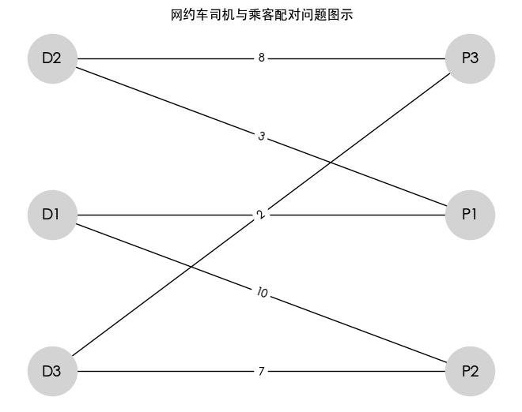
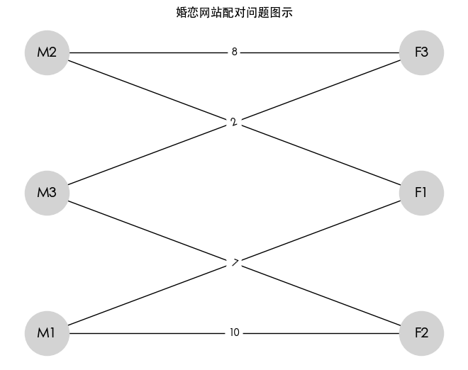

图论作为一种数学理论，旨在研究有限的离散集合中元素之间的关系，其核心在于通过图的结构，即点与线的组合，精确地描述和解析对象间的互动与联系。图的定义不仅是数学抽象，更具有丰富的应用场景。本文将结合计算机科学的视角，从图论的基本概念、实际生活中的应用以及配对问题的解决方案三个方面进行深入探讨，并通过 Python 代码实现相关模型。

## 图的本质

在图论中，图（Graph）由一组点（Vertex）和一组边（Edge）构成。我们可以将图表示为 $G = (V, E)$，其中 $V$ 是点的集合，$E$ 是边的集合。根据不同特性，图可分为以下几类：

- **无向图（Undirected Graph）**：边没有方向，表示两个点之间的双向关系。
- **有向图（Directed Graph）**：边有方向，表示从一个点到另一个点的单向关系。
- **加权图（Weighted Graph）**：边带有权重，表示元素间关系的强弱、距离、成本等。

## 图论的起源一：七桥问题

图论的起源可以追溯到柯尼斯堡的七桥问题。在 18 世纪，柯尼斯堡市（今俄罗斯的卡林格勒）有两座岛屿和两岸的桥梁，问题是是否能在不重复走过桥的情况下走遍所有桥（典型的图论问题）。这引发了欧拉提出图的定义和图论的开端。

### 七桥问题的图模型

我们可以将这些岛屿视为图的顶点（节点），而桥则被视为连接这些顶点的边。形成的图可以描述为：

- 顶点（岛屿）：A，B，C，D
- 边（桥）：AC，AC，AD，BC，BC，BD（总共七座桥）

**构建七巧问题图示**

我们将使用 Python 的`networkx`和`matplotlib`库来构建并可视化柯尼斯堡的七桥问题。

```python
from collections import Counter
import networkx as nx
import matplotlib.pyplot as plt

# 设置中文字体
plt.rcParams['font.sans-serif'] = ['Heiti TC']  # 使用黑体

# 创建无向图（MultiGraph）
G = nx.MultiGraph()
# 添加所有的边（桥）
edges = [('A', 'C'), ('A', 'C'), ('A', 'D'), ('B', 'C'), ('B', 'C'), ('B', 'D'), ('C', 'D')]
G.add_edges_from(edges)

# 绘制图
pos = nx.spring_layout(G)
nx.draw(G, pos, with_labels=True, node_color='lightblue', edge_color='gray', node_size=2000, font_size=15)

# 用于显示多条边
edge_labels = Counter(edges)
nx.draw_networkx_edge_labels(G, pos, edge_labels=edge_labels)

plt.title("柯尼斯堡七桥问题图示")
plt.show()
```


此处边的数字描述的是岛屿之间桥的数量，而不是权重。这个图模型可以帮助我们分析七桥问题的特性。

### 图解七桥问题

根据欧拉图的理论，能够在一个图中找到一条经过每条边一次且仅一次的路径（即欧拉路径），需要满足以下条件：

1. 图是连通的。
2. 顶点的度数（连接的边的数量）为奇数的顶点数目必须为零或两个。

### 代码模拟解析

尽管我们知道问题没有解决方案，但我们可以编写代码来分析图的特性，检验每个顶点度数的奇偶性。

```python
# 计算每个顶点的度数
degree_dict = {node: G.degree(node) for node in G.nodes()}
for node, degree in degree_dict.items():
    print(f"顶点 {node}: {degree}（{'偶数' if degree % 2 == 0 else '奇数'}）")

# 根据奇数顶点的数量判断是否存在欧拉路径或回路
odd_degree_count = sum(1 for degree in degree_dict.values() if degree % 2 != 0)

if odd_degree_count == 0:
    print("图中存在欧拉回路。")
elif odd_degree_count == 2:
    print("图中存在欧拉路径。")
else:
    print("图中不存在欧拉路径或欧拉回路。")
```

柯尼斯堡的七桥问题中，每个顶点的度数如下：

- 顶点 A: 3（奇数）
- 顶点 C: 5（奇数）
- 顶点 D: 3（奇数）
- 顶点 B: 3（奇数）

由于所有顶点的度数都是奇数（> 2 个），因此不存在经过每条边一次的路径。这个结论对应于欧拉定理，即图中不存在欧拉路径或欧拉回路。

运行上述代码后，根据每个顶点的度数可以确认七桥问题没有解决方案。这揭示了图论的基本原理在现实问题中的重要性，说明了一些路径问题的内在限制。

## 图论的起源二：最短路径问题

最短路径问题是图论中一个经典的问题，其目标是在给定的图中，找到两个节点之间的最短路径。它广泛应用于交通网络、通信网络、物流规划等领域。

在一个有向图 $G$ 中，包含一组顶点 $V$ 和一组边 $E$，每条边都有一个权重（例如，距离、时间或成本）。给定起点 $s$ 和终点 $t$，需要找出从 $s$ 到 $t$ 的路径，使得路径中所有边的权重之和最小。

### 最短路径问题图模型

我们可以使用 `networkx` 和 `matplotlib` 来构建和可视化一个有向图，并标识出边的权重。

```python
import networkx as nx
import matplotlib.pyplot as plt

# 创建一个有向图
G = nx.DiGraph()

# 添加边和权重
edges = [('A', 'B', 3), ('A', 'C', 6), ('B', 'C', 2), ('B', 'D', 1), ('C', 'D', 5)]
G.add_weighted_edges_from(edges)

# 绘制图
pos = nx.spring_layout(G)
nx.draw(G, pos, with_labels=True, node_color='lightblue', edge_color='gray', node_size=2000, font_size=15)

# 添加边权重标签
edge_labels = nx.get_edge_attributes(G, 'weight')
nx.draw_networkx_edge_labels(G, pos, edge_labels=edge_labels)

plt.title("有向图及其边权重")
plt.show()
```


### 图解最短路径问题

这里我们使用 Dijkstra 算法来解决最短路径问题。Dijkstra 算法与广度优先搜索（BFS）相似，但它会考虑边的权重，确保选择当前最小距离的节点进行扩展。

**代码模拟解析**

以下是使用 Dijkstra 算法计算从节点 1 到节点 4 的最短路径的实现：

```python
import networkx as nx

# 定义图
G = nx.DiGraph()
edges = [('A', 'B', 3), ('A', 'C', 6), ('B', 'C', 2), ('B', 'D', 1), ('C', 'D', 5)]
G.add_weighted_edges_from(edges)

# 使用 Dijkstra 算法计算最短路径
source = 'A'
target = 'D'
shortest_path = nx.dijkstra_path(G, source, target)
shortest_distance = nx.dijkstra_path_length(G, source, target)

print(f'从节点 {source} 到节点 {target} 的最短路径: {shortest_path}, 距离: {shortest_distance}')
# 从节点 A 到节点 D 的最短路径: `['A', 'B', 'D']`, 距离: `4`
```

使用 `nx.dijkstra_path` 找到从源节点到目标节点的最短路径，同时使用 `nx.dijkstra_path_length` 计算路径的总距离。

运行上述代码后，输出将显示从节点 A 到节点 D 的最短路径和距离。这种方法有效且简单，能够用于解决交通、网络等多种实际应用中的最短路径问题。

### Dijkstra 算法

Dijkstra 算法是一种用于计算图中单源最短路径的有效算法，适用于加权图，但不能处理具有负权边的图。下面我们将通过给定的代码代码来逐步分析算法的实现过程。

```python
import heapq

class DijkstraGraph:
    def __init__(self):
        self.graph = {}

    def add_edge(self, u, v, weight):
        if u not in self.graph:
            self.graph[u] = []
        self.graph[u].append((v, weight))  # 添加边 u 到 v
        if v not in self.graph:
            self.graph[v] = []
        self.graph[v].append((u, weight))  # 添加边 v 到 u（无向图）

    def dijkstra(self, start):
        min_heap = [(0, start)]  # 使用优先队列存储最小距离
        visited = set()  # 用于存储已访问的节点
        distances = {vertex: float('inf') for vertex in self.graph}  # 初始化距离
        distances[start] = 0  # 起点到自身距离为0

        while min_heap:
            current_distance, current_vertex = heapq.heappop(min_heap)  # 取出距离最小的节点

            if current_vertex in visited:
                continue  # 如果该节点已访问，跳过

            visited.add(current_vertex)  # 标记为已访问

            # 更新邻居节点的距离
            for neighbor, weight in self.graph[current_vertex]:
                distance = current_distance + weight

                if distance < distances[neighbor]:  # 如果发现更短的路径
                    distances[neighbor] = distance
                    heapq.heappush(min_heap, (distance, neighbor))  # 将邻居加入优先队列

        return distances  # 返回所有节点的最短距离

# 示例
g = DijkstraGraph()
g.add_edge('A', 'B', 3)
g.add_edge('A', 'C', 6)
g.add_edge('B', 'C', 2)
g.add_edge('B', 'D', 1)
g.add_edge('C', 'D', 5)

# 输出从 A 到其他节点的最短路径
print(g.dijkstra('A'))
# {'A': 0, 'B': 3, 'C': 5, 'D': 4}
```

在示例中，我们创建了一个无向图并添加边：

- 从节点 A 到 B 权重为 3
- 从 A 到 C 权重为 6
- 从 B 到 C 权重为 2
- 从 B 到 D 权重为 1
- 从 C 到 D 权重为 5

调用 `g.dijkstra('A')` 返回的结果：

- `'A': 0`：从 A 到 A 的距离为 0
- `'B': 3`：从 A 到 B 的最短距离为 3
- `'C': 5`：从 A 到 C 的最短距离为 5（A → B → C）
- `'D': 4`：从 A 到 D 的最短距离为 4（A → B → D）

通过这个示例例，可清晰看到 Dijkstra 算法如何有效地计算出各节点的最短路径。

**数据结构**

- **图的表示**：使用字典 `self.graph` 来表示图，键为节点，值为邻居节点及其权重的列表。
- **优先队列**：使用 `heapq` 实现优先队列，便于高效地提取当前距离最小的节点。

**初始化**

- 所有节点的距离初始化为无穷大，起点的距离设为 0。

**主循环**

- 使用最小堆 `min_heap`，在每次循环中提取出当前距离最小的节点。
- 如果该节点已经被访问，继续下一个循环；否则标记为已访问。
- 遍历当前节点的所有邻居，计算新路径的距离，并更新邻居的距离。

**时间复杂度**

- Dijkstra 算法的时间复杂度为 $O((V + E) \log V)$，其中 $V$ 是顶点数，$E$ 是边数。使用优先队列是主要的性能提升原因。

**局限性**

- Dijkstra 算法不能处理负权边，因为它假设一旦找到到某个节点的最短路径，就不会再更新该节点的距离。但如果存在负权边，这个假设就不成立了。

## 图论的起源三：电路分析与基尔霍夫定律

基尔霍夫定律主要包括两条基本定律：基尔霍夫电压定律（KVL）和基尔霍夫电流定律（KCL）。这两条定律在电子电路分析中至关重要。

- **基尔霍夫电压定律 (KVL)**：在一个闭合回路中，所有电压的代数和等于零。这意味着在回路中电源电压与消耗电压的总和相等。
- **基尔霍夫电流定律 (KCL)**：在任何一个节点，流入节点的总电流等于流出节点的总电流。这反映了电流的保守性。

在电路设计与分析中，基尔霍夫定律可用于计算各元件的电压、电流并进行优化，以提高电路的性能。通过将电阻、电压源等元件抽象为图论模型，可以更直观地分析电路性能。

### 电路示意图

我们将使用 `KCL` 和 `KVL` 进行电路分析。以一个简单的电路为例，该电路包含三个电阻（R1、R2、R3）和一个电压源（V）。

首先构建一个简单的电路图，并在节点上标注电流和电压。

```python
import matplotlib.pyplot as plt
import networkx as nx

# 创建图
G = nx.Graph()

# 添加节点（电阻和电压源）
G.add_node('V', pos=(0, 1))  # 电压源
G.add_node('R1', pos=(0, 0))  # 电阻 R1
G.add_node('R2', pos=(1, 0))  # 电阻 R2
G.add_node('R3', pos=(1, 1))  # 电阻 R3

# 添加电流路径
G.add_edges_from([('V', 'R1'), ('R1', 'R2'), ('R2', 'R3'), ('R3', 'V')])

# 定义节点位置
pos = nx.get_node_attributes(G, 'pos')

# 绘制图
# 使用 'spring' 布局算法，这种算法适合减少边的交叉
pos = nx.spring_layout(G, pos=pos, iterations=50)

# 绘制图形
nx.draw(G, pos, with_labels=True, node_size=3000,
        node_color='lightblue', font_size=14)

# 添加标题和隐藏坐标轴
plt.title("电路示意图")
plt.axis('off')  # 不显示坐标轴
plt.show()
```


### 电路计算示例

假设电路电压为 $V = 10V$，电阻值为 $R1 = 2 \Omega$，$R2 = 3 \Omega$，$R3 = 5 \Omega$。我们可以使用基尔霍夫定律计算通过每个电阻的电流。

在此假设中，电流从电压源流入，各电阻上电压降与电流的关系为：

- 根据 KVL，电压下降的总和等于电压源。
- $I = \frac{V}{R}$

### 代码模拟电流计算

```python
# 定义电压和电阻值
V = 10  # 电压
R1 = 2  # 电阻 R1
R2 = 3  # 电阻 R2
R3 = 5  # 电阻 R3

# 通过 Ohm 定律计算每个电阻上电流
I_R1 = V / R1
I_R2 = V / R2
I_R3 = V / R3

print(f"电压源: {V}V")
print(f"通过 R1 的电流: {I_R1}A")
print(f"通过 R2 的电流: {I_R2}A")
print(f"通过 R3 的电流: {I_R3}A")

# 电压源: 10V
# 通过 R1 的电流: 5.0A
# 通过 R2 的电流: 3.3333333333333335A
# 通过 R3 的电流: 2.0A
```

- **电路图**：通过使用 `networkx` 绘制电路示意图，清晰地展示电压源和电阻的位置以及连接关系。
- **电流计算**：根据基尔霍夫电流定律，计算每个电阻的电流。电流通过 Ohm 定律（$I = \frac{V}{R}$）来计算。由于电流是通过不同电阻流动的，可能会根据电路设计有所变化，但在简单的串联电路中，电流是相等的。

这种图形化的方法帮助理解电路内部关系，便于优化和解决实际电气工程问题。

## 图论的起源四：地图染色问题

地图染色问题是图论中的经典问题，其目标是在图中为节点（代表地图上的区域）着色，使得相邻的节点（代表共享边界的区域）使用不同的颜色。问题的关键在于使用最少的颜色并确保没有两个相邻的区域有相同的颜色。

- **应用**：地图染色问题在实际中广泛应用于地理、图像处理、调度和资源分配等领域。例如，在制定选区时，需要确保相邻的选区不使用相同的颜色以避免冲突。
- **理论**：根据四色定理，在任何平面地图上，最多只需要四种颜色就可以完成染色。

### 地图染色问题图模型

我们将使用 `networkx` 和 `matplotlib` 绘制一个图以表示一个简单的地图，然后用贪心算法为这个图着色。

首先，我们创建一个简单的图来表示地图。

```python
import networkx as nx
import matplotlib.pyplot as plt

# 创建图
G = nx.Graph()

# 添加节点（区域）
regions = ['A', 'B', 'C', 'D', 'E']
G.add_nodes_from(regions)

# 添加边（相邻区域）
edges = [('A', 'B'), ('A', 'C'), ('B', 'C'), ('B', 'D'), ('C', 'D'), ('D', 'E')]
G.add_edges_from(edges)

# 绘制图
pos = nx.spring_layout(G)
nx.draw(G, pos, with_labels=True, node_color='lightgray', edge_color='gray', node_size=2000)
plt.title("地图图示")
plt.show()
```


### 地图染色模拟

接下来，我们使用贪心算法为这个图染色。

```python
def greedy_coloring(graph):
    color_map = {}
    # 获取所有节点
    nodes = list(graph.nodes)

    for node in nodes:
        # 获取相邻节点的颜色
        neighbor_colors = {color_map.get(neighbor) for neighbor in graph.neighbors(node)}
        # 找到第一个可用颜色
        color = 0
        while color in neighbor_colors:
            color += 1
        color_map[node] = color

    return color_map

# 应用贪心算法进行染色
coloring = greedy_coloring(G)

# 打印染色结果
print("染色结果:", coloring)

# 绘制结果
color_values = [coloring[node] for node in G.nodes]
nx.draw(G, pos, with_labels=True, node_color=color_values, edge_color='gray', node_size=2000, cmap=plt.cm.rainbow)
plt.title("地图染色结果")
plt.show()
# 染色结果: {'A': 0, 'B': 1, 'C': 2, 'D': 0, 'E': 1}
```


**图的构建**

我们创建一个无向图来表示区域（节点）及其相邻关系（边）。每个区域通过边连接。

**贪心染色算法**

- 遍历每个节点，并找到所有相邻节点的颜色。
- 选择最小的可用颜色来为当前节点上色。
- 利用集合操作避免冲突，确保没有相邻节点使用同一颜色。

通过运行上述代码，我们可以获得每个区域的染色情况，并可以验证相邻区域的颜色是不同的。该模型展示了简单的贪心算法如何有效解决地图染色问题。

这种方法可以扩展到更复杂的地图或使用更多颜色进行优化，进一步探讨图论中的染色理论对于实际应用的与可能的改进。

## 结语

图论经过了上百年的发展，已经成为解决数据问题和计算机科学问题的重要工具。图论的核心是对图的理解与应用，而图的本质就是对离散的、有限集合中各个元素之间关系的描述。通过图的结构，我们可以更好地理解和解决现实生活中的问题。


## 网约车司机与乘客配对问题

网约车服务（如 Uber、Lyft 等）通过将司机和乘客进行有效配对来提高效率和满意度。配对问题的目标是为每一位乘客找到一个合适的司机，通常考虑因素包括距离、时间、费用等。

- **参与者**：司机和乘客。
- **目标**：最小化乘客等待时间或旅行成本，同时确保每位乘客都能配对到司机。
- **约束**：司机的可用性、乘客的需求以及交通条件等。

通过图论，可以将这类问题建模为一个二分图，其中一部分是司机，另一部分是乘客，边权可以表示司机与乘客之间的匹配成本（如预计到达时间或距离）。

### 网约车司机与乘客配对问题图模型

我们将使用 `networkx` 来构建二分图并使用匈牙利算法（Hopcroft–Karp 算法）进行求解。

**构建二分图**

```python
import networkx as nx
import matplotlib.pyplot as plt

# 创建二分图
B = nx.Graph()

# 司机
drivers = ['D1', 'D2', 'D3']
# 乘客
passengers = ['P1', 'P2', 'P3']

# 添加司机和乘客节点
B.add_nodes_from(drivers, bipartite=0)  # 司机
B.add_nodes_from(passengers, bipartite=1)  # 乘客

# 添加边和权重（表示与乘客的匹配成本）
edges = [
    ('D1', 'P1', 5),  # 司机 D1 与乘客 P1 的匹配成本
    ('D1', 'P2', 10),  # 司机 D1 与乘客 P2 的匹配成本
    ('D2', 'P1', 3),  # 司机 D2 与乘客 P1 的匹配成本
    ('D2', 'P3', 8),  # 司机 D2 与乘客 P3 的匹配成本
    ('D3', 'P2', 7),  # 司机 D3 与乘客 P2 的匹配成本
    ('D3', 'P3', 2)   # 司机 D3 与乘客 P3 的匹配成本
]

B.add_weighted_edges_from([(u, v, weight) for u, v, weight in edges])

# 绘制图
pos = nx.multipartite_layout(B, subset_key="bipartite")
nx.draw(B, pos, with_labels=True, node_size=2000, node_color='lightgray', font_size=14)
edge_labels = nx.get_edge_attributes(B, 'weight')
nx.draw_networkx_edge_labels(B, pos, edge_labels=edge_labels)
plt.title("网约车司机与乘客配对问题图示")
plt.show()
```



**图的构建**

- 创建一个二分图，分别添加司机和乘客。
- 添加边及其权重，权重表示司机和乘客之间的匹配成本（如距离、预计等待时间等）。

在网约车场景中，可以将司机与乘客视作图的点，通过边来代表匹配的关系。

### 配对模拟

我们将使用匈牙利算法确定最优匹配，使得总成本最小。

```python
from scipy.optimize import linear_sum_assignment
import numpy as np

# 创建成本矩阵（行：司机，列：乘客）
cost_matrix = np.array([
    [5, 10, np.inf],  # D1
    [3, np.inf, 8],   # D2
    [np.inf, 7, 2]    # D3
])

# 使用匈牙利算法解决最优配对问题
row_ind, col_ind = linear_sum_assignment(cost_matrix)

# 打印结果
print("最优配对结果:")
for driver_index, passenger_index in zip(row_ind, col_ind):
    if cost_matrix[driver_index][passenger_index] != np.inf:
        print(f'{drivers[driver_index]} 配对 {passengers[passenger_index]} - 成本: {cost_matrix[driver_index][passenger_index]}')

# 最优配对结果:
# D1 配对 P2 - 成本: 10.0
# D2 配对 P1 - 成本: 3.0
# D3 配对 P3 - 成本: 2.0
```

- 设定成本矩阵，表示司机与乘客的匹配成本。
- 使用 `linear_sum_assignment` 来寻找总成本最小的匹配方案。
- 输出每对司机和乘客的最佳匹配及其对应的成本。

通过上述代码，我们能够有效地处理网约车司机与乘客配对问题，并获取最优配对。这种模型可以扩展到实际的网约车服务中，通过考虑实际的实时数据来进行动态配对，有利于提高效率和乘客满意度。

### 匈牙利算法

匈牙利算法是一种用于解决二分图最大匹配问题的高效算法，我们可以通过 Python 实现这个算法。

```python
class HopcroftKarp:
    def __init__(self, n, m):
        self.pair_U = [-1] * n
        self.pair_V = [-1] * m
        self.dist = [0] * n
        self.graph = [[] for _ in range(n)]

    def add_edge(self, u, v):
        self.graph[u].append(v)

    def bfs(self):
        queue = []
        for u in range(len(self.pair_U)):
            if self.pair_U[u] == -1:
                queue.append(u)
                self.dist[u] = 0
            else:
                self.dist[u] = float('inf')

        found_augmenting_path = False
        for u in queue:
            for v in self.graph[u]:
                if self.pair_V[v] == -1:
                    found_augmenting_path = True
                else:
                    next_u = self.pair_V[v]
                    if self.dist[next_u] == float('inf'):
                        queue.append(next_u)
                        self.dist[next_u] = self.dist[u] + 1

        return found_augmenting_path

    def dfs(self, u):
        for v in self.graph[u]:
            next_u = self.pair_V[v]
            if next_u == -1 or (self.dist[next_u] == self.dist[u] + 1 and self.dfs(next_u)):
                self.pair_U[u] = v
                self.pair_V[v] = u
                return True
        self.dist[u] = float('inf')
        return False

    def matching(self):
        while self.bfs():
            for u in range(len(self.pair_U)):
                if self.pair_U[u] == -1:
                    self.dfs(u)

        return self.pair_U

# 示例
hk = HopcroftKarp(4, 4)
hk.add_edge(0, 0)
hk.add_edge(0, 1)
hk.add_edge(1, 1)
hk.add_edge(1, 2)
hk.add_edge(2, 2)
hk.add_edge(3, 1)

print(hk.matching())  # 输出每个司机配对的乘客位置
```

## 婚恋网站配对问题

婚恋网站的主要功能是帮助用户找到合适的伴侣。配对问题可以被视为在用户之间建立有效关系的过程，在这一过程中，网站希望根据用户的偏好、兴趣和其他属性来推荐最佳匹配。

**问题描述**

- **用户**：包括男性和女性，通常表示为两个不同的集合。
- **目标**：为每个用户找到最佳匹配，使得所有用户的满意度最大化。
- **约束条件**：可以考虑用户的个人偏好、对特定特征的偏好等。

在婚恋网站中，相亲双方的偏好可以转化为一个二分图，匈牙利算法同样适用来寻找最佳配对。

- 配对问题在多个领域内都具有实际意义，分析最佳配对策略可大幅提升效率与满意度。
- 如何处理复杂的偏好关系及多样化条件，可能要求对算法进行优化与调整。

通过图论，可以将用户和其匹配关系建模为一个二分图，其中一部分是男性用户，另一部分是女性用户，边则表示两者之间的匹配关系，权重可以表示匹配的满意度或兼容性。

### 婚恋网站配对图模型

我们将使用 `networkx` 来构建二分图，并使用匈牙利算法来找到最佳匹配。

**构建二分图**

下面是将男性用户与女性用户表示为图的代码。

```python
import networkx as nx
import matplotlib.pyplot as plt

# 创建二分图
B = nx.Graph()

# 男性用户
males = ['M1', 'M2', 'M3']
# 女性用户
females = ['F1', 'F2', 'F3']

# 添加男性和女性节点
B.add_nodes_from(males, bipartite=0)  # 男性
B.add_nodes_from(females, bipartite=1)  # 女性

# 添加边和权重（表示匹配的满意度）
edges = [
    ('M1', 'F1', 5),  # 男性 M1 与女性 F1 的匹配满意度
    ('M1', 'F2', 10),  # 男性 M1 与女性 F2 的匹配满意度
    ('M2', 'F1', 3),  # 男性 M2 与女性 F1 的匹配满意度
    ('M2', 'F3', 8),  # 男性 M2 与女性 F3 的匹配满意度
    ('M3', 'F2', 7),  # 男性 M3 与女性 F2 的匹配满意度
    ('M3', 'F3', 2)   # 男性 M3 与女性 F3 的匹配满意度
]

B.add_weighted_edges_from([(u, v, weight) for u, v, weight in edges])

# 绘制图
pos = nx.multipartite_layout(B, subset_key="bipartite")
nx.draw(B, pos, with_labels=True, node_size=2000, node_color='lightgray', font_size=14)
edge_labels = nx.get_edge_attributes(B, 'weight')
nx.draw_networkx_edge_labels(B, pos, edge_labels=edge_labels)
plt.title("婚恋网站配对问题图示")
plt.show()
```



**图的构建**

- 创建一个二分图，分别添加男性和女性。
- 添加边及其权重，权重表示男性与女性之间的匹配满意度。

### 配对模拟

我们将使用匈牙利算法来找到最佳匹配。

```python
from scipy.optimize import linear_sum_assignment
import numpy as np

# 创建满意度矩阵（行：男性，列：女性）
satisfaction_matrix = np.array([
    [5, 10, np.inf],  # M1
    [3, np.inf, 8],   # M2
    [np.inf, 7, 2]    # M3
])

# 使用匈牙利算法解决最优配对问题
row_ind, col_ind = linear_sum_assignment(-satisfaction_matrix)  # 取负值以最大化满意度

# 打印结果
print("最佳配对结果:")
for male_index, female_index in zip(row_ind, col_ind):
    if satisfaction_matrix[male_index][female_index] != np.inf:
        print(f'{males[male_index]} 配对 {females[female_index]} - 满意度: {satisfaction_matrix[male_index][female_index]}')
```

**使用匈牙利算法**：设定满意度矩阵，使用 `linear_sum_assignment` 来寻找总满意度最大的匹配方案。
**结果的输出**：输出每对配对结果和对应的满意度。

通过上述代码，我们能够有效地处理婚恋网站的配对问题，并获取最佳配对。该模型可以扩展到实际的婚恋网站，通过实时分析用户数据，推荐最合适的伴侣。这样的匹配算法可以提高用户满意度，增强用户在平台上的体验。

## 结语

在社会实验与市场机制中，图论可以帮助分析竞争与合作如何影响配对的效果。例如，通过分析竞争者间的边权重，评估配对质量。

通过对图论的基本概念与历史背景的探讨，以及在生活中实际应用的案例分析，我们在计算机科学的视角下，对图论的基本概念、实际应用与配对问题进行了深入分析，结合 Python 代码实现加深对图论理论的理解。这些分析为现代科技与社会发展提供了实用的工具与方法，展示了该领域的广泛应用潜力及未来可能的研究方向。图论不仅是数学的抽象工具，更是现代科技和社会发展的重要支撑。探索图论在日常生活中的影响，激励我们在应对复杂问题时，更有效地运用这一理论，提升决策的科学性与效率。
