## 引言

图的遍历是图论中的核心概念，通过不同的遍历方法能够有效地处理多种问题，例如连通性检测、路径查找、图的最小生成树等。本篇我们将重点探讨图的深度优先搜索（DFS）和广度优先搜索（BFS）两种常见的图遍历方法，分析它们的原理、应用场景以及实现方法，并通过实际案例代码分析问题解决方案。


## 基本概念

图是一种表示对象间关系的数据结构，由顶点和边组成。按照边的方向，图可以分为有向图和无向图。图的遍历主要有两种方式：

- **深度优先搜索（DFS）**：优先深入图的分支，直到无法继续时回溯。
- **广度优先搜索（BFS）**：优先探索与当前节点相邻的节点，然后逐层向外扩展。

### 无向图示例

下面是一个无向图示例，适合用于探讨图的遍历（深度优先搜索和广度优先搜索）。

```
    A
   / \
  B  C
 /|  |
D |  |
 \|  |
  E--F
  |  |
  G  H
   \ |
    I
```

在这个图中，节点的连接关系如下：

- A 连接 B、C
- B 连接 D、E
- C 连接 E、F
- D 连接 E
- E 连接 G、F
- F 连接 H
- G 连接 I
- H 连接 I

### 绘制图形

下面的代码使用 `networkx` 和 `matplotlib` 库绘制该图。请确保已安装这两个库（如果尚未安装，请运行 `pip install networkx matplotlib`）。

以下是绘制上述无向图的 Python 代码：

```python
import matplotlib.pyplot as plt
import networkx as nx

# 创建空图
G = nx.Graph()

# 添加节点和边
edges = [
    ('A', 'B'),
    ('A', 'C'),
    ('B', 'D'),
    ('B', 'E'),
    ('C', 'E'),
    ('C', 'F'),
    ('D', 'E'),
    ('E', 'F'),
    ('E', 'G'),
    ('F', 'H'),
    ('G', 'I'),
    ('H', 'I')
]

G.add_edges_from(edges)

# 绘制图形
pos = nx.spring_layout(G)  # 选择布局
nx.draw(G, pos, with_labels=True, node_color='lightblue', node_size=700, font_size=12, font_weight='bold', edge_color='gray')

# 显示图形
plt.title("无向图示例")
plt.show()
```

运行上述代码将生成一个表示上述无向图的可视化图形，为后续对深度优先搜索（DFS）和广度优先搜索（BFS）的探讨提供一个演示基础。

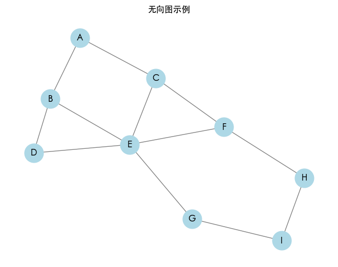

**代码释意**

- **导入库**：使用 `matplotlib.pyplot` 来绘制图形，使用 `networkx` 来处理图结构。
- **创建图**：创建一个无向图对象 `G`。
- **添加边**：通过 `add_edges_from` 方法将边添加到图中，定义节点之间的连接关系。
- **设置图的布局**：使用 `spring_layout` 选择图形的布局，这有助于更清晰地展示图的结构。
- **绘制图形**：使用 `nx.draw` 来绘制图，设置节点的颜色、大小和标签。
- **显示图**：通过 `plt.show()` 来显示绘制的图形。

## 深度优先搜索（DFS）

### 基本概念

深度优先搜索利用栈（可以用递归实现）来访问图中的节点。当访问一个节点时，会深度探索该节点的所有相邻节点，直到无法继续。

**算法步骤**：

1. 从起始节点开始，标记为已访问。
2. 递归访问未访问的相邻节点。
3. 如果所有相邻节点都已访问，回溯到上一个节点。

下面我们将逐步展示如何使用 Python 代码演示无向图的深度优先搜索（DFS）过程与效果吗，并实现 DFS 算法。

### 可视化 DFS 过程

在实现 DFS 并打印结果后，我们可以通过 `matplotlib` 绘制这幅图以可视化 DFS 的遍历过程。为了展示仍然在访问中的节点，我们将在访问每个节点时更新图像。

以下是完整的 DFS 过程可视化实现：

```python
import matplotlib.pyplot as plt
import networkx as nx
import time

class Graph:
    def __init__(self):
        self.graph = nx.Graph()  # 使用 networkx 的 Graph 对象

    def add_edge(self, u, v):
        self.graph.add_edge(u, v)  # 直接添加边到 Graph 对象

    def dfs(self, start):
        visited = set()
        path = []
        self._dfs_util(start, visited, path)
        return path

    def _dfs_util(self, vertex, visited, path):
        visited.add(vertex)
        path.append(vertex)  # 记录路径
        self.visualize_dfs(path)  # 可视化图遍历
        for neighbor in self.graph[vertex]:  # 使用 networkx 的方式访问相邻节点
            if neighbor not in visited:
                self._dfs_util(neighbor, visited, path)

    def visualize_dfs(self, path):
        plt.clf()  # 清空当前的图
        pos = nx.spring_layout(self.graph)
        nx.draw(self.graph, pos, with_labels=True, node_color='lightblue', node_size=700, font_size=12, font_weight='bold', edge_color='gray')
        # 着色已访问的节点
        nx.draw_networkx_nodes(self.graph, pos, nodelist=path, node_color='orange')
        plt.title("深度优先搜索（DFS）可视化")
        plt.pause(0.5)  # 暂停以绘制图像


# 创建无向图
G = Graph()
edges = [
    ('A', 'B'), ('A', 'C'), ('B', 'D'), ('B', 'E'),
    ('C', 'E'), ('C', 'F'), ('D', 'E'), ('E', 'F'),
    ('E', 'G'), ('F', 'H'), ('G', 'I'), ('H', 'I')
]

for u, v in edges:
    G.add_edge(u, v)

# 设置图的布局
plt.ion()  # 开启交互模式
plt.figure(figsize=(8, 6))

# 执行 DFS
dfs_result = G.dfs('A')
print("深度优先搜索的结果:", dfs_result)

plt.ioff()  # 关闭交互模式
plt.show()  # 显示最终图
# 深度优先搜索的结果: ['A', 'B', 'D', 'E', 'C', 'F', 'H', 'I', 'G']
```

**代码释意**

- **图的构建**：使用 `add_edge` 方法构建无向图，确保每个节点都相互连接。
- **DFS 实现**：使用递归方法进行深度优先搜索，同时在每次访问节点时调用可视化函数。
- **可视化函数**：使用 `matplotlib` 不断更新图的显示，以展示各个节点的遍历状态。
- **交互模式**：通过开启交互模式（`plt.ion()`），允许我们逐步更新图。

**运行示例**

运行上面的完整代码，可以看到图的遍历过程。每次访问一个节点时，节点将会变为橙色，表示已访问。最终，程序也会打印出 DFS 的结果路径。

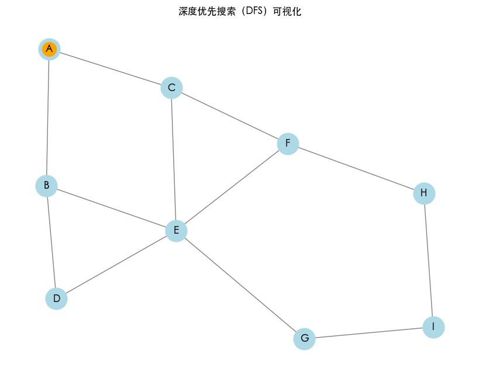
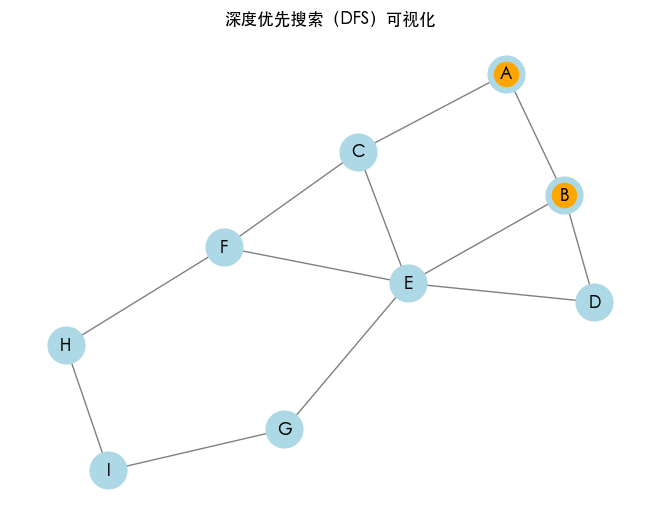
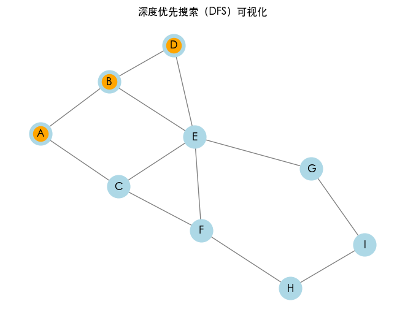
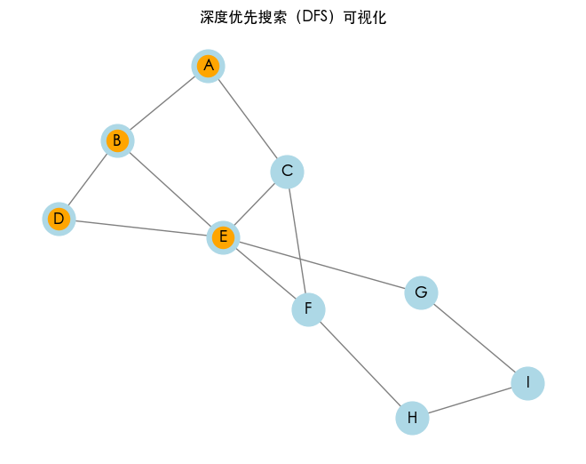
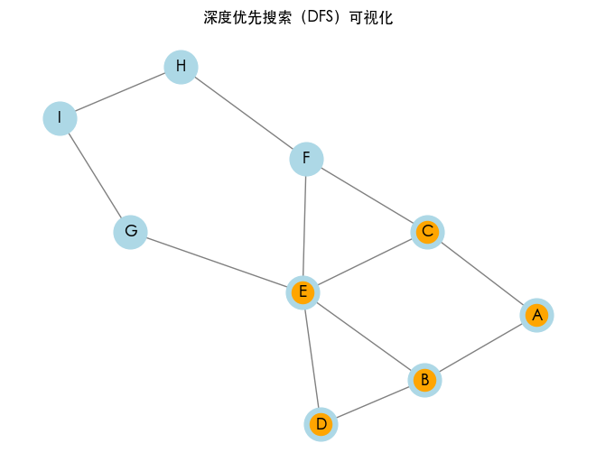
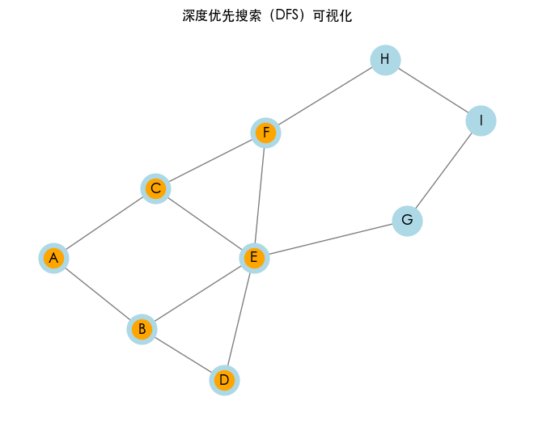
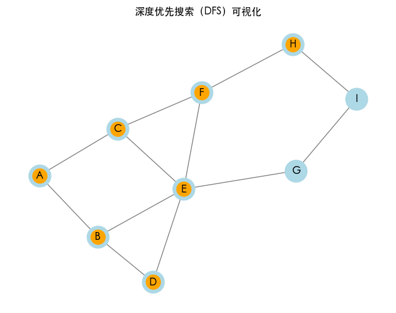
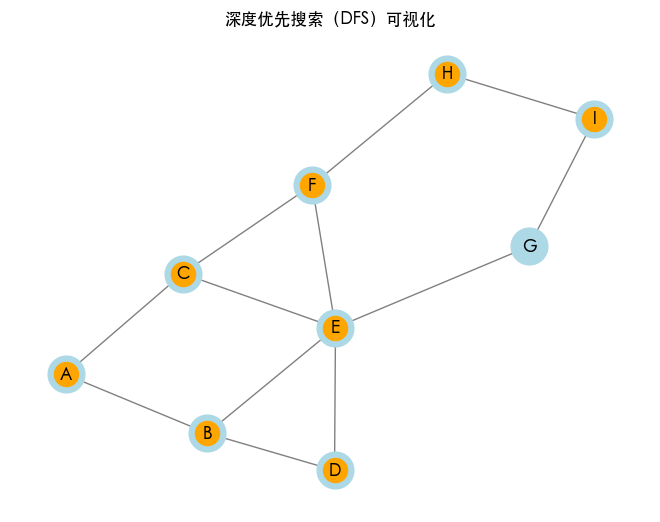
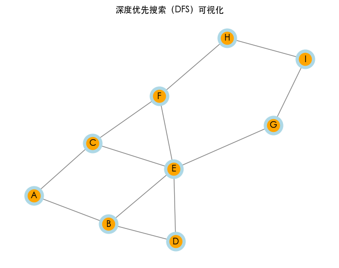

深度优先搜索的结果: `['A', 'B', 'D', 'E', 'C', 'F', 'H', 'I', 'G']`

### 深度优先搜索（DFS）

下面是 DFS 算法的实现。我们使用一个递归方法进行实现，在访问每个节点时记录路径，以便可视化图遍历结果。

```python
import matplotlib.pyplot as plt
import networkx as nx

class Graph:
    def __init__(self):
        self.graph = {}

    def add_edge(self, u, v):
        if u not in self.graph:
            self.graph[u] = []
        if v not in self.graph:
            self.graph[v] = []
        self.graph[u].append(v)
        self.graph[v].append(u)  # 无向图，双向添加

    def dfs(self, start):
        visited = set()
        path = []
        self._dfs_util(start, visited, path)
        return path

    def _dfs_util(self, vertex, visited, path):
        visited.add(vertex)
        path.append(vertex)  # 记录路径
        for neighbor in self.graph.get(vertex, []):
            if neighbor not in visited:
                self._dfs_util(neighbor, visited, path)

# 创建无向图
G = Graph()
edges = [
    ('A', 'B'), ('A', 'C'), ('B', 'D'), ('B', 'E'),
    ('C', 'E'), ('C', 'F'), ('D', 'E'), ('E', 'F'),
    ('E', 'G'), ('F', 'H'), ('G', 'I'), ('H', 'I')
]

for u, v in edges:
    G.add_edge(u, v)

# 执行 DFS
dfs_result = G.dfs('A')
print("深度优先搜索的结果:", dfs_result)
# 深度优先搜索的结果: ['A', 'B', 'D', 'E', 'C', 'F', 'H', 'I', 'G']
```

**关键点**

- **递归深度**：DFS 的递归深度可能导致栈溢出，特别是在具有深层嵌套的图上。可考虑使用显式栈来替代递归。
- **访问状态**：使用集合来管理访问状态，提高查询效率。

### DFS 应用场景

- **连通性检测**：判断图中是否存在连接路径。
- **图的遍历**：访问图中的所有节点。
- **找出图中的环**：通过深度优先遍历可以判断图中是否存在环。
- **路径查找**：在特定情况下寻找从起点到终点的路径。

## 广度优先搜索（BFS）

### 基本概念

广度优先搜索利用队列来逐层访问图中的节点。首先访问起始节点，然后将所有直接相邻的节点入队，并继续出队和访问这些节点。

**算法步骤**：

1. 从起始节点开始，将其加入队列并标记为已访问。
2. 循环直到队列为空，出队当前节点，并访问其相邻节点。
3. 将未访问的相邻节点入队并标记为已访问。

我们逐步展示如何使用 Python 代码演示无向图的广度优先搜索（BFS）过程与效果，以及实现 BFS 算法。

### 可视化 BFS 过程

以下是使用队列实现 BFS，访问每个节点时记录路径，以及可视化图遍历结果。

```python
import matplotlib.pyplot as plt
import networkx as nx
from collections import deque

class Graph:
    def __init__(self):
        self.graph = nx.Graph()  # 使用 networkx 的 Graph 对象

    def add_edge(self, u, v):
        self.graph.add_edge(u, v)  # 直接添加边到 Graph 对象

    def bfs(self, start):
        visited = set()
        path = []
        queue = deque([start])  # 使用 deque 作为队列

        while queue:
            vertex = queue.popleft()
            if vertex not in visited:
                visited.add(vertex)
                path.append(vertex)  # 记录路径
                self.visualize_bfs(path)  # 可视化图遍历
                for neighbor in self.graph[vertex]:
                    if neighbor not in visited:
                        queue.append(neighbor)  # 将未访问的相邻节点加入队列

        return path

    def visualize_bfs(self, path):
        plt.clf()  # 清空当前的图
        pos = nx.spring_layout(self.graph)
        nx.draw(self.graph, pos, with_labels=True, node_color='lightblue', node_size=700, font_size=12, font_weight='bold', edge_color='gray')
        # 着色已访问的节点
        nx.draw_networkx_nodes(self.graph, pos, nodelist=path, node_color='orange')
        plt.title("广度优先搜索（BFS）可视化")
        plt.pause(0.5)  # 暂停以绘制图像

# 创建无向图
G = Graph()
edges = [
    ('A', 'B'), ('A', 'C'), ('B', 'D'), ('B', 'E'),
    ('C', 'E'), ('C', 'F'), ('D', 'E'), ('E', 'F'),
    ('E', 'G'), ('F', 'H'), ('G', 'I'), ('H', 'I')
]

for u, v in edges:
    G.add_edge(u, v)

# 设置图的布局
plt.ion()  # 开启交互模式
plt.figure(figsize=(8, 6))

# 执行 BFS
bfs_result = G.bfs('A')
print("广度优先搜索的结果:", bfs_result)

plt.ioff()  # 关闭交互模式
plt.show()  # 显示最终图
```

**代码释意**

- **Graph 类**：
  - 使用 `nx.Graph()` 创建无向图。
  - `add_edge(u, v)` 方法将边添加到图中。
- **广度优先搜索（BFS）**：
  - `bfs(start)` 方法使用队列（`deque`）遍历图。
  - 访问每个节点时，将其添加到路径中，并调用 `visualize_bfs()` 方法进行图的可视化。
- **可视化方法**：
  - `visualize_bfs(path)` 方法清空图并重新绘制，只标记已访问的节点。
  - 使用 `plt.pause(0.5)` 使图的更新可见。

**运行示例**

运行上述代码后，将看到一个窗口，展示 BFS 的遍历过程。每次访问一个节点时，该节点会变为橙色，同时终端将打印 BFS 的结果路径。

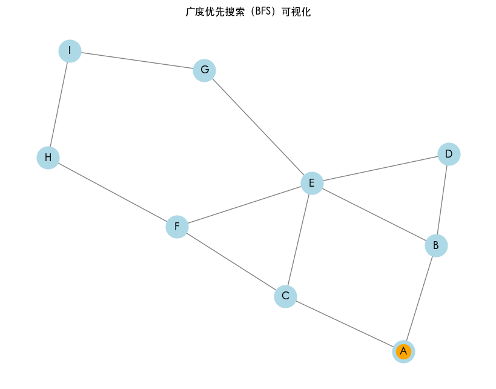
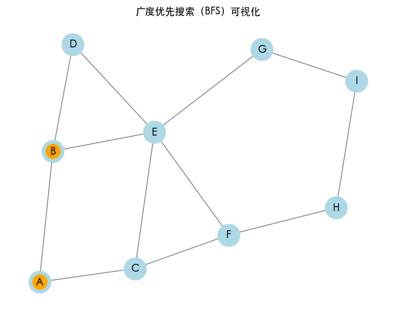
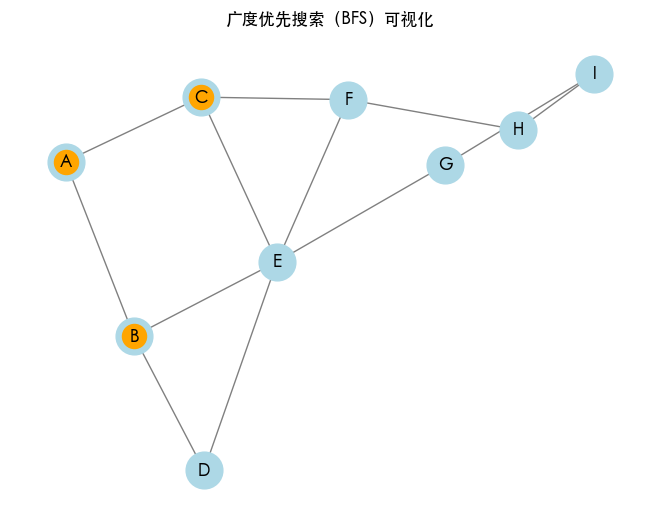
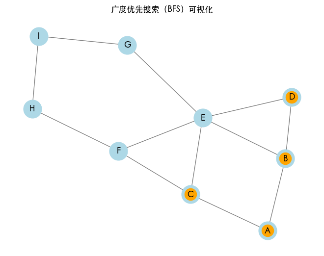
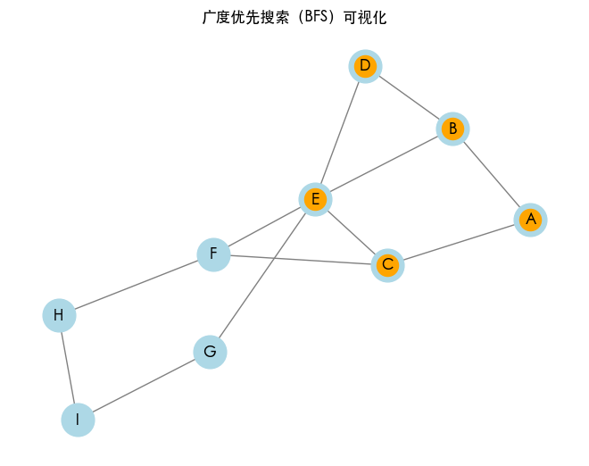
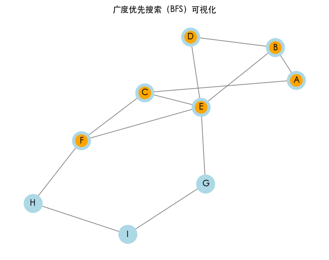
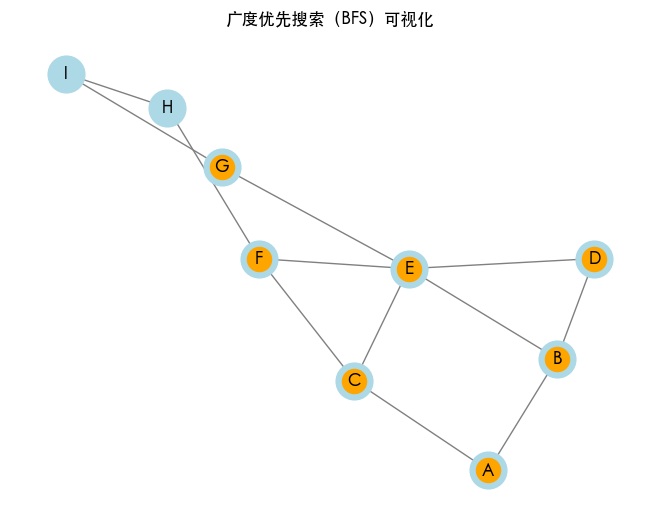
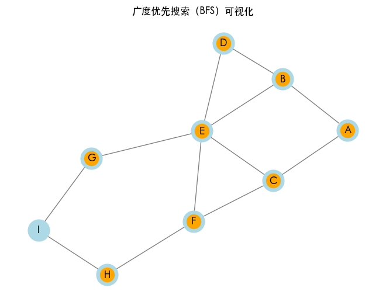
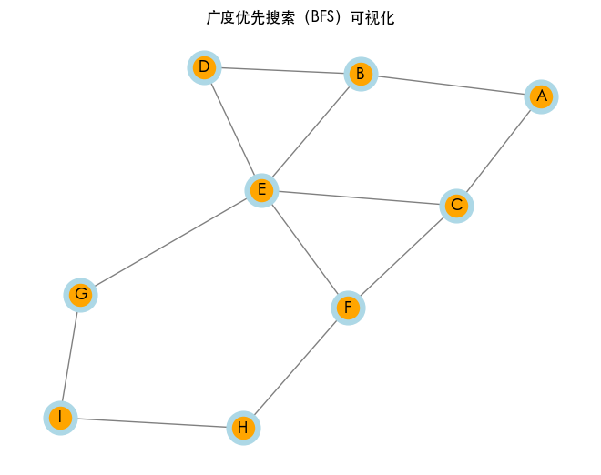

广度优先搜索的结果: `['A', 'B', 'C', 'D', 'E', 'F', 'G', 'H', 'I']`

### 广度优先搜索（BFS）

以下是 BFS 的实现示例：

```python
from collections import deque

class Graph:
    def __init__(self):
        self.graph = {}

    def add_edge(self, u, v):
        if u not in self.graph:
            self.graph[u] = []
        self.graph[u].append(v)

    def bfs(self, start):
        visited = set()
        queue = deque([start])
        visited.add(start)

        while queue:
            vertex = queue.popleft()
            print(vertex)  # 处理节点
            for neighbor in self.graph.get(vertex, []):
                if neighbor not in visited:
                    visited.add(neighbor)
                    queue.append(neighbor)

# 示例
g = Graph()
g.add_edge(0, 1)
g.add_edge(0, 2)
g.add_edge(1, 3)
g.add_edge(1, 4)
g.add_edge(2, 5)

print("广度优先搜索（BFS）结果：")
g.bfs(0)
# 广度优先搜索（BFS）结果：
# 0
# 1
# 2
# 3
# 4
# 5
```

**关键点**

- **队列管理**：使用双端队列（`deque`）提高入队和出队效率。
- **内存消耗**：BFS 可能在大图上消耗更多的内存，以存储队列和访问状态。

### 应用场景

- **最短路径查找**：在无权图中，BFS 可找到从源节点到其他节点的最短路径。
- **网络广播**：在网络中实现信息传播。
- **连通分量的寻找**：用于找出不同的连通区域。

## DFS vs. BFS

深度优先搜索（DFS）和广度优先搜索（BFS）是图遍历的两种基本算法，各自具有独特的特点和应用场景。

### 基本概念对比

DFS 尽可能深地搜索图的分支，直到该分支末端才会进行回溯。可以基于递归或显式栈来实现。沿着一条路径走到尽头，再回退到最近的分支。

BFS 按层次逐层扩展，同一层的节点会在深入下一层之前全部访问。使用队列来实现。首先访问起点的所有直接邻居，然后依次访问每个邻居的邻居，直到所有节点被访问。

### 性能对比

- **时间复杂度**：
  - DFS：$O(V + E) \$，$V$ 是顶点数，$E$ 是边数。
  - BFS：$O(V + E)$，同样的复杂度。
- **空间复杂度**：
  - DFS：最坏情况下为 $O(h)$，$h$ 是树的高度（对于深度较大的图可能会出现栈溢出）。
  - BFS：最坏情况下为 $O(V)$，因为可能需要存储所有节点。

### 场景分析

**深度优先搜索（DFS）**

- **应用领域**：
  - **图的连通性检测**：DFS 可以用来检测图是否连通，或找到图的连通分量。
  - **路径查找**：适合查找从起点到终点的任意路径（不是最短路径）。
  - **拓扑排序**：在有向无环图（DAG）中进行拓扑排序。
  - **拼图游戏**：如八数码问题、迷宫求解等可以使用 DFS 来尝试不同路径。
- **场景示例**：
  - **迷宫探索**：在迷宫中寻找一条通向出口的路径，DFS 可以快速深入复杂的路径。
  - **网络爬虫**：在网页链接中递归访问，直到没有未访问的链接。

**广度优先搜索（BFS）**

- **应用领域**：
  - **最短路径查找**：BFS 可以在无权图中找到从起点到终点的最短路径。
  - **层次遍历**：适合在树或图中进行层次遍历，获取节点的层级信息。
  - **网络广播**：在传播消息或数据时使用 BFS，有助于确保信息的快速扩散。
- **具体示例**：
  - **社交网络分析**：在社交网络中查找用户之间的最短连接。
  - **路径规划**：如地图中的最短路径规划，帮助导航。

### **总结对比**

| 特点       | 深度优先搜索（DFS）      | 广度优先搜索（BFS） |
| ---------- | ------------------------ | ------------------- |
| 主要策略   | 深度优先，不回头         | 层次优先            |
| 实现方式   | 递归或栈                 | 队列                |
| 应用场景   | 路径搜索、拓扑排序、迷宫 | 最短路径、网络传播  |
| 时间复杂度 | $O(V + E)$               | $O(V + E)$          |
| 空间复杂度 | $O(h)$                   | $O(V)$              |

在实际问题中，根据具体需求选择最合适的算法：**如果需求是查找最短路径**，尤其是在无权图中，选择 BFS。**如果需要探索所有可能的路径或解决递归问题**，使用 DFS。选择合适的遍历方法能提高解决问题的效率和有效性。

## 社交网络图遍历

假设在一个社交网络中，我们想要找到从用户 A 出发能到达的所有用户，并且希望探索社交网络的至少一层。

- **输入**：用户 A 的 ID， 一个社交网络图。
- **目标**：获取从用户 A 出发的所有直接联系人和关系。

我们可以针对这个问题分别使用 DFS 和 BFS。

### 使用 DFS

```python
# DFS 实现
g = Graph()
g.add_edge('A', 'B')
g.add_edge('A', 'C')
g.add_edge('B', 'D')
g.add_edge('B', 'E')
g.add_edge('C', 'F')

print("DFS 结果：")
g.dfs('A')
```

输出将是：

```
A
B
D
E
C
F
```

### 使用 BFS

```python
# BFS 实现
g = Graph()
g.add_edge('A', 'B')
g.add_edge('A', 'C')
g.add_edge('B', 'D')
g.add_edge('B', 'E')
g.add_edge('C', 'F')

print("BFS 结果：")
g.bfs('A')
```

输出将是：

```
A
B
C
D
E
F
```

## 结语

通过深度优先搜索（DFS）和广度优先搜索（BFS）两种图遍历方法，我们能够有效地解决多种图论问题。根据不同需求选择正确的遍历方式，当需要寻找图中的所有路径或连通分量时，或处理树结构上的递归问题时，DFS 是一个不错的选择。而当需要寻找最短路径或进行层次遍历时，BFS 是更好的选择。

在实际应用中，评估图的特性和需求，从而选择最合适的遍历方法是极其重要的。此外，应合理管理内存使用，避免栈溢出和内存消耗过高等问题。

---

**PS：感谢每一位志同道合者的阅读，欢迎关注、点赞、评论！**
