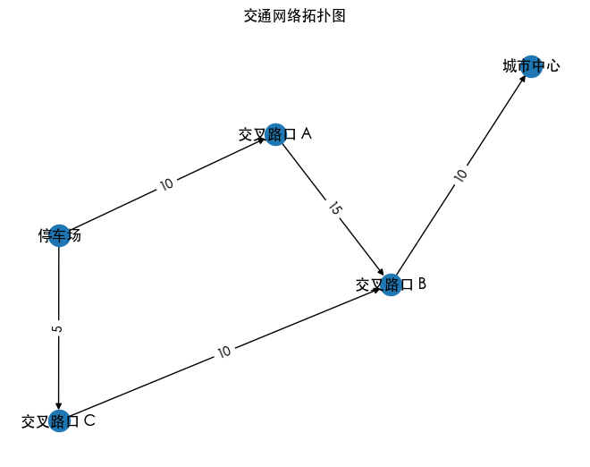

最大流量问题是图论中的一个经典应用，主要涉及在给定的图中，从源点（Source）到汇点（Sink）能够传输的最大流量。这个问题常见于交通流、数据传输等领域。本文将介绍最大流量问题的基本概念，以及如何使用 Ford-Fulkerson 算法和 Edmonds-Karp 算法来解决这一问题。


## 最大流量问题

最大流量问题是网络流理论中的一个经典问题。其目标是在给定的流网络中找出从源点（源）到汇点（汇）所能传输的最大货物流量。流网络通常由以下元素构成：

- **节点**：网络中的点（如源、汇和中间节点）。
- **边**：连接节点的通道，具有一定的容量（即每条边所能承载的最大流量）。
- **流量**：流过边的实际量，必须满足不能超过边的容量。

最大流量问题通常通过流量保守定律（即每个节点的流入量等于流出量）和边的容量约束来建模。

### 示例：交通最大流量

考虑一个城市的交通网络，其中：

- **源点（Source）**：车流从一个大型停车场出发。
- **汇点（Sink）**：车流到达城市中心。
- **中间节点**：主要交叉路口、道路等。
- **边的容量**：每条道路的最大车流量（如每分钟的汽车数量）。

假设有以下的交通路径：

- 源点（停车场）到交叉路口 A：最大流量 10 辆/分钟
- 交叉路口 A 到交叉路口 B：最大流量 15 辆/分钟
- 交叉路口 B 到城市中心：最大流量 10 辆/分钟
- 源点到交叉路口 C：最大流量 5 辆/分钟
- 交叉路口 C 到交叉路口 B：最大流量 10 辆/分钟

### 交通拓扑图

我们将使用 `networkx` 库在 Python 中绘制交通网络的拓扑图。确保你已安装了 `networkx` 和 `matplotlib` 库。

```python
import matplotlib.pyplot as plt
import networkx as nx

# 创建有向图
G = nx.DiGraph()

# 添加节点和边（边的容量作为权重）
edges = [
    ('停车场', '交叉路口 A', 10),
    ('交叉路口 A', '交叉路口 B', 15),
    ('交叉路口 B', '城市中心', 10),
    ('停车场', '交叉路口 C', 5),
    ('交叉路口 C', '交叉路口 B', 10)
]

# 添加边到图中
for u, v, capacity in edges:
    G.add_edge(u, v, capacity=capacity)

# 绘制图形
pos = nx.spring_layout(G)  # 使用 spring 布局
nx.draw(G, pos, with_labels=True, arrows=True)
edge_labels = nx.get_edge_attributes(G, 'capacity')  # 提取边的容量
nx.draw_networkx_edge_labels(G, pos, edge_labels=edge_labels)

plt.title("交通网络拓扑图")
plt.show()
```

上述代码将生成一个可视化的交通网络拓扑图，显示源点、交叉路口和汇点之间的连接，以及每条边的最大流量。



在一个由节点和边组成的有向图中：

- 每个节点代表一个地点。
- 每条边代表地点之间的通路，并且有一个容量（即最大流量）。
- 目标是确定从源点（停车场）到汇点（城市中心）的最大流量。

## 求解思路

最大流量问题的求解思路主要可以从这两个重要概念着手：增广路径和最小切割。

### 增广路径

增广路径是从源点到汇点的路径，在该路径上，每条边都还有剩余流量（即未满的容量）。通过增广路径，可以增加流量。在每次找到增广路径之后，增加路径上最小容量的流量，更新网络中的流量分配。

我们考虑上文的交通流量示例的网络：

- 源点（停车场）到交叉路口 A：最大流量 10 辆/分钟
- 交叉路口 A 到交叉路口 B：最大流量 15 辆/分钟
- 交叉路口 B 到城市中心：最大流量 10 辆/分钟
- 源点到交叉路口 C：最大流量 5 辆/分钟
- 交叉路口 C 到交叉路口 B：最大流量 10 辆/分钟

使用增广路径算法，找出增广路径，通过每个增广路径增加流量，直至无法再找到新的增广路径。

```python
import networkx as nx

# 创建有向图
G = nx.DiGraph()

# 添加边和容量
edges = [
    ('停车场', '交叉路口 A', 10),
    ('交叉路口 A', '交叉路口 B', 15),
    ('交叉路口 B', '城市中心', 10),
    ('停车场', '交叉路口 C', 5),
    ('交叉路口 C', '交叉路口 B', 10)
]
G.add_weighted_edges_from(edges)

def edmonds_karp(G, source, sink):
    flow_value, flow_dict = nx.maximum_flow(G, source, sink)
    return flow_value, flow_dict

max_flow, flow_dict = edmonds_karp(G, '停车场', '城市中心')
print("最大流量：", max_flow)
print("流量分配：", flow_dict)
# 最大流量： 10
# 流量分配： {'停车场': {'交叉路口 A': 5, '交叉路口 C': 5}, '交叉路口 A': {'交叉路口 B': 5}, '交叉路口 B': {'城市中心': 10}, '城市中心': {}, '交叉路口 C': {'交叉路口 B': 5}}
```

### 最小切割

最小切割是将网络中的节点集合划分为两部分（源和汇点分别在不同部分）的一种方法，使得从源到汇的总切割容量最小。根据最大流最小切割定理，一个网络的最大流量等于其最小切割容量。

假设在已经找到最大流量之后，利用最小切割理论来验证流量的上限和流量分配是否可行。

最小切割可以找出流量的上限，并确保在流量分配时没有超过边的容量。

先运行增广路径得到最大流量。利用网络中未被访问的节点进行最小切割。

```python
import networkx as nx

def min_cut(G, source):
    # 运行最大流算法
    max_flow, _ = edmonds_karp(G, source, '城市中心')

    # 计算最小切割
    reachable, _ = nx.single_source_bellman_ford(G.reverse(), source)
    min_cut_edges = []

    for u in reachable:
        for v, capacity in G[u].items():
            if v not in reachable and (u, v) in G.edges:
                min_cut_edges.append((u, v))

    return min_cut_edges

min_cut_edges = min_cut(G, '停车场')
print("最小切割边：", min_cut_edges)
# 最小切割边： [('停车场', '交叉路口 A'), ('停车场', '交叉路口 C')]
```

### 过程推演

**初始设置**

- 源点到交叉路口的流量：
  - 从停车场到交叉路口 A 10 辆/分钟
  - 从停车场到交叉路口 C 5 辆/分钟
- 交叉路口 A 到交叉路口 B 15 辆/分钟
- 交叉路口 C 到交叉路口 B 10 辆/分钟
- 交叉路口 B 到城市中心 10 辆/分钟

**首次增广路径搜索**

- 增广路径可能为：`停车场 -> 交叉路口 A -> 交叉路口 B -> 城市中心`，流量为 10。
- 增广路径：`停车场 -> 交叉路口 C -> 交叉路口 B -> 城市中心`，流量为 5。

**当前流量分配**

- `停车场 -> 交叉路口 A -> 交叉路口 B -> 城市中心` = 10
- `停车场 -> 交叉路口 C -> 交叉路口 B -> 城市中心` = 5

总流量 = 15 辆/分钟。

**最小切割的验证**

通过以上流量分配，可以计算出流量的上限与切割边，切割边为 `('停车场', '交叉路口 A')` 和 `('停车场', '交叉路口 C')`。

通过以上分析与实现，可以有效地利用增广路径与最小切割理论，系统化地解决最大流量问题，并在此过程中推演出具体的结果。

## Ford-Fulkerson 算法

使用 **Ford-Fulkerson 算法** 解决最大流量问题的基本思路是通过寻找增广路径来不断增加流量，直到没有更多增广路径为止。

### Ford-Fulkerson 算法示例

以下是使用 Python 实现 Ford-Fulkerson 算法来解决上述交通最大流量问题的代码示例。

```python
import networkx as nx
from collections import defaultdict

# 创建有向图
G = nx.DiGraph()

# 添加边和容量
edges = [
    ('停车场', '交叉路口 A', 10),
    ('停车场', '交叉路口 C', 5),
    ('交叉路口 A', '交叉路口 B', 15),
    ('交叉路口 C', '交叉路口 B', 10),
    ('交叉路口 B', '城市中心', 10)
]

# 添加边到图
for u, v, capacity in edges:
    G.add_edge(u, v, capacity=capacity)

def ford_fulkerson(G, source, sink):
    # 初始化
    max_flow = 0
    flow_dict = defaultdict(int)

    def bfs(s, t):
        # 用于寻找增广路径的 BFS
        visited = set()
        queue = [(s, float('Inf'))]  # 初始流量为无限大
        paths = {s: []}

        while queue:
            u, flow = queue.pop(0)
            visited.add(u)

            for v in G[u]:
                residual_capacity = G[u][v]['capacity'] - flow_dict[(u, v)]
                if v not in visited and residual_capacity > 0:  # 找到增广路径
                    paths[v] = paths[u] + [(u, v)]
                    new_flow = min(flow, residual_capacity)
                    if v == t:  # 找到汇点
                        return new_flow, paths[v]
                    queue.append((v, new_flow))

        return 0, None

    while True:
        flow, path = bfs(source, sink)
        if flow == 0:  # 无增广路径
            break

        max_flow += flow  # 更新最大流
        for u, v in path:
            flow_dict[(u, v)] += flow  # 更新流量
            flow_dict[(v, u)] -= flow  # 更新反向流量

    return max_flow

# 计算最大流量
max_flow_value = ford_fulkerson(G, '停车场', '城市中心')
print("最大流量：", max_flow_value)
# 最大流量： 10
```

该代码将输出最大流量，反映出所能承载的最大交通流量。

### Ford-Fulkerson 算法步骤

1. **初始化流量**：所有边的初始流量为 0。
2. **构建残量图**：每条边都有一个容量和一个反向边，用于表示剩余流量。
3. **寻找增广路径**：使用 DFS 或 BFS 方法在残量图中寻找从源点到汇点的增广路径。
4. **更新流量**：在找到的增广路径上，确定可以增加的流量（最小容量），更新流量和残量图。
5. **重复**：重复寻找增广路径和更新流量，直到没有增广路径为止。

通过 Ford-Fulkerson 算法，可以有效地找到交通网络中的最大流量。此方法的优势在于直观易懂，适用于小到中等规模的网络。

## Edmonds-Karp 算法

对于大型网络，通常会使用 Edmonds-Karp 算法（Ford-Fulkerson 的一种实现，通过 BFS 寻找增广路径），以提高算法的效率。它具有较好的时间复杂性，适合用于解决通常规模的流量网络问题。

### Edmonds-Karp 算法示例

下面是如何使用 Edmonds-Karp 算法来解决之前提到的交通最大流量问题的代码示例。

```python
import networkx as nx
from collections import deque

# 创建有向图
G = nx.DiGraph()

# 添加边和容量
edges = [
    ('停车场', '交叉路口 A', 10),
    ('停车场', '交叉路口 C', 5),
    ('交叉路口 A', '交叉路口 B', 15),
    ('交叉路口 C', '交叉路口 B', 10),
    ('交叉路口 B', '城市中心', 10)
]

# 添加边到图
for u, v, capacity in edges:
    G.add_edge(u, v, capacity=capacity)

def edmonds_karp(G, source, sink):
    max_flow = 0
    flow_dict = {edge: 0 for edge in G.edges()}  # 初始流量为0

    while True:
        # 使用 BFS 寻找增广路径
        queue = deque([source])
        paths = {source: []}
        if source == sink:
            break

        while queue:
            u = queue.popleft()

            for v in G[u]:
                # 计算剩余容量
                residual_capacity = G[u][v]['capacity'] - flow_dict[(u, v)]

                if v not in paths and residual_capacity > 0:  # 找到增广路径
                    paths[v] = paths[u] + [(u, v)]
                    if v == sink:  # 找到汇点
                        break
                    queue.append(v)

        # 如果没有找到增广路径，退出
        if sink not in paths:
            break

        # 确定增广流量
        flow = min(G[u][v]['capacity'] - flow_dict[(u, v)] for u, v in paths[v])

        # 更新流量
        for u, v in paths[v]:
            flow_dict[(u, v)] += flow  # 更新正向流量
            flow_dict[(v, u)] -= flow  # 更新反向流量

        max_flow += flow  # 更新总流量

    return max_flow

# 计算最大流量
max_flow_value = edmonds_karp(G, '停车场', '城市中心')
print("最大流量：", max_flow_value)
# 最大流量： 10
```

### Edmonds-Karp 算法步骤

1. **初始化流量**：所有边的初始流量设为 0。
2. **构建残量图**：每条边都有其容量和对应的反向边。
3. **寻找增广路径**：使用 BFS 在残量图中从源节点找到汇节点的增广路径。
4. **更新流量**：在找到的增广路径上，确定可增流量（路径中最小的剩余容量），并更新流量分配与残量图。
5. **重复以上步骤**：重复寻找增广路径和更新流量，直到没有增广路径为止。

Edmonds-Karp 算法通过广度优先搜索的方式确保了增广路径的最优性，并且相较于原始的 Ford-Fulkerson 方法在时间上更加高效，适用于更大规模的网络问题。

## 结语

最大流量问题是图论中的一个重要应用，涉及到网络流的最大传输量。通过增广路径和最小切割的理论，可以有效地解决最大流量问题。Ford-Fulkerson 算法和 Edmonds-Karp 算法是两种常用的解决方法，分别通过深度优先搜索和广度优先搜索来寻找增广路径，从而找到最大流量。

---

**PS：感谢每一位志同道合者的阅读，欢迎关注、点赞、评论！**
