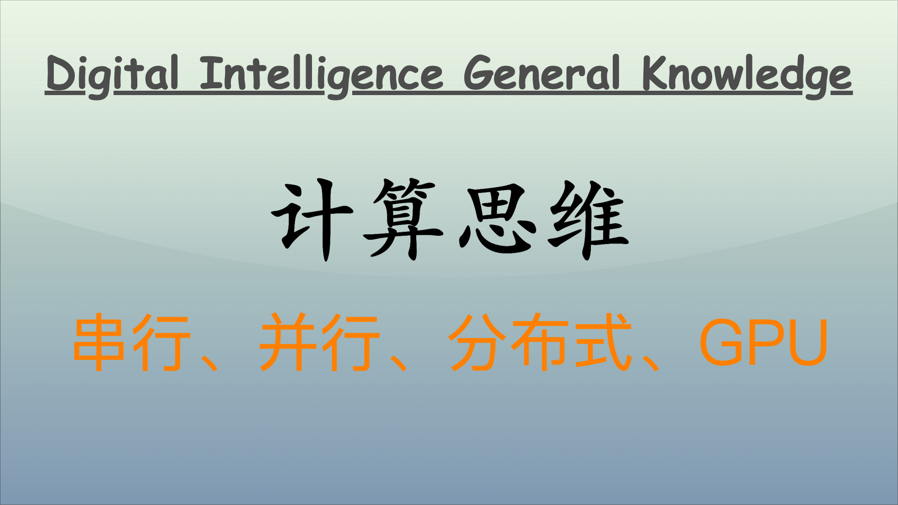

## 引言

分布式云计算、GPU 批计算以及串行和并行计算是现代计算架构中的重要概念。它们各自代表了不同的计算模式和架构设计，为解决各种规模和复杂度的问题提供了不同的解决方案。下面将从实现思路的角度从浅入深，一路深入挖掘这些概念的精髓，探讨它们的特点与适用场景。



## 串行计算

串行计算是指计算任务按顺序依次执行，后续任务必须等待前一个任务完成。常用语小规模计算任务、线性问题和算法，如某些排序算法和基本数学运算。

- **简单易懂**：代码逻辑清晰，易于编写和调试。
- **占用资源少**：对内存和存储的需求较低。
- **执行效率低**：对于大型数据集或复杂计算任务，效率较低。

### 问题示例

问题：从一个包含 N 个元素的未排序序列中找到最大的 K 个元素。

- **排序法**：将序列进行排序，然后选择最后 K 个元素。时间复杂度：$O(N \log{N})$，取决于排序算法。
- **最小堆法**：使用最小堆存储 K 个最大元素，遍历序列中的每个元素：如果当前元素比堆顶元素大，则替换堆顶元素，并保持堆的大小为 K。时间复杂度：$O(N \log{K})$。
- **快速选择（Quickselect）**：基于快速排序的思想，通过划分快速找到第 K 大元素，并在此基础上找到 K 个最大元素。时间复杂度：O(N) 平均情况下，但最坏情况是 O(N^2)。

### 问题求解

针对 K 可能相对较小的场景，采用 **最小堆法** 是一种高效且直观的选择。它在处理大数组时的性能表现相较于简单的排序法有显著的提升，尤其是当 K 较小于 N 时。

下面是使用最小堆法来寻找列表中最大 K 个元素的实现代码。

```python
import heapq

def find_k_largest_elements(arr, K):
    # 使用最小堆来存储最大的 K 个元素
    return heapq.nlargest(K, arr)

# 测试示例
if __name__ == "__main__":
    sequence = [3, 1, 4, 1, 5, 9, 2, 6, 5, 3, 5]
    K = 3
    largest_k_elements = find_k_largest_elements(sequence, K)
    print(f"The largest {K} elements are: {largest_k_elements}")

# The largest 3 elements are: [9, 6, 5]
```

- `heapq.nlargest(K, arr)`：使用 Python 的 `heapq` 模块的 `nlargest` 方法，可以高效地找到最大的 K 个元素，该方法内部使用了最小堆的原理，有效性得到保证。
- 通过调整 `sequence` 和 `K` 的值来验证结果。

这个实现有效且高效，尤其适合用于需要从大数组中提取最大元素的场景。

## 并行计算

并行计算是指在同一时间内同时执行多个计算任务。通常将任务划分为子任务，在多核处理器或集群中并行处理。适用于大规模计算任务，如科学计算、图像处理、数据分析、大数据处理和机器学习模型训练。

- **提高效率**：通过多线程或多处理器并行执行任务，显著提高计算效率。
- **复杂性增加**：需要对任务进行恰当的划分和协调，增加了编程和调试的复杂性。
- **适用范围广**：适合于复杂计算、图像处理、物理模拟等任务。

### 问题示例

我们拿上文串行计算中的相同问题来演示并行计算。要并行处理寻找一个未排序的序列中最大 K 个元素的任务，可以将整个序列分割为多个子序列，分别处理这些子序列以找到局部的最大数，然后合并这些结果。这个方法在大数据集上能够有效利用多核处理器的计算能力。

**求解思路**

1. **分割任务**：将数组分成多个部分（子数组），每个部分由一个独立的线程或进程处理。
2. **找到子数组中的最大元素**：每个子数组并行找到其最大的 K 个元素。
3. **合并结果**：将所有子数组的结果合并，最终使用最小堆选取这些结果中的 K 个最大值。

### 问题求解

下面是利用 concurrent.futures.ThreadPoolExecutor 基于上述思路的完整代码：

```python
import heapq
from concurrent.futures import ThreadPoolExecutor

def find_k_largest_in_subarray(subarray, K):
    """找到子数组中的最大 K 个元素"""
    return heapq.nlargest(K, subarray)

def find_k_largest_elements(arr, K, num_threads):
    """找到数组中最大的 K 个元素，通过并行处理子数组实现"""
    # 将数组分为多个子数组
    subarray_size = len(arr) // num_threads
    subarrays = [arr[i * subarray_size:(i + 1) * subarray_size] for i in range(num_threads - 1)]
    subarrays.append(arr[(num_threads - 1) * subarray_size:])  # 最后一个子数组

    # 创建线程池并并行处理子数组
    results = []
    with ThreadPoolExecutor(max_workers=num_threads) as executor:
        futures = {executor.submit(find_k_largest_in_subarray, sub, K): sub for sub in subarrays}
        for future in futures:
            results.append(future.result())

    # 合并所有子数组的结果，并从中找出最大的 K 个元素
    merged_result = []
    for res in results:
        merged_result.extend(res)

    return heapq.nlargest(K, merged_result)

# 测试示例
if __name__ == "__main__":
    sequence = [3, 1, 4, 1, 5, 9, 2, 6, 5, 3, 5]
    K = 3
    num_threads = 2  # 可以根据 CPU 核心数进行调整
    largest_k_elements = find_k_largest_elements(sequence, K, num_threads)
    print(f"The largest {K} elements are: {largest_k_elements}")

# The largest 3 elements are: [9, 6, 5]
```

- **`find_k_largest_in_subarray`**：处理每个子数组，找到其中的 K 个最大元素，使用 `heapq.nlargest()` 实现。
- **`find_k_largest_elements`**：
  - 计算每个子数组的大小并划分；
  - 使用 `ThreadPoolExecutor` 创建线程池并并行处理每个子数组；
  - 收集每个线程的结果。
- **合并结果**：使用 `heapq.nlargest()` 从所有子数组中获取 K 个最大的元素。

在大数据集的情况下，通过任务分割和并行处理，充分利用多核处理器的优势，可以提升寻找最大 K 个元素的效率。

多线程适合处理 I/O 密集型的任务，但在 CPU 密集型任务中效果有限，因为 Python 的全局解释器锁（GIL）限制了多个线程的并发执行。

## 分布式云计算

分布式计算是指计算任务分散在多个地理位置分开的计算节点上执行。每个节点可能是计算机、服务器或数据中心，它们通过网络连接。适用于大规模网络应用、数据存储与处理，如云计算平台、社交网络、在线游戏，大数据框架（Hadoop、Spark）和分布式数据库等。

- **扩展性**：可以通过增加更多节点扩展计算能力。
- **容错性**：节点失败通常不会导致整个系统崩溃。
- **复杂性高**：需要处理节点间的通信、数据一致性和负载均衡等问题。

### 问题示例

假定有一个非常巨大的数组，数组大到在一台服务器下保存不下，需要保存在 1000 台服务器上，如何找到数组的中值？

**求解思路**

1. **选择枢值**：从整个数据集中随机选择一个值 `v` 作为枢值，将其分发给所有服务器。
2. **分区**：每台服务器根据该枢值，将本地存储的数据分为两个部分：一部分包含小于或等于 `v` 的元素，另一部分包含大于 `v` 的元素。
3. **计数**：每台服务器计算小于或等于 `v` 的元素数量 $m_i$ 和大于 `v` 的元素数量 $n_i$。
4. **汇总**：将所有服务器的计数结果发送到协调服务器，以计算全局的 `m` （总数小于等于 `v` 的元素）和 `n`（总数大于 `v` 的元素）。
5. **调整枢值**：根据 `m` 和 `n` 的关系决定下一步的处理。如果 `m` 大于总元素的中间值，说明当前中值在 `v` 的左侧，此时选择右侧的元素进行下一轮计算，否则反之。
6. **迭代**：重复以上步骤，直到最终确定中值。

以上求解方式是一种简单的分布式中值算法，适用于分布在不同机器上的大规模数据集的中值查找问题。

### 问题求解

以下是基于上述算法的 Python 实现。在这个例子中，我们会模拟 1000 台服务器并将数据分块进行计算。

```python
import random
import numpy as np
from concurrent.futures import ThreadPoolExecutor, as_completed

def count_less_equal_and_greater(data, pivot):
    """根据枢值对数据进行分区并计数"""
    less_equal_count = sum(x <= pivot for x in data)
    greater_count = sum(x > pivot for x in data)
    return less_equal_count, greater_count

def distributed_median(data, num_servers=1000):
    # 将数据划分到多个服务器上
    data_chunks = np.array_split(data, num_servers)

    # 初始设定
    n = len(data)
    target_count = n // 2  # 寻找中值的目标索引
    pivot = random.choice(data)  # 随机选择初始枢值

    while True:
        # 使用线程池并行处理每个服务器的计数
        with ThreadPoolExecutor(max_workers=num_servers) as executor:
            futures = {executor.submit(count_less_equal_and_greater, chunk, pivot): chunk for chunk in data_chunks}
            results = [future.result() for future in as_completed(futures)]

        # 汇总结果
        total_less_equal = sum(r[0] for r in results)
        total_greater = sum(r[1] for r in results)

        if total_less_equal > target_count:  # 中值在左侧
            # 选择新的枢值：在小于或等于 pivot 的数中选取
            pivot = random.choice([x for chunk in data_chunks for x in chunk if x <= pivot])
        else:  # 中值在右侧
            # 选择新的枢值：在大于 pivot 的数中选取
            pivot = random.choice([x for chunk in data_chunks for x in chunk if x > pivot])

        # 检查是否找到中值
        if total_less_equal == target_count or total_less_equal == target_count + 1:
            return pivot

# 测试示例
if __name__ == "__main__":
    # 生成一个大的随机数组
    data = np.random.randint(0, 1000000, size=10000000)  # 1000 万个元素
    median = distributed_median(data)
    print(f"The estimated median is: {median}")
```

- **数据分块**：使用 `np.array_split` 将数据划分为多个部分，以模拟 1000 个服务器的处理。
- **计数函数**：`count_less_equal_and_greater` 函数根据当前选择的 `pivot` 对数据进行分区计数。
- **分布式中值计算**：
  - 在循环中，随机选择枢值并在所有服务器上并行执行计数。
  - 汇总所有服务器的计数，根据 `m` 和 `n` 的关系调整 `pivot`。
  - 继续迭代直到找到中值。
- **最终输出**：随机生成一个大数组，调用并输出中值。

在每次迭代时，我们可以考虑如何记住并利用上一轮的统计结果，以减少重复计算的次数，提高效率。

通过分布式中值算法，我们能够从超大数组中找出中值，即使数据存储在多个服务器上。这种方法在分布式计算环境下极具实际应用价值，尤其是在处理大规模数据时。

## GPU 批计算

GPU 计算是将图形处理单元（GPU）用于一般计算任务，特别是在并行计算中具有优势。适用深度学习模型训练和推理、图像和视频处理、科学模拟和计算等领域。

- **高并发处理能力**：GPU 的大量核心能同时处理数千个线程，适合处理数据并行的任务，例如矩阵运算和深度学习等计算密集型任务。
- **吞吐量**：对于大规模数据集，GPU 可以实现显著的吞吐量提升，处理速度比同一任务在 CPU 上执行时快数十倍。
- **适合处理大型数据集**：在深度学习、图像处理等领域，GPU 批处理能够在较短时间内处理大量数据，动态调整权重和模型参数。
- **适合矩阵运算**：特别在深度学习、图像处理和科学计算中，GPU 能极大提高计算效率。
- **编程复杂性**：需要了解特定的编程模型和工具（如 CUDA、OpenCL）来有效利用 GPU。

### CPU vs. GPU

- **CPU（中央处理器）**：适合处理复杂的控制逻辑和许多并发任务。通常具有较少的核心（如 4 到 16 个），但每个核心的计算能力非常强，能够高效处理低延迟任务。
- **GPU（图形处理单元）**：设计用于高并发计算，具有成百上千个小核心，可以同时处理大量相同或类似的任务，因此特别适合于批处理和数据并行计算。

### 问题示例

以下是求解矩阵乘法的对比示例。我们可以看到在 CPU 和 GPU 上执行矩阵乘法的速度差异。

我们可以使用 NumPy 进行 CPU 的矩阵乘法，使用 `CuPy` 来进行 GPU 的矩阵乘法。请确保已安装这两个库。如果在运行 GPU 代码时，请确保环境支持 CUDA。

```python
import numpy as np
import cupy as cp
import time

# 矩阵大小
N = 1000

# 创建随机矩阵
A = np.random.rand(N, N).astype(np.float32)
B = np.random.rand(N, N).astype(np.float32)

# CPU 矩阵乘法
start_time = time.time()
C_cpu = np.dot(A, B)
cpu_time = time.time() - start_time

# GPU 矩阵乘法
A_gpu = cp.asarray(A)  # 将 NumPy 数组传到 GPU
B_gpu = cp.asarray(B)
start_time = time.time()
C_gpu = cp.dot(A_gpu, B_gpu)
cp_time = time.time() - start_time

# 从 GPU 获取结果
C_gpu_result = cp.asnumpy(C_gpu)

# 打印结果
print(f"CPU矩阵乘法耗时: {cpu_time:.6f} 秒")
print(f"GPU矩阵乘法耗时: {cp_time:.6f} 秒")
# CPU矩阵乘法耗时: 0.510122 秒
# GPU矩阵乘法耗时: 0.045567 秒
```

- **矩阵生成**：使用 NumPy 创建两个随机矩阵 A 和 B，大小为 1000x1000。
- **CPU 矩阵乘法**：使用 `np.dot()` 计算 CPU 上的矩阵乘法，记录执行时间。
- **GPU 矩阵乘法**：使用 CuPy 将 NumPy 数组转为 GPU 数据。使用 `cp.dot()` 计算 GPU 上的矩阵乘法，记录时间。

通过这个示例，我们可以看出 GPU 在处理大规模数据集（例如矩阵乘法）时相较于 CPU 的显著优势。其并行计算能力使得它在处理数据密集型任务时具有更高的性能和效率。在深度学习、科学计算和大数据分析等领域，GPU 批处理已成为主流。

## 总结与比较

| 特性             | 串行计算   | 并行计算   | 分布式计算 | GPU 计算           |
| ---------------- | ---------- | ---------- | ---------- | ------------------ |
| **执行方式**     | 顺序       | 同时       | 多节点同时 | 批处理（同时）     |
| **复杂性**       | 低         | 中         | 高         | 高                 |
| **资源利用效率** | 低         | 高         | 高         | 高（对于并行任务） |
| **扩展性**       | 低         | 中         | 高         | 中（依赖于设备）   |
| **适用场景**     | 小规模任务 | 大规模任务 | 海量数据   | 深度学习和计算     |

**考虑因素**

- **任务规模与类型**：了解任务的规模和性质，选择最合适的计算模式。
- **资源可用性**：考虑可用的计算资源（如 CPU、GPU、集群等）。
- **开发复杂性**：根据开发和维护的复杂程度，选择适合团队的技术栈。

以上是对串行、并行、分布式云计算以及 GPU 计算的探讨。每种计算模式都有其独特之处和适用场景，选择合适的计算方式有助于提高计算效率和降低开发成本。

## 结语

计算效率是计算机科学中的重要主题，不同的计算模式和架构设计适用于不同的场景。串行计算适用于小规模任务，而并行计算适用于大规模任务。分布式云计算适用于海量数据处理，GPU 批处理适用于深度学习和计算密集型任务。掌控每一种计算架构与思维方式是提高计算效率和性能的关键，也是计算机工程师的必备技能。在实际应用中，根据任务的特点和需求，选择合适的计算模式和架构设计。

---

**PS：感谢每一位志同道合者的阅读，欢迎关注、点赞、评论！**
