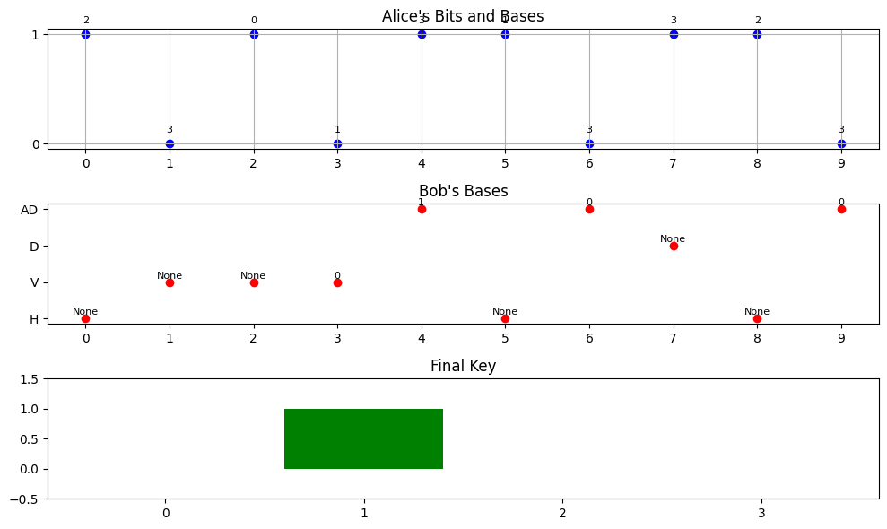

## 引言

如果你只有一杆 100 年前的毛瑟枪，能够打中目标只能靠天分，如果你有一杆最先进的狙击步枪，有瞄准镜帮助，打中目标就容易很多。计算机算法的精髓，就是计算机从业者的武器。 -- 吴军《计算之魂》

有很多经典而有趣的问题或算法，它们计算之机巧，应用之广泛，类比之深远，皆值得我们去深思和不断探究。今天带来的是其中的**25 人赛跑**与**BB84 量子密钥分发**。


## 25 人赛跑

25 人赛跑，选前三强，每场 5 人，最少需要几场比赛？

### 比赛过程

- `第 1 轮`：5 场，将 25 人分为 5 组（每组 5 人），进行 5 场比赛，决出各组的第 1 到 5 名。
- `第 2 轮`：1 场，令 5 组的第 1 名决出前 1 到 3 名，其中第 1 名是 25 人的冠军。
- `第 3 轮`：1 场，令第 2 轮中的第 1 名所在组的第 2、3 名、第 2 轮中的第 2 名所在组的第 2 名、第 2 轮的第 2、3 名（共 5 人）决出第 1、2 名，即为 25 人的亚军与季军。

共需要 7 场比赛。

### 模拟演示

我们用 Python 生产每一轮比赛的过程与结果图像，模拟这一比赛过程。

```python
import matplotlib.pyplot as plt
import numpy as np

# 随机种子，以便结果可重现
np.random.seed(0)

# 比赛选手
num_players = 25
players = [f"Player {i + 1}" for i in range(num_players)]

# 生成随机成绩
scores = np.random.randint(1, 100, size=num_players)  # 生成 25 个随机成绩

# 生成第一轮比赛结果
round_1_results = {}
for i in range(5):
    group_scores = scores[i * 5: (i + 1) * 5]
    group = players[i * 5: (i + 1) * 5]
    sorted_indices = np.argsort(group_scores)  # 根据成绩排序
    round_1_results[f"Group {i + 1}"] = [(group[idx], group_scores[idx]) for idx in sorted_indices]

# 第二轮决出各组第一名
winners_round_1 = [results[0][0] for results in round_1_results.values()]  # 各组第一名
winner_scores = [scores[players.index(winner)] for winner in winners_round_1]
sorted_indices = np.argsort(winner_scores)
finalists = [(winners_round_1[idx], winner_scores[idx]) for idx in sorted_indices]

# 第三轮决定真正的亚军和季军
first_group = round_1_results[f"Group {winners_round_1.index(finalists[0][0]) + 1}"]
second_group = round_1_results[f"Group {winners_round_1.index(finalists[1][0]) + 1}"]
third_place_candidates = [first_group[1], first_group[2], second_group[1]]
third_place_scores = [scores[players.index(candidate[0])] for candidate in third_place_candidates]
third_sorted_indices = np.argsort(third_place_scores)
third_place_winner = third_place_candidates[third_sorted_indices[0]]

# 绘制比赛过程
fig, ax = plt.subplots(3, 1, figsize=(12, 15))

# 第一轮
ax[0].barh(list(round_1_results.keys()), [1] * 5, color='skyblue')
for group, results in round_1_results.items():
    players_result = ', '.join([f"{player[0]} (Score: {player[1]})" for player in results])
    ax[0].text(1, list(round_1_results.keys()).index(group), players_result)

ax[0].set_title('Round 1 Results (5 Groups of 5 Players)')
ax[0].set_xlim(0, 2)
ax[0].axis('off')

# 第二轮
finalist_names = [player[0] for player in finalists]  #获取选手名称
ax[1].barh(finalist_names, [1] * len(finalists), color='orange')
for idx, (player, score) in enumerate(finalists):
    ax[1].text(1, idx, f'{player} (Score: {score})' + (' - Champion' if idx == 0 else ''))

ax[1].set_title('Round 2 Results (Finalists)')
ax[1].set_xlim(0, 2)
ax[1].axis('off')

# 第三轮
third_place_names = [candidate[0] for candidate in third_place_candidates]  # 获取第三轮候选选手名称
ax[2].barh(third_place_names, [1] * len(third_place_candidates), color='lightgreen')
for idx, candidate in enumerate(third_place_candidates):
    ax[2].text(1, idx, f'{candidate[0]} (Score: {scores[players.index(candidate[0])]})')

ax[2].text(0, 0, f'Second place: {finalists[1][0]} (Score: {finalists[1][1]})')
ax[2].text(0, 1, f'Third place: {third_place_winner[0]}')

ax[2].set_title('Round 3 Results (Final Rankings)')
ax[2].set_xlim(0, 2)
ax[2].axis('off')

# 显示总冠军的信息
plt.figtext(0.5, 0.02, f'Champion: {finalists[0][0]}, Runner-up: {finalists[1][0]}, Third Place: {third_place_winner[0]}', ha='center', fontsize=12)

plt.tight_layout()
plt.show()
```


- **选手创建**：创建 25 个参赛选手的列表。
- **第一轮比赛**：随机将选手分为 5 组，每组 5 人，并显示他们的名次。
- **第二轮比赛**：从第一轮中选出每组的第一名，并在图中显示。
- **第三轮比赛**：根据第二轮的结果确定前两名所在组的其他选手，并进行比赛。
- **最终显示**：在每个比赛阶段中显示选手名次，并显示冠军、亚军和季军。

思考：提高效率的方式是少做事情，低水平的、大量重复的事情做的再多，产出其实也不高。

## BB84 量子密钥分发（量子通信）

BB84 量子密钥分发是一种量子通信协议，由查尔斯·贝内特（Charles Bennett）和阿尔贝特·基尔（Gilles Brassard）于 1984 年提出。它允许两个用户（通常称为亚里士多德和鲍勃）安全地共享加密密钥，即使存在潜在的窃听者。

- **量子比特（Qubit）**：BB84 协议基于量子比特的特性。量子比特可以表示 0 和 1 的叠加态，具有量子力学的不可克隆性和测量后的坍缩特性。
- **编码和测量**：亚里士多德随机选择一系列比特（0 或 1），并使用两种基（水平/垂直和对角线基）进行编码。在测量时，鲍勃随机选择基进行测量，并将其结果发送给亚里士多德。
- **基的选择**：亚里士多德和鲍勃在量子比特的传输后会公开他们选择的基信息。仅对基匹配的测量结果进行保留，从而生成共享密钥。
- **窃听检测**：由于量子测量的不可克隆性，如果倾听者（艾娃）试图窃听，任何对量子比特的测量都会改变比特的状态，导致错误率的增加。亚里士多德和鲍勃可以通过比较部分比特来检测可能的窃听。

### 协议模拟

我们先实现 BB84 协议的核心部分，包括量子比特的生成、编码、测量以及关键的比特处理。

```python
import numpy as np
import random

# 定义基
HORIZONTAL = 0
VERTICAL = 1
DIAGONAL = 2
ANTI_DIAGONAL = 3

# 定义类用于BB84协议
class BB84:
    def __init__(self, n):
        self.n = n  # 量子比特数
        self.alice_bits = np.random.randint(0, 2, n)  # 亚里士多德的比特
        self.alice_bases = np.random.choice([HORIZONTAL, VERTICAL, DIAGONAL, ANTI_DIAGONAL], n)  # 亚里士多德的基
        self.bob_bases = np.random.choice([HORIZONTAL, VERTICAL, DIAGONAL, ANTI_DIAGONAL], n)  # 鲍勃的基

    def simulate_transmission(self):
        self.bob_bits = []
        for i in range(self.n):
            # 判断基是否匹配，只保留匹配的比特
            if self.bob_bases[i] == self.alice_bases[i]:
                self.bob_bits.append(self.alice_bits[i])
            else:
                self.bob_bits.append(None)  # 收到时丢弃

    def extract_key(self):
        self.key = [self.bob_bits[i] for i in range(self.n) if self.bob_bits[i] is not None]
        return self.key

# 模拟 BB84 协议
bb84 = BB84(n=10)
bb84.simulate_transmission()
final_key = bb84.extract_key()
print("Alice's Bits:    ", bb84.alice_bits)
print("Bob's Bases:     ", bb84.bob_bases)
print("Alice's Bases:   ", bb84.alice_bases)
print("Bob's Bits:      ", bb84.bob_bits)
print("Final Key:       ", final_key)
```

```
Alice's Bits:     [1 0 1 0 1 1 0 1 1 0]
Bob's Bases:      [0 1 1 1 3 0 3 2 0 3]
Alice's Bases:    [2 3 0 1 3 1 3 3 2 3]
Bob's Bits:       [None, None, None, np.int64(0), np.int64(1), None, np.int64(0), None, None, np.int64(0)]
Final Key:        [np.int64(0), np.int64(1), np.int64(0), np.int64(0)]
```

### 图形化演示 BB84 协议过程

接下来，我们将生成图形化示例，以表示 BB84 协议的关键过程。

```python
import matplotlib.pyplot as plt

def plot_bb84(alice_bits, alice_bases, bob_bases, bob_bits):
    plt.figure(figsize=(10, 6))

    # 亚里士多德的比特
    plt.subplot(311)
    plt.scatter(range(len(alice_bits)), alice_bits, c='blue', label="Alice's Bits")
    plt.yticks([0, 1], ['0', '1'])
    plt.title("Alice's Bits and Bases")
    plt.xticks(range(len(alice_bits)))
    for i in range(len(alice_bases)):
        plt.text(i, alice_bits[i]+0.1, f'{alice_bases[i]}', fontsize=8, ha='center')
    plt.grid()

    # 鲍勃的基和比特
    plt.subplot(312)
    plt.scatter(range(len(bob_bases)), bob_bases, c='red', label="Bob's Bases")
    plt.yticks([HORIZONTAL, VERTICAL, DIAGONAL, ANTI_DIAGONAL], ['H', 'V', 'D', 'AD'])
    plt.title("Bob's Bases")
    plt.xticks(range(len(bob_bases)))
    for i in range(len(bob_bases)):
        plt.text(i, bob_bases[i]+0.1, f'{bob_bits[i]}', fontsize=8, ha='center')

    # 最终密钥
    plt.subplot(313)
    plt.bar(range(len(final_key)), final_key, color='green', label="Final Key")
    plt.title("Final Key")
    plt.ylim(-0.5, 1.5)
    plt.xticks(range(len(final_key)))

    plt.tight_layout()
    plt.show()

# 绘制图形
plot_bb84(bb84.alice_bits, bb84.alice_bases, bb84.bob_bases, bb84.bob_bits)
```



### BB84 协议优势

- **安全性**：使用量子力学原理保证密钥的安全性，无法通过经典计算手段破解，具有极强的安全性。
- **窃听检测**：如有窃听者，量子测量会改变状态，使得亚里士多德和鲍勃能够检测到潜在的窃听者。
- **简单性**：相对于其他量子密钥分发协议，BB84 结构简单，易于理解和实现。

BB84 是量子密钥分发领域的一个基础协议，展示了量子力学在信息安全中的应用，推动了量子通信技术的发展。

### 应用场景

- **安全通信**：用于确保信息传输中的密钥交换，防止机密数据被窃取。
- **金融服务**：保障电子交易的安全性，防止信息篡改和盗取。
- **电子投票**：确保投票数据在传输过程中的安全性和机密性。
- **数据存储**：在云存储中，对敏感信息进行加密访问，确保数据保护。

BB84 协议展示了量子技术在信息安全中的巨大潜力，并为未来的通信系统奠定了基础。

## 结语

站在系统的角度来考虑所有应用问题，沿着正确的方向，经过不断递进的联系，见识逾大，思考逾深，才能完成一次质的飞跃。

---

**PS：感谢每一位志同道合者的阅读，欢迎关注、点赞、评论！**
