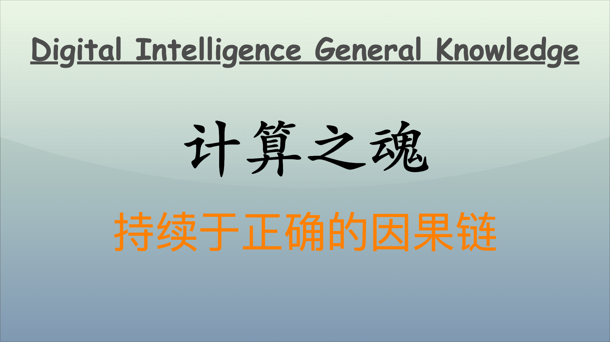
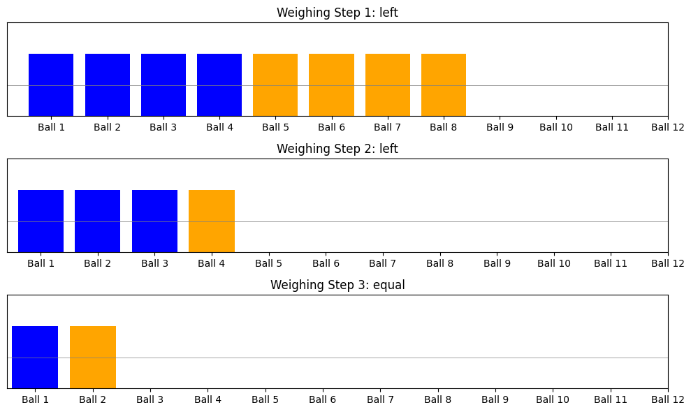

## 引言

如果你只有一杆 100 年前的毛瑟枪，能够打中目标只能靠天分，如果你有一杆最先进的狙击步枪，有瞄准镜帮助，打中目标就容易很多。计算机算法的精髓，就是计算机从业者的武器。 -- 吴军《计算之魂》

有很多经典而有趣的问题或算法，它们计算之机巧，应用之广泛，类比之深远，皆值得我们去深思和不断探究。今天带来的是其中的**12 球问题**与**和为 K 的字数组问题**。



## 12 球问题

**12 球问题**（也称为 12 球称重问题）是经典的逻辑推理和算法问题。给定 12 个相似的球，其中有一个球的重量不同（可能更重也可能更轻），目标是通过最少的称重来确定不一样的球以及它是更重还是更轻。

**称重方法**：使用平衡秤来比较比较两个球的重量。每次称重可以将其结果分为三种情况：左边更重、右边更重，或两边相等。

### 求解分析

列出所有可选情况，每一次称重都将剩余的可选情况除以 3（1 次称重的信息量：`>`、`=`、`<`），否则剩余的任务将完成不了。

- 第一次称重可以将 12 个球分成 3 组（每组 4 球）进行比较。
- 根据第一次称重的结果，可以缩小可能的球的范围。
- 继续重复上述步骤，每次将候选球组的数量减少，最终找到与其他球不同的球。

**称重次数**：通过这种方法，可以在最多 3 次称重内确定不一样的球和其重量状态（更重或更轻）。

### 求解实现

```python
class TwelveBalls:
    def __init__(self):
        self.balls = [0] * 12  # 0: normal, 1: heavier, -1: lighter
        self.steps = []  # 用于记录每一步的结果

    def weigh(self, left, right):
        left_weight = sum(self.balls[i] for i in left)
        right_weight = sum(self.balls[i] for i in right)

        if left_weight > right_weight:
            result = "left"
        elif left_weight < right_weight:
            result = "right"
        else:
            result = "equal"

        # 记录步骤
        self.steps.append((left, right, result))
        return result

    def find_odd_ball(self):
        # 第一次称重
        result1 = self.weigh([0, 1, 2, 3], [4, 5, 6, 7])

        if result1 == "left":
            # 可能的球：0, 1, 2, 3
            group = [0, 1, 2, 3]
        elif result1 == "right":
            # 可能的球：4, 5, 6, 7
            group = [4, 5, 6, 7]
        else:
            # 可能的球：8, 9, 10, 11
            group = [8, 9, 10, 11]

        # 第二次称重，进一步缩小范围
        if result1 != "equal":
            result2 = self.weigh(group[:3], group[3:])

            if result2 == "left":
                odd_group = group[:3]
            elif result2 == "right":
                odd_group = group[3:]
            else:
                odd_group = [group[3]]  # 第四个球

            # 第三次称重，找出不相同的球
            result3 = self.weigh([odd_group[0]], [odd_group[1]])

            if result3 == "left":
                self.balls[odd_group[0]] = 1 if result1 == "left" else -1
                self.balls[odd_group[1]] = 0
            elif result3 == "right":
                self.balls[odd_group[1]] = 1 if result1 == "left" else -1
                self.balls[odd_group[0]] = 0
            else:
                # 第三个球是重的或者轻的
                self.balls[odd_group[2]] = 1 if result1 == "left" else -1
        else:
            # 两组都正常
            return "No odd ball found"

# 运行算法
twelve_balls = TwelveBalls()
twelve_balls.balls[2] = 1  # 手动设置第 3 个球为重球，进行测试
twelve_balls.find_odd_ball()

# 显示结果
print("Ball Status:")
for i, status in enumerate(twelve_balls.balls):
    if status != 0:
        print(f"Ball {i + 1} is {'heavier' if status == 1 else 'lighter'}")
# Ball Status:
# Ball 3 is heavier
```

- **第一次称重**：将 1-4 球放在左边，5-8 球放在右边。
  - 如果左边/右边重，则不一样的球在 1-4 或 5-8 中。
  - 如果两边相等，则不一样的球在 9-12 中。
- **第二次称重**：对候选球进行新一轮的称重，继续缩小范围。
- **第三次称重**：最终确定不一样的球并判断其重量。

### 过程图形化

可以记录每个称重的结果，将求解过程有效地图形化展示。

```python
import matplotlib.pyplot as plt

def plot_weighing_steps(steps):
    fig, ax = plt.subplots(len(steps), 1, figsize=(10, 6))
    for i, (left, right, result) in enumerate(steps):
        ax[i].bar(left, [1]*len(left), color='blue', label='Left Side')
        ax[i].bar(right, [1]*len(right), color='orange', label='Right Side')

        ax[i].axhline(y=0.5, color='gray', linewidth=0.5)
        ax[i].set_title(f'Weighing Step {i+1}: {result}')
        ax[i].set_xticks(range(12))
        ax[i].set_xticklabels([f'Ball {j+1}' for j in range(12)])
        ax[i].set_ylim(0, 1.5)
        ax[i].set_yticks([])

    plt.tight_layout()
    plt.show()

# 更新并展示称重过程
twelve_balls = TwelveBalls()
twelve_balls.balls[2] = 1  # 假设第 3 个球更重
twelve_balls.find_odd_ball()
plot_weighing_steps(twelve_balls.steps)
```



- **时间复杂度**：该算法在最坏情况下仅需 3 次称重。这是通过每次称重将可能的球减少到三分之一实现的。
- **逻辑清晰**：算法的逻辑结构非常清晰，通过称重结果直接推导出可能的球，使得理解非常直观。
- **适用性**：该算法不仅适用于 12 球问题，还可扩展至更大规模（如 27 球问题），只需适当调整称重方法。

### 场景推广

- **故障检测**：在产品质量检查中，可以用类似方法快速找到缺陷产品。
- **数据分析**：在大数据环境中快速识别不一致的数据或异常值。
- **密码学**：用于建立健壮的检测机制，识别被篡改的数据。

这种基于编码与信息熵的思维方式非常适合解决许多高效查找和检测的问题。通过优化和调整，可以将其适应到各种实际场景中。

12 球问题不仅锻炼了逻辑推理能力，也强调了在处理问题时使用二分法或三分法来高效缩小问题规模的重要性。这一问题广泛应用于算法设计、决策树和问题分治等领域。

## 和为 K 的子数组

**和为 K 的字数组问题**指在给定的数组中，寻找所有相邻子数组（即连续子数组），使得这些子数组的元素总和等于一个指定的数 $K$。给定一个整数数组 `nums`，和一个整数 $K$，你需要找出数组中所有和为 $K$ 的连续子数组的数量。

### 算法思路

一个常用的方法是使用 **前缀和** 结合 **哈希表**。将求中间序列之和转换成求前缀和与 K 之差。

- **前缀和**：维护一个到当前索引的累计和。
- **哈希表**：用来记录前缀和出现的次数。
- **查找**：对于每个前缀和 $\text{current\_sum}$，你可以通过查找 $\text{current\_sum} - K$ 来判断以前是否有前缀和能使当前的和为 $K$。

### 代码实现

下面是一个示范 Python 实现：

```python
def subarraySum(nums, k):
    count = 0
    current_sum = 0
    prefix_sum_counts = {0: 1}  # 初始化哈希表

    for num in nums:
        current_sum += num  # 更新当前的前缀和

        # 检查 current_sum - k 是否在哈希表中
        if (current_sum - k) in prefix_sum_counts:
            count += prefix_sum_counts[current_sum - k]  # 增加计数

        # 更新哈希表
        if current_sum in prefix_sum_counts:
            prefix_sum_counts[current_sum] += 1
        else:
            prefix_sum_counts[current_sum] = 1

    return count

# 示例
nums = [1, 1, 1]
k = 2
print(subarraySum(nums, k))
# 输出: 2
```

- **时间复杂度**：$O(n)$，其中 $n$ 是数组的长度。我们只需遍历一次数组。
- **空间复杂度**：$O(n)$，哈希表可能存储最多 $n$ 个前缀和。

### 过程图形化

以下是问题求解实现与过程可视化的模拟代码：

```python
import numpy as np
import matplotlib.pyplot as plt

def subarray_sum(nums, k):
    count = 0
    current_sum = 0
    prefix_sum_counts = {0: 1}  # 初始化哈希表
    all_steps = []

    for i, num in enumerate(nums):
        current_sum += num  # 更新当前的前缀和

        # 检查 current_sum - k 是否在哈希表中
        if (current_sum - k) in prefix_sum_counts:
            count += prefix_sum_counts[current_sum - k]  # 增加计数

        # 更新哈希表
        if current_sum in prefix_sum_counts:
            prefix_sum_counts[current_sum] += 1
        else:
            prefix_sum_counts[current_sum] = 1

        # 记录步骤
        all_steps.append((i, current_sum, prefix_sum_counts.copy(), count))

    return count, all_steps

def plot_steps(steps, k):
    indices = []
    sums = []
    count = []

    for step in steps:
        indices.append(step[0])
        sums.append(step[1])
        count.append(step[3])

    plt.figure(figsize=(12, 6))

    # 绘制前缀和
    plt.subplot(2, 1, 1)
    plt.plot(indices, sums, marker='o')
    plt.axhline(y=k, color='r', linestyle='--', label='K = ' + str(k))
    plt.title('Prefix Sums')
    plt.xlabel('Index')
    plt.ylabel('Prefix Sum')
    plt.xticks(indices)
    plt.legend()
    plt.grid()

    # 绘制计数
    plt.subplot(2, 1, 2)
    plt.plot(indices, count, marker='x', color='orange')
    plt.title('Count of Subarrays with Sum K')
    plt.xlabel('Index')
    plt.ylabel('Count')
    plt.xticks(indices)
    plt.grid()

    plt.tight_layout()
    plt.show()

# 示例
nums = [1, 1, 1]  # 输入数组
k = 2             # 目标和
count, steps = subarray_sum(nums, k)

print(f'Total subarrays with sum {k}: {count}')
plot_steps(steps, k)
```


第一幅图展示了前缀和的变化及与目标 $K$ 的比较；第二幅图展示在每个索引下满足条件的子数组计数。

- `subarray_sum(nums, k)`：实现了求解和为 $K$ 的字数组的算法，并记录每一步的状态。
- `plot_steps(steps, k)`：绘制包含前缀和与计数的图形。

每一步记录当前前缀和、哈希表的副本和当前的计数，这些信息会用于后续的图形展示。

- **前缀和图**：显示随每一步索引的前缀和，并以红线标记 $K$。
- **计数图**：显示随每一步的子数组计数值，监测满足条件的数量变化。

### 应用场景

- **数据分析**：在分析用户行为数据中，找出某些条件下的行为偏好。
- **财务管理**：查找一系列交易或收支中，符合特定条件的连续交易记录。
- **序列模式识别**：识别特定模式或规律的连续信息。

推演高效查找和为 $K$ 的连续子数组的过程，践行最优求解算法，我们可以更好地理解数据和发现隐藏的规律。

## 结语

将问题中各种情况抽象成状态，将大量看似无关的情况用少数状态覆盖，再理清状态之间的逻辑关系。状态之间是存在因果关系的，借助 test（找到非法的状态）与 debug（找到导致非法状态的因果关系链）的能力，我们可以更好地理解问题的本质。

---

**PS：感谢每一位志同道合者的阅读，欢迎关注、点赞、评论！**
