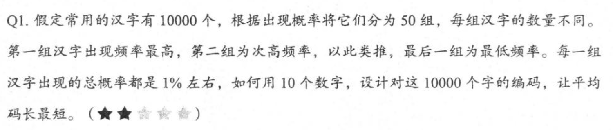

**Welcome to ThreeFish · Essence of Computing!**

## 《计算之魂》

### 计算机工程师等级

七级：熟悉计算机的课程内容，本科成绩不错。
六级：在他人指导下完成工程工作。
五级：独立解决问题，完成工程工作。
四级：用已知的最优方法（state of the art）解决问题，指导和带领他人完成更有影响力的工作。
三级：解决前人未解决的问题，独立设计和实现产品，在市场上获得成功。
二级：提出重要的计算机理论和实践中的新问题，并解决他们，设计和实现别人做不出的产品（难以取代的人）。
一级：开创一个产业，或者奠定一个学科基础。

### 计算思维

1. 管理与企业文化中顶层思维不如自底向上的结构灵活，而计算机科学需要的是顶层设计，而非经验上的归纳总结。
2. 在解决问题时，哪些是必要的，哪些是不能省略的，哪些是多余的，将多余的部分全部挑出来省掉。
3. 边界的认知，比如要找到序列中和最大的子序列，就不免扫描整个序列，因此最优解的下界不可能低于线性复杂度。
4. 逆向思维、分治、递归、少做无用功。
5. 采用有效算法的产品往往可能通吃市场，而算法未经优化的竞品可能毫无竞争力。
6. 在计算机行业，从业者有无经验，常常体现在动手开干之前，能否站在计算机的角度审视一遍自己的想法（五级 -> 四级）。
7. 任何人的眼光都可能靠不住，没有数据不要得出任何结论。
8. 在计算机中处理数值相差很大的数据时，需要大的和大的一同处理，小的和小的一同处理，先做粗调的事，再做细调的事，兼顾溢出（范围）和精度。
9. 有规律的渐变（增量）是我们这个世界的普遍现象，突变是少见的。
10. 总能找到一种合适的编码，让信息压缩后的编码总长度接近于信息熵。
11. 将最好的资源用在最重要之处：把较短的编码分配给常用的信息，把较长的编码分配给不常用的信息，这样可以减少信息的平均长度。
12. 在计算机中表示信息，最关键的是把握二分原则，因为计算机是和二进制相连的，而二进制可以表示任何信息。

### Subject

1. 找到序列中和最大的子序列（算法：1->4 的优化理论）
2. 排序算法（动态效果）
   1. 选择排序，冒泡排序：$O(N^{2})$
   2. 插入排序（需要挪动后面元素的地址）：$O(N^{2})$
   3. 归并排序：$O(N \log N)$
   4. 堆排序（不占额外空间，不具备稳定性）：$O(N \log N)$
   5. 快速排序（实际比归并和堆排快两三倍，不具备稳定性）：$O(N \log N)$
   6. 混合排序（融合插入和归并的蒂姆排序，兼顾时间复杂度、空间复杂度、稳定性）：$O(N \log N)$
3. 二进制的理解（信息论）：
   1. 1/7 的金条切分（两刀）
   2. 毒药（64 选 1）与小白鼠（最少需要多少只）
4. 3.5-Q1
   
5. 神经网络是一种加权的有向连通图，用于解决选择与分类的问题，比如下棋，无论围棋还是象棋，本质上都是 N 选 1 的问题。
6. B+ 树的实现、优缺点（相对二叉树、N 叉树）
7. 卡特兰数：通过研究一个问题解决一大批问题，做到一通百通，个人的进步才会特别快，成果也会特别多。
8. 图论：算法的研究实际已经相当透彻，以至于都可以拿来直接用，而实际上，如何将实际问题转化为图论问题，那才是艺术。
   1. 图论是什么：对离散的，有限集合中各个元素之间关系的描述。
9. 权衡的另一种说法：工程的艺术。
10. 搜索引擎的爬虫：
    1. 图的有向性问题；
    2. 节点的不可枚举问题；
    3. 节点和链接的动态变化问题；
    4. 体量问题；
    5. 并行工作的协调问题；
    6. 网速限制问题；
11. 最大流量问题：
    1. 网络的有效性不能简单以总量衡量，有些信息需要以较快的速率传递，有些信息需要在限定时间内传递完毕。甚至有些“优化”无法量化。
    2. 增广路径：反复调整并提高网络中的总流量，直到无法再找到这样的路径为止。
12. 分治法：核心在于分割与合并（区别递归）。
13. 25 人赛跑，选前三强，每场 5 人，需要几场比赛？（少做一些无用功：如果你只有一杆 100 年前的毛瑟枪，能够大众目标只能靠天分，如果你有一杆最先进的狙击步枪，有瞄准镜帮助，打中目标就容易很多。计算机算法的精髓，就是计算机从业者的武器。）
14. 分布式分割法：在逻辑上把整个数组作为一个整体，在物理上采用分治算法，把任务分配到各台服务器上处理，本地并行工作。
    1. 仅将计算的关键值或结果在各个服务器上进行传输。
    2. 分布式归并中，每一步都可以进行合并，单机归并则是最后才进行合并。
15. MapReduce: 将大任务拆解成不重复的子任务（Map：根据某个特定的值来对要处理的数据进行划分，然后将它们送到不同的服务器中处理），让后将子任务的结果合并（Reduce）。
16. 提高缓存命中率（理解分层设计计算机存储系统的方法，在受物理空间和逻辑空间限制的基础上，追求综合的性价比；我们能做的就是了解存储器的层级和它们的特点，让自己写的程序能够利用这些特点，做到效率最高）。
17. 如果可以将任务划分成很多相互独立的子任务，就可能将这些子任务分配到多个并行的计算资源中并行处理，这一步划分我们称为纵向划分。
18. 站在系统的角度来考虑所有应用问题，沿着正确的方向，经过不断递进的联系，见识逾大，思考逾深，才能完成一次质的飞跃。
19. 提高效率的方式是少做事情，低水平的、大量重复的事情做的再多，产出其实也不高。
20. 将问题中各种情况抽象成状态，将大量看似无关的情况用少数状态覆盖，再理清状态之间的逻辑关系。状态之间是存在因果关系的，test 是找到非法的状态，debug 是找到导致非法状态的因果关系链。
21. 调制：把信息源发出的信息变成适应信道传输的等价信息的做法。
22. 解调制：在接收到信道传来的信号后，回复信息源所发出的信息。接收端需要完全清楚发送端是如何设置基和对信息进行编码的。
23. BB84，量子密钥分发（量子通信），窃听者拦截会改变一致性（小于 75%），不拦截则不会知道密钥位的值。
24. 置信度：容许存在一定误差。平衡成本和效益的关系，在特殊情况下调整平衡策略。
25. 运用之妙，存乎一心。
    1. 最长连续子序列
    2. 区间合并：求解一个问题的答案，不能只满足于获得了答案，还需要证明自己的答案不可能在复杂度上进一步优化。
    3. 12 球问题：列出所有可选情况，每一次称重都将剩余的可选情况除以 3（1 次称重的信息量：`>`、`=`、`<`），否则剩余的任务将完成不了。
    4. 和为 K 的子数组：将求中间序列之和转换成求前缀和与 K 之差。
