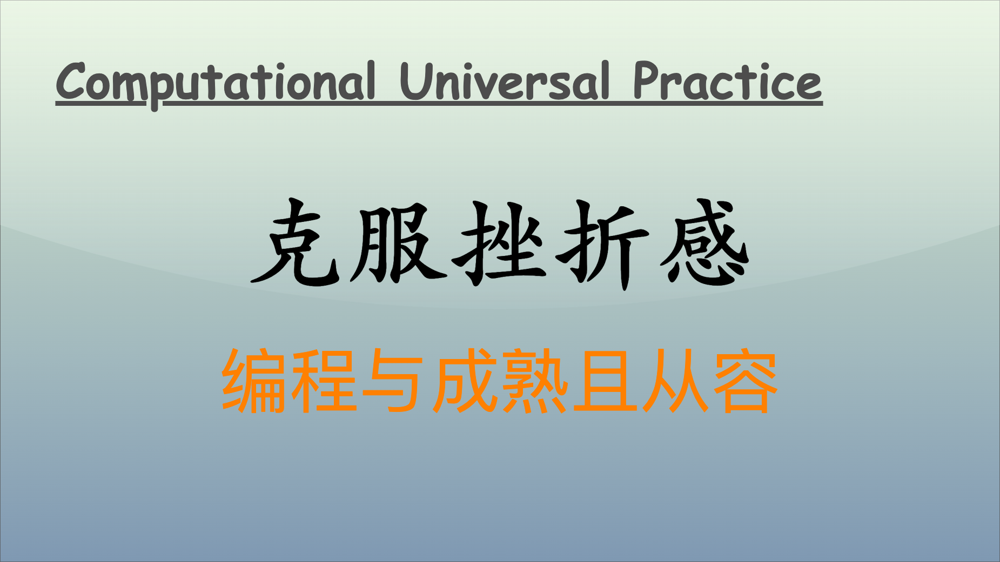

编程学习之路常常充满了挑战和不确定性，许多初学者在面对错误信息、逻辑错误或复杂的算法时，难免会感到挫折。然而，这些挫折感并不仅仅是阻碍，反而可以成为成长的催化剂。

## 心态调整

### 保持积极乐观的学习态度

在编程的过程中，面对错误是不可避免的。对于初学者而言，编写的代码往往会频繁出现问题，这时候保持一种积极的态度尤为重要。每一次错误实际上都是一次宝贵的学习机会。正如大文豪托尔斯泰所说：“失败是成功之母。”这种认知帮助我在多次调试中，学会了从错误中找出教训，将其视为成长的必要过程。

### 设定合理的目标和期望

在心态上，设定合理的学习目标是克服挫折感的关键。初学者常常期望快速掌握许多复杂的概念和技术，但实际上，编程能力的提升需要时间与积累。因此，将大的目标分解为小的、可做到的阶段性目标，每完成一个小目标都会给自己带来成就感，帮助我持续保持良好的学习状态。

例如，我在学习 Python 时，最初我设置的目标是“熟练掌握所有内置函数”。然而，随着学习的深入，我发现这一目标过于庞大且模糊。于是，我改为“今天学习列表的五个内置方法”，这样的目标简单明确，使我能够逐步积累知识，而不至于感到压倒性焦虑。

### 接受失败与不完美

编程的世界并不是完美无瑕的，代码本身也是如此。在编程学习中，学会接受失败的重要性在于，面对错误而不气馁，平静地分析和解决问题，而不是情绪化地反应。当我遇到阻碍时，我告诉自己：“这只是过程中的一部分。”接受不完美的心态使我能够保持冷静，继续向前。

## 学习方法

### 有效的学习策略

在编程学习中，寻找合适的学习方法可帮助我克服挫折感。例如，采用“从例子学习”的方法是我学习编程时的一大策略。通过实际项目来看待问题，能让我更好地理解抽象的概念和构造间的关系。每当我遇到一个复杂的概念，首先尝试找到与之相关的实例，分析其工作原理，这样不仅能帮助我掌握该知识点，还能增加我对编程的兴趣。

### 分解问题

当我面临复杂的编程任务时，常常感到不知从何入手。这时，我学会了将问题分解为更小、更易于处理的部分。比如，在做数据分析项目时，首先明确要实现的功能，然后将其分为数据获取、数据处理、数据分析和结果展示等小模块。逐个完成这些模块后，最后再进行整合。这种方法不仅使我清晰了思路，也减少了挫败感。

### 寻求帮助

在学习的过程中，遇到困难时寻求帮助是非常有效的策略。无论是向同伴请教，还是在编程社区或平台上提问，通常都能获得有价值的反馈。有时，一个简单的建议或思路的转换，就能让我豁然开朗。从一开始的孤军奋战，转向团队合作与分享，使我在学习中感受到归属感和支持，进而减少了挫折感。

### 适时休息

学习很重要，但高强度的学习会导致疲惫和挫折感的增加。适时休息，让大脑有时间消化和整理所学，是我克服挫折感的重要方法。当我感到思维陷入困境时，大家可以选择去散步、运动、或阅读其他内容。这些小的休息会让我在回到学习时，带着新的视角和更强的动力。

## 成功经验

### 真实故事分享

在我的编程学习历程中，有一次特别困难的经历令我印象深刻。在一个项目中，我需要实现一个复杂的数据处理算法，经过几天的努力，我的代码依然没有通过测试。那一刻，我几乎想要放弃，感到前所未有的挫败。然而，我决定休息一天，第二天早上再回到问题上。这次，我请教了我的导师，向他详细说明了我的思路和遇到的困难，没想到他给了我一个全新的角度，让我重新审视这个问题。

通过重新思考和调整我的方法，我终于找到了问题的根源并成功修复了代码。那次经历让我深刻理解到，成功往往是在最艰难的时刻，坚定意志和开放的心态所带来的结果。

### 重要的转折点

在学习编程过程中，一个重要的转折点是我参加了一次编程竞赛。最初的我对竞赛的结果充满担忧，怕自己会在竞争中表现不佳。然而，我在比赛中感受到团队合作的魅力，我们互相鼓励，分享思路，最终在挑战中获得了良好成绩。这次经历让我认识到，编程不仅是单打独斗的过程，团队协作和互助支持也非常重要。

### 持之以恒的坚持

最终，通过多次的挫折与调整，我逐渐建立起了自己的编程信心与能力。我将这种经历与成长视为一种投资，不仅是在技术上的提高，更是在心态和解决问题能力上的提升。从初学者到现在的阶段，我不再惧怕失败，而是愿意主动迎接挑战。每一次的挫折都在为我铺拓不断前行的道路。

## 时间管理

### 制定学习计划

在学习编程时，合理的时间管理至关重要。为自己制定详细的学习计划，不仅能帮助我合理安排时间，还能确保我按部就班地掌握各项技能。这种计划可以是每天、每周甚至每月的，具体到要完成的内容和时间按需调整。例如，我在学习一个新的编程框架时，会为每一部分设置特定的学习目标，比如“今天完成框架基础知识的学习”或“这周实现一个简单的项目”。

### 避免拖延

拖延是编程学习中的常见问题，它会加重学习的挫折感。因此，学会自我激励，设定截止日期，能有效降低拖延倾向。我常常使用“番茄工作法”，通过 25 分钟专注工作，5 分钟休息来提高工作效率。这样的节奏帮助我保持高度专注，从而减少了因为拖延而产生的焦虑感。

### 反思与调整

在学习过程中，定期反思我的学习进度和时间利用情况是非常有益的。我会在每周的最后一天总结一周的学习成果，查看哪些方法有效，哪些需要改进，随着学习的深入及时调整计划，使整个学习过程更具针对性和效率。

## 资源利用

### 积极利用在线资源

现代编程学习者可以利用丰富的在线资源，如视频教程、博客和在线课程。这些资源不仅提供技术知识，还能让我们看到其他人的学习和解决问题的方法。在学习特定技术时，我会寻找相关的教程。这种多样化的教育资源帮助我更好地理解编程概念，对抗挫折感。

### 参与开源项目

参与开源项目是我在编程学习中获益匪浅的方式。在贡献代码的过程中，不仅能巩固自己的知识，还能接触到真实的项目需求和团队合作的流程。通过解决他人提出的问题，增强了我的实际技能，同时也在不断面对挑战中提升了自信。

### 加入编程社区

加入编程社区，参与讨论和分享资源，能够弥补个人学习中的孤独感。在社区中，可以通过互相请教、互相帮助的方式，获取新的思路和解决方案，减少独自面对困难时的挫折感。此外，通过看到其他人的挑战和成长故事，激励我不断进步。

## 自我激励与内驱力

### 自我激励的重要性

在编程学习中，自我激励是极为重要的。即使面临困境，我仍然需要想办法激励自己，保持前进的动力。为了保持高涨的学习热情，我会设定小奖励制度，每当完成一项任务或目标时，给自己一些小奖励，如看一集喜欢的电视剧或吃一顿美食，这样的奖励机制使我保持向上的学习态度。

### 找到内驱力

我逐渐发现，内驱力来自于对编程本身的热爱和好奇心。当我在某个项目中取得进展时，那种兴奋感和成就感不亚于任何外在的奖励。为了培养这种内驱力，我尝试着去探索我感兴趣的项目，例如开发小游戏或者实现有趣的工具，这些都能让我更加投入，从而克服学习中的挫折。

### 创造性思维

编程需要创造性思维。面对难题时，我会鼓励自己跳出常规思路，寻找新的解决方案。这种思维的转变不仅能够开启新的解决思路，还能减少挫折感。例如，在遇到复杂的算法问题时，我会尝试不同的算法实现或者从其他领域找灵感，从而更顺利地找到解决方案。

## 心理健康与自我关怀

### 认知心理学在学习中的应用

了解一些基本的认知心理学原理对我帮助很大。例如，学习时的“错误恐惧”是常见的心理障碍。认识到错误是学习过程的一部分后，我学会了以更开放的态度面对问题。此时，我会尝试将错误视作完成某个新体验的一部分，这样转变的认知降低了我面临挑战时的焦虑。

### 注重心理健康

编程学习不仅是智力上的挑战，也同样是一种精神上的消耗。因此，注重心理健康至关重要。我认识到保持充足的睡眠、适当的锻炼和良好的饮食习惯，对提升学习效果和减少挫折感都是非常有帮助的。定期进行一些身心放松的活动，如瑜伽或冥想，能有效舒缓紧张与疲惫的情绪。

### 交流与倾诉

在学习的过程中，适时与他人交流和倾诉也是一种释放压力的好方式。我发现将困难和挑战分享出来后，心里的负担减轻了很多。无论是与朋友交流，还是在编程社区分享，得到共鸣和支持会让我感到更有信心继续前行。

## 结语

编程学习中的挫折感并不可怕，关键在于我们如何面对它。心态的调整、学习方法的合理运用、成功经验的积累、时间管理、资源利用、自我激励与内驱力的培养，以及保持心理健康，都是帮助我克服挫折的重要因素。编程不仅是技能的掌握，更是心态与思维的成长。在这条路上，每一步前行都将让我更加成熟与从容。让我们在编程学习的旅途中，不断以积极的心态前行，以灵活的学习方法突破瓶颈，最终在这条道路上不断成长，创造属于我们的成功。愿我们都能以坚定的信念，在编程的世界中不断探索与追求，成就更好的自己。

---

**PS：感谢每一位志同道合者的阅读，欢迎关注、点赞、评论！**
