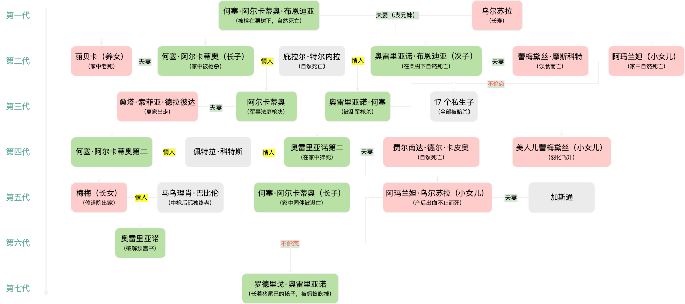

## 引言

《百年孤独》是加西亚·马尔克斯创作的魔幻现实主义经典小说，刻画了布恩迪亚家族七代人的跌宕起伏和马孔多小镇的兴衰。是拉丁美洲文学中一部不朽的杰作。

## 故事概述

小说从布恩迪亚家族的始祖荷塞·阿卡迪奥·布恩迪亚和妻子乌尔苏拉开始，讲述了七代人经历的战争、政治、爱情和灾难。故事背景设在虚构的小镇马孔多，从繁荣到衰落，布恩迪亚家族与这座小镇的命运紧紧交织在一起。

### 初创与早期发展

荷塞·阿卡迪奥·布恩迪亚充满冒险精神和对科学的痴迷，与乌尔苏拉一同建立了马孔多。这里象征着新世界的希望与天真。

- 马孔多的建立：荷塞·阿卡迪奥·布恩迪亚和乌尔苏拉在一片沼泽地上建立了马孔多，这个小镇象征着人类对乌托邦的追求。
- 梅尔基亚德斯的到来：吉普赛人梅尔基亚德斯给布恩迪亚家族带来了先进的科技和魔法般的新奇事物，并且记录了预言书，暗示布恩迪亚家族将来的命运。

### 黄金时代

布恩迪亚子孙中的爱情故事充满了激情，但往往伴随着悲剧命运，显现出一种宿命的无奈。

- 经济繁荣：乌尔苏拉经营的糖果生意让家族和小镇进入了经济繁荣期。马孔多一度成为四方人们心中的天堂。
- 爱与婚姻：布恩迪亚家族的成员经历了一系列复杂的爱情故事，荷塞·阿卡迪奥和丽贝卡的哥哥妹婚，阿卡迪奥和丽贝卡的爱情，以及阿玛兰塔的悲剧性恋情等，使得家族关系变得错综复杂。

### 战争与衰落

布恩迪亚家族卷入了内战和政治斗争，体现出理想与现实的冲突。

- 内战的爆发：奥雷里亚诺·布恩迪亚上校领导了多个叛乱，成为小说中反抗现实的象征人物。他的孤独感也在战争的经历中逐渐加深。
- 失意与失败：乌尔苏拉的长寿见证了家族从兴盛到衰落的过程，她的努力维持家族的团结，但最终也无法阻止家族命运的下滑。

### 最后的岁月

马孔多的日常生活充满了魔幻色彩，例如马尔克斯笔下的黄色蝴蝶与人类记忆的消失。

- 预言的实现：梅尔基亚德斯的预言逐渐实现，布恩迪亚家族最后一代因乱伦诞下的孩子长有猪尾，最终被蚂蚁吞噬，预示家族的彻底毁灭。
- 马孔多的消失：马孔多在一场巨大风暴后彻底淹没，象征着历史的终结和遗忘。

## 主题分析

### 孤独

布恩迪亚家族七代人的共同特征是孤独，无论是荷塞·阿卡迪奥的执迷还是丽贝卡的自我流放，这种孤独贯穿始终并最终导向毁灭。

- 个体孤独：每个家族成员都在自己的世界中孤独，如荷塞·阿卡迪奥的科学狂热、奥雷里亚诺上校在战争中的内心孤独、丽贝卡自我流放中的孤独。
- 集体孤独：马孔多作为一个集体，也是孤独的，被封闭在丛林中，随着外部世界的接触逐渐崩溃。马孔多和家族的命运紧密相连，象征着个体和集体命运的不可分割。

### 宿命与循环

布恩迪亚家族似乎无法逃脱重复的命运，从乱伦、暴力乃至疯癫。每一代人都在重蹈上代人的覆辙，这种宿命感深刻反映了人类历史上的循环与无奈。

- 命运的重复：布恩迪亚家族的历史不断重复着相似的错误。这种宿命感令家族成员无法逃脱如乱伦、暴力、精神疾病等厄运。
- 宿命的不可改变：小说中多次透露出命运的不可改变性，预示着人类在历史和命运面前的无力感。奥雷里亚诺上校始终无法改变自己的命运，尽管他不断地反抗。

### 魔幻与现实交织

马尔克斯的魔幻现实主义不仅使故事充满幻想，还反映了拉美历史的荒诞和剧变。如马孔多从乌托邦变成废墟，象征了社会理想的破灭。

- 魔幻元素的运用：如梅尔基亚德斯的预言书、飞翔的蕾梅黛丝、美丽的丽贝卡，她们的存在既具象又具有魔幻色彩，反映了拉美历史和文化的复杂性。
- 日常中的超自然：魔幻现实主义使得普通人们的生活充满奇迹，例如雨下了四年十一天、奥雷里亚诺上校制造了三十五只金鱼，死后金鱼带来了永恒的象征。

## 人物分析

### 何塞·阿尔卡蒂奥·布恩迪亚

他象征着开拓者的勇气与悲剧，既是家族的奠基者，也是被自己精神世界吞噬的受害者。

- 冒险精神：他是马孔多的创始人，始终保持对未知世界的好奇和探索。
- 思想困境：随着时间推移，他的精神逐渐崩溃，最后被栓在栗树下，象征着人类知识的局限和孤独。

### 乌尔苏拉

她是家族的精神支柱，体现出坚韧和现实的力量；她的长寿象征了家族的长久存续与衰落。

- 坚韧不拔：她代表了家族的实际管理者和保护者。她在漫长的岁月中看到了家族的兴衰，但始终保持坚强。
- 现实与预言：乌尔苏拉试图通过实际行动改变家族的命运，但最终也无法逃脱宿命的束缚，使她成为现实与预言之间挣扎的典型人物。

### 奥雷里亚诺·布恩迪亚上校

他的角色体现了个人理想与政治现实的冲突，他在孤独中完成了最多的自我探索却也走向了崩溃。

- 理想与现实的冲突：作为反抗政府的战争英雄，他的理想与现实的冲突不断加深他的孤独。
- 内心的填补：他制作的金鱼象征着他内心的一种寄托和孤独的反映，但这种寄托无法真正填补他的灵魂空虚。

### 丽贝卡和阿玛兰塔

她们的悲剧爱情和自我封闭象征了布恩迪亚家族女性角色的复杂命运。

- 象征的爱情与孤独：丽贝卡因乱伦被逐出家门，阿玛兰塔因未婚而自我封闭，这两位女性的命运体现了家族的复杂性和悲剧性宿命。
- 自我封闭与内心斗争：阿玛兰塔拒绝了所有追求者，使自己深陷孤独和痛苦中，同时也在与内心的斗争中逐渐崩溃。

### 费尔南达·德尔·卡皮奥

“禁欲”女人嫁给“纵欲”丈夫，用自己的方式当上“女王”，带进棺材的秘密，使下一代走向灭亡。

- 象征与象征意义: 费尔南达来自一个没落的贵族家庭，象征着旧世界的秩序和死板的贵族礼仪。她的到来打破了布恩迪亚家原本相对开放和随意的生活。
- 内部冲突与孤独: 虽然她试图在家中施行严格的规矩和信仰，但却始终无法真正融入这个家庭，使她陷入深深的孤独与痛苦。
- 象征性的命运: 她的命运预示了布恩迪亚家族与外界规条的冲突，以及最终难以逃避的毁灭。

### 美人儿蕾梅黛丝

似乎超脱于孤独之外，摆脱了走向孤独的宿命。她纯净无邪，不受世俗的污染，甚至不属于这个世界。

- 超现实的存在: 她的美貌和纯洁使她成了马孔多年轻人心中的女神，同时她也带有超自然的特征，如她最终飞升到了天上。
- 象征与象征意义: 她象征着纯真的美和无法被世俗沾染的圣洁。她的存在是一种魔幻的元素，象征着人类对于纯美和理想的追求。
- 悲剧的背后: 由于她的美貌，她的不知所措和周围人们的狂热都将她推向了孤独和无法理解的境地。

## 个人感悟

这本书不仅文笔细腻、故事结构复杂，更通过魔幻现实主义手法，深入刻画了人类孤独、宿命的主题，并揭露了历史和社会现实。

读完《百年孤独》，给人以深思的远不止于剧情。

通过布恩迪亚家族的故事，深入剖析人类孤独、宿命以及历史的循环的反反复复，布恩迪亚家族的命运在弥漫的魔幻色彩中透出现实的无奈和宿命感。

同时马尔克斯通过魔幻现实主义手法，把拉美社会的历史变迁与人类普遍的情感和困境奇幻而又真实地传达给了读者。这不仅是对拉美社会历史的一次艺术概括，更是对人类普遍存在的情感和困境进行了一次深刻的探讨，让我们思考自身和社会的关系。

**无论历史何其波澜壮阔，个体的孤独和命运的挣扎总是亘古不变。**

**对于历史和命运，我们或许无力改变，但仍需在孤独中寻找希望和意义。**

《百年孤独》是一部值得反复品读和深思的经典之作，它以独特的文学手法和深刻的社会洞察力，为我们提供了丰富的精神食粮和沉思的空间。
