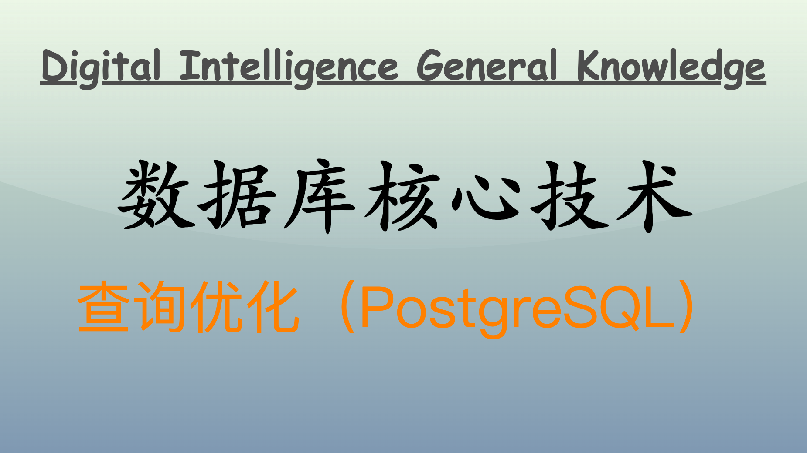

[pgvector](https://github.com/pgvector/pgvector#hnsw) 是一个 PostgreSQL 扩展，专为 PostgreSQL 提供向量（vector）数据类型和相关操作功能。`pgvecotr` 与 PostgreSQL 的无缝衔接使得 PostgreSQL 可以支持高效的向量存储、计算和检索，将 PostgreSQL 转变为了一个强大的向量数据库，这令得 PostgreSQL 有了闯入时下最火爆的机器学习与人工智能应用开发领域的资格。



## 什么是 `pgvector`？

`pgvector` 为 PostgreSQL 提供了一个名为 `vector` 的数据类型，用于存储和操作高维向量。它特别适用于需要进行向量相似度计算和向量检索的场景，例如推荐系统、图像检索、自然语言处理等领域。

### 安装 `pgvector`

`pgvector` 为 PostgreSQL 添加新的数据类型 `vector` 的方式是在 PostgreSQL 扩展机制中是通过定义一个新类型以及相关函数实现的。我们需要自行安装 `pgvector` 扩展。

**通过源代码安装 pgvector**

要将 `pgvector` 安装在已存在的 `postgresql@15` 上，可以遵循以下步骤。

- **获取 pgvector**：使用以下命令直接从 GitHub 获取 `pgvector`。

  ```bash
  git clone https://github.com/pgvector/pgvector.git
  cd pgvector
  git checkout v0.7.4  # 确保使用合适版本
  ```

- **设置环境变量**：确保使用正确版本的 PostgreSQL。

  ```bash
  export PATH="/opt/homebrew/opt/postgresql@15/bin:$PATH"
  ```

- **编译并安装**：在 `pgvector` 目录下执行。

  ```bash
  make install
  ```

- **在 PostgreSQL 中创建扩展**：

  进入 PostgreSQL：

  ```bash
  psql postgres
  ```

  然后创建扩展：

  ```sql
  CREATE EXTENSION IF NOT EXISTS vector;
  ```

这样，`pgvector` 应该已成功安装在你的 `postgresql@15` 上。如果遇到错误，请检查输出信息并确保已满足所有依赖项。

### `vector` 类型支持

- **数据类型定义**：`pgvector` 在 PostgreSQL 中自定义了一个定长的浮点（float4）数组类型 `vector(N)`（通过 C 扩展编写），并在 PostgreSQL 中注册。
- **存储格式**：向量数据在数据库内部存储为一个定长的浮点数组，这些数组被组织成紧凑的二进制格式以便高效存储和检索。这个存储结构排布紧凑，使得向量数据操作更为高效。

  ```c
  typedef struct
  {
      int32 length;   // 向量长度
      float4 values[]; // 存储浮点数组
  } Vector;
  ```

### 向量相似度计算

`pgvector` 实现了多种常见的向量相似度计算方法，如欧氏距离、余弦相似度和内积。每种方法都被实现为一个 PostgreSQL 函数。

- **欧氏距离**：欧氏距离计算会遍历两个向量的每个维度，计算平方和，再取平方根。

  ```c
  float euclidean_distance(const float *a, const float *b, int length) {
      float sum = 0.0;
      for (int i = 0; i < length; i++) {
          float diff = a[i] - b[i];
          sum += diff * diff;
      }
      return sqrt(sum);
  }
  ```

- **余弦相似度**：余弦相似度计算两个向量的点积，并归一化向量以计算余弦角度。

  ```c
  float cosine_similarity(const float *a, const float *b, int length) {
      float dot_product = 0.0;
      float norm_a = 0.0;
      float norm_b = 0.0;
      for (int i = 0; i < length; i++) {
          dot_product += a[i] * b[i];
          norm_a += a[i] * a[i];
          norm_b += b[i] * b[i];
      }
      return dot_product / (sqrt(norm_a) * sqrt(norm_b));
  }
  ```

- **内积**：内积计算两个向量对应维度的乘积之和。

  ```c
  float dot_product(const float *a, const float *b, int length) {
      float result = 0.0;
      for (int i = 0; i < length; i++) {
          result += a[i] * b[i];
      }
      return result;
  }
  ```

### 向量索引优化

`pgvector` 支持近似和精确查询。为了提升向量检索的效率，`pgvector` 支持了多种索引算法，其中包括 `HNSW`（Hierarchical Navigable Small World）和 `IVFFlat`（Inverted File with Flat Quantization）。这些索引结构可以高效处理高维向量数据。

- **HNSW**：Hierarchical Navigable Small World，是一种基于图的索引结构，构建了一个多层次的导航图。高层次的图具备更少的节点，主要用于加速搜索过程。HNSW 使用随机跳跃的方式进行邻近搜索，通过在不同层的图结构中进行搜索，快速找到相似向量。在插入新向量时，会将其加入到不同层，逐级构建连接。相比于传统的 KNN 方法，HNSW 在高维数据中表现出更好的查询性能和准确性，尤其在动态数据更新时。

  ```sql
  CREATE INDEX ON items USING hnsw (embedding vector_l2_ops);
  ```

- **IVFFlat**：Inverted File with Flat Quantization，是一种基于聚类的索引方法，先将向量数据集划分为多个簇，然后对每个簇使用平面（Flat）来存储向量。在构建索引时，首先使用聚类算法（如 K-means）对数据进行簇划分。在查询时，首先确定查询向量所属的簇，然后在该簇内进行线性搜索，以找到近似最近邻。在处理特别大的数据集时，IVFFlat 可以显著减少搜索空间，提高查询速度。

  ```sql
  CREATE INDEX ON items USING ivfflat (embedding) WITH (lists=100);
  ```

  - `lists`: 设置聚类的数量，较高的 `lists` 通常会提升查询精度但也会增加索引创建和查询时间。可以根据数据规模和查询性能要求进行调整。

### 查询优化和执行计划

PostgreSQL 优化器会根据查询和表的统计信息，选择最优的执行计划。对于向量检索，优化器会考虑向量索引的存在以及索引的类型。

- **查询执行计划**：`EXPLAIN` 命令可用于查看查询的执行计划，并确保索引被正确使用。

  ```sql
  EXPLAIN ANALYZE
  SELECT id, embedding
  FROM items
  ORDER BY embedding <-> '[1.0, 0.0, -1.0, ..., 0.5]'
  LIMIT 5;
  ```

## `vector` 使用

`pgvector` 扩展为 PostgreSQL 引入了一个新的数据类型，用于存储和操作高维向量。它使得在关系型数据库中处理向量数据变得更加高效和直观。

### 创建向量类型的表

在安装 `pgvector` 扩展后，PostgreSQL 将支持 `vector` 数据类型，这种类型允许存储定长的浮点数组，可用于存储特征嵌入（embeddings）和其他高维向量。

为特定维度的向量创建示例表，可以指定向量的维度：

```sql
CREATE TABLE items (
    id serial PRIMARY KEY,
    embedding vector(300) -- 定义300维向量
);
```

在上述表结构中，`embedding` 字段定义了一个 300 维的向量。`vector(300)` 指定了向量的维度，它必须是一个整数。

向量存储在 PostgreSQL 中时实质上是定长的浮点数组。`pgvector` 中的向量数据类型提供了针对这些浮点数组的优化存储和操作。

### 插入向量数据

向表中插入向量数据：向量必须使用字符串格式插入，向量元素用逗号分隔，整体由方括号包围。

```sql
INSERT INTO items (embedding) VALUES ('[1.0, 0.0, -1.0, ..., 0.5]');  -- 此处代表300维的向量
```

### 向量检索和相似度计算

`pgvector` 支持常见的向量相似度计算方法，如欧氏距离（Euclidean distance）、余弦相似度（Cosine similarity）和内积（Dot product）。

- **欧氏距离（Euclidean distance）**：衡量两个向量之间的直线距离。

使用欧氏距离进行向量检索的查询示例如下：

```sql
SELECT id, embedding
FROM items
ORDER BY embedding <-> '[1.0, 0.5, 0.3, ..., 0.2]' -- 指定查询向量
LIMIT 5;
```

`embedding <-> '[1.0, 0.5, 0.3, ..., 0.2]'` 表示计算 `embedding` 列中向量与指定向量之间的欧氏距离，并按距离排序。

- **余弦相似度（Cosine similarity）**：衡量两个向量的夹角，适合衡量向量方向的相似度。

使用余弦相似度进行向量检索的查询示例如下：

```sql
SELECT id, embedding
FROM items
ORDER BY embedding <=> '[1.0, 0.5, 0.3, ..., 0.2]' -- 指定查询向量
LIMIT 5;
```

`embedding <=> '[1.0, 0.5, 0.3, ..., 0.2]'` 表示计算 `embedding` 列中向量与指定向量之间的余弦相似度，并按相似度排序。

- **内积（dot product）**：计算两个向量的点积，适合某些特定的推荐系统。

使用内积进行向量检索的查询示例如下：

```sql
SELECT id, embedding
FROM items
ORDER BY embedding <#> '[1.0, 0.5, 0.3, ..., 0.2]' -- 指定查询向量
LIMIT 5;
```

`embedding <#> '[1.0, 0.5, 0.3, ..., 0.2]'` 表示计算 `embedding` 列中向量与指定向量的内积，并按内积值排序。

## 索引优化

`pgvector` 扩展对向量检索的支持主要通过 HNSW 和 IVFFlat 索引实现。在使用这些索引时，优化其性能至关重要。

### HNSW 索引

HNSW（Hierarchical Navigable Small World）是一种基于图的索引结构，其主要通过构建多层次的导航图来实现高效的相似性搜索：

- **多层图结构**：每一层的结点连接数和层数由插入时的随机性决定，形成高层次图和底层图之间的连接。
- **随机连接**：在每一层，节点随机连接其他节点，形成跳跃搜索，降低搜索复杂度。
- **动态更新**：允许在已有索引的基础上动态插入新数据，使得更新更为灵活。

**优化示例**

- **安装和创建表**：

  ```sql
  CREATE EXTENSION vector;
  CREATE TABLE items (
      id serial PRIMARY KEY,
      embedding vector(128)  -- 假设有128维向量
  );
  ```

- **插入数据**：

  ```sql
  INSERT INTO items (embedding) VALUES
  ('[0.1, 0.2, ..., 0.128]'),
  ('[0.3, 0.4, ..., 0.128]');
  ```

- **创建 HNSW 索引**：

  ```sql
  CREATE INDEX ON items USING hnsw (embedding) WITH (M = 16, ef_construction = 200);
  ```

  - `M`：每个节点的最大连接数，增加该值能提高检索准确度，但降低插入与耗耗的性能。
  - `ef_construction`：构建时的邻近搜索数量，增加此值可以提升准确性，但增加内存消耗。

**应用场景**

- **动态数据**：适合有频繁数据更新的场景，如实时推荐系统，因为新的数据可以快速被纳入索引。
- **高查询精度**：适用于需要高精度相似性检索的应用场景，如文本检索、图像查找等。

### IVFFlat 索引

IVFFlat（Inverted File with Flat Quantization）基于聚类的思想，主要通过将数据分为多个簇来实现高效的相似性搜索：

- **聚类划分**：首先使用聚类算法（例如 K-means）将向量空间划分为多个簇。
- **反向索引**：每个簇内存储所有属于该簇的向量，查询时，首先找到接近于查询向量的簇，然后在该簇内进行线性搜索。
- **节省内存**：采用“平面存储”方式，每个簇的数据保持简单，降低存储和计算开销。

**优化示例**

- **安装和创建表**：

  ```sql
  CREATE EXTENSION vector;
  CREATE TABLE items (
      id serial PRIMARY KEY,
      embedding vector(128)
  );
  ```

- **插入数据**：

  ```sql
  INSERT INTO items (embedding) VALUES
  ('[0.1, 0.2, ..., 0.128]'),
  ('[0.3, 0.4, ..., 0.128]');
  ```

- **创建 IVFFlat 索引**：

  ```sql
  CREATE INDEX ON items USING ivfflat (embedding) WITH (lists = 100);
  ```

  - `lists`：设置总簇数量，通常是数据量的平方根，簇越多，查询精度越高，但查询速度越慢，且会增加索引的创建和维护成本。

**应用场景**

- **大数据集**：适合处理大规模数据集，尤其是批量查询的情况，如图像数据库检索。
- **实时分析**：在需要实时查询相似性但可以接受轻微精度损失的场景，如用户行为分析。

### 优化建议

- **参数调整**：
  - 对于 HNSW，调整 `M` 和 `ef_construction` 可以有效提高查询精度，适当的内存开销是值得的。
  - 对于 IVFFlat，`lists` 的选择直接影响查询速度和精度，需根据数据量和应用场景进行调整。
- **数据预处理**：对数据进行归一化或标准化处理，可以提高模型的效果，特别是在 K-means 聚类阶段时。
- **物化视图**：对于频繁的复杂查询，可预先计算并存储结果，减少实时计算量。
- **负载均衡**：在多用户环境中，考虑负载均衡或者使用分片存储数据，如果向量数据量非常大，可以结合分区表策略，进一步提高查询性能。避免单一索引的性能瓶颈。
- **监控与调试**：使用 PostgreSQL 的性能监控工具，定期检查索引性能，必要时进行重建或再优化。

通过了解 HNSW 和 IVFFlat 的原理、创建方法以及应用场景，可以更好地使用 `pgvector` 扩展来进行高效的相似性搜索，并为不同的应用需求提供合适的解决方案。

## 典型应用场景

- **推荐系统**：基于用户行为向量或内容向量进行相似性推荐。
- **图像检索**：通过图像特征向量实现图像相似性搜索。
- **文本相似度**：将文本嵌入为向量，进行文本相似度计算。
- **机器学习**：在数据库中存储和管理模型嵌入向量，支持高效的向量检索和相似度计算。

## 结语

通过以上描述，可以看到如何在 PostgreSQL 中使用 `pgvector` 存储和操作向量数据，并且针对不同需求进行查询优化和性能提升。这为需要进行高维向量检索和相似性计算的现代许多机器学习和数据科学应用，如推荐系统、图像检索和自然语言处理等提供了强有力的支持。

`pgvector` 为 PostgreSQL 引入了专门针对向量数据的索引，特别是 HNSW 和 IVFFlat 索引。这些索引帮助实现高效的向量检索和相似度计算。在选择 HNSW 或 IVFFlat 索引时，应根据应用场景的具体需求（如查询频率、数据更新频率和可用内存等）做出选择。HNSW 适合需要高检索精度和灵活更新的数据集，而 IVFFlat 则更适合需要快速处理庞大数据集但对精度有轻微取舍的场景。

选择适当的索引类型、合理调整参数、定期更新统计信息，以及结合物化视图和内存缓存机制，监控性能都是确保向量检索性能的关键步骤。充分理解这些索引结构及其底层原理，可以有效提升面对高维向量数据时的查询速度和效率。

---

**PS：感谢每一位志同道合者的阅读，欢迎关注、点赞、评论！**
