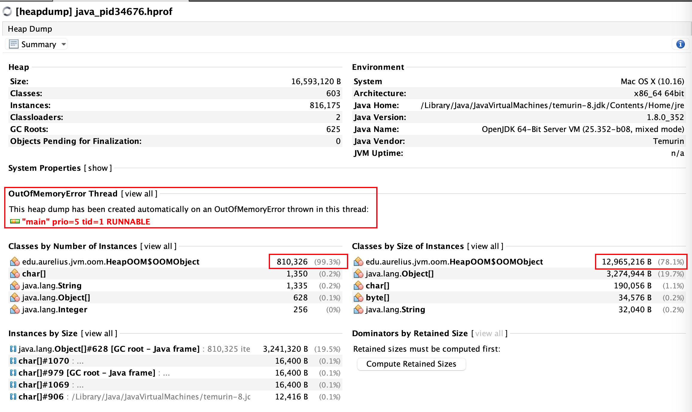
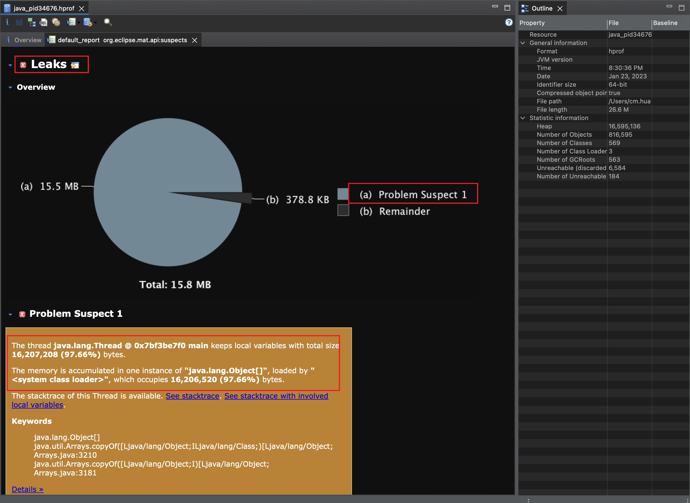
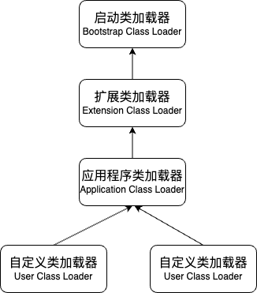
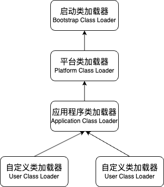
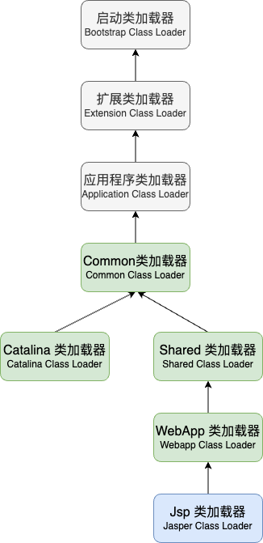
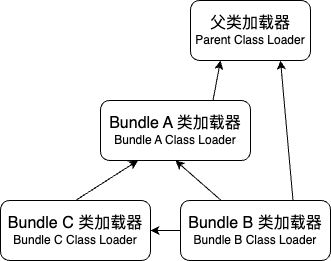
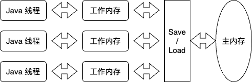

<!-- @import "[TOC]" {cmd="toc" depthFrom=1 depthTo=6 orderedList=false} -->

<!-- code_chunk_output -->

- [一、走近 Java](#一-走近-java)
  - [1.1. 概览](#11-概览)
  - [1.2. Java 技术体系](#12-java-技术体系)
  - [1.3. Java 发展史](#13-java-发展史)
  - [1.4. Java 虚拟机家族](#14-java-虚拟机家族)
  - [1.5. 展望 Java 技术的未来](#15-展望-java-技术的未来)
- [二、Java 内存区域与内存溢出异常](#二-java-内存区域与内存溢出异常)
  - [2.1. 概述](#21-概述)
  - [2.2. 运行时数据区](#22-运行时数据区)
  - [2.3. HotSpot 虚拟机对象探秘](#23-hotspot-虚拟机对象探秘)
  - [2.4. OutOfMemoryError 异常](#24-outofmemoryerror-异常)
- [三、垃圾收集器与内存分配策略](#三-垃圾收集器与内存分配策略)
  - [3.1. 概述](#31-概述)
  - [3.2. 对象已死？](#32-对象已死)
  - [3.3. 垃圾收集算法理论与发展过程](#33-垃圾收集算法理论与发展过程)
  - [3.4. HotSpot GC 算法细节实现](#34-hotspot-gc-算法细节实现)
  - [3.5. 经典垃圾收集器](#35-经典垃圾收集器)
  - [3.6. 低延迟垃圾收集器](#36-低延迟垃圾收集器)
  - [3.7. 选择合适的垃圾收集器](#37-选择合适的垃圾收集器)
  - [3.8. 内存分配与回收策略](#38-内存分配与回收策略)
- [四、虚拟机性能监控、故障处理工具](#四-虚拟机性能监控-故障处理工具)
  - [4.1. 故障处理命令行工具](#41-故障处理命令行工具)
  - [4.2. 故障处理可视化工具](#42-故障处理可视化工具)
    - [1. JHSDB](#1-jhsdb)
    - [2. JConsole(Java Monitoring and Management Console)](#2-jconsolejava-monitoring-and-management-console)
    - [3. VisualVM](#3-visualvm)
    - [4. JMC(Java Mission Control)](#4-jmcjava-mission-control)
    - [5. MAT(Memory Analyzer Tool)（WIP）](#5-matmemory-analyzer-toolwip)
    - [6. JProfiler（WIP）](#6-jprofilerwip)
    - [7. Arthas（WIP）](#7-arthaswip)
    - [8. Frame Graphs（WIP）](#8-frame-graphswip)
  - [4.3. HotSpot VM 插件与工具](#43-hotspot-vm-插件与工具)
- [五、调优案例实践](#五-调优案例实践)
  - [5.1. 案例分析](#51-案例分析)
  - [5.2. 应用程序启动耗时与延时优化](#52-应用程序启动耗时与延时优化)
- [六、类文件结构](#六-类文件结构)
  - [6.1. Class 类文件的结构](#61-class-类文件的结构)
  - [6.2. 字节码指令简介](#62-字节码指令简介)
- [七、JVM 类加载机制](#七-jvm-类加载机制)
  - [7.1. 类加载的时机](#71-类加载的时机)
  - [7.2. 类加载的过程](#72-类加载的过程)
  - [7.3. 类加载器](#73-类加载器)
  - [7.4. Java 模块化系统](#74-java-模块化系统)
- [八、虚拟机字节码执行引擎](#八-虚拟机字节码执行引擎)
  - [8.1. 运行时栈帧结构](#81-运行时栈帧结构)
  - [8.2. 方法调用](#82-方法调用)
  - [8.3. 动态类型语言支持](#83-动态类型语言支持)
  - [8.4. 基于栈的字节码解释执行引擎](#84-基于栈的字节码解释执行引擎)
- [九、类加载及执行子系统的案例与实战](#九-类加载及执行子系统的案例与实战)
  - [9.1. 实际开发中的应用](#91-实际开发中的应用)
  - [9.2. 自己动手实现远程执行功能](#92-自己动手实现远程执行功能)
- [十、前端编译与优化](#十-前端编译与优化)
  - [10.1. javac 编译器](#101-javac-编译器)
  - [10.2. Java 语法糖](#102-java-语法糖)
  - [10.3. 插入式注解处理器](#103-插入式注解处理器)
- [十一、后端编译与优化](#十一-后端编译与优化)
  - [11.1. 即时编译器](#111-即时编译器)
  - [11.2. 提前编译器](#112-提前编译器)
  - [11.3. 编译器优化技术](#113-编译器优化技术)
  - [11.4. 深入理解 Graal 编译器](#114-深入理解-graal-编译器)
- [十二、Java 内存模型与线程](#十二-java-内存模型与线程)
  - [12.1. Java 内存模型](#121-java-内存模型)
  - [12.2. Java 与线程](#122-java-与线程)
  - [12.3. Java 与协程](#123-java-与协程)
- [十三、线程安全与锁优化](#十三-线程安全与锁优化)
  - [13.1. 线程安全](#131-线程安全)
  - [13.2. 锁优化](#132-锁优化)
- [性能指标](#性能指标)
- [性能监控](#性能监控)
- [性能分析](#性能分析)
- [性能调优](#性能调优)
- [Mac 卸载 JDK](#mac-卸载-jdk)
- [热搜词](#热搜词)

<!-- /code_chunk_output -->

# 一、走近 Java

写程序是一个不断追求完美的过程。

## 1.1. 概览

1. 一次编写，到处运行；
2. 相对安全的内存管理和访问机制，避免绝大部分内存泄漏和指针越界问题；

不再依赖书本和他人来使用一门技术，并能解决问题，才算升华到了`不惑`的境界。

## 1.2. Java 技术体系

JCP(Java Community Process, Java 社区，由业界多家技术巨头组成的社区组织，用于定义和发展 Java 的技术规范) 定义的 Java 技术体系的组成部分

- Java 程序设计语言
- JVM 实现
- Class 文件格式
- Java 类库 API
- 商业机构和开源社区的第三方 Java 类库

## 1.3. Java 发展史

- `1991.4`，James Gosling 领导的 Green Project 启动，Oak 问世；
- `1995.5.23`，互联网潮流兴起，Oak 改名 Java，在 SunWorld 大会正式发布 Java 1.0；Java 语言第一次提出 `Write Once, Run Anywhere` 的口号；
- `1996.1.23`，发布 JDK 1.0（Sum Classic VM、Applet、AWT）；
- `1997.2.19`，Sun 发布 JDK 1.1（JAR、JDBC、JavaBeans、RMI、Inner Class、Reflection）；
- `1998.12.4`，Sun 发布 JDK 1.2（EJB、Java Plug-in、Java IDL、Swing、JIT）；
- `1999.4.27`，HotSpot VM 问世，HotSpot 最初由 Longview Techno-logies 开发，1997 年被 Sun 收购后，在 JDK 1.2 作为附加程序提供，JDK 1.3 及之后作为默认的 Java 虚拟机；
- `2000.5.8`，Sun 发布 JDK 1.3（JNDI 提升到平台级）；
- `2002.2.13`，Sun 发布 JDK 1.4（正则表达式、异常链、NIO、日志类、XML、XSLT 装换器）；
- `2002`，Microsoft 发布 .NET Framework；
- `2004.9.30`，Sun 发布 JDK 5（自动装箱、泛型、动态注解、枚举、可变长参数、遍历循环；Java Memory Model，java.util.concurrent）；
- `2006.11.13`，Sun 宣布计划要把 Java 开源，之后的一年间，JDK 以 GPL v2 协议公开源码；并建立 OpenJDK 组织独立管理；
- `2006.12.11`，Sun 发布 JDK 6（初步的动态语言支持、编译器注解处理器；锁、同步、垃圾收集、类加载等的改进）；J2EE、J2SE、J2ME -> Java EE 6、Java SE 6、Java ME 6；
- `2009.2.19`，JDK 7 的第一个里程碑版本完成；
- `2009.4.20`，Oracle 以 74 亿美元收购市值曾超过 2000 亿美元的 Sun，Java 商标划归 Oracle（Java 语言不属于任何公司，它由 JCP 组织管理，但 Sun/Oracle 在 JCP 的话语权很大）；此前 Oracle 收购了 BEA，因此 Oracle 得到世界三大 JVM 其中的两个：JRockit 和 HotSpot；
- `2011.7.28`，Oracle 发布 JDK 7（G1、可并行的类加载框架、加强对非 Java 语言调用的支持等）；JDK 7 Update 4 开始正式支持 Mac OS X；JDK 7 也是支持 Windows XP 的最后一个版本；
- `2014.3.18`，Oracle 发布 JDK 8（Lambda、时间 API、日期 API、移除 HotSpot 永久代）；Oracle 启用 JEP（JDK Enhancement Proposals）来定义和管理纳入新版 JDK 发布范围的功能特性；
- `2017.9.12`，Oracle 发布 JDK 9（Jigsaw 模块化；HotSpot 日志系统、HTTP 2 客户端 API 等）；期间多次跳票，IBM 在 JDK 模块化方面有最好的实现标准，还带头城里了 OSGi 联盟，和 RedHat 为首的十三家企业在 JCP 联手否决 Oracle 的 Jigsaw 作为 Java 模块化规范；最终 Oracle 以公开表示宁愿摒弃 JSR 专家组，独立发展 Jigsaw 的 Java 为胁，Jigsaw 最终发布；JDK 9 开始，JDK 每年 3 月和 9 月各发布一个大版本，每 6 个大版本才会出一个长期支持的版本（LTS：3 年，JDK 8、JDK 11、JDK 17；普通版本：6 个月）；
- `2018.3.20`，Oracle 发布 JDK 10（内部重构：同一源仓库、同一垃圾收集器接口、同一即使编译器接口等）；
- `2018.3.27`，法庭最终裁定 Android 侵权 Java 案，Google 赔偿 Oracle 合计 88 亿美元（Oracle 在 2009 年以 74 亿收购 Sun 后反手用 Sun 的专利将 Google 告上法庭）；此前 Microsoft 不兼容标准 JVM 的 J++ 被 Sun 告到登报道歉，声明放弃 J++ 语言和 Windows 内置 VM；
- `2018.3`，Java EE 称为历史，Oracle 将其捐赠给 Eclipse 基金会，并不再允许使用 Java 商标（Jakarta EE）；
- `2018.6`，Java Mission Control 开发团队被 Oracle 解散；
- `2018.9.25`，Oracle 发布 JDK 11（LTS、ZGC、Lambda 类型推断）；Oracle 调整 JDK 协议，此后将同时发布两个 JDK（以 GPL v2 + CE 协议发行的 Oracle OpenJDK：免费使用，半年更新支持；以 OTN 协议发行的 OracleJDK: 生产环境商用必须付费，3 年更新支持），Java 开始收费（迫使商业用户要么不断升级 JDK 版本，使用 OpenJDK，要么去购买商业支持）；
- `2018.10`，最后一届 JavaOne 大会举行；
- `2019.2`，RedHat 从 Oracle 手上接过 OpenJDK 8 和 OpenJDk 11 的管理全和维护职责；
- `2019.3.20`，Oracle 发布 JDK 12（Swtich 表达式、JMH；Shenandoah GC）；Shenandoah GC 成为唯一进入 OpenJDk 而在 OracleJDK 无法使用的功能；

## 1.4. Java 虚拟机家族

1. Sun Classic VM

服役于 JDK 1.0、1.1、1.2；在 1.3、1.4 作为 HotSpot VM 的备选 VM；之后退出历史舞台；

2. Sun Exact VM

具备高性能 VM 的雏形（如：热点探测、两级即时编译器、编译器与解释器混合工作模式等）；使用准确式内存管理；在 1.2 时作为 Classic VM 的备选 VM；随即被 HotSpot 所取代；

3. HotSpot VM

源于一家小公司 Longview Technologies 为 Self 语言实现的 VM，初期在即时编译等多方面有优秀的理念和实际成果，因此在 1997 年 Sun 通过收购该公司或者 HotSpot VM；

HotSpot 继承了 Sun 之前两款商用虚拟机的优点（准确式内存管理），也带来了创新（热点探测：通过执行计数器找到最具有编译价值的代码，再通过即时编译器以方法为单位进行编译；若一个方法被频繁调用或方法中有效循环次数很多，将会分别触发标准即时编译和栈上替换，On-Stack Replacement，OSR；通过编译器与解释器恰当协同，平衡最优程序响应时间和最佳执行性能，且无需等待本地代码输出就能执行程序，减小即时编译的时间）；

到 2014 年的 JDK 8 时期，HotSpot VM 融合了 BEA JRockit，移除掉永久代，吸收 JRockit 的 Java Mission Control；

4. Mobile/Embedded VM

面向移动和嵌入式市场的 JVM；

5. BEA JRockit VM

专为服务器硬件和服务端应用场景高度优化的 VM；不太关注程序启动速度，因此不包含解释器实现，全部代码靠即时编译器编译后执行；在 JDK 6 时代停止更新，被融入 HotSpot VM；

6. IBM J9 VM

定位于 HotSpot 接近，全面考虑服务端、桌面应用、嵌入式等；在职责分离和模块化方面做的比 HotSpot 更优秀；
2016 年起开源；之后捐献给 Eclipse 基金会管理；

7. BEA Liquid VM

BEA 自家 Hypervisor 系统上的 JRockit 虚拟机的虚拟化版本；不需要操作系统支持，不需要内核态/用户态的切换，可以最大限度发挥硬件能力；与 JRockit VM 同时终止开发；

8. Azul VM

Azul Systems 在 HotSpot 上大改所得；适用于 Azul Systems 的专有硬件 Vega 系统，对大型硬件的线程调度有优秀的优化效果；

Zing VM 是从 HotSpot 旧版本独立分支重新开发的高性能 JVM，重新编写了垃圾收集器；可以轻易带来低延迟、快速预热、易于监控等功能；

9. Apache Harmony VM

并不是一个 Java VM；未通过 TCK（Technology Compatibility Kit）兼容性测试和使用授权的 VM，在 Sun 的 JDK 开源后，Apache Harmony 失去开源优势，未被真正大规模商用，但许多代码被 IBM 的 JDK 7 和 Google Andriod SDK 吸纳；

10. Google Andriod Dalvik VM

并不是一个 Java VM；没有遵循《Java 虚拟机规范》，不能直接执行 Java 的 Class 文件；使用寄存器架构而非 JVM 中常见的栈架构；使用 Java 语言编写应用，可以直接使用绝大部分 Java API；
在 Android 5 时代被支持提前编译（Ahead of Time Compilation, AOT）的 ART VM 全面替代；

11. Microsoft JVM

为 Internet Explorer 3 支持 Java Applets 应用而开发的 JVM（背离了一次编译，到处运行的初衷，但确实是 Windows 下性能最好的 JVM）；
1997 年 10 月，Sun 以侵犯商标、不正当竞争、垄断等控告 Microsoft，最终 Microsoft 赔偿 2000 万美元（因垄断总赔偿 10 亿美元）并终止该 JVM 的发展；（后来就有了 .NET Framework）；

12. 其他 VM

- `KVM` Android、iOS 出现前被广泛应用的 VM；
- `Java Card VM` 应用于智能卡、 SIM 卡、银行信用卡、借记卡等，负责对 Java Applet 程序进行解释执行；
- `Squawk VM` 运行与 Sun SPOT（Wi-Fi 设备）；
- `JavaInJava` 实验性 VM，试图以 Java 语言来实现 Java 语言本身的运行环境（Meta-Circular，元循环），证明了一门语言可以自举；
- `Maxine VM` 类似 JavaInJava，但比 JavaInJava 执行效率靠谱得多，接近 HotSpot VM Client 模式；
- `Jikes RVM` IBM 用来研究 JVM 实现技术的项目，类似 JavaInJava，也是一个元循环 VM；
- `IKVM.NET` 基于 .NET 框架实现的 JVM，借助 Mono 获得了一定跨平台能力；可以将 Java Class 文件编译成 .NET Assembly；

## 1.5. 展望 Java 技术的未来

基于如何应对当下已出现的挑战；

1. 无语言倾向

互联网之于 JavaScript，人工智能之于 Python，微服务之于 Golang，不太可能哪一门语言能在每一个领域占尽优势，但若想要更进一步，就只能是弱化语言本身的隔离；

Graal VM 跨语言全栈虚拟机，可以作为`任何语言`的运行平台，不仅包括 Java、Scala、Groovy、Kotlin 等基于 JVM 之上的语言，还包括 C、C++、Rust 等基于 LLVM 的语言，以及 JavaScript、Ruby、Python、R 等语言；（无额外开销的混合使用各类编程语言：在不同语言中混用对方的接口和对象，或者使用对方已经编写好的本地库）；

Graal VM 的基本工作原理是将其他语言的源代码（如 JS）或源码编译后的中间格式（如 LLVM 字节码）通过解释器转换为能被 Graal VM 接受的中间表示（IR，Intermediate Representation）；比如为转换 LLVM 设计一个解释器（Sulong），这个过程叫程序特化（Specialized）；Graal VM 提供了 Truffle 工具集可以快速构建面向某一语言的解释器；

Graal VM 是真正意义上与物理计算机相对应的高级语言虚拟机，它与物理硬件的指令集一样，之于机器特性相关，而不语某种高级语言特性相关；（多语言虚拟机）；

Graal VM 与 HotSpot 的差异主要在于即时编译，在执行效率、编译质量上两者互有胜负；

2. 新一代即时编译器

HotSpot VM 有两个即时编译器（C1，编译耗时短但输出代码优化程度较低的客户端编译器；C2，编译耗时长但输出代码优化质量更高的服务端编译器），他们通过分层编译机制与解释器互相配合共同构成 HotSpot VM 的执行子系统；

Graal 编译器（JDK 10 加入 HotSpot 的全新即时编译器），由 Java 编写，目标是替代 C2 编译器，C2 历史悠久（早 Graal 编译器 20 年），但过于复杂难以维护；Graal 比 C2 更易于做复杂的优化（部分逃逸分析，Partital Escape Analysis），更易于做激进预测性优化（Aggressive Speculative Optimization）；

3. 向 Native 迈进

近几年在从大型单体应用架构向小型微服务应用架构（更甚者如无服务架构）发展的技术潮流下，Java 表现得有些劣势；

- 跨进程、面向用户程序的类型信息共享（Application Class Data Sharing，App CDS），允许把加载解析后的类型信息缓存起来，从而提升下次启动速度；JDK 10 开始支持到用户代码级；
- 无操作的垃圾收集器（Epsilon），只做内存分配，不做回收，对运行完就退出的应用十分友好；
- 提前编译（Ahead of Time Compilation，AOT），可以减少即时编译的预热时间，直接加载已经编译好的二进制库直接调用；但它破坏了`一次编写，到处运行`的承诺；它并不能生成本地代码，仍需运行在 JVM 之上；（Substrate VM 给出了一个极小型运行时环境，并通过本地镜像构造达到直接运行目标程序的效果）；

4. 灵活的胖子

模块化 & 开放性；

5. 语言语法持续增强

JDK 10，`Local-Variable Type Inference`，本地类型推断；
JDK 11，`Local-Variable Syntax for Lambda Parameters`；
JDK 13，`Switch Expressions`，switch 语句的表达式支持；
JDK 13，`Text Blocks`，文本块功能；
草拟，`Enhanced Enums`，常量类绑定数据类型，鞋带额外信息；
草拟，`Lambda Leftovers`，下划线表示 Lambda 中的匿名参数；
草拟，`Pattern Matching for instanceof`，instanceof 判断过的类型在条件分支免强转；
`Project Loom`，提供类似 Golang 的 Groutine 的用户线程，可以更轻量，软件自身进行调度（非直接有操作系统内核调度）；
`Project Valhalla`，提供值类型和基本类型的泛型支持，提供不可变类型和非引用类型的声明；
`Project Panama`，消弭 JVM 与本地代码之间的界限（JNI 虽然可以调用本地代码，但其只能说是达到能用的标准，频繁执行的性能开销非常高）；

# 二、Java 内存区域与内存溢出异常

## 2.1. 概述

Java 在 JVM 帮助下无需自行管理内存，但一旦出现内存泄漏或溢出问题，在不了解 JVM 怎么使用内存的情况下，很难排查异常、修正问题；

## 2.2. 运行时数据区

1. 程序计数器（Program Counter Register）

可以看作是当前程序执行的字节码的行号指示器；它是程序控制流的指示器，`分支`、`循环`、`跳转`、`异常处理`、`线程恢复`等基本功能都需要依赖程序计数器；

`线程私有`，每个线程有一个独立的程序计数器，独立存储各自线程的执行位置；

当线程正在执行的是本地（Native）方法，程序计数器会指向空（Undefined）；

程序计数器是《Java 虚拟机规范》中唯一没有规定任何 `OutOfMemoryError` 的区域；

2. Java 虚拟机栈（Java Virtual Machine Stack）

Java 虚拟机栈描述的是 Java 方法执行的线程内存模型（线程私有）：Java 虚拟机栈为每个被执行的方法创建一个栈帧（Stack Frame：局部变量表、操作数栈、动态连接、方法出口等信息）；一个栈帧在虚拟机栈中的入栈出栈就对应了一个方法的开始执行与执行完毕；

通常讲到的`栈`就是指这里的 Java 虚拟机栈、或只是指 Java VM Stack 中局部变量表部分；

局部变量表存放了编译器可知的 JVM `基本数据类型`（boolean、byte、char、short、int、float、long、double）、`对象引用`（reference 类型，可能是指向对象起始地址的引用指针，或者代表对象的句柄，或者对象相关位置）、`returnAddress 类型`（指向一条字节码指令的地址）；

数据存储在局部变量表的`局部变量槽`（Slot，一般占用 32 bit，不同 VM 实际实现可能不同）中，long 和 double 占用 2 个 Slot，其余占用 1 个；

局部变量表的 Slot 数在编译期间完全确定，在方法运行期间不会改变；

`StackOverflowError`: 线程请求的栈深度大于虚拟机允许的深度时抛出；
`OutOfMemoryError`: 如果 JVM 允许栈容量动态扩展，当栈扩展时无法申请到足够的内存时抛出；

3. 本地方法栈（Native Method Stack）

与 Java VM Stack 类似，只是 Java VM Stack 是为执行 Java 方法服务，而本地方法栈是为本地（Native）方法服务；

4. Java 堆（Heap）

唯一目的是存放对象实例，JVM 管理的最大一块内存，`线程共享`；`几乎`所有对象实例（对象实例、数组）都是存放在堆中，但随着即时编译技术的进步，如`逃逸分析`、`栈上分配`、`标量替换`等优化手段导致并不那么绝对了；

从内存回收的角度讲，Java 堆经常被划分为多个区（经典分代：`新生代`、`老年代`、`永久代`、`Eden 区`、`From Survivor`、`To Survivor`）；如 G1 的新垃圾收集器不采用分代设计；

从内存分配的角度讲，Java 堆被划分出多个线程私有的分配缓冲区（Thread Local Allocation Buffer，TLAB），以提升内存分配效率；

`OutOfMemoryError`: Java 堆中没有足够内存完成实例分配，切对无法再扩展时抛出；

5. 方法区（Method Area）

别名`非堆`（Non-Heap）；用于存储已被 JVM 加载的类型信息、常量、静态变量、即时编译器编译后的代码缓存等数据；`线程共享`；方法区是一块逻辑区域，其实现可以是`永久代`和`元空间`；

`永久代`仅仅是 JDK 8 以前 HotSpot VM 使用来实现方法区的，这使得 HotSpot 的 GC 可以像管理 Java Heap 一样管理这部分内存；但其他 VM 是不存在永久代的概念的；JDK 6 开始 HotSpot 计划改用本地内存（Native Memory）实现方法区，JDK 7 HotSpot 将永久代的字符串常量池、静态变量等移出至堆中；JDK 8 HotSpot 彻底移除永久代，改用以本地内存实现的`元空间`（Metaspace：主要承接 JDK 7 中永久代剩余的内容，如类型信息）来替代；

OutOfMemoryError: 方法区无法满足新的内存分配需求时抛出；

6. 运行时常量池（Runtime Constant Pool）

方法区的一部分，`编译期`生成的各种字面量与符号引用存放在 Class 文件的常量池表（Constant Pool Table），而这部分内容（以及直接引用）在`类加载后`存放在方法区的运行时常量池中；

Class 文件中包含类的版本、字段、方法、接口等描述信息，以及常量池表；

相比 Class 文件的常量池表，运行时常量池具备动态性，运行期间可以将新的常量放入运行时常量池（如 String 类的 intern() 方法）

`OutOfMemoryError`: 受方法区内存限制，当常量池无法再申请到内存时抛出；

7. 直接内存（Direct Memory）

并不是运行时数据区的一部分，但是会被频繁使用；

JDK 4 加入的 NIO（New Input/Output，一种基于 Channel 和 Buffer 的 I/O 方式，可以使用 Native 库直接分配堆外内存，然后通过 Java 堆的 DirectByteBuffer 对象作为这块内存的引用进行操作，避免了 Java 堆和 Native 堆来回复制数据）类就使用了直接内存；

`OutOfMemoryError`: 直接内存不受 Java 堆大小限制，受本机总内存以及处理器寻址空间的限制，当各个内存区域总和大于物理内存限制时抛出；

## 2.3. HotSpot 虚拟机对象探秘

HotSpot 虚拟机在 Java 堆中的对象分配、布局、访问的全过程；

1. 对象的创建

在语言层面 new 一个对象（数组和 Class 对象例外），对应在 JVM 中是一条字节码 new 指令，JVM 会首先检查这个指令参数是否可以通过常量池定位到一个类的符号引用，并且检查这个符号引用代表的类是否已被加载、解析、初始化；若否，必须先执行相应加载过程；待类加载检查通过，JVM 则为新生对象分配内存；

**分配内存的两种方式**

- `指针碰撞`（Bump The Pointer），假设 Java Heap 中内存绝对规整，所有使用过的内存被放到一边，空闲内存放到另一边，中间以一个指针指向分界点；内存分配仅仅是把指针向空闲空间挪动一段与对象大小相等的距离，这种分配方式被称为指针碰撞；`简单而高效`；Java Heap 的内存并不是规整的，无法简单实用指针碰撞的方式进行内存分配，需要 GC 具备压缩整理（Compact）的能力（Serial、ParNew 等）；

- `空闲列表`（Free List），JVM 维护一个记录着所有可用内存块信息的列表，内存分配就是从列表中一块足够大的空间为对象划分同等大小的内存，并更新空闲列表，这种分配内存的方式即空闲列表；基于清理（Sweep）算法（CMS）的 GC 理论上只能通过空闲列表进行内存分配（实际可以通过从空闲列表拿大块空间作为缓冲区的方式进行指针碰撞分配，Linear Allocation Buffer）；

**解决并发情况下线程安全的两种方式**

- `同步处理`，采用 CAS 和失败重试的方式保障更新的原子性；
- `本地线程分配缓冲`（Thread Local Allocation Buffer，TLAB，-XX:+/-UseTLAB 启停），每个线程在 JVM Heap 预先分配一小块内存，哪个线程需要分配内存，就使用哪个 TLAB；分配新的 TLAB 才需要同步锁；

**对象内存初始化**

内存分配完成后，JVM 将分配到的内存空间都初始化为零值（使用 TLAB 则提前至 TLAB 分配时）；这保障对象的实例字段在代码中可以不赋值就拥有其数据类型对应的零值；

**对象头设置**

根据 JVM 当前运行状态的不同（如是否启用偏向锁等），将一些信息（如：对象的类型指针、对象的 HashCode、对象的 GC 分代年龄等）存放到对象的`对象头`（Object Header）；

**对象初始化**

字节码 new 指令后一般跟随一个 invokespecial 指令（Java Compiler 会将 new 关键字编译成这两条字节码指令，但也存在其他生成方式不含 invokespecial），用于执行 `<init>()` 方法（构造函数、静态代码块）；

2. 对象的内存布局

对象的内存布局分为三部分：对象头（Object Header）、实例数据（Instance Data）、对齐填充（Padding）；

**对象头**

- `Mark Word`，存放对象自身运行时数据，如 HashCode、GC 分代年龄、锁状态标志、线程持有的锁、偏向线程 ID、偏向实践戳等；
- `类型指针`，指向对象的类型元数据的指针（并非所有 JVM 实现都会在对象上保留类型指针）；

**实例数据**

存储程序代码中所定义的各类型的字段内容（自身定义的、从父类继承的）；存储顺序受 JVM 分配策略参数（-XX:FieldsAllocationStyle）和字段在源码中定义顺序影响，默认分配顺序：longs/doubles、ints、shorts/chars、bytes/booleans、oops（Ordinary Object Pointers，OOPs），等宽字段分配在一起，父类变量在子类变量之前，子类中窄字段可以插入父类变量的空隙（需要开启 +XX:CompactFileds=true，默认是开启的）；

**对象填充**

起占位符的作用（HotSopt VM 自动内存管理要求对象的大小必须是 8 字节的整数倍，对象实例数据部分未对齐时，通过对齐填充补全），非必然存在，无特殊含义；

3. 对象的访问定位

Java 程序通过 Stack 上的 reference 数据操作 Heap 上的具体对象；通过 reference 访问实际对象的方式主要分`使用句柄`和`直接指针`两种，具体则由 VM 的实现而定；

**使用句柄**

栈上 reference 指向句柄（存储句柄地址）；Java 堆中有一块内存将作为句柄池，专用于存储句柄；而句柄中包含对象实例数据和类型数据的地址信息；

reference 中存储的是稳定句柄地址，对象被移动（GC）时只会改变句柄中的实例数据指针，reference 无效修改；

**直接指针**

栈上 reference 指向对象（存储对象地址），访问对象本身不需多一次间接访问的开销，速度快（HotSpot 的主流方式）；

## 2.4. OutOfMemoryError 异常

《Java 虚拟机规范》规定，除了程序计数器，其他几个运行时数据区都有可能 OOM；OOM 与 VM 本身实现细节密切相关，而非 Java 语言约定的公共行为；

1. Java Heap 溢出

`OutOfMemoryError:Java heap space`，Java Heap 用于存储对象实例，只要有足够的对象没有被 GC 清除，总会触及 Heap 上限；（-Xmx 参数决定）；

**VM Arguments 设置**

```sh
# -Xms 表示堆的最小值
# -Xmx 表示堆的最大值
# -XX:+HeapDumpOnOutOfMemoryError 表示打开开关：VM 出现 OOM 时 Dump 当前内存堆转储快照
-Xms20m -Xmx20m -XX:+HeapDumpOnOutOfMemoryError
```

**示例代码**

循环 new OOMOjbect 对象，直到用完 -Xmx 设置的内存，从而触发堆不够用的异常；

```java
public class HeapOOM {
    static class OOMObject {
    }

    public static void main(String[] args) {
        List<OOMObject> list = new ArrayList<>();
        while (true) {
            list.add(new OOMObject());
        }
    }
}
```

**运行结果**

触发 `OutOfMemoryError: Java heap space`，并 dump 下快照文件 `java_pid34676.hprof`；

```java
java.lang.OutOfMemoryError: Java heap space
Dumping heap to java_pid34676.hprof ...
Heap dump file created [27927927 bytes in 0.092 secs]
Exception in thread "main" java.lang.OutOfMemoryError: Java heap space
	at java.util.Arrays.copyOf(Arrays.java:3210)
	at java.util.Arrays.copyOf(Arrays.java:3181)
	at java.util.ArrayList.grow(ArrayList.java:267)
	at java.util.ArrayList.ensureExplicitCapacity(ArrayList.java:241)
	at java.util.ArrayList.ensureCapacityInternal(ArrayList.java:233)
	at java.util.ArrayList.add(ArrayList.java:464)
	at edu.aurelius.jvm.oom.HeapOOM.main(HeapOOM.java:17)

Process finished with exit code 1
```

**Dump 分析**

可以通过 JDK 自带的 `Virtual VM` 对程序内存进行查看和分析，从而发现一些明显占用内存较多的对象，判断是否就是导致 OOM 的对象；



分析 OOM 问题时可以从两方面考虑：`内存泄漏`（Memory Leak，导致 OOM 的对象本该被 GC 回收，因一些程序编写错误导致无法被回收掉）、`内存溢出`（Memory Overflow，导致 OOM 的对象确实无法被 GC 回收）；

`Eclipse Memory Analyzer` 的 Leak Suspect 功能可以更方便的帮助开发者找到内存泄漏的可疑对象；如下图所示就是发现了我们故意循环 new 出的 `HeapOOM$OOMObject` 对象（点击 detail 可见 GC Roots 引用链）；



根据 GC Roots 引用链，找到破坏引用路径的引用从而消除内存泄漏问题；

若分析得出导致 OOM 的对象是有必要存在的，则需要从资源层面（如 JVM 堆参数 -Xmx、-Xms，物理可用内存）和代码层面（存储结构、对象生命周期、引用关系时间长短等）进行扩展或优化了；

2. Java VM Stack 与 Native Method Stack 溢出

`StackOverflowError`，HotSpot VM 并不区分虚拟机栈和本地方法栈，对 HotSpot 来说，-Xoss（设置本地方法栈大小的参数）实际是无效的，栈容量只能通过 -Xss 参数来设置；

《Java 虚拟机规范》描述了两种栈溢出异常：

- `StackOverflowError`，线程请求的栈深度大于 VM 所运行的最大深度（Xss 允许的内存大小用尽）；
- `OutOfMemoryError`，当 VM 允许动态扩展栈内存，而扩展栈时无法申请到足够的内存（`进程最大内存`减去 Heap 最大容量、方法区最大容量、直接内存大小、JVM 本身消耗内存、程序计数器大小，剩下的就是给到所有栈的）；

**演示 1: 限制栈容量**

**VM Arguments 设置**

```sh
# 设置 VM Stack 大小；
-Xss160k
```

不同版本的 JVM 和不同操作系统的栈容量最大大小限制可能不一样，若设置的大小小于限制，会得到如下提示信息：

```java
Error: Could not create the Java Virtual Machine.
Error: A fatal exception has occurred. Program will exit.

The stack size specified is too small, Specify at least 160k

Process finished with exit code 1
```

**示例代码**

运行一段无限递归的代码，用于触发栈容量不够用的异常；

```java
public class JVMStackSOF {
    private int stackLength = 1;

    public void stackLeak() {
        stackLength++;
        stackLeak();
    }

    public static void main(String[] args) {
        JVMStackSOF oom = new JVMStackSOF();
        try {
            oom.stackLeak();
        } catch (Throwable e) {
            System.out.println("stack length:" + oom.stackLength);
            throw e;
        }
    }
}
```

**运行结果**

```java
stack length:774
Exception in thread "main" java.lang.StackOverflowError
	at edu.aurelius.jvm.oom.JVMStackSOF.stackLeak(JVMStackSOF.java:11)
	at edu.aurelius.jvm.oom.JVMStackSOF.stackLeak(JVMStackSOF.java:12)
  ...
	at edu.aurelius.jvm.oom.JVMStackSOF.stackLeak(JVMStackSOF.java:12)
	at edu.aurelius.jvm.oom.JVMStackSOF.main(JVMStackSOF.java:18)

Process finished with exit code 1
```

体现了栈容量太小触发 StackOverflowError；

**演示 2: 定义大量本地变量**

**示例代码**

在代码中添加 100 个本地变量，然后进行无限递归，触发栈容量不够用的异常；

```java
public class JVMStackSOF {
    private int stackLength = 1;

    public void stackLeak() {
        long unused1, unused2, unused3, unused4, unused5, unused6, unused7, unused8, unused9, unused10, unused11, unused12, unused13, unused14, unused15, unused16, unused17, unused18, unused19, unused20, unused21, unused22, unused23, unused24, unused25, unused26, unused27, unused28, unused29, unused30, unused31, unused32, unused33, unused34, unused35, unused36, unused37, unused38, unused39, unused40, unused41, unused42, unused43, unused44, unused45, unused46, unused47, unused48, unused49, unused50, unused51, unused52, unused53, unused54, unused55, unused56, unused57, unused58, unused59, unused60, unused61, unused62, unused63, unused64, unused65, unused66, unused67, unused68, unused69, unused70, unused71, unused72, unused73, unused74, unused75, unused76, unused77, unused78, unused79, unused80, unused81, unused82, unused83, unused84, unused85, unused86, unused87, unused88, unused89, unused90, unused91, unused92, unused93, unused94, unused95, unused96, unused97, unused98, unused99, unused100;
        stackLength++;
        stackLeak();
        unused1 = unused2 = unused3 = unused4 = unused5 = unused6 = unused7 = unused8 = unused9 = unused10 = unused11 = unused12 = unused13 = unused14 = unused15 = unused16 = unused17 = unused18 = unused19 = unused20 = unused21 = unused22 = unused23 = unused24 = unused25 = unused26 = unused27 = unused28 = unused29 = unused30 = unused31 = unused32 = unused33 = unused34 = unused35 = unused36 = unused37 = unused38 = unused39 = unused40 = unused41 = unused42 = unused43 = unused44 = unused45 = unused46 = unused47 = unused48 = unused49 = unused50 = unused51 = unused52 = unused53 = unused54 = unused55 = unused56 = unused57 = unused58 = unused59 = unused60 = unused61 = unused62 = unused63 = unused64 = unused65 = unused66 = unused67 = unused68 = unused69 = unused70 = unused71 = unused72 = unused73 = unused74 = unused75 = unused76 = unused77 = unused78 = unused79 = unused80 = unused81 = unused82 = unused83 = unused84 = unused85 = unused86 = unused87 = unused88 = unused89 = unused90 = unused91 = unused92 = unused93 = unused94 = unused95 = unused96 = unused97 = unused98 = unused99 = unused100 = 0;
    }

    public static void main(String[] args) {
        JVMStackSOF oom = new JVMStackSOF();
        try {
            oom.stackLeak();
        } catch (Throwable e) {
            System.out.println("stack length:" + oom.stackLength);
            throw e;
        }
    }
}
```

**运行结果**

```java
stack length:41
Exception in thread "main" java.lang.StackOverflowError
	at edu.aurelius.jvm.oom.JVMStackSOF.stackLeak(JVMStackSOF.java:12)
	at edu.aurelius.jvm.oom.JVMStackSOF.stackLeak(JVMStackSOF.java:13)
  ...
	at edu.aurelius.jvm.oom.JVMStackSOF.stackLeak(JVMStackSOF.java:13)
	at edu.aurelius.jvm.oom.JVMStackSOF.main(JVMStackSOF.java:20)

Process finished with exit code 1
```

体现了栈帧过大触发 StackOverflowError；与 `示例 1` 对比可见，当栈容量不变，栈帧变大时，栈的深度（stack length）明显变小了；

如果是可以动态扩展栈大小的虚拟机（比如 Classic VM），可能会导致 OutOfMemoryError 而非 StackOverflowError 的结果；

**演示 3: 线程过多**

**VM Arguments 设置**

```sh
# 将 VM Stack 大小设置得大一些；
-Xss2M
```

**示例代码**

不断建立不会终止的线程（可能会导致操作系统死机，谨慎操作），把 JVM Stack 和 Native Method Stack 可支配的内存耗尽，从而触发无法创建本地线程的异常；

```java
public class JVMStackSOF {
    private void dontStop() {
        while (true) {
        }
    }

    public void stackLeakByThread() {
        while (true) {
            new Thread(() -> dontStop()).start();
        }
    }

    public static void main(String[] args) {
        JVMStackSOF oom = new JVMStackSOF();
        oom.stackLeakByThread();
    }
}

```

**运行结果**

```java
Exception in thread "main" java.lang.OutOfMemoryError: unable to create native thread
```

如果建立过多内存会导致内存溢出，而又无法减少线程数量或增加可用内存，可以从限制栈容量、减少堆最大大小的方向考虑优化 `unable to create native thread`；

3. Method Area 与 Runtime Constant Pool 溢出

使用`永久代`或`元空间`来实现方法区，对方法区内存溢出表现是有影响的；

**演示 1: 限制永久代容量**

**VM Arguments 设置**

```sh
# 设置 Java 堆永久代大小为 6 M；
-XX:PermSize=6M -XX:MaxPermSize=6M
```

**示例代码**

通过持续往常量池添加 i 的字符串常量，用光 6MB 的永久代，从而触发永久代空间不足的异常；

```java
public class RuntimeConstantPoolOOM {
    public static void main(String[] args) {
        Set<String> set = new HashSet<>();
        short i = 0;
        while (true) {
            set.add(String.valueOf(i++).intern());
        }
    }
}
```

**运行结果**

JDK 6 下的运行结果如下：

```java
Exception in thread "main" java.lang.OutOfMemoryError: PermGen space
at java.lang.String.intern(Native Method)
at edu.aurelius.jvm.oom.RuntimeConstantPoolOOM.main(RuntimeConstantPoolOOM.java: 15)
```

而在 JDK 7 或更高的版本中（无论是添加 -XX:MaxPermSize 限制，还是添加 JDK 8 才有的 -XX:MaxMetaspaceSize 限制）循环将会持续进行下去，直至 Heap 溢出（永久代的字符串常量池被移至 Java Heap）；可能是常量分配导致 Heap 溢出，也可能是 Set 扩容导致 Heap 溢出；

**示例 2: String.intern() 影响**

`String.intern()` 调用的作用是将`首次遇到`的字符串放入字符串常量池；在 JDK 6 中，是将字符串复制一份到永久代的字符串常量池存储起来，并返回该字符串实例的引用；在 JDK 7 后，是将字符串实例的引用记录到堆中字符串常量池中；

**示例代码**

通过 StringBuilder::new 实例化两个字符串，并通过 `String.intern()` 调用获取字符串与原字段进行比较；

```java
String str1 = new StringBuilder("计算机").append("软件").toString();
System.out.println(str1.intern() == str1);
String str2 = new StringBuilder("ja").append("va").toString();
System.out.println(str2.intern() == str2);
```

**运行结果**

JDK 6: false（永久代常量对象引用 vs. 堆对象引用）；false（永久代常量对象引用 vs. 堆对象引用）；
JDK 7: true（堆对象引用 vs. 堆对象引用）；false（堆对象引用 vs. 堆对象引用）；

**实例 3: 模拟方法区溢出**

**VM Arguments 设置**

```sh
# 设置 Java 堆永久代大小为 10 M - JDK 7
-XX:PermSize=10M -XX:MaxPermSize=10M
# 设置元空间大小为 10 M - JDK 8
-XX:MetaspaceSize=10485760 -XX:MaxMetaspaceSize=10485760
# -XX:MinMetaspaceFreeRatio：GC 之后控制最小元空间剩余容量的百分比，减少 GC 频率；
# -XX:Max-MetaspaceFreeRatio：GC 之后控制最大云空间剩余容量的百分比；
```

`-XX:MetaspaceSize` 即元空间初始容量，当方法区使用达到该值会触发 GC 进行类型卸载，同时会调整该值；若释放大量空间，则降低该值，若释放少量空间，则在不超过 `-XX:MaxMetaspaceSize`（默认 -1，表示不限制）的情况下提高该值；

**示例代码**

借助 CGLib 直接操作字节码运行时生成大量动态代码，从而触发方法区内存溢出异常；

```java
public class JavaMethodAreaOOM {
    public static void main(String[] args) {
        while (true) {
            Enhancer enhancer = new Enhancer();
            enhancer.setSuperclass(OOMObject.class);
            enhancer.setUseCache(false);
            enhancer.setCallback((MethodInterceptor) (obj, method, args1, proxy) -> proxy.invokeSuper(obj, args1));
            enhancer.create();
        }
    }

    static class OOMObject {
    }
}
```

**运行结果**

JDK 7 运行提示永久代溢出

```java
Caused by: java.lang.OutOfMemoryError: PermGen space
at java.lang.ClassLoader.defineClass1(Native Method)
at java.lang.ClassLoader.defineClassCond(ClassLoader.java:632) at java.lang.ClassLoader.defineClass(ClassLoader.java:616)
...
```

JDK 8 运行提示元空间溢出

```java
Caused by: java.lang.OutOfMemoryError: Metaspace
...
```

4. Direct Memory 溢出

**VM Arguments 设置**

```sh
# 设置 Java 堆最大 20 M，直接内存最大 10 M；
-Xmx20M -XX:MaxDirectMemorySize=10M
```

若不指定 `-XX:MaxDirectMemorySize`，直接内存容量将与 Java Heap 容量一致；

**示例代码**

代码通过反射获取 Unsafe 实例直接进行内存分配（越过了 DirectByteBuffer 类，DirectByteBuffer 分配内存时，通过计算得知内存不足就会抛出溢出异常，不会真正向操作系统申请内存），从而触发直接内存不够的异常；

```java
public class DirectMemoryOOM {
    private static final int _5MB = 1024 * 1024 * 5;

    public static void main(String[] args) throws Exception {
        Field unsafeField = Unsafe.class.getDeclaredFields()[0];
        unsafeField.setAccessible(true);
        Unsafe unsafe = (Unsafe) unsafeField.get(null);
        while (true) {
            unsafe.allocateMemory(_5MB);
        }
    }
}
```

**运行结果**

[谨慎操作] `-XX:MaxDirectMemorySize=10M` 的限制只对 `ByteBuffer.allocateDirect(size)` 或 `new DirectByteBuffer(capacity)` 的分配方式有效，对 unsafe.allocateMemory(size) 并无限制，如上代码会持续分配内存直至让操作系统死机；

若使用 `ByteBuffer.allocateDirect(size)` 方法申请直接内存，可得到如下结果：

```java
Exception in thread "main" java.lang.OutOfMemoryError: Direct buffer memory
	at java.nio.Bits.reserveMemory(Bits.java:695)
	at java.nio.DirectByteBuffer.<init>(DirectByteBuffer.java:123)
	at java.nio.ByteBuffer.allocateDirect(ByteBuffer.java:311)
	at edu.aurelius.jvm.oom.DirectMemoryOOM.main(DirectMemoryOOM.java:20)
```

# 三、垃圾收集器与内存分配策略

## 3.1. 概述

当程序出现内存溢出或内存泄漏，当 GC 成为程序高并发的瓶颈时，我们需要对 JVM 内存管理实施必要的监控与调节；

`程序计数器`、`虚拟机栈`、`本地方法栈`这 3 个区域随线程生灭，栈中栈帧的大小在类结构定型时便已确定，出入栈则随线程进出方法而进行；可见这几个区域的内存分配和回收都是确定的，无需过多考虑；

堆和方法区是明显不确定的（具备运行时的动态性），GC 所关注的便是这部分内存的管理；

## 3.2. 对象已死？

如何找到不可能再被任何地方使用的对象？

1. 引用计数算法（Reference Counting）

每个对象添加一个引用计数器，当有地方引用该对象时，对象的计数器加一；引用失效时，计数器减一；计数器为零，说明对象不可能被任何地方使用的；

原理简单、判断效率高；但有很多例外的情况（循环引用）需要考虑，这需要配合大量额外的处理才能保证正确性；

`应用案例`：Microsoft COM（Component Object Model）、Python、FlashPlayer、Squirrel 等的内存管理；

2. 可达性分析（Reachability Analysis）

通过一系列 `GC Roots` 根对象（起始节点集）根据引用关系进行搜索，形成的搜索链路即`引用链`（Reference Chain）；当对象不在任何引用链时（GC Roots 到这个对象不可达时），则该对象是不可能再被使用的；

Java 固定可以作为 GC Roots 的对象如下：

- VM Stack（栈帧中的本地变量表）中引用的对象，如方法的参数、局部变量、临时变量等；
- Method Area 中类静态属性引用的对象，如 Java 类的静态变量引用的对象；
- Method Area 中常量引用的对象，如字符串常量池（String Table）里的引用；
- Native Method Stack 中 JNI 引用的对象；
- JVM 内部引用的对象，如基本数据类型对应的 Class 对象、常驻的异常类型（NPE、OOM）、系统类加载器等；
- 所有被同步锁（synchronized 关键字）持有的对象；
- JMXBean、JVMTI 中注册的回调、本地代码缓存等；

此外可能根据 GC 类型的不同，回收内存区域的不同，还会有一些`临时性`对象（如分代回收中，关联区域的对象）加入 GC Roots；

`应用案例`：Java、C#、Lisp 的内存管理；

3. 引用（Reference）

`引用`（Reference），Reference 类型存储的数值代表另一对象所在内存的起始地址，即 Reference 数据表示该对象的引用；

缓存可被认为是`被引用`和`未被引用`之间的存在；

JDK 1.2 之后，引用按强度可分为如下 4 种：

- `强引用`（Strongly Reference），传统意义上的引用，赋值引用；只要强引用关系还存在，GC 永远不会回收该被引用的对象；

- `软引用`(SoftReference)，描述一些还有用，但非必须的对象；软引用关联的对象在系统将要发生内存溢出前，会被 GC 列入回收范围内进行第二次回收，若此次内存依旧不足，才会抛出 OOM；

- `弱引用`（WeakReference），描述一些非必须对象，比弱引用更弱；弱引用关联对象只能生存到下一次 GC（无论内存是否足够）；

- `虚引用`（PhantomReference），为在对象被 GC 回收时收到一个系统通知而设计的引用关系；对关联对象的生存完全不构成影响；

4. finalize()

对象经过可达性分析并判定为不可达对象后，不会被直接 GC 回收，实际的回收要经历两次标记：当 GC Roots 不可达，对象会被`标记第一次`；随后会判定该对象是否要执行 finalize() 方法（根据对象的 finalize() 方法是否被复写，或是否已被 JVM 调用过，复写了且未被执行的，才会判定为需要执行），需要执行 finalize() 方法的对象会进入一个 F-Queue 队列，随后 Finalizer 线程会执行对象的 finalize() 方法，若复写的 finalize() 中将该对象重新与 GC Roots 建立关联（如将对象赋到 GC Roots 链上的对象上），则在随后的`第二次标记`中会将该对象从`即将回收`的集合移除，如此该对象就能存活下来；

任何对象的 `finalize()` 方法只会被系统自动调用一次；

`finalize()` 方法是 Java 刚诞生时迁就 C、C++ 程序员的一项妥协，官方明确声明不推荐使用；运行代价高，不确定性大，调用顺序无法保障；

`关闭外部资源`之类的清理工作也不应使用 finalize()，try-finally 或其他方式都可以更好、更及时的处理；

5. 方法区 GC

方法区 GC 的对象主要是`废弃的常量`（没有任何对象引用常量池中的常量，包括 JVM 层面）和`不再使用的类型`（类的实例已被回收、加载该类的类加载器已被回收、该类对应的 Class 对象没有被任何地方引用，无法在任何地方通过反射访问该类的方法）；

满足卸载条件的类型也不一定会被回收，而是可以通过如下 VM 参数进一步控制：

```sh
# 控制 HotSpot 是否进行类卸载
-Xnoclassgc
# 查看类加载和卸载信息
-verbose:class           # Product 版 JVM
-XX:+TraceClassLoading   # Product 版 JVM
-XX:+TraceClassUnLoading # FastDebug 版 JVM
```

大量使用反射、动态代理、CGLib 等字节码框架，频繁动态生成自定义类加载器的场景，通常需要 JVM 具备类型卸载的能力，以确保释放方法区的内存压力；

方法区 GC 的`性价比`通常是比较低的，《Java 虚拟机规范》不要求 JVM 在方法区实现垃圾收集，也存在未实现或未完整实现方法区类卸载的收集器（JDK 11 的 ZGC 不支持类卸载）；

## 3.3. 垃圾收集算法理论与发展过程

从如何判定对象消亡的角度，GC 算法可以划分为`引用计数式垃圾收集`（Reference Counting GC）和`追踪式垃圾收集`（Tracing GC），主流 JVM 使用第二类；

1. 分代收集（Generational Collection）理论

收集器应将 Java Heap 划分为不同区域，并将不同`年龄`（对象熬过 GC 的次数）的对象分配到不同区域存储；由于大多数对象朝生夕灭（IBM 研究表明，新生代中的对象有 98% 熬不过第一轮收集），每次回收只关注如何保留少量存活对象，将之集中存储在指定区域，并以低频率回收这个区域；（这可以兼顾 GC 的时间开销和内存空间利用率）；

- 部分收集（Partial GC），只对 Java Heap 的部分区域进行回收；
  - 新生代收集（Minor GC/Young GC），只对新生代的垃圾进行收集；
  - 老年代收集（Major GC/Old GC），只对老年代垃圾进行收集；（仅 CMS 存在单独的 Old GC 行为）；
  - 混合收集（Mixed Old），对新生代和部分老年代的垃圾进行收集；（仅 G1 存在 Mixed GC 行为）；
- 整堆收集（Full GC），对整个 Java Heap 和方法区的垃圾进行收集；

针对不同区域存储对象的存亡特征可以安排不同的 GC 算法（标记复制、标记清除、标记整理）；

分代收集存在明显的困难，如`对象间存在跨代引用`（比如新生代对象被老年代引用，为了找出新生代的存活对象，不得不在固定的 GC Roots 之外额外遍历整个老年代的所有对象，这将给内存回收带来很大的性能负担）；

为了解决对象间存在跨代引用的问题，JVM 在新生代上添加了一个全局的数据结构（Remembered Set），用以标记老年代存在跨代引用的内存块，当发生 Minor GC 时，将这些内存块中的对象加入到 GC Roots 中；（这需要额外在对象间引用关系发生改变时维护 Set 数据正确性）；

分代收集是一套符合大多数程序实际运行情况的经验法则，它建立在 3 个分代假说之上：

- 弱分代假说（Weak Generational Hypothesis），绝大多数对象都是朝生夕灭的；
- 强分代假说（Strong Generational Hypothesis），熬过越多次 GC 过程的对象就越难以消亡；
- 跨代引用假说（Intergenerational Reference Hypothesis），跨代引用相对同代引用占比极少；

2. 标记清除（Mark Sweep）算法

`标记`所有需要回收的（存活的）对象，之后统一`清除`所有非存活对象；最基本也是最早出现的 GC 算法（1960 年 Lisp 之父 John McCarthy 提出）；

**主要缺点**

- 内存空间碎片化，标记、清除会产生大量不连续的内存碎片，空间碎片太多会导致在分配较大对象时找不到足够大的连续内存而提前触发 GC；
- 执行效率不稳定，如果 Java Heap 中包含大量需要被回收的对象，就需要进行大量标记和清楚的动作，执行效率随对象数量增长会降低；

3. 标记复制（Semispace Copying）算法

将可用内存一分为二，每次只使用其中的一块，当这一块内存用完，将被标记为存活的对象复制到另外一块内存上，然后把这块内存空间一次清理掉；这对多数对象是可回收的场景是很高效的，且无空间碎片干扰的；内存分配也是可用指针碰撞的（实现简单、运行高效）；

**主要缺点**

- 空间浪费过大，内存会被一份为二，可用内存缩小为原来的一半；
- 不适用于多数内存存活的场景，这会产生大量内存间复制的开销；

现代商用 JVM 大多使用复制算法进行新生代的 GC，但在其基础上做了优化（并不是直接将内存一份为二，而是引入了 Eden 区的概念；1989，Andrew Appel，`Appel 式回收`）；

Appel 式回收的做法是，将新生代划分为 Eden 空间和两个 Survivor 空间（默认 8:1:1），每次分配内存只使用 Eden 区和其中一块 Survivor 区，发生 GC 时，将 Eden 和 Survivor 中依旧存活的对象统一复制到另一 Survivor 区，然后直接清除 Eden 区和当前 Survivor 区；

当 Survivor 区不足以容纳一次 Minor GC 后存活的对象时，可以依赖其他内存区域（大多数是老年代）进行分配担保（Handle Promotion，存活对象直接进入老年代）；

4. 标记整理（Mark Compact）算法

老年代一般 100% 空间都是可用状态，不会直接使用复制算法；因此 1974 年 Edward Lueders 提出了正对性的 标记整理算法；

标记完存活对象后，将所有存活对象向内存空间的一端移动（不直接清除可回收对象），直到清理完边界以外的内存；（移动式回收算法）；

**主要缺点**

- 操作较重，老年代 GC 一般有大量对象存活，移动存活对象并更新所有引用这些对象的引用值是比较大的开销；这些移动操作必须全程暂停用户程序（`Stop The World`）;

若不移动存活对象，引发的内存空间碎片问题会更难解决；（如`分区空闲分配链表`，但这类操作会对内存的访问造成额外负担，直接影响应用程序吞吐量）；

不移动对象`分配内存`会变复杂，但 GC 停顿时间更短；移动对象`回收内存`会变复杂，但程序吞吐量更高；因为内存分配和访问相比 GC 的频率要高得多，不移动对象虽然 GC 更高效，但整体吞吐可能还是降低的；（Parallel Scavenge 关注吞吐，使用的是标记整理算法；CMS 关注的是延迟，使用的是标记清楚算法，但当空间碎片过多时 CMS 也会临时进行标记整理）；

## 3.4. HotSpot GC 算法细节实现

JVM 实现 GC 必须对算法的执行效率有保障；

1. 根节点枚举

固定的 GC Roots 节点主要在全局性的引用（常量或类静态属性）和执行上下文（栈帧中本地变量表）；

由于目前主流的 JVM 都使用了准确式垃圾收集，根节点枚举并不需要一个不漏地检查所有执行上下文和全局引用，JVM 可以通过更直接的办法找到这些对象引用的存放地址（HotSpot 使用了一组 OopMap 结构实现；在类加载完成时，根据对象的内存偏移量找到指定类型的对象；在即时编译时，在`特定位置`记录下栈和寄存器里的普通对象引用；这样 GC 扫描时可以只针对这些地址；OOP，Ordinary Object Pointer，普通对象指针）；

OopMap 解决全局收缩问题的缺点是，如果每条指令都生成对应 OopMap，将需要大量额外存储空间，这使得 GC 的空间成本变得高昂；

在可达性分析过程中，跟节点枚举必须停顿（STW）保持内存`一致性`，查找引用链的过程可以与用户线程并发；

2. 安全点

前文提到的`特定位置`（即时编译时允许普通对象引用的时间点）即是所谓`安全点`（safepoint）；强制要求必须执行到安全点才能 `STW`；

安全点位置的选取基本是以`是否具有让程序长时间执行的特征`为标准进行的；`长时间执行`最明显的特征就是指令序列的复用（如方法调用、循环跳转、异常跳转等）；

让所有线程（执行 JNI 调用的线程除外）都跑到最近的安全点，然后 STW；

- 抢先式中断（Preemptive Suspension），不需要线程执行的代码主动配合；在 GC 时，先让所有线程中断，然后恢复不在安全点的线程，直到它跑到安全点上再重新中断；（几乎没有 VM 实现采用抢占式中断）；
- 主动式中断（Voluntary Suspension），当 GC 需要中断时，仅仅简单地设置一个标志位（不直接对线程操作），各线程执行过程中不停轮询这个标志，一旦发现标志为真，线程就在最近的安全点主动中断；

为了使轮询标志为的操作足够高效，HotSpot 使用`内存保护陷阱`的方式，把轮询操作精简至只有一条汇编指令的程度；（指令包含轮询逻辑，当需要中断时，JVM 将指定内存设置为不可读，从而使指令产生一个`自陷异常信号`，然后通过预先注册的异常处理器实现中断挂起）；

3. 安全区域

安全点无法解决`不执行`（线程处于 Sleep 或 Blocked 状态，VM 不可能持续等待这样的线程进入安全点）的场景；这时需要引入`安全区域`（Safe Region）；

`安全区域`指在一段代码段中，对象引用关系不会发生变化，在这个区域任意点发生 GC 都是安全的；

当线程执行到安全区域，需要标记自己已进入安全区域，当 VM 发起 GC 时，可以不必管已声明自己在安全区域的线程；当线程执行到离开安全区域时，需要检查 VM 是否已完成根节点枚举，若完成则直接离开安全区域，否则需要一直等待，直到完成方可离开安全区域；

4. 记忆集与卡表

`记忆集`（Remembered Set），一种用于记录从非收集区域指向收集区域的指针集合的抽象数据结构（抽象是指只定义了记忆集的行为意图，类似一个接口；记忆集只用于判断非收集区是否存在指向收集区的指针）；用于解决跨代引用中整区加入 GC Roots 的问题；

**记忆集的记录精度**

- `字长精度`，精确到一个机器字长（处理器的寻址位数，如 32/64 位），包含跨代指针；
- `对象精度`，精确到一个对象，对象中字段包含跨代指针；
- `卡精度`，精确到一块内存区域，区域内对象包含跨代指针；

`卡表`（Card Table），以卡精度实现记忆集的一种方式；也是最常用的实现方式；根据卡页内存是否存在跨代引用（元素变脏，Dirty），标记对应卡表元素，可以只将被标记的卡页中的对象加入 GC Roots 进行扫描；

`卡页`（Card Page），卡表的每一个元素对应的一块特定大小的内存块；HotSpot 的卡页是 2^9 字节；

5. 写屏障与伪共享

其他区域的对象引用了本区域对象，则对应卡表元素应该变脏；而变脏时间点是引用类型字段赋值的时刻；

`写屏障`可以看作是 VM 层面对`引用类型字段赋值`这个动作的 AOP 切面，用于解决卡表元素的维护问题；

写屏障根据覆盖的时刻可以分为写前屏障（Pre-Write Barrier，赋值前）和写后屏障（Post-Write Barrier，赋值后），G1 之前都只用了写后屏障；

`伪共享`（False Sharing）问题，当多线程修改相互独立的变量时，若这些变量共享同一个`缓存行`（Cache Line，现代中央处理器的缓存系统的存储单位），会彼此影响性能；处理并发底层细节经常要考虑的；

JDK 7 后的 HotSpot 增加了 -XX:+UseCondCardMark 参数，可以开启卡表的更新条件判断（先检查卡表标记，只有卡表元素未被标记时才会被标记变脏）；

6. 并发的可达性分析

可达性分析的根节点枚举阶段涉及的 GC Roots 相对较少且固定，在如 OopMap 等优化技巧加持下，它带来的停顿是相对可以接受的；而引用链路遍历的对象是与 Java Heap 大小直接成正比的，这可能带来更长的停顿；

**为何标记过程需要保障对象引用关系的一致性？**

在标记时修改对象引用关系，可能把原本消亡对象错误标记为存活（可容忍），或者把存活对象错误标记为消亡（发生错误）；

**三色笔记（[Tri-color Marking](https://en.wikipedia.org/wiki/Tracing_garbage_collection#Tri-color_marking)）**

- 白色，表示对象尚未被 GC 访问过；可达性分析开始阶段，所有对象都是白色；可达性结束时，仍是白色的对象即不可达对象；
- 黑色，表示对象及其所有直接引用的对象都已经扫描完；它是存活的，其他对象引用它时，无需重复扫描；
- 灰色，表示对象已被 GC 访问，但其至少有一个引用还未扫描完；

**对象消失的必要条件**

- 条件 1，插入一条或多条从黑色对象到白色对象的新引用；
- 条件 2，删除全部灰色对象到该白色对象的直接或间接引用；

**实现并发扫描的方式**

- 增量更新（Incremental Update），破坏条件 1；当黑色对象插入新的指向白色对象的引用关系时，将这个新的引用关系记录下来，在并发扫描结束后，再以记录的引用关系中黑色对象为根，附加扫描一次（将该类黑色对象变回灰色，并在第一轮扫描结束后从这些灰色对象附加第二轮扫描）；（CMS）；
- 原始快照（Snapshot At The Begining，SATB），破坏条件 2；当灰色对象要删除指向白色对象的引用时，将要删除的引用关系记录下来，在并发扫描结束后，以这些灰色对象为根，附加扫描一次（无论引用关系是否被删除，按照开始扫描那一刻的引用关系扫描）；（G1、Shenandoah）；

## 3.5. 经典垃圾收集器

`经典 GC`是指 JDK 7 Update 4 之后（正式出现商用 G1，此前处于实验状态），JDK 11 发布之前，Oracle JDK 的 HotSpot 中全部可用的 GC；区别于其他几款具有革命性改进，但处于实验状态的 GC；


_JDK 8 时 Serial + CMS、ParNew + Serial Old 的两个组合已声明废弃，且 JDK 9 时完全取消了这样组合的支持；_

不存在`万能`的 GC，只有针对具体应用最适合的 GC；

1. Serial GC

采用`标记复制`算法实现新生代 GC；只会使用一个处理器，或一个单线程去做 GC，且在进行 GC 时必须暂停所有工作线程；最悠久的 GC；依然是 HotSpot VM 客户端模式下的默认新生代 GC；

简单高效；额外内存消耗最小，没有线程交互开销，专注于 GC，单线程 GC 效率最高；

2. ParNew GC

采用`标记复制`算法实现新生代 GC；Serial GC 的多线程并行版本；（除了启用多线程进行 GC，其他行为与 Serial 完全一致，两者共用了大量代码）；

JDK 7 之前 HotSpot VM 服务端模式下，新生代首选的 GC；也是除了 Serial GC 外唯一可以与 CMS GC 配合的回收器（激活 CMS GC 后默认为新生代开启 ParNew GC，JDk 9 前可以使用 `-XX:+/-UseParNewGC` 强制开启或禁用）；

在 JDK 9 取消了 ParNew + Serial Old 组合后，ParNew 相当于合并入了 CMS，成为了 CMS 专属的新生代部分 GC；

ParNew GC 在单核或超线程技术实现的伪双核环境下效率不如 Serial GC；但多核环境下可以更高效利用系统资源；（可以使用 -XX:ParallelGCThreads 限制 GC 的线程数）

- `并行`（Parallel），描述的是多个 GC 线程同时工作，但通常用户线程是等待状态；
- `并发`（Concurrent），描述的是 GC 线程与用户线程同时工作，此时用户线程是执行状态，只是吞吐量可能收到资源被占用的影响；

3. Parallel Scavenge GC

采用`标记复制`算法实现新生代 GC；并行收集的多线程 GC；与 ParNew 的最大不同是可以使吞吐量可控；

`吞吐量`（Throughput），运行用户代码的时间占处理器总时间（用户代码时间 + GC 时间）的比值；

**控制吞吐量的参数**

`-XX:MaxGCPauseMillis`，设置最大 GC 停顿时间，一个大于 0 的毫秒数，GC 时间会尽量不超过这个值；GC 时间的缩短会牺牲吞吐量和新生代空间（缩小新生代以加快 GC）；
`-XX:GCTimeRatio`，设置吞吐量大小，一个正整数，表示用户期望 GC 时间不高过用户线程时间的 1/(1+N)，默认是 99；

**自适应调节策略（GC Ergonomics）**

- `XX:+UseAdaptiveSizePolicy`，启用自动调节的参数，配合设置最大堆（-Xmx）、GC 最大停顿时间（-XX:MaxGCPauseMillis）、吞吐量（-XX:GCTimeRatio），JVM 根据系统当前运行情况动态调整如新生代的大小(-Xmn)、Eden 与 Survivor 区的比例（-XX:SurvivorRatio）、晋升老年代对象大小（-XX:PretenureSizeThreshold）等细节参数，不用人工设置；

**与 CMS GC 无法配合的原因**

- 目标不相同，CMS 目标是低延迟（适用于 C 端场景），Parallel Scavenge 目标是高吞吐量（更高效利用 CPU 资源，适用于后台任务）；
- Parallel Scavenge 及后来的 G1 等与 HotSpot 中原 GC 分代框架不统一，是独立实现的；

4. Serial Old GC

采用`标记整理`算法实现的老年代 GC，Serial GC 的老年代版本；主要供 HotSpot 的客户端模式使用；

**在服务端模式的两个用途**

- 在 JDK 5 及之前的版本，与 Parallel Scavenge GC 搭配使用；
- 作为 CMS GC 失败时的后备预案，CMS GC 发生 Concurrent Mode Failure 时使用；

5. Parallel Old GC

采用`标记整理`算法实现的老年代多线程并发 GC，Parallele Scavenge GC 的老年代版本；

在 Parallel Old GC 出现之前（JDK 6 之前），Parallel Scavenge + Serial Old 不适用于老年代内存较大，或硬件规格较高的运行环境，Serail Old 无法充分利用服务器的多核 CPU，会拖累总吞吐量；

在注重吞吐量或处理器资源较为稀缺的场合，优先考虑 Parallel Scavenge + Parallel Old 组合；

6. CMS GC

采用`标记清除`算法实现的老年代并发低停顿 GC；Concurrent Mark Sweep GC 注重服务的响应速度，以获得最短回收停顿时间为目标；JDK 5 发布，JDK 9 开始不推荐使用；

**CMS GC 的四个步骤**

- 初始标记（CMS initial mark），标记一下 GC Roots 直接关联到的对象，速度很快；`需要 STW`；
- 并发标记（CMS concurrent mark），从 GC Roots 的直接关联对象遍历整个引用链路，耗时较长，但可以与用户线程并发运行；
- 重新标记（CMS remark），通过`增量更新`方式，修正并发标记期间，用户现场改动过的一部分引用关系的对象的标记记录；用时比初始标记稍长，`需要 STW`；
- 并发清除（CMS concurrent sweep），并发清除标记阶段判定为死亡的对象，因为不需要移动对象，这个阶段也可以与用户线程并发进行；

**缺点**

- 对 CPU 资源比较敏感，CMS 默认启动的 GC 线程数是 `(CPU 核数 + 3) / 4`，当 CPU 核数不足 4 个时，GC 线程对用户程序的影响可能变得很大；可以通过`增量式并发收集`（Incremental Concurrent Mark Sweep/i-CMS）实现单核的时间片抢占式模拟多核并发，这可以使 GC 延迟幅度变低，但会是变慢的次数变多（JDK 7 已不建议使用，JDK 9 完全废弃）；
- 无法处理`浮动垃圾`（Floating Garbage，在并发标记和并发清理阶段由于用户线程并发运行产生的新垃圾），可能出现 `Concurrent Mode Failure`（由于用户线程并发运行需要预留内存，当预留的内存不足用户线程分配新对象时，VM 将不得不启动后备预案，冻结用户线程，并临时启用 Serial Old GC 重新对老年代进行垃圾收集） 进而导致一次 Full GC；
- 会产生大量空间碎片，这会给大对象的分配带来较大麻烦，甚至提前触发 Full GC；

`-XX:CMSInitiatingOccupancyFraction`，配置 CMS 的老年代触发百分比（JDK 5 默认 68%；JDK 6 开始默认 92%），多出的空间是 CMS 给用户线程预留的内存；
`-XX:+UseCMSCompactAtFullCollection`，配置在 CMS GC 不得不进入 Full GC 时启动内存碎片整理，默认开启；JDK 9 开始废弃；
`-XX:CMSFullGCsBeforeCompaction`，配置 CMS 在上次 Full GC 后执行多少次将主动进行一次碎片整理，默认为 0，表示每次进入 Full GC 都进行整理；JDK 9 开始废弃；

7. Garbage First GC

基于`标记整理`（从 Region 看是`标记复制`）算法，以 Region 的内存布局和面向局部收集的 GC；G1 不再通过分代进行垃圾收集，而是根据 Region 的回收价值（回收所得空间大小、回收所需时间）优先进行 Mixed GC；

- 2004，Sun 实验室发表第一篇关于 G1 的论文；
- JDK 6 Update 14 出现在实验特性中；
- JDK 7 Update 4 足够成熟，摘去实验标签；
- JDK 8 Update 40 支持并发的类卸载，成为全功能的 GC；
- JDK 9 宣告取代 Parallel Scavenge + Parallel Old 组合，成为服务端模式下的默认 GC；（此时 CMS 已不被推荐使用；）

支持大概率在指定毫秒内完成 GC（停顿时间模型，Pause Prediction Model）；延迟可控且尽可能高吞吐的 GC；

`Region`，G1 单次 GC 的最小单位；G1 将连续的 Java Heap 划分为多个大小相等的独立区域（Region），每个 Region 都可以根据需要扮演 Eden 区，Survivor 区，老年代（同角色 Region 无需连续）；GC 可以对扮演不同角色的 Region 采用不同的策略去处理，以获得更好的收集效果；

`Humongous Region`，N 个联系的 Region，用于存储大对象（大小超过 Region 容量一半的对象）；G1 大多时候将其当做`老年代`处理；

`-XX:G1HeapRegionSize`，用于指定 Region 大小，取值在 1MB ~ 32MB，且为 2 的 N 次幂；
`-XX:MaxGCPauseMillis`，允许的停顿时间，默认 200 毫秒；

**跨 Region 对象引用问题**

每个 Region 都维护了自己的记忆集，记录指向自己的其他 Region 的指针（哈希表结构存储，Key 是其他 Region 的起始地址，Values 是卡表的索引号集合；卡表是“我指向谁”；这是一种“双向”卡表结构）；

_G1 至少需要消耗约 Java Heap 容量 10% 至 20% 的额外内存来维持 GC；_

**并发标记阶段避免对用户线程的干扰**

- `原始快照`（SATB），解决 GC 时，对象间引用变更；
- `TAMS（Top at Mark Start）`，每个 Region 有两个这样的指针，两个指针以上的位置用于并发标记期间分配新对象；

类似 CMS GC，G1 并发标记也会触发 `Concurrent Mode Failure`，从而导致 Full GC；

**停顿预测模型**

记录每个 Region 的 GC 耗时，以及记忆集的脏卡数量等可测量的花费成本，并分析出平均值、标准偏差、置信度等；从而通过成本衰减均值预测当前 Region 的 GC 成本；

`衰减均值`（Decaying Average），比普通平均值更容易受到数据影响，代表最近的平均值；

**G1 GC 的四大步骤**

- 初始标记（Initial Marking），标记 GC Roots 的直接关联对象，并修改 TAMS 指针的值；需要 STW；在 Minor GC 时同步完成
- 并发标记（Concurrent Marking），从 GC Roots 开始整堆进行可达性分析（与用户线程并发执行）；
- 最终标记（Fianl Marking），对 SATB 中记录的引用变更对象做标记（STW）；
- 筛选回收（Live Data Counting and Evacuation），更新 Region 的统计数据，对 Region 的回收价值和成本进行排序，结合用户期望的停顿时间，定制回收计划；回收时，将 Region 中存活的对象复制到空的 Region 中，再清理整个旧 Region（涉及对象移动，必须 STW，多个 GC 线程并行）；

_通过写屏障维护记忆集；_

通过控制期望的停顿时间，可以在不同应用场景使吞吐量和延迟时间达到最佳平衡；

**G1 vs. CMS**

`优点`

- 新的算法理论，新的内存布局，动态价值评估会计划等设计，更具发展潜力；
- 无空间碎片产生，吞吐量最大化，不容易触发 Full GC；

`缺点`

- GC 的内存占用（Footprint）高，G1 的卡表更复杂，且每个 Region d 都有一份卡表（CMS 只有一份老年代到新生代的引用）；
- GC 时，应用程序执行的额外负载（Overload）高，需要额外的写前屏障跟踪并发标记时的指针变化（这里 G1 的写前屏障和写后屏障所做事情都通过队列进行了异步处理）；

G1 和 CMS 在实践中也各有胜负，往往在小内存应用上 CMS 表现好，而在大内存应用上 G1 表现更优（平衡点在 6GB ~ 8 GB，随着 G1 的不断优化，结果可能更有利于 G1）；

从 G1 开始，GC 不在追求一次把 Java Heap 全部清理干净，而是追求 GC 速度跟得上应用分配内存的速度即可；

## 3.6. 低延迟垃圾收集器

同时在`内存占用`（Footprint），`吞吐量`（Throughput），`延迟`（Latency）三方面表现得最优，才能称得上完美的垃圾收集器，但这几乎是不可能的（不可能三角，三元悖论，通常最多可以兼顾两项）；

随着硬件规格和性能的不断提升，前两者已经变得不那么重要，而 Latency 反倒可能因硬件规格提升而变得更差，因此 Latency 是最被重视的性能指标；


1. Shenandoah GC

基于`标记整理`（从 Region 看是`标记复制`）算法的无分代的 GC；志在能让任意大小的堆的 GC 时间控制在 10 ms 以内；

Shenandoah 是唯一非官方出品的 HotSpot GC，也是唯一出现在 OpenJDK 却不在 OracleJDK 上的 GC；

**Shenandoah vs. G1**

1. Shenandoah 支持并发整理；
2. Shenandoah 不分代，分区回收性价比更高；
3. Shenandoah 将记忆集改为更低耗的`连接矩阵`（Connection Matrix），减低消耗，并减少了伪共享问题；

`连接矩阵`，一张记录 Region 间引用关系的二维表，如果 Region N 引用了 Region M，则在表格的 N 行 M 列打上标记；

**Shenandoah GC 的 9 个阶段**

- `初始标记`（Inital Marking），标记 GC Roots 直接引用的对象；`STW`；
- `并发标记`（Concurrent Marking），遍历对象图，标记全部可达对象，与用户线程并发进行；时间长短取决于存活对象数量和引用关系复杂度；
- `最终标记`（Final Marking），处理 SATB（原始快照），并统计回收价值最高的 Region，将之构造成回收集（Collection Set）；`STW`；
- `并发清理`（Concurrent Cleanup），清理无存活对象的 Region（Immediate Garbage Region）；
- `并发回收`（Concurrent Evacuation），把回收集中存活对象复制一份到空 Region 中，并通过`读屏障`和`转发指针`（Brooks Pointers）解决复制时用户线程的并发问题；
- `初始引用更新`（Inital Update Reference），一个线程集合点，确保并发回收阶段中所有 GC 线程以完成被分配的复制任务，并无实质动作；`STW`；
- `并发引用更新`（Concurrent Update Reference），把指向旧对象的引用修正到复制后的新对象的地址；不需要搜索整个引用链，只需要线性搜索内存物理地址；与用户线程并发进行，时间长短取决于涉及的引用数量；
- `最终引用更新`（Final Update Reference），修正存在于 GC Roots 中的引用；`STW`；
- `并发清理`（Concurrent Cleanup），经过并发回收和引用更新，整个回收集所有 Region 都变成了 Immediate Garbage Region，此时再进行一次并发清理回收这些 Region 的所有空间；

**三个最重要的并发阶段**


- `黄色`，被选入回收集的 Region；
- `绿色`，还存活的对象；
- `蓝色`，可以用来分配对象的内存 Region；

**并行整理的核心原理**

- `旧的解决方案`，通过`保护陷阱`，让用户线程访问到归属于旧对象的空间时自陷中断，进入预设的异常处理器将访问转发到复制后的新对象上；需要操作系统层面的直接支持，频繁切换用户态到核心态，代价太大；

- `Brooks Pointer`，转发指针，Forwarding Pointer，Indirection Pointer；在对象布局的最前面统一增加一个引用字段（Brooks Pointer），正常情况指向自己，当发生并发回收并完成复制后，指针指向自己的副本（类似对象引用中的句柄访问，不同的是句柄统一存储在句柄池，而 Brooks Pointer 存储在每个对象的头部）；

通过转发指针会给对象访问带来一次额外的转向开销，对象定位会被频繁使用，这笔开销是不可忽视的，但比起内存保护陷阱好了很多；

**转发指针的多线程竞争问题**

- `并发读`，读到新旧对象的字段，结果都一样；
- `并发写`，必须保证写操作只能发生在新复制的对象上；这需要保证 GC 线程与用户线程对转发指针的访问同一时间只能有一个成功，另一个必须等待；这里通过 CAS（Compare And Swap）保证并发访问的正确性；

要覆盖全部对象访问操作（读取、写入、比较、哈希值计算、对象加锁等），Shenandoah 同时设置了读、写屏障拦截处理；

**Shenandoah 的诟病之处**

- 由于对象读取频率远高于对象写入，庞大数量的读屏障带来了性能开销；所以 Shenandoah 计划在 JDK 13 引入`引用访问屏障`（Load Reference Barrier，内存屏障只拦截引用类型的对象，对原生数据类型对象的读取直接放行）；

**Shenandoah 的表现**

通过 2016 年周志明老师使用 ES 对 200GB 维基百科数据的行索引测试来看，Shenandoah 的 GC Pause 时间确实有了质的飞跃（最大停顿 89.79ms，G1 最大停顿为 1.24s，CMS 最大停顿为 4.29s；平均停顿 53.01 ms，G1 平均停顿为 450.12ms，CMS 平均停顿为 852.25ms），但吞吐方面下降明显，总运行时间是所有测试 GC 中最长的；

2. ZGC

`Z Garbage Collector`，基于`标记整理`（从 Region 看是`标记复制`）算法的无分代的 GC；堆内存布局也是基于 Region（也称 Page 或 ZPage），使用了读屏障、染色指针、内存多重映射等技术实现；

ZGC 的 `Z` 无专业含义，其目标与 Shenandoah 高度相似，从实现思路上看，Shenandoah 是 G1 的继承者，而 ZGC 则是 Azul System 独步天下的 PGC（Pauseless GC，运行在 Azul VM）和 C4（Concurrent Continuously Compacting Collector，运行在 Zing VM）的同胞兄弟；

**ZGC 的 Region**

ZGC 的 Region 具有动态性（动态创建和销毁、动态的容量大小），容量可分为三类；

- 小型 Region（Small Region），固定 2MB，放置小于 256KB 的对象；
- 中型 Region（Medium Region），固定 32MB，放置大于等于 256KB，小于 4MB 的对象；
- 大型 Region（Large Region），大于等与 4MB，大小不固定（2MB 的整数倍），放置大于等于 4MB 的对象；一个 Region 只放一个对象；（避免大对象的复制，这代价太高）；

**ZGC 的四大步骤**

四个阶段间隙会出现短暂停顿的小阶段，这里忽略；


- `并发标记`（Concurrent Mark），遍历对象引用链做可达性分析；与 G1、Shenandoah 一样，前后也需要初始标记，最终标记的短暂停顿，与之不同的是 ZGC 的标记在指针上而不在对象上，标记阶段会更新指针的 Marked 0，Marked 1 标志位；
- `并发预备重分配`（Concurrent Prepare for Relocate），跟进特定查询条件获得本次 GC 需要清理的 Region，将之组成重分配集（Relocation Set），只是决定哪些对象（存活的）会被复制到其他 Region；此外 JDK 12 的 ZGC 在此阶段支持了类卸载和弱引用处理；与 G1 不同的是，ZGC 步骤收益优先的回收计划，而是扫描全部 Region，省去了 G1 中记忆集的维护成本；
- `并发重分配`（Concurrent Relocate），把重分配集中的存活对象复制到新的 Region，并为重分配集的每个 Region 维护一张转发标（Forward Table），记录从旧对象到新对象的转向关系（从染色指针得知）；
  - `自愈`（Self Healing），通过内存屏障截获用户线程的并发访问，让后通过 Region 的转发表将访问转发给新对象，同时修正引用指针；只有第一次访问会走到旧对象，优于 Shenandoah 的 Brooks Pointer；
- `并发重映射`（Concurrent Remap），修正整个 Heap 中指向重分配集中旧对象的所有引用，相比 Shenandoah 的并发引用更新，ZGC 的并发重映射并不那么迫切（因为旧指针的自愈性，执行并发重映射的目的是减少变慢的可能以及回收转发表的空间）；ZGC 会将这一步合并到下一次 GC 循环中并发标记阶段去执行（可以在一次遍历对象应用链中完成这两件事）；修正完指针后，记录新旧关系的转发表就可以被释放了；

**ZGC 的 并发整理技术**

- `染色指针技术`（Colored Pointer，Tag Pointer，Version Pointer），只有对象的引用关系能决定对象的存活与否，对象的其他属性都不影响其存活判定；因此 ZGC 的染色指针直接将标记信息记录在引用对象的指针上，也就是遍历引用链时标记`引用`；将 64 位操作系统中可用的 46 位的高 4 位用来存储 4 个标志信息（引用对象的三色标记状态、是否进入了重分配集、是否只能通过 finalize 方法才能被访问）；这将限制 ZGC 只支持 4TB 内存，不支持 32 位平台，不支持压缩指针（`-XX:+UseCompressedfOops`）等；

**`染色指针`的三大优势**

- 一旦 Region 的存活对象被移走，这个 Region 可以立即释放或重用，不必等所有执行该 Region 的引用都修正后再清理，但 Region 的转发表还不能释放（`自愈`性）；
- 大幅减少 GC 过程中内存屏障的使用，让 ZGC 只使用读屏障，未使用任何写屏障（通过染色指针替代写屏障实现对象引用变更）；降低了 GC 对吞吐量的影响；
- 可以作为一种可扩展的存储结构，记录更多涉及对象标记、重定位等的数据，进一步提升性能（目前 64 位的高 18 位还可以进一步开发）；

`x86-64` 平台不提供类似虚拟地址掩码的黑科技，无法直接解析染色指针，这里就需要借助虚拟内存映射技术（ZGC 使用的是多重映射将多个不同的虚拟内存地址映射到同一个物理内存地址上，这甚至可能对大对象的复制有额外好处）；

**ZGC vs. G1、Shenandoah**

- G1 需要写屏障维护记忆集以处理跨代指针，实现 Region 的增量回收，ZGC 既无记忆集，也无分代，甚至无 CMS 的独立卡表；
- ZGC 能承受的对象分配速度不会太高，高速分配对象会产生大量浮动垃圾，这些对象只能每次延迟到下一轮 GC，从而加大每一轮 GC 的耗时；解决该问题的根本是引入分代（分代的 C4 的分配速度比不分代的 PGC 提升了十倍之多）；
- ZGC 支持 `NUM A-Aware`（Non-Uniform Memory Access，非统一内存访问架构），优先尝试在请求线程当前所处的处理器的本地内存上分配对象，这比访问其他处理器核心管理的内存要快得多（Parallel Scavenge 也支持 NUMA）；

**ZGC 的表现**

\*SPECjbb 2015 测试表现\*

- ZGC 的`弱项`吞吐量达到 Parallel Scavenge 的 99%，超越 G1（设定关注吞吐量时 ZGC 甚至反超 Parallel Scavenge）；
- ZGC 的 Average Pause、P95、P99、P999 皆在 10ms 以内，直接秒杀 Parallel Scavenge 和 G1 的秒级停顿；

ZGC 还未完成所有特性（如暂不提供全平台的支持，目前仅支持 Linux/x86-64，暂不支持与新的 Graal 编译器配合工作等），稳定性和性能调优方面也还在进行，待其成熟，相信会成为服务端、大内存、低延迟引用的首选 GC；

## 3.7. 选择合适的垃圾收集器

最先进的 GC 并不是满足所有应用场景的 GC，要因地制宜，按需选择；

1. Epsilon GC

一个`不干活`的 GC；

一个垃圾收集器除了垃圾收集之外，内存的管理与布局、对象分配、与解释器的协作、与编译器的协作、与监控子系统协作等也是必须关注的内容；从 JDK 10 开始，为了隔离垃圾收集器与 JVM 解释、编译、监控等子系统的关系，RedHat 提出了垃圾收集器的统一接口，`Epsilon` 是这个接口的有效性验证和参考实现，同时也用于需要剥离垃圾收集器影响的性能测试和压力测试（对比效果）；

如果应用只运行数分钟甚至数秒，只要 JVM 能正确分配内存，在 Heap 耗尽之前退出，那运行负载极小、没有任何回收行为 的 Epsilon 是很恰当的选择；

2. 选择 GC 的考虑因素

- 应用程序的主要关注点（停顿时间、吞吐量、内存占用），SLA 应用关注停顿时间，数据分析等后台任务关注吞吐量（计算速度），小型嵌入式或客户端应用的内存占用不可忽视；
- 运行应用的基础设施条件（硬件规格、性能，系统平台等）；
- JDK 版本（OracleJDK、OpenJDK、ZingJDK/Zulu、OpenJ9 等）；

3. VM 及 GC 日志

HotSpot 从 JDK 9 开始通过 `-Xlog` 管理 VM 日志（此前的日志设置是各 GC 独立解决）；

```sh
-Xlog[:[selector][:[output][:decorators][:output-options]]]
```

- `selector`（选择器），有标签（Tag，功能模块的名称，垃圾收集器的标签名是 gc）和日志级别（Level，决定了日志输出的详细程度，默认 Info 级别）共同组成；
  - `Tag`: add，age，alloc，annotation，aot，arguments，attach，barrier，biasedlocking，blocks，bot，breakpoint，bytecode 等；
  - `Level`: Trace，Debug，Info，Warning，Error，Off；
- `decorators`（修饰器），为每行日志输出附加额外内容，如 pid、tid、level、tags、time、uptime、timemillis、uptimemillis、timenanos、uptimenanos（默认是：uptime、level、tags）；

```sh
# eg.
[3.080s][info][gc,cpu] GC(5) User=0.03s Sys=0.00s Real=0.01s
```

**JDK 9 前后日志参数对比**

| JDK 9 前日志参数                                      | JDK 9 后配置形式                                                      |
| ----------------------------------------------------- | --------------------------------------------------------------------- |
| G1PrintHeapRegions                                    | Xlog:gc+region=trace                                                  |
| G1PrintRegionLivenessInfo                             | Xlog:gc+liveness=trace                                                |
| G1SummarizeConcMark                                   | Xlog:gc+marking=trace                                                 |
| G1SummarizeRSetStats                                  | Xlog:gc+remset\*=trace                                                |
| GCLogFileSize,NumberOfGCLogFiles,UseGCLogFileRotation | Xlog:gc\*:file=\<file\>::filecount=\<count\>,filesize=\<filesize kb\> |
| PrintAdaptiveSizePolicy                               | Xlog:gc+ergo\*=trace                                                  |
| PrintClassHistogramAfterFullGC                        | Xlog:classhisto\*=trace                                               |
| PrintClassHistogramBeforeFullGC                       | XLog:classhisto\*=trace                                               |
| PrintGCApplicationConcurrentTime                      | Xlog:safepoint                                                        |
| PrintGCApplicationStoppedTime                         | Xlog:safepoint                                                        |
| PrintGCDateStamps                                     | 使用 time 修饰器                                                      |
| PrintGCTaskTimeStamps                                 | 使用 uptime 修饰器                                                    |
| PrintHeapAtGC                                         | Xlog:gc+heap=debug                                                    |
| PrintHeapAtGCExtended                                 | Xlog:gc+heap=trace                                                    |
| PrintJNIGCStalls                                      | Xlog:gc+jni=debug                                                     |
| PrintOldPLAB                                          | Xlog:gc+plab=trace                                                    |
| PrintParallelOldGCPhaseTimes                          | Xlog:gc+phases=trace                                                  |
| PrintPLAB                                             | Xlog:gc+plab=trace                                                    |
| PrintPromotionFailure                                 | Xlog:gc+promotion=debug                                               |
| PrintReferenceGC                                      | Xlog:gc+ref=debug                                                     |
| PrintStringDeduplicationStatistics                    | Xlog:gc+stringdedup                                                   |
| PrintTaskqueue                                        | Xlog:gc+task+stats=trace                                              |
| PrintTenuringDistribution                             | Xlog:gc+age=trace                                                     |
| PrintTerminationStats                                 | Xlog:gc+task+stats=debug                                              |
| PrintTLAB                                             | Xlog:gc+tlab=trace                                                    |
| TraceAdaptiveGCBoundary                               | Xlog:heap+ergo=debug                                                  |
| TraceDynamicGCThreads                                 | Xlog:gc+task=trace                                                    |
| TraceMetadataHumongousAllocation                      | Xlog:gc+metaspace+alloc=debug                                         |
| G1TraceConcRefinement                                 | XLog+gc+refine=debug                                                  |
| G1TraceEagerReclaimHumongousObjects                   | Xlog:gc+humongous=debug                                               |
| G1TraceStringSymbolTableScrubbing                     | Xlog:gc+stringtable=trace                                             |

**获取 GC 信息日志示例**

- 查看 GC 基本信息

```sh
# JDK 9 之前
-XX:+PrintGC
# JDK 9 后
java -Xlog:gc GCTest
```

- 查看 GC 详细信息

```sh
# JDK 9 之前
-XX:+PrintGCDetails
# JDK 9 后
java -Xlog:gc* GCTest
```

- 查看 GC 前后的 Heap、Method Area 可用容量变化

```sh
# JDK 9 之前
-XX:+PrintHeapAtGC
# JDK 9 后
java -Xlog:gc+heap=debug GCTest
```

- 查看 GC 过程中用户线程并发时间和停顿时间

```sh
# JDK 9 之前
-XX:+PrintGCApplicationConcurrentTime -XX:+PrintGCApplicationStoppedTime
# JDK 9 后
java -Xlog:safepoint GCTest
```

- 查看收集器 Ergonomics 机制自动调节（堆分代大小、收集目标等调节）的信息

```sh
# JDK 9 之前
-XX:+PrintAdaptiveSizePolicy
# JDK 9 后
java -Xlog:gc+ergo*=trace GCTest
```

- 查看 GC 后存活对象的年龄分布

```sh
# JDK 9 之前
-XX:+PrintTenuringDistribution
# JDK 9 后
java -Xlog:gc+age=trace GCTest
```

4. GC 参数汇总

| 参数                           | 说明                                                                                                                                |
| ------------------------------ | ----------------------------------------------------------------------------------------------------------------------------------- |
| UseSerialGC                    | VM 在 Client 模式下的默认值，开启此开关，将使用 Serial + Serial Old 的 GC 组合进行内存回收                                          |
| UseParNewGC                    | 打开此开关，将使用 ParNew + Serial Old 的 GC 组合进行内存回收，JDK 9 后不在支持                                                     |
| UseConcMarkSweepGC             | 打开此开关，将使用 ParNew + CMS + Serial Old 的 GC 组合，Serial Old 作为 CMS 出现 Concurrent Mode Failure 失败后的后备 GC           |
| UseParallelGC                  | 打开此开关，将使用 Parallel Scavenge + Serial Old 的 GC 组合，JDK 9 之前 Server 模式的默认选项                                      |
| UseParallelOldGC               | 打开此开关，将使用 Parallel Scavenge + Parallel Old 的 GC 组合                                                                      |
| SurvivorRatio                  | 新生代中 Eden:Survivor 的容量比值，默认是 8，表示 Eden:Survivor = 8:1                                                               |
| PretenureSizeThreshold         | 直接晋升老年代的对象大小，大于这个参数的对象将直接在老年代分配                                                                      |
| MaxTenuringThreshold           | 晋升老年代的对象年龄，每 Minor GC 一次，对象的年龄加 1，超过这个参数值时，对象进入老年代                                            |
| UseAdaptiveSizePolicy          | 动态调整 Java Heap 中各区域的大小，以及晋升老年代的年龄                                                                             |
| HandlePromotionFailure         | 是否允许分配担保失败，即老年代的剩余空间不足以应付新生代整个 Eden 和 Survivor 的所有对象都存活的情况                                |
| ParallelGCThreads              | （STW 期间，）给并行 GC 设置 GC 线程个数                                                                                            |
| GCTimeRatio                    | GC 时间占总时间的比率，默认 99，表示 1/(1+99) 的时间可用于 GC，仅对 Parallel Scavenge 有效                                          |
| MaxGCPauseMillis               | 设置 GC 最大停顿时间 仅对 Parallel Scavenge 有效                                                                                    |
| CMSInitiatingOccupancyFraction | 设置 CMS 在老年代空间被用多少后触发 GC，默认 68%，仅对 CMS 有效                                                                     |
| UseCMSCompactAtFullCollection  | 设置 CMS 在完成 GC 后是否进行一次碎片整理，仅对 CMS 有效，JDK 9 废弃                                                                |
| UseG1GC                        | 使用 G1 GC，JDK 9 后成为默认选项                                                                                                    |
| G1HeapRegionSize=n             | 设置 Region 大小，并非最终值                                                                                                        |
| MaxGCPauseMillis               | 设置 G1 GC 的停顿目标时间，默认 200ms，不是强制时间限制                                                                             |
| G1NewSizePercent               | 设置 G1 新生代最小值，默认 5%                                                                                                       |
| G1MaxNewSizePrecent            | 设置 G1 新生代最大值，默认 60%                                                                                                      |
| ConcGCThreads=n                | 并发标记，并发整理的执行线程数，不同 GC 的不同阶段含义可能不同                                                                      |
| InitiatingHeapOccupancyPercent | 设置触发标记周期的 Java Heap 占用率阈值，默认 45%，这里的占比指 non_young_capacity_bytes（old+humongous）                           |
| UseShenandoahGC                | 使用 Shenandoah GC，需要与 -XX:+UnlockExperimentalVMOptions 使用，仅对 OpenJDK 12 以上或支持的 Backport 版本有效，对 OracleJDK 无效 |
| ShenandoahGCHeuristics         | Shenandoah 合适启动一次 GC，可选项为 adaptive、static、compact、passive、aggressive                                                 |
| UseZGC                         | 使用 ZGC，在 JDK 15 前需要配合 -XX:+UnlockExperimentalVMOptions 使用                                                                |
| UseNUMA                        | 启用 NUMA 内存分配支持，只支持 Parallel 和 ZGC，G1 在后续也可能支持                                                                 |

## 3.8. 内存分配与回收策略

JVM 的自动内存管理主要体现在两个方面：自动给对象分配内存、自动回收分配给对象的内存；

1. 对象优先在 Eden 分配

**VM Arguments 设置**

```sh
# -verbose:gc 控制台打印 GC 情况
# -Xms20M 设置最小堆内存为 20MB
# -Xmx20M 设置最大堆内存为 20MB
# -Xmn10M 设置新生代容量为 10MB
# -XX:+PrintGCDetails 控制台打印 GC 详细情况，并在程序退出时打印 Heap 分配情况；
# -XX:SurvivorRatio=8 设置 Eden:Survivor = 8:1
-verbose:gc -Xms20M -Xmx20M -Xmn10M -XX:+PrintGCDetails -XX:SurvivorRatio=8
```

**代码示例**

```java
private static final int _1MB = 1024 * 1024;

private static void testEdenAllocation() {
    byte[] allocate1 = new byte[2 * _1MB];
    byte[] allocate2 = new byte[2 * _1MB];
    byte[] allocate3 = new byte[2 * _1MB];
    // 出现一次 Minor GC
    byte[] allocate4 = new byte[3 * _1MB];
}
```

**运行结果**

```java
[GC (Allocation Failure) [PSYoungGen: 6711K->770K(9216K)] 6711K->4866K(19456K), 0.0033385 secs] [Times: user=0.00 sys=0.00, real=0.01 secs]
Heap
 PSYoungGen      total 9216K, used 6212K [0x00000007bf600000, 0x00000007c0000000, 0x00000007c0000000)
  eden space 8192K, 66% used [0x00000007bf600000,0x00000007bfb507c8,0x00000007bfe00000)
  from space 1024K, 75% used [0x00000007bfe00000,0x00000007bfec0890,0x00000007bff00000)
  to   space 1024K, 0% used [0x00000007bff00000,0x00000007bff00000,0x00000007c0000000)
 ParOldGen       total 10240K, used 4096K [0x00000007bec00000, 0x00000007bf600000, 0x00000007bf600000)
  object space 10240K, 40% used [0x00000007bec00000,0x00000007bf000020,0x00000007bf600000)
 Metaspace       used 3284K, capacity 4496K, committed 4864K, reserved 1056768K
  class space    used 355K, capacity 388K, committed 512K, reserved 1048576K
```

默认使用了 Parallel Scavenge + Parallel Old 组合 GC；
给 allocate4 分配内存时发生了 Minor GC，使得新生代从 6711K 变为 770K；
Minor GC 时，因为 Survivor 区无法容纳任意 allocate 对象，通过分配担保被直接移动到老年代；
Minor GC 结束后，新分配的对象 allocate4 还是被分配到 Eden 区；

2. 大对象直接进入老年代

大对象指需要大量连续内存的 Java 对象，这无疑是糟糕的场景，更糟糕的是一群`短命的大对象`；
大对象容易提前出发 GC，复制起来开销也很高，可以通过设置 `-XX:PretenureSizeThreshold` 让大于该值的对象直接进入老年代，从而缓解问题；

**VM Arguments 设置**

```sh
# -XX:+UseParNewGC 强制使用 ParNew + Serial Old 组合 GC
-verbose:gc -Xms20M -Xmx20M -Xmn10M -XX:+PrintGCDetails -XX:SurvivorRatio=8 -XX:PretenureSizeThreshold=3145728 -XX:+UseParNewGC
```

**代码示例**

```java
private static final int _1MB = 1024 * 1024;

private static void testPretenureSizeThreshold() {
    // 直接分配在老年代中
    byte[] allocation = new byte[4 * _1MB];
}
```

**运行结果**

```java
OpenJDK 64-Bit Server VM warning: Using the ParNew young collector with the Serial old collector is deprecated and will likely be removed in a future release
Heap
 par new generation   total 9216K, used 2779K [0x00000007bec00000, 0x00000007bf600000, 0x00000007bf600000)
  eden space 8192K,  33% used [0x00000007bec00000, 0x00000007beeb6d08, 0x00000007bf400000)
  from space 1024K,   0% used [0x00000007bf400000, 0x00000007bf400000, 0x00000007bf500000)
  to   space 1024K,   0% used [0x00000007bf500000, 0x00000007bf500000, 0x00000007bf600000)
 tenured generation   total 10240K, used 4096K [0x00000007bf600000, 0x00000007c0000000, 0x00000007c0000000)
   the space 10240K,  40% used [0x00000007bf600000, 0x00000007bfa00010, 0x00000007bfa00200, 0x00000007c0000000)
 Metaspace       used 3286K, capacity 4496K, committed 4864K, reserved 1056768K
  class space    used 355K, capacity 388K, committed 512K, reserved 1048576K
```

4MB 的 allocation 对象大于 `-XX:PretenureSizeThreshold` 设置的 3MB，直接进入老年代；

3. 长期存活的对象将进入老年代

对象在 Eden 产生，GC 后被移至 Survivor，并在 Survivor 来回移动；每经过一次 Minor GC，年龄增加 1，直到年龄达到一定层度（默认 15），则从 Survivor 进入到老年代；

`-XX:MaxTenuringThreshold`，设置年龄阈值；

**VM Arguments 设置**

```sh
# -XX:MaxTenuringThreshold=1 设置年龄阈值为 1
# -XX:+PrintTenuringDistribution 打印老年代内存分布
-verbose:gc -Xms20M -Xmx20M -Xmn10M -XX:+PrintGCDetails -XX:SurvivorRatio=8 -XX:MaxTenuringThreshold=1 -XX:+PrintTenuringDistribution -XX:+UseParNewGC
```

**代码演示**

```java
private static void testTenuringThreshold() {
    byte[] allocation1 = new byte[_1MB / 4];
    byte[] allocation2 = new byte[4 * _1MB];
    byte[] allocation3 = new byte[4 * _1MB];
    allocation3 = null;
    allocation3 = new byte[4 * _1MB];
}
```

**运行结果**

```java
[GC (Allocation Failure) [ParNew
Desired survivor size 524288 bytes, new threshold 1 (max 1)
- age   1:     823288 bytes,     823288 total
: 6967K->840K(9216K), 0.0069539 secs] 6967K->4936K(19456K), 0.0072200 secs] [Times: user=0.00 sys=0.01, real=0.01 secs]
[GC (Allocation Failure) [ParNew
Desired survivor size 524288 bytes, new threshold 1 (max 1)
- age   1:      21120 bytes,      21120 total
: 5020K->94K(9216K), 0.0034186 secs] 9116K->4904K(19456K), 0.0034656 secs] [Times: user=0.00 sys=0.00, real=0.00 secs]
Heap
 par new generation   total 9216K, used 4484K [0x00000007bec00000, 0x00000007bf600000, 0x00000007bf600000)
  eden space 8192K,  53% used [0x00000007bec00000, 0x00000007bf049538, 0x00000007bf400000)
  from space 1024K,   9% used [0x00000007bf400000, 0x00000007bf417b60, 0x00000007bf500000)
  to   space 1024K,   0% used [0x00000007bf500000, 0x00000007bf500000, 0x00000007bf600000)
 tenured generation   total 10240K, used 4809K [0x00000007bf600000, 0x00000007c0000000, 0x00000007c0000000)
   the space 10240K,  46% used [0x00000007bf600000, 0x00000007bfab2510, 0x00000007bfab2600, 0x00000007c0000000)
 Metaspace       used 3309K, capacity 4496K, committed 4864K, reserved 1056768K
  class space    used 359K, capacity 388K, committed 512K, reserved 1048576K
```

从第二次 GC 后新生代整个变为 0K 可见，当 -XX:MaxTenuringThreshold=1 时，GC 会将 Survivor 中年龄大于 1 的对象移至老年代；

4. 动态对象年龄判定

如果 Survivor 中相同年龄的对象之和占 Survivor 的一半以上，则大于或等于该年龄的对象可以直接进入老年代，无需等到 `-XX:MaxTenuringThreshold` 设置的年龄；

**VM Arguments 设置**

```sh
-verbose:gc -Xms20M -Xmx20M -Xmn10M -XX:+PrintGCDetails -XX:SurvivorRatio=8 -XX:MaxTenuringThreshold=15 -XX:+PrintTenuringDistribution -XX:+UseParNewGC
```

**代码演示**

```java
private static void testTenuringThreshold2() {
    // allocation1 + allocation2 大于 survivor 空间一半
    byte[] allocation1 = new byte[_1MB / 4];
    byte[] allocation2 = new byte[_1MB / 4];
    byte[] allocation3 = new byte[4 * _1MB];
    byte[] allocation4 = new byte[4 * _1MB];
    allocation4 = null;
    allocation4 = new byte[4 * _1MB];
}
```

**运行结果**

```java
[GC (Allocation Failure) [ParNew
Desired survivor size 524288 bytes, new threshold 1 (max 15)
- age   1:    1005568 bytes,    1005568 total
: 7223K->1023K(9216K), 0.0031961 secs] 7223K->5193K(19456K), 0.0033495 secs] [Times: user=0.01 sys=0.00, real=0.01 secs]
[GC (Allocation Failure) [ParNew
Desired survivor size 524288 bytes, new threshold 15 (max 15)
: 5203K->0K(9216K), 0.0007971 secs] 9373K->5162K(19456K), 0.0008187 secs] [Times: user=0.00 sys=0.01, real=0.00 secs]
Heap
 par new generation   total 9216K, used 4389K [0x00000007bec00000, 0x00000007bf600000, 0x00000007bf600000)
  eden space 8192K,  53% used [0x00000007bec00000, 0x00000007bf0494e0, 0x00000007bf400000)
  from space 1024K,   0% used [0x00000007bf400000, 0x00000007bf400000, 0x00000007bf500000)
  to   space 1024K,   0% used [0x00000007bf500000, 0x00000007bf500000, 0x00000007bf600000)
 tenured generation   total 10240K, used 5162K [0x00000007bf600000, 0x00000007c0000000, 0x00000007c0000000)
   the space 10240K,  50% used [0x00000007bf600000, 0x00000007bfb0a8d8, 0x00000007bfb0aa00, 0x00000007c0000000)
 Metaspace       used 3282K, capacity 4496K, committed 4864K, reserved 1056768K
  class space    used 355K, capacity 388K, committed 512K, reserved 1048576K
```

在 `-XX:MaxTenuringThreshold=15` 情况下，Survivor 结果为 0%，因为 allocation1 和 allocation2 之和大于 survivor 空间的一半，GC 发生时直接进入老年代；

5. 空间分配担保

Minor GC 之前，JVM 会先检查老年代最大的可用连续空间，看其是否大于新生代所有对象总和；若不大于，则 Minor GC 会存在风险，这时根据 `-XX:HandlePromotionFailure`（是否允许担保失败）决定是否继续判断老年代最大可用连续空间是否大于历次晋升老年代对象的平均大小；若不大于，或直接不允许冒险，则直接转入 Full GC；反之才会进行 Minor GC；

在 JDK 6 Update 24 之后，只要老年代的连续空间大于新生代对象之和，或大于历次晋升对象的平均大小，就会进行 Minor GC，否则转入 Full GC；

**VM Arguments 设置**

```sh
# -XX:-HandlePromotionFailure 是否允许担保失败
-Xms20M -Xmx20M -Xmn10M -XX:+PrintGCDetails -XX:SurvivorRatio=8 -XX:-HandlePromotionFailure
```

**代码演示**

```java
private static void testHandlePromotion() {
        byte[] allocation1 = new byte[2 * _1MB];
        byte[] allocation2 = new byte[2 * _1MB];
        byte[] allocation3 = new byte[2 * _1MB];
        allocation1 = null;
        byte[] allocation4 = new byte[2 * _1MB];
        byte[] allocation5 = new byte[2 * _1MB];
        byte[] allocation6 = new byte[2 * _1MB];
        allocation4 = null;
        allocation5 = null;
        allocation6 = null;
        byte[] allocation7 = new byte[2 * _1MB];
    }
```

**运行结果**

```java
// 在 JDK 6 Update 24 之前的版本运行
// -XX:-HandlePromotionFailure
[GC [DefNew: 6651K->148K(9216K), 0.0078936 secs] 6651K->4244K(19456K), 0.0079192 secs] [Times: user=0.00 sys=0.02, real=0.02 secs]
[GC [DefNew: 6378K->6378K(9216K), 0.0000206 secs][Tenured: 4096K->4244K(10240K), 0.0042901 secs] 10474K->4244K(19456K), [Perm : 2104K->2104K(12288K)], 0.0043613 secs] [Times: user=0.00 sys=0.00 real=0.00 secs]
// -XX:+HandlePromotionFailure
[GC [DefNew: 6651K->148K(9216K), 0.0054913 secs] 6651K->4244K(19456K), 0.0055327 secs] [Times: user=0.00 sys=0.00, real=0.00 secs]
[GC [DefNew: 6378K->148K(9216K), 0.0006584 secs] 10474K->4244K(19456K), 0.0006857 secs] [Times: user=0.00 sys=0.00, real=0.00 secs]
```

在 JDK 6 Update 24 之后的版本只会看到 `-XX:+HandlePromotionFailure` 时的情况；

# 四、虚拟机性能监控、故障处理工具

给定一个系统问题，知识、经验是关键基础，数据（异常堆栈、JVM 运行日志、GC 日志、线程快照 threaddump/javacore、堆转储快照 heap dump/hprof 等）是依据，工具是运用知识处理数据的手段；

## 4.1. 故障处理命令行工具

- `商业授权工具`: 在商业环境中使用是要付费的；如 JMC（Java Mission Control）及 JFR（Java Flight Recorder）；
- `正式支持工具`: 长期支持的工具，不会突然消失，移除前会先打上 `Deprecated` 过渡；
- `实验性工具`: Unsupported and Experimental，可能无声无息的消失，也可能转正；通常也是稳定且强大的工具；

1. jps(JVM Process Status Tool)

列出正在运行的 Java 进程，并显示虚拟机执行主类（Main Class，main() 函数所在的类）及进程的本地虚拟机唯一 ID（LVMID，LOcal Virtual Machine Identifier，与操作系统的进程 ID，PID 一致）；

**命令格式**

```sh
# options，命令选项
#   -q: 仅展示 LVMID（local Virtual Machine ID）
#   -m: 显示主类 main() 的参数
#   -l: 显示主类的全类名，或 -jar 的 jarfile 完整路径
#   -v|V: 显示 JVM 参数
# ------
# hostid，可指定远程主机，通过 RMI 协议查看开启了 RMI 服务的远程 JVM 进程状态；jstatd 可以建立远程 RMI 服务器
jps [options] [hostid]
```

关闭 `-XX:-UsePerfData` 后，将无法通过 jps 命令探知 Java 进程；

**执行示例**

```sh
jps -l
73089 sun.tools.jps.Jps
15283 /Users/cm.huang/.vscode/extensions/redhat.java-1.14.0-darwin-arm64/server/plugins/org.eclipse.equinox.launcher_1.6.400.v20210924-0641.jar
68393 org.jetbrains.jps.cmdline.Launcher
2250
```

2. jstat(JVM Statistics Monitoring Tool)

监视 JVM 各种运行状态信息（类加载、内存、垃圾收集、JIT 编译等运行时数据）；

**命令格式**

```sh
# option，命令选项
#   -t: 显示打印时间
#   -h <lines>: 隔几行打印一次表头
# ------
#   -class: 监视类加载、卸载数量、总空间、类装载耗时
#   -gc: 监视 Java Heap 状态（Eden、2 个 Survivor、老年代、永久代等的容量、已用空间，以及 GC 时间合计等
#   -gccapacity: 与 -gc 相似，主要输出 Java Heap 各区的使用到的最大、最小空间
#   -gcutil: 与 -gc 相似，主要输出已使用空间站总容量的百分比
#   -gccause: 与 -gcutil 相似，会额外输出导致上次 GC 的原因
#   -gcnew: 监视新生代 GC 情况
#   -gcnewcapacity: 与 -gcnew 相似，主要输出使用到的最大、最小空间
#   -gcold: 监视老年代 GC 情况
#   -gcoldcapacity: 与 -gcold 相似，主要输出使用到的最大、最小空间
#   -gcpermcapacity: 输出永久代使用到的最大、最小空间
#   -compiler: 输出 JIT 编译过的方法、耗时等
#   -printcompilation: 输出 JIT 编译过的方法
# ------
# vmid，虚拟机进程号，本地 VM 则与 lvmid 一致，远程 VM 则满足格式: [protocol:][//]lvmid[@hostname[:port]/servername]
# interval，隔多少毫秒查询一次
# count，查询几次，如果不给定 interval 和 count 则只查询一次
jstat [ option vmid [interval[s|ms] [count]] ]
```

**执行示例**

```sh
# 查询 15283 进程的垃圾收集情况，每 250ms 查询一次，共查 5 次；
# ------
# S0C、S1C: Survivor 区容量
# S0U、S1U: Survivor 区使用量
# EC: Eden 区容量
# EU: Eden 区使用量
# OC: Old 区容量
# OU: Old 区使用量
# MC: 方法区容量
# MU: 方法区使用率
# CCSC: Compressed Class Space 容量
# CCSU: Compressed Class Space 使用量
# YGC: Young GC 次数
# YGCT: Young GC 总耗时
# FGC: Full GC 次数
# FGCT: Full GC 总耗时
# GCT: 所有 GC 总耗时
jstat -gc 15283 250 5
 S0C    S1C    S0U    S1U      EC       EU        OC         OU       MC     MU    CCSC   CCSU   YGC     YGCT    FGC    FGCT     GCT
2048.0 4096.0 1952.0  0.0    8704.0   1786.8   88576.0    71827.4   55616.0 54818.9 6400.0 6044.0     25    0.101   3      0.064    0.166
2048.0 4096.0 1952.0  0.0    8704.0   1786.8   88576.0    71827.4   55616.0 54818.9 6400.0 6044.0     25    0.101   3      0.064    0.166
2048.0 4096.0 1952.0  0.0    8704.0   1786.8   88576.0    71827.4   55616.0 54818.9 6400.0 6044.0     25    0.101   3      0.064    0.166
2048.0 4096.0 1952.0  0.0    8704.0   1786.8   88576.0    71827.4   55616.0 54818.9 6400.0 6044.0     25    0.101   3      0.064    0.166
2048.0 4096.0 1952.0  0.0    8704.0   1786.8   88576.0    71827.4   55616.0 54818.9 6400.0 6044.0     25    0.101   3      0.064    0.166
```

3. jinfo(Configuration Info for Java)

实时查看和修改 JVM 参数的当前值；

**命令格式**

```sh
# option，命令选项
#   -sysprops: 查看 System.getProperties() 取得的参数
#   -flags: 查看所有 JVM 参数的当前值；与 -XX:+PrintFlagsInitial 参数作用相当
#   -flag name: 查看具体 JVM 参数的当前值
#   -flag [+|-]name: 修改 Boolean 类型参数
#   -flag name=value: 修改非 Boolean 类型参数
jinfo [ option ] pid
```

**执行示例**

```sh
jinfo -flag CMSInitiatingOccupancyFraction 1444
-XX:CMSInitiatingOccupancyFraction=85

# 打印 VM 参数的初始值
java -XX:+PrintFlagsInitial -version
```

4. jmap(Memory Map for java)

用于审查堆转储快照；还可以查询 finalize 执行队列、Java Heap 和 Method Area 的详细信息（使用率、使用的 GC 等）；

**命令格式**

```sh
# option，命令选项
#   -dump: 导出 Java Heap 转储快照；格式为：-dump:[live,]format=b,file=<filename>；其中 live 子项表示是否只 dump 存活的对象
#   -finalizerinfo: 显示堆积在 F-Queue 队列中等待 Finalizer 线程执行 finalize() 的对象
#   -heap: 显示堆内存详细信息（使用的 GC、参数配置、分代状态等）
#   -histo: 显示堆中对象统计信息（类、实例数、合计容量）
#   -permstat/clstats: 以 ClassLoader 为口径统计方法区内存信息
#   -F: 当虚拟机进程对 -dump 没有响应时，可以使用该选项强制生成 dump
#   -h|help: 帮助文档
#   -J<flag>: 传入启动参数
jmap [ option ] vmid

# eg.
# jmap dump heap snapshot
jmap -dump:live,format=b,file=heap.hprof vmid

# -finalizerinfo 打印正在等候回收的对象信息
jmap -finalizerinfo vmid

# 打印 heap 概要信息
jmap -heap vmid

# 打印每个 class 实例数量
jmap -histo:live vmid

# 打印 classloader 统计信息
jmap -clstats vmid
```

**执行示例**

```sh
jmap -dump:format=b,file=gobrs.bin 23161
Dumping heap to /Users/cm.huang/gobrs.bin ...
Heap dump file created
```

**其他强制 dump heap 的方式**

```sh
# JVM 在内存溢出异常时自动生成 dump
-XX:+HeapDumpOnOutOfMemoryError -XX:HeapDumpPath=filename.hprof

# 使用 Ctrl + Break 键让 JVM 生成 dump
-XX:+HeapDumpOnCtrlBreak

# Linux 下发送进程退出信号`恐吓` JVM 生成 dump
kill -3 pid
```

5. jhat(JVM Heap Analysis Tool)

与 jmap 搭配使用，用于分析 jmap 生成的 heap dump；

一般不会真的需要使用 jhat 进行堆快照分析；jhat 功能相对比较简陋，既然 heap dump 已经拿到，完全可以使用更专业和方便的可视化工具（Visual VM、Eclipse Memory Analyzer、IBM Heap Analyzer 等）；

**命令格式**

```sh
# -stack: 打开调用栈跟踪
jhat [-stack <bool>] [-refs <bool>] [-port <port>] [-baseline <file>] [-debug <int>] [-version] [-h|-help] <file>
```

**执行示例**

```sh
# 启动一个端口为 7777 的本地微型 HTTP/Web 服务
jhat -port 7777 gobrs.bin
```


页底的 Show heap histogram 类似 jmap 的 -histo 功能；OQL Query 则可以通过类似 SQL 的语法对内存中的对象进行统计查询；

6. jstack(Stack Trace for Java)

生成 JVM 当前时刻的线程快照（threaddump 或 javacore，当前 JVM 内每一条线程正在执行的方法堆栈的集合）：

jstack 对于分析线程间死锁、死循环、请求外部资源长时间挂起等线程长时间停顿的问题有巨大帮助；

**命令格式**

```sh
# option，命令选项
#   -F: 正常输出的请求不被响应时，强制输出线程堆栈
#   -l: 除堆栈外，显示关于锁的附加信息
#   -m: 若调用了本地方法，可以显示 C/C++ 的堆栈
#   -h/help: 打印帮助信息
jstack [ option ] vmid
```

**执行示例**

```sh
# 查看 23161 进程的堆栈，并将结果记录到 thread.log 文件
jstack -l 23161 > thread.log
```

**关于锁的描述**

- Deadlock: 死锁
- Waiting on condition: 等待资源
- Waiting on monitor entry: 等待获取监视器
- Blocked: 阻塞
- Runnalbe: 执行中
- Suspended: 暂停
- Object.wait() 或 TIMED_WAITING: 对象等待中
- Parked: 停止

**StackTraceElement**

`java.lang.Thread.getAllStackTraces()` 可以得到一个 `StackTraceElement` 对象，可以通过该方法在代码中实现 jstack 的大部分功能；

```java
for (Map.Entry<Thread, StackTraceElement[]> stackTrace : Thread.getAllStackTraces().entrySet()) {
    Thread thread = (Thread) stackTrace.getKey();
    StackTraceElement[] stack = (StackTraceElement[]) stackTrace.getValue();
    if (thread.equals(Thread.currentThread())) {
        continue;
    }
    System.out.print("\n线程:" + thread.getName() + "\n");
    for (StackTraceElement element : stack) {
        System.out.print("\t" + element + "\n");
    }
}
```

7. jcmd(JVM Command)

实现除 jstack 外全部命令功能

**命令格式**

```sh
#  or: jcmd -l
#  or: jcmd -h

# command must be a valid jcmd command for the selected jvm.
# Use the command "help" to see which commands are available.
# If the pid is 0, commands will be sent to all Java processes.
# The main class argument will be used to match (either partially
# or fully) the class used to start Java.
# If no options are given, lists Java processes (same as -p).

# PerfCounter.print display the counters exposed by this process
# -f  read and execute commands from the file
# -l  list JVM processes on the local machine
# -h  this help
jcmd <pid | main class> <command ...|PerfCounter.print|-f file>

# eg.
# 查看 JVM 进程的 Native Memory Tracking 信息
jcmd <pid> VM.native_memory [summary | detail | baseline | summary.diff | detail.diff | shutdown] [scale= KB | MB | GB]

# 列出所有 Java 进程
jcmd -l

# 列出针对指定进程的所有可用指令
jcmd pid help

# 针对指定进程执行指定命令
jcmd pid <cmd>
```

**执行示例**

```sh
jcmd -l
25364 sun.tools.jcmd.JCmd -l
23161 com.gobrs.async.example.GobrsAsyncExampleApplication
1916
```

8. jstatd(JVM Statistics Monitoring Tool Daemon)

jstat 的守护进程，启动一个 RMI 服务，用于监视 HotSpot VM，运行远程监控工具跨网络附加上来；

## 4.2. 故障处理可视化工具

### 1. JHSDB

基于服务性代理（HotSpot VM 中一组用于映射 Java VM 运行信息的 API 集合，可以通过独立的 Java VM 进程分析其他 HotSpot VM 的内部数据）的进程外调试工具，类似 JCMD 的多功能工具箱；

1. JHSDB vs. JCMD

| 基础工具              | JCMD                            | JHSDB                   |
| --------------------- | ------------------------------- | ----------------------- |
| jps -lm               | jcmd                            | N/A                     |
| jmap -dump `pid`      | jcmd `pid` GC.heap_dump         | jhsdb jmap --binaryheap |
| map -histo `pid`      | jcmd `pid` GC.class_histogram   | jhsdb jmap --histo      |
| jstack `pid`          | jcmd `pid` Thread.print         | jhsdb jstack --locks    |
| jinfo -sysprops `pid` | jcmd `pid` VM.system_properties | jhsdb info --sysprops   |
| jinfo -flags `pid`    | jcmd `pid` VM.flags             | jhsdb jinfo --flags     |

2. 通过 JHSDB 查看变量本身位置

**VM Arguments 设置**

```sh
# 限制 Java Heap 大小，加快在内存中搜索对象
# 禁用压缩指针（JHSDB 对压缩指针的支持存在缺陷）
-Xmx10m -XX:+UseSerialGC -XX:-UseCompressedOops
```

**示例代码**

```java
static class ObjectHolder {
}

static class Test {
    // 随类信息存放在方法区
    static ObjectHolder staticObj = new ObjectHolder();
    // 随对象存放在 Java Heap
    ObjectHolder instanceObj = new ObjectHolder();

    void foo() {
        // 存放在 foo() 方法栈帧的局部变量表
        ObjectHolder localObj = new ObjectHolder();
        System.out.println("done.");
    }
}

public static void main(String[] args) {
    Test test = new JHSDBTest.Test();
    test.foo();
}
```

**JHSDB 使用**

```sh
# 找到要分析的程序的进程号
jps -l

# 进入 JHSDB 图形化界面，附加进程 20
jhsdb hsdb --pid 20
```

- `Tools -> Heap Parameters`: 查看内存布局；
- `Windows -> Console`: 可以通过 scanoops 命令查找 Java Heap 中的对象实例，eg: `hsdb>scanoops 0x00007f32c7800000 0x00007f32c7b50000 JHSDB_TestCase$ObjectHolder`；
- `Tools -> Inspector`: 通过地址查找对象本身，展示对象头和对象元数据（Java 类型名称、继承关系、实现接口关系、字段信息、方法信息、运行时常量池的指针、内嵌的虚方法表、接口方法表等）；
- `Stack Memory`: 查看现场的栈内存；

### 2. JConsole(Java Monitoring and Management Console)

基于 JMX（Java Management Extensions）的可视化监视、管理工具；通过 JMX 的 MBean（Managed Bean）对系统进行信息收集和参数动态调整；

- `概述`，堆内存使用情况、线程、类、CPU 使用情况的概览；
- `内存`，相当于可视化的 jstat，堆 Java Heap 的状态和 GC 信息做持续采集展示；
- `线程`，相当于可视化的 jstack，分析线程停顿问题（外部资源等待、死循环、锁等）；
- `类`，Loaded Class 统计信息；
- `VM 摘要`，JVM 进程配置与环境等摘要信息；
- `MBean`，实现了 JMX 接口的 Managed Bean 对象；

### 3. VisualVM

All-in-One Java Troubleshooting Tool，功能最强大的运行监视和故障处理工具之一，比值专业收费的 Profiling 工具（JProfiler、YourKit）也不遑多让；不需要基于特殊 Agent，且对应用程序性能影响较小，可在生产环境直接使用；

1. 配置 VisualVM 的 JAVA_HOME

```conf
# 在 VisualVM/Contents/Resources/etc/visualvm.conf 追加 jdk home
visualvm_jdkhome="/Users/cm.huang/Documents/devutils/jdk8u345-b01//Contents/Home"
```

2. VisualVM 功能（配合插件）

- 显示 JVM 进程及配置、环境信息（jps、jinfo -> Overview）；
- 监视 JVM 进程的 CPU、GC、Heap、Method Area、Thread 等信息（jstat、jstack -> Monitor）；
- 生成和分析 Heap、Thread 转储快照（jmap、jhat、jstack -> Monitor、Threads）；
- 跟踪方法级运行性能，分析调用最多、耗时最久的方法（Profiler）；

3. BTrace 动态日志跟踪

`BTrace`，基于 Java 虚拟机的 Instrument 开发的，可实现动态修改目标程序的工具；可用于打印堆栈、参数、返回值等，进而进行性能监视、定位连接泄漏、内存泄漏、分析多线程竞争问题等；

**代码示例**

```java
// 目标程序代码
public class BTraceTest {
    public int add(int a, int b) {
        return a + b;
    }

    public static void main(String[] args) throws IOException {
        BTraceTest test = new BTraceTest();
        BufferedReader reader = new BufferedReader(new InputStreamReader(System.in));
        for (int i = 0; i < 10; i++) {
            reader.readLine();
            int a = (int) Math.round(Math.random() * 1000);
            int b = (int) Math.round(Math.random() * 1000);
            System.out.println(test.add(a, b));
        }
    }
}
```

```java
// BTrace 织入的代码
/* BTrace Script Template */
import org.openjdk.btrace.core.annotations.*;
import static org.openjdk.btrace.core.BTraceUtils.*;

@BTrace
public class TracingScript {
    @OnMethod(clazz = "edu.aurelius.jvm.util.BTraceTest", method = "add", location = @Location(Kind.RETURN))
    public static void func(@Self edu.aurelius.jvm.util.BTraceTest instance, int a, int b, @Return int result) {
        println("调用堆栈:");
        jstack();
        println(strcat("方法参数A:", str(a)));
        println(strcat("方法参数B:", str(b)));
        println(strcat("方法结果:", str(result)));
    }
}
```

**运行结果**

在 BTrace 织入上文代码，点击 Start，然后在目标程序控制台输入回车触发程序循环执行，观察 BTrace 的 Output 面板输出；

```java
* Starting BTrace task
** Compiling the BTrace script ...
*** Compiled
** Instrumenting 1 classes ...
*** Done
** BTrace up&running

*** Done
** BTrace up&running

调用堆栈:
edu.aurelius.jvm.util.BTraceTest.add(BTraceTest.java:13)
edu.aurelius.jvm.util.BTraceTest.main(BTraceTest.java:23)
方法参数A:969
方法参数B:328
方法结果:1297
调用堆栈:
edu.aurelius.jvm.util.BTraceTest.add(BTraceTest.java:13)
edu.aurelius.jvm.util.BTraceTest.main(BTraceTest.java:23)
方法参数A:528
方法参数B:802
```

### 4. JMC(Java Mission Control)

JFR（Java Flight Recorder，对生产环境影响很低的 JVM 内建监控和信息收集框架，对目标应用完全透明）飞行记录仪用于持续收集数据，JMC 用于监控 JVM 的 MBean，作为 JMX 的控制台，也作为 JFR 的分析工具；

**VM Arguments 设置**

```sh
-Dcom.sun.management.jmxremote.port=9999 # jmx 服务端口
-Dcom.sun.management.jmxremote.ssl=false # 启用 ssl 连接
-Dcom.sun.management.jmxremote.authenticate=false # 启用授权校验
-Djava.rmi.server.hostname=localhost # jmx 服务主机名
-XX:+UnlockCommercialFeatures # 启用商业特性
-XX:+FlightRecorder # 启用 JFR
```

**飞行记录器信息**

- `一般信息`，JVM、操作系统相关信息；
- `内存`，Memory 和 GC 相关信息；
- `代码`，Mehtod、Exception、Compiler、Class Loader 等信息；
- `线程`，Threads、Lock 等；
- `I/O`，File、Socket 等的 Input/Output 信息；
- `系统`，JVM 的运行环境（系统、进程、环境变量等）；
- `事件`，事件类型的信息；

JFR 提供的数据往往比其他工具通过代理或 MBean 获取的质量要高得多；

- `GC`，分代大小、GC 次数、时间、占用率等；
- `内存`，一段时间分配了哪些对象、哪些在 TLAB 分配、分配速率、压力大小、分配的线程、GC 对象分代晋升情况等；

### 5. MAT(Memory Analyzer Tool)（WIP）

### 6. JProfiler（WIP）

### 7. Arthas（WIP）

```shell
# download
curl -O https://arthas.aliyun.com/arthas-boot.jar
```

### 8. Frame Graphs（WIP）

## 4.3. HotSpot VM 插件与工具

在 HotSpot 研发过程中，开发团队曾经编写（或收集）过不少 JVM 插件和辅助工具，它们存放在 HotSpot 源码 hotspot/src/share/tools 目录下；
将编译好的插件放到 `JDK_HOME/jre/bin/server` 目录（JDK 9 以下）或 `JDK_HOME/lib/amd64/server`（JDK 9 或以上）即可使用；

- `Ideal Graph Visualizer`: 用于可视化展示 C2 即时编译器将字节码转化为理想图，然后转化为机器码的过程；
- `Client Compiler Visualizer`: 用于查看 C1 即时编译器生成高级中间表示（HIR），转换成低级中间表示（LIR）和做物理寄存器分配的过程；
- `MakeDeps`: 帮助处理 HotSpot 的编译依赖；
- `Project Creator`: 帮忙生成 `Visual Studio` 的 `.project`；
- `LogCompilation`: 将 -XX:+LogCompilation 输出的日志整理成易读的格式；
- `HSDIS`: 即时编译器的反汇编插件；

1. `HSDIS`

即时编译器的反汇编插件；把即时编译器动态生成的本地代码还原成汇编代码输出，附带大量注释；

**代码示例**

```java
public class Bar {
    int a = 1;
    static int b = 2;

    public int sum(int c) {
        return a + b + c;
    }

    public static void main(String[] args) {
        new Bar().sum(3);
    }
}
```

**执行编译**

```sh
# -Xcomp 以编译模式执行代码，直接触发即时编译
# -XX:CompileCommand 让编译器不要内联 sum() 并只编译 sum()
# 输出反编译内容
# Product 版 VM 需要额外开启
java -XX:+PrintAssembly -XX:+UnlockDiagnosticVMOptions -Xcomp -XX:CompileCommand=dontinline,*Bar.sum -XX:CompileCommand=compileonly,*Bar.sum
```

**反汇编结果**

```asm
[Disassembling for mach='i386']
[Entry Point]
[Constants]
    # {method} 'sum' '(I)I' in 'test/Bar'
    # this: ecx = 'test/Bar'
    # parm0: edx = int
    #       [sp+0x20] (sp of caller)
    ......
    0x01cac407: cmp     0x4(%ecx),%eax
    0x01cac40a: jne     0x01c6b050          ; {runtime_call}
[Verified Entry Point]
    0x01cac410: mov     %eax,-0x8000(%esp)
    0x01cac417: push    %ebp
    0x01cac418: sub     $0x18,%esp          ; *aload_0
                                            ; - test.Bar::sum@0 (line 8)

    ;; block B0 [0, 10]

    0x01cac41b: mov     0x8(%ecx),%eax      ; *getfield a
                                            ; - test.Bar::sum@1 (line 8)
    0x01cac41e: mov     $0x3d2fad8,%esi     ; {oop(a 'java/lang/Class' = 'test/Bar')}
    0x01cac423: mov     0x68(%esi),%esi     ; *getstatic b
                                            ; - test.Bar::sum@4 (line 8)
    0x01cac426: add     %edx,%eax
    0x01cac428: add     %esi,%eax
    0x01cac42a: add     $0x18,%esp
    0x01cac42d: pop     %ebp
    0x01cac42e: test    %eax,0x2b0100       ; {poll_return}
    0x01cac434: ret
```

- mov %eax，-0x8000(%esp): 检查栈溢；
- push %ebp: 保存上一栈帧基址；
- sub $0x18,%esp: 给新帧分配空间；
- mov 0x8(%ecx),%eax: 取实例变量 a，这里 0x8(%ecx) 就是 ecx+0x8 的意思，前面代码片段 `[Constants]` 中提示了 `this:ecx='test/Bar'`，即 ecx 寄存器中放的就是 this 对象的地址；偏移 0x8 是越过 this 对象的对象头，之后就是实例变量 a 的内存位置；这次是访问 Java 堆中的数据；
- mov $0x3d2fad8,%esi: 取 test.Bar 在方法区的指针；
- mov 0x68(%esi),%esi: 取类变量 b，这次是访问方法区中的数据；
- add %esi,%eax、add%edx,%eax: 做 2 次加法，求 a+b+c 的值，前面的代码把 a 放在 eax 中，把 b 放在 esi 中，而 c 在 `[Constants]` 中提示了，`parm0:edx=int`，说明 c 在 edx 中；
- add $0x18,%esp: 撤销栈帧；
- pop %ebp: 恢复上一栈帧；
- test %eax,0x2b0100: 轮询方法返回处的 SafePoint；
- ret: 方法返回；

2. JITWatch

经常与 HSDIS 搭配使用的可视化变异日志分析工具，可以方便的查看相应类和方法的 Java 源码、字节码、即时编译生成的汇编代码等；

**VM Arguments 设置**

```sh
-XX:+UnlockDiagnosticVMOptions
-XX:+TraceClassLoading
-XX:+LogCompilation
-XX:LogFile=/tmp/logfile.log
-XX:+PrintAssembly
```

# 五、调优案例实践

面对线上故障，除了要了解 JVM 相关知识和工具，经验同样是很重要的；

## 5.1. 案例分析

- 通过设计和开发阶段先行避免问题；
- 在应用部署层面去解决问题；
- 通过升级硬件和 JDK 版本（使用新技术）解决问题；

1. 大内存硬件上的程序部署策略

**配置**

- 数量: 1
- CPU: 4 Core
- 内存: 16 GB
- JDK: jdk 5 64 位
- VM Arguments: -Xmx12GB -Xms12GB

**问题与分析**

作为一个 15W PV/day 的在线文档类网站，经常不定期出现长时间失去响应；

文档从磁盘写入内存时，因为出现很多大对象，大多时候这些对象会直接进入老年代，不会被 Minor GC 回收，每隔几分钟内存就被占满，触发一次 Full GC 停顿 10+s；

**处理方式与注意事项**

- 通过一个单独的 JVM 实例管理大量 Java Heap 内存；
  - 需要将 Full GC 的频率控制到足够低，并让 Full GC 在用户不使用的时刻进行；
  - 回收大块堆内存可能有长时间停顿；
  - 需要 64 位 JVM 才能支持大内存；而由于压缩指针、处理器缓存行容量等因素，64 位 JVM 性能往往低于 32 位；
  - 如果发生内存溢出，很难产生 Heap 转储快照，即时生成了也很难分析；需要记住 JMC 这类工具在生产环境进行分析；
  - 想通程序 64 位 JVM 比 32 位 JVM 消耗的内存要大（指针碰撞、数据类型对齐等）；
- 通过多个 JVM 实例建立逻辑集群来利用硬件资源；
  - 节点对全局资源的竞争、特别是磁盘 I/O;
  - 连接池等资源难以提高利用效率（难以均衡）；
  - 若大量使用本地内存，将是内存占用的空间翻倍；
  - 改用 CMS GC；

2. 堆外内存导致的溢出错误

**配置**

- 数量: 1
- 内存: 4 GB
- JDK: 32 位
- Server: Jetty 7.1.4

**问题与分析**

测试期间服务就不时出现内存溢出异常，将 Heap 容量调大，内存溢出异常发生得更加频繁了；开启 `-XX:+HeapDumpOnOutOfMemoryError` 后，抛出内存溢出异常时没有输出 Heap 转储快照文件；使用 jstat 观察 GC 状态，发现 GC 并不频繁；且 Heap 各区内存都很稳定，无压力；最后从系统日志找到异常堆栈信息；

```java
[org.eclipse.jetty.util.log] handle failed java.lang.OutOfMemoryError: null
at sun.misc.Unsafe.allocateMemory(Native Method)
at java.nio.DirectByteBuffer.<init>(DirectByteBuffer.java:99)
at java.nio.ByteBuffer.allocateDirect(ByteBuffer.java:288)
at org.eclipse.jetty.io.nio.DirectNIOBuffer.<init>
......
```

从堆栈信息看出程序在申请 Direct Memory 时空间不足；Direct Memory 只会在老年代满后触发 Full GC 时顺便回收，或者在捕获 OutOfMemoryError 后手动调用 `System.gc()` 触发 GC（如果 JVM 开启了 `-XX:+DisableExplicitGC` 禁用显示 GC，这招就无用了）；

**处理方式与注意事项**

- 所有内存总和受到物理内存和操作系统进程最大内存限制；
  - `直接内存`，通过 `-XX:MaxDirectMemorySize` 调整大小，内存不足时抛出 `OutOfMemoryError` 或 `OutOfMemoryError: Direct buffer memory`；
  - `线程堆栈`，通过 `-Xss` 调整大小，内存不足时抛出 `StackOverflowError`(线程的实际栈深超过了 JVM 允许的深度) 或 `OutOfMemoryError`（JVM 允许栈容量动态扩展时，栈扩展无法申请到足够的内存）；
  - `Socket 缓存区`，每个 Socket 连接存在 Receive（37KB） 和 Send（25KB） 两个缓存区，当申请过多的连接而无法分配内存时，可能会抛出 `IOException: Too many open files`；
  - `JNI 代码`，若使用 JNI 调用本地库，使用的内存是 JVM 的本地方法栈和本地内存；
  - `JVM 和 GC`，JVM、GC 的工作要消耗一定的内存；

3. 外部命令导致的系统缓慢

**配置**

- 数量: 1
- CPU: 4 Core
- OS: Solaris 10
- 中间件: GlassFish

**问题与分析**

在大并发测试时请求的响应时间比较慢；
通过 mpstat 发现 CPU 使用率很高，但都是被系统占用的（正常应该是用户程序使用绝大部分 CPU 资源）；
通过 dtrace 脚本查看当前消耗 CPU 资源最多的系统调用，发现大量 `fork` 调用，这个命令会复制一个和当前进程（JVM）一样环境变量的进程；
应用程序为每一次请求通过 Java 的 `Runtime.gettime().exec()` 调用外部 Shell 脚本，这会创建一个 shell 进程；

**处理方式与注意事项**

尽量将调用外部 Shell 脚本的需求改用 Java 的 API 去实现；或者保障所有调用只在一个 shell 进程中进行，避免频繁创建销毁进程，这对系统开销是巨大的；

4. 服务器虚拟机进程崩溃

**配置**

- 数量: 1
- CPU: 2 Core
- 内存: 8 GB
- Server: WebLogic 9.2

**问题与分析**

服务允许一段时间后 JVM 进程自动关闭，系统日志 hs_err_pid###.log 留下如下异常堆栈；

```java
java.net.SocketException: Connection reset
at java.net.SocketInputStream.read(SocketInputStream.java:168)
at java.io.BufferedInputStream.fill(BufferedInputStream.java:218)
at java.io.BufferedInputStream.read(BufferedInputStream.java:235)
at org.apache.axis.transport.http.HTTPSender.readHeadersFromSocket(HTTPSender.java:583) at org.apache.axis.transport.http.HTTPSender.invoke(HTTPSender.java:143)
... 99 more
```

分析发现用户程序会在请求中通过网络向远程 OA 系统发送一个待办事项同步，由于 OA 系统响应缓慢，为了避免被 OA 系统拖累，系统使用了异步的方式调用 OA 服务，但由于 OA 处理速度实在太慢，导致 Socket 连接越来越多，超出了 JVM 承受范围，导致 JVM 进程崩溃；

**处理方式与注意事项**

将待办事项同步功能改用消息队列实现；

5. 不恰当数据结构导致内存占用过大

**配置**

- 数量: 1
- JVM: 64 位
- GC: ParNew + CMS
- VM Arguments: -Xms4g -Xmx8g -Xmn1g

**问题与分析**

每 10 min 加载一个 80 MB 的文件进行数据分析，数据在内存中以 100W 个 `HashMap<Long, Long>Entry` 实例存在，此时 Minor GC 造成停顿约为 500 ms（平时是 30 ms）；
由于这 80 MB 的对象并非`朝生夕灭`，在每次 Minor GC 后还会在 Survivor 区来回复制，这是一个沉重的负担；

**处理方式与注意事项**

使用 `-XX:SurvivorRatio=65536 -XX:MaxTenuringThreshold=0` 或者 `-XX:+AlwaysTenure` 让新生代中存活下来的对象在第一次 Minor GC 后立即进入老年代，或者优化存储；

使用 HashMap 做大对象的数据存储的空间利用率是很低的，以 `HashMap<Long, Long>` 为例；

- 有效数据
  - Key: 8 bytes
  - Value: 8 bytes
- 全部内存空间

  - Long
    - Mark Work: 8 bytes
    - Klass 指针: 8 bytes
    - long 值: 8 bytes
  - Map.Entry
    - Mark Work: 8 bytes
    - Klass 指针: 8 bytes
    - next: 8 bytes
    - hash: 4 bytes(int 型)
    - 对齐: 4 bytes
  - HashMap
    - 对 Entry 的引用: 8 bytes

- `实际效率`: `(8*2) / ((Long)8*3*2 + (Entry)32 + (HashMap Ref(8))) = 16/88 -> 18%`

6. Windows 虚拟内存导致的长时间停顿

**配置**

- VM Arguments: -Xmx256m

**问题与分析**

GUI 桌面程序，程序每 15s 一次心跳，若 30s 内没有返回信号，则与远程连接断开；通过日志发现正在运行的程序偶尔会出现间隔约 1min 的停顿；

追加 `-XX:+PrintGCApplicationStoppedTime -XX:+PrintGCDateStamps -Xloggc:gclog.log` 打印日志发现确实存在 GC 导致应用程序长时间停顿的现象；

```java
// -XX:+PrintGCApplicationStoppedTime -XX:+PrintGCDateStamps -Xloggc:gclog.log
Total time for which application threads were stopped: 0.0112389 seconds
Total time for which application threads were stopped: 0.0001335 seconds
Total time for which application threads were stopped: 0.0003246 seconds
Total time for which application threads were stopped: 41.4731411 seconds
Total time for which application threads were stopped: 0.0489481 seconds
Total time for which application threads were stopped: 0.1110761 seconds
Total time for which application threads were stopped: 0.0007286 seconds
Total time for which application threads were stopped: 0.0001268 seconds
```

```java
// 追加 -XX:+PrintReferenceGC
2012-08-29T19:14:30.968+0800: 10069.800: [GC10099.225: [SoftReference, 0 refs, 0.0000109 secs]10099.226: [WeakR
```

且每当程序最小化时，资源管理器内显示的内存大幅减小，但虚拟内存没有变化，存在工作内存被置换到磁盘页面中的可能；可能因为 GC 时页面文件恢复操作导致了 GC 停顿时间变长；

**处理方式与注意事项**

通过 `-Dsun.awt.keepWorkingSetOnMinimize=true` 让 AWT 程序在恢复最小化时能立即响应；

7. 由安全点导致长时间停顿

**配置**

- Server: HBase
- JDK: 8
- GC: G1
- VM Arguments: -XX:MaxGCPauseMillis=500

**问题与分析**

集群会存在大量 MapReduce 和 Spark 的离线任务，也会存在 Replication 在线数据写入，读写压力较大，对延迟不敏感；但偶尔的 GC 停顿会长达 3s 以上；

```java
[Times: user=1.51 sys=0.67, real=0.14 secs]
2019-06-25T 12:12:43.376+0800: 3448319.277: Total time for which application threads were stopped: 2.2645818 se
```

- user: 进程执行用户态代码所耗费的`处理器时间`（单核线程场景下耗时计数）；
- sys: 进程执行核心态代码所耗费的处理器时间；
- real: 执行动作从开始到结束所耗费的`时钟时间`（现实世界的时间计数，这个时间才是用户最关心的）；

日志显示 GC 耗时 0.14 s，但用户线程停顿了 2.26 s，两者差距超过了正常的 TTSP（Time To Safepoint）；使用 `-XX:+PrintSafePointStatistics -XX:PrintSafepointStatisticsCount=1` 查看安全点日志；

```java
vmop [threads: total initially_running wait_to_block]
65968.203: ForceAsyncSafepoint [931 1 2]
[time: spin block sync cleanup vmop] page_trap_count
[2255 0 2255 11 0] 1
```

发现当前 JVM 的操作是等待所有用户线程进入安全点，但又两个线程很慢；spin（2255 ms）表示自旋等待时间；

通过 `-XX:+SafepointTimeout -XX:SafepointTimeoutDelay=2000` 打印等待线程进入安全点超过 2000 ms 的线程；

```java
# SafepointSynchronize::begin: Timeout detected:
# SafepointSynchronize::begin: Timed out while spinning to reach a safepoint.
# SafepointSynchronize::begin: Threads which did not reach the safepoint:
# "RpcServer.listener,port=24600" #32 daemon prio=5 os_prio=0 tid=0x00007f4c14b22840 nid=0xa621 runnable [0x0000000000000000] java.lang.Thread.State: RUNNABLE
# SafepointSynchronize::begin: (End of list)
```

发现 `RpcServer.listener, port=24600` 线程是阻止线程进入安全点的原因；

安全点事以 `是否具有让程序长时间执行的特征` 进行选定的，一般为 方法调用、循环调整、异常调整等位置；但循环次数较少（比如以 int 类型，或范围更小的数据类型作索引的循环，可数循环，Counted Loop）的不会作为安全点（可以使用 -XX:+UseCountedLoopSafepoints 强制放开）；

`RpcServer.listener, port=24600` 中存在同时建立大量连接，然后交由一个线程去清理的情况；而其中就使用了 int 作为循环索引，在连接的循环清理过程中，会阻塞所有线程进入到安全点；

**处理方式与注意事项**

将循环索引的数据类型从 int 改为 long 即可；

## 5.2. 应用程序启动耗时与延时优化

作为普通的 Java 开发者，即使不会参与太多的服务端运维、调优（需要兼顾数据库、资源池、磁盘 I/O 等方面），身边也存在很多可以应用到 JVM 知识的有趣场景；

本文的示例应用虽是 Eclipse 这一比较久远的 IDE 程序，但其中使用的优化思路和方式都值得借鉴，具备较高的实践参考价值；

1. 程序运行状态（调优前）

**配置**

- OS: 32 位 Windows 7
- JDK: JDK 1.5 b64
- Memory: 4 GB
- `-Xmx512m`
- `-Dcom.sun.management.jmxremote` # 启用 JMX 管理（VisualVM 中可以手机原始数据）

**运行状态**

- 整体启动过程平均耗时 15 s；
- GC 总耗时 4.149 s；
  - Full GC 共 19 次，耗时 3.166 s；
  - Minor GC 共 378 次，耗时 0.983 s；
- 类加载 9115 个，耗时 4.114 s；
- 即时编译耗时 1.999 s；
- JVM 的 Heap 总大小 512 MB，新生代 40 MB（Eden: 31.5 MB，Survivor: 4 MB x 2）、老年代 472 MB；

**优化分析**

- 非用户线程时间（Compile Time、Class Load Time、GC Time）占比几乎占了所有启动时间的一般以上（即时编译与用户线程并发执行，可能只会让用户线程变慢），JVM 本身占用了太多时间，导致使用过程中也存在明显卡顿；

2. 尝试升级 JDK 版本

每次 JDK 大版本的发布，发行商都会宣称其运行速度较上个版本有多少提升，即时这是广告性质的，但技术进步带来的性能改进是值得肯定的；因此条件允许情况下，升级 JDK 版本是一个可以考虑的方向；

**调优尝试**

本例将 `JDK 1.5 b64` 升级为 `JDK 6 Update 21`；但直接引入了一个 `OOM` 的兼容问题；

通过 VisualVM 监视进程的内存与 GC；

- 堆容量和堆使用量之间一直有较大的空闲空间；但每当使用量靠近容量，会触发堆容量的快速上升，堆使用量会被正常回收；可见堆区运行正常；
- PermGen 区的容量和使用量几乎接近，也无回收发生；说明永久代可能存在内存溢出；

JDK 在未使用 `-XX:MaxPermSize` 制定永久代容量时，默认值为 64 MB，而这对本例的应用程序是不够的；但为何只在更新 JDK 5 至 JDK 6 后才会发生 OOM 呢？

通过 `VisualVM -> Overview -> JVM arguments` 页签发现，JDK 5 比 JDK 6 多了一个 JDK arguments 配置: `-XX:MaxPermSize=256M`；
通过 Eclipse 的 BugList 网站发现，在 `eclipse.ini` 中配置有 `--launcher.XXMaxPermSize 256M`，当 launcher 检测到 Eclipse 运行在 Sun 公司的 JVM 上时（因为其他商用版本的 JVM 不存在永久代，因此当时只针对 Sun JVM 做了配置），该参数会转化为 `-XX:MaxPermSize=256M` 传递给 JVM，但 2010 年 4 月 10 日 Oracle 完成 Sun 公司的收购后，Sun JVM 变为了 Oracle JVM，即时 JDK 1.6 Update 21 中也存在永久代，但根据条件也不会传递 `-XX:MaxPermSize=256M` 的参数了；

手动在 eclipse.ini 中指定 -XX:MaxPermSize=256M 即可；

3. 尝试优化编译与类加载时间

解决了 `OOM` 问题，发现 JDK 6 在整体应用启动时间上并没有得到优化；接下来分别从类加载和即时编译方面验证优化可行性；

**类加载优化**

```sh
# 使用JDK 6的类加载时间:
jps
3552
6372 org.eclipse.equinox.launcher_1.0.201.R35x_v20090715.jar
6900 Jps

jstat -class 6372
Loaded Bytes Unloaded Bytes Time
7917 10190.3 0 0.0 8.18

# 使用JDK 5类加载时间:
jps
3552
7272 Jps
7216 org.eclipse.equinox.launcher_1.0.201.R35x_v20090715.jar

jstat -class 7216
Loaded Bytes Unloaded Bytes Time
7902 9691.2 3 2.6 4.34
```

JDK 6 的类加载时长（8.18 s）是 JDK 5（4.34 s） 的几乎 2 倍（可能与使用的机器有关，JDK 6 新加入了类型检查验证器）；

使用 `-Xverify:none` 禁用字节码验证过程，类加载时间明显得到优化；整体应用启动时间上也使得 JDK 6（13 s） 由于 JDK 5（12 s）；

```sh
# 使用JDK 6的类加载时间:
jps
5512 org.eclipse.equinox.launcher_1.0.201.R35x_v20090715.jar
5596 Jps

jstat -class 5512
Loaded Bytes Unloaded Bytes Time
6749 8837.0 0 0.0 3.94

# 使用JDK 1.5的类加载时间:
jps
4724 org.eclipse.equinox.launcher_1.0.201.R35x_v20090715.jar
5412 Jps

jstat -class 4724
Loaded Bytes Unloaded Bytes Time
6885 9109.7 3 2.6 3.10
```

**即时编译优化**

- `即时编译`，Just In Time Compiler，Java 语言为实现跨平台特性，将 Java 代码编译成 Class 格式的 JVM 字节码（Byte Code），然后 JVM 通过解释的方式执行这些字节码，但是这比起 C/C++ 编译成本地二进制代码执行的速度要慢很多；因此如果一段代码会被调用较多次数，JVM 会将之判定为热点代码，并将之交由即时编译器编译成本地代码，提高执行速度（由于完全在运行期动态编译，这比 C/C++ 的编译器静态编译的代码更优秀，根据收集运行期统计信息可以进行一些激进的优化手段，优化范围覆盖更多极端情况，如将不成立的优化退回解释状态或重新编译执行）；

通过 `-Xint` 禁用即时编译，强制 JVM 对字节码以纯解释方式执行；发现程序启动耗时剧增；没有即时编译支持的代码执行速度是大幅下降的；

**HotSpot 的两个 `JIT Compiler`**

- C1，轻量级编译器，面向 Client 模式的 HotSpot；
- C2，重量级编译器，面向 Server 模式的 HotSpot，拥有更多的优化措施；

4. 尝试优化 GC 频率

应用启动的短短 15 s 中，共发生了 19 次 Full GC 和 378 次 Minor GC，一共 397 次 GC 共造成了超过 4 s 的停顿；而且在引用启动完成后，在应用运行过程中 GC 还将可能保持这个频率，这是很糟糕的；

**Minor GC**

Eden 区与 Survivor 区之和过小，导致 Minor GC 频繁触发；

**Full GC**

通过 `-XX:+PrintGCTimeStamps`（打印 GC 停顿时间）、`-XX:+PrintGCDetails`（打印 GC 详细信息）、`-verbose:gc`（打印 GC 信息，输出内容已被前一个参数包括，可以不写）、`-Xloggc:gc.log` 等 GC 日志分析 Full GC 产生的原因，发现都是老年代空间耗尽；

```java
1.575: [Full GC 1.575: [Tenured: 4800K->5046K(5784K), 0.0543136 secs] 5189K->5046K(6360K), [Perm : 12287K->1228 ...
```

且老年代回收状态很不理想（每次 Full GC 回收的老年代空间很小），老年代多次触发扩容：1536KB -> 1664KB -> 2684KB -> ... -> 42056KB -> 46828KB；

**优化方案**

- 针对 `Mnior GC`: 设置 Xmn128MB，提升新生代大小，避免频繁 Minor GC；
- 针对 `Full GC`: 将 `-Xms` 和 `-XX:PerSize` 设置得跟 `-Xmx`（512 MB） 和 `-XX:MaxPermSize`（96 MB） 一样，避免运行时自动扩展；

调整内存配置后，启动过程共发生 8 次 Minor GC 和 4 次 Full GC，总耗时为 1.928 s；优化了不少，但 Full GC 依旧比较惹眼；

通过 `jstat -gccause` 查看最近一次 GC 原因；

```java
jps
9772 Jps
4068 org.eclipse.equinox.launcher_1.0.201.R35x_v20090715.jar

jstat -gccause 4068
S0 S1 E O P YGC YGCT FGC FGCT GCT LGCC GCC
0.00 0.00 1.00 14.81 39.29 6 0.422 20 5.992 6.414
System.gc() No GC
```

从 LGCC（Last GC Cause）发现 Full GC 的原因是代码中显示调用了 `System.gc()`，但调整内存配置后，这个显示 GC 明显是不需要的了；

通过 `-XX:+DisableExplicitGC` 禁用 `System.gc()`，终于抹除了引用在启动期间的所有 `Full GC`；最终整个启动期间只发生了 6 次 `Minor GC`，共耗时 417 ms（相比优化前 4.149 s，占 1/10）；

最终应用的整个时间优化到了 7 s；

5. 选择 GC 降低延迟

应用启动耗时已经优化得相当不错，我们还可以继续从应用运行期间的延迟方面做更多优化；

通过监控发现，应用在进行即时编译时，每次 Full GC 的耗时将近 1 s，且 CPU 利用率始终不到 30%，GC 线程更是几乎没用将多核心 CPU 利用起来；

通过 `-XX:+UseConcMarkSweepGC -XX:+UseParNewGC`，使用 CMS 进行老年代的并发 GC（ParNew 是 CMS 的默认新生代 GC，可以不用指定，这里显示指定是为了配置更清晰）；

最终老年代 GC 停顿时间从 725 ms 下降到 36 ms，新生代也从 65 ms 下降到 53 ms；

# 六、类文件结构

我们所编写的各类语言的程序编译成二进制机器码（Native Code）已不再是唯一的选择，越来越多程序语言编译选择与操作系统、机器指令集无关的、平台中立的输出格式；

**无关性基石**

各种不同平台的 JVM，以及所有平台统一支持的编译结果存储格式（字节码，Byte Code）是构成`平台无关性`和`语言无关性`的基石；

- `语言无关性`，JVM 不与 Java 语言在内的任何程序语言绑定，只与`Class 文件`的二进制字节码格式绑定，其中 Class 文件包含 JVM 指令集、符号表、其他辅助信息等；

## 6.1. Class 类文件的结构

Java 技术非常良好的向后兼容性得益于 Class 文件结构的稳定性；Class 文件结构基本只在原有基础上新增内容、扩充功能，而非在已定义的内容上做修改；

任意一个 Class 文件都对应着唯一的一个类或接口的定义信息（package-info.class、module-info.class 除外），反之则不一定（类或接口的动态生成，无需落到磁盘）；其不像 XML 等描述语言，没有任何分隔符，严格限定了数据项的顺序和数量、数据存储的字节序等；

Class 文件格式只存在两种数据类型：

- `无符号数`，以 u1、u2、u4、u8 分别代表 1、2、4、8 个字节的无符号数，可以用来描述数字、索引引用、数量值、UTF-8 编码代表的字符等；
- `表`，由多个无符号数或其他表构成的复合数据类型，表的命名习惯以 `_info` 结尾；

**Class 文件格式**

| 类型           | 名称                | 数量                  |
| -------------- | ------------------- | --------------------- |
| u4             | magic               | 1                     |
| u2             | minor_version       | 1                     |
| u2             | major_version       | 1                     |
| u2             | constant_pool_count | 1                     |
| cp_info        | constant_pool       | constant_pool_count-1 |
| u2             | access_flags        | 1                     |
| u2             | this_class          | 1                     |
| u2             | super_class         | 1                     |
| u2             | interfaces_count    | 1                     |
| u2             | interfaces          | interfaces_count      |
| u2             | fields_count        | 1                     |
| field_info     | fields              | fields_counts         |
| u2             | methods_count       | 1                     |
| method_info    | methods             | methods_count         |
| u2             | attributes_count    | 1                     |
| attribute_info | attributes          | attributes_count      |

1. 魔数

Class 文件的头 4 个字节即为魔数（Magic Number），其唯一作用是确定 Class 文件格式是否能被 JVM 接受（类似扩展名）；Class 文件的魔数为 `OxCAFEBABE`（咖啡宝贝）；

2. Class 文件的版本

Class 文件中紧跟魔数的 4 个字节是 Class 文件的版本号，第 5、6 字节是 Minor Version（次版本号），第 7、8 字节是 Major Version（主版本号）；
高版本 JDK 可以向下兼容旧版 Class 文件，但面对超过 JDK 版本的 Class 文件，即使文件格式未发生变化也是拒绝执行的；

**Java 文件版本号**

| JDK 版本     | -target 参数               | -source 参数       | 版本号 |
| ------------ | -------------------------- | ------------------ | ------ |
| JDK 1.1.8    | 不支持 target 参数         | 不支持 source 参数 | 45.3   |
| JDK 1.2.2    | 不带（默认为 -target 1.1） | 1.1 ~ 1.2          | 45.3   |
| JDK 1.2.2    | -target 1.2                | 1.1 ~ 1.2          | 46.0   |
| JDK 1.3.1_19 | 不带（默认为 -target 1.1） | 1.1 ~ 1.3          | 45.3   |
| JDK 1.3.1_19 | -target 1.3                | 1.1 ~ 1.3          | 47.0   |
| JDK 1.4.2_10 | 不带（默认为 -target 1.2） | 1.1 ~ 1.4          | 46.0   |
| JDK 1.4.2_10 | -target 1.4                | 1.1 ~ 1.4          | 48.0   |
| JDK 5.0_11   | 不带（默认为 -target 1.5） | 1.1 ~ 1.5          | 49.0   |
| JDK 5.0_11   | -target 1.4 -source 1.4    | 1.1 ~ 1.5          | 48.0   |
| JDK 6        | 不带（默认为 -target 6）   | 1.1 ~ 6            | 50.0   |
| JDK 7        | 不带（默认为 -target 7）   | 1.1 ~ 7            | 51.0   |
| JDK 8        | 不带（默认为 -target 8）   | 1.1 ~ 8            | 52.0   |
| JDK 9        | 不带（默认为 -target 9）   | 6 ~ 9              | 53.0   |
| JDK 10       | 不带（默认为 -target 10）  | 6 ~ 10             | 54.0   |
| JDK 11       | 不带（默认为 -target 11）  | 6 ~ 11             | 55.0   |
| JDK 12       | 不带（默认为 -target 12）  | 6 ~ 12             | 56.0   |
| JDK 13       | 不带（默认为 -target 13）  | 6 ~ 13             | 57.0   |

Minor Version 只在 JDK 2 短暂使用过，直到 JDK 12 中间版本的 JDK 的 Minor Version 皆固定为 0；
JDK 12 开始，带有`公测`特性的技术预览版本会将 Minor Version 置为 65535；

3. 常量池

Class 文件中紧接 Major Version 的是常量池；是 Class 文件结构中与其他项关联最多的数据，也是占用空间最大的数据项之一；

常量池中常量的数量不固定，因此常量池入口的一个 u2 型数据表示了常量池容量（constant_pool_count）；该容量计数以 1 开始（不是 0，其他如接口索引集合、字段表集合、方发表集合等，是从 0 开始索引）；

constant_pool_count 表示常量个数加 1，这个 `1` 表达`不引用任何一个常量池项`，索引位占用了 `0`；

**常量池类别**

- `字面量`（Literal），类似常量的概念，如字符串、final 的常量值等；
- `符号引用`（Symbolic References），属于变异原理方面的概念；
  - 被模块导出或开放的包（Package）；
  - 类或接口的全限定名（Fully Qualified Name）；
  - 字段的名称和描述符（Descriptor）；
  - 方法的名称和描述符；
  - 方法句柄和方法类型（Method Handle、Method Type、Invoke Dynamic）；
  - 动态调用点和动态常量（Dynamically-Computed Call Site、Dynamically-Computed Constant）；

常量池中的每一项都是一个表，表的结构由第一个 u1 类型的标志位区分；截止 JDK 13，常量表共有 17 种不同类型，每个类型各有完全独立的数据结构；

| 类型                             | 标志 | 描述                     |
| -------------------------------- | ---- | ------------------------ |
| CONSTANT_Utf8_info               | 1    | UTF-8 编码的字符串       |
| CONSTANT_Integer_info            | 3    | 整型字面量               |
| CONSTANT_Flaot_info              | 4    | 浮点型字面量             |
| CONSTANT_Long_info               | 5    | 长整型字面量             |
| CONSTANT_Double_info             | 6    | 双精度浮点型字面量       |
| CONSTANT_Class_info              | 7    | 类或接口的符号引用       |
| CONSTANT_String_info             | 8    | 字符串类型字面量         |
| CONSTANT_Fieldref_info           | 9    | 字段的符号引用           |
| CONSTANT_Methodref_info          | 10   | 类中方法的符号引用       |
| CONSTANT_InterfaceMethodref_info | 11   | 接口中方法的符号引用     |
| CONSTANT_NameAndType_info        | 12   | 字段或方法的部分符号引用 |
| CONSTANT_MethodHandle_info       | 15   | 方法句柄                 |
| CONSTANT_MethodType_info         | 16   | 方法类型                 |
| CONSTANT_Dynamic_info            | 17   | 一个动态计算常量         |
| CONSTANT_InvokeDynamic_info      | 18   | 一个动态方法调用点       |
| CONSTANT_Module_info             | 19   | 一个模块                 |
| CONSTANT_Package_info            | 20   | 一个模块中开放或导出的包 |

通过 `javap` 解析如下代码编译后的 Class 文件；与 Class 文件的 Hex 格式对比（对照字节码数据类型翻译对比）；

**Java 源码**

```java
package edu.aurelius.jvm.clazz;

public class TestClass {
    private int m;

    public int inc() {
        return m + 1;
    }
}
```

**Class 文件 Hex 格式**


**javap 解析结果**

```sh
javap -verbose TestClass
Warning: Binary file TestClass contains edu.aurelius.jvm.clazz.TestClass
Classfile /jvm-best-practices/target/classes/edu/aurelius/jvm/clazz/TestClass.class
  Last modified Feb 5, 2023; size 399 bytes
  MD5 checksum 889e306f2098bb3e76eacac7fba77eef
  Compiled from "TestClass.java"
public class edu.aurelius.jvm.clazz.TestClass
  minor version: 0
  major version: 52
  flags: ACC_PUBLIC, ACC_SUPER
Constant pool:
   #1 = Methodref          #4.#18         // java/lang/Object."<init>":()V
   #2 = Fieldref           #3.#19         // edu/aurelius/jvm/clazz/TestClass.m:I
   #3 = Class              #20            // edu/aurelius/jvm/clazz/TestClass
   #4 = Class              #21            // java/lang/Object
   #5 = Utf8               m
   #6 = Utf8               I
   #7 = Utf8               <init>
   #8 = Utf8               ()V
   #9 = Utf8               Code
  #10 = Utf8               LineNumberTable
  #11 = Utf8               LocalVariableTable
  #12 = Utf8               this
  #13 = Utf8               Ledu/aurelius/jvm/clazz/TestClass;
  #14 = Utf8               inc
  #15 = Utf8               ()I
  #16 = Utf8               SourceFile
  #17 = Utf8               TestClass.java
  #18 = NameAndType        #7:#8          // "<init>":()V
  #19 = NameAndType        #5:#6          // m:I
  #20 = Utf8               edu/aurelius/jvm/clazz/TestClass
  #21 = Utf8               java/lang/Object
{
  public edu.aurelius.jvm.clazz.TestClass();
    descriptor: ()V
    flags: ACC_PUBLIC
    Code:
      stack=1, locals=1, args_size=1
         0: aload_0
         1: invokespecial #1                  // Method java/lang/Object."<init>":()V
         4: return
      LineNumberTable:
        line 7: 0
      LocalVariableTable:
        Start  Length  Slot  Name   Signature
            0       5     0  this   Ledu/aurelius/jvm/clazz/TestClass;

  public int inc();
    descriptor: ()I
    flags: ACC_PUBLIC
    Code:
      stack=2, locals=1, args_size=1
         0: aload_0
         1: getfield      #2                  // Field m:I
         4: iconst_1
         5: iadd
         6: ireturn
      LineNumberTable:
        line 11: 0
      LocalVariableTable:
        Start  Length  Slot  Name   Signature
            0       7     0  this   Ledu/aurelius/jvm/clazz/TestClass;
}
SourceFile: "TestClass.java"
```

4. 访问标志

Class 文件中紧跟常量池的是访问标志（access_flags），用于识别一些类或接口的访问信息（是类还是接口、是否 public、是否 abstract、是否 final 等）；

**标志含义对照表**

| 标志名称       | 标志值 | 含义                                                                          |
| -------------- | ------ | ----------------------------------------------------------------------------- |
| ACC_PUBLIC     | 0x0001 | 是否 public 类型                                                              |
| ACC_FINAL      | 0x0010 | 是否声明 final，仅限`类`                                                      |
| ACC_SUPER      | 0x0020 | 是否允许使用 invokespecial 字节码指令的新语义，JDK 1.0.2 之后编译的类必须为真 |
| ACC_INTERFACE  | 0x0200 | 是否接口                                                                      |
| ACC_ABSTRACT   | 0x0400 | 是否 abstract 类型，对接口和抽象类是真，其他为假                              |
| ACC_SYNTHETIC  | 0x1000 | 标识这个类并非用户代码产生                                                    |
| ACC_ANNOTATION | 0x2000 | 是否注解                                                                      |
| ACC_ENUM       | 0x4000 | 是否枚举                                                                      |
| ACC_MODULE     | 0x8000 | 是否模块                                                                      |

5. 类索引、父类索引、接口索引集合

Class 文件紧接访问标志之后的是类索引（u2）、父类索引（u2）、接口索引集合（u2 集合）；用于确定该类型的继承关系；

- 类索引确定这个类的全限定名；
- 父类索引确定这个类的父类的全限定名；除了 `java.lang.Object`，所有 Java 类都有父类；
- 接口索引集合描述该类实现了哪些接口；接口索引集合入口的第一个 u2 类型数据表示接口计数器（interfaces_count），即索引表的容量；

6. 字段表集合

字段表（field_info）用于描述接口或类中声明的变量（不包括定义在方法中的局部变量）；

**字段表结构**

| 类型 | 名称             | 描述                                                                               | 数量             |
| ---- | ---------------- | ---------------------------------------------------------------------------------- | ---------------- |
| u2   | access_flags     | 字段修饰符，与类的 access_flags 类似                                               | 1                |
| u2   | name_index       | 字段的简单名称，如`方法 inc()` 和`字段 m`的简单名称分别是 `inc` 和 `m`             | 1                |
| u2   | descriptor_index | 字段和方法的描述符，描述字段的类型、方法的参数列表（包括数量、类型、顺序）和返回值 | 1                |
| u2   | attributes_count |                                                                                    | 1                |
| u2   | attributes       | 用于存储一些额外信息，如 `Constant Value` 属性描述字段为常量                       | attributes_count |

**字段访问标识**

| 标志名称      | 标志值 | 含义               |
| ------------- | ------ | ------------------ |
| ACC_PUBLIC    | 0x0001 | 是否 public        |
| ACC_PRIVATE   | 0x0002 | 是否 private       |
| ACC_PROTECTED | 0x0004 | 是否 protected     |
| ACC_STATIC    | 0x0008 | 是否 static        |
| ACC_FINAL     | 0x0010 | 是否 final         |
| ACC_VOLATILE  | 0x0040 | 是否 volatile      |
| ACC_TRANSIENT | 0x0080 | 是否 transient     |
| ACC_SYNTHETIC | 0x1000 | 是否编译器自动生成 |
| ACC_ENUM      | 0x4000 | 是否枚举           |

**descriptor**

| 标识字符 | 含义                            |
| -------- | ------------------------------- |
| B        | 基本类型 byte                   |
| C        | 基本类型 char                   |
| D        | 基本类型 double                 |
| F        | 基本类型 float                  |
| I        | 基本类型 int                    |
| J        | 基本类型 long                   |
| S        | 基本类型 short                  |
| Z        | 基本类型 boolean                |
| V        | 特殊类型 void                   |
| L        | 对象类型，如 Ljava/lang/Ojbect; |

数组类型，每一维度将使用一个前置的 `[` 字符来描述，如 `java.lang.String[][]` 类型的二维数组呗记录成 `[[Ljava/lang/String;`；
字段表集合不会列出父类或父接口的字段，但可能出现原 Java 代码中不存在的字段，如内部类为了保持对外部类的访问下，会自动添加纸箱外部类实例的字段；

7. 方法表集合

Class 文件存储的对方法的描述与对字段的描述几乎完全一致；方法表的结构与字段表的结构一样，依次是访问标志（access_flags）、名称索引（name_index）、描述符索引（descriptor_index）、属性表集合（attributes），详情参照上文字段表结构描述；

方法访问标识相比字段访问标志，少了 volatile、transient、enum，多了 synchronized、native、strictfp、abstract；

**方法访问标志**

| 标志名称         | 标志值 | 含义                       |
| ---------------- | ------ | -------------------------- |
| ACC_PUBLIC       | 0x0001 | 是否 public                |
| ACC_PRIVATE      | 0x0002 | 是否 private               |
| ACC_PROTECTED    | 0x0004 | 是否 protected             |
| ACC_STATIC       | 0x0008 | 是否 static                |
| ACC_FINAL        | 0x0010 | 是否 final                 |
| ACC_SYNCHRONIZED | 0x0020 | 是否 synchronized          |
| ACC_BRIDGE       | 0x0040 | 是否由编译器产生的桥接方法 |
| ACC_VARARGS      | 0x0080 | 是否接受不定参数           |
| ACC_NATIVE       | 0x0100 | 是否 native                |
| ACC_ABSTRACT     | 0x0400 | 是否 abstract              |
| ACC_STRICT       | 0x0800 | 是否 strictfp              |
| ACC_SYNTHETIC    | 0x1000 | 是否编译器自动生成         |

方法里面的代码经过 javac 编译后成字节码后，存放在方法属性集合中的名为 `Code` 的属性中；

在 Java 语言中重载（Overload）一个方法，需要与原方法具有相同的简单名称和特征签名（方法的各个参数在常量池中字段符号引用的集合），因此无法仅仅依靠返回值不同重载一个方法；但在 Class 文件格式中，只要方法的描述符不完全一致，是运行仅仅返回值不一的两个方法共存于同一 Class 文件的；

8. 属性表集合

字段表、方法表都可以携带自己的属性表集合，以描述某些场景的专有信息；

《Java 虚拟机规范》允许只要不与已有属性名重复，任何人实现的编译器都可以向属性表写入自己定义的属性信息；JVM 运行时会自动忽略不认识的属性；

**属性表结构**

| 类型 | 名称                 | 数量             |
| ---- | -------------------- | ---------------- |
| u2   | attribute_name_index | 1                |
| u4   | attribute_length     | 1                |
| u1   | info                 | attribute_length |

属性的名称是从常量池引用的一个 CONSTANT_Utf8_info 类型的常量表示的；
属性值的结构完全自定义；

**虚拟机规范预定义的属性**

| 属性名称             | 使用位置           | 含义                                                                                                                                                                           |
| -------------------- | ------------------ | ------------------------------------------------------------------------------------------------------------------------------------------------------------------------------ |
| Code                 | 方法表             | Java 代码编译成的字节码指令                                                                                                                                                    |
| ConstantValue        | 字段表             | 由 final 关键字定义的常量值，会通知 JVM 自动赋值                                                                                                                               |
| Deprecated           | 类、方发表、字段表 | 被声明为 deprecated 的类、方法和字段                                                                                                                                           |
| Exceptions           | 方法表             | 方法抛出的异常列表，方法描述时 throws 关键后列举的受查异常                                                                                                                     |
| EnclosingMethod      | 类文件             | 局部类或匿名类才拥有的属性，标示类所在的外围方法                                                                                                                               |
| InnerClasses         | 类文件             | 内部类列表                                                                                                                                                                     |
| LineNumnberTable     | Code 属性          | Java 源码的行号与字节码指令的对应关系，与抛异常的行号提示、调试时的行断点设置有关                                                                                              |
| LocalVariableTable   | Code 属性          | 方法的局部变量表描述，栈帧中变量与 Java 源码中变量的映射关系；与方法调用和调试时参数名称的显示有关                                                                             |
| StackMapTable        | Code 属性          | JDK 6 新增，检查目标方法的局部变量和操作数栈所需类型是否匹配（Type Checker）                                                                                                   |
| Signature            | 类、方法表、字段表 | JDK 5 新增，用于支持泛型的方法前面，包含 Type Variables 或 Parameterized Types 的类、接口、初始化方法或成员的泛型前面会被 Signature 记录泛型信息，以应对 Java 的泛型擦拭法实现 |
| SourceFile           | 类文件             | 记录源文件名称，与抛异常时显示错误代码所在文件名有关                                                                                                                           |
| SourceDebugExtension | 类文件             | JDK 5 新增，存储额外的调试信息                                                                                                                                                 |
| Synthetic            | 类、方法表、字段表 | 标识方法或字段为编译器自动生成的                                                                                                                                               |
| ...                  |

**Code 属性表结构**

| 类型           | 名称                   | 数量                   | 说明                                                                                                                                                                      |
| -------------- | ---------------------- | ---------------------- | ------------------------------------------------------------------------------------------------------------------------------------------------------------------------- |
| u2             | attribute_name_index   | 1                      | CONSTANT_Utf8_info 型常量的索引，代表该属性的名称，固定为 Code                                                                                                            |
| u4             | attribute_length       | 1                      | 属性长度                                                                                                                                                                  |
| u2             | max_stack              | 1                      | 操作数栈深度的最大值                                                                                                                                                      |
| u2             | max_locals             | 1                      | 局部变量表所需的存储空间，单位为变量槽（slot），32 位，除了 long 和 double 需要两个 slot，其他数据类型都只占用 1 slot，非 static 方法自带一个 this 变量，变量槽永远大于 0 |
| u4             | code_length            | 1                      | 字节码长度                                                                                                                                                                |
| u1             | code                   | code_length            | 字节码指令的一些列字节流                                                                                                                                                  |
| u2             | exception_table_length | 1                      | 异常处理表长度                                                                                                                                                            |
| exception_info | exception_table        | exception_table_length | 显式异常处理表集合                                                                                                                                                        |
| u2             | attributes_count       | 1                      |                                                                                                                                                                           |
| attribute_info | attributes             | attributes_count       |                                                                                                                                                                           |

## 6.2. 字节码指令简介

JVM 的指令由长度为 1 字节的操作码（Opcode，代表某个特定操作含义）和零至多个操作数（Operand，代表操作所需参数）构成；结合 JVM 面向操作数栈（而非寄存器）的执行引擎架构，大多数指令连操作数也省了；

操作码，由于长度为 1 字节（0~255），总数不能超过 256 个；
操作数，由于 Class 文件放弃了长度对齐，JVM 在处理长度超过 1 个字节的数据时，需要从多个字节还原真实数据，会损耗一定性能；但也省略了大量填充和间隔符；

**JVM 解释器执行模型伪代码**

```java
do{
  自动计算 PC 寄存器的值加 1；
  根据 PC 寄存器指示的位置，从字节码流去除操作码；
  if (字节码存在操作数) 从字节码流中取出操作数；
  执行操作码所定义的操作；
} while(字节码流长度 > 0);
```

1. 操作码与数据类型

JVM 指令操作码大多会包含其操作数类型信息（如 iload、fload，分表标识从局部变量表加载 int、float 型数据到操作数栈中；它们在 JVM 内部可能由同一代码实现，但在 Class 文件中是各自独立的操作码）；

操作码所含类型信息：i 表示 int，s 表示 short，b 表示 byte，c 表示 char，f 表示 float，d 表示 double，a 表示 reference；也存在于数据类型无关的指令，以及特殊如 array length（只对数组类型的对象有效）；

编译器会在编译期将 byte 和 short 类型的数据带符号扩展（Sign Extend）为相应的 int 类型数据；将 boolean 和 char 类型数据零位扩展（Zero Extend）为相应的 int 类型数据；相应的数组也会被转换成 int 类型的数组；因此大多数对于 boolean、byte、short、char 类型数据的操作，实际上是使用了相应 int 类型的操作（运算类型，Computational Type）；

2. 加载和存储指令

- `加载`，将数据从局部变量表、运行时常量池加载到操作数栈；
  - 将局部变量加载到操作数栈: `iload、iload_<n>、lload、lload_<n>、fload、fload_<n>、dload、dload_<n>、aload、aload_<n>`；
  - 将常量加载到操作数栈: `bipush、sipush、ldc、ldc_w、ldc2_w、aconst_null、iconst_m1、iconst_<i>、lconst_<l>、fconst_<f>、dconst_<d>`；
  - 扩孔局部变量表的访问索引指令: `wide`；
- `存储`，将数据从操作数栈存储到局部变量表；
  - 将一个数值从操作数栈存储到局部变量表: `istore、istore_<n>、lstore、lstore_<n>、fstore、fstore_<n>、dstore、dstore_<n>、astore、astore_<n>`；

其中带有 `_<n>` 的指令实际是不带 `_<n>` 的相应指令的特殊形式，`n` 实际代表了操作数，省略了显示的操作数，省去了取操作数的动作；

3. 运算指令

运算指令用于将两个操作数栈上的值进行某个特定运算，并将结果存回操作数栈顶；

- `加法指令`: iadd、ladd、fadd、dadd；
- `减法指令`: isub、lsub、fsub、dsub；
- `乘法指令`: imul、lmul、fmul、dmul；
- `除法指令`: idiv、ldiv、fdiv、ddiv；
- `求余指令`: irem、lrem、frem、drem；
- `取反指令`: ineg、lneg、fneg、dneg；
- `位移指令`: ishl、ishr、iushr、lshl、lshr、lushr；
- `按位或指令`: ior、lor；
- `按位与指令`: iand、land；
- `按位异或指令`: ixor、lxor；
- `局部变量自增指令`: iinc；
- `比较指令`: dcmpg、dcmpl、fcmpg、fcmpl、lcmp；

《Java 虚拟机规范》只要求在除法指令和求余指令的除数为零会导致 JVM 抛出 ArithmeticException，其余任何整型数运算都不会抛出运行时异常；
浮点数的处理必须严格遵循 IEEE 754 规范；所愿结果必须舍入到适当精度，非精确结果必须舍入到可被表示的最近接的精确值；若两个结果一样接近，选择最低有效位为零的（最接近数舍入魔数）；JVM 处理浮点数运算时不抛出任何运行时异常；NaN（Not a Number） 表示没有明确数学定义的操作结果，NaN 为操作数的算术操作结果都是 NaN；

4. 类型转换指令

类型转换指令用于将两种不同的数值类型相互转换（用户代码中的显示类型转换、或处理字节码指令中数据类型相关指令无法与数据类型一一对应的问题）；

- 宽化类型转换（Widening Numeric Conversion），无需显示的转换指令；
  - int 转 long、float、double；
  - long 转 float、double；
  - float 转 double 类型；
- 窄化类型转换（Narrowing Numeric Conversion），必须显示转换: `i2b、i2c、i2s、l2i、f2i、f2l、d2i、d2l、d2f`；
  - 将 int 或 long 类型窄化转换为整型 T 时，仅仅是将 T 类型长度 N 位以上的高位内容丢弃，因此这些调用可能会导致结果产生不同的正负号、不同的数量级、数值精度丢失等；
  - 将浮点型转为整型 int 或 long 时，如果浮点型是 NaN，转换结果是 0；若浮点数是无穷大，按 IEEE 754 向零舍入去整，再取目标类型的最大或最小整数；
  - double 到 float 的转换遵循 IEEE 754；
  - 永远不会导致 JVM 抛出运行时异常；

5. 对象创建于访问指令

不同类的实例和数组都是对象，但 JVM 对他们的创建和访问的字节码指令是不同的；

- 创建类实例的指令: new；
- 创建数组的指令: newarray、anewarray、multianewarray；
- 访问类字段（类变量，static 字段）和实例字段（实例变量，非 static 字段）的指令: getfield、putfield、getstatic、putstatic；
- 把一个数组元素加载到操作数栈的指令: baload、caload、saload、iaload、laload、faload、daload、aaload；
- 将一个操作数栈的值储存到数组元素中的指令: bastore、castore、sastore、iastore、fastore、dastore、aastore；
- 取数组长度的指令: arraylength；
- 检查类实例类型的指令: instanceof、checkcast；

6. 操作数栈管理指令

一些用于直接操作操作数栈的指令；

- 将操作数栈的栈顶一个或两个元素出栈: pop、pop2；
- 复制栈顶一个或两个数值并将复制值或双份的复制值重新压入栈顶: dup、dup2、dup_x1、dup2_x1、dup_x2、dup2_x2；
- 将栈最顶端的两个数值互换: swap；

7. 控制转移指令

在有条件或无条件的修改 PC 寄存器的值，让 JVM 从指定位置指令的下一条指令继续执行程序；

- 条件分支: ifeq、iflt、ifle、ifne、ifgt、ifge、ifnull、ifnonnull、if_icmpeq、if_icmpne、if_icmplt、if_icmpgt、if_icmple、if_icmpge、if_acmpeq、if_acmpne；
- 符合条件分支: tableswitch、lookupswitch；
- 无条件分支: goto、goto_w、jsr、jsr_w、ret；

与算术运算的规则一致，boolean、byte、char、short 类型的条件分支比较操作都是实用了 int 类型的指令；

8. 方法调用和返回指令

方法调用指令与数据类型无关，方法返回指令是根据返回值的类型区分的，包括 ireturn（返回值是 boolean、byte、char、short、int 类型）、lreturn、freturn、dreturn、areturn，另外还有一条 return 指令供声明为 void 的方法、实例初始化方法、类和接口的类初始化方法使用；

- `invokevirtual`: 用于调用对象的实例方法，根据对象的实际类型进行分派（虚方法分派），这也是 Java 语言中最常见的方法分派方式；
- `invokeinterface`: 用于调用接口方法，它会在运行时搜索一个实现了这个接口方法的对象，找出适合的方法进行调用；
- `invokespecial`: 用于调用一些需要特殊处理的实例方法，包括实例初始化方法、私有方法和父类方法；
- `invokestatic`: 用于调用类静态方法（static 方法）；
- `invokedynamic`: 用于在运行时动态解析出调用点限定符所引用的方法，并执行该方法；

前面四条调用指令的分派逻辑都固化在 Java 虚拟机内部，用户无法改变，而 `invokedynamic` 指令的分派逻辑是由用户所设定的引导方法决定的；

9. 异常处理指令

- JVM 显示抛异常（throw）指令: athrow；
- JVM 自动抛异常: JVM 运行时自动抛出，如 ArithmeticException；

JVM 处理异常（catch）不是由字节码指令实现的（曾经使用 jsr 和 ret，现已不用），而是采用异常表实现；

10. 同步指令

JVM 支持方法级和方法内部一段指令序列的同步，两种同步结构都是实用管程（Monitor，或称锁）实现的；

- `方法级`同步，隐式的，无须明确操作码，通过方法常量池的方法表的 `ACC_SYNCHRONIZED` 访问标志声明是否同步；如果设置了同步，执行线程要先成功持有管程，才能执行方法，最后退出方法时（包括异常退出）释放管程；在此期间其他任何线程都无法再获取同一管程；
- `指令集`同步，通常有 Java 的 `synchronized` 语句块表示；JVM 指令集有 monitorenter、monitorexit 来支持 synchronized

**演示代码**

```java
void onlyMe(Foo f) {
  synchronized(f) {
    doSomething();
  }
}
```

**编译后的字节码**

```java
  void onlyMe(edu.aurelius.jvm.clazz.TestOpcode$Foo);
    descriptor: (Ledu/aurelius/jvm/clazz/TestOpcode$Foo;)V
    flags:
    Code:
      stack=2, locals=4, args_size=2
         0: aload_1
         1: dup
         2: astore_2
         3: monitorenter
         4: aload_0
         5: invokevirtual #2                  // Method doSomething:()V
         8: aload_2
         9: monitorexit
        10: goto          18
        13: astore_3
        14: aload_2
        15: monitorexit
        16: aload_3
        17: athrow
        18: return
      Exception table:
         from    to  target type
             4    10    13   any
            13    16    13   any
      LocalVariableTable:
        Start  Length  Slot  Name   Signature
            0      19     0  this   Ledu/aurelius/jvm/clazz/TestOpcode;
            0      19     1     f   Ledu/aurelius/jvm/clazz/TestOpcode$Foo;
```

为了保证方法异常时 monitorenter 和 monitorexit 指令依然正确配对执行，编译器会自动生成一个异常表，声明可以处理所有异常（编译器必须确保无论方法通过何种方式完成，方法中调用过的每条 monitorenter 指令都必须有其对应的 monitorexit 指令）；

**JVM 实现的两种方式**

- 将输入的 JVM 代码在加载和执行时翻译成另一种 VM 的指令集；
- 将输入的 JVM 代码在加载和执行时翻译成宿主机处理程序的本地指令集（即即时编译器代码生成技术）；

Class 文件格式以及字节码指令集是所有 JVM 的共同存储格式；这些内容与硬件、操作系统、具体 JVM 实现等是完全独立的，它们就是程序在各类 Java 平台之间相互安全交互的手段；

# 七、JVM 类加载机制

JVM 把类数据从 Class 文件加载到内存，并对数据进行校验、转换解析和初始化，最终形成可以被虚拟机直接使用的 Java 类型，这个过程称作 VM 的类加载；

Java 语言在前端编译阶段不会做连接，类的加载、连接、初始化都是在运行阶段完成的，这导致 Java 的提前编译比较困难；同时类加载时也增加了性能开销；但这却是 Java 应用提供高扩展性（动态扩展，运行期动态加载和动态连接）和灵活性的保障；

## 7.1. 类加载的时机

一个类型从被加载到 VM 内存，到卸载出内存，整个生命周期经历：加载（Loading）、验证（Verification）、准备（Preparation）、解析（Resolution）、初始化（Initialization）、使用（Using）、卸载（Unloading）七个阶段；其中验证、准备、解析三部分统称为连接（Linking）；

1. 主动引用

《Java 虚拟机规范》严格规定有且只有 6 种情况必须立即开始类的`初始化`（加载、验证、准备需在初始化开始前完成），即主动引用的场景；

- 遇到 new、getstatic、putstatic 或 invokestatic 这四条字节码指令时，如果类型没有进行过初始化，需先触发初始化；
  - 使用 new 关键字实例化对象；
  - 读取或设置一个类型的静态字段（常量，即被 final 修饰、已在编译期把结果放入常量池的静态字段除外）；
  - 调用一个类型的静态方法；
- 使用 java.lang.reflect 包的方法对类型进行反射调用时，如果类型没有进行过初始化，需先触发初始化；
- 初始化一个类时，发现其父类没有进行过初始化，需先触发其父类的初始化；
- JVM 启动时，用户指定的一个要执行的主类（main 方法所在的类）需先触发初始化；
- 使用 JDK 7 新加入的动态语言支持的 java.lang.invoke.MethodHandle 实例最后的解析结果是 REF_getStatic、REF_putStatic、REF_invokeStatic、REF_newInvokeSpecial 四中类型的方法句柄时，如果方法句柄对应的类没有进行过初始化，需先触发初始化；
- 接口中定义了 JDK 8 新加入的默认方法（default 关键字修饰的接口方法），如果接口的实现类发生了初始化，该接口要在其之前初始化；

2. 被动引用

所有主动引用以外的引用方式（不会触发初始化）被称为被动引用；

**被动引用示例**

```java
public class NotInitialization {
    public static void main(String[] args) {
        System.out.println(SubClass.value);
        // 执行结果：
        // SuperClass init!
        // 123
    }
}

/**
 * 被动使用类字段:
 * 通过子类引用父类的静态字段，不会导致子类初始化
 **/
class SuperClass {
    static {
        System.out.println("SuperClass init!");
    }

    public static int value = 123;
}

class SubClass extends SuperClass {
    static {
        System.out.println("SubClass init!");
    }
}
```

引用一个静态字段时，只有直接定义这个静态字段的类才会被初始化；

```java
public class NotInitialization {
    /**
    * 被动使用类字段:
    * 通过数组定义来引用类，不会触发此类的初始化
    **/
    public static void main(String[] args) {
        SuperClass[] sca = new SuperClass[10];
    }
}
```

通过数组引用类时，不会直接触发 `xxx.SuperClass` 的初始化，而是触发一个 VM 自动生成的 `Lxxx.SuperClass` 类的初始化，创建动作由字节码 newarray 触发；

```java
public class NotInitialization {
    public static void main(String[] args) {
        System.out.println(ConstClass.HELLOWORLD);
        // 执行结果：
        // hello world
    }
}

/**
 * 被动使用类字段:
 * 常量在编译阶段会存入调用类的常量池中，本质上没有直接引用到定义常量的类，因此不会触发定义常量的类的初始化
 **/
class ConstClass {
    static {
        System.out.println("ConstClass init!");
    }

    public static final String HELLOWORLD = "hello world";
}
```

在编译阶段存在`常量传播优化`，常量值 `hello world` 已直接存储在 `NotInitialization` 类的常量池中，此后 `NotInitialization` 类与 `ConstClass` 类再无关系；

3. 接口加载的时机

接口的加载与类加载的不同在于，类初始化时其父类必须已全部完成初始化，接口初始化时不要求父接口全部完成初始化，只有真正使用父接口（引用接口中的常量）才会触发其初始化；

## 7.2. 类加载的过程

1. 加载

`加载`（Loading）是`类加载`（Class Loading）过程中的一个阶段，JVM 会完成一下三件事:

- 通过一个类的全限定名获取类的二进制字节流（可以来自 Class 文件，zip 压缩包如 JAR、EAR、WAR 等，网络，运行时生成，数据库读取，加密文件等）；
- 将字节流表达的静态存储结构转化为方法区的运行时数据结构（JVM 实现自行定义）；
- 在内存中生成一个代表该类的 `java.lang.Class` 对象，作为方法区该类的各种数据的访问入口（外部接口）；

非数组类的加载阶段既可以使用 JVM 内置的引导类加载器完成，也可以用户自定义类加载器来完成；用户通过控制类加载器中字节流的获取方式（findClass() 或 loadClass()）实现应用程序获取动态代码的动态性；

数组类的加载不通过类加载器，JVM 直接在内存动态构造；但数组类的`元素类型`（去掉所有维度）最终也是靠类加载器加载的；

- 若数组的`组件类型`（去掉一维后的类型）是引用类型，递归进行组件类型的加载；然后将数组类型将被标识在组件类型的类加载器的类名称空间（一个类型与其类加载器组合必须全局唯一）；
- 若数组的`组件类型`不是引用类型，JVM 会把数组类型标记为引导类加载器关联；
- 数组类的可访问性与其组件类型的可访问性一致（若组件类型不是引用类型，访问性默认为 public）；

加载阶段与连接阶段的部分动作（如部分字节码文件格式校验）是交叉进行的，但这两个阶段的开始时间是保持固定先后顺序的；

2. 验证

`连接`阶段的第一步，确保 Class 文件的字节流包含的信息符合《Java 虚拟机规范》的全部约束要求，保障代码运行后不会危害 VM 本身；

`验证`阶段的工作量和性能耗费在 JVM 的类加载过程占了较大比重，但它直接决定了 JVM 是否能承受恶意代码的攻击；

**文件格式验证**

验证字节流是否与 Class 文件格式规范和 JVM 版本适配，只有经过文件格式验证，二进制字节流才被允许进入 JVM 内存的方法区；

- 是否以魔数 `0xCAFEBABE` 开头；
- 主、次版本号是否在 JVM 兼容范围；
- 常量池的产量是否是被支持的常量类型；
- 执行常量的索引是否指向的是存在的常量、符合类型的常量；
- CONSTANT_Utf8_info 型的常量是否符合 UTF-8 编码；
- Class 文件中是否有被删除或附加的其他信息；
- ...

只有文件格式验证是基于字节流的，其他三个验证阶段都是基于方法区的存储结构进行的；

**元数据验证**

对元数据描述的信息做语义解析，保障其符合《Java 语言规范》；

- 类是否存在父类（除了 `java.lang.Object`，所有类都应该有父类）；
- 类的父类是否继承了不允许被继承的类（被 final 修饰的类）；
- 非抽象类是否实现了其父类和接口中要求实现的所有方法；
- 类中的字段、方法是否与父类产生矛盾（如复写父类的 fianl 字段、不符合规则的方法重载，方法参数一致，返回值不同等）；
- ...

**字节码验证**

针对类的方法体（Class 文件中 Code 属性），通过数据流分析和控制流分析，确保语义是合法的、符合逻辑的；

- 确保操作数栈的数据类型与指令操作都能配合工作；
- 确保跳转指令不会跳到方法体以外的指令上；
- 确保方法体重的类型转换总是有效的；
- ...

由于数据流分析和控制流分析的高复杂性（不可能用程序来准确判定一段程序是否存在 Bug），JDK 6 在 javac 编译器和 JVM 进行了一项联合优化，将尽可能多的校验辅助措施挪到 javac 编译器中进行（在 Code 属性的属性表新增了 `StackMapTable` 属性）；

`StackMapTable`，记录了方法体所有基本块（Basic Block，按控制流拆分的代码块）开始时本地变量表和操作数栈的状态；在`字节码验证`阶段，JVM 不需要推导这些状态的合法性，而是检查 StackMapTable 的记录是否合法即可（类型推导 -> 类型检查），节省了一定时间（StackMapTable 也可能被篡改，存在安全风险）；

JDK 7 Update 50 之后只支持类型检查，不再允许退回类型推导的验证方式；

**符号引用验证**

在`连接`的`解析`阶段，JVM 将`符号引用`转化为`直接引用`时，验证类自身以外（常量池的各种符号引用）的各种信息是否匹配（类是否缺少或被禁止访问它依赖的外部类、方法、字段等资源）；

- 符号引用中字符串描述的全限定名是否能找到对应的类；
- 在指定类是否存在符合描述符及简单名称所描述的方法和字段；
- 符号引用中类、字段、方法的可访问下（private、protected、public、package）是否可被当前类访问；
- ...

若符号引用验证失败，JVM 将抛出 `java.lang.IllegalAccessError`、`java.lang.NoSuchFieldError`、`java.lang.NoSuchMethodError` 等异常（`java.lang.IncompatibleClassChangeError` 的子类）；

验证阶段对 JVM 类加载机制非常重要，但不是必须执行的；若程序运行的全部代码（自己编写的、第三方包的、外部加载的、动态生成的等）都已被反复使用和验证，生产环境的部署可以考虑通过 `-Xverify:none` 关闭大部分类验证措施，这可以缩短 VM 类加载的时间；

3. 准备

`准备`阶段为类变量（类中定义的变量，被 static 修饰的静态变量，非实例变量）分配内存并设置变量初始值（通常是数据类型的零值）；

```java
// value 在准备阶段过后的初始值是 0，而非 123；
public static int value = 123;
// value = 123 的 putstatic 指令是程序被编译后，存放在类构造器 <clinit>() 方法，并在初始化阶段执行的；
```

**基本数据类型的零值**

| 数据类型  | 零值     |
| --------- | -------- |
| int       | 0        |
| long      | 0L       |
| short     | (short)0 |
| char      | '\u0000' |
| byte      | (byte)0  |
| boolean   | false    |
| float     | 0.0f     |
| double    | 0.0d     |
| reference | null     |

若类变量呗 final 修饰，变为常量，javac 编译时会为类字段生成 `ConstantValue` 属性；此时准备阶段该变量会被初始化为 `ConstantValue` 属性所指定的初始值；

```java
// value 在准备阶段过后的初始值是 123；
public static final int value = 123;
```

类变量在方法区存放，而在 JDK 7 前，HotSpot 使用永久代实现方法区，在 JDK 8 之后，类变量随 Class 对象一起存放在 Java Heap 中；

4. 解析

解析阶段是 JVM 将常量池中的符号引用替换为直接引用的过程；

- `符号引用`（Symbolic References），以一组符号来描述所引用的目标，明确定义在《Java 虚拟机规范》的 Class 文件格式中的，无歧义的字面量（Class 文件中如 CONSTANT_Class_info、CONSTANT_Fieldref_info、CONSTANT_Methodref_info 等类型的常量）；
- `直接引用`（Direct References），直接指向目标的指针、相对偏移量、能间接定位到目标的句柄等；与 VM 实现的内存布局直接相关；

解析阶段发生的时机

执行操作符号引用的字节码（anewarray、checkcast、getfield、getstatic、instanceof、invokedynamic、invokeinterface、invokespecial、 invokestatic、invokevirtual、ldc、ldc_w、ldc2_w、multianewarray、new、putfield、putstatic）之前，先对他们所使用的符号引用进行解析；可以是类加载阶段，也可以是符号引用将被使用前；

对方法或字段的访问，会在解析阶段检查他们的可访问性（public、protected、private、package）；

JVM 通过解析缓存避免重复解析；同一个符号引用可以被解析多次，但 JVM 必须保证一个符号引用第一次解析成功则后续的解析请求一直成功，第一次解析失败则后续请求收到相同的异常，即使请求的符号在后来已经被成功加载进 VM Memory；

`invokedynamic` 指令触发的解析不具备缓存条件，其目的是支持动态语言；必须等到程序实际运行到这条指令时，解析动作才能进行；

解析动作主要针对`类`、`接口`、`字段`、`类方法`、`接口方法`、`方法类型`、`方法句柄`、`调用点限定符`这 7 类符号引用进行；分别对应于常量池的 `CONSTANT_Class_info`、`CONSTANT_Fieldref_info`、`CONSTANT_M ethodref_info`、`CONSTANT_InterfaceMethodref_info`、`CONSTANT_MethodType_info`、`CONSTANT_MethodHandle_info`、`CONSTANT_Dynamic_info` 和 `CONSTANT_InvokeDynamic_info` 8 种常量类型；

**类或接口的解析**

在 D 类将一个从未解析过的符号引用 N 解析为一个类或接口 C 的直接引用，所需步骤如下：

- 若 C 不是数组类型，VM 将通过 D 的类加载器解析 N 的类全限定名代表的类（由于元数据验证、字节码验证，可能触发其他相关类的加载动作，例如父类的加载）；
- 若 C 是数组类型，且其元素类型是对象，N 的描述符是 `Lxxx/xxx/XXX`，先按上一步的方式加载元素类型，接着由 VM 生成一个代表该数组维度和元素的数组对象；
- 若上两步都没有任何异常，此时 C 在 JVM 中已经是一个有效的类或接口了；接着进行符号引用验证，确认 D 具备对 C 的访问权限（无权限则抛出 `java.lang.IllegalAccessError`）；

访问权限验证（考虑 JDK 9 引入的模块化）

- C 是 public，且与 D 处在同一模块；
- C 是 public，与 D 不再统一模块，但 D 所在模块具备访问 C 所在模块的访问权限；
- C 不是 public，但与 D 处在同一包；

**字段解析**

解析一个未被解析过的字段符号引用，需要先解析字段表内的 class_index 索引的 CONSTANT_Class_info 符号引用（即字段所属类或接口的符号引用）；假设该类或接口为 C，解析成功后，JVM 对 C 的后续字段搜索如下：

- 若 C 本身包含简单名称和字段描述符都与目标匹配的字段，则返回这个字段的直接引用，结束查找；
- 否则，若 C 中实现了接口，按照继承关系从下往上递归搜索接口和父接口，直到找到简单名称和字段描述符与目标相符的字段，返回其直接引用，结束查找；
- 否则，若 C 不是 `java.lang.Object`，按继承关系从下往上递归搜索父类，直到找到简单名称和字段描述符与目标相符的字段，返回其直接引用，结束查找；
- 否则，查找失败，抛出 `java.lang.NoSuchFieldError`；

字段解析过程保障了 JVM 获得字段的结果是唯一的；但 javac 编译器对字段的约束比这里的字段解析过程可能要更严格（如 Oracle 的 javac 编译器不允许在类的接口和父类中同时出现同名字段）；

**方法解析**

方法解析与字段解析类似，先解析出方法表的 class_index 索引的 CONSTANT_Class_info 符号引用（方法所属类或接口的符号引用）；假设该类或接口为 C，解析成功后，JVM 对 C 的后续方法搜素如下：

- 若 C 是接口（Class 文件中类的方法和接口的方法的符号引用的常量类型定义是分开的），直接抛出 `java.lang.IncompatibleClassChangeError`；
- 在类 C 中查找简单名称和描述符都与目标匹配的方法，返回其直接引用，结束查找；
- 若未找到，在类 C 的父类中递归查找简单名称和描述符都与目标匹配的方法，返回其直接引用，结束查找；
- 若未找到，在类 C 的接口列表及它们的父接口中递归查找简单名称和描述符都与目标匹配的方法，若找到，说明类 C 是一个抽象类，结束查找，抛出 `java.lang.AbstractMethodError`；
- 否则，查找失败，抛出 `java.lang.NoSuchMethodError`；

查找到方法的直接引用后，对方法进行权限验证，若不具备方法的访问权限，抛出 `java.lang.IllegalAccessError`；

**接口方法解析**

接口方法解析也需要先解析出接口方法表的 class_index 索引的 CONSTANT_Class_info 符号引用（方法所属类或接口的符号引用）；假设该类或接口为 C，解析成功后，JVM 对 C 的后续方法搜素如下：

- 若 C 是类而非接口，抛出 `java.lang.IncompatibleClassChangeError`（与类的方法解析相反）；
- 否则，在接口 C 中查找简单名称和描述符都与目标匹配的方法，返回其直接引用，结束查找；
- 否则，在接口 C 的父接口中递归查找简单名称和描述符都与目标匹配的方法，返回其直接引用，结束查找；
- 若 C 的父接口存在多个简单名称和描述符都与目标匹配的方法（Java 的接口允许多重继承），返回其中一个方法的直接引用，并结束查找；
- 否则，查找失败，抛出 `java.lang.NoSuchMethodError`；

JDK 9 以前，Java 接口的方法默认都是 public 的，也没有模块化约束，不存在访问权限问题（不可能抛出 `java.lang.IllegalAccessError`）；
JDK 9 中增加了接口的静态私有方法，多了模块化的访问约束；

5. 初始化

初始化阶段，就是执行类构造器 `<clinit>()` 方法的过程； `<clinit>()` 是 `javac` 编译器收集类中所有类变量的赋值动作和静态语句块（static {} 块）自动生成，收集的顺序与语句在 Java 源码中的顺序一致；

```java
public class Test {
    static {
        i = 0;                // 给变量赋值可以正常编译通过
        System.out.print(i);  // 这里编译器提示: java: illegal forward reference
    }
    static int i = 1;
}
```

`<clinit>()` 方法与类的构造函数（实例构造器`<init>()`方法）不同，它不需要显示调用父类构造器，JVM 会保障子类的 `<clinit>()` 执行前，父类的 `<clinit>()` 一定是已执行完毕的；即父类中定义的静态代码块一定是优先与子类的变量赋值的；

```java
public class Test {
    static class Parent {
        public static int A = 1;

        static {
            A = 2;
        }
    }

    static class Sub extends Parent {
        public static int B = A;
    }

    public static void main(String[] args) {
        System.out.println(Sub.B);
        // 输出：
        // 2
    }
}
```

若一个类没有静态语句块，没有对变量的赋值操作，编译器就不会为这个类生成 `<clinit>()` 方法；

- 接口中不能使用静态代码块，但可以使用静态变量赋值语句，所以接口也会生成 `<clinit>()` 方法；但接口执行 `<clinit>()` 方法不需要先执行父接口的 `<clinit>()` 方法，而是只在父接口的静态变量呗使用时才执行父类的 `<clinit>()`；类执行 `<clinit>()` 时也不需要先执行其父接口的 `<clinit>()`；
- JVM 会保障一个类的 `<clinit>()` 在多线程环境会被正确的加锁同步，永远只有一个线程去执行一个类的 `<clinit>()` 方法；因此若类的 `<clinit>()` 耗时很长，就可能造成多线程阻塞；

```java
public class DeadLoopClass {
    public static void main(String[] args) {
        Runnable script = () -> {
            System.out.println(Thread.currentThread() + "start");
            DeadLoop dlc = new DeadLoop();
            System.out.println(Thread.currentThread() + " run over");
        };
        Thread thread1 = new Thread(script);
        Thread thread2 = new Thread(script);
        thread1.start();
        thread2.start();
    }
}

class DeadLoop {
    static {
        System.out.println("<clinit>()");
        // 如果不加上这个 if 语句，编译器将提示 “Initializer does not complete normally” 并拒绝编译
        if (true) {
            System.out.println(Thread.currentThread() + "init DeadLoopClass");
            try {
                Thread.sleep(5000);
            } catch (InterruptedException e) {
                throw new RuntimeException(e);
            }
            System.out.println(Thread.currentThread() + "init DeadLoopClass");
        }
    }
}
```

**运行结果**

```java
Thread[Thread-0,5,main]start
Thread[Thread-1,5,main]start
<clinit>()
Thread[Thread-0,5,main]init DeadLoopClass
Thread[Thread-0,5,main]init DeadLoopClass
Thread[Thread-0,5,main] run over
Thread[Thread-1,5,main] run over
```

类加载的几个动作，除了在加载阶段通过自定义类加载器应用程序可以局部干预，其余动作是完全交由 JVM 主导控制的；直到初始化阶段，JVM 才真正开始执行类中编写的 Java 代码（应用程序掌握主导权）；

## 7.3. 类加载器

类加载器（Class Loader）的作用是通过一个类的全限定名来获取描述该类的二进制字节流；自定义类加载器是 JVM 设计团队有意开放给 JVM 外部的能力（用于 Java Applet 技术、类层次划分、OSGi、程序热部署、代码加密等领域）；

1. 类与类加载器

任意一个类都必须由加载它的类和这个类本身共同确立骑在 JVM 中的唯一性，每个类加载器都拥有一个独立的类名称空间；

要判定两个类是否相等，要检查类的 Class 对象的 equals() 方法，isAssignableFrom() 方法，isInstance() 方法的返回结果，还有 instanceof 判定对象所属关系的结果；

**不同类加载器对 instanceof 运算的结果影响**

```java
public class ClassLoaderTest {
    public static void main(String[] args) throws Exception {
        ClassLoader myLoader = new ClassLoader() {
            @Override
            public Class<?> loadClass(String name) throws ClassNotFoundException {
                try {
                    String fileName = name.substring(name.lastIndexOf(".") + 1) + ".class";
                    InputStream is = getClass().getResourceAsStream(fileName);
                    if (is == null) {
                        return super.loadClass(name);
                    }
                    byte[] b = new byte[is.available()];
                    is.read(b);
                    return defineClass(name, b, 0, b.length);
                } catch (IOException e) {
                    throw new ClassNotFoundException(name);
                }
            }
        };

        Object obj = myLoader.loadClass("edu.aurelius.jvm.clazz.ClassLoaderTest").newInstance();
        System.out.println(obj.getClass());
        System.out.println(obj instanceof edu.aurelius.jvm.clazz.ClassLoaderTest);
    }
}
```

**运行结果**

```java
class edu.aurelius.jvm.clazz.ClassLoaderTest
false
```

JVM 中同时存在两个 ClassLoaderTest 类，一个有 JVM 的应用程序类加载器加载的，另一个是有自定义的类加载器加载的，它们来自同一个 Class 文件，但 JVM 将它们当做相互独立的两个类；

2. 双亲委派模型

在 `JVM 的角度`，有两种类加载器：`启动类加载器`（`Bootstrap Class Loader`，HotSpot VM 的 JDK 8 是 C++ 实现，是 JVM 的一部分，JDK 9 是 JVM 与 Java 类相互配合实现的）、`其他所有类加载器`（Java 语言实现，独立与 JVM 外部，全部继承自 `java.lang.ClassLoader`）；

在 `Java 开发者角度`，类加载器有三层：`启动类加载器`（`Bootstrap Class Loader`）、`扩展类加载器`（`Extension Class Loader`）、`应用程序类加载器`（`Application Class Loader`）；



- `启动类加载器`（`Bootstrap Class Loader`），负载加载 `<JAVA_HOME>/bin` 目录，或被 `-Xbootclasspath` 参数指定的路径，而且是 JVM 能够识别的（按文件名识别，只能是 rt.jar、tools.jar 等）类库；若应用程序要将加载委派给启动类加载器，直接使用 null 代替即可；

```java
/**
  * Returns the class loader for the class. Some implementations may use null to represent the bootstrap class loa
  */
public ClassLoader getClassLoader() {
    ClassLoader cl = getClassLoader0();
    if (cl == null)
        return null;
    SecurityManager sm = System.getSecurityManager();
    if (sm != null) {
        ClassLoader ccl = ClassLoader.getCallerClassLoader();
        if (ccl != null && ccl != cl && !cl.isAncestor(ccl)) {
            sm.checkPermission(SecurityConstants.GET_CLASSLOADER_PERMISSION);
        }
    }
    return cl;
}
```

- `扩展类加载器`（`Extension Class Loader`），在类 `sun.misc.Launcher$ExtClassLoader` 中实现，负责加载 `<JAVA_HOME>/lib/ext` 目录，或者 `java.ext.dirs` 系统变量指定的路径中所有的类库；是 Java 系统类库的扩展机制，在 JDK 9 的模块化取代；开发者也可以直接使用扩展类加载器加载 Class 文件；
- `应用程序类加载器`（`Application Class Loader`），在类 `sun.misc.Launcher$AppClassLoader` 中实现，负责加载用户类路径（ClassPath）的所有类库；应用程序类是 `ClassLoader` 类中 `getSystemClassLoader()` 方法的返回值，因此也叫系统类加载器；若应用程序中没有自定义过类加载器，应用这个类加载器一般就是程序的默认类加载器；

各种类加载器之间的层次关系被称为类加载器的`双亲委派模型`（`Parents Delegation Model`）；双亲委派模型要求除了顶层的启动类加载器外，其余的类加载器都应有自己的父类加载器；类加载器之间的父子关系一般不是以继承（Inheritance）的关系来实现的，而是`通常`使用组合（Composition）关系来复用父加载器的代码；

`双亲委派机制`：当类加载器收到了类加载的请求，它会先尝试将这个请求委派给父类加载器去完成，所有的加载请求最终都应该传送到最顶层的启动类加载器中，只有当父加载器反馈自己无法完成这个加载请求（它的搜索范围中没有找到所需的类）时，子加载器才会尝试自己去完成加载；

`双亲委派模型` 使得 Java 中的类随它的类加载器一起具备了优先级层次关系；它保障了类在各种类加载器环境中都是同一个类，也保障了 Java 类型体系的稳定性；

即使自定义了自己的类加载器，强行用 defineClass() 方法去加载一个以 `java.lang` 开头的类也不会成功，JVM 内部将抛出 `java.lang.SecurityException: Prohibited package name:java.lang`；

**双亲委派模型的实现**

```java
protected synchronized Class<?> loadClass(String name, boolean resolve) throws ClassNotFoundException {
    // 首先，检查请求的类是否已经被加载过了
    Class c = findLoadedClass(name);
    if (c == null) {
        try {
            if (parent != null) {
                c = parent.loadClass(name, false);
            } else {
                c = findBootstrapClassOrNull(name);
            }
        } catch (ClassNotFoundException e) {
            // 如果父类加载器抛出ClassNotFoundException
            // 说明父类加载器无法完成加载请求
        }
        if (c == null) {
            // 在父类加载器无法加载时
            // 再调用本身的findClass方法来进行类加载 c = findClass(name);
        }
    }
    if (resolve) {
        resolveClass(c);
    }
    return c;
}
```

3. 破坏双亲委派模型

- JDK 1.2 之前，尚未使用双亲委派模型，已经存在用户自定义类加载器；为了兼容已有代码，`特意新增了 protected 的 findClass()，并引导用户使用复写这个方法来实现自定义类加载器`；按照 loadClass() 的逻辑，父类加载失败会自动调用自己的 findClass() 完成加载，这样既不影响用户按照自己的意愿去加载类，又可以保证新写出来的类加载器是符合双亲委派规则的；
- 当引导类加载器加载的基础类也要调用用户代码时（JNDI 服务，对资源进行查找，集中管理，它需要调用 ClassPath 下的 SPI 代码），引导类加载器是不可能认识、加载这些代码的；为了解决这个问题，引入了不太优雅的`线程上下文类加载器`（`Thread Context Class Loader`），使用这个线程上下文类加载器去加载所需的 SPI 服务代码；这是一种父类加载器去请求子类加载器完成类加载的行为，这种行为实际上是打通了双亲委派模型的层次结构来逆向使用类加载器；为了消除这种极不优雅的实现方式，在 JDK 6 时 JDK 提供了 `java.util.ServiceLoader` 类，以 `META-INF/services` 中的配置信息辅以责任链模式实现 SPI 的加载；
- 代码热替换（`Hot Swap`）、模块热部署（`Hot Deployment`）等，实现的关键是自定义的类加载器，每一个程序模块（`OSGi` 中称为 `Bundle`）都有一个自己的类加载器，当需要更换一个 Bundle 时，就把 Bundle 连同类加载器一起换掉以实现代码的热替换；在 OSGi 环境下，类加载器不再是双亲委派模型的树状结构，而是加复杂的网状结构；

**OSGi 类搜索步骤**

- 以 `java.*` 开头的类委派给`父类`加载器加载；
- 否则，将委派列表名单内的类委派给`父类`加载器加载；
- 否则，将 `Import` 列表中的类委派给 `Export` 这个类的 `Bundle 的类加载器`加载；
- 否则，查找当前 Bundle 的 `ClassPath`，使用自己的类加载器加载；
- 否则，查找类是否在自己的 `Fragment Bundle` 中，如果在，则委派给 `Fragment Bundle的类加载器`加载；
- 否则，查找 `Dynamic Import` 列表的 Bundle，委派给对应 `Bundle 的类加载器`加载；
- 否则，类查找失败；

## 7.4. Java 模块化系统

`Java Platform Module System`，JPMS，JDK 9 引入的 Java 模块化系统，可配置的封装隔离机制；

- 通过模块间的显示依赖，支持 JVM 在启动时验证应用程序的运行期依赖是否完备，可以避免在运行期间因类加载、连接失败而抛异常；
- 模块提供了更精细的可访问性控制（可以声明哪些 public 类可被其他哪些模块访问），不再意味着程序的所有地方都能访问 public 类型；

**模块化定义**

- 依赖其他模块的列表；
- 导出的包列表，即可被其他模块引用的列表；
- 开放的包列表，即其他模块通过反射可访问的模块列表；
- 使用的服务列表；
- 提供服务的实现列表；

1. 模块的兼容性

JDK 9 引入了与`类路径`（ClassPath）相对应的`模块路径`（ModulePath）的概念，用于兼容传统类路径查找机制；

- 只要是放在类路径上的 JAR 文件，即使包含模块化信息，包含了 `module-info.class` 文件，也会被当作传统的 JAR 包来对待；
- 只要是放在模块路径上的 JAR 文件，即使没有使用 JMOD 后缀，即使不包含 `module-info.class` 文件，它也会被当作一个模块来对待；

**访问规则**

- `匿名模块`（`Unnamed Module`），即传统类路径上的所有传统 JAR 文件；它可以看到和使用类路径上所有的包、JDK 系统模块中所有导出的包、模块路径上所有模块导出的包；
- `具名模块`（`Named Module`），即模块路径上的模块；只能访问它明确依赖的模块和包，匿名模块的所有内容（传统 JAR 包的内容）对具名模块不可见；
- `自动模块`（`Automatic Module`），即模块路径上不包含模块定义的传统 JAR 文件； 虽然不包含 `module-info.class`，但它默认导出自己所有的包，并可以访问所有模块导出的包；

不经任何修改的传统类依赖版 Java 程序在 JDK 9 以上版本运行几乎不会受到模块化影响；

JPMS 目前不支持在模块定义中管理和约束版本号，不支持版本号概念和版本选择功能；

JPMS 不支持运行时热替换、模块热部署能力，仍需通过类加载器去实现；JVMTI 接口（`java.lang.instrument.Instrumentation`）也只提供了运行时修改类的能力（RedefineClass、RetransformClass），不能添加新成员、删除已有成员、修改已有成员的签名等；

2. 模块化下的类加载器

`扩展类加载器`（`Extension Class Loader`）被`平台类加载器`（`Platform Class Loader`）取代；



平台类加载器，以及原有的启动类加载器、应用类加载器都不再继承自 `java.net.URLClassLoader`，而是继承自 `jdk.internal.loader.BuiltinClassLoader`，该类实现了新的模块化架构下的类如何从模块中加载、模块资源可访问性控制等功能；

**JPMS 下的委派关系**

当平台类加载器和应用程序类加载器收到类加载请求，会先判断该类是否能归属到某个系统模块中，若找到其归属关系，就优先委派给负责这个模块的加载器进行加载，否则才会委派给父类加载器；

- 启动类加载器负责的模块

```java
java.base                           java.security.sasl
java.datatransfer                   java.xml
java.desktop                        jdk.httpserver
java.instrument                     jdk.internal.vm.ci
java.logging                        jdk.management
java.management                     jdk.management.agent
java.management.rmi                 jdk.naming.rmi
java.naming                         jdk.net
java.prefs                          jdk.sctp
java.rmi                            jdk.unsupported
```

- 平台类加载器负责的模块

```java
java.activation*                    jdk.accessibility
java.compiler*                      jdk.charsets
java.corba*                         jdk.crypto.cryptoki
java.scripting                      jdk.crypto.ec
java.se                             jdk.dynalink
java.se.ee                          jdk.incubator.httpclient
java.security.jgss                  jdk.internal.vm.compiler*
java.smartcardio                    jdk.jsobject
java.sql                            jdk.localedata
java.sql.rowset                     jdk.naming.dns
java.transaction*                   jdk.scripting.nashorn
java.xml.bind*                      jdk.security.auth
java.xml.crypto                     jdk.security.jgss
java.xml.ws*                        jdk.xml.dom
java.xml.ws.annotation*             jdk.zipfs
```

- 应用程序类加载器负责的模块

```java
jdk.aot                             jdk.jdeps
jdk.attach                          jdk.jdi
jdk.compiler                        jdk.jdwp.agent
jdk.editpad                         jdk.jlink
jdk.hotspot.agent                   jdk.jshell
jdk.internal.ed                     jdk.jstatd
jdk.internal.jvmstat                jdk.pack
jdk.internal.le                     jdk.policytool
jdk.internal.opt                    jdk.rmic
jdk.jartool                         jdk.scripting.nashorn.shell
jdk.javadoc                         jdk.xml.bind*
jdk.jcmd                            jdk.xml.ws*
jdk.jconsole
```

# 八、虚拟机字节码执行引擎

`虚拟机`是一个相对于`物理机`的概念，两种机器都有代码执行能力；
物理机的执行引擎是直接建立在`处理器`、`缓存`、`指令集`和`操作系统`层面上的；
虚拟机的`执行引擎`则是由软件自行实现的，可以不受物理条件制约地定制`指令集`与`执行引擎`的结构体系，能够执行一些不被硬件直接支持的指令集格式；

《Java 虚拟机规范》中制定了 JVM 字节码执行引擎的概念模型，即执行引擎的统一外观（Facade）；
执行引擎在执行字节码时，有`解释执行`（通过解释器执行，Sun Classic VM 只有解释器）和`编译执行`（通过即时编译器产生本地代码执行，BEA JRockit 只有即时编译器）两种；但对 JVM 外部而言，执行引擎的输入（字节码二进制流）、输出（执行结果）都是一致的；

## 8.1. 运行时栈帧结构

`方法`是 JVM 的最基本执行单元，`栈帧`（Stack Frame）则是用于支持 JVM 进行方法调用和方法执行背后的数据结构，它也是 `JVM Runtime Area` 的 `Virtual Machine Stack` 的栈元素；
`栈帧`存储了方法的`局部变量表`、`操作数栈`、`动态连接`和`方法返回地址`等信息；方法从调用开始至执行结束对应着一个栈帧在虚拟机栈中入栈到出栈的过程；
在前端编译阶段，栈帧的局部变量表，操作数栈所需的容量会被分析计算出来，并写入方法表的 `Code` 属性；一个栈帧所需内存大小不会受程序运行期变量数据的影响，仅仅取决于程序源码和 JVM 实现的栈内存布局；

对于一个线程的方法调用链，Java 程序的角度看可能是同一时间该线程所有方法都是在执行状态的，但对 JVM 执行引擎而言，只有栈顶的方法（当前栈帧）才是运行的；

`当前栈帧`（`Current Stack Frame`），位于一个线程方法调用链所对应栈的栈顶的栈帧，也只有这个栈帧是线程中正在运行的；与之对应的方法被称为`当前方法`（`Current Method`）


1. 局部变量表

- `局部变量表`（`Local Variables Table`）是用于存放方法参数、方法内部定义的局部变量的存储空间；Class 文件中方法的 `Code` 属性的 `max_locals` 数据项表示了局部变量表的最大容量；
- `变量槽`（`Variable Slot`），局部变量表的最小单位；变量槽的内存空间由处理器、操作系统和 JVM 具体实现决定，但每个变量槽都应该能存放一个 `boolean`、`byte`、`char`、`short`、`int`、`float`、`reference`、`returnAddress` 这 8 种类型的数据；

`reference` 表示对一个对象实例的引用，JVM 通过这个引用，直接或间接查找到对象在 `Java Heap` 中的数据存放起始地址或索引，并直接或间接查找到对象所属数据类型在 `Method Area` 中存放的类型信息；
`returnAddress` 为 jsr、jsr_w、ret 等字节码指令服务，指向一条字节码指令的地址，目前使用很少（曾用来处理异常的调整，现已被异常表替代）；
`long` 和 `double` 这样 64 位的数据类型，JVM 会以高位对齐的方式分配两个连续的变量槽，这里与 `long 和 double 的非原子性协定` 有些类似，不过是否原子操作在线程私有区域都不会引起数据竞争和线程安全问题；

JVM 通过索引（0 至变量槽容量）定位局部变量表中的变量，64 位的变量则通过首位变量槽定位；JVM 不允许任何单独访问 64 位数据的两个变量槽其中一个的行为，一旦遇到，在类加载阶段就会抛出异常；
实例方法的局部变量表第 0 位变量槽默认是传递方法的对象本身（`this` 变量）；

局部变量表的变量槽可重用，超过作用域的变量所占用的槽位可以被其他变量重用；但这可能影响到 GC 行为；

```java
public static void main(String[] args)() {
    byte[] placeholder = new byte[64 * 1024 * 1024];
    System.gc();
}
```

**运行结果**

```java
// -verbose:gc
[GC 66846K->65824K(125632K), 0.0032678 secs] [Full GC 65824K->65746K(125632K), 0.0064131 secs]
```

System.gc() 显示 GC 并没有回收掉 placeholder 的 64 MB 内存，因为此时变量 placeholder 还处于作用域之内；

```java
// 局部变量表 Slot 复用对垃圾收集的影响
public static void main(String[] args)() {
    {
        byte[] placeholder = new byte[64 * 1024 * 1024];
    }
    System.gc();
}
```

**运行结果**

```java
// -verbose:gc
[GC 66846K->65888K(125632K), 0.0009397 secs] [Full GC 65888K->65746K(125632K), 0.0051574 secs]
```

System.gc() 显示 GC 依旧没有回收掉 placeholder 的 64 MB 内存，因为局部变量表（作为 GC Roots 的一部分）中还存在对 placeholder 对象的引用（这是回收 placeholder 的关键条件）；
此时若该方法的后续操作耗时很长，这 64 MB 内存可能会长时间无法回收（对象占用内存大、方法的栈帧长时间不能被回收、方法调用次数达不到即时编译器的编译条件），可以手动赋值 null 来优化；或者用其他变量来覆盖该变量槽；

```java
// 局部变量表 Slot 复用对垃圾收集的影响
public static void main(String[] args)() {
    {
        byte[] placeholder = new byte[64 * 1024 * 1024];
    }
    int a = 0;
    System.gc();
}
```

**运行结果**

```java
// -verbose:gc
[GC 66401K->65778K(125632K), 0.0035471 secs] [Full GC 65778K->218K(125632K), 0.0140596 secs]
```

placeholder 的 64 MB 内存被正确回收；

从编码角度讲，以恰当的变量作用域来控制变量回收时间才是最优雅的解决方法；
从执行角度讲，使用赋 null 操作来优化内存回收是建立在对字节码执行引擎概念模型的理解之上的，通过解释器执行时通常与概念模型还会比较接近，但经过即时编译器施加了各种编译优化措施后，即使不人为赋 null 值，placeholder 也会被正确回收；而且赋 null 值的操作在经过即时编译优化后几乎一定会被当作无效操作消除掉；而即时编译才是虚拟机执行代码的主要方式；

局部变量表中的局部变量不存在`准备阶段`，也就是不存在类似类变量在类加载的准备阶段赋零值的动作；如果一个局部变量定义了但没有赋初始值，那它是完全不能使用的；

```java
// 未赋值的局部变量
public static void main(String[] args) {
    int a;
    System.out.println(a);
}
```

编译器会在编译期间提示异常，即便编译能通过，或者手动生成等效字节码，字节码校验阶段也会异常，从而导致类加载失败；

2. 操作数栈

`操作数栈`（`Operand Stack`），一个后入先出（Last In First Out，LIFO）栈，栈元素是包括 double 和 long 在内的任意 Java 数据类型，32 位数据类型占一个栈容量，64 为数据类型占 3 个栈容量；最大深度由编译时写入到 `Code` 属性的 `max_stacks` 数据项；

通过各类字节码指令往操作数栈写入（入栈）和提取（出栈）内容，操作数栈中元素的类型必须保障与字节码指令的序列严格匹配（编译器会严格保证）；

两个不同栈帧间（对应不同方法）的元素是完全独立的，但大多 JVM 的实现进行了优化，令两个栈帧出现一部分重叠（下面站着的部分操作数栈与上面栈帧的部分局部变量表重叠）；


3. 动态连接

每个栈帧都有一个指向运行时常量池中该栈帧对应的方法的引用，该引用用于支持方法调用过程中的`动态连接`（`Dynamic Linking`）；

- `静态解析`：部分符号引用在类加载阶段或第一次被调用时被转化为直接引用；
- `动态连接`：部分符号引用在每次运行期间都会被转化为直接引用；

4. 方法返回地址

方法退出的方式有两种：

- `正常调用完成`（`Normal Method Invocation Completion`），执行引擎遇到任意方法返回的字节码指令，方法返回指令决定了是否有返回值、返回值类型，返回值将传递给上层的方法调用者；
- `异常调用完成`（`Abrupt Method Invocation Completion`），方法执行过程中遇到异常，且该异常没有在方法体内得到妥善处理（在异常表没有搜索到匹配的异常处理器）；这种退出方式将不会给上层调用者提供任何返回值；

方法正常退出时，根据主调方法的 PC 计数器的值找到退出的地址，返回到最初方法被调用的位置；
方法异常退出时，更加异常处理器确定退出的地址；
方法退出时，当前栈帧出栈，恢复上层方法的局部变量表和操作数栈，把返回值（若有）压入调用者栈帧的操作数栈，调整 PC 计数器的值执行方法调用指令后面的一条指令；

5. 附加信息

一些《Java 虚拟机规范》里没有描述的信息，如与调试、性能收集相关的信息（取决于 JVM 具体实现）；
动态连接、方法返回地址、附加信息可统一归为栈帧信息；

## 8.2. 方法调用

`方法调用` 阶段唯一的任务是找到被调用的方法（而非方法的代码被执行）；在 Class 文件存储的都是符号引用，而非在实际运行时内存布局中的入口地址（直接引用），这使得 Java 拥有更强大的动态扩展能力，但这也造成直到类加载甚至运行期间才知道调用目标方法的直接引用；

1. 解析

调用目标在程序写好、编译器编译时就已经确定（`编译器可知，运行期不可变`），这部分方法调用在类加载的解析阶段会将符号引用转化为方法的直接引用，而这样的方法调用被称为`解析`（`Resolution`）；

**方法调用字节码指令**

- `invokestatic`，用于调用`静态`方法；
- `invokespecial`，用于调用示例构造器 `<init>()` 方法、`私有`方法、`父类中`方法；
- `invokevirtual`，用于调用所有的`虚方法`；
- `invokeinterface`，用于调用`接口方法`，在运行时再确定一个实现该接口的对象；
- `invokedynamic`，在`运行时动态解析`出调用点限定符所引用的方法，在执行该方法；

前 4 种调用指令的分派逻辑固化在 JVM 内部，而 invokedynamic 指令的分派逻辑有用户设定的引导方法来决定；

- `非虚方法`（`Non-Virtual Method`），使用 invokestatic 和 invokespecial 指令调用的方法都可以在解析阶段确认唯一方法版本（静态方法、私有方法、实例构造器、父类方法），invokevirtual 指令调用的方法若是 final 修饰的，也符合 `编译器可知，运行期不可变` 条件，这些方法可统一称为`非虚方法`，方法调用都会在类加载阶段将符号引用解析为方法的直接引用；此外的所有方法都可称为`虚方法`（`Virtual Method`）；

**方法静态解析**

```java
public class StaticResolution {
    public static void sayHello() {
        System.out.println("hello world");
    }

    public static void main(String[] args) {
        StaticResolution.sayHello();
    }
}
```

```java
// javap -verbose StaticResolution
public static void main(java.lang.String[]);
descriptor: ([Ljava/lang/String;)V
flags: ACC_PUBLIC, ACC_STATIC
Code:
    stack=0, locals=1, args_size=1
        0: invokestatic  #5                  // Method sayHello:()V
        3: return
    LineNumberTable:
    line 13: 0
    line 14: 3
    LocalVariableTable:
    Start  Length  Slot  Name   Signature
        0       4     0  args   [Ljava/lang/String;
MethodParameters:
    Name                           Flags
    args
```

通过 invokestatic 命令调用了 sayHello() 方法，方法调用目标在编译时明确，即 invokestatic 指令参数指向的常量池项；

2. 分派

相比解析调用在编译期间完全确定调用目标，并在类加载阶段将涉及的符号引用全部转化为明确的直接引用这种静态方式，`分派`（`Dispatch`）可以是`静态`，也可以是`动态`，可以是`单分派`，也可以是`多分派`；

**静态分配**

也称 `Method Overload Resolution`（即将静态分派当做`解析`）；主要针对方法重载（Overload），在编译期确定、在类加载期静态分配重载方法的版本；

**方法静态分派**

```java
public class StaticDispatch {
    static abstract class Human {
    }

    static class Man extends Human {
    }

    static class Woman extends Human {
    }

    public void sayHello(Human guy) {
        System.out.println("hello,guy!");
    }

    public void sayHello(Man guy) {
        System.out.println("hello,gentleman!");
    }

    public void sayHello(Woman guy) {
        System.out.println("hello,lady!");
    }

    public static void main(String[] args) {
        Human man = new Man();
        Human woman = new Woman();
        StaticDispatch sr = new StaticDispatch();
        sr.sayHello(man);
        sr.sayHello(woman);
    }
}
```

**执行结果**

```java
hello,guy!
hello,guy!
```

JVM 选择重载版本取决于入参的数量和数据类型（`静态类型`，而非`实际类型`），此处两个调用的参数的静态类型皆为 `Human`，因此执行 `sayHello(Human)`；

- `静态类型`（`Static Type`），也叫`外观类型`（`Apparent Type`），即变量的持有者类型，如上文 man 和 woman 的静态类型是 `Human`，可以通过强转改变静态类型，在编译期可知；
- `实际类型`（`Actual Type`），也叫`运行时类型`（`Runtime Type`），即变量实例化使用的真实类型，如上文 man 的实际类型 `Man`，woman 的实际类型 `Woman`，必须在程序运行到具体位置才能确定具体类型；

```java
// 实际类型变化
Human human = (new Random()).nextBoolean() ? new Man() : new Woman();

// 静态类型变化
sr.sayHello((Man) human);
sr.sayHello((Woman) human);
```

`字面量`没有显示的静态类型，在入参是字面量的重载方法调用场景下，很多时候版本选择不是唯一的，只能确定一个`相对更合适的版本`；

```java
public class Overload {
    public static void sayHello(Object arg) {
        System.out.println("hello Object");
    }

    public static void sayHello(int arg) {
        System.out.println("hello int");
    }

    public static void sayHello(long arg) {
        System.out.println("hello long");
    }

    public static void sayHello(Character arg) {
        System.out.println("hello Character");
    }

    public static void sayHello(char arg) {
        System.out.println("hello char");
    }

    public static void sayHello(char... arg) {
        System.out.println("hello char ...");
    }

    public static void sayHello(Serializable arg) {
        System.out.println("hello Serializable");
    }

    public static void main(String[] args) {
        sayHello('a');
    }
}
```

**执行结果**

```java
hello char

// 注释掉 sayHello(char)，'a' 发生一次自动类型转换（char -> int）
hello int

// 注释掉 sayHello(int)，'a' 发生两次自动类型转换（char -> int -> long）
hello long

// 注释掉 sayHello(long)，'a' 发生一次自动装箱（char -> Charactor）
hello Character

// 注释掉 sayHello(Character)，'a' 发生一次自动装箱和一次自动类型装换（char -> Character -> Serializable）
hello Serializable

// 注释掉 sayHello(Serializable)，'a' 发生一次自动装箱后，沿着继承关系往上搜索，越往上层优先级越低，对入参 null 依旧有效
hello Object

// 注释掉 sayHello(Object)，所有重载方法中，可变长参数的重载优先级最低；
hello char ...
```

若同时存在两个父类的重载方法，编译将无法通过，提示`类型模糊`（`Type Ambiguous`）；

**动态分派**

主要针对方法`重写`（`Override`），根据方法`接收者`（`Receiver`）的实际类型来选择重写方法的版本；

**方法动态分派**

```java
public class DynamicDispatch {

    static abstract class Human {
        protected abstract void sayHello();
    }

    static class Man extends Human {
        @Override
        protected void sayHello() {
            System.out.println("man say hello");
        }
    }

    static class Woman extends Human {
        @Override
        protected void sayHello() {
            System.out.println("woman say hello");
        }
    }

    public static void main(String[] args) {
        Human man = new Man();
        Human woman = new Woman();
        man.sayHello();
        woman.sayHello();
        man = new Woman();
        man.sayHello();
    }
}
```

**执行结果**

```java
man say hello
woman say hello
woman say hello
```

**字节码分析**

```java
// javap -verbose DynamicDispatch
 public static void main(java.lang.String[]);
    descriptor: ([Ljava/lang/String;)V
    flags: ACC_PUBLIC, ACC_STATIC
    Code:
      stack=2, locals=3, args_size=1
         0: new           #2                  // class edu/aurelius/jvm/clazz/DynamicDispatch$Man
         3: dup
         4: invokespecial #3                  // Method edu/aurelius/jvm/clazz/DynamicDispatch$Man."<init>":()V
         7: astore_1
         8: new           #4                  // class edu/aurelius/jvm/clazz/DynamicDispatch$Woman
        11: dup
        12: invokespecial #5                  // Method edu/aurelius/jvm/clazz/DynamicDispatch$Woman."<init>":()V
        15: astore_2
        16: aload_1
        17: invokevirtual #6                  // Method edu/aurelius/jvm/clazz/DynamicDispatch$Human.sayHello:()V
        20: aload_2
        21: invokevirtual #6                  // Method edu/aurelius/jvm/clazz/DynamicDispatch$Human.sayHello:()V
        24: new           #4                  // class edu/aurelius/jvm/clazz/DynamicDispatch$Woman
        27: dup
        28: invokespecial #5                  // Method edu/aurelius/jvm/clazz/DynamicDispatch$Woman."<init>":()V
        31: astore_1
        32: aload_1
        33: invokevirtual #6                  // Method edu/aurelius/jvm/clazz/DynamicDispatch$Human.sayHello:()V
        36: return
      LineNumberTable:
        line 28: 0
        line 29: 8
        line 30: 16
        line 31: 20
        line 32: 24
        line 33: 32
        line 34: 36
      LocalVariableTable:
        Start  Length  Slot  Name   Signature
            0      37     0  args   [Ljava/lang/String;
            8      29     1   man   Ledu/aurelius/jvm/clazz/DynamicDispatch$Human;
           16      21     2 woman   Ledu/aurelius/jvm/clazz/DynamicDispatch$Human;
    MethodParameters:
      Name                           Flags
      args
```

在 17 和 21 行方法调用指令 `invokevirtual` 的`接收者`（`Receiver`）分别是处在栈顶的 Man 对象和 Woman 对象，参数则都是 `Human.sayHello`；
根据《Java 虚拟机规范》，`invokevirtual` 指令的解析过程如下：

- 找到操作数栈顶第一个元素所指向的实际类型，计作 C；
- 若类型 C 中找到与常量中描述符和简单名称相符的方法，则进行权限校验，成功则返回该方法的直接引用，结束查找；否则返回 `java.lang.IllegalAccessError`；
- 否则，按照继承关系从下往上依次对 C 的父类进行上一步搜索和验证；
- 若始终无法找到，则抛出 `java.lang.AbstractMethodError`；

**字段不参与多态**

```java
public class FieldHasNoPolymorphic {
    static class Father {
        public int money = 1;

        public Father() {
            money = 2;
            showMeTheMoney();
        }

        public void showMeTheMoney() {
            System.out.println("I am Father, i have $" + money);
        }
    }

    static class Son extends Father {
        public int money = 3;

        public Son() {
            money = 4;
            showMeTheMoney();
        }

        public void showMeTheMoney() {
            System.out.println("I am Son, i have $" + money);
        }
    }

    public static void main(String[] args) {
        Father gay = new Son();
        System.out.println("This gay has $" + gay.money);
    }
}
```

**执行结果**

```java
I am Son, i have $0
I am Son, i have $4
This gay has $2
```

创建 Son 类时，会先隐式调用 Father 的构造函数，而 Father 的构造函数中 showMeTheMoney() 是一个虚方法调用，实际接收者是 Son 的对象，因此调用的是 Son::showMeTheMoney()，而此时 Son 类的 money 字段值为 0；

子类的内存中两个字段都会存在，但子类的字段会屏蔽父类的同名字段，哪个类的方法访问字段，就返回哪个类的字段值（通过静态类型访问字段）；

**单分派与多分派**

方法的接收者与方法的参数统称为方法的`宗量`，根据一个宗量对目标方法进行选择叫`单分派`，根据多个宗量对目标方法进行选择是为多分派；

**单分派、多分派**

```java
public class Dispatch {
    static class QQ {
    }

    static class _360 {
    }

    public static class Father {
        public void hardChoice(QQ arg) {
            System.out.println("father choose qq");
        }

        public void hardChoice(_360 arg) {
            System.out.println("father choose 360");
        }
    }

    public static class Son extends Father {
        public void hardChoice(QQ arg) {
            System.out.println("son choose qq");
        }

        public void hardChoice(_360 arg) {
            System.out.println("son choose 360");
        }
    }

    public static void main(String[] args) {
        Father father = new Father();
        Father son = new Son();
        father.hardChoice(new _360());
        son.hardChoice(new QQ());
    }
}
```

**执行结果**

```java
father choose 360
son choose qq
```

如今的 Java 语言是一门静态多分派、动态但分派的语言；

- 在编译阶段，即静态分派过程中，选择目标方法的依据是：静态类型是 Father 还是 Son（invokevirtual 指令的参数是静态类型的符号引用），参数是 QQ 还是 360；
- 在运行阶段，即动态分派过程中，选择目标方法的依据是：接收者的实际类型是 Father 还是 Son（invokevirtual 指令的接收者类型）；

**动态分派实现**

动态分派的方法选择需要运行时在接收者类型的方法元数据中搜索合适的目标方法；出于性能考虑会在类型的方法区建立一个虚方法表（Virtual Method Table，vtable，存放了各个方法的实际入口地址；相应的 invokeinterface 会用接口方法表，Interface Method Table，itable）提高查找性能；


虚方法表在类加载的连接阶段进行初始化，类变量初始化后即会初始化类的虚方法表；

除了使用虚方法表（只在解释执行状态使用，实际是最慢的一种分派）提高方法查找性能，JVM 还使用了`类型继承关系分析`（`Class Hierarchy Analysis`，`CHA`）、`守护内联`（`Guarded Inlining`）、`内联缓存`（`Inline Cache`）等多种非稳定的激进优化（在即时编译执行状态）来争取更大性能空间；

## 8.3. 动态类型语言支持

`invokedynamic` 指令实现动态类型语言（Dynamically Typed Language）支持（JDK 7 新增指令，JDK 8 用以实现 Lambda 表达式）；

1. 动态类型语言

`动态类型语言`的关键特征是它的类型检查的主体过程是在运行期而不是编译期；`变量无类型，变量的值才有类型`；编译期就进行类型检查过程的语言（如 C++、Java 等）就是静态类型语言；

Java 语言在编译期生成方法完整的符号引用，并作为方法调用的参数存储在 Class 文件；符号引用包含了方法定义在那个具体类型、方法的名字、参数顺序、参数类型和方法返回值信息，JVM 可以通过这个符号引用翻译出该方法的直接引用；

JavaScript 等动态类型语言编译时则只能确定方法名称、参数、返回值等信息，而无法确认方法所在的位置（方法接收者不固定）；变量没有类型，变量值才有类型；

静态类型语言能在编译期确认变量类型，编译期可以更全面严谨的检查类型，让潜在问题尽早暴露，利于大规模项目的稳定；

动态类型语言则极具灵活性，可以简洁清晰的视线静态类型语言需要大量代码实现的功能，可以较好的提升开发效率；

2. Java 动态类型

JVM 在适当扩展后可以支持其他语言运行，能够在同一 JVM 实现静态类型语言与动态类型语言；

JVM 前 4 个方法调用指令（invokevirtual、invokespecial、invokestatic、invokeinterface）的第一个参数都是被调用方法的符号引用（CONSTANT_Methodref_info、CONSTANT_InterfaceMethodref_info 常量），而方法的符号引用会在编译期产生，但动态类型语言只能在运行期确认方法的接收者；

若采用占位符类型实现动态类型，会增加其实现复杂度，并带来额外的性能（方法内联无法进行）和内存开销（内联缓存压力大）；因此 JDK 7 新增 invokedynamic 指令及 java.lang.invoke 包来从 JVM 层面实现动态类型；

3. java.lang.invoke 包

`java.lang.invoke` 包在单纯依赖符号引用确认调用目标方法之外，提供了一种新的动态确认目标方法的机制，即`方法句柄`（`Method Handle`，类似 C/C++ 的函数指针，Function Pointer，C# 里的委派，Delegate）；

Java 语言无法单独把一个函数作为另一个函数的参数传递，需要设计一个带同样参数和返回值的方法的接口，然后以实现这个接口的对象作为参数；

```java
public class MethodHandleTest {
    static class ClassA {
        public void println(String s) {
            System.out.println(s);
        }
    }

    public static void main(String[] args) throws Throwable {
        Object obj = System.currentTimeMillis() % 2 == 0 ? System.out : new ClassA();
        // 无论 obj 最终是哪个实现类，下面这句都能正确调用到 println 方法。
        getPrintlnMH(obj).invokeExact("abc");
        // 输出：
        // abc
    }

    private static MethodHandle getPrintlnMH(Object reveiver) throws Throwable {
        // MethodType: 代表“方法类型”，包含了方法的返回值(methodType()的第一个参数)和具体参数(methodType()第二个及以后的参数)。
        MethodType mt = MethodType.methodType(void.class, String.class);
        // lookup() 方法来自于 MethodHandles.lookup，这句的作用是在指定类中查找符合给定的方法名称、方法类型，并且符合调用权限的方法句柄。
        // 因为这里调用的是一个虚方法，按照Java语言的规则，方法第一个参数是隐式的，代表该方法的接 收者，也即this指向的对象，
        // 这个参数以前是放在参数列表中进行传递，现在提供了bindTo() 方法来完成这件事情。
        return MethodHandles.lookup().findVirtual(reveiver.getClass(), "println", mt).bindTo(reveiver);
    }
}
```

`getPrintlnMH` 模拟了 invokevirtual 指令的执行过程，只是它的分派逻辑是由用户的 Java 方法实现的，其中 MethodHandle 对象可以当做是最终调用方法的一个引用；

**MethodHandle vs. Reflection**

- Reflection 和 MethodHandle 本质上都是在模拟方法调用，但 Reflection 是在模拟 Java 代码层面的方法调用，而 MethodHandle 是在模拟字节码层面的方法调用（MethodHandle.Lookup 的 3 个方法 findStatic()、findVirtual()、findSpecial() 正是对应了 invokestatic、invokevirtual + invokeinterface、invokespecial 指令的行为，这些底层细节 Reflection API 是不需要关心的）；
- Relection 中的 java.lang.reflect.Method 对象（Java 端的全面映像，如方法签名、描述符、方法属性表的 Java 端表示、执行权限等运行期信息）比 MethodHandle 中的 java.lang.MethodHandle 对象（仅执行该方法的相关信息）包含的信息多，Reflection 是重量级，MethodHandle 是轻量级；
- MethodHandle 是模拟字节码的方法指令调用，理论上也可以模拟支持如`方法内联`等 JVM 在这方面的优化；Reflection 则几乎不可能直接实现各类调用点优化；
- MethodHandle 可以服务于 JVM 上云霄的任何语言，而 Reflection API 只为 Java 语言服务；

4. invokedynamic 指令

`invokedynamic` 指令与 `MethodHandle` 机制的作用类似，解除了 JVM 原有 4 条 invoke 指令的分派完全固化在 VM 内部的问题，可以将查找目标方法的决定权从 JVM 转交给用户代码；一个用字节码和 Class 文件中的数量、常量来实现，一个用上层代码和 API 来实现；

`invokedynamic` 指令的位置被称作`动态调用点`（`Dynamically Computed Call Site`），指令的第一个参数是 `CONSTANT_InvokeDynamic_info` 常量（表达了引导方法、方法类型、方法名称；这是 JDK 7 新加入的常量；不再是代表方法符号引用的 `CONSTANT_Methodref_info` 常量），跟进该常量中的信息找到并执行引导方法，从而获得一个 CallSite 对象，最终调用到哟啊执行的目标方法上；

`引导方法`，Bootstrap Method，参数固定，返回值是 `java.lang.invoke.CallSite` 对象，代表真正要被执行的方法调用；存放在新增的 BootstrapMethods 属性中；

**InvokeDynamic 指令演示**

```java
public class InvokeDynamicTest {
    public static void main(String[] args) throws Throwable {
        INDY_BootstrapMethod().invokeExact("abc");
        // 输出：
        // hello String:abc
    }

    public static void testMethod(String s) {
        System.out.println("hello String:" + s);
    }

    public static CallSite BootstrapMethod(MethodHandles.Lookup lookup, String name, MethodType mt) throws NoSuchMethodException, IllegalAccessException {
        return new ConstantCallSite(lookup.findStatic(InvokeDynamicTest.class, name, mt));
    }

    private static MethodType MT_BootstrapMethod() {
        return MethodType.fromMethodDescriptorString("(Ljava/lang/invoke/MethodHandles$Lookup;Ljava/lang/String;Ljava/lang/invoke/MethodType;)Ljava/lang/invoke/CallSite;",null);
    }

    private static MethodHandle MH_BootstrapMethod() throws Throwable {
        return MethodHandles.lookup().findStatic(InvokeDynamicTest.class, "BootstrapMethod", MT_BootstrapMethod());
    }

    private static MethodHandle INDY_BootstrapMethod() throws Throwable {
        CallSite cs = (CallSite) MH_BootstrapMethod().invokeWithArguments(MethodHandles.lookup(), "testMethod",
                MethodType.fromMethodDescriptorString("(Ljava/lang/String;)V", null));
        return cs.dynamicInvoker();
    }
}
```

查看使用 invokedynamic 的字节码需借助 [INDY](http://blogs.oracle.com/jrose/entry/a_modest_tool_for_writing) 工具进行反编译；

5. 方法分派规则

我们掌握方法分派规则后，可以做些什么以前做不到的事情？

**方法调用问题**

```java
class GrandFather {
    void thinking() {
        System.out.println("i am grandfather");
    }
}

class Father extends GrandFather {
    void thinking() {
        System.out.println("i am father");
    }
}

class Son extends Father {
        void thinking() {
            // 如何在这里调用 grandfather 的 thinking()？
    }
}
```

在 JDK 7 引入 invokedynamic 和 java.lang.invoke 之前，无法通过纯粹 Java 语言实现在 Son 中调用 GrandFather 的 thinking()（使用 ASM 等字节码工具可以通过生成字节码达成这个目的）；Son 的 thinking() 中无法获取到 GrandFather 的对象引用；

**JDK 7 Update 9 的实现**

```java
class Son extends Father {
    void thinking() {
        try {
            MethodType mt = MethodType.methodType(void.class);
            MethodHandle mh = lookup().findSpecial(GrandFather.class, "thinking", mt, getClass());
            mh.invoke(this);
        } catch (Throwable e) { }
    }
}

// 输出：
// 在 JDK 7 Update 9 之前
// i am grandfather
// 在 JDK 7 Update 10 之后
// i am father
```

该实现在 JDK 7 Update 9 之后被视为一个安全缺陷呗修正（必须保证 findSpecial() 查找方法时受到的访问约束应与使用 `invokespecial` 指引一样，只能访问到其父类中的方法）；

**通过反射绕开访问保护**
访问保护是通过一个 `allowedModes` 的参数来控制，这个参数可以被设置成 `TRUSTED` 从而绕开所有的保护措施；这个参数只在 Java 类库中使用，不开放给外部，但通过反射可以打破限制；

```java
void thinking() {
    try {
        MethodType mt = MethodType.methodType(void.class);
        Field lookupImpl = MethodHandles.Lookup.class.getDeclaredField("IMPL_LOOKUP");
        lookupImpl.setAccessible(true);
        MethodHandle mh = ((MethodHandles.Lookup) lookupImpl.get(null))
                .findSpecial(GrandFather.class, "thinking", mt, GrandFather.class);
        mh.invoke(this);
    } catch (Throwable e) {
    }
}

// 输出：
// 当前所有 JDK 版本
// i am grandfather
```

## 8.4. 基于栈的字节码解释执行引擎

JVM 执行引擎在执行 Java 代码时有`解释执行`（通过解释器执行）和`编译执行`（通过即时编译器产生本地代码执行）两种选择；

HotSpot 实际的实现中，模版解释器工作时，并不是按照`概念模型`中进行机械式计算，而是动态生成每一条字节码对应的汇编代码来运行；

1. 解释执行

笼统的说 Java 是`解释执行`是没有意义的，需要结合具体 JVM 实现版本和执行引擎运行模式来看；

Java 还发展出了直接生成本地代码的编译器（Jaotc、GCJ、Excelsior JET），C/C++ 语言也出现了通过解释器执行的版本（CINT）；

大部分程序语言（基于物理机、Java 虚拟机、其他非 Java 高级语言虚拟机 HLLVM）代码转换成物理机的目标代码或虚拟机能执行的指令集之前，需要经过如下步骤；


Java 中 javac 编译器完成了程序代码的词法分析、语法分析最终经过抽象语法树生成字节码指令流；这部分是独立于 JVM 之外完成，而解释器实在 JVM 内部，所以 Java 的编译是半独立实现的；

2. 基于栈的指令集与基于寄存器的指令集

`基于栈的指令架构`（`Instruction Set Architecture`，ISA），大部分指令是零地址指令，依赖于操作数栈进行工作；
`基于寄存器的指令集`，典型的如 x86 的二地址指令集，主流 PC 机物理硬件直接支持的指令集架构，依赖于寄存器进行工作；

**1 + 1 演示**

```java
// 基于栈的指令集
iconst_1
iconst_1
iadd
istore_0
```

iconst_1 指令将常量 1 压入栈，连续两次，iadd 指令将栈顶两个值出栈、相加、把结果放回栈顶；最后 istore_0 指令把栈顶的值放回局部变量表的第 0 个变量槽；

```java
// 基于寄存器的指令集
 mov eax, 1
 add eax, 1
```

mov 指令将 EAX 寄存器的值设置为 1，add 指令再把这个值加 1，结果就保存在 EAX 寄存器中；每个指令包含两个单独的输入参数，依赖于寄存器来访问和存储数据；

**基于栈的指令集 vs. 基于寄存器的指令集**

- （优点）由于寄存器与硬件绑定，基于栈的指令集不直接使用寄存器，因此可移植，而基于寄存器的指令集的代码受硬件的约束；
- （优点）基于栈的指令集可以有 VM 自行实现，可将一些访问最频繁的数据（程序计数器、栈顶缓存等）放到寄存器以获得更好的性能；
- （优点）基于栈的指令集代码更紧凑，编译器实现更简单（不需要考虑空间分配问题）；基于计数器的指令集还要存参数；
- （缺点）基于栈的指令集理论上稍慢于寄存器架构的指令集（解释执行状态），完成相同功能所需的指令数量一般也会更多（出入站操作都需要相应指令）；
- （缺点）基于栈的指令集操作在内存中，相对处理器来说，内存是执行速度的瓶颈；

3. 基于栈的解释器执行过程

**算术代码演示**

```java
public int calc() {
    int a = 100;
    int b = 200;
    int c = 300;
    return (a + b) * c;
}
```

**javap 查看字节码**

```java
 public int calc();
    descriptor: ()I
    flags: ACC_PUBLIC
    Code:
      stack=2, locals=4, args_size=1
         0: bipush        100
         2: istore_1
         3: sipush        200
         6: istore_2
         7: sipush        300
        10: istore_3
        11: iload_1
        12: iload_2
        13: iadd
        14: iload_3
        15: imul
        16: ireturn
      LineNumberTable:
        line 18: 0
        line 19: 3
        line 20: 7
        line 21: 11
      LocalVariableTable:
        Start  Length  Slot  Name   Signature
            0      17     0  this   Ledu/aurelius/jvm/clazz/GrandFather;
            3      14     1     a   I
            7      10     2     b   I
           11       6     3     c   I
```

**解释执行过程演示**


- 执行偏移地址为 0 的指令，bipush 将单字节的整型常量（-128 ~ 127）压入操作数栈顶，这里是 100；


- 执行偏移地址为 2 的指令，istore_1 将操作数栈栈顶的整型值出栈并放入第 1 个局部变量槽（后续 4 条指令做相同的事情，这里略过）；


- 执行偏移地址为 11 的指令，iload_1 指令将局部变量表第 1 个变量槽的整型值压入操作数栈（后续 1 条指令做相同事情，这里略过）；


- 执行偏移地址为 13 的指令，iadd 将操作数栈的头两个栈顶元素出栈，做整型加法，并将结果压入栈顶；


- 执行偏移地址为 14 的指令，iload_3 指令将局部变量表第 3 个变量槽的整型值压入操作数栈（后续 1 条指令对栈顶头两个元素做出栈、整型乘法、结果入栈的操作，与 iadd 类似，这里略过）；


- 执行偏移地址为 16 的指令，ireturn 指令是方法返回指令，结束方法执行，并将操作数站定的整型值返回给方法的调用者；

实际执行过程会经过解释器（对字节码指令做合并、替换）和即时编译器对字节码的一系列性能优化，与上面的概念模型差距可能非常大，这里仅演示栈架构指令集的一般运行过程（中间变量以操作数栈的出入栈交换信息）；

# 九、类加载及执行子系统的案例与实战

## 9.1. 实际开发中的应用

Class 文件格式、执行引擎主要以 Class 文件描述了存储格式、类何时加载、如何连接、VM 如何执行字节码指令，这些动作基本都是 JVM 直接控制，用户代码无法干预和改变；

用户可以干预的只有字节码生成、类加载器两部分，而这两部分的应用是许多常用功能和程序实现的基础；

1. Tomcat: 正统的类加载器架构

一个功能完备的 Web 服务器（Tomcat、Jetty、WebLogic、WebSphere），都要解决如下问题：

- 部署在同一服务器的两个 Web 应用程序所使用的 Java 类库实现相互隔离，相互独立使用；
- 部署在同一服务器的两个 Web 应用程序所使用的 Java 类库实现相互共享，减少资源（主要是内存，JVM 方法区）浪费；
- 服务器要尽可能保障自身安全不受部署的 Web 应用程序影响，服务器使用的类库应与应用程序的类库相互独立；
- 支持 JSP 的 Web 服务器大多支持 HotSwap 功能，而 JSP 纯文本存储的特性导致其被篡改的几率远大于 Java 类库和自身 Class 文件，因此也需要提供 Production Mode（生成模式） 下不处理 JSP 文件的功能（如 WebLogic）；

单独的一个 ClassPath 无法满足 Web 应用的部署需求，因此 Web Server 各自提供了不同含义的第三方类库 ClassPath（lib、classes，各自对应不同的访问范围和服务对象），每个路径需要相应的自定义类加载器去加载里面的 Java 类库；

**Tomcat 目录**

- `/common/*`，Common 类加载器负责，类库可以被 Tomcat 和所有 Web 应用程序共同使用；
- `/server/*`，Catalina 类加载器（也称 Server 类加载器）负责，类库可被 Tomcat 使用，对所有 Web 应用程序不可见；
- `/shared/*`，Shared 类加载器负责，类库可以被所有 Web 应用程序共同使用，对 Tomcat 不可见；
- `/lib/*`，Tomcat 6 之后，默认不开启 server.loader 和 share.loader 两个类加载器，而是用 Common 类加载器替代，因此 `/common/*`、`/server/*`、`/shared/*` 三个路径默认合并到了一个 `/lib/*` 路径，相当于 `/common/*` 的作用，
- `/WEB-INF/*`，Webapp 类加载器负责，每个 Web 应用程序对应一个 Webapp 类加载器，类库仅可被当前 Web 应用程序使用，对 Tomcat 和其他 Web 应用程序不可见；



JSP 类加载器负责 JSP 文件的加载，每个 JSP 文件对应一个 JasperLoader 类加载器；而 JSP 加载器存在的目的就是被丢弃，一旦 JSP 文件被修改，就需要新建一个 JSP 类加载器替换旧的，以实现 JSP 文件的 HotSwap 功能；

Common 类加载器能够加载的类可以被 Catalina 类加载器和 Shared 类加载器使用；Catalina 类加载器和 Shared 类加载器加载的类相互隔离；Webapp 类加载器可以使用 Shared 类加载器加载的类，但各 Webapp 类加载器加载实例之间相互隔离；

2. OSGi: 灵活的类加载器架构

`OSGi` 的研究有助于学习类加载器的知识；

`OSGi`，`Open Service Gateway Initiative`，OSGi 联盟制定的一个基于 Java 语言的动态的模块系统规范（JDK 9 引入的 JPMS 是静态的模块系统）；因与 JPMS 模块化特性重叠，OSGi 现在着重向动态模块化系统的方向发展，用于实现模块级热插拔等；许多大型软件平台和中间件服务器都是基于或声明将要基于 OSGi 规范来实现的（如 IBM Jazz、GlassFish、JBoss OSGi 等）；

`Bundle`，OSGi 的模块，类似于普通 Java 类库，且都是以 JAR 格式封装，内部都是 Java 的 Package 和 Class；但 Bundle 可以额外声明它所依赖的 Package（Import Package）和它允许导出发布的 Package（Export Package，未 export 的 package 和 Class 对外将是不可见的），用于精准控制可见性和依赖关系；

`OSGi` 的 Bundle 类加载器之间只有规则，没有固定的委派关系；所有 Package 的类加载动作都会委派给发布它的 Bundle 类加载器来完成；不涉及某个具体 Package 时，所有 Bundle 加载器都是平级关系，只有具体到某个 Package 或 Class 时，才根据 Package 导入导出定义来构造 Bundle 间的委派和依赖；

假设存在 Bundle A、Bundle B、Bundle C，且 3 个 Bundle 的依赖关系如下：

- `Bundle A`: 声明发布了 packageA，依赖了 java.\* 的包；
- `Bundle B`: 声明依赖了 packageA 和 packageC，同时也依赖了 java.\* 的包；
- `Bundle C`: 声明发布了 packageC，依赖了 packageA；

3 个 Bundle 之间的类加载器及父类加载器之间的关系如下：



- 以 java.\* 开头的类，委派给父类加载器；
- 否则，在委派列表名单的类，委派给父类加载器；
- 否则，Import 列表中的类，委派给 Export 这个类的 Bundle 的类加载器；
- 否则，查找当前 Bundle 的 ClassPath，使用自己的类加载器；
- 否则，查找是否在自己的 Fragment Bundle 中，若在，则委派给 Fragment Bundle 的类加载器；
- 否则，查找 Dynamic Import 列表的 Bundle，委派给对应 Bundle 的类加载器；
- 否则，类查找失败；

若 Bundle A 依赖 Bundle B 的 Package B，Bundle B 依赖 Bundle A 的 Package A；在类加载时，首先加载 Bundle A 时会锁定 Bundle A 的类加载器实例，然后委派 Bundle B 的类加载器去加载 Bundle B；而此时加载 Bundle B 的线程也会锁定 Bundle B 的类加载器实例，再去请求 Bundle A 的 Package A，如此相互等待，就会形成`死锁`；（这个问题在 JDK 7 之前可以通过 osgi.classloader.singleTheadLoads 参数强制单线程串行进行类加载解决，但会损耗性能；在 JDK 7 之后才从 JDK 层面得到解决，将锁的级别从 ClassLoader 对象本身降到了要加载的类名级别）

3. 字节码生成技术与动态代理的实现

JDK 中的 javac 是字节码技术的`老祖宗`，学习字节码的最好方式是阅读 javac 的源码（`jdk.compiler/xhare/classes/com/sun/tools/javac`）；

使用字节码的场景有 Web 服务器中的 JSP 编译器、编译时织入的 AOP、动态代理、反射也可能通过运行时生成字节码提高执行速度；

`动态代理`，针对使用 Java 代码实现代理类的`静态`代理写法，动态代理在原始类和接口未知的情况下，实现代理类的行为，让代理类和原始类脱离了直接关系，从而让代理可以灵活的重用在不同场景；Spring 通过动态代理的方式对 Bean 进行增强；

**动态代理示例**

```java
public class DynamicProxyTest {
    interface IHello {
        void sayHello();
    }

    static class Hello implements IHello {
        @Override
        public void sayHello() {
            System.out.println("hello world");
        }
    }

    static class DynamicProxy implements InvocationHandler {
        Object originalObj;

        Object bind(Object originalObj) {
            this.originalObj = originalObj;
            return Proxy.newProxyInstance(originalObj.getClass().getClassLoader(), originalObj.getClass().getInterfaces(), this);
        }

        @Override
        public Object invoke(Object proxy, Method method, Object[] args) throws Throwable {
            System.out.println("welcome");
            return method.invoke(originalObj, args);
        }
    }

    public static void main(String[] args) {
        IHello hello = (IHello) new DynamicProxy().bind(new Hello());
        hello.sayHello();
        hello.toString();
        // 输出：
        // welcome
        // hello world
        // welcome
    }
}
```

Proxy::newProxyInstance() 方法返回一个实现了 IHello 的接口，并代理了 `new Hello() 实例化的对象`；其中程序进行了验证、优化、缓存、同步、生成字节码、显示类加载等；

**设置保存运行时生成的代理类字节码文件**

```java
// 在 main() 中添加如下代码
System.getProperties().put("sun.misc.ProxyGenerator.saveGeneratedFiles", "true");
```

可以得到 #Proxy0.class 的 Class 文件，通过反编译，可以得到动态代理类；

```java
//
// Source code recreated from a .class file by IntelliJ IDEA
// (powered by FernFlower decompiler)
//

package edu.aurelius.jvm.clazz;

import java.lang.reflect.InvocationHandler;
import java.lang.reflect.Method;
import java.lang.reflect.Proxy;
import java.lang.reflect.UndeclaredThrowableException;

final class $Proxy0 extends Proxy implements DynamicProxyTest.IHello {
    private static Method m1;
    private static Method m3;
    private static Method m2;
    private static Method m0;

    public $Proxy0(InvocationHandler var1) throws  {
        super(var1);
    }

    public final boolean equals(Object var1) throws  {
        try {
            return (Boolean)super.h.invoke(this, m1, new Object[]{var1});
        } catch (RuntimeException | Error var3) {
            throw var3;
        } catch (Throwable var4) {
            throw new UndeclaredThrowableException(var4);
        }
    }

    public final void sayHello() throws  {
        try {
            super.h.invoke(this, m3, (Object[])null);
        } catch (RuntimeException | Error var2) {
            throw var2;
        } catch (Throwable var3) {
            throw new UndeclaredThrowableException(var3);
        }
    }

    public final String toString() throws  {
        try {
            return (String)super.h.invoke(this, m2, (Object[])null);
        } catch (RuntimeException | Error var2) {
            throw var2;
        } catch (Throwable var3) {
            throw new UndeclaredThrowableException(var3);
        }
    }

    public final int hashCode() throws  {
        try {
            return (Integer)super.h.invoke(this, m0, (Object[])null);
        } catch (RuntimeException | Error var2) {
            throw var2;
        } catch (Throwable var3) {
            throw new UndeclaredThrowableException(var3);
        }
    }

    static {
        try {
            m1 = Class.forName("java.lang.Object").getMethod("equals", Class.forName("java.lang.Object"));
            m3 = Class.forName("edu.aurelius.jvm.clazz.DynamicProxyTest$IHello").getMethod("sayHello");
            m2 = Class.forName("java.lang.Object").getMethod("toString");
            m0 = Class.forName("java.lang.Object").getMethod("hashCode");
        } catch (NoSuchMethodException var2) {
            throw new NoSuchMethodError(var2.getMessage());
        } catch (ClassNotFoundException var3) {
            throw new NoClassDefFoundError(var3.getMessage());
        }
    }
}
```

这里 `super.h` 是父类 Proxy 中保存的 InvocationHandler 对象（`DynamicProxy 对象`），统一调用 `super.h` 对象的 invoke() 方法来实现代理方法，让 `DynamicProxy 对象` 的 invoke() 中插入的逻辑可以作用在所有被代理对象（`new Hello() 实例化的对象`）的方法上；

实际开发中以字节为单位拼接字节码的应用场景几乎是很少见的，在需要大量操作字节码时，建议使用封装好的字节码类库（Javassist、GCLib、ASM）；

4. Backport 工具: Java 逆向移植

`Java Backporting Tools`，Java 逆向移植工具，如 Retrotranslator 和 Retrolambda；

- `Retrotranslator`，将 JDK 5 编译出来的 Class 文件转变为可以在 JDK 1.4 或 1.3 上部署的版本，从而支持自动装箱、泛型、动态注解、枚举、变长参数、遍历循环、静态导入、集合改进、并发包、泛型与注解等的反射等语法特性；
- `Retrolambda`，将 JDK 8 的 Lambda 表达式、try-resources、接口默认方法等语法转换为在 JDK 5、6、7 部署环境上支持的形式；

**JDK 升级新增功能分类**

- 对 Java 类库 API 增强；如 JDK 1.2 引入的 java.util.Collections 集合包，JDK 5 引入的 java.util.concurrent 并发包，JDK 7 引入的 java.lang.invoke 包；
- 对前端编译层面做改进，支持新的语法糖；如自动装箱拆箱（编译器自动对包装对象使用 Integer.valueOf() 等代码）、变成参数（编译后自动转化为数组）、泛型（编译阶段擦除泛型信息，在元数据中保存，编译器自动插入类型转换代码）；
- 在字节码中进行支持的改动；如 JDK 7 引入的动态语言支持，在 JVM 中新增了 invokedynamic 字节码指令；
- JDK 整体结构层面的改进；如 JDK 9 引入的 Java 模块化系统，涉及 JDK 结构、Java 语法、类加载和连接过程、JVM 等各个层面；
- JVM 内部的改进；如 JDK 5 定义的 Java 内存模型（Java Memory Model，JMM），JDK 7、JDK 11、JDK 12 中新增的 G1、ZGC、Shenandoah 收集器等；这类改动对 Java 应用程序是透明的，只会影响程序运行时；

逆向移植可以较好的模拟前 2 类升级，后 3 类则无能为力或影响运行效率；

对第 1 类升级的逆向移植可以通过独立类库代替 JDK 中部分功能的方式来实现；
对第 2 类升级需要使用 ASM 等字节码操作工具对字节码中元数据信息和一些语法支持的内容做相应修改；
对第 3 类升级则需要绕开字节码指令，牺牲了性能；如 lambda 表达式的逆向支持，其实是生成了一组匿名内部类代替 Lambda；IntelliJ IDEA 中将匿名内部类显示成 Lambda 表达式其实就是反向使用这个过程的效果；

## 9.2. 自己动手实现远程执行功能

通过自定义类加载器、修改字节码劫持系统类、手动加载指定类等手段，实现在远程服务端动态执行临时代码的功能；

让服务器动态执行一段`临时代码`，用于查看应用程序内存中的一些参数值、或者定位和排除一些线上问题；

- 使用 BTrace、Arthas 之类的 JVMTI 工具动态修改程序中一部分代码；
- 使用 JDK 6 之后提供的 Compiler API，动态编译 Java 程序；
- 写一个 JSP 文件上传到服务器，然后在浏览器中运行它；或者在应用程序中调用 BeanShell Script、JavaScript 等执行引擎动态执行脚本；
- 在应用程序中内置动态执行的功能；

1. 目的

**产品功能说明**

- 不受限于 JDK 版本特性（如 JVMTI），在 JDK 1.4 以上版本可以运行；
- 不改变原服务端程序的部署，不依赖任何第三方库；
- 不侵入原有程序（不改动原有程序的代码，也不影响原有程序的运行效果）；
- 不引入 BeanShell Script 和 JavaScript 等与 Java 对象交互不便的脚本，临时代码直接支持 Java 语言；
- `临时代码`不依赖特定的类或不必要实现特定的接口，只要是服务端程序能使用的类和接口，`临时代码`都可以直接引用；
- `临时代码`的执行效果直接返回给客户端，执行结果包括程序输出的信息以及抛出的异常等；

2. 思路

**面临的问题**

- 编译提交到服务器的 Java 代码；

在服务器上编译，在 JDK 6 以后可以使用 Compiler API，在 JDK 6 以前可以使用 `tools.jar` 包（JAVA_HOME/lib）的 `com.sun.tools.javac.Main` 类来编译 Java 文件；需要引入特定版本 JDK 的类库，而且要将之部署到服务器上；

在客户端编译，然后将字节码上传服务器，但需要客户端有变异代码的能力；

- 执行编译之后的 Java 代码；

实现一个类加载器加载`临时代码`类，然后反射调用某个方法（可以直接执行 main()，避免需要继承接口）；同一个类要可以反复修改、提交、执行、卸载、回收；可以访问服务端其他类库；

- 收集 Java 代码执行结果；

在执行的`临时代码`类中把 System.out 的符号引用替换成自己实现的 PrintStream 的服务号引用，将临时代码的 System.out 和 System.err 的输出单独按指定方式输出（不影响原程序的输出；标准输出设备是整个 VM 进程的全局共享资源，若使用 System.setOut()、System.setErr() 重定向输出，会影响原程序的输出）；

3. 实现

- 通过继承 ClassLoader 类实现一个 HotSwapClassLoader，不重写 loadClass() 和 findClass()（保障正常情况下按照双亲委派模型进行原程序的类加载）；开放 ClassLoader 中的 defineClass()，用于将`临时代码`的 byte[] 数组转变成 Class 对象；

```java
/**
 * 用于重复载入临时代码；
 * 开放 defineClass()，外部可以显示调用 loadByte()；
 * JVM 调用时使用原双亲委派机制调用 loadClass() 进行类加载；
 *
 * @author Aurelius-Shu
 * @since 2023-02-15
 */
public class HotSwapClassLoader extends ClassLoader {
    public HotSwapClassLoader() {
        // 指定加载 HotSwapClassLoader 的类即为父类加载器；
        super(HotSwapClassLoader.class.getClassLoader());
    }

    public Class loadByte(byte[] classByte) {
        return defineClass(null, classByte, 0, classByte.length);
    }
}
```

- 通过修改 Class 文件的常量池，替换符号引用（将常量池中指定内容的 CONSTANT_Utf8_info 常量替换为新的字符串），将 java.lang.System 替换成自定义的 HackSystem 类；避免了`临时代码`在编写是无法引入 HackSystem，或者修改影响到原程序标准输出的问题；

```java
package edu.aurelius.jvm.classloading;

/**
 * 修改 Class 文件的常量池
 *
 * @author Aurelius-Shu
 * @since 2023-02-15
 */
public class ClassModifier {
    /**
     * Class文件中常量池的起始偏移
     */
    private static final int CONSTANT_POOL_COUNT_INDEX = 8;
    /**
     * CONSTANT_Utf8_info常量的tag标志
     */
    private static final int CONSTANT_Utf8_info = 1;
    /**
     * 常量池中11种常量所占的长度，CONSTANT_Utf8_info型常量除外，因为它不是定长的
     */
    private static final int[] CONSTANT_ITEM_LENGTH = {-1, -1, -1, 5, 5, 9, 9, 3, 3, 5, 5, 5, 5};
    private static final int u1 = 1;
    private static final int u2 = 2;
    private byte[] classByte;

    public ClassModifier(byte[] classByte) {
        this.classByte = classByte;
    }

    /**
     * 修改常量池中CONSTANT_Utf8_info常量的内容 * @param oldStr 修改前的字符串
     *
     * @param newStr 修改后的字符串
     * @return 修改结果
     */
    public byte[] modifyUTF8Constant(String oldStr, String newStr) {
        int cpc = getConstantPoolCount();
        int offset = CONSTANT_POOL_COUNT_INDEX + u2;
        for (int i = 0; i < cpc; i++) {
            int tag = ByteUtils.bytes2Int(classByte, offset, u1);
            if (tag == CONSTANT_Utf8_info) {
                int len = ByteUtils.bytes2Int(classByte, offset + u1, u2);
                offset += (u1 + u2);
                String str = ByteUtils.bytes2String(classByte, offset, len);
                if (str.equalsIgnoreCase(oldStr)) {
                    byte[] strBytes = ByteUtils.string2Bytes(newStr);
                    byte[] strLen = ByteUtils.int2Bytes(newStr.length(), u2);
                    classByte = ByteUtils.bytesReplace(classByte, offset - u2, u2, strLen);
                    classByte = ByteUtils.bytesReplace(classByte, offset, len, strBytes);
                    return classByte;
                } else {
                    offset += len;
                }
            } else {
                offset += CONSTANT_ITEM_LENGTH[tag];
            }
        }
        return classByte;
    }

    /**
     * 获取常量池中常量的数量 * @return 常量池数量
     */
    public int getConstantPoolCount() {
        return ByteUtils.bytes2Int(classByte, CONSTANT_POOL_COUNT_INDEX, u2);
    }
}
```

```java
package edu.aurelius.jvm.classloading;

/**
 * Bytes 数组处理工具
 *
 * @author Aurelius-Shu
 * @since 2023-02-15
 */
public class ByteUtils {
    public static int bytes2Int(byte[] b, int start, int len) {
        int sum = 0;
        int end = start + len;
        for (int i = start; i < end; i++) {
            int n = ((int) b[i]) & 0xff;
            n <<= (--len) * 8;
            sum = n + sum;
        }
        return sum;
    }

    public static byte[] int2Bytes(int value, int len) {
        byte[] b = new byte[len];
        for (int i = 0; i < len; i++) {
            b[len - i - 1] = (byte) ((value >> 8 * i) & 0xff);
        }
        return b;
    }

    public static String bytes2String(byte[] b, int start, int len) {
        return new String(b, start, len);
    }

    public static byte[] string2Bytes(String str) {
        return str.getBytes();
    }

    public static byte[] bytesReplace(byte[] originalBytes, int offset, int len, byte[] replaceBytes) {
        byte[] newBytes = new byte[originalBytes.length + (replaceBytes.length - len)];
        System.arraycopy(originalBytes, 0, newBytes, 0, offset);
        System.arraycopy(replaceBytes, 0, newBytes, offset, replaceBytes.length);
        System.arraycopy(originalBytes, offset + len, newBytes, offset + replaceBytes.length, originalBytes.length - offset - len);
        return newBytes;
    }
}
```

实现一个 HackSystem 类用于劫持 `java.lang.System`；替换 out，err 为 ByteArrayOutputStream，并增加读取、清理 Stream 的功能；其他全部转发给 System 处理；

```java
package edu.aurelius.jvm.classloading;

import java.io.ByteArrayOutputStream;
import java.io.InputStream;
import java.io.PrintStream;

/**
 * 用于劫持 java.lang.System，除了替换 out, err，其他全部直接转发给 System；
 *
 * @author Aurelius-Shu
 * @since 2023-02-15
 */
public class HackSystem {
    public final static InputStream in = System.in;
    private static ByteArrayOutputStream buffer = new ByteArrayOutputStream();
    public final static PrintStream out = new PrintStream(buffer);
    public final static PrintStream err = out;

    public static String getBufferString() {
        return buffer.toString();
    }

    public static void clearBuffer() {
        buffer.reset();
    }

    public static void setSecurityManager(final SecurityManager s) {
        System.setSecurityManager(s);
    }

    public static SecurityManager getSecurityManager() {
        return System.getSecurityManager();
    }

    public static long currentTimeMillis() {
        return System.currentTimeMillis();
    }

    public static void arraycopy(Object src, int srcPos, Object dest, int destPos, int length) {
        System.arraycopy(src, srcPos, dest, destPos, length);
    }

    public static int identityHashCode(Object x) {
        return System.identityHashCode(x);
    }
}
```

实现一个 JavaClassExecutor，用于接收`临时代码`，并利用上面实现的工具读取、修改、加载、执行这段代码，然后将结果通过 HackSystem 输出；

```java
package edu.aurelius.jvm.classloading;

import java.lang.reflect.Method;

/**
 * Java Class 执行工具
 *
 * @author Aurelius-Shu
 * @since 2023-02-15
 */
public class JavaClassExecutor {
    /**
     * 执行代表一个 Java 类的 byte[] 数组
     *
     * @param classByte 代表一个 Java 类的 byte[] 数组
     * @return 执行结果
     */
    public static String execute(byte[] classByte) {
        HackSystem.clearBuffer();
        ClassModifier cm = new ClassModifier(classByte);
        byte[] modifiedBytes = cm.modifyUTF8Constant("java/lang/System", "edu/aurelius/jvm/classloading/HackSystem");
        HotSwapClassLoader loader = new HotSwapClassLoader();
        Class clazz = loader.loadByte(modifiedBytes);
        try {
            Method method = clazz.getMethod("main", new Class[]{String[].class});
            method.invoke(null, new String[]{null});
        } catch (Throwable e) {
            e.printStackTrace(HackSystem.out);
        }
        return HackSystem.getBufferString();
    }
}
```

4. 验证

任意写一个含有 System.out 标准输出的 TestClass 类，编译后放到服务器端指定路径下（也可以调用本地编译工具编译后直接通过 Class 文件文本转化生成 byte[] 数组）；创建一个测试 JSP 页面，用浏览器访问，可见 TestClass 的运行结果；

```jsp
<%@ page import="java.lang.*" %>
<%@ page import="java.io.*" %>
<%@ page import="edu.aurelius.jvm.classloading.execute.*" %>
<%
    InputStream is = new FileInputStream("c:/TestClass.class");
    byte[] b = new byte[is.available()];
    is.read(b);
    is.close();
    out.println("<textarea style='width:1000;height=800'>");
    out.println(JavaclassExecuter.execute(b));
    out.println("</textarea>");
%>
```

# 十、前端编译与优化

**Java 的编译过程**

- 前端编译: 编译器的前端，将 Java 文件转变成 Class 文件的过程；如 JDK 的 javac、Eclipse JDT 中的增量式编译器 ECJ；
- 即使编译: JIT，Just In Time Compiler，在运行期将字节码转变成本地机器码的过程；如 HotSpot VM 的 C1、C2 编译器，Graal 编译器；
- 提前编译: AOT，Ahead Of Time Compiler，直接静态将程序编译成目标机器指令集的二进制代码的过程；如 JDK 的 Jaotc、GNU Compiler for the Java（GCJ）、Excelsior JET；

即使编译器在运行期的优化支持了程序执行效率的提升，而前端编译器在编译期的优化支持了程序员的编码效率和语言使用幸福感的提高；

## 10.1. javac 编译器

1. javac 的源码与调试

- `JDK 6 以前`，javac 不属于标准 Java SE API，代码独立存放在 `tools.jar`，使用时需要将路径加入 `ClassPath；`
- `JDK 6 开始`，javac 晋升成标准 Java 类库，源码放在 `JDK_SRC_HOME/langtools/src/share/classes/com/sun/tools/javac`；
- `JDK 9 开始`，整个 JDK 的 Java 类库模块化重构，javac 编译器放在 `jdk.compiler` 模块，存放路径为 `JDK_SRC_HOME/src/jdk.compiler/share/classes/com/sun/tools/javac`；

- [OpenJDK 源码](https://github.com/openjdk/jdk)


可以直接执行 javac.Main 的 main() 方法来执行编译，参数与直接使用 javac 命令一致；

从 javac 代码的总体结构看，编译过程大致可以分为 1 个准备过程和 3 个处理过程；

- `准备过程`: 初始化插入式注解处理器；
- `解析与填充符号表`过程，包括:
  a. 词法、语法分析；将源代码的字符流转变为标记集合，构造出抽象语法树；
  b. 填充符号表；产生符号地址和符号信息；
- `插入式注解处理器的注解处理`过程: 插入式注解处理器的执行阶段，影响 javac 的编译行为；
- `分析与字节码生成`过程，包括:
  a. 标注检查；对语法的静态信息进行检查；
  b. 数据流及控制流分析；对程序动态运行过程进行检查；
  c. 解语法糖；将简化代码编写的语法糖还原为原有的形式；
  d. 字节码生成；将前面各个步骤所生成的信息转化成字节码；

插入式注解可能会产生新的符号，如果有新的符号产生，就必须转回解析、填充符号表的过程重新处理新的符号；


javac 编译入口代码在 `com.sun.tools.javac.main.JavaCompiler` 类的 compile() 方法；

2. 解析与填充符号表


- `parseFiles`: 1.1，词法分析、语法分析；
- `enterTrees`: 1.2，输入到符号表；
- `processAnnotations`: 2，执行注解处理；

a. 词法、语法分析

- `词法分析`，将源代码的字符流转变成标记（Token）集合，字符是程序编写的最小单元，而 Token 是编译的最小单元；关键字、变量名、字面量、运算符等都是 Token，不可再拆分；javac 的词法分析由 `com.sun.tools.javac.parser.Scanner` 类实现；
- `语法分析`，根据 Token 序列构造抽象语法树（Abstract Syntax Tree，AST，描述一个结构正确的源程序，程序语言结构的树形表示），树的每一个节点代表着程序的一个语法结构（Syntax Construct）；包、类型、修饰符、运算符、接口、返回值、代码注释等，都可以是一种特定的语法结构；javac 的语法分析由 `com.sun.tools.javac.parser.Parser` 类实现，抽象语法树以 `com.sun.tools.javac.tree.JCTree` 类表示；

b. 填充符号表

- 符号表（Symbol Table），一组符号地址和符号信息构成的数据结构（包含每个编译单元的抽象语法树的顶级节点和 package-info.java 的顶级节点），类似于 Hash 表的键值对存储结构（也可以是有序符号表、树状符号表、栈结构符号表等形式）；符号表在语义分析阶段用于语义检查和产生中间代码，在目标代码生成阶段用于地址分配；javac 中填充符号表由 `com.sun.tools.javac.comp.Enter` 类实现；

3. 注解处理器

Java 在 JDK 5 开始支持注解（Annotations），原只对程序运行期间发挥作用；到 JDK 6 时添加了`插入式注解处理器`的标准 API，提前至编译期处理特定注解，可以影响前端编译器的工作过程；

插入式注解处理器相当于编译器的插件，通过这些插件可以读取、修改、添加抽象语法树的任意元素；若插件在处理注解期间对抽象语法树进行修改，编译器将回退至解析和填充符号表的过程，直到插入式注解处理器不再修改抽象语法树；每一次循环称为一个轮次（Round）；

编码效率工具 Lombok 通过注解实现自动生成 getter/setter 方法、空置检查、生成受查异常表、生成 equals() 和 hashCode() 等功能，都是依赖插入式注解处理器实现的；


- `initProcessAnnotations`: 准备过程，初始化插入式注解处理器；
- `processAnnotations`: 完成插入式注解执行处理；若有新的注解处理器需要执行，则通过 `com.sun.tools.javac.processing.JavacProcessingEnvironment` 类的 `doProcessing()` 生成一个新的 `JavaCompiler` 对象，进行后续的编译已处理；

4. 语义分析与字节码生成

- `语义分析`，经过语法分析得到的抽象语法树可以表示一个结构正确的源程序，但无法保证源程序的语义符合逻辑；语义分析则是对结构上源程序进行上下文相关性质进行检查（类型检测、控制流检查、数据流检查等）；

```java
int a = 1;
boolean b = false;
char c = 2;
int d = a + c;
int d = b + c;
char d = a + c;
```

所有代码都可以构造正确的抽象语法树，但后两句在 Java 语言中是不符合逻辑的（语义分析异常，与具体的语言和上下文环境相关）；


- `attribute`: 3.1，语义分析的标注检查；
- `flow`: 3.2，语义分析的数据及控制流分析；
- `desugar`: 3.3，解语法糖；
- `generate`: 3.4. 生成字节码；

a. 标注检查

- 进行如变量使用前是否已被声明、变量与赋值之间的数据类型是否匹配等的检查；
- `常量折叠`（Constant Folding），javac 对源代码做的极少优化之一；

```java
int a = 1 + 2;
```

在抽象语法树仍然存在字面量 `1`、`2` 和操作符 `+`，但经过代码折叠，变量的值会被标记为 `3`；因此在代码里定义 `a=1+2` 和 `a=3` 相比，并不会浪费哪怕一个处理器时钟周期的时间；

javac 的标记检查由 `com.sun.tools.javac.comp.Attr` 类和 `com.sun.tools.javac.comp.Check` 类实现；

b. 数据及控制流分析

对程序上下文逻辑进行进一步验证，检查如程序局部变量在使用前是否赋值、方法的每个路径是否都有返回值、是否所有受检异常都被正确处理等；与类加载时的数据及控制流分析的目的一直，但校验范围不同；

```java
public void foo(final int arg){
    final int var = 0;
    // do something;
}

public void foo(int arg){
    int var = 0;
    // do something;
}
```

两种写法经过 javac 编译所得字节码完全一样，可见局部变量是否被 final 修饰对运行期是完全无影响的（不可知的），变量的不可变仅仅有 javac 编译器在编译期保障的；

javac 的数据及控制流分析由 `com.sun.tools.javac.comp.Flow` 类实现；

c. 解语法通

- `语法糖`，指计算机语言中的某种语法，其对语言的编译结果和功能不会有实际影响（JVM 不能支持这些语法，这些语法最终会被编译成基本语法结构），但却可以更方便编写者实用该语言（减少代码量、增加可读性、减少出错几率）；如泛型（C# 的泛型是 CLR 支持的，不属于语法糖）、变长参数、自动装箱拆箱等；
- `解语法糖`，将语法糖编译成原始基本语法结构；

javac 的解语法糖由 `com.sun.tools.javac.comp.TransTypes` 类和 `com.sun.tools.javac.comp.Lower` 类实现；

d. 字节码生成

把语法树、符号表转发成字节码指令写到磁盘，并进行少量代码添加和转换工作；

- `代码添加`，如在语法树中添加实例构造器 `<init>()` 和类构造器 `<clinit>()`；编译器会把语句块（`<init>()` 的是`{}`块，`<clinit>()` 的是`static {}` 块）、变量初始化（实例变量和类变量）、调用父类的实例构造器（只有 `<init>()`，`<clinit>()` 中无须调用父类的 `<clinit>()`，但经常会生成调用 java.lang.Object 的 `<init>()` 的代码）等操作收敛到 `<init>()` 和 `<clinit>()`，并保障一定顺序执行（先父类实例构造器、再初始化变量、最后语句块）；
- `代码转换`，如将字符串的加操作替换为 StringBuilder 或 StringBuffer 的 append() 操作；

javac 的字节码生成由 `com.sun.tools.javac.jvm.Gen` 类实现；将填充了所有信息的符号表输出到 Class 文件由 `com.sun.tools.javac.jvm.CLassWriter` 类实现；

## 10.2. Java 语法糖

语法糖可以看做事前端编译期的一些`小把戏`；虽不会提供实质性的功能改进，但它们或能提高效率，或能提升语法的严谨性，或能减少编码出错的机会；不过语法糖也并不一定都是有益的，大量添加和使用含糖的语法，容易让程序员产生依赖，无法看清语法糖背后代码的真实面目（编译层面）；

Java 的语法糖有泛型、自动装箱、自动拆箱、遍历循环、变长参数、条件编译、内部类、枚举类、断言语句、数值字面量、对枚举和字符串的 switch 支持、try-resource（JDK 7）、Lambda 表达式（JDK 8，不算单纯的语法糖，但前端编译器做了大量转换工作）等；

要了解`小把戏`背后的真实实现，才能最好的利用好它；

1. 泛型

泛型本质是参数化类型（Parameterized Type）或参数化多态（Parametric Polymorphism）的应用，对泛化的数据类型编写相同的算法（抽象）；将操作的数据类型指定为方法签名中的一种特殊参数，参数类型可用在类、接口、方法的创建中分别构造泛型类、泛型接口、泛型方法；

**Java 泛型 vs. C# 泛型**

- `类型擦除式泛型`（`Type Erasure Generics`），Java 的实现方式，泛型只存在于程序源码，在编译后的字节码中所有泛型都变成原裸那类型（Raw Type），并插入相应的强制转型代码；在运行期的 `ArrayList<Int>` 和 `ArrayList<String>` 是同一种类型；
- `具现化式泛型`（`Reified Generics`），C# 的实现方式，泛型在程序源码、编译后的中间语言表示（Intermediate Language，泛型是一个占位符）、运行期的 CLR 里都是切实存在的；在运行期的 `List<Int>` 和 `List<String>` 是两种不同类型，它们由系统在运行期生成；

**Java 不合法的泛型用法**

```java
public class TypeErasureGenerics<E> {
    public void doSomething(Object item) {
        if (item instanceof E) {    // 不合法，无法对泛型进行实例判断；
            // ...
        }
        E newItem = new E();        // 不合法，无法使用泛型创建对象；
        E[] itemArray = new E[10];  // 不合法，无法使用泛型创建数组；
    }
}
```

相比 C# 的泛型，除了使用层面上需要更多代码、更多类型参数来编写使用；Java 的泛型在执行性能方面是难以用应用编码弥补的（需要大量拆箱装箱、构造容器，引入复杂度高的代码，降低了复用性，几乎丧失了泛型本身存在的价值）；

Java 的泛型实现只需在 javac 编译器上做出改进，不需要改动字节码、JVM，保障了以前无泛型的库直接运行在新版 JDK 环境；

**泛型的历史背景**

《Java 语言规范》严肃承诺二进制向后兼容（Binary Backwards Compatibility）；

```java
// 协变（Covariant）演示
Object[] array = new String[10];
array[0] = 10;                      // 编译正常、运行报错；

ArrayList things = new ArrayList();
things.add(Integer.valueOf(10));    // 编译、运行皆正常；
things.add("hello world");
```

- （`C# 版`）需要泛型化的类型（容器类型），以前有的保持不变，并平行添加一套泛型化版本的新类型；C# 新增一组 System.Collections.Generic 容器，原 System.Collections 和 System.Collection.Specialized 容器依旧存在；
- （`Java 版`）直接把所有需要泛型化的已有类型原地泛型化，不添加任何平行泛型版本；Java 也尝试了引入新的集合类，但因遗留代码规模和流行度较大、设计实现时间不足等原因，最终选择了类型擦除式实现；

**类型擦除**

- `裸类型`（`Raw Type`），所有该类型泛型化的共同父类型（Super Type）；

```java
ArrayList<Integer> ilist = new ArrayList<Integer>();
ArrayList<String> slist = new ArrayList<String>();
ArrayList list;     // 裸类型
list = ilist；
list = slist;
```

- 在运行期由 JVM 自动真实的构造 ArrayList\<Integer\> 的类型，病自动实现从 ArrayList\<Integer\> 派生自 ArrayList 的继承关系；
- 在编译期把 ArrayList\<Integer\> 还原会 ArrayList，只在元素反问、修改时自动插入一些类型强转和检查的指令；

**泛型擦除示例**

```java
public static void main(String[] args) {
    Map<String, String> map = new HashMap<String, String>();
    map.put("hello", "你好");
    map.put("how are you?", "吃了吗？");
    System.out.println(map.get("hello"));
    System.out.println(map.get("how are you?"));
}
```

**擦除后（编译后）的效果**

```java
public static void main(String[] args) {
    Map map = new HashMap();
    map.put("hello", "你好");
    map.put("how are you?", "吃了吗？");
    System.out.println((String) map.get("hello"));
    System.out.println((String) map.get("how are you?"));
}
```

**擦除法的缺陷**

- 使用擦除法实现泛型时原始类型（Primitive Type）数据的支持很麻烦，因为基础类型与 Object 之间无法强转；因此 Java 的泛型直接不支持原始类型；
- 运行期无法取到泛型类型信息；如需知道泛型类型信息，需额外通过 `Class<T>` 类型的参数传递进来；
- 擦除发实现泛型导致一些面向对象思想变得模糊；

```java
// 重载 1，无法编译通过；编译后的裸类型相同；
public class GenericTypes {
    public static void method(List<String> list) {
        System.out.println("invoke method(List<String> list)");
    }

    public static void method(List<Integer> list) {
        System.out.println("invoke method(List<Integer> list)");
    }
}

// 重载 2，可以编译通过；Class 文件允许描述符不完全一致的两个方法共存；
public class GenericTypes {
    public static String method(List<String> list) {
        System.out.println("invoke method(List<String> list)");
        return "";
    }

    public static int void method(List<Integer> list) {
        System.out.println("invoke method(List<Integer> list)");
        return 1;
    }
```

Java 泛型的引入在 JVM 解析、反射等场景下的方法调用带来了新的需求，如泛型类中获取传入的参数化类型等；JCP 为此引入了诸如 Signature、LocalVariableTypeTable 等新的属性用于解决伴随泛型而来的参数类型识别问题；
擦除法实际仅仅对方法的 Code 属性中字节码进行了擦除，元数据中还是保留着泛型信息，反射手段是可以取到参数化类型的；

**值类型与未来的泛型**

Oracle 在 2014 年建立了 `Valhalla` 语言改进项目，用于改进 Java 语言中各种缺陷（泛型的缺陷是主要目标之一）；

`Valhalla` 对新泛型实现规划了多种方案，如 Model 1 和 Model 3；其中泛型可能被具现化，也可能继续维持类型擦除（不完全擦除）以保兼容性；

目前比较明确的是未来 Java 会提供`值类型`（`Value Type`）的语言层面支持；值类型可以与引用类型一样具有构造函数、方法、属性字段等，区别在于它的赋值通常是整体赋值，而不像引用类型的传递引用；这样值类型实例更容易实现在调用`栈上分配`，可以随着退出方法自动回收，从而减轻 GC 压力；

`Valhalla` 中的值类型方案被称为`内联类型`，通过一个新的关键字 `inline` 来定义，字节码层面则以与原生类型对应的 Q 开头的新操作码（如 iload 对应 qload）来支撑；

即时编译场景下，可以使用逃逸分析优化来处理内联类型；通过编码时标注和内联类型实例的`不可变性`，可以很好的解决`逃逸分析`面对传统引用类型时难以判断对象是否逃逸的问题；

2. 自动装箱、拆箱、遍历循环

自动装箱、自动拆箱、循环遍历（for-each 循环）等语法糖是 Java 中被使用最多的语法糖；

**自动装箱、自动拆箱、循环遍历演示**

```java
public static void main(String[] args) {
    List<String> list = Arrays.asList(1, 2, 3, 4;
    int sum = 0;
    for (int i : list) {
        sum += i;
    }
    System.out.println(sum);
}
```

**编译后的效果**

```java
public static void main(String[] args) {
    // 1. 泛型被擦除；
    // 2. 自动装箱、拆箱被转化成对应的包装盒还原方法；
    // 3. 变长参数变成数组类型的参数；
    List list = Arrays.asList(new Integer[] {
        Integer.valueOf(1),
        Integer.valueOf(2),
        Integer.valueOf(3),
        Integer.valueOf(4)
    });

    int sum = 0;
    // 4. 循环遍历被还原成了迭代器的实现；这是遍历循环中被遍历的实力类需要实现 Iterable 接口的原因；
    for (Iterator localIterator = list.iterator(); localItertor.hasNext(); ) {
        int i = ((Integer) localIterator.next()).intValue();
        sum += i;
    }
    System.out.println(sum);
}
```

**自动装箱的陷阱**

```java
public static void main(String[] args) {
    Integer a = 1;
    Integer b = 2;
    Integer c = 3;
    Integer d = 3;
    Integer e = 321;
    Integer f = 321;
    Long g = 3L;
    System.out.println(c == d);             // true，Integer 的享元模式实现方式让 -128 ~ 127 之间的实例复用；
    System.out.println(e == f);             // false，不在 Integer 享元范围，不是共享；
    System.out.println(c == (a + b));       // true，== 运算在遇到算术运算时自动拆箱；
    System.out.println(c.equals(a + b));    // true，类型与值皆相同
    System.out.println(g == (a + b));       // true，== 运算在遇到算术运算时自动拆箱；
    System.out.println(g.equals(a + b));    // false，值相同，但类型不同，equals() 方法不处理数据转型；
}
```

建议在实际编码中尽量避免自动装箱与拆箱；

3. 条件编译

Java 语言天然的编译方式不需使用预处理器（编译器并非一个个编译 Java 文件，而是通过编译单元构建语法树顶级节点待处理列表，再行编译，各个文件可以相互提供符号信息）；

Java 语言的`条件编译`以使用条件为常量的 if 语句实现；跟进 boolean 值真假，编译器会将不成立的分支代码消除掉（编译器的解语法糖阶段完成）；只支持方法体内部的语句基本块（Block）级别的条件编译，不支持整个 Java 类的控制；

```java
public static void main(String[] args) {
    if (true) {
        System.out.println("block 1");
    } else {
        System.out.println("block 2");
    }
}
```

**编译后的效果**

```java

public static void main(String[] args) {
    // 编译出来的结果只会保留 true 的分支
    System.out.println("block 1");
}
```

若其他带有条件判断能力的控制语句与常量搭配使用，可能会被拒绝编译；

```java
public static void main(String[] args) {
    // 编译器将会提示“Unreachable code”
    while (false) {
        System.out.println("");
    }
}
```

## 10.3. 插入式注解处理器

JDK 的编译子系统暴露给用户直接控制的功能相对很少，除了虚拟机即时编译的若干参数，便只有 `JSR-296` 中定义的插入式注解处理器 API；

1. 目标

前端编译器在讲 Java 源码编译成字节码时对源码做了各方面检查，主要是看程序`写到对不对`，较少去看`写得好不好`，业界有一些如 CheckStyle、FindBug、Klocwork 等的工具用于检查代码好坏，有一些用于扫描 Java 源码，也有一些是扫描字节码；我们的目标是通过注解处理器 API 实现自己编码风格的校验工具：`NameCheckProcessor`；

根据《Java 语言规范》要求，Java 程序命名推荐使用如下书写规范：

- 类（接口）：驼峰命名法，首字母大写；
- 方法：驼峰命名法，首字母小写；
- 字段
  - 类或实例变量：驼峰命名法，首字母小写；
  - 常量：全部由大写字母或下划线构成，第一个字符不能是下划线；

为 javac 编译器添加额外的功能，在编译程序时检查程序名是否符合上述对类、接口、方法、字段的命名要求；

2. 实现

注解处理器可以通过继承抽象类 `javax.annotation.processing.AbstractProcessor` 复写抽象方法 `process()` 来实现；javac 编译器在执行注解处理器代码时会调用 `process()`；

- `annotations`，此注解处理器所要处理的注解集合；
- `roundEnv`，当前这个轮次（Round）中的抽象语法树节点，每个语法树节点表示一个 Element；
- `processingEnv`，AbstractProcessor 中的一个 protected 变量，代表了注解处理器框架提供的一个上下文环境，可用来创建新的代码、向编译器输出信息、获取其他工具类等；

javax.lang.model.ElementKind 定义了 18 类 Element，包含 Java 代码中可能出现的全部元素，如包（Package）、枚举（Enum）、类（Class）、注解（AnnotationType）、接口（Interface）、枚举值（EnumConstant）、字段（Field）、参数（Parameter）、本地变量（LocalVariable）、异常（ExceptionnParameter）、方法（Method）、构造函数（Constructor）、静态语句块（StaticInit，即 static{} 块）、实例语句块（InstanceInit，即 {} 块）、参数化类型（TypeParameter，泛型尖括号内的类型）、资源变量（ResourceVariable，try-resource 中定义的变量）、模块（Module）、未定义的其他语法树节点（Other）；

- `@SupportedAnnotationTypes`，代表这个注解处理器对哪些注解感兴趣；
- `@SuppertedSourceVersion`，表示这个注解处理器可以处理哪些版本的 Java 代码；

**注解处理器 NameCheckProcessor**

```java

/**
 * "*" 表示支持所有 Annotations
 * 只支持 JDK 8 的 Java 代码
 *
 * @author Aurelius Shu
 * @since 2023-02-19
 */
@SupportedAnnotationTypes("*")
@SupportedSourceVersion(SourceVersion.RELEASE_8)
public class NameCheckProcessor extends AbstractProcessor {

    private NameChecker nameChecker;

    /**
     * 初始化名称检查插件
     */
    @Override
    public void init(ProcessingEnvironment processingEnv) {
        super.init(processingEnv);
        nameChecker = new NameChecker(processingEnv);
    }

    /**
     * 对输入的语法树的各个节点进行名称检查
     */
    @Override
    public boolean process(Set<? extends TypeElement> annotations, RoundEnvironment roundEnv) {
        if (!roundEnv.processingOver()) {
            for (Element element : roundEnv.getRootElements())
                nameChecker.checkNames(element);
        }
        return false;
    }
}
```

**命名检查器 NameChecker**

```java

/**
 * 程序名称规范的编译器插件
 * 如果程序命名不合规范，将会输出一个编译器的 WARNING 信息
 *
 * @author Aurelius Shu
 * @since 2023-02-19
 */
public class NameChecker {
    private final Messager messager;
    NameCheckScanner nameCheckScanner = new NameCheckScanner();

    NameChecker(ProcessingEnvironment processsingEnv) {
        this.messager = processsingEnv.getMessager();
    }

    /**
     * 对Java程序命名进行检查，根据《Java语言规范》第三版第6.8节的要求，Java程序命名应当符合下列格式:
     * 类或接口:符合驼式命名法，首字母大写。
     * 方法:符合驼式命名法，首字母小写。
     * 字段:
     * 类、实例变量: 符合驼式命名法，首字母小写。
     * 常量: 要求全部大写。
     */
    public void checkNames(Element element) {
        nameCheckScanner.scan(element);
    }

    /**
     * 名称检查器实现类，继承了 JDK 8 中新提供的ElementScanner8<br> * 将会以 Visitor 模式访问抽象语法树中的元素
     */
    private class NameCheckScanner extends ElementScanner8<Void, Void> {
        /**
         * 此方法用于检查 Java 类
         */
        @Override
        public Void visitType(TypeElement e, Void p) {
            scan(e.getTypeParameters(), p);
            checkCamelCase(e, true);
            super.visitType(e, p);

            return null;
        }

        /**
         * 检查方法命名是否合法
         */
        @Override
        public Void visitExecutable(ExecutableElement e, Void p) {
            if (e.getKind() == METHOD) {
                Name name = e.getSimpleName();
                if (name.contentEquals(e.getEnclosingElement().getSimpleName())) {
                    messager.printMessage(WARNING, "一个普通方法 “" + name + "”不应当与类名重复，避免与构造函数产生混淆", e);
                }
                checkCamelCase(e, false);
            }
            super.visitExecutable(e, p);
            return null;
        }

        /**
         * 检查变量命名是否合法
         */
        @Override
        public Void visitVariable(VariableElement e, Void p) {
            // 如果这个Variable是枚举或常量，则按大写命名检查，否则按照驼式命名法规则检查
            if (e.getKind() == ENUM_CONSTANT || e.getConstantValue() != null || heuristicallyConstant(e))
                checkAllCaps(e);
            else checkCamelCase(e, false);
            return null;
        }

        /**
         * 判断一个变量是否是常量
         */
        private boolean heuristicallyConstant(VariableElement e) {
            if (e.getEnclosingElement().getKind() == INTERFACE) return true;
            else if (e.getKind() == FIELD && e.getModifiers().containsAll(EnumSet.of(PUBLIC, STATIC, FINAL)))
                return true;
            else {
                return false;
            }
        }

        /**
         * 检查传入的 Element 是否符合驼式命名法，如果不符合，则输出警告信息
         */
        private void checkCamelCase(Element e, boolean initialCaps) {
            String name = e.getSimpleName().toString();
            boolean previousUpper = false;
            boolean conventional = true;
            int firstCodePoint = name.codePointAt(0);
            if (Character.isUpperCase(firstCodePoint)) {
                previousUpper = true;
                if (!initialCaps) {
                    messager.printMessage(WARNING, "名称“" + name + "”应当以小写字母开头", e);
                    return;
                }
            } else if (Character.isLowerCase(firstCodePoint)) {
                if (initialCaps) {
                    messager.printMessage(WARNING, "名称“" + name + "”应当以大写字母开头", e);
                    return;
                }
            } else {
                conventional = false;
            }

            if (conventional) {
                int cp = firstCodePoint;
                for (int i = Character.charCount(cp); i < name.length(); i += Character.charCount(cp)) {
                    cp = name.codePointAt(i);
                    if (Character.isUpperCase(cp)) {
                        if (previousUpper) {
                            conventional = false;
                            break;
                        }

                    }
                }
                previousUpper = true;
            } else previousUpper = false;

            if (!conventional)
                messager.printMessage(WARNING, "名称“" + name + "”应当符合驼式命名法(Camel Case Names)", e);
        }

        /**
         * 大写命名检查，要求第一个字母必须是大写的英文字母，其余部分可以是下划线或大写字母
         */
        private void checkAllCaps(Element e) {
            String name = e.getSimpleName().toString();
            boolean conventional = true;
            int firstCodePoint = name.codePointAt(0);
            if (!Character.isUpperCase(firstCodePoint)) {
                conventional = false;
            } else {
                boolean previousUnderscore = false;
                int cp = firstCodePoint;
                for (int i = Character.charCount(cp); i < name.length(); i += Character.charCount(cp)) {
                    cp = name.codePointAt(i);
                    if (cp == (int) '_') {
                        if (previousUnderscore) {
                            conventional = false;
                            break;
                        }
                        previousUnderscore = true;
                    } else {
                        previousUnderscore = false;
                        if (!Character.isUpperCase(cp) && !Character.isDigit(cp)) {
                            conventional = false;
                            break;
                        }
                    }
                }
            }

            if (!conventional) {
                messager.printMessage(WARNING, "常量“" + name + "”应当全部以大写字母或下划线命名，并且以字母开头", e);
            }
        }
    }
}
```

`NameChecker` 通过继承 `javax.lang.model.util.ElementScanner8` 的 `NameCheckScanner` 类，以 Visitor 模式实现对语法树的遍历；通过 checkCamelCase() 与 checkAllCaps() 实现驼峰命名法和全大写命名的检查；分别在 visitType()、visitVariable()、visitExecutable() 中对类、字段、方法进行检查；

3. 运行与测试

**不符合规范的代码演示**

```java
public class BADLY_NAMED_CODE {
    enum colors {
        red, blue, green;
    }

    static final int _FORTY_TWO = 42;
    public static int NOT_A_CONSTANT = _FORTY_TWO;

    protected void BADLY_NAMED_CODE() {
        return;
    }

    public void NOTcamelCASEmethodNAME() {
        return;
    }
}
```

**运行注解处理器**

```sh
# 编译注解处理器，切换到 src/main/java 路径
javac edu/aurelius/jvm/compiler/NameChecker.java
javac edu/aurelius/jvm/compiler/NameCheckProcessor.java

# 编译时运行注解处理器
javac -processor edu.aurelius.jvm.compiler.NameCheckProcessor edu/aurelius/jvm/compiler/BADLY_NAMED_CODE.java
```

**检查效果**

```java
edu/aurelius/jvm/compiler/BADLY_NAMED_CODE.java:7: warning: 名称“BADLY_NAMED_CODE”应当符合驼式命名法(Camel Case Names)
public class BADLY_NAMED_CODE {
       ^
edu/aurelius/jvm/compiler/BADLY_NAMED_CODE.java:8: warning: 名称“colors”应当以大写字母开头
    enum colors {
    ^
edu/aurelius/jvm/compiler/BADLY_NAMED_CODE.java:9: warning: 常量“red”应当全部以大写字母或下划线命名，并且以字母开头
        red, blue, green;
        ^
edu/aurelius/jvm/compiler/BADLY_NAMED_CODE.java:9: warning: 常量“blue”应当全部以大写字母或下划线命名，并且以字母开头
        red, blue, green;
             ^
edu/aurelius/jvm/compiler/BADLY_NAMED_CODE.java:9: warning: 常量“green”应当全部以大写字母或下划线命名，并且以字母开头
        red, blue, green;
                   ^
edu/aurelius/jvm/compiler/BADLY_NAMED_CODE.java:12: warning: 常量“_FORTY_TWO”应当全部以大写字母或下划线命名，并且以字母开头
    static final int _FORTY_TWO = 42;
                     ^
edu/aurelius/jvm/compiler/BADLY_NAMED_CODE.java:13: warning: 名称“NOT_A_CONSTANT”应当以小写字母开头
    public static int NOT_A_CONSTANT = _FORTY_TWO;
                      ^
edu/aurelius/jvm/compiler/BADLY_NAMED_CODE.java:15: warning: 一个普通方法 “BADLY_NAMED_CODE”不应当与类名重复，避免与构造函数产生混淆
    protected void BADLY_NAMED_CODE() {
                   ^
edu/aurelius/jvm/compiler/BADLY_NAMED_CODE.java:15: warning: 名称“BADLY_NAMED_CODE”应当以小写字母开头
    protected void BADLY_NAMED_CODE() {
                   ^
edu/aurelius/jvm/compiler/BADLY_NAMED_CODE.java:19: warning: 名称“NOTcamelCASEmethodNAME”应当以小写字母开头
    public void NOTcamelCASEmethodNAME() {
                ^
10 warnings
```

`-XprintRounds`、`-XprintProcessorInfo` 参数可以进一步跟踪注解处理器的运作详细信息；

4. 其他应用案例

- 校验 Hibernate 标签的正确性（Hibernate Validator Annotation Processor）；
- 自动为字段生成 getter、setter 方法等辅助内容（Lombok，根据已有元素生成新的语法树元素）；

# 十一、后端编译与优化

- `前端编译器`（javac）将 Java 代码转为字节码（抽象语法树），优化手段主要用于提升程序的编码效率；
- `后端编译器`（内置于 JVM 的 JIT/AOT Compiler，C1，C2）将字节码转为本地机器码，其编译速度及编译结果质量是衡量 JVM 性能的最重要指标；

## 11.1. 即时编译器

主流的商用 JVM（HotSpot、OpenJ9）最初都是通过解释器（Interpreter）进行解释执行的（JRockit 没有解释器），在运行时，VM 为了提高热点代码的执行效率，会将之编译成本地代码，并加诸各种代码优化手段；在运行时完成这些任务的后端编译器被称为即时编译器；

- `热点代码`（`Hot Spot Code`），当 VM 发现某个方法或代码块运行特别频繁，就会把这些代码认定为热点代码；

1. 解释器与编译器

**解释器 vs. 编译器**

- `解释器`:
  - 当程序需要迅速启动和执行时，解释器可以省去编译时间，立即运行；
  - 当程序内存资源限制较大，解释执行可以节约内存；
  - 解释器还可以作为编译器激进优化不成立时的`逃生门`，让编译器可以进行一些不能保证一定正确的激进优化手段（如加载新类，类型继承结构出现变化、出现`罕见陷阱（Uncommon Trap）`，可以哦太难过`逆优化（Deoptimization）`退回解释执行状态）；
- `编译器`:
  - 当程序启动后，越来越多热点代码被编译成本地代码，就省去了解释器的中间损耗，执行效率更高；


HotSpot 中内置了三个即时编译器，其中两个存在已久（C1：Client Compiler；C2：Server Compiler），第三个 Graal 编译器是在 JDK 10 才出现的，长期目标是代替 C2；

在`分层编译`（`Tiered Compilation`）模式之前，HotSpot VM 通常采用解释器加一个编译器（C1 或 C2）的`混合模式`（`Mixed Mode`），编译器的选择取决于 HotSpot VM 的运行模式（HotSpot VM 自动根据宿主机硬件性能自动选择，或用户使用 `-client`、`-server` 参数强制指定；

用户还可以使用 `-Xint` 强制 JVM 使用`解释模式`（`Interpreted Mode`），让编译器完全不介入工作；
也可以使用 -Xcomp 强制 JVM 使用`编译模式`（`Compiled Mode`），优先使用编译方式执行，解释器只在编译无法进行时介入执行；

```sh
java -version
openjdk version "1.8.0_362"
OpenJDK Runtime Environment (Temurin)(build 1.8.0_362-b09)
OpenJDK 64-Bit Server VM (Temurin)(build 25.362-b09, mixed mode)

java -Xint -version
openjdk version "1.8.0_362"
OpenJDK Runtime Environment (Temurin)(build 1.8.0_362-b09)
OpenJDK 64-Bit Server VM (Temurin)(build 25.362-b09, interpreted mode)

java -Xcomp -version
openjdk version "1.8.0_362"
OpenJDK Runtime Environment (Temurin)(build 1.8.0_362-b09)
OpenJDK 64-Bit Server VM (Temurin)(build 25.362-b09, compiled mode)
```

即时编译会占用程序运行时间，编译优化程度越高的代码，所需时间越长；解释器会为编译器收集性能监控信息，用于提升编译器优化效果，为了在程序响应速度与运行效率之间达成最佳平衡，HotSpot VM 引入了`分层编译`（JDK 7 的 Server Mode 成为默认编译策略）；

- `第 0 层`，程序纯解释执行，解释器不开启性能监控功能（Profiling）；
- `第 1 层`，使用 C1 将字节码编译为本地代码来运行，进行简单可靠的稳定优化，不开启性能监控功能；
- `第 2 层`，使用 C1 执行，仅开启方法及回边次数统计等有限的性能监控功能；
- `第 3 层`，使用 C1 执行，开启全部性能监控，除了第 2 层的统计信息外，还会收集如分支跳转、虚方法调用版本等全部的统计信息；
- `第 4 层`，使用 C2 将字节码编译为本地代码，相比起 C1，C2 会启用更多编译耗时更长的优化，还会根据性能监控信息进行一些不可靠的激进优化；


实施分层编译后，解释器、C1、C2 编译器会同时工作，热点代码可能会被多次编译；在解释执行时无需额外承担收集性能监控信息的任务，C2 采用高复杂度优化算法进行编译时，C1 可以采用简单优化为其争取更多时间；

2. 编译对象与触发条件

**即时编译的目标：`热点代码`**

- 多次被调用的方法，直接编译目标方法；
- 多次被执行的循环体，编译循环体所在的`整个方法`；执行入口有所不同，编译时会传入执行入口字节码序号（Byte Code Index，BCI）；这种编译发生在方法执行过程中，方法的栈帧还在栈上，方法就被替换了，因此也叫`栈上替换`（On Stack Replacement，OSR）;

**热点探测（Hot Spot Code Detection）**

- `基于采样`（`Sample Based Hot Spot Code Detection`），JVM 周期性的检查各个线程的调用栈顶，经常出现在栈顶的方法就是`热点方法`；简单高效，容易获得方法调用关系（展开堆栈），但难以精确获得方法热度，容易收到线程阻塞或其他外界因素影响；（J9）
- `基于计数器`（`Counter Based Hot Spot Code Detection`），JVM 为每个方法（代码块）建立计数器，统计方法的执行次数，执行次数超过一定阈值的就是`热点方法`；维护计数器麻烦，且无法直接获得方法调用关系，但统计结果精确严谨；（HotSpot）

还存在一种基于`跟踪`（`Trace`）的热点探测（FireFox 的 TraceMonkey 和 Dalvik 的即时编译器）；

**HotSpot 的两类计数器**

- `方法调用计数器`（Invocation Counter），统计方法被调用的次数；
- `回边计数器`（Back Edge Coutner），统计一个方法中循环体代码执行的次数，`回边`指在控制流向回跳转的指令（循环边界往回跳转）；设计目的是为了触发栈上的替换编译（也可以应付常见的跑分测试）；

当一个方法被调用，VM 会先检查该方法是否已存在即时编译过的版本，若存在，优先使用编译后的本地代码，若不存在，则将其方法调用计数器加 1，让后判断`方法调用计数器`与`回边计数器`之和是否超过`方法调用计数器`；超过则向即时编译器提交一个该方法的代码编译请求；


默认执行引擎`不会同步等待`编译请求完成，而是先继续使用解释器执行字节码，直到提交的编译请求被完成，这个方法的调用入口地址就会被系统自动改写为新值；下次调用该方法时就会使用已编译的版本；

- `热度衰减`（`Counter Decay`），方法调用计数器记录的并不是方法被调用的绝对次数，而是一段时间内方法被调用的次数（为了体现出方法执行的频率）；当一段时间方法调用次数没有达到编译阈值时，方法调用计数器会减少一半，即热度的衰减，减半的时间间隔即为`半衰周期`（`Counter Half Life Time`）；衰减动作在 GC 时顺带进行；

- `-XX:-UseCounterDecay`，可以关闭热度衰减，这样只要系统运行足够长的时间，程序绝大部分方法将被编译成本地代码；
- `-XX:CounterHalfLifeTime`，可以设置半衰周期长度，单位为秒；
- `-XX:CompileThreshold`，方法调用计数器阈值；Client Mode 的默认阈值是 1500 次，Server Mode 是 10000 次；
- `-XX:BackEdgeThreshold`，回边计数器阈值；
- `-XX:OnStackReplacePercentage`，间接调整回边计数器的阈值；
- `-XX:InterpreterProfilePercentage`，解释器监控比率；

**回边计数器阈值的两种计算公式**

```math
BackEdgeThreshold = CompileThreshold * OnStackReplacePercentage / 100
```

其中 OnStackReplacePercentage 的默认值为 933；计算得 BackEdgeThreshold 为 13995；

```math
BackEdgeThreshold = CompileThreshold * (OnStackReplacePercentage - InterpreterProfilePercentage) / 100
```

其中 OnStackReplacePercentage 的默认值为 140；InterpreterProfilePercentage 的默认值为 33；计算得 BackEdgeThreshold 为 10700；

当解释器遇到一条回边指令，会先检查将要执行的代码片段是否已存在编译好的版本，若有，则优先执行已编译的代码，否则将回边计数器加 1，再判断`方法调用计数器`与`回边计数器`之和是否超过`回边计数器`的阈值；若超过，则提交一个栈上替换编译请求，并把回边计数器的值`稍微降低`，以便继续使用解释器执行循环；


回边计数器没有热度衰减，当回边计数器溢出时，方法计数器的值也会被调整到溢出状态，以保证下次进入该方法时会执行标准编译过程；

**MethodOop.hpp in HotSpot VM**

```java
// |------------------------------------------------------|
// | header                                               |
// | klass                                                |
// |------------------------------------------------------|
// | constMethodOop                 (oop)                 |
// | constants                      (oop)                 |
// |------------------------------------------------------|
// | methodData                     (oop)                 |
// | interp_invocation_count                              |
// |------------------------------------------------------|
// | access_flags                                         |
// | vtable_index                                         |
// |------------------------------------------------------|
// | result_index (C++ interpreter only)                  |
// |------------------------------------------------------|
// | method_size            | max_stack                   |
// | max_locals             | size_of_parameters          |
// |------------------------------------------------------|
// |intrinsic_id  | flags   | throwout_count              |
// |------------------------------------------------------|
// | num_breakpoints        | (unused)                    |
// |------------------------------------------------------|
// | invocation_counter                                   |
// | backedge_counter                                     |
// |------------------------------------------------------|
// |        prev_time (tiered only, 64 bit wide)          |
// |                                                      |
// |------------------------------------------------------|
// |                    rate (tiered)                     |
// |------------------------------------------------------|
// | code                           (pointer)             |
// | i2i                            (pointer)             |
// | adapter                        (pointer)             |
// | from_compiled_entry            (pointer)             |
// | from_interpreted_entry         (pointer)             |
// |------------------------------------------------------|
// | native_function        (present only if native)      |
// | signature_handler      (present only if native)      |
// |------------------------------------------------------|
```

上文为 MethodOop.hpp 的注释，描述的是方法内存布局，其中每一行表示占用 32 bit，从中可以看到方法调用计数器和回边计数器所在的位置与数据宽度，还有 from_compiled_entry 与 from_interpreted_entry 两个方法的入口位置；

3. 编译过程

- `-XX:-BackgroundCompilation`，禁用后台编译，用户现场会在提交编译请求后阻塞，直到编译完成，直接执行编译输出的本地代码；

**C1 编译器的编译过程**

关注局部性能，放弃了耗时较长的全局优化手段；


- `第一阶段`，在平台独立的前端字节码上完成一部分基础优化（如方法内联、常量传播等），让后将之构造成`高级中间代码表示`（`High-Level Intermediate Representation`，HIR，即与目标机器指令集无关的中间表示）；HIR 使用静态单分配（Static Single Assignment，SSA）形式代表代码值；
- `第二阶段`，在 HIR 上完成一些优化（如空值检查消除、范围检查消除等），然后通过 HIR 生成平台相关的`低级中间代码表示`（Low-Level Intermediate Representation，LIR，即与目标机器指令集相关的中间表示）；
- `第三阶段`，使用`线性扫描算法`（`Linear Scan Register Allocation`）在 LIR 上分配寄存器，并在 LIR 上做`窥孔`（Peephole）优化，然后产生机器代码；

**C2 编译器的编译**

为服务端的性能配置针对性调整，可容忍高复杂度的优化（几乎达到 GNU C++ 编译器使用 -O2 参数时的优化强度）；

- 经典优化
  - `无用代码消除`（`Dead Code Elimination`）
  - `循环展开`（`Loop Unrolling`）
  - `循环表达式外提`（`Loop Expression Hoisting`）
  - `消除公共子表达式`（`Common Subexpression Elimination`）
  - `常量传播`（`Constant Propagation`）
  - `基本块重排序`（`Basic Block Reordering`）
- Java 语言特性相关的优化
  - `范围检查消除`（`Range Check Elimination`）
  - `空值检查消除`（`Null Check Elimination`）
- 激进优化（根据解释器或 C1 提供的性能监控信息，进行一些不稳定的预测性激进优化）
  - `守护内联`（`Guarded Inlining`）
  - `分支频率预测`（`Branch Frequency Prediction`）

C2 的寄存器分配器是一个`全局着色分配器`，可以充分利用如 `RISC` 处理器架构的`大寄存器集合`；

C2 的编译虽慢，但也远远高于传统的`静态优化编译器`，且相对 C1 编译输出的代码质量有很大提升，可以大幅减少执行时间；

4. 查看及分享即时编译结果

HotSpot VM 提供了一些参数用来输出即时编译和某些优化措施的运行状况，以满足调试和调优的需要（部分参数需要 FastDebug 或 SlowDebug 优化级别下才能支持）；

**测试代码示例**

```java
public static final int NUM = 15000;

public static int doubleValue(int i) {
    for(int j=0; j<100000; j++);
    return i * 2;
}

public static long calcSum() {
    long sum = 0;
    for (int i = 1; i <= 100; i++) {
        sum += doubleValue(i);
    }
    return sum;
}

public static void main(String[] args) {
    for (int i = 0; i < NUM; i++) {
        calcSum();
    }
}
```

`-XX:+PrintCompilation`，打印将要被编译成本地代码的方法名称；

```java
    509    1     n 0       java.lang.System::arraycopy (native)   (static)
    511    2       3       java.lang.StringBuilder::append (8 bytes)
    514    3       4       java.lang.String::charAt (29 bytes)
    516    4 %     4       java.lang.String::indexOf @ 37 (70 bytes)
    526    5       1       java.lang.ref.Reference::get (5 bytes)
    526    7       4       java.lang.String::hashCode (55 bytes)
    529    6       3       java.lang.Math::min (11 bytes)
    530    9       3       java.lang.String::length (6 bytes)
    530    8       3       java.lang.String::<init> (82 bytes)
    530   11     n 0       java.lang.Thread::currentThread (native)   (static)
    532   10       3       java.lang.String::startsWith (72 bytes)
    533   13       3       java.lang.Object::<init> (1 bytes)
    533   12       3       java.util.Arrays::copyOf (19 bytes)
    536   14       3       java.io.UnixFileSystem::normalize (75 bytes)
    537   19       4       java.lang.String::indexOf (70 bytes)
    538   18       3       sun.nio.cs.UTF_8$Encoder::encode (359 bytes)
    539   17       3       java.lang.String::equals (81 bytes)
    541   21       3       java.lang.CharacterData::of (120 bytes)
    542   22       3       java.lang.CharacterDataLatin1::getProperties (11 bytes)
    542   16       3       sun.nio.fs.UnixPath::checkNotNul (16 bytes)
    542   20       3       java.lang.String::indexOf (7 bytes)
    542   23       3       java.util.HashMap::hash (20 bytes)
    542   15       3       java.io.UnixFileSystem::isInvalid (17 bytes)
    543   24 %     3       edu.aurelius.jvm.jit.Test::doubleValue @ 2 (18 bytes)
    543   25       1       java.lang.Object::<init> (1 bytes)
    544   13       3       java.lang.Object::<init> (1 bytes)   made not entrant
    545   26       3       edu.aurelius.jvm.jit.Test::doubleValue (18 bytes)
    545   27 %     4       edu.aurelius.jvm.jit.Test::doubleValue @ 2 (18 bytes)
    547   24 %     3       edu.aurelius.jvm.jit.Test::doubleValue @ -2 (18 bytes)   made not entrant
    548   28       4       edu.aurelius.jvm.jit.Test::doubleValue (18 bytes)
    550   26       3       edu.aurelius.jvm.jit.Test::doubleValue (18 bytes)   made not entrant
    550   29       3       edu.aurelius.jvm.jit.Test::calcSum (26 bytes)
    552   30 %     4       edu.aurelius.jvm.jit.Test::calcSum @ 4 (26 bytes)
    554   31       4       edu.aurelius.jvm.jit.Test::calcSum (26 bytes)
    556   29       3       edu.aurelius.jvm.jit.Test::calcSum (26 bytes)   made not entrant
```

`-XX:+PrintInlining`，打印方法内联信息；

```java
    148    1       1       sun.instrument.TransformerManager::getSnapshotTransformerList (5 bytes)
    152    2       3       java.lang.Object::<init> (1 bytes)
    154    3     n 0       java.lang.System::arraycopy (native)   (static)
    158    4 %     4       java.lang.String::indexOf @ 37 (70 bytes)
    158    5       3       java.lang.StringBuilder::append (8 bytes)
                              @ 2   java.lang.AbstractStringBuilder::append (50 bytes)   callee is too large
    160   12       4       java.lang.String::charAt (29 bytes)
    160    8       3       java.lang.String::indexOf (166 bytes)
    163   11       3       java.lang.String::startsWith (72 bytes)
    163   15       4       java.lang.String::hashCode (55 bytes)
    163    9       3       java.lang.Math::min (11 bytes)
    164   10       3       java.lang.String::length (6 bytes)
    164   13       1       java.lang.ref.Reference::get (5 bytes)
    164    6       3       java.util.zip.ZipFile::ensureOpen (37 bytes)
                              @ 13  java/lang/IllegalStateException::<init> (not loaded)   not inlineable
                              @ 32  java/lang/IllegalStateException::<init> (not loaded)   not inlineable
    165   16       3       java.lang.String::<init> (82 bytes)
                              @ 1   java.lang.Object::<init> (1 bytes)
                              @ 13  java/lang/StringIndexOutOfBoundsException::<init> (not loaded)   not inlineable
                              @ 30  java/lang/StringIndexOutOfBoundsException::<init> (not loaded)   not inlineable
                              @ 65  java/lang/StringIndexOutOfBoundsException::<init> (not loaded)   not inlineable
                              @ 75   java.util.Arrays::copyOfRange (63 bytes)   callee is too large
    167   17       3       java.io.UnixFileSystem::normalize (75 bytes)
                              @ 1   java.lang.String::length (6 bytes)
                              @ 19   java.lang.String::charAt (29 bytes)
                                @ 18  java/lang/StringIndexOutOfBoundsException::<init> (not loaded)   not inlineable
                              @ 44   java.io.UnixFileSystem::normalize (132 bytes)   callee is too large
                              @ 69   java.io.UnixFileSystem::normalize (132 bytes)   callee is too large
    169    7       3       java.util.zip.ZipCoder::getBytes (192 bytes)
                              @ 1   java.util.zip.ZipCoder::encoder (35 bytes)
                                @ 12   java.nio.charset.Charset::newEncoder (0 bytes)   no static binding
                                @ 18   java.nio.charset.CharsetEncoder::onMalformedInput (26 bytes)
                                  @ 21   java.nio.charset.CharsetEncoder::implOnMalformedInput (1 bytes)
                                @ 24   java.nio.charset.CharsetEncoder::onUnmappableCharacter (26 bytes)
                                  @ 21   java.nio.charset.CharsetEncoder::implOnUnmappableCharacter (1 bytes)
                              @ 4   java.nio.charset.CharsetEncoder::reset (11 bytes)
                                @ 1   java.nio.charset.CharsetEncoder::implReset (1 bytes)
                              @ 9   java.lang.String::toCharArray (25 bytes)
                                @ 20   java.lang.System::arraycopy (0 bytes)   intrinsic
                              @ 17   java.nio.charset.CharsetEncoder::maxBytesPerChar (5 bytes)
                              @ 62   sun.nio.cs.UTF_8$Encoder::encode (359 bytes)   callee is too large
                              @ 81   java.lang.IllegalArgumentException::<init> (6 bytes)   don't inline Throwable constructors
                              @ 89   java.util.Arrays::copyOf (19 bytes)
                                @ 11   java.lang.Math::min (11 bytes)
                                @ 14   java.lang.System::arraycopy (0 bytes)   intrinsic
                              @ 95   java.nio.ByteBuffer::wrap (8 bytes)
               !                @ 4   java.nio.ByteBuffer::wrap (20 bytes)
                                  @ 7   java.nio.HeapByteBuffer::<init> (14 bytes)
                                    @ 10   java.nio.ByteBuffer::<init> (45 bytes)   callee is too large
                                  @ 16  java/lang/IndexOutOfBoundsException::<init> (not loaded)   not inlineable
                              @ 101   java.nio.CharBuffer::wrap (8 bytes)
               !                @ 4   java.nio.CharBuffer::wrap (20 bytes)
                                  @ 7   java.nio.HeapCharBuffer::<init> (14 bytes)
                                    @ 10   java.nio.CharBuffer::<init> (22 bytes)
                                      @ 6   java.nio.Buffer::<init> (121 bytes)   callee is too large
                                  @ 16  java/lang/IndexOutOfBoundsException::<init> (not loaded)   not inlineable
               !              @ 112   java.nio.charset.CharsetEncoder::encode (285 bytes)   callee is too large
                              @ 119   java.nio.charset.CoderResult::isUnderflow (13 bytes)
                              @ 131   java.nio.charset.CoderResult::toString (52 bytes)   callee is too large
                              @ 134   java.lang.IllegalArgumentException::<init> (6 bytes)   don't inline Throwable constructors
                              @ 141   java.nio.charset.CharsetEncoder::flush (49 bytes)   callee is too large
                              @ 148   java.nio.charset.CoderResult::isUnderflow (13 bytes)
                              @ 160   java.nio.charset.CoderResult::toString (52 bytes)   callee is too large
                              @ 163   java.lang.IllegalArgumentException::<init> (6 bytes)   don't inline Throwable constructors
                              @ 169   java.nio.Buffer::position (5 bytes)
                              @ 185   java.nio.Buffer::position (5 bytes)
                              @ 188   java.util.Arrays::copyOf (19 bytes)
                                @ 11   java.lang.Math::min (11 bytes)
                                @ 14   java.lang.System::arraycopy (0 bytes)   intrinsic
    173   20 %     3       edu.aurelius.jvm.jit.Test::doubleValue @ 2 (18 bytes)
    174   21       3       sun.nio.cs.UTF_8$Encoder::encode (359 bytes)
                              @ 14   java.lang.Math::min (11 bytes)
                              @ 139   java.lang.Character::isSurrogate (18 bytes)
                              @ 157  sun/nio/cs/Surrogate$Parser::<init> (not loaded)   not inlineable
                              @ 175  sun/nio/cs/Surrogate$Parser::parse (not loaded)   not inlineable
                              @ 186   java.nio.charset.CharsetEncoder::malformedInputAction (5 bytes)
    174   22 %     4       edu.aurelius.jvm.jit.Test::doubleValue @ 2 (18 bytes)
    175   19       3       java.lang.String::equals (81 bytes)
    176   23       4       java.lang.String::indexOf (70 bytes)
    176   18       3       java.util.HashMap::hash (20 bytes)
    176   20 %     3       edu.aurelius.jvm.jit.Test::doubleValue @ -2 (18 bytes)   made not entrant
                              @ 9   java.lang.Object::hashCode (0 bytes)   no static binding
    178   14       3       java.util.Arrays::copyOf (19 bytes)
                              @ 11   java.lang.Math::min (11 bytes)
                              @ 14   java.lang.System::arraycopy (0 bytes)   intrinsic
    178   24       4       edu.aurelius.jvm.jit.Test::doubleValue (18 bytes)
    179   25       3       java.lang.String::indexOf (7 bytes)
                              @ 3   java.lang.String::indexOf (70 bytes)   inlining prohibited by policy
    180   26       3       java.lang.CharacterData::of (120 bytes)
    181   27       3       java.lang.CharacterDataLatin1::getProperties (11 bytes)
    181   28       3       edu.aurelius.jvm.jit.Test::calcSum (26 bytes)
                              @ 12   edu.aurelius.jvm.jit.Test::doubleValue (18 bytes)   inlining prohibited by policy
    182   29 %     4       edu.aurelius.jvm.jit.Test::calcSum @ 4 (26 bytes)
                              @ 12   edu.aurelius.jvm.jit.Test::doubleValue (18 bytes)   inline (hot)
    187   30       4       edu.aurelius.jvm.jit.Test::calcSum (26 bytes)
    188   31       1       java.lang.Object::<init> (1 bytes)
                              @ 12   edu.aurelius.jvm.jit.Test::doubleValue (18 bytes)   inline (hot)
    189    2       3       java.lang.Object::<init> (1 bytes)   made not entrant
    189   28       3       edu.aurelius.jvm.jit.Test::calcSum (26 bytes)   made not entrant
```

doubleValue() 被内联到了 calcSum()，calcSum() 又被内联编译到了 main() 中；JVM 在执行 main() 时，calcSum() 和 doubleValue() 不会被实际调用，没有任何方法分派的开销；

- `-XX:+PrintAssembly`，JVM 提供了一组反汇编接口，可以接入各平台下反汇编适配器（如 x86_32 的 hsdis-i386、x86_64 的 hsdis-amd64、hsdis-sparc、hsdis-sparcv9、hsdis-aarch64 等），放入 `JAVA_HOME/lib/amd64/server`（与 jvm.dll 或 libjvm.so 在相同路径即可），通过 `-XX:+PrintAssembly` 开启打印编译方法的汇编代码；需要 FastDebug 或 SlowDebug 优化级别的 HotSpot VM，或者开启 `-XX:+UnlockDiagnosticVMOptions`；
- `-XX:+PrintOptoAssembly`，相比 PrintAssembly 可以输出更多信息（注释）；
- `-XX:+PrintCFGToFile`，输出 C1 编译过程各阶段（字节码、HIR 生成、LIR 生成、寄存器分配过程、本地代码生成等）的数据到文件；
- `-XX:+PrintIdealGraphFile`，输出 C2 编译过程各阶段的数据到文件；

- `Java HotSpot Client Compiler Visualizer`，用于分析客户端编译器；
- `Ideal Graph Visualizer`，用于分析服务端编译器；

- `Ideal Graph`（`理想图`），服务端编译器的中间表示，一种程序依赖图（Program Dependence Graph，PDG）；

通过 `-XX:PrintIdealGraphLevel=2 -XX:PrintIdealGraphFile=ideal.xml` 在即时编译后生成一个名为 ideal.xml 的文件，它包含服务端编译器编译代码的全过程信息，可以通过 Ideal Graph Visualizer 进行查看和分析；

- `Basic Block`（程序基本块），程序按照控制流分割出来的最小代码块；它只能有一个入口和一个出口，只要基本块中的第一条指令被执行，基本块的所有指令都会按照顺序全部执行一次；
- `After Parsing`，服务端编译器刚完成解析（字节码 -> 中间表示），还没有做任何优化的理想图表示；
- `Final Code`，消除空循环，一些语言安全保障措施和 GC 安全点轮询操作也被消除了（编译器判定没有这些保障措施程序运行结果相同）；空循环在本地代码中不会被执行；

**doubleValue() 的简单执行顺序**

a. 程序入口，建立栈帧；
b. 设置 j=0，进行安全点（Safepoint）轮询，跳转到 4 的条件检查；
c. 执行 j++；
d. 条件检查，如果 j\<100000，跳转到 3；
e. 设置 i=i\*2，进行安全点轮询，函数返回；

实际形成的理想图结果比这个过程负责得多，需要考虑安全（类型安全、空指针检查）和 JVM 的运作需求（Safepoint 轮询）；

doubleValue() 方法的编译结果存在标准编译和栈上替换编译两个版本；

空循环对方法的运算结果不会产生影响，但如果没有任何优化，执行循环就会耗费处理器时间；

## 11.2. 提前编译器

1996 年 JDK 1.0 发布，同年 7 月 外挂即时编译器发布（JDK 1.0.2），而 Java 提前编译发布在之后几个月（IBM High Performance Compiler for Java），1998 年 GNU 组织公布 GCC 家族新成员 GNU Compiler for Java（GCJ，2018 年从 GCC 家族除名），在 OpenJDK 流行起来之前，GCJ 是 Linux 发行版自带的 Java 实现版本；

AOT Compiler 因丢失了平台中立性而在 Java 世界沉寂长达 15 年；至 2013 年，因 Android 提前编译的 ART（Andriod Runtime）蹂躏式的取代即时编译的 Dalvik VM（Andriod 4.4），大大震撼了 Java 世界，Java AOT Compiler 重新被翻了出来；

提前编译就是以平台中立性、字节膨胀（提前编译的本地二进制体积明显大于字节码体积）、动态扩展（提前编译要求程序封闭，不能外部动态加载新的字节码）等特性换取足够好的性能；

1. 提前编译的优缺点

**提前编译的两种方案**

- `方案一`，在程序运行之前把程序代码编译成机器码的静态翻译（类似传统 C、C++ 编译器，`Substrate VM`）；
  - 优势在于，提前编译可以放心大胆的采用`全程序优化`措施以获取更好的运行时性能；即时编译所消耗的时间和资源是原本可以用来运行程序的时间，这导致即使编译不得不放松一些`全程序分析`（Inter-Procedural Analysis，IPA，或称过程间分析；如分析变量的值是否一定为常量、代码块是否永远不会被执行，虚方法的调用是否只会存在一个版本，这些分析对流敏感、对路径敏感、对上下文敏感、对字段敏感，需要大量计算工作；目前 JVM 大多使用方法内联达到过程内分析的效果，或借助假设激进优化，不求精确结果）；
- `方案二`，将原本即时编译器运行时编译要做的事提前做好并保存下来，下次运行到这些代码时直接加载并运行（如公共库代码在同一机器被多个 Java 进程使用）；（`Jaotc`）；
  - 相当于给即时编译做缓存加速，又称动态提前编译（Dynamic AOT）或即时编译缓存（JIT Caching），已被主流商用 JDK 完全支持（CDS，Class Data Sharing，编译质量低于即时编译）；基于 Graal 编译器实现的 Jaotc 提前编译器会针对目标机器为应用程序做较高质量优化的提前编译，然后 HotSpot 在运行时可以直接加载运行（快启动、快响应）；

**即时编译的优势**

- 性能分析制导优化（Profile-Guided Optimization，PGO），即时编译会在解释器或客户端编译器运行过程中收集性能监控信息，从而做出明显偏好性资源分配（如抽象类的实际类型、判断条件走哪个分支、方法调用的实际版本、循环会走多少次等，在静态分析中是无法得到或无法唯一确认的，通过这些可以实现集中优化和偏好资源分配，如分支预测、寄存器、缓存等资源）；
- 激进预测性优化（Aggressive Speculative Optimization），静态优化必须保证优化前后执行结果等效；而即时编译可以不那么保守，只要监控信息支持，它可以大胆执行预测性的优化，从而大幅度降低目标代码复杂度、提升运行速度；
- 链接时优化（Link-Time Optimization，LTO），提前编译的主程序与动态链接库的代码在他们编译时完全独立，两者各自编译、优化，存在明显的边界隔阂（比如方法内联会很困难）；而即时编译在对 Class 文件做优化时是基于程序整体的；

2. Jaotc 提前编译

Jaotc 支持对 Class 文件和模块进行提前编译，但这些功能必须针对特定物理机器和目标 `VM Arguments`；

**HelloWorld 提前编译演示**

```bash
# 前端编译，生成 HelloWorld.class
$ javac HelloWorld.java
# 直接通过 HelloWorld.class 运行
$ java HelloWorld

# 提前编译 HelloWorld.class
$ jaotc --output libHelloWorld.so HelloWorld.class

# 确认 libHelloWorld.so 是否一个静态链接库
$ ldd libHelloWorld.so
statically linked

# 查看 HelloWorld 的构造函数和 main 方法
$ nm libHelloWorld.so
...
0000000000002a20 t HelloWorld.()V
0000000000002b20 t HelloWorld.main([Ljava/lang/String;)V
...

# 通过静态链接库（而非 HelloWorld.class）运行
java -XX:AOTLibrary=./libHelloWorld.so HelloWorld
```

**java.base 模块提前编译演示**

- java.base-list.txt（排除无法提前编译的类）；

```java
# jaotc: java.lang.StackOverflowError
exclude sun.util.resources.LocaleNames.getContents()[[Ljava/lang/Object;
exclude sun.util.resources.TimeZoneNames.getContents()[[Ljava/lang/Object;
exclude sun.util.resources.cldr.LocaleNames.getContents()[[Ljava/lang/Object;
exclude sun.util.resources..*.LocaleNames_.*.getContents\(\)\[\[Ljava/lang/Object;
exclude sun.util.resources..*.LocaleNames_.*_.*.getContents\(\)\[\[Ljava/lang/Object;
exclude sun.util.resources..*.TimeZoneNames_.*.getContents\(\)\[\[Ljava/lang/Object;
exclude sun.util.resources..*.TimeZoneNames_.*_.*.getContents\(\)\[\[Ljava/lang/Object;
# java.lang.Error: Trampoline must not be defined by the bootstrap classloader
exclude sun.reflect.misc.Trampoline.<clinit>()V
exclude sun.reflect.misc.Trampoline.invoke(Ljava/lang/reflect/Method;Ljava/lang/Object;[Ljava/lang/Object;)Ljava/lang/Object;
# JVM asserts
exclude com.sun.crypto.provider.AESWrapCipher.engineUnwrap([BLjava/lang/String;I)Ljava/security/Key;
exclude sun.security.ssl.*
exclude sun.net.RegisteredDomain.<clinit>()V
# Huge methods
exclude jdk.internal.module.SystemModules.descriptors()[Ljava/lang/module/ModuleDescriptor;
```

```bash
# -J 参数传递与目标 VM Arguments 相关的运行时参数；
$ jaotc -J-XX:+UseCompressedOops -J-XX:+UseG1GC -J-Xmx4g --compile-for-tiered --info --compile-commands java.base-list.txt --output libjava.base-coop.so --module java.base
Compiling libjava.base-coop.so...
6177 classes found (335 ms)
55845 methods total, 49575 methods to compile (1037 ms)
Compiling with 4 threads
......
49575 methods compiled, 0 methods failed (138821 ms)
Parsing compiled code (906 ms)
Processing metadata (10867 ms)
Preparing stubs binary (0 ms)
Preparing compiled binary (103 ms)
Creating binary: libjava.base-coop.o (2719 ms)
Creating shared library: libjava.base-coop.so (5812 ms)
Total time: 163609 ms

# 用 -XX:AOTLibrary 指定链接库位置，运行 HelloWorld
$ java -XX:AOTLibrary=java_base/libjava.base-coop.so, ./libHelloWorld.so HelloWorld
Hello World!

# 用 -XX:+PrintAOT 打印使用了提前编译的方法
$ java -XX:+PrintAOT -XX:AOTLibrary=./libHelloWorld.so HelloWorld
    11  1   loaded  ./libHelloWorld.so aot library
    105 1   aot[ 1] HelloWorld.()V
    105 2   aot[ 1] HelloWorld.main([Ljava/lang/String;)V
Hello World!
```

Jaotc 还难以直接编译 SpringBoot、MyBatis 等常见的第三方库，Java 标准库也只能比较顺利的编译 java.base 模块；Graal 编译器也无法支持 ZGC 与 Shenandoah GC，只能支持 G1 和 Parallel（PS + PS Old）；可能未来很长时间 Java 后端编译还是`即时编译`为主角；

## 11.3. 编译器优化技术

后端编译（即时编译、提前编译）的目标时将字节码翻译成本地机器码，而难点是输出优化质量较高的机器码；

1. 优化技术概览

**[PerformanceTacticIndex from OpenJDK Wiki](https://wiki.openjdk.org/display/HotSpot/PerformanceTacticIndex)**

- compiler tactics，`编译器策略`
  - delayed compilation，延迟编译
  - tiered compilation，分层编译
  - on-stack replacement，栈上替换
  - delayed reoptimization，延迟优化
  - program dependence graph representation，程序依赖图表示
  - static single assignment representation，静态单赋值表示
- speculative (profile-based) techniques，`基于性能监控的优化技术`
  - optimistic nullness assertions，乐观空值断言
  - optimistic type assertions，乐观类型断言
  - optimistic type strengthening，乐观类型增强
  - optimistic array length strengthening，乐观数组长度增强
  - untaken branch pruning，裁剪未被选择的分支
  - optimistic N-morphic inlining，乐观的多态内联
  - branch frequency prediction，分支频率预测
  - call frequency prediction，调用频率预测
- proof-based techniques，基于证据的优化技术
  - exact type inference，精确类型推断
  - memory value inference，内存值推断
  - memory value tracking，内存值跟踪
  - constant folding，常量折叠
  - reassociation，重组
  - operator strength reduction，操作符退化
  - null check elimination，空值检查消除
  - type test strength reduction，类型检查退化
  - type test elimination，类型检查消除
  - algebraic simplification，代数简化
  - common subexpression elimination，公共子表达式消除
  - integer range typing
- flow-sensitive rewrites，数据流敏感重写
  - conditional constant propagation，条件常量传播
  - dominating test detection
  - flow-carried type narrowing，基于流承载的类型缩减转换
  - dead code elimination，无用代码消除
- language-specific techniques，语言相关的优化技术
  - class hierarchy analysis，类型继承关系分析
  - devirtualization，去虚拟机化
  - symbolic constant propagation，符号常量传播
  - autobox elimination，自动装箱消除
  - escape analysis，逃逸分析
  - lock elision，锁消除
  - lock fusion，所膨胀
  - de-reflection，反射消除
- memory and placement transformation，内存及代码位置变换
  - expression hoisting，表达式提升
  - expression sinking，表达式下沉
  - redundant store elimination，冗余存储消除
  - adjacent store fusion，相邻存储合并
  - card-mark elimination
  - merge-point splitting，交汇点分离
- loop transformations，循环变换
  - loop unrolling，循环展开
  - loop peeling，循环剥离
  - safepoint elimination，安全点消除
  - iteration range splitting，迭代范围分离
  - range check elimination，范围查找消除
  - loop vectorization，循环向量化
- global code shaping，全局代码调整
  - inlining (graph integration)，内联
  - global code motion，全局代码外提
  - heat-based code layout，基于热度的代码布局
  - switch balancing，Swith 调整
  - throw inlining
- control flow graph transformation，控制流图变换
  - local code scheduling，本地代码编排
  - local code bundling，本地代码封包
  - delay slot filling，延迟槽填充
  - graph-coloring register allocation，着色图寄存器分配
  - linear scan register allocation，线性扫描寄存器分配
  - live range splitting
  - copy coalescing，复写聚合
  - constant splitting，常量分裂
  - copy removal，复写移除
  - address mode matching，地址模式匹配
  - instruction peepholing，指令窥孔优化
  - DFA-based code generator，基于正确有限状态机的代码生成

**`方法内联`**

```java
// 原始代码
static class B {
    int value;
    final int get() {
        return value;
    }
}

public void foo() {
    y = b.get();
    // ...do stuff...
    z = b.get();
    sum = y + z;
}

// 内联后的代码，即时编译实际效果是作用在代码中间表示或机器码之上的，这里只是以 Java 代码演示效果
public void foo() {
    y = b.value;
    // ...do stuff...
    z = b.value;
    sum = y + z;
}
```

内联可以去除方法调用的成本（如查找方法版本、建立栈帧等），可以为其他哟花建立良好条件；一般是优先级最高的优化手段；

**`冗余访问消除`（`Redundant Loads Elimination`）**

```java
public void foo() {
    y = b.value;
    // ...do stuff...
    z = y;
    sum = y + z;
}
```

`...do stuff...` 不影响 b.value 的情况下，可以将 `z=b.value` 替换为 `z=y`，可以不再去访问 b 的局部变量，消除了公共子表达式 `b.value`（Common Subexpression Elimination）；

**`复写传播`（`Copy Propagation`）**

```java
public void foo() {
    y = b.value;
    // ...do stuff...
    y = y;
    sum = y + y;
}
```

变量 z 与变量 y 完全相等，是没有必要使用的，可以使用 y 代替 z；

**`无用代码消除`（`Dead Code Elimination`）**

```java
public void foo() {
    y = b.value;
    // ...do stuff...
    sum = y + y;
}
```

上述这些优化带来的代码压缩和执行效率提升在实际机器指令上会表现得更明显；

2. 方法内联（Inlining）

最重要的优化技术`之一`；把目标方法的代码原封不动的复制到发起调用的方法中（实际 JVM 实现会复杂很多），除了消除方法调用的成本（查找方法版本、创建栈帧等），更重要的是为其他优化建立良好基础；

```java
public static void foo(Object obj) {
    if (obj != null) {
        System.out.println("do something");
    }
}

public static void testInline(String[] args) {
    Object obj = null;
    foo(obj);
}
```

示例中全部是`Dead Code`，但若没有内联，就无法通过`无用代码消除`来优化掉这些 `Dead Code`；

按照经典编译原理的优化理论，大多数 Java 方法无法进行内联；只有使用 invokespecial 调用私有方法、示例构造器、父类方法，使用 invokestatic 调用静态方法，使用 invokestatic 调用被 final 修饰的方法，才会在编译期进行解析，其他 Java 方法都属于`虚方法`，都必须在运行时进行方法接收者的`多态选择`；

如 b.get() 直接内联 b.value，若无上下文，将无法确认 b 的实际类型，从而无法内联到对应方法；

**无法内联的解法**

- `类型继承关系分析`（`Class Hierarchy Analysis`，CHA），在整个应用程序范围做类型分析（确认当前已加载的类中，接口有哪些实现类、类是否存在子类、子类是否复写某个虚方法等）；

- `不是虚方法`，直接进行内联；
- `是虚方法`，向 CHA 查询此方法在当前运行时状态下是否有多台选择；若只有一个版本，可假设应用程序的全貌就是只有一个版本，从而进行`守护内联`（`Guarded Inlining`），此后 VM 可能加载新的类型从而改变 CHA，因此这种内联属于激进预测性优化，必须预备`退路`（退回`解释状态`，或`重新编译`）；若存在多态选择，即时编译器将进行最后一次努力，使用`内联缓存`（`Inline Cache`）来缩减方法调用开销；

- `内联缓存`（`Inline Cache`），建立在目标方法正常入口之前的缓存，在未发生方法调用之前，内联缓存状态为空，当第一次调用发生后，缓存记录下方法接收者的版本信息，以后进来的每次调用比较其版本；若版本一致（`单态内联`，`Monomorphic Inline Cache`），可通过缓存调用，仅比不内联的非虚方法调用多了一次类型判断开销；若版本不一致，则退化成`超多态内联缓存`（`Megamorphic Inline Cache`），相当于真正查找虚方法进行方法分派；

方法内联优化与面向对象的编程方式相`矛盾`，所以在 Java 语言进行方法内联大多数情况下都是`激进优化`，而类似的激进优化在高性能 JVM 中极为常见，比如激进优化`移除`出现概率很小的隐式异常、使用概率很小的分支等；但这些优化都必须具备`逃生门`（重回解释状态）；

3. 逃逸分析（Escape Analysis）

最前沿的优化技术之一；分析对象`动态作用域`，虽不是直接优化代码的手段，却是其他优化措施的依据与前提（类似继承关系分析）；

- `方法逃逸`，一个在方法里定义的对象可能被外部方法引用（作为调用参数传递给其他方法）；
- `线程逃逸`，一个对象被跨线程访问（赋值给可能被其他线程访问的实例变量）；

**逃逸分析的优化用途**

- `栈上分配`（`Stack Allocations`）

JVM 对堆中分配的对象进行 GC 需要大量计算标记筛选出可回收对象，并进行回收和整理；若一个对象不会发生`线程逃逸`（实际这类对象的比例很大），这个对象就可能在栈上分配内存，对象可以随方法的结束自动销毁，GC 的压力将大幅下降；

- `标量替换`（`Scalar Replacement`）

将一个 Java 对象拆解成若干个用原始类型表示的成员变量；若一个对象不会发生`方法逃逸`，这个对象就可以被拆散为`标量`，程序执行就不用创建这个对象，而是直接在栈上创建成员变量（栈上分配，大几率分配到物理机器的高速寄存器中存储），这还可以作为进一步优化的基础； - `标量`，无法再分解成更小数据表示的数据，如 JVM 的原始数据类型 int，long 等，以及 reference 类型； - `聚合量`（`Aggregate`），一个可以继续分解的数据，如 Java 中的对象；

- `同步消除`（`Synchronization Elimination`），若一个对象不会发生`线程逃逸`，那么对这个变量的`读写同步操作`可以被安全的消除掉；

逃逸分析的计算成本（如复杂的数据流敏感的过程间分析）非常高，无法保证逃逸分析带来的性能收益高于它的消耗，JDK 6 才开始支持逃逸分析（Update 23 服务端编译器默认开启）；

`inline` 关键字定义 Java 内联类型可以实现 C# 中值类型相对应的功能，可以令逃逸分析变得简单很多；

**逃逸分析模拟演示**

```java
// 原始代码
public int test(int x) {
    int xx = x + 2;
    Point p = new Point(xx, 42);
    return p.getX();
}
```

```java
// 步骤1: 构造函数内联
public int test(int x) {
    int xx = x + 2;
    Point p = point_memory_alloc();     // 在堆中分配 P 对象的示意方法
    p.x = xx;                           // Point 构造函数被内联
    p.y = 42
    return p.x;                         // Point::getX()被内联
}
```

```java
// 步骤2: 标量替换
public int test(int x) {
    int xx = x + 2;
    int px = xx;                        // p.x 与 p.y 不会发生方法逃逸，可以直接替换为标量 px、py
    int py = 42;
    return px;
}
```

```java
// 步骤3: 无效代码消除
public int test(int x) {
    return x + 2;                       // py 对运行效果无影响，为 Dead Code，可消除
}
```

**逃逸分析相关参数**

`-XX:+DoEscapeAnalysis`，手动开启逃逸分析；
`-XX:+PrintEscapeAnalysis`，查看分析结果；
`-XX:+EliminateAllocations`，开启标量替换；
`-XX:+EliminateLocks`，开启同步消除；
`-XX:+PrintEliminateAllocations`，查看标量的替换情况；

大型程序中实施逃逸分析可能出现效果不稳定的情况，或分析过程耗时却无法有效判别出非逃逸对象，导致性能（即时编译的收益）下降；

4. 公共子表达式消除（Common Subexpression Elimination）

语言无关的经典优化技术之一；对于公共子表达式，没必要重复计算，可以直接用前面计算的结果替换；

- `公共子表达式`，如果一个子表达式已经被计算过，且表达式中变量的值不曾发生变化，那这个子表达式就可以当做公共子表达式；基本代码块中的为`局部公共子表达式`（`Local Common Subexpression Elimination`），跨基本代码块则可称为`全局公共子表达式`（`Global Common Subexpression Elimination`）；

**公共子表达式消除演示**

```java
// 原始代码
int d = (c * b) * 12 + a + (a + b * c);
```

**javac 直译的 Class 格式效果**

```java
iload_2     // b
imul        // 计算b*c
bipush 12   // 推入12
imul        //计算(c*b)*12
iload_1     //a
iadd        //计算(c*b)*12+a
iload_1     //a
iload_2     //b
iload_3     //c
imul        //计算b*c
iadd        //计算a+b*c
iadd        //计算(c*b)*12+a+a+b*c
istore 4
```

**即时编译优化效果**

```java
// 将 c*b 和 b*c 用 E 表示，消除公共子表达式
int d = E * 12 + a + (a + E);

// 代数简化（Algebraic Simplification）
int d = E * 13 + a + a;
```

5. 数组边界检查消除（Array Bounds Checking Elimination）

语言相关的经典优化技术之一；Java 语言作为一门动态安全的语言，会自动对数组的读写访问索引合法性做检查，当超出地址范围，则抛出 `java.lang.ArrayIndexOutOfBoundsException`，这对软件开发很友好，但对 JVM 却是一个性能负担；若能在编译期根据数据流分析判定索引一直在数组边界内，就可以消除数组上下边界的检测，从而节省很多次条件判断操作；

类似的消除还可以发生在`空指针检查`（NullPointException）、`除数为零检查`（ArithmeticException）、`自动装箱消除`（`Autobox Elimination`）、`安全点消除`（`Safepoint Elimination`）、`消除反射`（`Dereflection`）等；针对这些检查的消除方式，还可以采用`隐式异常处理`的思路；

**隐式异常处理示例**

```java
// 原始伪代码
if(foo != null) {
    return foo.value;
} else {
    throw new NullPointException();
}

// 隐式异常消除后的伪代码
try {
    return foo.value;
} catch (segment_fault) {
    uncommon_trap();
}
```

JVM 注册一个 Segment Fault 信号的异常处理器（uncommon_trap()，针对进程层面的异常处理器，与 try-catch 的线程级异常处理器不同），当 foo 不为空，可以省去判空的开销；但若 foo 真为空，会转到异常处理器（涉及进程从用户态转内核态，结束后再转用户态）恢复中断并抛出 NullPointException，这将远比一次判空要慢；借助 VM 在运行期收集的性能监控信息，判定 foo 极少为空时，采用这样的优化方式会更值得；

## 11.4. 深入理解 Graal 编译器

1. 历史背景

Graal 编译器在 JDK 9 以 Jaotc 提前编译工具的形式首次加入到官方的 JDK 中，JDK 10 开始提供替换（得益于 HotSpot 编译器接口，`Java Level JVM Compiler Interface`，`JVMCI`）服务端编译器支持；

**JVMCI 的三个功能**

- 响应 HotSpot 的编译请求，并将请求分发给 Java 实现的即时编译器；
- 允许编译器访问 HotSpot 中与即时编译相关的数据结构，包括类、字段、方法及其性能监控数据等（提供这些数据结构在 Java 语言层面的抽象表示）；
- 提供 HotSpot 代码缓存（Code Cache）的 Java 端抽象表示，允许编译器部署编译完成的二进制机器码；

JVMCI 可以把一个 HotSpot VM 外部的、用 Java 语言实现的即时编译器（不限于 Graal）集成到 HotSpot 中，响应 HotSpot 发出的最顶层的编译请求，并将编译后的二进制代码部署到 HotSpot 的代码缓存；又绕开 HotSpot 的即时编译系统，让编译器直接为应用类库编译出二进制机器码（可当作提前编译器使用，如 Jaotc）；

2. 构建编译调试环境

- 安装 Graal VM 构建工具 mx

```sh
git clone https://github.com/graalvm/mx.git
export PATH=`pwd`/mx:$PATH
```

- 安装[带有 JVMCI 的 OpenJDK8](https://github.com/graalvm/graal-jvmci-8)

```sh
export JAVA_HOME=~/devtools/oraclejdk1.8.0_212-jvmci-20-b01
```

- 获取 Graal 编译器代码

```sh
git clone https://github.com/graalvm/graal.git
```

- 使用 mx 构建 Graal 编译器

```sh
cd graal/compiler
mx build
```

- 使用 mx 创建项目

```sh
cd graal/compiler
mx eclipseinit
```

编译构建项目可能需要 2GB 已上内存，因此需要调大 IDE 的堆最大内存；

需将带有 JVMCI 的 JDK 作为 IDE 项目的编译运行使用的版本；

3. JVMCI 编译器接口

```java
interface JVMCICompiler {
    // 编译的输入是字节数组表示的字节码；额外携带各种方法相关信息，如局部变量表中的变量槽个数、操作数栈的最大深度、分层编译收集到的统计信息等；
    // 编译输出的也是字节数组表示的二进制机器码；
    void compileMethod(CompilationRequest request);
}

interface CompilationRequest {
    JavaMethod getMethod();
}

interface JavaMethod {
    byte[] getCode();
    int getMaxLocals();
    int getMaxStackSize();
    ProfilingInfo getProfilingInfo();
    ... // 省略其他方法
}
```

**即时编译演示**

```java
// 示例代码
public class Demo {
    public static void main(String[] args) {
        // 循环构成热点代码触发即时编译
        while (true) {
            workload(14, 2);
        }
    }

    private static int workload(int a, int b) {
        return a + b;
    }
}
```

```sh
# 编译演示
$ javac Demo.java
$ java \
    -XX:+PrintCompilation \
    -XX:CompileOnly=Demo::workload \
    Demo
...
    193 1 3     Demo::workload (4 bytes)
    199 2 1     Demo::workload (4 bytes)
    199 1 3     Demo::workload (4 bytes)    made not entrant
...
```

wordload() 方法被分层编译多次，`made not entrant` 表示方法被丢弃；

**限制性编译演示**

```sh
# JDK 8 的运行配置
-Djvmci.class.path.append=~/graal/compiler/mxbuild/dists/jdk1.8/graal.jar:~/graal/sdk/mxbuild/dists/jdk1.8/graal-sdk.jar
-XX:+UnlockExperimentalVMOptions
-XX:+EnableJVMCI
-XX:+UseJVMCICompiler
-XX:-TieredCompilation
-XX:+PrintCompilation
-XX:CompileOnly=Demo::workload

# JDK 9 或以上版本的运行配置
--module-path=~/graal/sdk/mxbuild/dists/jdk11/graal.jar
--upgrade-module-path=~graal/compiler/mxbuild/dists/jdk11/jdk.internal.vm.compiler.jar
-XX:+UnlockExperimentalVMOptions
-XX:+EnableJVMCI
-XX:+UseJVMCICompiler
-XX:-TieredCompilation
-XX:+PrintCompilation
-XX:CompileOnly=Demo::workload
```

```sh
97 1 Demo::workload (4 bytes)
```

`HotSpotGraalCompiler` 类中的 `compileMethod()` 方法实际实现了编译过程；

**参数解释**

- `-XX:+UnlockExperimentalVMOptions`，解锁实验性特性；
- `-XX:+EnableJVMCI`，启用 JVMCI 接口；
- `-XX:+UseJVMCICompiler`，启用 JVMCI 编译器；
- `-XX:-TieredCompilation `，关闭分层编译；
- `-XX:+PrintCompilation `，打印即时编译过的方法；
- `-XX:CompileOnly=Demo::workload`，限定只允许编译 workload() 方法；

4. 代码中间表示

Graal 编译器与 HotSpot C2 编译器保持一致的中间表示形式：`Sea-of-Nodes`，`Ideal Graph`，`Structured Graph`，一种`程序依赖图`形式（`Program Dependence Graph`，PDG）；

- `理想图`（`Ideal Graph`），一种有向图，其节点表示程序中的元素（变量，操作符、方法、字段等），其变表示数据流（虚线）或控制流（实线）；

**x+y 的理想图**


x、y 两个节点的数据流流入`相加操作`节点，相加结果数据流出；

**getX() + getY() 的理想图**


先调佣 getX()，再调用 getY()；

- `-Dgraal.Dump`，输出 Graal 编译器构造的理想图；可通过 `mx igv` 命令获得相应 `Ideal Graph Visualizer` 工具；

**(a + b) / 2 的理想图**

```java
int average(int a, int b) {
    return (a + b) / 2;
}
```


- P(0)、P(1) 表示参数 0、1，流入`相加操作`节点；
- C(2) 表示常量 2，与相加结果一起流入`除法操作`节点；

**公共子表达式消除演示**

```java
// 公共子表达式能够被消除示例
int workload(int a, int b) {
    return (a + b) * (a + b);
}

// 公共子表达式是不可以被消除示例
int workload() {
    return (getA() + getB()) * (getA() + getB());
}
```

- 公共子表达式能够被消除的理想图


参数 0、1 的加法操作只进行了一次，却流出了两条数据给乘法操作；

- 公共子表达式是不可以被消除的理想图


四次方法调用全部执行，两个加法操作在两个独立节点进行，该版本不会进行公共子表达式消除；

5. 代码优化与生成

Graal 编译器通过 greateGraph() 方法将字节码转成理想图；

- 理想图是一组不为空的节点集合，所有节点都是继承自 ValueNode 类型的不同子类型（如 AddNode 表示加法操作，BinaryArithmeticNode\<OP\> 表示二院算术操作、BinaryNode 表示二元操作）；
- 字节码到理想图的过程与栈帧中操作数与指令的操作规则相对应（在 BytecodeParser 类中实现，BytecodeParser::getArithmeticOp() 可以看到 iadd 操作码的实现）；

**getIntegerAdd() 创建 AddNode 节点**

```java
protected ValueNode genIntegerAdd(ValueNode x, ValueNode y) {
    return AddNode.create(x, y, NodeView.DEFAULT);
}
```

**理想图节点的主要操作**

- `规范化`（`Canonicalisation`），缩减理想图的规模，优化代码；
- `生成机器码`（`Generation`），代码翻译，Graal 不直接讲理想图转换成机器码，而是先生成 LIR（机器指令集相关），再交由 HotSpot 统一后端产生机器码；Graal 编译器支持的指令集平台只有（SPARC、x86-AMD64、ARMv8-AArch64）；

**AddNode 的创建实现**

```java
public static ValueNode create(ValueNode x, ValueNode y, NodeView view) {
    BinaryOp<Add> op = ArithmeticOpTable.forStamp(x.stamp(view)).getAdd();
    Stamp stamp = op.foldStamp(x.stamp(view), y.stamp(view));
    ConstantNode tryConstantFold = tryConstantFold(op, x, y, stamp, view);
    if (tryConstantFold != null) {
        return tryConstantFold;
    }
    if (x.isConstant() && !y.isConstant()) {
        return canonical(null, op, y, x, view);
    } else {
        return canonical(null, op, x, y, view);
    }
}
```

- canonical() 实现节点的规范化（`算术聚合`、`符号合并`等）；全局规范化则在 CanonicalizerPhase::tryGlobalValueNumbering() 中实现；
- tryConstantFold() 尝试常量折叠；
- AddNode::generate() 进行机器码生成；

**编译修改演示**

```java
class AddNode {
    void generate(...) {
        // 将原来的 emitAdd() 替换成 emitSub()
        ... gen.emitSub(op1, op2, false) ...
    }
}
```

**不修改 AddNode::generate() 的汇编代码**

```asm
0x000000010f71cda0: nopl    0x0(%rax,%rax,1)
0x000000010f71cda5: add     %edx,%esi           ;*iadd {reexecute=0 rethrow=0 return_oop=0}
                                                ; - Demo::workload@2 (line 10)

0x000000010f71cda7: mov     %esi,%eax           ;*ireturn {reexecute=0 rethrow=0 return_oop=0}
                                                ; - Demo::workload@3 (line 10)

0x000000010f71cda9: test    %eax,-0xcba8da9(%rip)           # 0x0000000102b74006
                                                ; {poll_return}
0x000000010f71cdaf: vzeroupper
0x000000010f71cdb2: retq
```

**修改 AddNode::generate() 的汇编代码**

```asm
0x0000000107f451a0: nopl    0x0(%rax,%rax,1)
0x0000000107f451a5: sub     %edx,%esi           ;*iadd {reexecute=0 rethrow=0 return_oop=0}
                                                ; - Demo::workload@2 (line 10)

0x0000000107f451a7: mov     %esi,%eax           ;*ireturn {reexecute=0 rethrow=0 return_oop=0}
                                                ; - Demo::workload@3 (line 10)

0x0000000107f451a9: test    %eax,-0x1db81a9(%rip)           # 0x000000010618d006
                                                ; {poll_return}
0x0000000107f451af: vzeroupper
0x0000000107f451b2: retq
```

`0x000000010f71cda5: add` 指令变为 `0x0000000107f451a5: sub`；

Graal 编译器的出现对学习和研究虚拟机代码编译技术提供了巨大的便利，让 Java 开发人员不用额外接入 C++ 的研究；通过对 Java 编译器的深入了解，有助于开发者分辨哪些代码是编译器可以帮我们处理的，哪些代码是需要我们自己调节以便编译器更好优化的；

# 十二、Java 内存模型与线程

- `摩尔定律`，描述处理器晶体管数量与运行效率之间的发展关系；
- `Amdahl 定律`，描述系统并行化与串行化的比重与系统运算加速能力之间的关系；

Amdahl 定律代替摩尔定律成为了计算机性能发展的新源动力，也是人类压榨计算机运算能力的最有力武器；

让计算机同时做几件事情，可以在大量 I/O 等待中充分利用计算机的计算能力，避免计算资源处于等待其他资源的空闲状态；

`TPS`，每秒处理的事务数，是衡量一个服务性能高低的重要指标，这也与程序的并发能力有密切关系；

程序线程并发协调的有条不紊，效率才能最佳；线程间频繁争用数据，相互阻塞甚至死锁，则会大大降低程序并发能力；

**硬件的效率与一致性**

计算机的存储与处理器的运算速度存在几个数量级的差距，而`计算`过程不可能消除存储设备（`内存交互`、`读取运算数据`、`存储运算结果`等），为了尽可能给运算加速，计算机系统不得不加入一层或多层`高速缓存`（Cache）作为内存与处理器之间的缓冲；


- `缓存一致性`（`Cache Coherence`），多路处理器每个处理器都有自己的高速缓存（共享内存多核系统，Shared Memory Multiprocessors System），它们又共享统一主内存（Main Memory），当多处理器的运算任务涉及统一主内存区域，可能导致各自缓存数据的不一致；为了解决不一致问题，需要定义一些协议，如 MSI、MESI（Illinois Protocal）、MOSI、Synapse、Firefly、Dragon Protocal 等；
- `内存模型`，在内存缓存一致性协议下，对特定内存或高速缓存进行读写访问的过程抽象；不同架构的物理机拥有不一样的内存模型，JVM 也有自己的内存模型；
- `乱序执行`（`Out-Of-Order Execution`），为了使处理器内存的运算单元能力尽可能充分利用，处理器将输入的代码乱序执行，在将乱序执行的结果重组，但不保证各语句计算的先后顺序与代码中定义的顺序一致，这可能导致计算结果与顺序执行时不一致；
- `指令重排`（`Instruction Reorder`），JVM 即时编译器中的乱序执行；

## 12.1. Java 内存模型

- `Java Memory Model`，JMM，`Java 内存模型`，定义程序中各种变量（实例字段、静态字段、构成数组对象的元素等，不包含局部变量与方法参数等线程私有变量）的访问规则（如 JVM 把变量存储在内存、从内存中取出变量值的底层细节），试图屏蔽各种硬件和操作系统的内存访问差异，实现让 Java 程序在各平台达到一致内存访问效果；（C/C++ 等主流程序语言直接使用物理硬件和操作系统的内存模型，导致一些场景在不同平台需要编写正对性的程序）；JDK 2 建立，JDK 5 成熟并完善；

JMM 的定义需要让 JVM 的实现有足够自由地去利用硬件的各种特性（寄存器、高速缓存和指令集中某些特有的指令）来获取更好的执行速度；

1. 主内存与工作内存



- `主内存`（`Main Memory`），与物理硬件的主内存类似，实际只是 JVM 内存的一部分；主要对应 Java Heap 中对象实例数据部分，对应了物理硬件的内存；
- `工作内存`（`Working Memory`），与物理硬件的高速缓存类似，每条线程独占，保存了该线程使用的变量的主内存副本（仅对象中被线程访问到的字段，非整个对象），线程对变量的所有操作（读取、赋值等）都必须在工作内存中进行（不能直接在主内存进行）；线程间的变量值的传递必须通过主内存来进行；主要对应 Java VM Stack 中的部分区域；JVM 为了更好的运行速度，可能会让工作内存优先存储在寄存器和高速缓存中，因为程序运行时主要访问的是工作内存；

reference 类型引用的对象在 Java Heap 被各个线程共享，但 reference 本身是 Java Stack 的局部变量，是线程私有的；

volatile 变量的读写也必须经过工作内存的拷贝，但其有序性让其如同直接在主内存读写；

2. 内存间交互操作

**主内存与工作内存交互协议的 8 种`原子性`操作**

- lock（锁定），把一个主内存的变量标识为某个线程独占状态；
- unlock（解锁），把一个主内存的锁定状态的变量释放出来，释放之后的变量才可以被其他线程锁定；
- read（读取），把一个主内存的变量传输到线程的工作内存中；
- load（载入），把通过 read 操作传输到工作内存的变量放入工作内存的变量副本中；
- use（使用），把工作内存中一个变量的值传递给执行引擎（JVM 需要使用变量的字节码指令时所需执行的操作）；
- assign（赋值），把一个从执行引擎接收的值赋给工作内存的变量（JVM 给变量赋值的字节码指令所需执行的操作）；
- store（存储），把一个工作内存的变量传递给主内存；
- write（写入），把通过 store 操作传输到主内存的变量放入主内存的变量中；

JMM 只要求 read 和 load、store 和 write 是顺序成对执行，但中间可以插入其他指令（如： read a、read b、load a、load b）；

**JMM 基本操作的规则**

- 不允许 read 和 load、store 和 write 操作单独出现；不允许主内存变量传输到工作内存，但工作内存不接收，反之亦然；
- 不允许一个线程丢弃它最近的 assign 操作；变量在工作内存中改变后，必须将改变同步会主内存；
- 不允许一个线程无 assign 操作时无原因的将数据同步回主内存；
- 新的变量必须在主内存中`诞生`，对一个变量实施 use、store 之前，必须先执行 assign、load 操作；
- 一个变量在同一时刻只允许被一个线程 lock，但可以被同一线程多次 lock，多次 lock 后，需要执行相同次数的 unlock 操作，变量才会被解锁；
- 不允许对一个没有被 lock 的变量执行 unlock，也不允许对其他线程 lock 的变量执行 unlock；
- 对一个变量 unlock 之前，必须先把它同步回主内存（执行 store、write 操作）；

double 和 long 类型的变量在一些平台的 load、store、read、write 操作允许拆分；

3. 对于 volatile 型变量的特殊规则

`volatile` 是 JVM 提供的最轻量的同步机制；JMM 为 volatile 变量定义了一些特殊的访问规则；

- `可见性`，JMM 保障 volatile 变量对所有线程可见，即当一个线程修改了这个变量，新值对其他所有线程立即可见（普通变量的传递需要通过主内存，A 线程回写新值，且 B 线程从主内存读取新值，新增对 B 线程才可见）；
  - volatile 变量在各线程的工作内存中是不存在一致性问题的，但 Java 的运算操作并非原子操作，因此 volatile 变量的运算在并发下也不是安全的；
- 禁止`指令重排`，普通变量仅保障在方法执行过程中所依赖赋值结果的地方得到正确的结果，不保障变量赋值操作的顺序与程序代码中的顺序一致；（线程内部表现为串行的语义、Within-Thread As-If-Serial Semantics）；

```java
/**
 * volatile 变量自增运算测试
 *
 * @author Aurelius Shu
 * @since 2023-02-25
 */
public class VolatileTest {

    public static volatile int race = 0;

    public static void increase() {
        race++;
    }

    private static final int THREADS_COUNT = 20;

    public static void main(String[] args) throws InterruptedException {
        Thread[] threads = new Thread[THREADS_COUNT];
        for (int i = 0; i < THREADS_COUNT; i++) {
            threads[i] = new Thread(() -> {
                for (int i1 = 0; i1 < 10000; i1++) {
                    increase();
                }
            });
            threads[i].start();
        }

        // 等待所有累加线程都结束
        for (Thread thread : threads) {
            thread.join();
        }
        System.out.println(race);
    }
}
```

执行结果并非预期的 200000，而是小于 200000，且每次都不一样；

**Class 字节码**

```java
public static void increase();
    Code:
        Stack=2, Locals=0, Args_size=0
        0: getstatic        #13; //Field race:I
        3: iconst_1
        4: iadd
        5: putstatic        #13; //Field race:I
        8: return
    LineNumberTable:
        line 14: 0
        line 15: 8
```

volatile 关键字保障了 getstatic 获取的 race 值是正确的，但在对栈顶的 race 执行 iconst_1、iadd 这些指令时，其他线程可能已经对 race 进行了更新，此时栈顶的 race 值就过期了，因此 putstatic 指令最终将较小的 race 值同步回了主内存；

一条字节码指令还可能被转化为若干本地机器指令，因此字节码指令也不是原子性操作；

**通过 volatile 保障一致性的必要条件**

- 运算结果并不依赖变量的当前值，或者能够保障只有单一线程修改变量的值（一写多读）；
- 变量不需要与其他的状态变量共同参与不变约束；

**volatile 使用场景示例**

```java
volatile boolean shutdownRequested;

public void shutdown() {
    shutdownRequested = true;
}

public void doWork() {
    while (!shutdownRequested) {
        // 代码的业务逻辑
    }
}
```

当 shutdown() 方法被调用时，可以保证所有线程中 doWork() 可以立即停止；

**指令重排演示**

```java
Map configOptions;
char[] configText;
// 此变量必须定义为volatile
volatile boolean initialized = false;

// 假设以下代码在线程 A 中执行
// 模拟读取配置信息，当读取完成后
// 将 initialized 设置为 true，通知其他线程配置可用
configOptions = new HashMap();
configText = readConfigFile(fileName);
processConfigOptions(configText, configOptions);
initialized = true;

// 假设以下代码在线程 B 中执行
// 等待 initialized 为true，代表线程 A 已经把配置信息初始化完成
while (!initialized) {
    sleep();
}
// 使用线程A中初始化好的配置信息
doSomethingWithConfig();
```

若未对 initalized 变量使用 volatile，则线程 A 中 `initialized = true;` 操作（机器码级别指令）可能被提前执行，从而导致线程 B 中也提前以为配置信息已就绪，导致 B 线程出错；

**DCL 单例模式**

```java
public class Singleton {
    private volatile static Singleton instance;
    public static Singleton getInstance() {
        if (instance == null) {
            synchronized (Singleton.class) {
                if (instance == null) {
                    instance = new Singleton();
                }
            }
        }
        return instance;
    }

    public static void main(String[] args) {
        Singleton.getInstance();
    }
}
```

**对 instance 变量赋值的汇编代码**

```asm
0x01a3de0f: mov     $0x3375cdb0,%esi        ;...beb0cd75 33
                                            ; {oop('Singleton')}
0x01a3de14: mov     %eax,0x150(%esi)        ;...89865001 0000
0x01a3de1a: shr     $0x9,%esi               ;...c1ee09
0x01a3de1d: movb    $0x0,0x1104800(%esi)    ;...c6860048 100100
0x01a3de24: lock addl $0x0,(%esp)           ;...f0830424 00
                                            ;*putstatic instance
                                            ; - Singleton::getInstance@24
```

voliatile 修饰的变量在`赋值`后（`mov %eax,0x150(%esi)`），还插入了一个 `lock add1 $0x0,(%esp)` 操作，这是一个内存屏障；

- `内存屏障`（Memory Barrier、Memory Fence），指令重排不能把后面的指令排序到内存屏障之前的位置；若存在多个处理器同时访问一块内存，且其中一个在观测另一个，就需要内存屏障来保证一致性；

- `lock add1 $0x0,(%esp)` （把 ESP 寄存器的值加 0）操作将本处理的缓存写入内存，并引起别的处理器或内核无效化（Invalidate）其缓存，相当于对缓存中的变量做了一次 JMM 中的 store 和 write 操作，通过这一操作，可以让 volatile 变量对其他处理器可见；这也正是`指令重排无法越过内存屏障`的原因；

- `指令重排`，处理器允许将多条指令不安程序代码顺序分发给各相应电路单元进行处理，但必须保证指令依赖情况保障得到正确执行结果；

```java
// 指令 1：A=A+10；
// 指令 2：A=A*2；
// 执行 3：B=B-3；
/// 指令 1 与 2 存在 A 变量的依赖关系，不能重排
/// 指令 3 与 指令 1、2 不存在变量依赖关系，可以发生重排
```

volatile 变量的读操作与普通变量几乎无差别，写操作则稍慢，因为需要再本地代码中插入许多内存屏障指令来保障处理器不发生乱序执行；

volatile 的同步机制的性能优于锁；在 volatile 与锁中选择的唯一依据是 volatile 的语义是否满足使用场景的需求；

假定 T 线程对 V 和 W 两个 volatile 变量进行 read、load、use、assign、store、write 操作，需满足如下规则；

- 在工作内存中，每次使用 V 前必须先从主内存刷新最新值，用于保障看见其他线程对 V 的修改（执行 use 前，必须先执行 load；只有执行 use 前才能执行 load；use 和 load、read 是必须连续一起出现的）；
- 在工作内存中，每次修改 V 后必须立即同步回主内存中，用于保障其他线程可以看到自己对 V 的修改（执行 assign 后，必须执行 store；只有执行 assign 后才能执行 store；assign 和 store、write 是必须连续一起出现的）；
- volatile 修饰的变量不会被指令重排，用于保障代码的执行顺序与程序中的顺序相同（T 对 V 的 use 或 assign 先于 T 对 W 的 use 或 assign，则相应的 T 对 V 的 read 或 write 必须先于 T 对 W 的 read 或 write）；

volatile 的指令重排屏蔽语义在 JDK 5 中被完全修复，此前是无法完全避免的，因此在 JDK 5 之前无法安全的使用 DCL 实现单例模式；

4. 针对 long 和 double 型变量的特殊规则

- `long 和 double 的非原子性协定`（`Non-Atomic Treatment of double and long Variables`），JMM 特别规定：运行 VM 将没有被 volatile 修饰的 64 位数据的读写操作划分为 2 次 32 位数据进行操作（允许 JVM 自行选择是否保证 64 位数据的 load、store、read、write 的原子性）；

若多个线程共享一个非 volatile 的 long 或 double 变量，多个线程同时对他们进行读写操作，可能读取到一个`半个变量`的数值（一般只出现在 32 位 JVM；由于存在浮点运算器 Floating Point Unit，FPU，double 类型通常不会出现非原子性访问问题）；

- `-XX:+AlwaysAtomicAccesses`，JDK 9 起可以如此约束 JVM 对所有数据类型进行原子性访问；

实际开发中，除非数据有明确的线程争用，否则一般不需要因此而刻意将 long 和 double 变量声明为 volatile；

5. 原子性、可见性与有序性

JMM 是围绕着并发过程中如何处理原子性、可见性、有序性着三个特征来建立的；

- `原子性`（`Atomicity`），JMM 直接保证 read、load、assign、use、store、write 这 6 个操作的原子性，可以大致认为基本数据类型的访问、读写是原子性的（long 和 double 存在非原子性协定，但基本可以忽略）；

在实际应用中更大范围的原子性保障可以通过 JMM 提供的 lock、unlock 操作来实现；在字节码层面相应是 monitorenter、monitorexit 指令；在 Java 代码层次则是同步块 `synchronized` 关键字；

- `可见性`（`Visibility`），当一个线程修改了共享变量的值，其他线程能够立即得知这个修改；

JMM 规定变量的修改必须通过主内存来同步；volatile 变量相比普通变量，会保证新值立即同步到主内存，以及每次使用前立即从主内存刷新；

`synchronized` 可以实现可见性，因为对一个变量执行 unlock 之前，必须先把变量同步回主内存（执行 store、write）；

`final` 被 final 修饰的字段在构造器中被初始化后会立即被其他线程看见；

```java
public static final int i;
public final int j;

static {
    // 一经初始化其他线程可见
    i = 0;
    // ...
}

{
    // 一经初始化其他线程可见
    j = 0;
    // ...
}
```

- `有序性`（`Ordering`），机器码执行的顺序与程序中代码顺序是否一致；

- 在本线程内观察，所有操作都是有序的（`线程内似表现为串行`，`Within-Thread As-If-Serial Semantics`）；
- 在一个线程中观察另一线程，所有操作都是无序的（指令重排、工作内存与主内存同步延迟）；

Java 语言通过 volatile 和 synchronized 两个关键字保障线程间操作的有序性；volatile 本身直接禁止指令重排，synchromized 则同一时间只允许一个线程对变量进行 lock 操作；

synchronized 虽同时可以满足原子性、可见性、有序性，但滥用可能导致性能受到急剧影响；

6. 先行发生原则

`先行发生`（`Happens-Before`）原则，描述 JMM 中两个操作的偏序关系；Java 语言无须任何同步手段就能保障的一些`天然`先行发生关系如下；

- `程序次序规则`（`Program Order Rule`），在一个线程内的控制流中，书写在前面的操作先行发生于书写在后面的操作；需注意控制流不是代码顺序，而是分支、循环等结构；
- `管程锁定规则`（`Monitor Lock Rule`），一个 unlock 操作先行发生于后面对同一锁的 lock 操作；
- `volatile 变量规则`（`Volatile Variable Rule`），对一个 volatile 变量的写操作先行发生于后面对这个变量的读操作；
- `线程启动规则`（`Thread Start Rule`），Thread 对象的 start() 方法先行发生于此线程的每一个动作；
- `线程终止规则`（`Thread Termination Rule`），线程中所有操作都先行发生于对此线程的终止检测（Thread:: join()、Thread::isAlive()）；
- `线程中断规则`（`Thread Interruption Rule`），对线程 interrupt() 方法的调用先行发生于中断线程的代码检测到中断事件的发生（Thread::interupted() 可以检测中断是否发生）；
- `对象终结规则`（`Finalizer Rule`），一个对象的初始化完成先行发生于它 finalize() 方法的开始；
- `传递性`（`Transitivity`），操作 A 先行发生于操作 B，操作 B 先行发生于操作 C，则 A 先行发生于 C；

**先行发生原则演示**

```java
// A 线程执行；
i = 1;
// B 线程执行；
j = i;
// C 线程执行；
i = 2;
```

若 A 先行于 B（C 不存在），可以保证 j 的值是 1；
若 A 先行于 B，C 和 B 没有先行关系，则 C 可能发生在 A 与 B 之间，此时 j 的值可能是 1 也可能是 2，因为 B 可能不会观察到 C 对 i 的修改；这时不具备并发安全；

```java
private int value = 0;

public void setValue(int vlaue) {
    this.value = value;
}

public int getValue() {
    return value;
}
```

假设两个方法在多线程中执行：

- 不在一个线程，不适用`程序次序规则`；
- 没有同步快，不适用`管程锁定规则`；
- value 没有被 volatile 修饰，不适用 `volatile 变量规则`；
- 与线程启动、终止、中断、对象终结等规则无关；
- 不存在规则可以`传递`；
  因此对 value 的这两个操作不是线程安全的；

修复线程安全的方案：

- 通过对 getter/setter 方法加 synchronized 同步，实现管程锁定规则；
- 给 value 添加 volatile 修饰，套用 `volatile 变量规则`（value 的更新不依赖 value 的原值，这里可以适用）；

```java
// 在同一线程中执行，int j=2 可能先辈处理器执行，这不影响先行发生原则的正确性
int i = 1;
int j = 2;
```

时间先后顺序与先行发生原则之间基本没有因果关系，我们衡量并发安全问题时不能受到时间顺序的干扰，一切以先行发生原则为准；

## 12.2. Java 与线程

进程是资源分配（内存地址、文件 I/O 等）的基本单位，线程是执行调度（处理器资源调度）的基本单位；

Loom 项目若成功为 Java 引入纤程（Fiber），则线程的执行调度单位可能变为纤程；

在 Java 里实现并发基本都是基于线程的；

1. 线程的实现

Java 语言提供了不同硬件和操作系统平台下对线程操作的统一处理；每个调用过 start() 且还未结束的 java.lang.Thread 类的实例代表一个线程；

- `Native 方法`，没有使用或无法使用平台无关的手段来实现，或者为了执行效率使用 Native 方法；

**线程实现的三种方式**

- `内核线程`实现（1:1 实现），（`Kernel-Level Thread`，KLT），直接由操作系统内核支持的线程；由内核完成线程切换，内核通过调度器（Scheduler）进行线程调度，并将线程任务映射到各个处理器上；（支持多线程的内核称为多线程内核）；
  - `轻量级进程`（`Light Weight Process`，LWP），内核线程的高级接口，通常意义上的线程，每个轻量级进程由一个内核线程支持；


局限性：每个线程操作（创建、析构、同步）都需要进行`系统调用`，需要在用户态和内核态之间来回切换，代价较高；消耗一定的内核资源（内核线程的占空间），系统支持轻量级进程的`数量是有限的`；

- `用户线程`实现（1:N 实现），（`User Thread`，UT），广义上的用户线程指所有非内核线程的线程；狭义上的用户线程指完全建立在用户空间的线程库上，系统内核不能感知到存在和如何实现的线程；

若程序实现得当，用户线程不需要切换到内核态，操作可以非常快速且低消耗，能支持规模更大的线程数量（如部分高性能数据库中的多线程）；

局限性：没有系统内核的支援，所有线程操作（创建、销毁、切换、调度）都需要用户程序自己处理，阻塞处理、线程映射到处理器等问题的处理非常复杂，导致用户线程的视线通常比较复杂；

除了有明确需求（不支持多线程的操作系统下的多线程程序），一般应用程序不倾向使用用户线程，Java、Ruby 等语言都曾经使用并弃用用户线程；但近年来一些以高并发为买点的新语言（Golang、Erlang 等）又普遍支持了用户线程；


- `混合实现`（N:M 实现），将内核线程与用户线程一起使用的实现方式（UNIX 系列系统如 Solaris、HP-UX 等提供了混合线程模型）；


用户线程建立在用户空间，线程的创建、切换、析构等操作廉价，可支持大规模的用户线程并发；

操作系统支持的轻量级进程作为用户线程和内核线程的桥梁，可以使用内核的线程调度及处理器映射，大大降低了整个进程被阻塞的风险；

**Java 线程的实现**

JDK 1.2 以前的 Classic VM 是基于`绿色线程`（`Green Threads`）实现的；JDK 1.3 起，商用 JVM 的线程普遍以`内核线程`实现；

HotSpot VM 的每一个线程直接映射到一个操作系统原生线程来实现，中间没有额外的间接结构，HotSpot 不会去干涉线程调度（可设置线程优先级给操作系统提供调度建议；何时冻结、何时唤醒线程、给线程分配多少处理器执行时间、把线程安排给哪个处理器核心执行等，都是操作系统全权负责的）；

**两个例外**

- Java ME 的 CLDC HotSpot Implementation（CLDC-HI）同时支持`用户线程`实现和`混合模型`；当 Java 线程执行一个阻塞调用时，CLDC-HI 会为之单独开一个内核线程，然后调度执行其他 Java 线程；
- Solaris 平台的 HotSpot VM 支持`内核线程`实现（通过 Bound threads 或 Alternate Libthread）和`混合模式`（通过 LWP/Thread Based Synchronization），通过 `-XX:UseLWPSynchronization`（默认）和 `-XX:+UseBoundThreads` 指定；

线程模型只对线程的并发规模和操作成本产生影响，对 Java 程序的编码和运行过程的差异是透明的；

2. Java 线程调度

- `线程调度`，系统为线程分配处理器使用权的过程，主要分为协同式（Cooperative Threads-Scheduling）线程调度和抢占式（Preemptive Threads-Scheduling）线程调度；

- `协同式`（`Cooperative Threads-Scheduling`）线程调度，线程的执行时间由线程本身控制，由线程主动通知系统切换到另外的线程（Lua 中的`协同例程`）；
  - 实现简单；
  - 没有线程同步问题，切换操作对线程自己是可知的；
  - 线程执行的时间不可控，可能会导致整个系统一直阻塞在一个线程中；
- `抢占式`（`Preemptive Threads-Scheduling`）线程调度，每个线程由系统来分配执行时间，线程的切换不由线程本身决定（Java 的 Thread::yield 可以主动让出执行时间，但不能主动获取执行时间）；
  - 不会有一个线程导致整个进程阻塞的问题；
  - 即使进程出现问题，也不会影响到整个操作系统；

线程优先级可以给操作系统一些线程调度建议，但并不是一项稳定的调优手段；不同操作系统的不同优先级会变得相同，且系统可能自行改变优先级（根据现场执行频率）；

3. 状态转换

**Java 语言定义的 6 中线程状态**

- 新建（New），创建后尚未启动的线程；
- 运行（Runnable），正在执行的线程、正在等待操作系统为它分配执行时间的线程（包括操作系统线程状态中的 Running 和 Ready）；
- 无限期等待（Waiting），等待被其他线程显示唤醒的线程，该线程不会被操作系统分配处理器时间；
  - Object::wait()，没有设置 timeout 参数；
  - Thread::join()，没有设置 timeout 参数；
  - LockSupport::park()；
- 限期等待（Timed Waiting），在一定时间后自动由系统唤醒，该线程不会被操作系统分配处理器时间；
  - Thread::sleep()；
  - Object::wait()，设置了 timeout；
  - Thread::join()，设置了 timeout；
  - LockSupport::parkNanos()；
  - LockSupport::parkUntil()；
- 阻塞（Blocked），线程被阻塞，在等待获得一个排它锁（在另一个县城放弃这个锁时发生）；程序在等待进入一个同步区域；
- 结束（Terminated），已终止的线程；线程已经结束执行；


## 12.3. Java 与协程

Java 语言抽象和隐藏了各种操作系统线程差异性的接口，这曾经是它区别于其他编程语言的一大优势，但在某些场景下，却已经出现了疲态；

1. 内核线程的局限

在微服务架构中，要求每个服务提供者可以同时处理数量庞大的请求，而不出现由某个服务被阻塞而整体等待；

Java 目前的并发编程机制（内核线程实现）与此存在矛盾，映射到操作系统上的线程的切换、调度成本高昂（线程切换开销可能接近于计算本身的开销），系统能容纳的线程数量有限；

```java
线程 A -> 系统中断 -> 线程 B
```

从线程 A 切换到线程 B 之前，操作系统首先需要把现场 A 的上下文数据妥善保管，让后把寄存器、内存分页等恢复到线程 B 挂起时的状态；这种保护与恢复现场的工作涉及一系列寄存器、缓存的来回拷贝，不可能是一种轻量级的操作；

2. 协程的复苏

- `栈纠绕`（`Stack Twine`），有用户自己模拟的多线程、自己保护恢复现场的工作模式；通过内存划分额外空间模拟调用栈，让现场中的方法压栈、退栈遵守规则；
- `协程`（`Coroutine`），被设计成协同式调度（Cooperative Scheuling）的用户线程；
  - `有栈协程`（`Stackfull Coroutine`），会完整地做调用栈的保护、恢复工作；
  - `无栈协程`（`Stackless Coroutine`），有限状态机，状态保存在闭包里，比有栈协程更轻量，功能也更有限；（await、async、yield 关键字应用）；

64 位 Linux 上 HotSpot 的线程栈容量默认是 1 MB，内核数据结构额外消耗 16KB 内存，而一个协程的栈通常在几百字节到几 KB；可见 JVM 线程容量在 200 左右，而协程容量可以到十万级；

Java 调用栈与本地调用栈是在一起的，在调用本地方法时切换协程，可能影响整个线程；一旦遭遇 synchronized 关键字，挂起的仍是整个线程；

3. Java 的解决方案

- `纤程`（`Fiber`），一种有栈协程；A light weight or user mode thread, scheduled by the Java virtual machine, not the operating system; Fibers are low footprint and have negilgible task-switching overhead. You can have millions of them!

Fiber 与目前线程模型保持相似的 API，目标是与内核线程实现共存；

5000 QPS，400 线程 vs. 纤程，线程 latency 在 10s ~ 20s，而纤程 latency 在 200ms；

纤程并发代码会被分为两个部分：执行过程（Continuation，维护执行现场，保护、恢复上线文状态）和调度器（Scheduler，编排所有要执行的代码的顺序，Loom 的默认调度器是 Fork/Join 池）；

可以使用 Quasar 协程库独立实现协程调度；但由于其实现方式是通过字节码注入采用局部变量保存和恢复上下文，存在较大性能问题；且要求用户手动标准每一个需要使用协程的函数，对即时编译器的干扰也较大；

# 十三、线程安全与锁优化

- `面向过程编程`，把数据和过程分别作为独立的部分考虑，数据代表问题空间中的客体，程序代码则用于处理这些数据；
- `面向对象编程`，把数据和行为都看做对象的一部分，以符合现实世界的思维方式来编写和组织程序；

对象在一项工作进行期间会不停的中断和切换线程，对象的数据（数据）可能会在中断期间被修改和变脏，这将使的并发变得不安全；

## 13.1. 线程安全

- `线程安全`，当多个线程同时访问同一对象，若不用考虑这些线程在运行时环境下的调度和交替执行，也不需要进行额外的同步，或者在调用方进行其他协调操作，调用这个对象的行为都可以获得正确的结果，则称这个对象是线程安全的；（代码本身封装了所有必要的正确性保障手段，调用者不需要关心多线程的调用问题）；

1. Java 语言中的线程安全

**线程安全的五个级别**

- `不可变`（`Immutable`），不可变对象一定是线程安全的，最直接、最纯粹的安全；一旦不可变对象被正确的构建出来，它永远不会在多线程中处于不一致的状态；

若多线程共享的数据是一个基本数据类型，只要限定为 final 类型，则它是不可变的；

若多线程共享的数据是一个对象，由于 Java 语言暂时没有值类型，需要对象自行保证其行为不会对其状态产生任何影响（如 String 类型，它的 subString()、replace()、concat() 都不会影响它原来的值，而是返回一个新构造的对象）；最简单的方式是将对象中带有状态的变量都声明为 final；

Java 类库 API 中不可变对象还有 java.lang.Number 的部分子类（Long、Double、BigInteger、BigDecimal 等），AotmicInteger、AtomicLong 是可变类型；

- `绝对线程安全`，完全满足上文线程安全定义；不管运行时环境如何，调用者都不需要任何额外的同步措施；

```java
private static Vector<Integer> vector = new Vector<Integer>();

public static void main(String[] args) {
    while (true) {
        for (int i = 0; i < 10; i++) {
            vector.add(i);
        }

        Thread removeThread = new Thread(() -> {
            for (int i = 0; i < vector.size(); i++) {
                vector.remove(i);
            }
        });
        Thread printThread = new Thread(() -> {
            for (int i = 0; i < vector.size(); i++) {
                System.out.println((vector.get(i)));
            }
        });
        removeThread.start();
        printThread.start();
        // 不要同时产生过多的线程，否则会导致操作系统假死
        while (Thread.activeCount() > 20) ;
    }
}
```

**运行结果**

```java
Exception in thread "Thread-24207" java.lang.ArrayIndexOutOfBoundsException: Array index out of range: 9
	at java.util.Vector.get(Vector.java:753)
	at edu.aurelius.jvm.concurrent.VectorTest.lambda$main$1(VectorTest.java:25)
	at java.lang.Thread.run(Thread.java:750)
```

Vector 是一个线程安全的容器，但并非绝对线程安全，其 add()、get()、size() 等方法都被 synchronized 修饰了，但在多线程环境下若不对调用端做额外同步限制，这段代码仍不安全；

**线程安全的写法**

```java
Thread removeThread = new Thread(() -> {
    synchronized (vector) {
        for (int i = 0; i < vector.size(); i++) {
            vector.remove(i);
        }
    }
});

Thread printThread = new Thread(() -> {
    synchronized (vector) {
        for (int i = 0; i < vector.size(); i++) {
            System.out.println((vector.get(i)));
        }
    }
});
```

- `相对线程安全`，通常意义上的线程安全，保障单次操作的线程安全，但不保证一些特定顺序的联系调用安全（见上例），如 Vector、HashTable、Collections 的 synchronizedCollection() 方法包装的集合等；

- `线程兼容`，对象本身不是线程安全的，到哪可以通过在调用端正确的使用同步手段保证对象在并发环境中的安全（通常说的不是线程安全的类型，如集合类 ArrayList、HashMap 等）；

- `线程对立`，不管调用端使用采用同步措施，都无法在多线程环境中并发使用的代码（如同一个 Thread 类对象的 suspend() 和 resume() 同时在两个线程中调用，一个尝试中断线程，一个尝试恢复线程，无论是否进行了同步，线程都存在死锁的分析；还有 System.setIn、System.setOut、System.runFinalizersOnExit）；

2. 线程安全的实现方法

只要明白了 JVM 线程安全措施的原理与运作过程，如何编写并发安全的代码便不再困难；

- `互斥同步`（`Mutual Exclusion & Synchronization`），在多线程并发访问共享数据时，保障共享数据在同一时刻只被一条（或者一些，当使用信号量时）线程使用，互斥可以通过`临界区`（`Critical Selection`）、`互斥量`（`Mutex`）、`信号量`（`Semaphore`）等实现；

**synchronized 关键字**

`synchronized` 经过 javac 编译，会在同步快的前后分别形成 monitorenter 和 monitorexit 两个字节指令，这两个字节指令通过一个 reference 类型的参数指明要锁定和解锁的对象；若没有指定 reference 对象，synchronized 修饰的是实例方法则锁定方法所在类的实例，synchronized 修饰的是静态方法则锁定方法所在类的 Class 对象；

《Java 虚拟机规范》要求执行 monitorenter 指令时，首先要尝试获取对象所，如果这个对象没有被锁定，或者当前线程已经获得了这个对象的所，则把锁的计数器的值加 1，执行 monitorexit 时将锁的计数器值减 1；一旦计数器值为 0，锁随机被释放；若获取锁失败，则当前线程被阻塞，等待其他线程释放；

持有锁是一个重量级操作，阻塞或唤醒一个线程需要操作系统来完成，这会陷入用户态和核心态的转换，这需要耗费很多处理器时间；

**java.util.concurrent.locks.Lock 接口**

Lock 接口是 Java 的另一种互斥同步手段，用户可以以非块结构（Non-Block Structured）来实现互斥同步；

`重入锁`（`ReentrantLock`）是 Lock 接口最常见的一种实现，与 synchronized 相似，只是多了一些高级功能：等待可中断、可实现公平锁、可绑定多个条件；

`等待可中断`，当持有锁的线程长期不释放锁，正在等待的线程可以选择放弃等待，这对处理较长时间的同步块很有帮助；

`公平锁`，多个线程在等待同一锁时，必须按照申请锁的时间顺序来依次获得锁，synchronized 的锁是非公平的 ReentrantLock 默认也是非公平的，公平锁会导致 ReentrantLock 的性能急剧下降，明显影响吞吐量；

`锁绑定多个条件`，一个 ReentrantLock 对象绑定多个 Condition 对象，在 synchronized 中，锁对象的 wait() 和它的 notify()/notifyAll() 配合可以实现一个隐含条件；ReentrantLock 对象可以多次调用 newCondition() 绑定多个条件；

**synchronized vs. ReentrantLock**

JDK 5 时 synchronized 有非常大的优化余地，ReentrantLock 表现更稳定；
JDK 6 时 synchronized 锁得到优化，与 ReentrantLock 的性能基本持平，性能不再试选择的关键因素；
ReentrantLock 在功能上是 synchronized 的超集，但 synchronized 是 Java 语法层面的同步，更清晰简单，且自动处理异常时的锁释放，JVM 也更容易战队 synchronized 进行优化，所以在功能皆满足情况下，推荐使用 synchronized；

- `非阻塞同步`（`Non-Blocking Synchronized`），基于冲突检测的乐观并发策略；不管风险，先进性操作，若没有其他线程争用共享数据，则操作成功，若共享数据被争用，产生了冲突，则进行补偿操作（如不停尝试，直到没有竞争为止）；这种乐观并发策略不需要阻塞挂起线程，因此称为非阻塞同步；

**原子性处理器指令集**

a. 测试并设置（Test-and-Set）
b. 获取并增加（Fetch-and-Increment）
c. 交换（Swap）
d. 比较并交换（Compare-and-Swap，CAS）
e. 加载链接/条件存储（Load-Linked/Store-Conditional，LL/SC）

Java 最终暴露出来的是 CAS 操作，通过三个操作数（内存位置 V、就的预期值 A、准备设置的新值 B），当且仅当 V 符合 A 时，处理器才会用 B 更新 V；不管是否更新成功，都返回 V 的旧值；

**Atomic 原子自增运算**

```java
public static AtomicInteger race = new AtomicInteger(0);

public static void increase() {
    race.incrementAndGet();
}

private static final int THREADS_COUNT = 20;

public static void main(String[] args) throws Exception {
    Thread[] threads = new Thread[THREADS_COUNT];
    for (int i = 0; i < THREADS_COUNT; i++) {
        threads[i] = new Thread(() -> {
            for (int i1 = 0; i1 < 10000; i1++) {
                increase();
            }
        });
        threads[i].start();
    }
    while (Thread.activeCount() > 1) Thread.yield();
    System.out.println(race);
}
```

**incrementAndGet() 的 JDK 源码**

```java
/**
* Atomically increment by one the current value.
* @return the updated value
*/
public final int incrementAndGet() {
    for (;;) {
        int current = get();
        int next = current + 1;
        if (compareAndSet(current, next))
            return next;
    }
}
```

不断尝试将一个比当前值大一的新值赋给自己，若失败，则说明旧值发生了变化，再次循环操作，直到设置成功为止；

CAS 操作的 `ABA 问题`：当变量 V 初次读取时是 A 值，准备复制时检测它还是 A，但实际他已经被改成 B，并改回 A 了；可通过原子引用类 AtomicStampedReference 保证 CAS 的正确性（通过给 V 添加版本号），不过传统的互斥同步可能会更高效；

- `无同步方案`，若让一段代码本来就不涉及线程共享数据，那它天生就是线程安全的；

`可重入代码`（`Reentrant Code`），又称`纯代码`（`Pure Code`），指在多线程的上下文语境中不涉及信号量等因素，不依赖全局变量、存储在堆上的数据和公用的系统资源，用到的状态量都是由参数传入，不调用非可重入的方法等；`可重入代码`是`线程安全代码`的`真子集`；

`线程本地存储`（`Thread Local Storage`），若共享数据能保证只在同一线程中共享，可将共享数据的可见范围限制在同一线程内，这样就无需同步也能保证线程不出现数据争用问题；

Java 语言中，若一个变量被多个线程访问，可使用 volatile 将之声明为`易变的`；若一个变量只被单线程独享，可以通过 ThreadLocal 类实现线程本地存储（每个 Thread 对象中都有一个 ThreadLocalMap 对象，以 ThreadLocal.threadLocalHashCode 为键，以本地线程变量为值，ThreadLocal 对象为当前线程的 Map 的访问入口）；

## 13.2. 锁优化

为了线程间更高效的共享数据及解决竞争问题，提高程序执行效率，JDK 6 做了大量锁优化，如`适应性自旋`（`Adaptive Spinning`）、`锁消除`（`Lock Elimination`）、`锁膨胀`（`Lock Coarsening`）、`轻量级锁`（`Lightweight Locking`）、`偏向锁`（`Biased Locking`）等；

1. 自旋锁与自适应自旋

- `自旋锁`，让后面请求锁的线程`稍等一会`，但不放弃处理器的执行时间，看持有锁的线程是否很快释放锁；为了让线程等待，需让线程执行一个忙循环（自旋）；

自旋等待不能代替阻塞，它虽然避免了线程切换的开销，但会占用处理器时间；锁被占用的时间很短时自旋等待效果很好，但长时间自旋的线程会浪费 CPU 资源；

`-XX:PreBlockSpin`，设置自旋次数，超过后使用传统方式挂起线程；

- `自适应自旋`，自旋时间不是固定的，而是由前一次在同一锁上自旋时间及锁的拥有者的状态来决定（上次自旋成功获得锁，则可能允许自旋等待更长的时间；上次自旋失败，则可能不在允许自旋等待）；

2. 锁消除

- `锁消除`，JVM 在即时编译期对一些代码要求同步，但被检测到不可能存在共享数据竞争（逃逸分析，堆上所有数据都不会逃逸出线程，就可以把它们当做栈上数据对待，即线程私有）的锁进行消除；

**JDK 5 之前同步代码示例**

```java
public String concatString(String s1, String s2, String s3) {
    return s1 + s2 + s3;
}
```

**javac 编译后的连接操作**

```java
public String concatString(String s1, String s2, String s3) {
    StringBuffer sb = new StringBuffer();
    sb.append(s1);
    sb.append(s2);
    sb.append(s3);
    return sb.toString();
}
```

每个 `append()` 方法内部都是一个同步块，锁对象是 sb；经过逃逸分析，发现 sb 的所有引用都不会逃逸出 concatString() 方法，其他线程无法访问到它，因此可以在即时编译阶段安全的消除锁；（在解释执行存在锁，在编译执行没有锁；JDK 5 之后改用非线程安全的 StringBuilder 就不会自动加锁了）；

3. 锁粗化

原则上编写代码时，推荐奖同步块的作用范围限制得尽量小，只有共享数据的实际作用域才进行同步，这样即使存在锁竞争，也可尽可能快地拿到锁；

但若频繁对同一个对象反复加锁和解锁，甚至在循环体上加锁，即使没有线程竞争，频繁互斥操作也会导致不必要的性能损耗；因此 JVM 会直接把加锁同步的范围扩展（粗化）到整个操作序列的外部；（如上例，直接在第一个 append() 之前加锁，在最后一个 append() 之后解锁）；

4. 轻量级锁

不是用来代替重量级锁的，而是在没有多线程竞争时，减少传统重量级锁的操作系统互斥产生的性能消耗；


在线程即将进入同步块时，若此同步对象还没有被锁定（`01` 状态），JVM 会先在当前线程的栈帧中建立一个锁记录（Lock Record）空间，用于存储锁对象目前 Mark Work 的拷贝（Displace Mark Word）；

然后 JVM 尝试使用 CAS 操作把对象的 Mark Word 更新为执行 Lock Record 的指针；若 CAS 操作成功，代表该线程拥有了这个对象的锁（对象 Mark Word 的锁标志为将转变为 `00` 状态）；

若 CAS 操作失败，代表至少有一个线程与当前线程竞争获取该对象的锁，JVM 会先检查对象的 Mark Word 是否指向当前线程的栈帧；若是，说明当前线程已拥有这个对象的锁，直接进入同步块继续执行即可；若否，则说明这个对象的锁已经被其他线程占有，若出现两条以上线程占用同一个锁，则轻量级锁不再有效，必须膨胀为重量级锁，锁标志状态变为 `10`（此时 Mark Word 中存储的是指向重量级锁，互斥量的指针），等待锁的线程必须进入阻塞状态；

轻量级锁的解锁过程同样使用 CAS 操作，若对象的 Mark Word 任然指向线程的锁记录，就用 CAS 操作把对象当前的 Mark Word 和线程中复制的 Displaced Mark Word 替换回来；若成功，则整个同步过程顺利完成，否则说明有其他线程尝试过获取锁，就要释放锁并唤醒被挂起的线程；

轻量级锁的适用场景是：`绝大部分锁在整个同步周期内部存在竞争`；没有竞争的情况下，轻量级锁通过 CAS 操作可以成功避免使用互斥量的开销；但若竞争存在，除了互斥量本身的开销，额外的 CAS 操作开销会让消耗比传统重量级锁更大；

5. 偏向锁

JDK 6 引入的锁优化措施；用于消除数据在无竞争情况下的同步原语；（轻量级锁是消除无竞争状态下的互斥量）；

如果第一个获得锁的线程在接下来的执行中一致没有其他线程竞争，则持有偏向锁，线程永远不需要再进行同步；

锁对象第一次被线程获取时，JVM 会把对象头中的标志位设置为 `01`，把偏向模式设置为 `1`，表示进入偏向模式；同时使用 CAS 操作把获得这个锁的线程的 ID 记录在对象的 Mark Word 中，若 CAS 操作成功，持有偏向锁的线程以后每次进入这个锁相关的同步块都不再进行同步操作（加锁、解锁、Mark Word 更新操作等）；

一旦出现另外的线程去尝试获取这个锁，偏向模式立刻结束；若对象未被锁定，撤销偏向（偏向模式置为 `0`）后标志位恢复到未锁定（`01`），若对象已被锁定，则标志位置为 `00`（使用`轻量级锁`）；


当一个对象已经计算过一次一致性哈希码，它就无法再进入偏向锁状态；而当一个对象正处理偏向锁状态，又收到计算一致性哈希码请求时，它的偏向状态会立即测校，且锁会膨胀为重量级锁，对象头指向重量级锁的位置（代表重量级锁的 ObjectMonitor 类里可以记录非加锁状态下的 Mark Word，也可以存储原来的哈希码）；

若程序中大多数的锁总是被多个不同线程访问，偏向模式就是多余的，可能使用 `-XX:-UseBiasedLocking` 禁用偏向锁优化反而可使性能提升；

- `-XX:+UseBiasedLocking`，启用偏向锁，JDK 6 开始 HotSpot VM 默认开启；

# 性能指标

1. Latency
2. 吞吐量
3. 并发数
4. 内存占用 / CPU load
5. 指标间的关系

# 性能监控

1. GC 频繁
2. CPU load 过高
3. OOM
4. 内存泄漏
5. 死锁
6. 程序响应时间过长

# 性能分析

1. 打印 GC 日志（GCViewer，EasyGC 分析）
2. 命令工具（jstack，jmap，jinfo 等）
3. dump 堆文件，内存分析工具
4. JVM 状态跟踪（Arthas，JConsole，VisualVM）
5. 查看堆栈信息（jstack）

# 性能调优

1. 适当增加资源（根据业务更换 GC）
2. 代码优化，控制内存使用
3. 优化线程使用
4. 引入中间件（缓存，消息队列）

# Mac 卸载 JDK

```shell
sudo rm -fr /Library/Internet\ Plug-Ins/JavaAppletPlugin.plugin
sudo rm -fr /Library/PreferencesPanes/JavaControlPanel.prefPane
sudo rm -fr ~/Library/Application\ Support/Oracle/Java
```

# 热搜词

2 _ gc 如何选择
1 _ 可以被 gc 回收的对象
1 _ centos 安装 python3.8.2
1 _ ParNew Desired survivor size 56688640
1 _ java 虚拟机家族种类
1 _ GC 如何选择
1 _ jvm GC 如何选择
1 _ centos8.1 安装 python
1 _ centos8 安装 python
1 _ ubuntu jvm 错误代码:Out of Memory
1 _ jvm UseConcMarkSweepGC 启动慢
1 _ G1TraceEagerReclaimHumongousObjects
1 _ centos8.1 python-setuptools
1 _ jvm 故障诊断 例子
1 _ javac 源码
1 _ java 泛型 自动拆装箱
1 _ OutOfMemoryError: Java heap space Dumping heap to java_pid1.hprof
1 _ classhisto
1 _ javac 编译 main src
1 _ jvm 实际应用

---

**PS：感谢每一位志同道合者的阅读，欢迎关注、评论、赞！**

---

**参考资料：**

- [1]《深入理解 Java 虚拟机》
