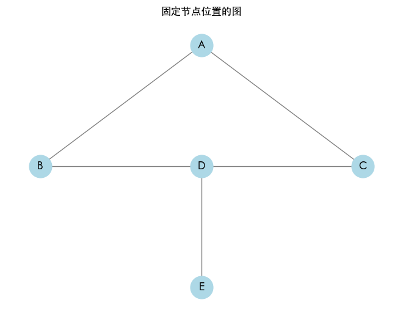

Python 在数据科学领域中扮演着重要角色，特别是在数据可视化方面。有效的数据可视化可以帮助我们更清晰地理解数据，发现模式，传达信息。本文将从数据可视化库的比较与选择、交互式可视化与静态图表的区别，以及图表设计原则与最佳实践等方面，深入探讨 Python 作图的工具与应用实践。


## 数据可视化

### 可视化库

在 Python 中，有多种数据可视化库可供选择，常见的包括：

- **Matplotlib**：一个强大的绘图库，适用于低级控制和静态图表。
- **Seaborn**：建立在 Matplotlib 之上，提供更加美观的默认设置和高级接口，适合进行统计图表绘制。
- **Plotly**：用于创建互动图形的库，支持多种复杂的图表。
- **Bokeh**：强调生成交互式可视化，适合用于大数据集。

### 特点对比

- **Matplotlib**：通过图形窗口和绘图上下文管理工具实现图形界面的管理，支持多种文件格式输出。它使用对象绘图（类似于“绘画”）的方式，因此具有高度的灵活性。
- **Seaborn**：通过 Matplotlib 将数据与图形的关系结合，更加侧重于数据统计，可自动计算统计量并整合到图形中。
- **Plotly**：基于 D3.js，使用 JSON 格式描述数据。它的核心是构建一个 JavaScript 控制的交互图，并通过 Python 接口进行操作。
- **Bokeh**：通过 Web 技术（HTML/JavaScript）实现图表，它的核心是添加交互工具，使用户可以对图像进行交互式操作，适合处理实时数据更新。

### 实例：绘制基本数据分布图

假设我们需要分析一个数据集的分布情况。

```python
# pip install matplotlib seaborn pandas
import pandas as pd
import seaborn as sns
import matplotlib.pyplot as plt

# 创建示例数据集
data = {
    'age': [22, 25, 20, 23, 21, 33, 28, 38, 30, 29, 27, 26],
    'salary': [50000, 60000, 55000, 58000, 52000, 80000, 65000, 70000, 72000, 68000, 61000, 69000]
}

df = pd.DataFrame(data)

# 使用 Seaborn 绘制散点图
sns.scatterplot(data=df, x='age', y='salary')
plt.title('Age vs Salary Distribution')
plt.show()
```


思考：创建一个包含年龄和薪资的数据框。使用 Seaborn 绘制散点图，帮助我们直观地理解年龄与薪资之间的关系。

### 评估维度

在选择适合的可视化库时，可以考虑以下维度：

- **易用性**：API 的直观性、文档完整性。
- **图形类型支持**：支持的图形种类及复杂程度。
- **性能**：在大数据集上的表现如何。
- **交互性和可定制性**：支持的自定义程度与交互设计。
- **社区支持**：社区的活跃程度以及可用的第三方插件或扩展。

如何选择合适的可视化库？首先思考数据的类型，以及你希望通过可视化传达什么信息。例如，如果你需要进行复杂的交互式分析，Plotly 或 Bokeh 更合适；而如果是快速制作静态报告，Matplotlib 和 Seaborn 可能更高效。

## 交互式可视化与静态图表

交互式可视化允许用户与图表进行交互，从而提高数据探索的深度。例如，用户可以缩放、平移图表，或通过悬停获得工具提示。而静态图表则是在创建后不允许修改的图形，通常用于固定报告或文档中。

- **交互式可视化**：通过动态生成图形实现，通常依赖于 JavaScript 技术。用户通过操作界面与数据实体进行交互。
- **静态图表**：生成一次即可完成的图形，多用于文档或展示，通常效率较高，在数据较小且稳定时使用。

### 实例：创建交互式折线图

使用 Plotly 创建一个交互式图表来监测时间序列数据。

```python
# pip install pandas numpy plotly
import pandas as pd
import numpy as np
import plotly.express as px

# 创建示例数据集
data = {
    'date': pd.date_range(start='2021-01-01', periods=100),
    'value': pd.Series(range(100)) + pd.Series(range(100)).apply(lambda x: np.random.randint(-10, 10))
}

df = pd.DataFrame(data)

# 使用 Plotly 绘制交互式折线图
fig = px.line(df, x='date', y='value', title='Interactive Line Chart')
fig.show()
```


创建一个时间序列数据。使用 Plotly 绘制交互式折线图，可以通过缩放、悬停查看数据点信息。

### 评估维度

评估交互式与静态可视化的适用性时，可以考虑：

- **用户体验**：交互性如何提升用户理解数据的能力。
- **性能**：在复杂数据集中，交互式可视化是否影响加载速度。
- **稳定性**：静态图表在长时间使用后是否依然有效，而交互式图表是否能有效实时更新。

思考：在什么情况下更倾向于使用交互式可视化？交互性能够有效提高数据探索的能力，尤其在展示复杂数据时。如何设计交互式图表以便易于理解和使用？关注用户交互的直观性和响应速度也是非常重要的。

## 实时数据可视化

实时数据可视化是指通过动态更新数据来展示当前的状态或趋势。这种可视化方式尤其在需要快速响应的场景（如监控系统、金融交易、大数据分析等）中极为重要。

- **数据流处理**：实时可视化需要处理数据流，通常使用合适的数据管道（如 Apache Kafka 或 Redis Streams）来接收和处理数据。
- **更新机制**：要有效地更新可视化的内容，通常使用 WebSockets 或类似的技术来实现客户端与服务器之间的实时通信。

### 实例：展示实时股票数据

使用 `Dash` 创建一个实时更新的股票价格图表。

```python
# pip install dash, yfinance, plotly
import dash
from dash import dcc, html
import dash.dependencies as dd
import pandas as pd
import plotly.graph_objs as go
import yfinance as yf

app = dash.Dash(__name__)

# 股票数据更新函数
def get_stock_data(ticker):
    data = yf.download(ticker, period='1d', interval='1m')
    return data

app.layout = html.Div([
    dcc.Input(id='stock-input', value='AAPL', type='text'),
    dcc.Graph(id='live-graph'),
    dcc.Interval(id='graph-update', interval=60000)  # 每60秒更新
])

@app.callback(
    dd.Output('live-graph', 'figure'),
    dd.Input('graph-update', 'n_intervals'),
    dd.Input('stock-input', 'value')
)
def update_graph(n, stock):
    df = get_stock_data(stock)
    figure = go.Figure(data=[go.Scatter(x=df.index, y=df['Close'], mode='lines+markers')])
    figure.update_layout(title=f'Live Stock Prices for {stock}', xaxis_title='Time', yaxis_title='Price')
    return figure

if __name__ == '__main__':
    app.run_server(debug=True)
```


使用 Dash 构建一个网页应用来展示实时股票价格。每分钟更新一次图表，通过 `yfinance` 获取股票数据，动态显示当前价格。

### 评估维度

评估实时数据可视化的有效性可考虑以下指标：

- **数据延迟**：从数据产生到可视化更新的延迟时间。
- **性能稳定性**：在高负载情况下可视化的稳定性和响应速度。

思考：在什么场景下实时可视化是必需的？怎样处理大数据量的实时流？怎样确保数据准确性和稳定性？这些都值得深入探讨和思考。

## 图表设计原则

图表设计原则包括清晰性、有效性和吸引力。这些原则旨在确保图表不仅能传达信息，还能引发观众的兴趣。

- **清晰性**：确保数据传达的信息无歧义，避免复杂的格式和过多的文本。
- **有效性**：使用合适的图表类型（如条形图、折线图、散点图等）来展示不同类别的数据，关注信息的准确性和完整性。
- **吸引力**：如何运用颜色、布局和字体等视觉元素，使图表更加吸引人。

### 实例：设计适合展示销售数据的条形图

```python
import pandas as pd
import matplotlib.pyplot as plt

# 创建示例销售数据
data = {
    'Product': ['A', 'B', 'C', 'D', 'E'],
    'Sales': [150, 80, 120, 200, 170]
}

df = pd.DataFrame(data)

# 绘制条形图
plt.bar(df['Product'], df['Sales'], color='skyblue')
plt.title('Sales by Product')
plt.xlabel('Product')
plt.ylabel('Sales')
plt.grid(axis='y', linestyle='--', alpha=0.7)
plt.show()
```


创建一个包含产品和销售数据的表。使用 Matplotlib 绘制简单的条形图，清晰展示每个产品的销售情况。

### 评估维度

衡量图表设计效果时，可以考虑：

- **观众理解水平**：设计是否能够让普通观众理解图表所表达的信息。
- **信息传递速度**：观众能在多快的时间内抓住数据的主要信息。

思考：如何提升图表的吸引力和专业性？探索多种颜色和样式，可以积极尝试数据标签和注释等增强信息传达的形式。同时，结合用户反馈，持续优化图表设计。

## 情境、目标与故事叙述

### 情境与目标

数据可视化的情境与目标是指在不同场景下，根据观众需求和数据类型选择合适的可视化方式。明确的目标能够指导有效的数据呈现，帮助观众迅速理解核心信息。

- **观众识别**：分析观众的背景、需求和知识水平，选择适合的图表类型与复杂程度。
- **数据类型**：不同的数据类型（定量、定性、时间序列等）适合不同的可视化方式。例如，时间序列数据可用折线图，分类数据可用条形图或饼图。

### 实例：展示销售绩效的仪表板

假设我们要为销售团队展示销售绩效，可以使用多个图表组合在一个仪表板中，以满足不同的信息需求。

```python
import matplotlib.pyplot as plt
import pandas as pd

# 创建示例数据
data = {
    'Month': ['Jan', 'Feb', 'Mar', 'Apr', 'May', 'Jun'],
    'Sales': [200, 300, 250, 400, 350, 500],
    'Profit': [50, 80, 60, 120, 100, 150]
}

df = pd.DataFrame(data)

fig, axs = plt.subplots(2, 1, figsize=(10, 10))

# 绘制销售图
axs[0].bar(df['Month'], df['Sales'], color='blue', alpha=0.7)
axs[0].set_title('Monthly Sales Performance')
axs[0].set_ylabel('Sales ($)')
axs[0].grid(axis='y')

# 绘制利润图
axs[1].plot(df['Month'], df['Profit'], marker='o', color='orange')
axs[1].set_title('Monthly Profit Performance')
axs[1].set_ylabel('Profit ($)')
axs[1].grid()

plt.tight_layout()
plt.show()
```


创建一个包含月份、销售和利润的 DataFrame。使用子图（subplot）组合条形图和折线图，直观展示销售和利润的关系。

### 评估维度

在选择合适的可视化时，可以考虑以下指标：

- **数据匹配度**：图形形式与数据类型的匹配程度。
- **观众反馈**：观众对信息传递的理解和反应。

思考：如何根据不同目标受众设计可视化？考虑不同受众的背景和需求，甚至可以进行用户调研，探索最能引起他们关注的可视化方式。如果是面向高管，可能需要更少的技术细节和更多的业务趋势；而技术团队则可能希望深入数据分析。

### 故事叙述

数据可视化不仅仅是展示信息，更是讲述一个故事。通过合理的设计和呈现，数据可以传达更深层次的信息和情感。

- **叙事结构**：有效的数据可视化往往具有明确的叙事结构，包括引入、发展和总结。
- **视觉引导**：通过色彩、位置和对比度等手段引导观众的注意力，帮助他们跟随故事发展。

### 实例：展示气候变化的影响

使用可视化讲述气候变化带来的影响，通过时间序列图展示温度的变化。

```python
import pandas as pd
import plotly.express as px

# 创建气候变化数据集
data = {
    'Year': [2000, 2001, 2002, 2003, 2004, 2005, 2006, 2007],
    'Temperature': [14.5, 14.7, 14.8, 15.1, 15.3, 15.5, 15.8, 16.0]
}

df = pd.DataFrame(data)

# 使用 Plotly 创建时间序列图
fig = px.line(df, x='Year', y='Temperature', title='Global Temperature Change Over Years', markers=True)
fig.update_traces(marker=dict(size=10))
fig.show()
```


创建一个包含年份和温度变化的数据集。使用 Plotly 绘制折线图，展示全球温度随年份变化的趋势，让观众直观感受到气候变化的影响。

### 评估维度

判断可视化叙事能力的指标包括：

- **信息传达有效性**：观众能否理解和记住信息。
- **情感共鸣**：是否能够引起观众的情感反应。

思考：如何通过数据可视化讲述更吸引人的故事？尝试结合更多的真实案例、情境故事和数据背景，帮助观众更好地理解数据背后的事情。同时，注意叙事风格，适度的幽默和情感共鸣能更深刻地影响观众。

## 跨平台和移动设备的可视化

跨平台可视化是指创建能够在多种设备（如桌面、手机、平板）上保持良好用户体验的可视化。移动设备的屏幕较小，因此需要特别设计以适应各种屏幕大小。

- **响应式设计**：使用 CSS 媒体查询和布局框架（如 Bootstrap）确保图表在不同分辨率上的兼容性。
- **交互优化**：在移动设备上优化触摸交互，确保用户体验流畅。

### 实例：创建适配移动设备的仪表盘

使用 Plotly Dash 创建一个简单的仪表盘，适配移动设备。

```python
import dash
from dash import dcc, html
import plotly.express as px
import pandas as pd

# 示例数据集
df = pd.DataFrame({
    'Fruit': ['Apples', 'Oranges', 'Bananas', 'Grapes'],
    'Amount': [4, 1, 2, 3],
})

app = dash.Dash(__name__)

app.layout = html.Div([
    html.H1('Fruit Sales'),
    dcc.Graph(
        figure=px.pie(df, values='Amount', names='Fruit', title='Fruit Sales Distribution'),
        responsive=True
    )
])

if __name__ == '__main__':
    app.run_server(debug=True)
```


使用 Dash 和 Plotly 创建一个简单的饼图，展示水果销售的分布。`responsive=True` 确保图表在移动设备上的可用性。

### 评估维度

在评估跨平台可视化时，可以考虑以下指标：

- **可访问性**：在多个设备上的可视化呈现质量。
- **响应速度**：用户与图表的交互响应时间。

思考：移动设备的可视化在商业应用中愈发重要，如何最大化用户体验？考虑在移动环境中简化信息展示，优先显示关键数据，并提供深度分析的功能。

## 应用：教育与培训

数据可视化在教育和培训中能够直观地传达复杂概念，帮助学生和受众更快理解和记忆。

- **教学辅助**：通过可视化工具，教师可以用更生动的方式解释概念，提升课堂的互动性。
- **主动学习**：学生可以通过动手实验和可视化工具自行探索数据，更深入地理解学习内容。

### 实例：使用可视化教学统计数据

利用 Matplotlib 和 Pandas 创建一个数据统计的可视化，帮助学生理解统计概念。

```python
import pandas as pd
import matplotlib.pyplot as plt

# 创建学生成绩数据
data = {
    'Student': ['Alice', 'Bob', 'Charlie', 'David', 'Eve'],
    'Score': [90, 85, 70, 60, 95]
}

df = pd.DataFrame(data)

# 绘制柱状图展示成绩
plt.bar(df['Student'], df['Score'], color='cyan')
plt.title('Student Scores')
plt.ylabel('Scores')
plt.xticks(rotation=45)
plt.grid(axis='y')
plt.show()
```


创建一个包含学生名字和成绩的数据框。使用 Matplotlib 绘制柱状图，提高学生对成绩分布的直观理解。

### 评估维度

在教育应用中的可视化评估可考虑：

- **学生理解度**：通过问卷或考试结果评估学生对概念的理解程度。
- **交互参与度**：学生在学习过程中使用可视化的频率。

思考：如何在教育中设计可视化以促进学习？结合教育心理学，如何使可视化内容更有吸引力和教育性？同时，考虑到不同学习风格的学生，如何设计多样化的可视化来增强学习体验？

### 技巧：固定图节点位置（networkx）

> 使用 networkx 作图时，如何让其中的点始终固定在一个位置？

在使用 `networkx` 进行图绘制时，可以使用 `pos` 参数来设置节点的位置。通过定义一个固定的位置字典，可以让节点始终保持在指定的位置。此外，可以在 `nx.draw()` 中传递这个位置字典来实现。

### 示例：固定图节点位置

**定义节点的位置**，使用字典将每个节点的名称映射到其坐标。**在绘图时使用这个位置字典**。

以下是一个示范代码，展示如何将节点固定在指定位置：

```python
import matplotlib.pyplot as plt
import networkx as nx

# 创建图
G = nx.Graph()

# 添加边
edges = [
    ('A', 'B'),
    ('A', 'C'),
    ('B', 'D'),
    ('C', 'D'),
    ('D', 'E'),
]

G.add_edges_from(edges)

# 定义每个节点的位置
pos = {
    'A': (0, 1),
    'B': (-1, 0),
    'C': (1, 0),
    'D': (0, 0),
    'E': (0, -1)
}

# 绘制图形
nx.draw(G, pos, with_labels=True, node_color='lightblue', node_size=700, font_size=12, font_weight='bold', edge_color='gray')

# 设置图形标题
plt.title("固定节点位置的图")
plt.show()
```

可以根据实际需要自定义节点的位置和布局。如果图较复杂，可以使用其他布局算法生成位置字典，并在此基础上进行调整。



- **创建图**：通过 `nx.Graph()` 创建无向图对象。
- **添加边**：使用 `add_edges_from()` 方法添加边。
- **定义位置**：在 `pos` 字典中为每个节点指定坐标。例如，节点 `A` 的位置为 `(0, 1)`，节点 `B` 的位置为 `(-1, 0)`。
- **绘图**：使用 `nx.draw()` 并将 `pos` 字典作为参数，通过 `with_labels=True` 使节点显示标签。

运行以上代码将生成一个图，其中每个节点都固定在指定位置。

## 道德与伦理

在数据可视化过程中，涉及到数据的选择、呈现和解释，因而数据的道德与伦理显得尤为重要。有效的可视化需要避免误导与偏见。

- **数据选择与透明度**：选择何种数据进行可视化，以及如何清楚地展示数据来源。
- **避免操纵**：操作数据或呈现方式以引导观众得出特定结论是一种不道德的做法。

### 实例：展示健康数据的伦理问题

考虑展示健康数据的可视化，尤其是涉及敏感话题，如种族、性别等。

```python
import pandas as pd
import matplotlib.pyplot as plt

# 创建健康数据示例
data = {
    'Group': ['A', 'B', 'C', 'D'],
    'HealthScore': [88, 70, 76, 90]
}

df = pd.DataFrame(data)

# 绘制条形图
plt.bar(df['Group'], df['HealthScore'], color=['blue', 'orange', 'green', 'red'])
plt.title('Health Score by Group')
plt.ylabel('Health Score')
plt.grid(axis='y', linestyle='--', alpha=0.7)
plt.show()
```


创建一个包含不同群体健康评分的数据集。通过条形图展示不同群体的健康评分。

### 评估维度

可视化的伦理性可以通过以下指标来衡量：

- **准确性**：信息传递的真实性和可靠性。
- **偏见识别**：是否能够识别数据中潜在的偏见与歧视。

思考：数据可视化者需要承担什么样的道德责任？在选择可视化内容时，如何确保不误导观众？在处理敏感数据时，保持透明度和中立性是至关重要的。学习识别和避免常见的数据陷阱，有助于提升数据呈现的可信度。

## 结语

Python 作图是数据分析与可视化的重要环节，通过选择合适的工具、理解交互性与静态图表的差异，以及遵循图表设计原则，可以极大地提升数据解读能力和信息传达的效果。

数据可视化在不同领域的应用正在不断扩展，是一个不断发展和演变的领域，从实时数据监控到教育培训，每个场景都影响着数据分析、商业决策和公众理解，有其特殊的需求与目标。综合实时数据可视化、跨平台适应性、以及教育应用等不同层面，能更全面地理解数据可视化的广泛应用及其潜在价值。随着技术的进步，数据可视化将继续在更广泛的领域提供帮助和支持。

通过深入分析可视化的情境与目标、叙事能力以及道德与伦理，能够更全面地理解数据可视化的意义与价值，实现更有效的数据呈现和应用。通过不断实践与总结，在一定程度上掌握数据可视化的精髓，为数据驱动的决策做出更大的贡献。

---

**PS：感谢每一位志同道合者的阅读，欢迎关注、点赞、评论！**
