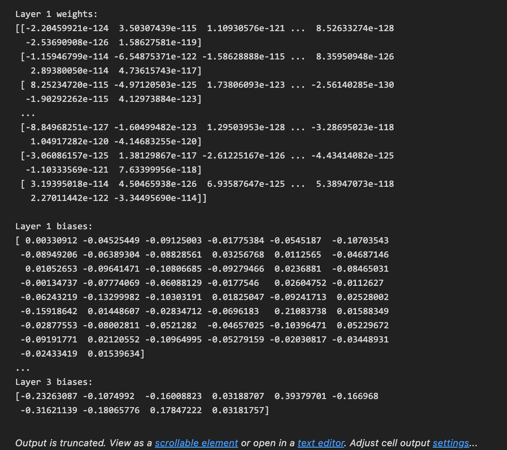

## 引言

在 Python 编程中，有一些常用技巧和最佳实践可以帮助你编写更优雅、更高效的代码。本文将介绍的是 Python 中使用 `Scikit-Learn` 下载 `MNIST` 数据，并训练模型，序列化模型、`MLPClassifier` 模型的参数查看、MLPClassifier 的`激活函数`及其实现、从 `pandas.core.frame.DataFrame` 中获取数据等。


## Scikit-Learn 下载 MNIST 数据、训练模型、序列化模型

下面是使用 `Scikit-Learn` 下载 `MNIST` 数据集并训练一个具有 3 层（2 个隐层，其中第 1 层有 50 个神经元，第 2 层有 100 个神经元）的神经网络模型的示例。

### 安装依赖库

确保已经安装 `scikit-learn` 和 `numpy`。可以使用以下命令安装：

```bash
pip install scikit-learn numpy
```

### 训练模型

```python
from sklearn.datasets import fetch_openml
from sklearn.model_selection import train_test_split
from sklearn.neural_network import MLPClassifier
from sklearn.metrics import classification_report, accuracy_score

# 下载 MNIST 数据集
mnist = fetch_openml('mnist_784', version=1)
X, y = mnist.data, mnist.target

# 将目标标签转换为整数
y = y.astype(int)

# 拆分数据集为训练和测试集
X_train, X_test, y_train, y_test = train_test_split(X, y, test_size=0.2, random_state=42)

# 初始化并训练神经网络模型
model = MLPClassifier(hidden_layer_sizes=(50, 100), max_iter=20, random_state=42)
model.fit(X_train, y_train)

# 进行预测
y_pred = model.predict(X_test)

# 输出结果
print(f"准确率: {accuracy_score(y_test, y_pred)}")
print(classification_report(y_test, y_pred))
```

运行上述代码后，程序将训练一个 3 层的神经网络模型，并输出测试集的准确率和分类报告，从而给出模型的性能评估。

```python
准确率: 0.9499
              precision    recall  f1-score   support

           0       0.97      0.99      0.98       980
           1       0.98      0.98      0.98      1135
           2       0.95      0.95      0.95      1032
           3       0.93      0.93      0.93      1010
           4       0.97      0.92      0.94       982
           5       0.95      0.93      0.94       892
           6       0.97      0.96      0.96       958
           7       0.97      0.94      0.96      1028
           8       0.91      0.95      0.93       974
           9       0.91      0.95      0.93      1009

    accuracy                           0.95     10000
   macro avg       0.95      0.95      0.95     10000
weighted avg       0.95      0.95      0.95     10000
```

可以根据需要调整超参数（例如 `max_iter`）以优化模型的性能。

**依赖库与模块**

- `numpy` 用于处理数组。
- `fetch_openml` 用于加载 MNIST 数据集。
- `train_test_split` 用于将数据集拆分为训练集和测试集。
- `MLPClassifier` 用于构建和训练多层感知机（MLP）。
- `classification_report` 和 `accuracy_score` 用于评估模型的表现。

**MNIST 数据集**

- 使用 `fetch_openml` 函数从 OpenML 下载 MNIST 数据集。
- 数据集包含 784 个特征（28x28 像素图像展平），目标标签为手写数字（0-9）。
- 使用 `train_test_split` 将数据集拆分为 80% 的训练集和 20% 的测试集。

**构建和训练模型**

- 创建一个 `MLPClassifier` 实例，其中 `hidden_layer_sizes=(50, 100)` 表示第 1 层有 50 个神经元，第 2 层有 100 个神经元。
- 使用 `max_iter=20` 指定最大迭代次数（你可以按需调整此参数）。

**评估模型**

- 使用训练好的模型对测试集进行预测。
- 输出准确率和分类报告，详细展示每个类别的精确度、召回率等性能指标。

## MLPClassifier 模型的参数查看

在使用 `Scikit-Learn` 训练模型后，可以直接获取和查看模型的权重参数。对于不同类型的模型，权重的属性和结构有所不同。以下是如何查看 `MLPClassifier`（多层感知机）的权重参数的示例步骤。

### 使用 `MLPClassifier` 训练模型

`MLPClassifier` 是一种常用的神经网络模型。以下是一个简单的例子，展示如何获取模型的权重参数。

```python
import numpy as np
from sklearn.datasets import fetch_openml
from sklearn.model_selection import train_test_split
from sklearn.neural_network import MLPClassifier

# 下载 MNIST 数据集
mnist = fetch_openml('mnist_784', version=1)
X, y = mnist.data, mnist.target
y = y.astype(int)

# 拆分数据集为训练和测试集
X_train, X_test, y_train, y_test = train_test_split(X, y, test_size=0.2, random_state=42)

# 初始化并训练神经网络模型
model = MLPClassifier(hidden_layer_sizes=(50, 100), max_iter=20, random_state=42)
model.fit(X_train, y_train)

# 查看模型的权重参数
weight_params = model.coefs_
bias_params = model.intercepts_

# 打印权重和偏置
for layer in range(len(weight_params)):
    print(f"Layer {layer + 1} weights:\n{weight_params[layer]}\n")
    print(f"Layer {layer + 1} biases:\n{bias_params[layer]}\n")
```

运行上述代码后，将查看到下图所示每一层的权重和偏置参数。这些参数是神经网络学习到的内容，并可以用于分析或后续应用。



上述代码下载了 MNIST 数据集，并将其拆分为训练集和测试集。然后使用 `MLPClassifier` 训练模型，指定两个隐层的神经元数量（50 个和 100 个）。

**模型参数**

- `model.coefs_`：这是一个列表，包含每层神经网络的权重矩阵。每个矩阵表示连接到下一个层的权重。
- `model.intercepts_`：这是一个列表，包含每层的偏置参数。

使用循环迭代每层的权重与偏置信息，打印出每一层的权重参数（`weights`）和偏置（`biases`）。

权重和偏置参数的形状取决于网络架构。例如，在上述示例中，第 1 层有 50 个神经元，第 2 层有 100 个神经元，因此第 1 层的权重矩阵将具有形状 `(784, 50)`，而第 2 层的权重矩阵将具有形状 `(50, 100)`。

可以根据需要进一步分析和可视化这些权重参数，以深入理解模型行为。

## MLPClassifier 的激活函数，分别如何实现？

在 `Scikit-Learn` 的 `MLPClassifier` 模块中，各层的激活函数是可以被配置的，但其默认的激活函数是 `relu`（修正线性单元）用于隐含层，而输出层使用的是 `softmax` 函数，具体依赖于任务类型（如多分类）。

### ReLU (修正线性单元)

ReLU 函数的公式为：

$$
    f(x) = \max(0, x)
$$

在 Python 中可以用以下方式实现：

```python
def relu(x):
    return np.maximum(0, x)

# 示例使用
import numpy as np
input_data = np.array([-1, 0, 1, 2])
output = relu(input_data)
print(output)
# 输出: [0 0 1 2]
```

### Softmax

Softmax 函数的公式为：

$$
    f(x_i) = \frac{e^{x_i}}{\sum_{j} e^{x_j}}
$$

Softmax 函数将输入转换为概率分布，适用于多分类问题。实现如下：

```python
def softmax(x):
    e_x = np.exp(x - np.max(x))  # 减去最大值是为了数值稳定
    return e_x / e_x.sum(axis=0)

# 示例使用
input_data = np.array([1.0, 2.0, 3.0])
output = softmax(input_data)
print(output)
# 输出: 概率分布
```

### MLPClassifier 的激活函数

以下代码示例展示了如何使用 `MLPClassifier` 并指定激活函数：

```python
from sklearn.neural_network import MLPClassifier
from sklearn.datasets import make_classification
from sklearn.model_selection import train_test_split

# 创建示例数据
X, y = make_classification(n_samples=100, n_features=20, n_classes=3, n_informative=3, random_state=42)

# 拆分数据集
X_train, X_test, y_train, y_test = train_test_split(X, y, test_size=0.2, random_state=42)

# 初始化 MLPClassifier，默认为 'relu' 激活函数
model = MLPClassifier(hidden_layer_sizes=(50,), activation='relu', max_iter=1000, random_state=42)
model.fit(X_train, y_train)

# 进行预测
predictions = model.predict(X_test)
print(predictions)
# 输出: [2 2 0 0 1 1 2 2 2 2 0 0 0 1 0 2 0 0 1 2]
```

`MLPClassifier` 默认在隐含层使用 `relu` 激活函数，而输出层使用 `softmax` 函数。可以通过参数配置来使用其他激活函数（如 `logistic`, `tanh` 等）。自定义激活函数可以通过实现相应的数学公式来完成。

## 从 pandas.core.frame.DataFrame 中获取指定行数据

在 `pandas` 中，可以通过多种方式从 `DataFrame` 获取指定行数据，下面是一些常见的方法。

### 示例数据

首先，创建一个简单的 DataFrame：

```python
import pandas as pd

# 创建示例 DataFrame
data = {
    'Name': ['Alice', 'Bob', 'Charlie'],
    'Age': [25, 30, 35],
    'City': ['New York', 'Los Angeles', 'Chicago']
}

df = pd.DataFrame(data)
print(df)
```

输出：

```python
      Name  Age         City
0    Alice   25     New York
1      Bob   30  Los Angeles
2  Charlie   35      Chicago
```

### 使用 `.iloc` 按位置获取

`iloc` 是一个用于按整数位置（索引）获取行的选择器。

```python
# 获取第一行（索引为0）
first_row = df.iloc[0]
print(first_row)
```

输出：

```python
Name         Alice
Age             25
City      New York
Name: 0, dtype: object
```

### 使用 `.loc` 按标签获取

使用 `.loc` 可以根据行标签（索引）获取特定行。

```python
# 假设设置了行标签
df.index = ['a', 'b', 'c']  # 设置自定义索引

# 获取行标签为 'a' 的行
row_a = df.loc['a']
print(row_a)
```

输出：

```python
Name         Alice
Age             25
City      New York
Name: a, dtype: object
```

### 使用条件筛选

如果想根据某一列的条件来获取行，比如选择年龄大于 28 的行，可以这样做：

```python
# 获取年龄大于28的行
age_above_28 = df[df['Age'] > 28]
print(age_above_28)
```

输出：

```python
      Name  Age         City
1      Bob   30  Los Angeles
2  Charlie   35      Chicago
```

根据实际需求，可以选择合适的方法来获取 DataFrame 中的一行数据：

- 使用 `.iloc` 根据行的整数位置获取特定行数据。
- 使用 `.loc` 根据行标签获取特定行数据。
- 使用条件筛选获得满足特定条件的行。

## 结语

本文介绍了 Python 中的 `Scikit-Learn` 及其 `MLPClassifier` 模块、`pandas` 的 `DataFrame` 等的一些特定用法，希望这些小技巧能在某个特定的时间正好帮到你。

---

**PS：感谢每一位志同道合者的阅读，欢迎关注、点赞、评论！**
