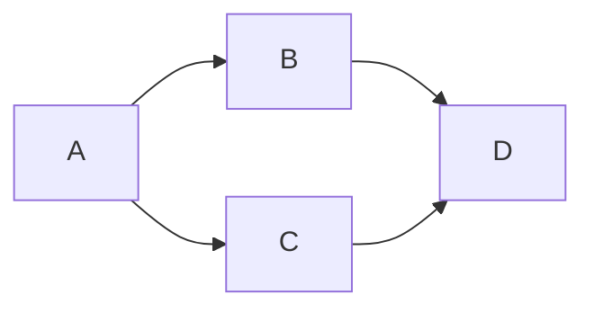

## 引言

在 Python 编程中，有一些常用技巧和最佳实践可以帮助你编写更优雅、更高效的代码。本文将介绍的是 Python 中 `defaultdict` 的分组作用、`random` 在随机选取中的实践、使用 `networkx` 作图时，如何令图中的点一直保持相同的位置（不需要自行指定点的位置）、`logging.basicConfig` 的参数含义、`SQLAlchemy` 执行任意 SQL 等。


## Markdown 语法

Markdown 是一种轻量级的标记语言，通常用于格式化文本。它易于阅读和编写，被广泛用于撰写文档、博客、电子邮件等。以下是 Markdown 的基本语法介绍。

### 1. 标题

使用 `#` 字符来表示标题的等级。`#` 的数量表示标题的级别，从 H1 到 H6。

```markdown
# H1

## H2

### H3

#### H4

##### H5

###### H6
```

### 2. 段落和换行

段落通过空行分隔。若要在段落内换行，可以在行末添加两个空格，然后按 Enter。

```markdown
这是第一段。

这是第二段。
```

使用两个空格换行：

```markdown
这是第一行。  
这是第二行。
```

### 3. 强调

使用星号或下划线进行强调。

- **斜体**：用一个星号或一个下划线包围文本。

```markdown
_斜体_ 或 _斜体_
```

- **粗体**：用两个星号或两个下划线包围文本。

```markdown
**粗体** 或 **粗体**
```

- **粗斜体**：用三个星号或三个下划线包围文本。

```markdown
**_粗斜体_** 或 **_粗斜体_**
```

### 4. 列表

#### 无序列表

使用星号、加号或减号来创建无序列表。

```markdown
- 项目 1
- 项目 2
  - 子项目 1
  - 子项目 2

* 项目 A
* 项目 B
```

#### 有序列表

使用数字与点来创建有序列表。

```markdown
1. 第一项
2. 第二项
   1. 子项 1
   2. 子项 2
```

### 5. 链接

创建链接时，使用方括号表示文本，后接圆括号表示 URL。

```markdown
[OpenAI](https://www.openai.com)
```

### 6. 图片

插入图片的语法与链接类似，前面加一个感叹号。

```markdown

```

### 7. 引用

使用 `>` 符号创建引用文本。

```markdown
> 这是一段引用。
```

### 8. 代码

#### 行内代码

使用反引号（`）包围代码片段。

```markdown
这是 `行内代码` 示例。
```

#### 代码块

使用三个反引号（```）来创建代码块，可以指定语言以实现语法高亮。

````markdown
```python
def hello():
    print("Hello, World!")
```
````

### 9. 水平线

使用三个或更多的星号、减号或下划线创建水平线。

```markdown
---
```

### 10. 表格

使用管道符（|）创建表格。第一行为表头，第二行用短横线分隔。

```markdown
| 姓名  | 年龄 |
| ----- | ---- |
| Alice | 24   |
| Bob   | 30   |
```

### 小结

Markdown 是一种方便实用的文档格式化工具，具备易于阅读和书写的特点。以上是 Markdown 基础语法，涵盖了标题、段落、列表、链接、图片、引用、代码、水平线和表格等重要部分。掌握这些基本语法后，您可以灵活地创建各种格式的文档。

---

除了之前提到的基础语法，Markdown 还有一些其他的语法和扩展功能，可以帮助你进一步丰富文档的格式。以下是一些额外的基础语法：

### 11. 任务列表

使用方括号来创建任务列表，未完成的任务用 `[ ]` 表示，完成的任务用 `[x]` 表示。

```markdown
- [ ] 未完成的任务
- [x] 已完成的任务
```

### 12. 删除线

使用两个波浪号 (`~~`) 来表示删除线。

```markdown
这是一个 ~~删除线~~ 示例。
```

### 13. 表情符号

某些 Markdown 渲染器支持插入表情符号。通常使用冒号包围文本。

```markdown
:D :smile: :star:
```

### 14. 字体颜色和背景色（可能需要特定的渲染器支持）

Markdown 本身不支持字体或背景颜色，但某些平台（如 GitHub 或 Markdown 渲染器）可能会允许扩展语法。

```markdown
<font color="red">这是红色的文本</font>
```

### 15. 块引用与多层嵌套引用

可以在引用中的引用。

```markdown
> 这是外层引用。
>
> > 这是内层引用。
```

### 16. 自定义链接（锚点链接）

可以创建指向文档中某个具体部分的链接。

```markdown
[链接到标题](#标题)

## 标题
```

### 17. 数学公式（需要支持的渲染器）

对于需要显示数学公式的 Markdown 渲染器，可以使用 LaTeX 语法。

```markdown
$$
E = mc^2
$$
```

### 18. 行内图表

在支持的环境中，你可以嵌入图表或流程图，例如使用 Mermaid 语法。

````markdown

````

````

### 19. 图像的链接

图像可以作为链接使用。

```markdown
[](https://example.com)
````

### 20. 嵌套列表

可以组合有序列表和无序列表创建嵌套列表。

```markdown
1. 第一项
   - 子项 A
   - 子项 B
2. 第二项
```

### 小结

这些额外的基础语法补充了 Markdown 的功能，使得 Markdown 文档可以更加灵活和丰富。不同的 Markdown 渲染器可能支持不同的扩展和语法，因此在使用时应注意相应的文档和渲染器。

---

除了之前提到的基础语法，Markdown 中还有一些较少提及但有用的语法。以下是一些额外的 Markdown 语法：

### 21. 表情符号

在某些 Markdown 渲染器中，表情符号可以通过文字代号插入，例如：

```markdown
:smile: :heart: :thumbsup:
```

### 22. 样式的嵌套

可以在同一文本中组合使用多种样式。例如，粗体和斜体。

```markdown
这是 **_加粗且斜体_** 的文本。
```

### 23. 删除线

通过使用两个波浪号来表示删除文本。

```markdown
这是一个 ~~删除线~~ 示例。
```

### 24. 自定义脚注（部分支持）

某些 Markdown 渲染器支持脚注，可以在文本中添加额外的解释。

```markdown
这是一个示例文本[^1]。

[^1]: 这是脚注内容。
```

### 25. 识别文件类型（代码块）

在代码块中，可以通过在反引号后指定语言类型来启用语法高亮。

````markdown
```javascript
function hello() {
  console.log('Hello, world!');
}
```
````

````

### 26. 段落间距

虽然 Markdown 默认会通过空行分隔段落，但有些渲染器也允许使用 `<br>` 标签来手动添加段落间距或换行。

```markdown
这是第一行。<br>
这是第二行。
````

### 27. HTML 标签支持

Markdown 通常支持某些 HTML 标签，你可以在 Markdown 文档中直接插入 HTML。

```markdown
<p>这是一个段落。</p>
<div>这是一个 div 块。</div>
```

### 28. 交互式元素（仅在某些平台有效）

一些 Markdown 渲染器（如 Jupyter Notebook）允许嵌入交互式元素。

```markdown
[按钮](https://example.com)
```

### 29. 目录生成（依赖平台支持）

在某些支持扩展语法的平台上，Markdown 文档中可以自动生成目录。

```markdown
## 目录

- [第一节](#第一节)
- [第二节](#第二节)
```

### 30. 偏移文本或代码块

有些 Markdown 渲染器允许偏移文本或代码块，以便以指定格式显示。

```markdown
    这是一个偏移的代码块。
```

### 小结

这些额外的语法使 Markdown 更加灵活，允许用户实现更多的格式化和布局需求。在实际使用中，请参考特定 Markdown 渲染器的文档，以确保支持相应的功能。

---

在 Markdown 中，除了已经提到的内容，实际上还有一些其他的语法和功能扩展。不过，Markdown 的核心语法相对简单，我会说明一些不太常见但仍然实用的部分。

### 31. 嵌入式 HTML

你可以在 Markdown 文档中嵌入标准 HTML，这样可以使用 HTML 提供的格式化选项。

```markdown
<div style="color: red;">这是一个红色的文本。</div>
```

### 32. 选项卡（在某些平台支持）

一些 Markdown 渲染器支持选项卡或折叠内容。通常这是平台特有的扩展。

```markdown
<details>
<summary>点击展开</summary>
这里是折叠的内容。
</details>
```

### 33. 使用说话者的姓名

在某些 Markdown 渲染器中，可以以某种格式标记说话者的姓名或角色（例如，在撰写剧本时）。

```markdown
**角色名**: 这是角色的台词。
```

### 34. 纵向列表

在一些支持的 Markdown 编辑器中，可以通过创建多个并列的无序列表实现纵向布局。

```markdown
- Item 1
- Item 2
- Item 3

- Item A
- Item B
```

### 35. 代码行高亮（特定平台支持）

某些 Markdown 平台提供用于代码高亮的标签或标记。

````markdown
```python
print("Hello, world!")
```
````

````

### 36. 颜色相关的文本

某些扩展将颜色支持引入 Markdown（需要所用平台支持）。

```markdown
<span style="color: blue;">这是蓝色的文本</span>
````

### 37. 反转文本

一些 Markdown 编辑器支持反向文本功能（翻转字符串）。

```markdown
![[反向文本]]
```

### 38. 结合 CSS 样式（部分平台支持）

允许结合 CSS 样式设计，如字体、颜色、背景等（在合适的环境中）。

```markdown
<style>
body {font-family: Arial;}
</style>
```

### 39. 使用数学公式

在许多 Markdown 编辑器中，支持使用 LaTeX 语法来插入数学公式，尤其是在学术相关平台上。

```markdown
$$
E = mc^2
$$
```

### 40. 自定义编码语法

某些平台允许自定义符号或编码作为语法的一部分。

```markdown
```markdown
这是一个自定义代码块。
```
```

### 小结

以上是 Markdown 中的一些额外语法，这些语法在标准 Markdown 中并不常见，但在特定的环境或平台上可能会被支持。由于 Markdown 的核心是简单易读，多数语法也遵循自然书写的直观形式。在使用时，最好查看特定平台的文档，以确认支持的语法和功能。随着 Markdown 生态的丰富性增强，特定的扩展和用法也在不断增加。

---

在 Markdown 的核心语法中，已经涵盖了许多基本功能。然而，随着 Markdown 渲染器的不断发展，可能还有一些额外的语法或用法不是非常常见，但依然值得提及。以下是一些额外的 Markdown 功能和语法，这些功能可能在某些平台上得到支持：

### 41. 椭圆文本

在某些平台上，你可以使用波浪线或其他符号进行可视化效果。

```markdown
~~这是被划掉的文本~~
```

### 42. 嵌入式媒体

在一些 Markdown 渲染器中，可以嵌入视频和音频。

```markdown
[](http://www.youtube.com/watch?v=视频ID)
```

### 43. 链接标题

在 Markdown 中，你可以为链接添加标题属性，用于提供更多信息。

```markdown
[链接文本](https://example.com '可选标题')
```

### 44. 自定义 ID 进行锚点链接

可以为某些标题添加自定义 ID 以实现更灵活的链接。

```markdown
## 自定义标题 {#custom-id}
```

使用时链接到：

```markdown
[链接到自定义标题](#custom-id)
```

### 45. 脚注的另一种实现

有些 Markdown 渲染器支持不同格式的脚注。

```markdown
文本内容[^footnote]

[^footnote]: 这是脚注内容。
```

### 46. 文本方向

某些 Markdown 渲染器可能支持设置文本方向。

```markdown
<div dir="rtl"> 这是从右到左的文本。 </div>
```

### 47. 定义列表（在一些扩展中）

定义列表通过组合缩进和冒号，可在特定的 Markdown 渲染器中使用。

```markdown
术语 1
: 这是术语 1 的定义。

术语 2
: 这是术语 2 的定义。
```

### 48. 选择性解释列表

在某些平台上，可以通过在行末添加特定标记实现选择性解释。

```markdown
- 项目 1
- 项目 2 # 这是项目 2 的解释。
```

### 49. 文件上传和拖拽功能

一些 Markdown 编辑器支持文件上传和拖拽（如 GitHub、Typora 等）。

### 50. 右侧浮动和左侧浮动

在某些特定的平台实现中，你可以使用浮动文本。

```markdown
<div style="float: left;">左侧浮动的文本</div>
<div style="float: right;">右侧浮动的文本</div>
```

### 小结

Markdown 的基本语法相对简单，主要是为了易于撰写和阅读。以上列出的一些额外语法和扩展功能可能在特定平台或环境中被支持，利用这些功能可以实现更多的展示效果。在使用时，建议查阅具体 Markdown 渲染器的文档，以确保了解其支持的所有功能和语法。

---

在 Markdown 的核心和常见扩展中，已经涵盖了很多基础语法，但 Markdown 的灵活性允许许多新的用法和功能。以下是一些额外的语法和功能，这些可能很少提到或并不常见，但在某些特定环境和工具中可能得到支持。

### 51. 交叉引用

在支持的环境中，你可以通过文档内部的引用来方便地链接到不同部分。

```markdown
## 第一部分 {#section1}

这里是第一部分。

## 第二部分 {#section2}

请查看[第一部分](#section1)。
```

### 52. 嵌套列表的样式

虽然通常嵌套列表只需使用缩进，但是在某些渲染器中，可以通过其他符号（如“\*”和“+”）来改变样式。

```markdown
- 无序列表
  - 嵌套项
- 另一个无序列表
```

### 53. 引用多段文本

可以在多段文本之间嵌入引用，以增强可读性。

```markdown
> 这是第一个引用段落。

> 这是第二个引用段落，可以继续。

> > 这是嵌套的引用。
```

### 54. 数据表的多列对齐

在 Markdown 表格中，可以通过冒号设置对齐方式。

```markdown
| 左对齐 | 中间对齐 | 右对齐 |
| :----- | :------: | -----: |
| 数据 1 |  数据 2  | 数据 3 |
```

### 55. 字数和字符计数

在某些 Markdown 编辑器中，可以提供字数和字符计数的功能进行统计显示。

### 56. 笔记和重要提示

在一些编辑器中，可以使用特定的标记来创建提示框或备注。

```markdown
> **注意:** 这里是一个重要的提示。
```

### 57. 代码高亮

除了指定语言外，某些环境还支持在代码块中使用指定格式。

````markdown
```html
<!DOCTYPE html>
<html>
  <head>
    <title>Document</title>
  </head>
  <body></body>
</html>
```
````

````

### 58. 目录生成

某些平台允许通过特定标记生成目录。

```markdown
# TOC
````

### 59. 动态内容插入

在某些 Markdown 渲染器上，可以通过动态内容插入功能引入外部数据。

### 60. 自定义 Markdown 解析器

一些应用允许用户定义自定义的 Markdown 解析器，以添加自己的语法。

### 小结

Markdown 语法虽然相对简单，但由于其广泛的应用场景和灵活性，各种工具和平台可能会引入新的扩展和用法。这些额外的功能和语法选项为用户提供了更大的灵活性，让他们能够以各种方式编写和格式化文档。在使用特定的 Markdown 渲染器时，检查其文档可以获取关于所有支持的语法和功能的最新信息。

---

Markdown 是一种简单的标记语言，其基础语法可能已经涵盖了许多常见的功能。然而，随着 Markdown 的演变，尤其是在不同渲染器中的应用，可能还有一些更少见的用法和功能。这里列出了一些额外的基础语法和功能：

### 61. 斜体与粗体的组合

在某些 Markdown 解析器中，可以在同一文本中同时使用斜体和粗体。

```markdown
**_这是粗斜体_**
```

### 62. 行内脚注的扩展

除了传统脚注外，某些平台可能支持行内脚注。

```markdown
行内文本[^1]，并可以解释[^1]: 这是脚注内容。
```

### 63. 自定义样式（通过 HTML）

在一些 Markdown 编辑器中，可以使用 HTML 自定义样式，例如背景色或字体样式。

```markdown
<span style="background-color: yellow;">高亮文本</span>
```

### 64. 特定符号的使用

使用特定符号可以实现特定格式，例如添加星星评分。

```markdown
⭐️⭐️⭐️⭐️⭐️
```

### 65. 嵌入 PDF 或其他文件

某些平台支持直接嵌入或链接到 PDF 文件等。

```markdown
[PDF 文档](path/to/file.pdf)
```

### 66. 图片的链接和压缩

在某些渲染器中，图片可以通过压缩实现更为灵活的图像处理。

```markdown

```

### 67. 使用 'Em' 标签

普通的 Markdown 不支持 'Em' 标签，但在许多 HTML 支持的环境中，可以直接使用。

```markdown
<em>这是斜体文本</em>
```

### 68. 按钮或链接样式

某些 Markdown 编辑器允许使用自定义样式的按钮或链接。

```markdown
[按钮](https://example.com){: .btn}
```

### 69. 版本控制信息

一些 Markdown 渲染器（如 GitHub）允许插入 Git 版本控制相关信息。

```markdown
# 此文档版本: 1.0
```

### 70. 嵌入 GIF 动画

许多平台允许插入 GIF 动画与普通图片相同的方式。

```markdown

```

### 小结

这些额外的语法和功能展示了 Markdown 的灵活性和适应性。虽然核心语法是简单明了的，但在某些平台上，Markdown 的功能得到了扩展以满足更复杂的需求。在实际使用中，建议查阅特定 Markdown 渲染器的文档，了解其支持的所有功能和语法选项。随着不同工具的发展，更多的语法和机会也可能不断涌现。

---

Markdown 的基础语法相对简单，涵盖了文本格式化的核心功能。在已有的语法基础上，下面是一些可能不太常见但仍然有用的扩展和用法，这些语法可能在特定的平台上得到支持：

### 71. 嵌入在线图表

在某些平台上，可以通过 Markdown 嵌入在线图表或可视化工具。

```markdown

```

### 72. 文本变色（部分平台支持）

在支持 HTML 的平台上，可以使用 CSS 样式给文本着色。

```markdown
<span style="color:red;">这是红色文本</span>
```

### 73. Html5 的评论

通过 HTML 注释可以添加注释文本，Markdown 将不会渲染这些注释。

```markdown
<!-- 这是一条注释 -->
```

### 74. 使用脚注链接

在脚注中可以加入更多信息并通过链接导入外部参考。

```markdown
这是一个引用[^1]。

[^1]: [Click here](https://example.com) for more information.
```

### 75. 引用区块的特殊样式

在某些实现中，可以使用不同的标记来格式化引用块。

```markdown
> 引用内容
>
> > 嵌套引用
```

### 76. 用于草稿或备注的文本

通过某些平台特有的函数插入“草稿”或备注文本。

```markdown
{#draft} 这是一条草稿信息，即将修改。
```

### 77. 复杂的定制表格

在某些 Markdown 编辑器中，可以创建更复杂的表格，包括合并单元格。

```markdown
| 表头 1 | 表头 2     | 表头 3 |
| ------ | ---------- | ------ |
| 单元格 |            | 单元格 |
| 单元格 | 单元格合并 | 单元格 |
```

### 78. ESP (Embedded Script Programming)

某些平台可能允许在 Markdown 中嵌入代码片段并执行。

````markdown
```python
print("Hello World!")
```
````

````

### 79. Emoji 表情

在支持的环境中，Markdown 可以用特定的符号插入 Emoji。

```markdown
:smile: :thumbsup:
````

### 80. 交互式内容

在支持 Markdown 的环境中，可以创建交互式元素，如按钮、下拉菜单等。

```markdown
[点击这里](https://example.com) 来获得更多信息
```

### 小结

这些额外的基础语法和功能在一些 Markdown 渲染器中可能实现，尽管它们不被广泛使用，但却能为特定场景提供便利。当使用 Markdown 时，了解特定平台所支持的全部语法和功能，可以更有效地利用 Markdown 进行文档编写和格式化。在使用时，参考所使用的 Markdown 渲染器的文档以确保正确使用。

---

**PS：感谢每一位志同道合者的阅读，欢迎关注、点赞、评论！**
