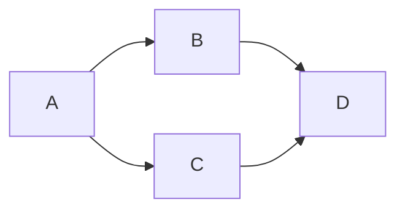

## 引言

Markdown 是一种轻量级的标记语言，通常用于格式化文本。它易于阅读和编写，被广泛用于撰写文档、博客、电子邮件等。以下是 Markdown 的基本语法介绍。

<!--  -->

## 标题

使用 `#` 字符来表示标题的等级。`#` 的数量表示标题的级别，从 H1 到 H6。

```markdown
# H1

## H2

## H3

#### H4

##### H5

###### H6
```

## 段落和换行

段落通过空行分隔。若要在段落内换行，可以在行末添加两个空格，然后按 Enter。

```markdown
这是第一段。

这是第二段。
```

使用两个空格换行：

```markdown
这是第一行。  
这是第二行。
```

## 强调

使用星号或下划线进行强调。

- **斜体**：用一个星号或一个下划线包围文本。

```markdown
_斜体_ 或 _斜体_
```

- **粗体**：用两个星号或两个下划线包围文本。

```markdown
**粗体** 或 **粗体**
```

- **粗斜体**：用三个星号或三个下划线包围文本。

```markdown
**_粗斜体_** 或 **_粗斜体_**
```

- **样式的嵌套**：可以在同一文本中组合使用多种样式。例如，粗体和斜体。

```markdown
这是 **_加粗且斜体_** 的文本。
```

## 列表

### 无序列表

使用星号、加号或减号来创建无序列表。

```markdown
- 项目 1
- 项目 2
  - 子项目 1
  - 子项目 2

* 项目 A
* 项目 B
```

### 有序列表

使用数字与点来创建有序列表。

```markdown
1. 第一项
2. 第二项
   1. 子项 1
   2. 子项 2
```

### 嵌套列表

可以组合有序列表和无序列表创建嵌套列表。

```markdown
1. 第一项
   - 子项 A
   - 子项 B
2. 第二项
```

## 链接

### 创建链接

使用方括号表示文本，后接圆括号表示 URL。

```markdown
[OpenAI](https://www.openai.com)
```

### 嵌入式媒体

在一些 Markdown 渲染器中，可以嵌入视频和音频。

```markdown
[](http://www.youtube.com/watch?v=视频ID)
```

### 链接标题

在 Markdown 中，你可以为链接添加标题属性，用于提供更多信息。

```markdown
[链接文本](https://example.com '可选标题')
```

## 图片

### 插入图片

语法与链接类似，前面加一个感叹号。

```markdown

```

### 图像的链接

图像可以作为链接使用。

```markdown
[](https://example.com)
```

### 图片的链接和压缩

在某些渲染器中，图片可以通过压缩实现更为灵活的图像处理。

```markdown

```

### 嵌入 GIF 动画

许多平台允许插入 GIF 动画与普通图片相同的方式。

```markdown

```

## 引用

### 引用文本

使用 `>` 符号创建引用文本。

```markdown
> 这是一段引用。
```

### 引用多段文本

可以在多段文本之间嵌入引用，以增强可读性。

```markdown
> 这是第一个引用段落。

> 这是第二个引用段落，可以继续。

> > 这是嵌套的引用。
```

### 块引用与多层嵌套引用

可以在引用中的引用。

```markdown
> 这是外层引用。
>
> > 这是内层引用。
```

## 代码

### 行内代码

使用反引号（`）包围代码片段。

```markdown
这是 `行内代码` 示例。
```

### 代码块

使用三个反引号（```）来创建代码块，可以指定语言以实现语法高亮。

````markdown
```python
def hello():
    print("Hello, World!")
```
````

## 水平线

使用三个或更多的星号、减号或下划线创建水平线。

```markdown
---
```

## 表格

### 创建表格

使用管道符（|）创建表格。第一行为表头，第二行用短横线分隔。

```markdown
| 姓名  | 年龄 |
| ----- | ---- |
| Alice | 24   |
| Bob   | 30   |
```

### 数据表的多列对齐

在 Markdown 表格中，可以通过冒号设置对齐方式。

```markdown
| 左对齐 | 中间对齐 | 右对齐 |
| :----- | :------: | -----: |
| 数据 1 |  数据 2  | 数据 3 |
```

## 任务列表

使用方括号来创建任务列表，未完成的任务用 `[ ]` 表示，完成的任务用 `[x]` 表示。

```markdown
- [ ] 未完成的任务
- [x] 已完成的任务
```

## 删除线

使用两个波浪号 (`~~`) 来表示删除线。

```markdown
这是一个 ~~删除线~~ 示例。
```

## 表情符号

某些 Markdown 渲染器支持插入表情符号。通常使用冒号包围文本。

```markdown
:D :smile: :star:
```

## 字体颜色和背景色（可能需要特定的渲染器支持）

Markdown 本身不支持字体或背景颜色，但某些平台（如 GitHub 或 Markdown 渲染器）可能会允许扩展语法。

### 使用 font 标签

```markdown
<font color="red">这是红色的文本</font>
```

### 使用 span 标签：

```markdown
<span style="color: blue;">这是蓝色的文本</span>
```

### 自定义样式（通过 HTML）

在一些 Markdown 编辑器中，可以使用 HTML 自定义样式，例如背景色或字体样式。

```markdown
<span style="background-color: yellow;">高亮文本</span>
```

## 锚点链接

### 自定义链接

可以创建指向文档中某个具体部分的链接。

```markdown
[链接到标题](#标题)

## 标题
```

### 自定义 ID 进行锚点链接

可以为某些标题添加自定义 ID 以实现更灵活的链接。

```markdown
## 自定义标题 {#custom-id}
```

使用时链接到：

```markdown
[链接到自定义标题](#custom-id)
```

### 交叉引用

在支持的环境中，你可以通过文档内部的引用来方便地链接到不同部分。

```markdown
## 第一部分 {#section1}

这里是第一部分。

## 第二部分 {#section2}

请查看[第一部分](#section1)。
```

## 目录

### 目录生成（依赖平台支持）

在某些支持扩展语法的平台上，Markdown 文档中可以自动生成目录。

```markdown
## 目录

- [第一节](#第一节)
- [第二节](#第二节)
```

### TOC 目录生成

某些平台允许通过特定标记生成目录。

```markdown
# TOC
```

## 数学公式（需要支持的渲染器）

对于需要显示数学公式的 Markdown 渲染器，可以使用 LaTeX 语法。

```markdown
$$
  E = mc^2
$$
```

## 行内图表

在支持的环境中，你可以嵌入图表或流程图，例如使用 Mermaid 语法。

````markdown

````

## 脚注

### 自定义脚注（部分支持）

某些 Markdown 渲染器支持脚注，可以在文本中添加额外的解释。

```markdown
这是一个示例文本[^1]。

[^1]: [Click here](https://example.com) for more information.
```

### 脚注的另一种实现

有些 Markdown 渲染器支持不同格式的脚注。

```markdown
文本内容[^footnote]

[^footnote]: 这是脚注内容。
```

### 行内脚注的扩展

除了传统脚注外，某些平台可能支持行内脚注。

```markdown
行内文本[^1]，并可以解释[^1]: 这是脚注内容。
```

## 识别文件类型（代码块）

在代码块中，可以通过在反引号后指定语言类型来启用语法高亮。

````markdown
```javascript
function hello() {
  console.log('Hello, world!');
}
```
````

## 段落间距

虽然 Markdown 默认会通过空行分隔段落，但有些渲染器也允许使用 `<br>` 标签来手动添加段落间距或换行。

```markdown
这是第一行。<br>
这是第二行。
```

## HTML 标签支持

Markdown 通常支持某些 HTML 标签，你可以在 Markdown 文档中直接插入 HTML。

```markdown
<p>这是一个段落。</p>
<div>这是一个 div 块。</div>
```

## 交互式元素（仅在某些平台有效）

一些 Markdown 渲染器（如 Jupyter Notebook）允许嵌入交互式元素。

```markdown
[按钮](https://example.com)
```

## 偏移文本或代码块

有些 Markdown 渲染器允许偏移文本或代码块，以便以指定格式显示。

```markdown
    这是一个偏移的代码块。
```

## 选项卡（在某些平台支持）

一些 Markdown 渲染器支持选项卡或折叠内容。通常这是平台特有的扩展。

```markdown
<details>
<summary>点击展开</summary>
这里是折叠的内容。
</details>
```

## 文本方向

### 反转文本

一些 Markdown 编辑器支持反向文本功能（翻转字符串）。

```markdown
![[反向文本]]
```

### 文本方向

某些 Markdown 渲染器可能支持设置文本方向。

```markdown
<div dir="rtl"> 这是从右到左的文本。 </div>
```

### 右侧浮动和左侧浮动

在某些特定的平台实现中，你可以使用浮动文本。

```markdown
<div style="float: left;">左侧浮动的文本</div>
<div style="float: right;">右侧浮动的文本</div>
```

## 嵌入式 HTML

你可以在 Markdown 文档中嵌入标准 HTML，这样可以使用 HTML 提供的格式化选项。

```markdown
<div style="color: red;">这是一个红色的文本。</div>
```

## 结合 CSS 样式（部分平台支持）

允许结合 CSS 样式设计，如字体、颜色、背景等（在合适的环境中）。

```markdown
<style>
body {font-family: Arial;}
</style>
```

## Html5 的评论

通过 HTML 注释可以添加注释文本，Markdown 将不会渲染这些注释。

```markdown
<!-- 这是一条注释 -->
```

## 定义列表（在一些扩展中）

定义列表通过组合缩进和冒号，可在特定的 Markdown 渲染器中使用。

```markdown
术语 1
: 这是术语 1 的定义。

术语 2
: 这是术语 2 的定义。
```

## 选择性解释列表

在某些平台上，可以通过在行末添加特定标记实现选择性解释。

```markdown
- 项目 1
- 项目 2 # 这是项目 2 的解释。
```

## 特定符号的使用

使用特定符号可以实现特定格式，例如添加星星评分。

```markdown
⭐️⭐️⭐️⭐️⭐️
```

## 嵌入 PDF 或其他文件

某些平台支持直接嵌入或链接到 PDF 文件等。

```markdown
[PDF 文档](path/to/file.pdf)
```

## 使用 'Em' 标签

普通的 Markdown 不支持 'Em' 标签，但在许多 HTML 支持的环境中，可以直接使用。

```markdown
<em>这是斜体文本</em>
```

## 按钮或链接样式

某些 Markdown 编辑器允许使用自定义样式的按钮或链接。

```markdown
[按钮](https://example.com){: .btn}
```

## 用于草稿或备注的文本

通过某些平台特有的函数插入“草稿”或备注文本。

```markdown
{#draft} 这是一条草稿信息，即将修改。
```

## Emoji 表情

在支持的环境中，Markdown 可以用特定的符号插入 Emoji。

```markdown
:smile: :thumbsup:
```

## 结语

Markdown 是一种方便实用的文档格式化工具，具备易于阅读和书写的特点。以上是 Markdown 基础语法与一些特定平台扩展功能介绍。不同的 Markdown 渲染器可能支持不同的扩展和语法，因此在使用时应注意相应的文档和渲染器。掌握这些基本语法后，可以灵巧地创建各种格式的文档。

---

**PS：感谢每一位志同道合者的阅读，欢迎关注、点赞、评论！**
