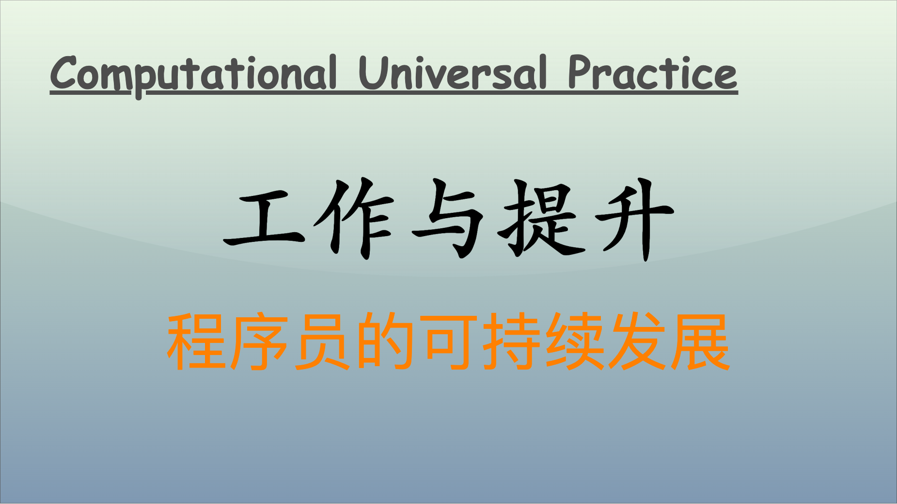

在当今迅速发展的技术世界中，程序员面临着巨大的压力，既要高效完成日常编码工作，又要不断提升自身技能以适应新的挑战。程序员要在日常编码工作与提升式学习之间找到平衡，并不是一件容易的事。然而，技术的不断进步和个人成长是可以共生共赢的，程序员需要在这两个领域中找到适合自己的方法，从而在事业和生活之间架起一座友谊的桥梁。通过高效的编码习惯和适当的时间管理技巧、正确的学习策略，以及合理的职业发展规划，程序员是可以在保持高效工作的同时，实现自我提升的。

## 高效编码习惯与时间管理技巧

高效的编码习惯和良好的时间管理是程序员成功的基石。这里有几种有效的方法可以帮助程序员在忙碌的工作中提高效率，简化流程。

### 代码复用

代码复用是提高生产力的有效策略。通过将公共功能提取到模块、库或组件中，可以减少重复编写代码的时间。这不仅提高了代码的可维护性，还能使新项目启动更为快速。例如：

- **使用开放源代码库**：利用已有的开源库可以加速项目开发。
- **编写通用函数**：构建工具函数库，处理常见的业务逻辑或算法。

### 模块化设计

模块化不仅有助于提升代码的可读性，也使得调试、测试和维护变得更加简单。在设计架构时，可以将功能分解为独立的模块，每个模块专注于特定的任务。这种方式不仅符合企业的需求，也使得团队协作更加高效。

### 时间管理技巧

良好的时间管理能够帮助程序员更好地安排编码与学习时间。以下是一些有效的时间管理技巧：

- **番茄工作法**：将工作时间分成 25 分钟（称为一个番茄钟），专注完成一项任务，随后休息 5 分钟。每完成四个番茄钟后，进行一次长休息。这种方法能够提高专注力，并放松大脑。
- **时间块规划**：在日历中为编码和学习分别分配固定的时间段，保持日常的规律性。确保在工作日中留出时间用于学习新技术、阅读行业文章或进行在线课程学习。
- **优先级划分**：使用四象限法则，将任务分为紧急重要、重要不紧急、紧急不重要和不紧急不重要四类，优先处理紧急和重要的任务，从而减少因琐碎事务而耗费的精力。

### 效率工具的使用

现代工具能够极大地帮助程序员提高效率。例如，使用版本控制系统（如 Git）、自动化构建工具（如 Jenkins）、持续集成工具等，可以减少手动操作的错误，提升开发效率。

## 提升式学习的策略

在技术日新月异的环境中，保持学习是程序员的基本要求。选择适合自己的学习策略使得学习变得高效。

### 选择合适的学习路径

在学习新技术时，程序员应根据自身的职业发展需求和个人兴趣选择合适的学习方向：

- **广泛涉猎**：适合刚入行的程序员，他们需要了解不同的技术栈、框架和工具，从而获得多方面的知识。
- **深入钻研**：对于有一定经验的程序员，专注于某一特定领域（如前端开发、后端开发、机器学习等）可以帮助他们在特定领域中成为专家。

### 制定学习计划

制定量化的学习计划能够帮助程序员保持学习的定期性和目标性。例如：

- 每周学习一个新的技术栈，完成一个小项目。
- 阅读相应的技术书籍或文章，并记录笔记和实践成果。

### 利用在线资源

互联网提供了丰富的学习资源，程序员应善于利用这些资源。例如，在线学习平台如 Coursera、Udacity、Pluralsight 等提供了很多专业课程，帮助程序员系统地了解某一技术。

### 社群参与

参与技术社区和论坛（如 GitHub、Stack Overflow），能够与其他程序员交流经验、解决问题。这不仅有利于获取知识，还可以扩大人际网络，找到兴趣相投的伙伴。

## 职业发展与个人成长的和谐共生

程序员的职业发展阶段各有不同，这可以影响他们的技能要求和学习方向。因此，提前规划和准备是相当重要的。

### 职业发展阶段

不同阶段的程序员需要专注于不同的技能提升：

- **初级阶段**：学习基本的编程语言、数据结构和算法。在这一阶段更多地关注解决实际问题，而非深入的技术细节。
- **中级阶段**：参与复杂项目，学习设计模式、系统架构、数据库管理等。此时可以考虑成为项目的核心成员，负责更大范围的项目。
- **高级阶段**：转向技术领导或架构师角色，需要具备项目管理、团队领导力、技术前瞻性等方面的技能。

### 内部学习机会

程序员在工作中应该主动寻求学习机会。例如，参与项目中的技术难题解决、带领团队完成新的功能，这些都是成长的绝佳机会。同时，鼓励团队分享所学知识，通过团队内的知识分享会提高整体实力。

### 个人成长与生活的平衡

良好的生活习惯对程序员的成长极其重要：

- **保持身心健康**：适当锻炼、均衡饮食、保持充足睡眠有助于保持良好的精神状态，这对提高工作和学习效率是至关重要的。
- **兴趣培养**：培养个人兴趣爱好，不仅能够提升生活的乐趣，也可以提高创造力。可以尝试摄影、音乐、绘画等，帮助释放压力。

当然，还有其他方向可以进一步探讨程序员如何在日常编码工作与提升式学习之间找到平衡。以下是一些额外的方向：

## 实践中的学习与不断反馈

实践是学习最有效的方式之一，通过实际操作来掌握新知识和技能。在编程工作中，如何利用实践中的反馈进行持续优化，可以极大提升学习效果。

### 参与开源项目

参与开源项目是一个极佳的学习方式。透过实际贡献代码，不仅能获得实践经验，还能接触到行业最佳实践、代码审查和协作流程。通过查看他人的代码，程序员可以学习到不同的编程风格和设计理念。

### 持续集成与部署（CI/CD）

在日常编码中实施持续集成与持续部署（CI/CD）能够帮助团队快速反馈代码质量。通过频繁地集成代码和自动化测试，程序员能及时了解代码问题，并从中学习改进。

### 定期代码审查

通过感谢同事对自己代码的审查，不仅可以发现潜在的 bugs，还可以学习到不同的编码标准和技术。定期参与代码审查能够提升团队的整体技能水平，同时帮助个人不断成长。

## 心态与学习哲学

程序员的心态和学习哲学在职业发展中扮演着不可或缺的角色。积极的心态和正确的学习态度能够促进技术的掌握和个人的成长。

### 接受失败与挫折

编程过程中难免会遇到错误和失败。程序员应培养接受失败的心态，将其视为学习的机会。通过分析错误原因，程序员能不断反思自身并迅速成长。

### 制定成长心态（Growth Mindset）

拥抱成长心态，相信能力可以通过努力和学习来提高。这种思维方式促使程序员勇于挑战自我，探索未知，从而在技术上获得突破。

### 重视软技能

除了硬技能，程序员还需要培养软技能如沟通、团队合作和领导力。这些技能有助于在团队中更好地协作，也能更好地传达技术理念。

## 技术与人文的结合

在技术驱动的行业中，程序员也应关注对社会和人文的理解。这种背景不仅能提升职业素养，还能使技术更具人性化。

### 理解业务需求

程序员应努力理解业务背景，与产品经理、设计师沟通，以确保技术解决方案真正满足用户需求。通过参与需求分析与讨论，程序员能从中学习到业务逻辑与架构思维。

### 跨学科学习

跨学科的知识可以扩展程序员的思维边界，例如学习心理学、人机交互、数据可视化等。这有助于从多维度思考问题，从而做出更具创新性的技术选择。

## 长期职业规划与适应变化

技术的迅速变化要求程序员必须具备前瞻性，灵活适应行业发展，从而在职业生涯中走得更远。

### 职业发展路径规划

程序员应有长远的职业发展规划，明确短期和长期目标。例如，可以设定成为技术专才、架构师或管理者的目标，并根据这些目标选择合适的学习及项目经历。

### 紧跟行业变化

关注技术的发展趋势，通过行业媒体、技术博客、白皮书、论文等持续获取新知识。这不仅能增强个人竞争力，也能帮助程序员及时调整学习计划和职业方向。

## 结语

程序员在快速迭代的环境中，不仅需要高效完成日常编码工作，还有必要在实践中持续学习与成长。除了高效编码习惯和提升学习策略，还可以通过反馈循环、心态的建立、跨学科学习以及灵活的职业规划等多方面实现日常工作与个人成长的平衡。无论面对怎样的挑战，持续学习和自我提升始终是程序员职业生涯的重要组成部分。在技术的海洋中，唯有探索和热爱，才能在不断变化的潮流中立于不败之地。

---

**PS：感谢每一位志同道合者的阅读，欢迎关注、点赞、评论！**
